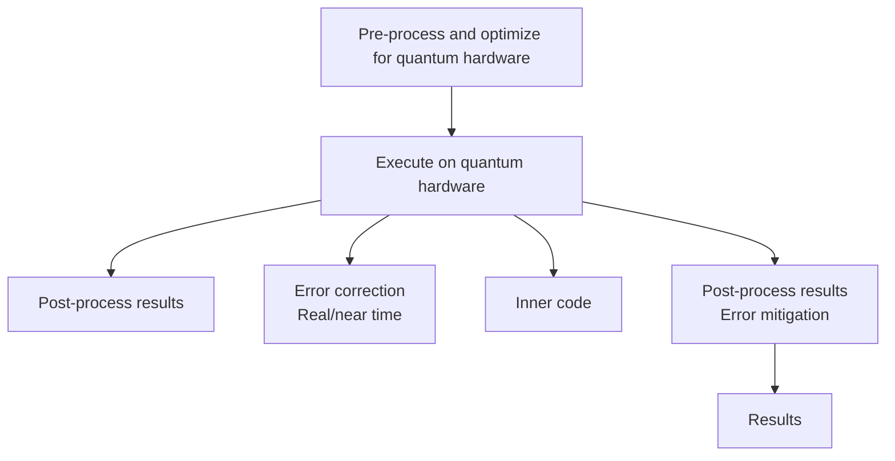

你是知乎商业/行业研究作者，擅长把英文/中文研报改写成适合知乎发布的长文。

【目标】
- 基于下面研报解析内容，生成一篇中文知乎文章。
- 风格接近微信公众号文章，但更适合知乎：论证更完整、语气更克制、有问题意识、有推理链条。
- 文章不需要把研报所有内容讲完，要留下继续阅读完整报告或加入社群讨论的空间。
- 目标长度：约 2200 字，允许上下浮动 20%。

【结构要求】
1. 第一行：知乎标题，直接讲观点，不要标题党，不要夸张极限词。
2. 开头 2-3 段：用一个真实问题或市场分歧切入，说明为什么这份报告值得看。
3. 正文按金字塔原则组织：先给核心判断，再展开 3-5 个支撑逻辑。
4. 每个小标题都要像观点句，不要写“核心判断”“支撑逻辑一”“对读者的启发”这种模板名。
5. 内容要比小红书更理性，比微信更像问答式分析，可以适度提出反问。
6. 结尾自然留下讨论空间，可使用这类表达：`完整报告里还有不少细节，适合放在社群里继续拆。`

【平台发布合规要求】
- 不要出现“投资建议”“买入”“卖出”“强烈推荐”“稳赚”“保本”“必涨”“抄底”“上车”“内幕”“翻倍”等金融操作或收益承诺表达。
- 不要写“非投资建议”“仅做学习交流”这种免责声明，也不要出现包含“投资”的免责声明。
- “投资”相关词尽量改成“投研”“研究”“观察”“学习参考”。
- 不要写“关注”“点赞”“求关注”“评论区留言”等直接互动诱导。
- 不要使用“爆款”“震惊”“必看”“必读”“最强”“最全”“唯一”“全网首发”等极限词。

【内容要求】
- 只能基于研报原文和解析内容推导，不要编造数据、页数、作者、结论或引用。
- 可以基于报告内容做适度发散，但必须明确哪些是报告内容，哪些是你的延展观察。
- 默认避免具体投行品牌名，比如“GS”“GS”，统一写作“投行研报”或使用 GS/JPM/MS 等缩写。
- 不要输出解释说明，只输出知乎文章正文。

【研报解析内容】
"""
# U.S. IT Hardware and EU Semi

# The Quantum Leap: Winners & Losers in the Quantum future

Mark C. Newman

+1 212 845 7822

mark.newman@bernsteinsg.com

David Dai, CFA

+852 2918 5704

david.dai@bernsteinsg.com

Qingyuan Lin, Ph.D.

+852 2123 2654

qingyuan.lin@bernsteinsg.com

April Li

+1 917 344 8339

april.li@bernsteinsg.com

Phoebe Sun

+1 917 344 8481

phoebe.sun@bernsteinsg.com

Carmine Milano, CFA

+44 20 7762 1857

carmine.milano@bernsteinsg.com

This note is a deep dive into Quantum technology and in particular Quantum Computing and assesses different technical approaches and the playing field.

Quantum computing is set to become the next important step in computing. We believe the future of advanced computing will be shaped by a tri-processor architecture composed of CPUs, GPUs, and QPUs. In this model, Quantum computing and QPUs will not replace classical hardware (CPUs and GPUs in traditional and AI servers) but operate as a specialized accelerator, tightly integrated into a broader hybrid quantum-classical system. This is similar to how GPUs have not replaced CPUs.

How does quantum computing work? In quantum computing, once physical qubits are created, quantum algorithms will manipulate these qubits through carefully sequenced operations that create superposition, entangle qubits, and use interference to amplify correct outcomes while canceling incorrect ones. After this controlled evolution, the system is measured, collapsing quantum states into classical bits that encode the solution.

Quantum computing has attracted several big tech companies as well as specialized pure plays. Among the big tech companies, IBM (rated Market-Perform) is arguably the leader, with Google, Microsoft and Intel with meaningful quantum computing initiatives. Geographically we see significant activity from companies and national governments in North America, Europe and China.

We analyze 6 quantum modalities and see three approaches as leading contenders for the Quantum future: 1) Superconducting, arguably today's most commercially advanced and execution-ready technology, driven by rapid development from IBM and Google. 2) Trapped-ion, the modality adopted by the biggest market cap quantum pureplay IONQ, offers the highest precision and stability. Infineon is the leading foundry in trapped ions, supplying QPUs to the largest players in this subsector; and 3) Neutral atom, which provides a highly flexible architecture capable of scaling. The other approaches we are watching closely include: Photonic, Topological and Silicon spin.

Real economic value in quantum computing is likely to be unlocked only after quantum advantage is achieved, which is anticipated to be around 2030. To estimate the implied market share of current quantum pure plays, we discount an estimated \$130bn TAM in 2040, apply SOX P/E multiple of 28x, and use a 30% net margin consistent with mature tech peers. This framework implies a combined market share of the 6 publicly listed pure-plays at 24%, with IONQ (the largest market cap of the six) accounting for \~11% share. These results appear reasonable and support our assumptions.

However, is it too early to call winners and losers? Given that this technology is so early stage, and with some companies still in semi-stealth mode, we believe it is too early to know for sure. For example Photonics, Topological and Silicon spin show promise but are far too early-stage to assess. Furthermore, our analysis shows that quantum computing may not be a winner takes all industry. Different modalities bring distinct strengths and tradeoffs, which should make certain architectures better suited for specific use cases, workloads, and time horizons.

BERNSTEIN TICKER TABLE 

<table><tr><td rowspan="2"></td><td colspan="4">5 Jun 2026</td><td rowspan="2">TTMRel.</td><td colspan="4">Adjusted EPS</td><td colspan="3">Adjusted P/E (x)</td></tr><tr><td>Rating</td><td>Cur</td><td>Closing Price</td><td>Price Target</td><td>Cur</td><td>2025A</td><td>2026E</td><td>2027E</td><td>2025A</td><td>2026E</td><td>2027E</td></tr><tr><td>IBM (IBM)</td><td>M</td><td>USD</td><td>284.84</td><td>280.00</td><td>(17.6)%</td><td>USD</td><td>11.58</td><td>12.35</td><td>13.93</td><td>24.6</td><td>23.1</td><td>20.5</td></tr><tr><td>IFX.GR (Infineon)</td><td>O</td><td>EUR</td><td>74.42</td><td>74.00</td><td>97.7%</td><td>EUR</td><td>1.38</td><td>1.72</td><td>2.63</td><td>53.8</td><td>43.3</td><td>28.3</td></tr><tr><td>SPX</td><td></td><td></td><td>7,383.74</td><td></td><td></td><td></td><td></td><td></td><td></td><td></td><td></td><td></td></tr><tr><td>EDME</td><td></td><td></td><td>1,544.13</td><td></td><td></td><td></td><td></td><td></td><td></td><td></td><td></td><td></td></tr></table>

O - Outperform, M - Market-Perform, U - Underperform, NR - Not Rated, CS - Coverage Suspended   
Source: Bloomberg, Bernstein estimates and analysis.

# INVESTMENT IMPLICATIONS

We rate IBM Market-Perform, PT = USD 280.

We rate Infineon Outperform, PT = EUR 74.

# Table Of Contents

Part I. Future of Computing - Introducing the Tri-Processor Architecture (CPU, GPU, QPU)....3

Part II: What is Quantum Computing? The Tech Basics....5

Part III: What are the Leading Quantum Modalities?......7

Part IV: Introducing the Major Players in Quantum Computing....13

Part V: Quantum Advantage and Real Economic Value....15

Part VI. Quantum TAM and Valuation....16

Part VII. Is it too early to call Winners and Losers?....18

# DETAILS

# PART I. FUTURE OF COMPUTING - INTRODUCING THE TRI-PROCESSOR ARCHITECTURE (CPU, GPU, QPU)

Quantum computing is set to become the next important step in computing. We believe the future of advanced computing will be shaped by a tri-processor architecture composed of CPUs, GPUs, and QPUs (see Exhibit 1). In this model, Quantum Computing and the QPU does not replace classical hardware (CPUs and GPUs in traditional and AI servers). Instead, it operates as a specialized accelerator, tightly integrated into a broader hybrid quantum-classical system. Tasks are dynamically distributed across the CPU, GPU, and QPU based on the nature and complexity of the workload (Exhibit 2). Similar to how GPUs (and AI servers) didn't replace CPUs (and traditional servers) - rather they are complementary and additive; we expect Quantum computing and QPUs will be complementary and additive to classical computing methods (CPUs and GPUs in traditional and AI servers).

- The CPU remains the command center of the system, responsible for executing sequential logic and handling complex branching operations. It oversees system-level coordination, including memory allocation and input-output management, ensuring that all components operate cohesively. In addition, the CPU decomposes large, complex problems into manageable sub-tasks and intelligently determines how to distribute these tasks across the GPU and QPU, assigning each portion of the workload to the processor best suited for efficient execution.   
- The GPU serves as the high-throughput workhorse for classical parallelism, excelling at large-scale tensor operations and intensive numerical computation. It plays a central role in powering machine learning workflows, including training, inference, and optimization pipelines. In a hybrid architecture, the GPU also prepares and transforms data before it is sent to the QPU, ensuring it is in the correct form for quantum execution. When direct access to quantum hardware is limited, the GPU can simulate quantum circuits to approximate behavior and test algorithms. Additionally, it contributes to the reliability of hybrid computations by performing error mitigation, calibration, and verification of QPU outputs, acting as a crucial bridge between classical and quantum processing.   
- The QPU will tackle problems that are fundamentally intractable for classical systems due to their exponential complexity. It excels at solving optimization challenges with vast combinatorial search spaces and simulating quantum systems such as molecules and advanced materials at a level of detail beyond classical capabilities. By executing specialized quantum algorithms - including variational circuits, the Quantum Approximate Optimization Algorithm (QAOA), and Shor-type routines - the QPU can explore complex solution landscapes that classical processors cannot efficiently navigate, offering a powerful tool for addressing some of the hardest computational problems.

IBM is the primary driver of this hybrid paradigm. They explicitly reject the idea of quantum as a standalone system. They have formalized this under a concept they call Quantum-Centric Supercomputing, with reference design provided in March 2026, which maps out a unified environment dividing the compute tiers across high-speed connections (like Ultra Ethernet and NVQLink). On the software front, IBM relies on Qiskit, their open-source software development kit. When a developer writes code in Python using Qiskit, the Qiskit Compiler automatically targets the different execution constraints. It parses the developer's high-level intents, maps the traditional programming loops to the local CPU/GPU cluster, and compiles the complex abstract math directly into targeted hardware instructions for the physical qubits.

NVIDIA's NVOLink establishes an open, hardware-agnostic platform architecture that directly connects GPU-accelerated servers with third-party Quantum Processing Units (QPUs), enabling the QPU to operate as a native co-processor within the same rack. On the software front, NVIDIA provides the architectural allocation layer through CUDA-Q. This single-source programming framework allows developers to write unified C++ or Python code, using its built-in compiler to automatically split workloads—offloading massive AI tensor operations to the GPU, system logic to the CPU, and complex combinatorial algorithms straight to the QPU.

EXHIBIT 1: The Tri-Processor Architecture   

natural_image

Illustration of a microchip with four blue square grids and gold pins on top (no text or symbols)

CPU

natural_image

Close-up of a microchip with gold grid pattern and golden leads (no text or symbols)

GPU

natural_image

Icon of an atom inside a microchip with gold orbital lines, set against a striped background (no text or symbols)

QPU   
Source: Bernstein analysis

EXHIBIT 2: CPU, GPU, QPU architecture, use case comparison 

<table><tr><td>Dimension</td><td>CPU</td><td>GPU</td><td>QPU</td></tr><tr><td>Core concept</td><td>A few powerful cores optimized for sequential, general-purpose logic</td><td>Thousands of simpler cores optimized for massively parallel arithmetic</td><td>Qubits exploiting superposition &amp; entanglement to explore many states at once</td></tr><tr><td>Architecture</td><td>Low core count (4–64), large caches, complex control logic, high clock speeds</td><td>Very high core count (thousands), SIMD/SIMT execution, high memory bandwidth</td><td>Qubits (gate-based or annealing); requires cryogenic cooling / error correction</td></tr><tr><td>Best at</td><td>Branching logic, decision-making, low-latency single-threaded tasks</td><td>Doing the same operation across huge data sets in parallel</td><td>Specific problem classes with exponential/combinatorial complexity</td></tr><tr><td>Compute model</td><td>Deterministic, serial → moderate parallelism</td><td>Deterministic, throughput-oriented parallelism</td><td>Probabilistic; results obtained from repeated measurement (sampling)</td></tr><tr><td>Parallelism</td><td>Low to moderate</td><td>Extremely high (data parallelism)</td><td>Quantum parallelism (fundamentally different — not just &quot;more cores&quot;)</td></tr><tr><td>Tasks best addressed</td><td>OS/application logic, databases, business software, control flow, I/O orchestration</td><td>Deep learning training/inference, graphics rendering, simulations, matrix/vector math, crypto mining</td><td>Quantum chemistry/materials simulation, certain optimization, factoring, quantum sampling/ML research</td></tr><tr><td>Best-fit use cases</td><td>Running operating systems, web/app servers, transactional systems, spreadsheets, general everyday computing</td><td>AI/ML, scientific computing (CFD, weather, molecular dynamics), video/3D rendering, large-scale data analytics</td><td>Molecular &amp; drug discovery, advanced materials, portfolio/logistics optimization, cryptography research, R&amp;D (largely experimental today)</td></tr></table>

Source: Bernstein analysis

EXHIBIT 3: Quantum-classical workflow   

flowchart

Source: IBM

# PART II: WHAT IS QUANTUM COMPUTING? THE TECH BASICS

In quantum computing, once physical qubits are created, quantum algorithms will manipulate these qubits through carefully sequenced operations that create superposition, entangle qubits, and use interference to amplify correct outcomes while canceling incorrect ones. After this controlled evolution, the system is measured, which collapses the quantum states into classical bits that encode the solution. If quantum computing can become powerful and stable enough, their unique computational power will solve problems that are beyond the capabilities of today's supercomputers.

Superposition: Quantum computing differs fundamentally from classical computing because its basic unit, the qubit, can exist in superposition, representing multiple states simultaneously, rather than a single binary 0 or 1 like in classical computing. This allows quantum computing to have a much larger computational space and explore many possible solutions at the same time, whereas classical computing evaluates them sequentially.

Entanglement links qubits, so their states are defined jointly rather than independently, allowing quantum algorithms to encode relationships and constraints between variables that guide interference toward valid solutions, which classical computers must track explicitly and often less efficiently for certain problems.

Interference allows quantum algorithms to amplify correct solutions and suppress incorrect ones by controlling how probability amplitudes combine. Through carefully designed sequences of operations, amplitudes associated with valid outcomes reinforce each other, while those linked to invalid outcomes cancel out. This reshaping of the probability distribution ensures that, upon measurement, the correct or optimal solution is observed with higher likelihood than under classical computing for certain problems.

Measurement is the final step in quantum computation, where the quantum state is observed and collapses into a classical output that can be read by conventional computers. Because quantum information is inherently probabilistic, a single measurement yields the most likely outcome drawn from the probability distribution. By repeating the computation multiple times, the optimal solution emerges statistically.

# Key potential use cases for quantum computing include:

• Material science and chemistry: simulating molecules and reactions for drug discovery, catalysts, and new materials   
- Optimization problems: logistics, scheduling, portfolio optimization, and supply chain routing   
- Cryptography and security: breaking or strengthening encryption schemes   
• Machine learning and AI: accelerating specific linear algebra and sampling tasks   
• Financial modeling: risk analysis and Monte-Carlo simulations where the set of possibilities explode exponentially.

EXHIBIT 4: IBM System Two   

natural_image

Exploded view of a multi-tiered industrial vacuum tube assembly with IBM Quantum branding (no text or symbols on main structure)

Source: Company website

# PART III: WHAT ARE THE LEADING QUANTUM MODALITIES?

Quantum computing is currently being pursued through several hardware approaches, each based on a different physical system for creating and controlling qubits, and each with its own strength, limitation, and maturity curve.

The leading modalities today include:

• Superconducting, which has fast gate speed, scalability, and dominates near-term commercial roadmaps;   
- Trapped-ion, known for exceptional stability but slower speed;   
- Neutral-atom arrays, demonstrating high qubit counts but difficult to achieve high fidelity gates;   
• Photonic, an early-stage technology using optical components;   
• Topological qubits, a high-risk, high-reward path targeting inherently stable quantum information; and   
- Silicon spin qubits have the potential for dense integration of qubits and control electronics, but are slower and harder to control since they rely on manipulating the spin of tiny electrons.

Together, these six approaches capture the core technological landscape shaping the quantum computing industry. We believe Superconducting, Trapped-ion, and Neutral-atom are the leading contenders for the Quantum future - more details below.

EXHIBIT 5: Quantum Computing Modalities 

<table><tr><td>Modality</td><td>Technology</td><td>Pros</td><td>Cons</td><td>Major Players</td></tr><tr><td>Superconducting</td><td>Metal circuits on a chip are cooled to absolute zero, and microwave pulses put the circuit into a quantum state and read it out</td><td>Fast gate speeds and high qubit counts; leverages existing microelectronic lithography.</td><td>Short coherence and high sensitivity to noise; requires extre

[中间内容因长度限制已省略]

egoing in connection with your own internal machine learning or artificial intelligence system.

Bernstein may use artificial intelligence tools in the preparation of its materials. Any such materials are reviewed by Bernstein's research analysts prior to publication.

This report has been prepared for information purposes only and is based on current public information that we consider reliable, but the entities noted herein do not warrant or represent (express or implied) as to the sources of information or data contained herein are accurate, complete, not misleading or as to its fitness for the purpose intended even though the entities noted herein rely on reputable or trustworthy data providers, it should not be relied upon as such. Opinions expressed are the author(s)' current opinions as of the date appearing on the material only and we do not undertake to advise you of any change in the reported information or in the opinions herein.

Any references to SG herein are purely factual, based upon publicly available information, and included for comparative purposes only. They do not constitute an opinion or recommendation with respect to the securities of SG.

This publication was prepared and issued by the entity referred to herein for distribution to eligible counterparties or professional clients. The information in this report is intended for general circulation and does not constitute an offer to buy or sell any security, investment, legal or tax advice nor a personal recommendation, as defined by any of the aforementioned regulators. It does not take into account the particular investment objectives, financial situations, or needs of individual investors. The report has not been reviewed by any of the aforementioned regulators and does not represent any official recommendation from the aforementioned regulators. The investments referred to herein may not be suitable for you. Investors must make their own investment decisions in consultation with advice sought from a financial adviser regarding the suitability of the investment product, taking into account the specific investment objectives, financial situation or particular needs of any recipient of the recommendation, before the recipient makes a commitment to purchase the investment product.

The analysis contained herein is based on numerous assumptions. Different assumptions could result in materially different results. The information in this report does not constitute, or form part of, any offer to sell or issue, or any offer to purchase or subscribe for shares, or to induce engage in any other investment activity. The value of any securities or financial instruments mentioned in this report may fluctuate subject to market conditions. Information about past performance of an investment is not necessarily a guide to, indicative of, or assurance of future performance. Estimates of future performance mentioned by the research analyst in this report are based on assumptions that may not be realized due to unforeseen factors like market volatility/fluctuation. In relation to securities or financial instruments denominated in a foreign currency other than the clients' home currency, movements in exchange rates will have an effect on the value, either favorable or unfavorable. Before acting on any recommendations in this report, recipients should consider the appropriateness of investing in the subject securities or financial instruments mentioned in this report and, if necessary, seek for independent professional advice.

The securities described herein may not be eligible for sale in all jurisdictions or to certain categories of investors where that permission profile is not consistent with the licenses held by the entities noted herein. This document is for distribution only as may be permitted by law. It is not directed to, or intended for distribution to or use by, any person or entity who is a citizen or resident of or located in any locality, state, country or other jurisdiction where such distribution, publication, availability or use would be contrary to law or regulation or would subject the entities noted herein to any regulation or licensing requirement within such jurisdiction.

Source: Bloomberg Index Services Limited. BLOOMBERG® is a trademark and service mark of Bloomberg Finance L.P. and its affiliates (collectively “Bloomberg”). Bloomberg or Bloomberg’s licensors own all proprietary rights in the Bloomberg Indices. Neither Bloomberg nor Bloomberg’s licensors approves or endorses this material, or guarantees the accuracy or completeness of any information herein, or makes any warranty, express or implied, as to the results to be obtained therefrom and, to the maximum extent allowed by law, neither shall have any liability or responsibility for injury or damages arising in connection therewith.

No part of this material may be reproduced, distributed or transmitted or otherwise made available without prior consent of the entities noted herein. Copyright Bernstein Institutional Services LLC Bernstein Autonomous LLP, BSG France S.A., Bernstein (Hong Kong) Limited 盛博香港有限公司, Bernstein (Canada) Limited, Bernstein (India) Private Limited (SEBI registration no. INH000006378), Bernstein (Singapore) Private Limited and Bernstein Japan KK (サンフォード・C・バーンスタイン株式会社). All rights reserved. The trademarks and service marks contained herein are the property of their respective owners. Any unauthorized use or disclosure is strictly prohibited. The entities noted herein may pursue legal action if the unauthorized use results in any defamation and/or reputational risk to the entities noted herein and research published under the Bernstein and Autonomous brands.
"""
