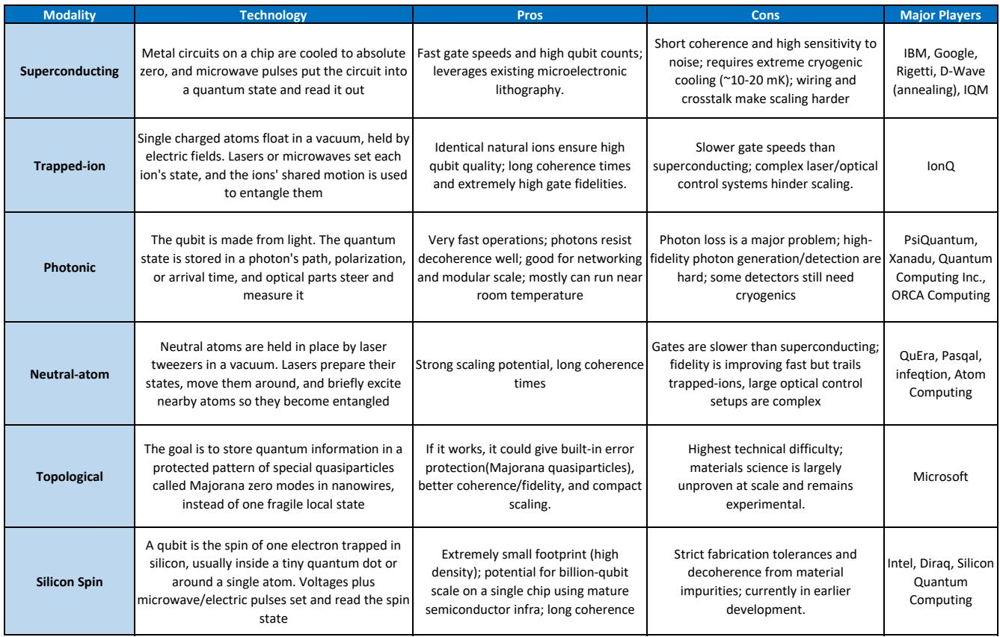
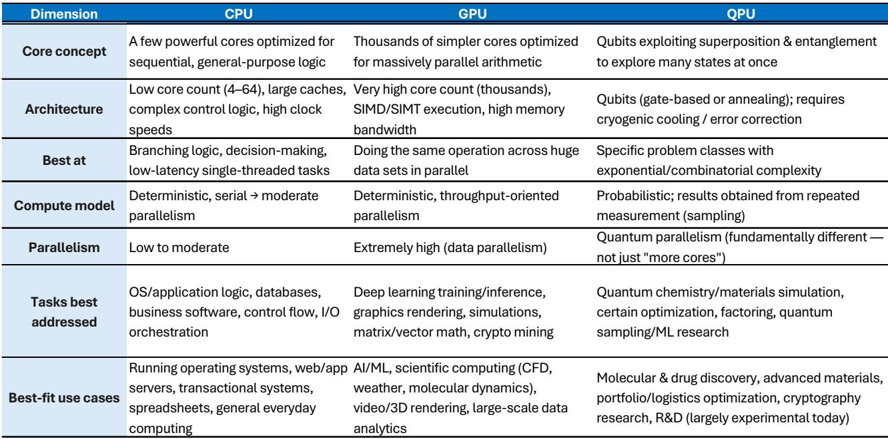
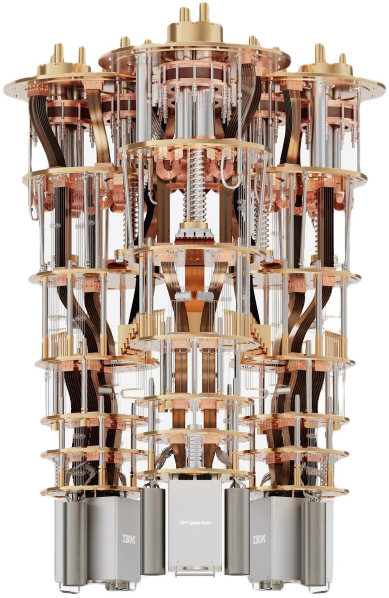

# 量子计算的真正投资逻辑不在于“何时取代经典计算”，而在于“谁在定义混合计算架构的标准”

过去两年，当市场把注意力集中在AI算力的军备竞赛时，一个更为基础的计算架构变革正在悄然推进。某外资投行最新发布的深度研报系统性地论证了一个判断：未来十年，先进计算将进入CPU、GPU和QPU三处理器协同架构的时代。这不是又一个关于量子计算何时“超越”经典计算的乐观预测，而是一个关于计算基础设施如何重组的分析框架。

这份报告之所以值得认真对待，不在于它给出了量子计算何时实现“量子优势”的时间表——2030年这个节点在业内并不新鲜。真正有价值的是它提供了一个分析框架，帮助投资者区分哪些公司正在为这个三处理器世界搭建基础设施，哪些公司只是在这个领域“存在”。市场目前对量子计算的定价，更多基于技术突破的预期，而非对产业基础设施重塑的理解。这意味着，真正被低估的不是量子计算的需求侧，而是供给侧的架构定义权。

报告从六个技术路径入手，逐一评估了它们的成熟度、可扩展性和商业可行性。在超导、离子阱、中性原子、光子、拓扑和硅自旋这六种模态中，报告明确指出超导、离子阱和中性原子是当前最值得关注的三个方向。但比技术对比更重要的，是报告揭示的产业格局：谁在定义硬件标准，谁在构建软件生态，谁在提供关键组件。

以下是对这份研报核心逻辑的拆解与延伸。

## 1. 三处理器架构的真正含义是“量子计算不会独立存在”，这意味着投资标的的筛选标准需要重构

报告开篇就奠定了全文最重要的判断：未来的计算不是量子取代经典，而是CPU、GPU、QPU各司其职、协同工作。这个判断的产业含义远比表面看起来深远。如果量子计算是独立存在的技术，那么投资逻辑就是寻找能够独立实现“量子优势”的公司。但如果量子计算是嵌入在混合计算架构中的加速器，那么投资逻辑就变成了“谁在定义这个混合架构的接口标准”。

报告以IBM和NVIDIA为例，展示了两种不同的架构路径。IBM提出了“量子中心超级计算”概念，通过其开源框架Qiskit实现CPU、GPU、QPU的任务自动分配。NVIDIA则通过NVLink和CUDA-Q框架，让QPU作为GPU机架内的原生协处理器运行。这两种路径的竞争，本质上是在争夺未来计算架构的“操作系统”地位。

对于投资者而言，这意味着需要区分两类公司：一类是正在构建混合计算基础设施的公司，另一类是在这个基础设施上提供应用的公司。前者的价值在于架构锁定效应，后者的价值在于解决具体问题的能力。报告虽然没有直接给出这个判断，但从其分析框架可以合理推导：在量子计算尚未实现大规模商业化之前，基础设施层的公司可能比纯应用层的公司具有更确定的投资价值。

## 2. 超导、离子阱、中性原子“三强格局”已经形成，但不同模态对应的是不同的商业路径和风险收益特征

报告对六种量子计算模态进行了系统比较，并明确将超导、离子阱和中性原子列为“领先竞争者”。这一判断本身并不意外，但报告提供了三个关键洞察，值得深入解读。

第一个洞察是，超导路径虽然商业化程度最高，但其核心挑战——相干时间短、噪声敏感——可能限制其在某些场景下的应用。IBM和Google是这条路径的主要推动者，但它们的路线图依赖于物理量子比特数量的快速增加和纠错技术的突破。这里存在一个尚未被市场充分定价的风险：如果超导路径在2028年前后遇到物理量子比特数量的瓶颈，整个行业的时间表可能面临重新校准。

第二个洞察是，离子阱路径在保真度和稳定性方面具有显著优势，但其速度较慢。这使其更适合对精度要求极高、但对实时性要求不高的应用场景，如量子化学模拟。报告特别指出，英飞凌是离子阱领域领先的代工厂，为这个子领域的最大玩家供应QPU。这一信息本身具有重要含义：在量子计算硬件领域，垂直整合与专业化分工的边界正在形成，而英飞凌的定位意味着它可能成为离子阱路径的“台积电”。

第三个洞察是，中性原子路径虽然门保真度较低，但其架构高度灵活，适合快速扩展量子比特数量。这意味着它可能成为超导和离子阱之间的“中间路径”，在特定应用场景中实现差异化优势。

这三个路径的并存，意味着量子计算不太可能是一个“赢家通吃”的市场。不同模态在速度、精度、可扩展性之间存在明确的权衡关系，这将导致不同架构更适合不同的工作负载和时间窗口。对于投资者而言，这意味着需要根据具体应用场景来评估不同技术路径的商业潜力，而非简单押注某一条路径。

## 3. 2040年1300亿美元TAM的估值框架看似合理，但隐含了一个尚未被充分讨论的关键假设

报告构建了一个估值框架，将量子计算2040年的可寻址市场设定为1300亿美元，并基于这一假设对六家上市纯量子计算公司的隐含市场份额进行了测算。结果显示，IONQ以约11%的份额领先，六家公司的合计份额为24%。报告认为这一结果“合理”，并支持其假设。

这个框架的严谨性值得肯定，但其中隐含的一个假设需要被单独拆解：1300亿美元的TAM是基于量子计算实现“量子优势”后能解决哪些问题来估算的，但报告没有充分讨论的是，不同应用场景的商业化时间表可能差异巨大。例如，量子化学模拟可能在2032年前后率先实现商业价值，而大规模优化问题可能需要等到2035年之后。这种时间上的非均匀分布，意味着不同公司的收入实现路径和现金流折现率可能完全不同。

此外，报告使用的30%净利润率和28倍SOX市盈率，是基于成熟科技公司的对标。但量子计算公司在实现盈利之前，可能需要经历长达10-15年的持续投入期。这意味着当前估值框架中隐含的“稳态利润率”假设，可能与实际路径存在较大偏差。报告本身也承认“现在判断赢家和输家为时过早”，但估值框架的透明性恰恰为投资者提供了一个可以持续检验和修正的基准。

## 4. 真正尚未被回答的关键问题：量子纠错的实现路径和成本曲线仍然不透明

报告在技术部分详细介绍了量子纠错的必要性，但没有充分展开的是，不同技术路径在纠错效率上的差异可能对商业时间表产生重大影响。超导路径需要大量物理量子比特来支撑一个逻辑量子比特，这意味着纠错成本可能成为规模化部署的主要障碍。离子阱路径虽然单量子比特保真度高，但纠错电路的设计和实现仍然面临挑战。

这里有一个关键问题尚未得到充分回答：当纠错成本被纳入考量后，不同模态之间的相对竞争力是否会发生变化？例如，如果超导路径的纠错成本远高于预期，那么离子阱路径的“高保真度”优势可能会被放大，从而改变三强格局的排序。报告没有给出这个问题的答案，但提供了一个分析框架：投资者需要持续跟踪各个公司在纠错效率上的进展，这可能是比量子比特数量更重要的先行指标。

## 5. 一个实用的观察框架：从三个维度评估量子计算公司的竞争地位

基于报告的深入分析，可以提炼出一个三层评估框架，帮助投资者在信息不完整的情况下做出更理性的判断。

第一层是“架构参与度”。公司是否在参与混合计算架构的定义？这包括它们是否拥有自己的QPU设计、是否开发了软件框架、是否与CPU和GPU厂商建立了合作。报告中的IBM和NVIDIA属于这一层，英飞凌作为关键组件供应商也值得关注。

第二层是“技术路径的差异化优势”。公司选择的量子模态是否在某个关键维度上具有不可替代的优势？例如，离子阱的高保真度使其在量子化学模拟中具有天然优势，中性原子的灵活性使其适合快速原型验证。这一层的评估需要结合具体应用场景，而非简单比较量子比特数量。

第三层是“商业化路径的清晰度”。公司是否已经明确了从实验室到产品的转化路径？这包括合作伙伴关系、客户获取进展、以及收入模式的验证。报告指出，当前大多数纯量子计算公司仍处于“半隐身模式”，这意味着商业化路径的透明度是区分“真正有竞争力的公司”和“技术演示公司”的关键指标。

这个框架的价值在于，它不要求投资者在技术细节上成为专家，而是提供了一套可以持续跟踪和验证的判断标准。随着行业信息的积累，这三层评估的结果会逐渐收敛，帮助投资者在不确定性中做出更清晰的判断。

量子计算的产业叙事正在从“何时实现量子优势”转向“谁在构建混合计算架构的基础设施”。这份研报的价值在于，它提供了一个系统性的分析框架，帮助投资者理解这个转型的产业含义。但正如报告明确指出的，现在判断最终赢家仍然为时过早。真正重要的不是预测结果，而是建立一套能够持续跟踪关键变量的观察体系。

关于量子纠错的成本曲线、不同模态在混合架构中的实际性能表现、以及中国在量子计算领域的竞争格局，报告中有更详细的图表和数据分析。这些内容因为篇幅限制无法在此展开，但它们是理解这个产业全貌的关键拼图。

欢迎来星球微信群里继续讨论，一起追踪这些尚未被充分回答的问题。

Personal reading notes and learning share only. Not investment advice.

