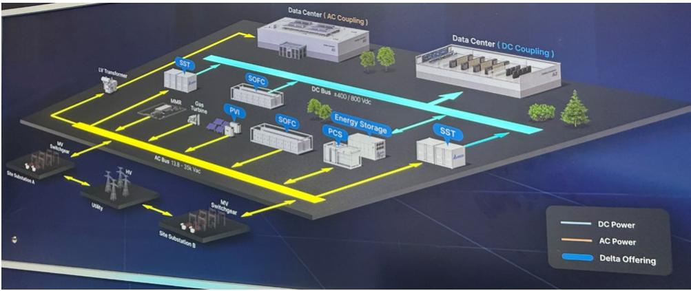
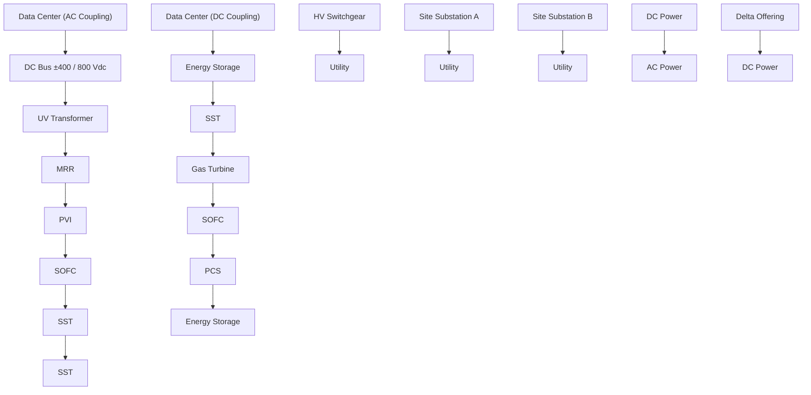
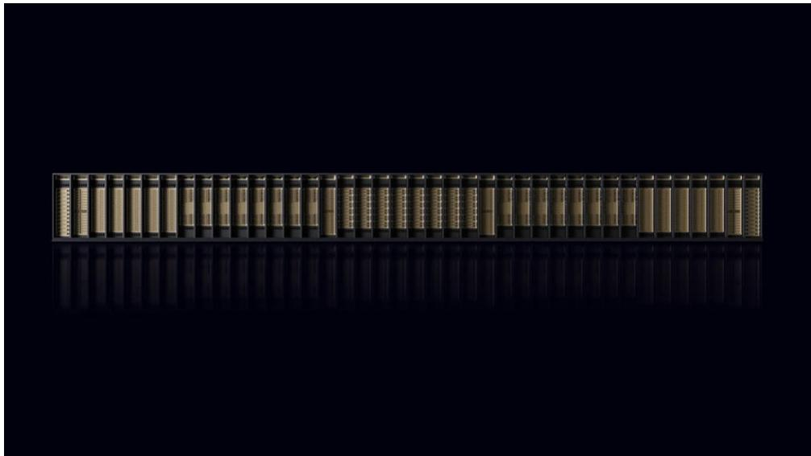
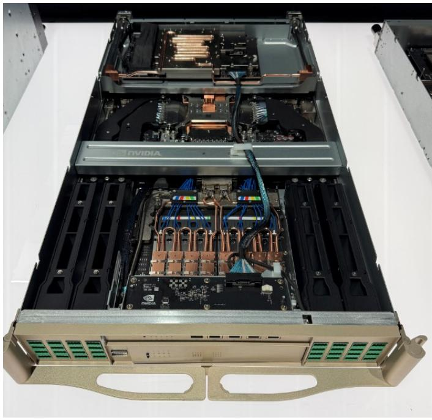

# Asian Tech

2026 Computex Takeaways Part 2

We hosted the JPM Computex booth tour on June 3-4, and our takeaways were:

- Kyber rack timing risk (backplane SI): Our research suggests potential uncertainty/delay for NVIDIA's Kyber GPU rack (mass production targeted for 2H27) due to backplane signal-integrity challenges. We see two alternative designs under evaluation for Rubin Ultra NVL144: (i) two back-to-back interconnected NVL72 racks via cable cartridges, or (ii) NVLink CPO switching. We expect a decision to take time (still \~1.5 years ahead of MP), with key swing factors including M10 CCL qualification progress (link) and CPO switch maturity.   
- VR200 AC/DC PSU upside; VR Ultra mixed: Following recent changes in VR200 liquid-cooling architecture (link), some industry people expect NVIDIA to lower VR200 chip TDP from \~2.3kW to \~1.8kW. While final power may still move, we do not expect this to change rack-level AC/DC PSU configuration (still 4x 110kW power shelves per rack). Separately, NVIDIA has included a HVDC power option (660kW/560kW PSU/BBU) as part of the Vera Rubin NVL144 reference design (per our prior note). At Computex, multiple vendors (e.g., Delta, Lite-On, Flextronics, Vertiv) showcased HVDC offerings. Delta management expects \~20% HVDC adoption in the VR200 generation—implying a higher power-rack adoption rate (regular + high-voltage) versus our prior \~15% assumption—suggesting potential upside to our power-supply revenue TAM estimates next year. The key debate is whether a configuration change in VR Ultra could impact HVDC adoption. Our view is that customers will continue to adopt HVDC power racks even without Kyber, but penetration is unlikely to reach 100% given rising power-component costs (e.g., SiC).

\- Strong general server demand visibility into 2027 due to agentic AI implies upside risk to ASPEED's BMC forecast. ASPEED management is seeing unusually long order visibility into 2027 (vs. a typical \~3 months), which it attributes to accelerating agentic AI-related server build plans. While near-term revenue momentum may be capped by supply constraints, our checks suggest a more meaningful inflection starting 4Q26 as supply improves (link). We see a path to sequential BMC revenue growth through 1H27, supported by resilient server demand, server TAM expansion, and the AST2700 ramp (JPMe: 20–30% penetration by end-2027). Overall, we see potential upside to our 2027E BMC revenue estimates for ASPEED, with additional upside from further pricing actions if supply tightness persists.

\- NVIDIA “Extreme Co-design” Rubin platform supports ASPEED’s BMC TAM expansion: NVIDIA showcased its extreme co-design Rubin reference architecture at Computex, spanning Vera Rubin NVL72 racks, BlueField-4 STX racks (context memory), Vera CPU racks (orchestration/operations), Groq LPU racks (low-latency inference), and scale-up/scale-out InfiniBand/Ethernet switch racks. Under this architecture, we expect a meaningful step-up in NVIDIA AI server BMC demand given the richer, more

# Technology - Hardware

# Albert Hung AC

(886-2) 2725-9875

albert.hung@jpmchase.com

JPM Securities (Taiwan) Limited/ JPM Securities (Asia Pacific) Limited/ JPM Broking (Hong Kong) Limited

# Gokul Hariharan AC

(852) 2800-8564

gokul.hariharan@JPM.com

JPM Securities (Asia Pacific) Limited/ JPM Broking (Hong Kong) Limited

# William Yang AC

(886-2) 2725-9899

william.yang@JPM.com

JPM Securities (Taiwan) Limited

# Anthony Leng

(886-2) 2725-9240

anthony.leng@JPM.com

JPM Securities (Taiwan) Limited

# Jimmy Huang

(886-2) 2725-9865

jimmy.huang@JPM.com

JPM Securities (Taiwan) Limited

modular system configuration (99/53/75 BMCs per Vera CPU/LPU/storage rack). Combined with strong neo-cloud demand, this suggests upside to ASPEED's AI-related BMC content into the Vera Rubin generation. While CSPs may deploy customized designs, we think the broader ecosystem build-out and rising system complexity should continue to be supportive of higher BMC attach rates.

- Vera CPU showing early traction; positive for cooling/BMC vendors, mixed for socket suppliers: Wistron showcased NVIDIA's Vera CPU rack at Computex, in both air-cooled (AC) and liquid-cooled (LC) configurations. The AC version houses 2 Vera CPUs per tray with 16 CPU trays per rack, while the LC version houses 8 Vera CPUs per tray with 32 CPU trays per rack—implying 32 vs. 256 CPUs per rack, respectively, with each CPU's TDP at 250–450W. Our research suggests early traction with select U.S. hyperscalers, with earliest shipments potentially starting around 2Q26, and U.S. server OEMs have also kicked off Vera CPU projects. Our semiconductor team estimates \~600k / \~3.0mn Vera CPU units (including head nodes) in 2026 / 2027, with potential upside. Strong Vera CPU demand is positive for BMC, liquid cooling, and DRAM suppliers, but could be mixed for CPU socket vendors (higher LPDDR5 SOCAMM volumes, but no socket adoption for Vera CPU).   
- AMD Helio systems: ORW form-factor drawbacks likely offset by lower price; potential MP delay: Wiwynn and chassis vendors showcased AMD Helio systems at Computex. The system includes 18 compute trays (with 18 AMD Venice CPUs and 72 AMD MI455 GPUs) and 6 switch trays (with 12 Broadcom Tomahawk 6 scale-up switch chips). Total rack power is \~240kW, supported by six 72kW power shelves (i.e., \~432kW power supply capacity). Helio uses an ORW (Open Rack Wide, 47.25") form factor versus a standard ORv3 (21") rack or NVIDIA's 19" rack—implying lower space efficiency, which we think could be partially offset by lower system pricing. Our checks suggest that multiple U.S. hyperscalers are interested and the platform is still in the design phase. We now expect CSP projects to enter rack-level server mass production in 1H27, while there could be small volumes in late-3Q26 to 4Q26, given a longer-than-expected design cycle for the silicon and UBB.   
- Meaningfully shortened VR assembly cycle via modular, cableless design: Jensen Huang noted that production cycle time for each VR200 NVL72 compute tray has improved to \~5 minutes, from \~2 hours for a GB300 tray, supported by a more modular, cableless architecture. NVIDIA is using a midplane (solely supplied by FIT) to replace PCIe cables, which can reduce cable count, shorten assembly time, and improve yield. NVIDIA is also adopting a more modular compute-tray design—including two HPM (Host Management Board) modules, a midplane, two CX9/OSFP modules, and a PDB/SMM bay—with hot-swappable features that simplify assembly and maintenance. A shorter production cycle implies a faster ramp for the VR200 and is broadly supportive for the NVIDIA supply chain. This could help improve Hon Hai, Quanta, and Wistron yields and reduce working-capital requirements.   
- SiC adoption firming in HVDC; GaN still qualifying: Our research indicates SiC is likely a must-have in 800V HVDC racks (e.g., AC/DC PSUs, e-Fuse modules, and 800V-to-54V DC/DC conversion), while GaN remains under qualification for these use cases and may be used more in lower-voltage conversion due to voltage constraints. NVIDIA is likely qualifying multiple international SiC suppliers (we believe Infineon, STMicroelectronics, Wolfspeed, and potentially Onsemi) to secure supply. We also believe SiC content per PSU could be multiple times that of conventional Si-based power semis. Combined with the potential adoption of circuit breakers (i.e., e-Fuse modules) as a 800V safety mechanism, this implies a meaningful step-up in power-semi content for HVDC power systems—supportive for Delta, power semi vendors, and the broader SiC supply chain. Please refer to our team’s SiC sector note on May 25 (link). We think data centers could contribute US\$400-500mn or less to the SiC device TAM in 2028 or outer years. As the SiC device TAM is already built up by EV and could reach \$4.0-

4.5bn in 2026, we think data center contribution could rise from the current LSD to MSD to HSD within two to three years.

- Faster-than-expected ramp in capacitors through traditional and super capacitors. In order to maintain power stability and improve transient response under increasingly demanding AI workloads, capacitor content in PSUs is rising. As a result, we believe NVIDIA will include 10x+ more aluminum electrolytic capacitors in its upcoming 3RU 110kW power shelf—supportive for traditional capacitor vendors such as Nippon Chemi-Con, Nichicon, and TDK. By contrast, we believe some hyperscalers prefer an independent supercapacitor shelf (coworking with Musashi, 1RU) paired with a 72kW power shelf (1RU) to optimize space utilization.   
- Potential BBU TAM expansion upside. Given the current power-rack BBUs typically support only \~1–2 minutes of ride-through for graceful shutdown (vs. \~5 minutes for UPS), any move by end customers to extend backup duration would mechanically require higher BBU capacity/content—supportive for BBU attach rates and \$/rack. Delta management noted that some customers are evaluating standalone BBU racks to accommodate more BBUs, which would benefit system integrators (e.g., Delta, Lite-On Technology) and battery pack makers (e.g., Dynapack (3211 TT, NC), AES (6781 TT, N, covered by William Yang)).   
- Delta strengthens gray space power solutions; less ambition in liquid cooling. Delta expects to broaden its datacenter power infrastructure offering to include SOFC, SST, PCS, energy storage, PVI, and microgrid/SCADA controllers. Management now targets \~100MW of SOFC deliveries over the next two years; assuming US\$4–5/W, this implies \~US\$400mn of revenue (or \~1% of total revenue). We view this target as conservative given strong customer demand and the widening power supply/demand gap. On SST, management indicated mass production is likely post-HVDC power rack ramp and beyond 2028, broadly aligned with the OCP timeline. In contrast, management reiterated that it will not enter the liquid-cooling gray-space products (e.g., chillers and water facilities); instead, Delta recently announced a partnership with Daikin on datacenter cooling solutions (link).   
- Nvidia's Arm-based AI PC launch - Deja vu of QCOM AI PC in late 2024? Nvidia and Mediatek co-developed and launched the RTX Spark AI PC chip, with general availability in 3Q26. We did not get a chance to use the RTX Spark PC in person during Computex, but we have not yet sensed any meaningful changes to the fundamental ecosystem. We have seen many powerful open agentic AI models (e.g. OpenClaw, Nemotron, Qwen) are on the market now, but they can be fully run on the cloud and may not require powerful edge devices, which could be at a higher price point versus the high-end gaming devices. In addition, there could be lingering compatibility issues with Windows on Arm devices. We believe the key is still the AI killer applications that require a locally-run device and the pricing strategy. Therefore, we believe the AI PC-driven stock price rally could fade post Computex.   
- Multiple 102.4T CPO/NPO projects with various bandwidth designs for scale-up and scale-out fabrics, likely a steep ramp-curve for CPO switch shipments in the next 1–2 years: Wistron and Accton/Edgecore showcased NVIDIA's 102.4T Spectrum-6 photonics switches (128×800G, 32×3.2T OEs) for GPU scale-out fabrics at their Computex booths, with mass production likely later this year or early next year. In addition, Wiwynn showcased a scale-up CPO switch in collaboration with Ayar Labs and GUC. We also met Ayar Labs management during Computex; they expect the 3.2T scale-up CPO switch project to enter mass production in late 2027 to early 2028, which aligns with our view that scale-up CPO switches will ramp later than scale-out CPO switches. Hon Hai expects CPO switch shipments to reach \~10k units this year and to more than double next year. Overall, we expect a fast ramp for CPO switches over the next 1–2 years. Higher margins on switch programs are supportive of ODMs and switch vendors.

Figure 1: Delta's micro-grid total solution   

flowchart

Source: Company data. JPM.

Figure 2: Delta's micro-grid solution elements for datacenter   

text_image

Microgrid Solutions Element for Data Center
On-Site Microgrid Solution
1. Microgrid AC-Coupled Solution - Recruit-ready for existing data centers
2. Microgrid DC-Coupled Solution - Higher system efficiency and faster response time
10~35 kVsc to 800VDC
AC/DC Conversion
Clean Baseload
Frequency / Voltage
Regulate and Backup
DC/AC and
DC/DC Conversion
Real-time Control
Solid State Transformer
(SST)
• MV/LV AC/DC conversion
with higher efficiency than
conventional transformer
• Up to 10MW
Solid Oxide Fuel Cell
(SOFC)
• Multi-fuel capability: hydrogen,
natural gas, ammonia
• Modular deployment for varied
on-site demands
Energy Storage System
(PCS + BESS)
• Mitigates frequency and
voltage fluctuations
• Resilient power backup
DC/AC & DC/DC
Converter
• Battery technology
independence
• Capacity range from kW to MW
Microgrid / SCADA
Controller Families
• Real-time control with
response time less than 4 ms
• Multi-power source
synchronization

Source: Company data. JPM.

Figure 3: Nvidia Vera Rubin Super POD   

natural_image

Pure architectural diagram of a modern building facade with vertical columns and horizontal beams, no text or symbols present.

Source: Company data.

Figure 4: Elements of Nvidia Vera Rubin POD   

text_image

NVIDIA
MGX NVL
NVIDIA Vera Rubin NVL72
NVLink spine
NVIDIA Groq 3 LPX
Direct Chip-to-Chip spine
NVIDIA Vera CPU
Spectrum-X Ethernet spine
NVIDIA BlueField-4 STX Storage
Spectrum-X Ethernet spine
NVIDIA Spectrum-6 SPX
NVIDIA MGX ETL
Fully Configurable up to 256 chips

Source: Company data.

Figure 5: Nvidia's Spectrum-X SN6810 CPO switch   

natural_image

Interior view of a server rack with exposed circuit board and RAM slots (no visible text or labels)

Source: Company data. JPM.

Companies Discussed in This Report (all prices in this report as of market close on 05 June 2026, unless otherwise indicated) ASPEED Technology Inc.(5274.TWO/NT\$17,505.00/OW), Asia Vital Components(3017.TW/NT\$2,600.00/OW), Delta Electronics, Inc.(2308.TW/NT\$2,300.00/OW), Hon Hai Precision(2317.TW/NT\$284.50/OW), Infineon Technologies(IFXGn.DE/€74.42/OW), Inventec(2356.TW/NT\$76.80/N), Nichicon (6996)(6996.T/¥4,375/OW), Nippon Chemi-Con (6997)(6997.T/¥4,980/UW), ON Semiconductor Corporation(ON/\$117.26/N), Pegatron Corp(4938.TW/NT\$96.90/N), Quanta Computer Inc. (2382.TW/NT\$390.50/OW), STMicroelectronics(STMPA.PA/€62.82/N), TDK (6762)(6762.T/¥4,111/OW), Wistron Corporation(3231.TW/NT\$171.00/N), Wiwynn Corp(6669.TW/NT\$5,660.00/OW), Wolfspeed Inc(WOLF/\$55.06/UW)

Analyst Certification: The Research Analyst(s) denoted by an “AC” on the cover of this report certifies (or, where multiple Research Analysts are primarily responsible for this report, the Research Analyst denoted by an “AC” on the cover or within the document individually certifies, with respect to each security or issuer that the Research Analyst covers in this research) that: (1) all of the views expressed in this report accurately reflect the Research Analyst’s personal views about any and all of the subject securities or issuers; and (2) no part of any of the Research Analyst's compensation was, is, or will be directly or indirectly related to the specific recommendations or views expressed by the Research Analyst(s) in this report. For all Korea-based Research Analysts listed on the front cover, if applicable, they also certify, as per KOFIA requirements, that the Research Analyst’s analysis was made in good faith and that the views reflect the Research Analyst’s own opinion, without undue influence or intervention.

All authors named within this report are Research Analysts who produce independent research unless otherwise specified. In Europe, Sector Specialists (Sales and Trading) may be shown on this report as contacts but are not authors of the report or part of the Research Department.

# Important Disclosures

- Market Maker/ Liquidity Provider: JPM is a market maker and/or liquidity provider in the financial instruments of/related to Nichicon (6996), Nippon Chemi-Con (6997), TDK (6762) or related entities.   
- Beneficial Ownership (1% or more): JPM beneficially owns 1% or more of a class of common equity securities of Nippon Chemi-Con (6997) or related entities.   
- Client: JPM currently has, or had within the past 12 months, the following entity(ies) as clients: Nichicon (6996), Nippon Chemi-Con (6997), TDK (6762) or related entities.   
- Client/Non-Investment Banking, Securities-Related: JPM currently has, or had within the past 12 months, the following entity(ies) as clients, and the services provided were non-investment-banking, securities-related: Nichicon (6996), Nippon Chemi-Con (6997), TDK (6762) or related entities.   
- Potential Investment Banking Compensation: JPM expects to receive, or intends to seek, compensation for investment banking services in the next three months from TDK (6762) or related entities.   
• Non-Investment Banking Compensation Received: JPM has received compensation in the past 12 months for products or services other than investment banking from Nichicon (6996), Nippon Chemi-Con (6997), TDK (6762) or related entities.   
- Debt Position: JPM may hold a position in the debt securities of Nichicon (6996), Nippon Chemi-Con (6997), TDK (6762) or related entities, if any.

Company-Specific Disclosures: JPM does and seeks to do business with companies covered in its research reports. As a result, investors should be aware that the firm may have a conflict of interest that could affect the objectivity of this report. Investors should consider this report as only a single factor in making their investment decision. Important disclosures, including price charts and credit opinion history tables (if applicable), are available for compendium reports and all JPM-covered companies, and certain non-covered companies, by visiting https://www.jpmm.com/research/disclosures, calling 1-800-477-0406, or e-mailing research.disclosure.inquiries@JPM.com with your request.

# Explanation of Equity Research Ratings, Designations and Analyst(s) Coverage Universe:

JPM uses the following rating system: Overweight (over the duration of the price target indicated in this report, we expect this stock will outperform the average total return of the stocks in the Research Analyst's, or the Research Analyst's team's, coverage universe); Neutral (over the duration of the price target indicated in this report, we expect this stock will perform in line with the average total return of the stocks in the Research Analyst's, or the Research Analyst's team's, coverage universe); and Underweight (over the duration of the price target indicated in this report, we expect this stock will underperform the average total return of the stocks in the Research Analyst's, or the Research Analyst's team's, coverage universe. NR is Not Rated. In this case, JPM has removed the rating and, if applicable, the price target, for this stock because of either a lack of a sufficient fundamental basis or for legal, regulatory or policy reasons. The previous rating and, if applicable, the price target, no longer should be relied upon. An NR designation is not a recommendation or a rating. Some stocks under coverage have a rating but no price target; in these cases, we expect the stock will outperform/perform in line/underperform the average total return of the stocks in the Research Analyst's, or the Research Analyst's team's, coverage universe of the relevant duration of the region. In our Asia (ex-Australia and ex-India) and U.K. small- and mid-cap Equity Research, each stock's expected total return is compared to the expected total return of a benchmark country market index, not to those Research Analysts' coverage universe. If it does not appear in the Important Disclosures section of this report, the certifying Research Analyst's coverage universe can be found on JPM's Research website, https://www.JPMmarkets.com.

Coverage Universe: Hung, Albert : ASPEED Technology Inc. (5274.TWO), ASUSTek Computer (2357.TW), Compal Electronics, Inc. (2324.TW), Delta Electronics, Inc. (2308.TW), Inventec (2356.TW), Lenovo Group Limited (0992) (0992.HK), Lotes (3533.TW), Micro-Star International Co., Ltd. (2377.TW), Pegatron Corp (4938.TW), Quanta Computer Inc. (2382.TW), VNET Group (VNET), Wistron Corporation (3231.TW), Wiwynn Corp (6669.TW) Hariharan, Gokul : ASE Technology Holding Co Ltd (3711.TW), ASMPT Ltd (0522) (0522.HK), Alchip Technologies (3661.TW), Chipbond Technology (6147.TWO), GDS Holdings (GDS), GUC (3443.TW), Hon Hai Precision (2317.TW), MediaTek Inc. (2454.TW), Novatek Microelectronics Corp. (3034.TW), Powerchip Semiconductor Manufacturing Corp. (6770.TWO), SMIC (0981) (0981.HK), Silicon Motion (SIMO), TSMC (2330.TW), UMC (2303.TW), Vanguard International Semiconductor Corp. (5347.TWO), Xiaomi (1810) (1810.HK) Yang, William : AAC Technologies Holdings (2018) (2018.HK), AP Memory Technology Corp (6531.TW), ASMedia Technology Inc. (5269.TW), Advanced Energy Solution Holding (6781.TW), Advantech (2395.TW), Andes Technology Corp (6533.TW), Asia Vital Components (3017.TW), Auras Technology (3324.TW), Fositek (6805.TW), Genius Electronic Optical Co., Ltd (3406.TW), Jentech Precision Industrial Co. (3653.TW), Klinik (1560.TW), Largan Precision Co Ltd (3008.TW), Parade Technologies (4966.TWO), Realtek Semiconductor (2379.TW), Shin Zu Shing (3376.TW), Silergy Corp (6415.TW), Simplo Technology Co Ltd (6121.TWO), Speed Tech Corp (5457.TWO), Sunny Optical Technology Group Co. (2382) (2382.HK)

JPM Equity Research Ratings Distribution, as of April 04, 2026 

<table><tr><td></td><td>Overweight (buy)</td><td>Neutral (hold)</td><td>Underweight (sell)</td></tr><tr><td>JPM Global Equity Research Coverage*</td><td>51%</td><td>37%</td><td>12%</td></tr><tr><td>IB clients**</td><td>83%</td><td>79%</td><td>74%</td></tr><tr><td>JPMS Equity Research Coverage*</td><td>49%</td><td>39%</td><td>13%</td></tr><tr><td>IB clients**</td><td>94%</td><td>93%</td><td>85%</td></tr></table>

\*Please note that the percentages may not add to 100% because of rounding.

\*\*Percentage of subject companies within each of the "buy," "hold" and "sell" categories for which JPM has provided investment banking services within the previous 12 months.

For purposes of FINRA ratings distribution rules only, our Overweight rating falls into a buy rating category; our Neutral rating falls into a hold rating category; and our Underweight rating falls into a sell rating category. Please note that stocks with an NR designation are not included in the table above. This information is current as of the end of the most recent calendar quarter.

Equity Valuation and Risks: For valuation methodology and risks associated with covered companies or price targets for covered companies, please see the most recent company-specific research report at http://www.JPMmarkets.com, contact the primary analyst or your JPM representative, or email research.disclosure.inquiries@JPM.com. For material information about the proprietary models used, please see the Summary of Financials in company-specific research reports and the Company Tearsheets, which are available to download on the company pages of our client website, http://www.JPMmarkets.com. This report also sets out within it the material underlying assumptions used.

# History of Investment Recommendations:

A history of JPM investment recommendations disseminated during the preceding 12 months can be accessed on the Research & Commentary page of http://www.JPMmarkets.com where you can also search by analyst name, sector or financial instrument.

Analysts' Compensation: The research analysts responsible for the preparation of this report receive compensation based upon various factors, including the quality and accuracy of research, client feedback, competitive factors, and overall firm revenues.

Registration of non-US Analysts: Unless otherwise noted, the non-US analysts listed on the front of this report are employees of non-US affiliates of JPM Securities LLC, may not be registered as research analysts under FINRA rules, may not be associated persons of JPM Securities LLC, and may not be subject to FINRA Rule 2241 or 2242 restrictions on communications with covered companies, public appearances, and trading securities held by a research analyst account.

# Other Disclosures

JPM is a marketing name for investment banking businesses of JPM Chase & Co. and its subsidiaries and affiliates worldwide.

UK MIFID FICC research unbundling exemption: UK clients should refer to UK MIFID Research Unbundling exemption for details of JPM's implementation of the FICC research exemption and guidance on relevant FICC research categorisation.

All research material made available to clients are simultaneously available on our client website, JPM Markets, unless specifically permitted by relevant laws. Not all research content is redistributed, e-mailed or made available to third-party aggregators. For all research material available on a particular stock, please contact your sales representative.

Any long form nomenclature for references to China; Hong Kong; Taiwan; and Macau within this research material are Mainland China; Hong Kong SAR (China); Taiwan (China); and Macau SAR (China).

JPM may, from time to time, write on issuers or securities targeted by economic or financial sanctions imposed or administered by the governmental authorities of the U.S., EU, UK or other relevant jurisdictions (Sanctioned Securities). Nothing in this report is intended to be read or construed as encouraging, facilitating, promoting or otherwise approving investment or dealing in such Sanctioned Securities. Clients should be aware of their own legal and compliance obligations when making investment decisions.

Any digital or crypto assets discussed in this research report are subject to a rapidly changing regulatory landscape. For relevant regulatory advisories on crypto assets, including bitcoin and ether, please see https://www.JPM.com/disclosures/cryptoasset-disclosure.

The author(s) of this research report may not be licensed to carry on regulated activities in your jurisdiction and, if not licensed, do not hold themselves out as being able to do so.

Exchange-Traded Funds (ETFs): JPM Securities LLC (“JPMS”) acts as authorized participant for substantially all U.S.-listed ETFs. To the extent that any ETFs are mentioned in this report, JPMS may earn commissions and transaction-based compensation in connection with the distribution of those ETF shares and may earn fees for performing other trade-related services, such as securities lending to short sellers of the ETF shares. JPMS may also perform services for the ETFs themselves, including acting as a broker or dealer to the ETFs. In addition, affiliates of JPMS may perform services for the ETFs, including trust, custodial, administration, lending, index calculation and/or maintenance and other services.

Options and Futures related research: If the information contained herein regards options- or futures-related research, such information is available only to persons who have received the proper options or futures risk disclosure documents. Please contact your JPM Representative or visit https://www.theocc.com/components/docs/riskstoc.pdf for a copy of the Option Clearing Corporation's Characteristics and Risks of Standardized Options or

https://www.finra.org/sites/default/files/2020-08/Security\_Futures\_Risk\_Disclosure\_Statement\_2020.pdf for a copy of the Security Futures Risk Disclosure Statement.

Changes to Interbank Offered Rates (IBORs) and other benchmark rates: Certain interest rate benchmarks are, or may in the future become, subject to ongoing international, national and other regulatory guidance, reform and proposals for reform. For more information, please consult: https://www.JPM.com/global/disclosures/interbank\_offered\_rates

Private Bank Clients: Where you are receiving research as a client of the private banking businesses offered by JPM Chase & Co. and its subsidiaries (“JPM Private Bank”), research is provided to you by JPM Private Bank and not by any other division of JPM, including, but not limited to, the JPM Corporate and Investment Bank and its Global Research division.

Legal entity responsible for the production and distribution of research: The legal entity identified below the name of the Reg AC Research Analyst who authored this material is the legal entity responsible for the production of this research. Where multiple Reg AC Research Analysts authored this material with different legal entities identified below their names, these legal entities are jointly responsible for the production of this research. Where more than one legal entity is listed under an analyst's name, the first legal entity is responsible for the production unless stated otherwise. Research Analysts from various JPM affiliates may have contributed to the production of this material but may not be licensed to carry out regulated activities in your jurisdiction (and do not hold themselves out as being able to do so). Unless otherwise stated below in the legal entity disclosures, this material has been distributed by the legal entity responsible for production, or where more than one legal entity is listed under the analyst's name, the first legal entity will be responsible for distribution. If you have any queries, please contact the relevant Research Analyst in your jurisdiction or the entity in your jurisdiction that has distributed this research material.

# Legal Entities Disclosures and Country-/Region-Specific Disclosures:

Argentina: JPM Chase Bank N.A Sucursal Buenos Aires is regulated by Banco Central de la República Argentina (“BCRA”- Central Bank of Argentina) and Comisión Nacional de Valores (“CNV”- Argentinian Securities Commission - ALYC y AN Integral N°51).

Australia: JPM Securities Australia Limited (“JPMSAL”) (ABN 61 003 245 234/AFS Licence No: 238066) is regulated by the Australian Securities and Investments Commission and is a Market Participant of ASX Limited, a Clearing and Settlement Participant of ASX Clear Pty Limited and a Clearing Participant of ASX Clear (Futures) Pty Limited. This material is issued and distributed in Australia by or on behalf of JPMSAL only to "wholesale clients" (as defined in section 761G of the Corporations Act 2001). A list of all financial products covered can be found by visiting https://www.jpmm.com/research/disclosures. JPM seeks to cover companies of relevance to the domestic and international investor base across all Global Industry Classification Standard (GICS) sectors, as well as across a range of market capitalisation sizes. If applicable, in the course of conducting public side due diligence on the subject company(ies), the Research Analyst team may at times perform such diligence through corporate engagements such as site visits, discussions with company representatives, management presentations, etc. Research issued by JPMSAL has been prepared in accordance with JPM Australia’s Research Independence Policy which can be found at the following link: JPM Australia - Research Independence Policy.

Brazil: Banco JPM S.A. is regulated by the Comissao de Valores Mobiliarios (CVM) and by the Central Bank of Brazil. Ombudsman JPM: 0800-7700847 / 0800-7700810 (For Hearing Impaired) / ouvidoria.jp.morgan@jpmchase.com.

Canada: JPM Securities Canada Inc. is a registered investment dealer, regulated by the Canadian Investment Regulatory Organization and the Ontario Securities Commission and is the participating member on Canadian exchanges. This material is distributed in Canada by or on behalf of JPM Securities Canada Inc.

Chile: Inversiones JPM Limitada is an unregulated entity incorporated in Chile.

China: JPM Securities (China) Company Limited has been approved by CSRC to conduct the securities investment consultancy business.

Colombia: Banco JPM Colombia S.A. is supervised by the Superintendencia Financiera de Colombia (SFC). Any reference in this material to products or services offered abroad by entities other than the Bank in Colombia is included exclusively for descriptive purposes. Such references do not constitute, and should not be construed as, promotional activity or the provision of financial products or services within Colombian territory, as defined under applicable Colombian regulation.

Dubai International Financial Centre (DIFC): JPM Chase Bank, N.A., Dubai Branch is regulated by the Dubai Financial Services Authority (DFSA) and its registered address is Dubai International Financial Centre - The Gate, West Wing, Level 3 and 9 PO Box 506551, Dubai, UAE. This material has been distributed by JPM Chase Bank, N.A., Dubai Branch to persons regarded as professional clients or market counterparties as defined under the DFSA rules.

European Economic Area (EEA): Unless specified to the contrary, research is distributed in the EEA by JPM SE (“JPM SE”), which is authorised as a credit institution by the Federal Financial Supervisory Authority (Bundesanstalt für Finanzdienstleistungsaufsicht, BaFin) and jointly supervised by the BaFin, the German Central Bank (Deutsche Bundesbank) and the European Central Bank (ECB). JPM SE is a company headquartered in Frankfurt with registered address at TaunusTurm, Taunustor 1, Frankfurt am Main, 60310, Germany. The material has been distributed in the EEA to persons regarded as professional investors (or equivalent) pursuant to Art. 4 para. 1 no. 10 and Annex II of MiFID II and its respective implementation in their home jurisdictions (“EEA professional investors”). This material must not be acted on or relied on by persons who are not EEA professional investors. Any investment or investment activity to which this material relates is only available to EEA relevant persons and will be engaged in only with EEA relevant persons.

Hong Kong: JPM Securities (Asia Pacific) Limited (CE number AAJ321) is regulated by the Hong Kong Monetary Authority and the Securities and Futures Commission in Hong Kong, and JPM Broking (Hong Kong) Limited (CE number AAB027) is regulated by the Securities and Futures Commission in Hong Kong. JPM Chase Bank, N.A., Hong Kong Branch (CE Number AAL996) is regulated by the Hong Kong Monetary Authority and the Securities and Futures Commission, is organized under the laws of the United States with limited liability. Where the distribution of this material is a regulated activity in Hong Kong, the material is distributed in Hong Kong by or through JPM Securities (Asia Pacific) Limited and/or JPM Broking (Hong Kong) Limited.

India: JPM India Private Limited (Corporate Identity Number - U67120MH1992FTC068724), having its registered office at JPM Tower, Off. C.S.T. Road, Kalina, Santacruz - East, Mumbai – 400098, is registered with the Securities and Exchange Board of India (SEBI) as a 'Research Analyst' having registration number INH000001873. JPM India Private Limited is also registered with SEBI as a member of the National Stock Exchange of India Limited and the Bombay Stock Exchange Limited (SEBI Registration Number – INZ000239730) and as a Merchant Banker (SEBI Registration Number - MB/INM000002970). Telephone: 91-22-6157 3000, Facsimile: 91-22-6157 3990 and Website: http://www.jpmipl.com. JPM Chase Bank, N.A. - Mumbai Branch is licensed by the Reserve Bank of India (RBI) (Licence No. 53/Licence No. BY.4/94; SEBI - IN/CUS/014/ CDSL : IN-DP-CDSL-444-2008/ IN-DP-NSDL-285-2008/ INBI00000984/ INE231311239) as a Scheduled Commercial Bank in India, which is its primary license allowing it to carry on Banking business in India and other activities, which a Bank branch in India are permitted to undertake. For non-local research material, this material is not distributed in India by JPM India Private Limited. Compliance Officer: Ashutosh Sharma; ashutosh.j.sharma@jpmchase.com; +912261575002. Grievance Officer: Ramprasadh K, jpmipl.research.feedback@JPM.com; +912261573000. Registration granted by SEBI and certification from NISM in no way guarantee performance of the intermediary or provide any assurance of returns to investors. Please visit Terms and Conditions and Most Important Terms and Conditions (MITC). The annual Compliance audit report is available at http://www.jpmipl.com/#research.

Indonesia: PT JPM Sekuritas Indonesia is a member of the Indonesia Stock Exchange and is registered and supervised by the Otoritas Jasa Keuangan (OJK).

Korea: JPM Securities (Far East) Limited, Seoul Branch, is a member of the Korea Exchange (KRX). JPM Chase Bank, N.A., Seoul Branch, is licensed as a branch office of foreign bank (JPM Chase Bank, N.A.) in Korea. Both entities are regulated by the Financial Services Commission (FSC) and the Financial Supervisory Service (FSS). For non-macro research material, the material is distributed in Korea by or through JPM Securities (Far East) Limited, Seoul Branch.

Japan: JPM Securities Japan Co., Ltd. and JPM Chase Bank, N.A., Tokyo Branch are regulated by the Financial Services Agency in Japan.

Malaysia: This material is issued and distributed in Malaysia by JPM Securities (Malaysia) Sdn Bhd (18146-X), which is a Participating Organization of Bursa Malaysia Berhad and holds a Capital Markets Services License issued by the Securities Commission in Malaysia.

Mexico: JPM Casa de Bolsa, S.A. de C.V., JPM Grupo Financiero is member of the Mexican Stock Exchange (“Bolsa Mexicana de Valores”) and the Institutional Stock Exchange (“Bolsa Institucional de Valores”), and it is authorized to act as a broker dealer by the National Banking and Securities Exchange Commission (“Comisión Nacional Bancaria y de Valores”).

New Zealand: This material is issued and distributed by JPMSAL in New Zealand only to "wholesale clients" (as defined in the Financial Markets Conduct Act 2013). JPMSAL is registered as a Financial Service Provider under the Financial Service providers (Registration and Dispute Resolution) Act of 2008.

Philippines: JPM Securities Philippines Inc. is a Trading Participant of the Philippine Stock Exchange and a member of the Securities Clearing Corporation of the Philippines and the Securities Investor Protection Fund. It is regulated by the Securities and Exchange Commission.

Singapore: This material is issued and distributed in Singapore by or through JPM Securities Singapore Private Limited (JPMSS) [MDDI (P) 057/08/2025 and Co. Reg. No.: 199405335R], which is a member of the Singapore Exchange Securities Trading Limited, and/or JPM Chase Bank, N.A., Singapore branch (JPMCB Singapore), both of which are regulated by the Monetary Authority of Singapore. This material is issued and distributed in Singapore only to accredited investors, expert investors and institutional investors, as defined in Section 4A of the Securities and Futures Act, Cap. 289 (SFA). This material is not intended to be issued or distributed to any retail investors or any other investors that do not fall into the classes of “accredited investors,” “expert investors” or “institutional investors,” as defined under Section 4A of the SFA. Recipients of this material in Singapore are to contact JPMSS or JPMCB Singapore in respect of any matters arising from, or in connection with, the material.

South Africa: JPM Equities South Africa Proprietary Limited and JPM Chase Bank, N.A., Johannesburg Branch are members of the Johannesburg Securities Exchange and are regulated by the Financial Services Conduct Authority (FSCA).

Taiwan: JPM Securities (Taiwan) Limited is a participant of the Taiwan Stock Exchange (company-type) and regulated by the Taiwan Securities and Futures Bureau. Material relating to equity securities is issued and distributed in Taiwan by JPM Securities (Taiwan) Limited, subject to the license scope and the applicable laws and the regulations in Taiwan. To the extent that JPM Securities (Taiwan) Limited produces research materials on securities not listed on the Taiwan Stock Exchange or Taipei Exchange (“Non-Taiwan Listed Securities”), these materials shall not constitute securities recommendations for the purpose of applicable Taiwan regulations, and, for the avoidance of doubt, JPM Securities (Taiwan) Limited does not act as broker for Non-Taiwan Listed Securities. According to Paragraph 2, Article 7-1 of Operational Regulations Governing Securities Firms Recommending Trades in Securities to Customers (as amended or supplemented) and/or other applicable laws or regulations, please note that the recipient of this material is not permitted to engage in any activities in connection with the material that may give rise to conflicts of interests, unless otherwise disclosed in the “Important Disclosures” in this material.

Thailand: This material is issued and distributed in Thailand by JPM Securities (Thailand) Ltd., which is a member of the Stock Exchange of Thailand and is regulated by the Ministry of Finance and the Securities and Exchange Commission. The registered address is 548 One City Center Building, 50th Floor, Ploenchit Road, Lymphini, Pathum Wan, Bangkok 10330.

UK: Research is produced in the UK by JPM Securities plc (“JPMS plc”) which is a member of the London Stock Exchange and is authorised by the Prudential Regulation Authority and regulated by the Financial Conduct Authority and the Prudential Regulation Authority or JPM Markets Limited (“JPMML Ltd”) which is authorised and regulated by the Financial Conduct Authority. Unless specified to the contrary, this material is distributed in the UK by JPMS plc and is directed in the UK only to: (a) persons having professional experience in matters relating to investments falling within article 19(5) of the Financial Services and Markets Act 2000 (Financial Promotion) (Order) 2005 (“the FPO”); (b) persons outlined in article 49 of the FPO (high net worth companies, unincorporated associations or partnerships, the trustees of high value trusts, etc.); or (c) any persons to whom this communication may otherwise lawfully be made; all such persons being referred to as "UK relevant persons". This material must not be acted on or relied on by persons who are not UK relevant persons. Any investment or investment activity to which this material relates is only available to UK relevant persons and will be engaged in only with UK relevant persons. A description of JPM EMEA’s policy for prevention and avoidance of conflicts of interest related to the production of Research can be found at the following link: JPM EMEA - Research Independence Policy.

U.S.: JPM Securities LLC (“JPMS”) is a member of the NYSE, FINRA, SIPC, and the NFA. JPM Chase Bank, N.A. is a member of the FDIC. Material published by non-U.S. affiliates is distributed in the U.S. by JPMS who accepts responsibility for its content.

General: Additional information is available upon request. The information in this material has been obtained from sources believed to be reliable. While all reasonable care has been taken to ensure that the facts stated in this material are accurate and that the forecasts, opinions and expectations contained herein are fair and reasonable, JPM Chase & Co. or its affiliates and/or subsidiaries (collectively JPM) make no representations or warranties whatsoever to the completeness or accuracy of the material provided, except with respect to any disclosures relative to JPM and the Research Analyst's involvement with the issuer that is the subject of the material. Accordingly, no reliance should be placed on the accuracy, fairness or completeness of the information contained in this material. There may be certain discrepancies with data and/or limited content in this material as a result of calculations, adjustments, translations to different languages, and/or local regulatory restrictions, as applicable. These discrepancies should not impact the overall investment analysis, views and/or recommendations of the subject company(ies) that may be discussed in the material. Artificial intelligence tools may have been used in the preparation of this material, including assisting in data analysis, pattern recognition, and content drafting for research material. JPM accepts no liability whatsoever for any loss arising from any use of this material or its contents, and neither JPM nor any of its respective directors, officers or employees, shall be in any way responsible for the contents hereof, apart from the liabilities and responsibilities that may be imposed on them by the relevant regulatory authority in the jurisdiction in question, or the regulatory regime thereunder. Opinions, forecasts or projections contained in this material represent JPM's current opinions or judgment as of the date of the material only and are therefore subject to change without notice. Periodic updates may be provided on companies/industries based on company-specific developments or announcements, market conditions or any other publicly available information. There can be no assurance that future results or events will be consistent with any such opinions, forecasts or projections, which represent only one possible outcome. Furthermore, such opinions, forecasts or projections are subject to certain risks, uncertainties and assumptions that have not been verified, and future actual results or events could differ materially. The value of, or income from, any investments referred to in this material may fluctuate and/or be affected by changes in exchange rates. All pricing is indicative as of the close of market for the securities discussed, unless otherwise stated. Past performance is not indicative of future results. Accordingly, investors may receive back less than originally invested. This material is not intended as an offer or solicitation for the purchase or sale of any financial instrument. The opinions and recommendations herein do not take into account individual client circumstances, objectives, or needs and are not intended as recommendations of particular securities, financial instruments or strategies to particular clients. This material may include views on structured securities, options, futures and other derivatives. These are complex instruments, may involve a high degree of risk and may be appropriate investments only for sophisticated investors who are capable of understanding and assuming the risks involved. The recipients of this material must make their own independent decisions regarding any securities or financial instruments mentioned herein and should seek advice from such independent financial, legal, tax or other adviser as they deem necessary. JPM may trade as a principal on the basis of the Research Analysts' views and research, and it may also engage in transactions for its own account or for its clients' accounts in a manner inconsistent with the views taken in this material, and JPM is under no obligation to ensure that such other communication is brought to the attention of any recipient of this material. Others within JPM, including Strategists, Sales staff and other Research Analysts, may take views that are inconsistent with those taken in this material. Employees of JPM not involved in the preparation of this material may have investments in the securities (or derivatives of such securities) mentioned in this material and may trade them in ways different from those discussed in this material. This material is not an advertisement for or marketing of any issuer, its products or services, or its securities in any jurisdiction.

Confidentiality and Security Notice: This transmission may contain information that is privileged, confidential, legally privileged, and/or exempt from disclosure under applicable law. If you are not the intended recipient, you are hereby notified that any disclosure, copying, distribution, or use of the information contained herein (including any reliance thereon) is STRICTLY PROHIBITED. Although this transmission and any attachments are believed to be free of any virus or other defect that might affect any computer system into which it is received and opened, it is the responsibility of the recipient to ensure that it is virus free and no responsibility is accepted by JPM Chase & Co., its subsidiaries and affiliates, as applicable, for any loss or damage arising in any way from its use. If you received this transmission in error, please immediately contact the sender and destroy the material in its entirety, whether in electronic or hard copy format. This message is subject to electronic monitoring: https://www.JPM.com/disclosures/email

MSCI: Certain information herein (“Information”) is reproduced by permission of MSCI Inc., its affiliates and information providers (“MSCI”) ©2026. No reproduction or dissemination of the Information is permitted without an appropriate license. MSCI MAKES NO EXPRESS OR IMPLIED WARRANTIES (INCLUDING MERCHANTABILITY OR FITNESS) AS TO THE INFORMATION AND DISCLAIMS ALL LIABILITY TO THE EXTENT PERMITTED BY LAW. No Information constitutes investment advice, except for any applicable Information from MSCI ESG Research. Subject also to msci.com/disclaimer

Sustainalytics: Certain information, data, analyses and opinions contained herein are reproduced by permission of Sustainalytics and: (1) includes the proprietary information of Sustainalytics; (2) may not be copied or redistributed except as specifically authorized; (3) do not constitute investment advice nor an endorsement of any product or project; (4) are provided solely for informational purposes; and (5) are not warranted to be complete, accurate or timely. Sustainalytics is not responsible for any trading decisions, damages or other losses related to it or its use. The use of the data is subject to conditions available at https://www.sustainalytics.com/legal-disclaimers. ©2026 Sustainalytics. All Rights Reserved.

"Other Disclosures" last revised May 16, 2026.

Copyright 2026 JPM Chase & Co. All rights reserved. This material or any portion hereof may not be reprinted, sold or redistributed without the written consent of JPM. It is strictly prohibited to use or share without prior written consent from JPM any research material received from JPM or an authorized third-party (“JPM Data”) in any third-party artificial intelligence (“AI”) systems or models when such JPM Data is accessible by a third-party.

Completed 07 Jun 2026 02:50 PM HKT

Disseminated 07 Jun 2026 02:50 PM HKT