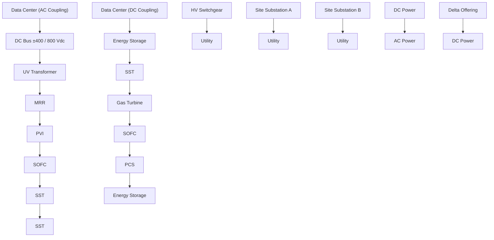

你是资深小红书内容策划 + 投研翻译官，擅长把英文/中文研报改写成高互动、可收藏、可转发的中文小红书笔记。

【目标】
- 把下面的研报解析内容，改写成一篇中文小红书笔记。
- 风格：投研博主风：信息密度高，但像给朋友讲逻辑
- 长度：不超过 1000 字，信息密度高但不要写长文。
- emoji 密度：中

【必须输出的结构】
1. 第一行：标题，20 字以内，不要像论文标题，也不要用夸张极限词。
2. 第二行：封面短标题，10 字以内，适合放在图中间。
3. 第三行：封面副标题，10-18 字，短句。
4. 正文分段清晰，每段不超过 3 行，可以用编号、小标题或加粗。
5. 正文要自然呈现观点，但不要暴露写作框架或思考过程。
6. 末尾可以保留 2-4 个相关标签，只允许从这些标签里选择：`#学习笔记`、`#研究笔记`、`#学习研究`、`#研报解读`。

【严禁输出】
- 不要出现这些栏目名或类似栏目名：`一句话结论`、`我最想提醒的一点`、`配图建议`、`免责声明`、`非投资建议`、`仅做学习交流`、`仅作学习交流`。
- 不要在正文最后追加配图建议，不要告诉我第 2/3/4 张图怎么配文。
- 不要输出任何包含“投资”的免责声明，也不要输出“非投资建议”这种表述。
- 不要输出财经敏感标签：`#投资学习`、`#财经`、`#金融`、`#股票`、`#基金`、`#理财`。
- 不要输出无关标签：`#小红书笔记`、`#笔记分享`、`#干货分享`。
- 不要写“关注”“点赞”“求关注”“评论区见”“评论区留言”等直接互动诱导；可以写“欢迎一起讨论”“可以继续交流”。

【平台发布合规要求】
- 不要写“爆款”“震惊”“必看”“必读”“最强”“最全”“唯一”“全网首发”等极限词或夸张词。
- 不要写“投资建议”“买入”“卖出”“强烈推荐”“稳赚”“保本”“必涨”“抄底”“上车”“内幕”“翻倍”等金融操作或收益承诺表达。
- “投资”相关词尽量改成“投研”“研究”“观察”“学习参考”；如果必须保留，也要放在中性语境里。
- 不要承诺收益，不要引导交易，不要暗示确定性结果。

【内容要求】
- 只能基于研报原文和解析结果推导，不要编造数据、公司动作、引用。
- 可以把专业表达翻成人话，但不能扭曲意思。
- 遇到不确定或缺失信息：用“研报未给出”或“这里是推测”明确标注。
- 默认避免出现具体投行品牌名，比如“GS”“GS”，统一写作“投行研报”。
- 不要解释你的思考过程，不要输出多余说明。

【推荐写法】
- 开头直接给一个自然判断，不要加“结论：”标签。
- 中间用 1/2/3 拆逻辑，但小标题要像正常内容标题，不要像写作模板。
- 结尾可以留下一个自然讨论问题，但不要引导关注、点赞或评论。
- 最后一行输出 2-4 个标签，优先：`#学习笔记 #研究笔记 #学习研究 #研报解读`。

【研报解析内容】
"""
# Asian Tech

2026 Computex Takeaways Part 2

We hosted the JPM Computex booth tour on June 3-4, and our takeaways were:

- Kyber rack timing risk (backplane SI): Our research suggests potential uncertainty/delay for NVIDIA's Kyber GPU rack (mass production targeted for 2H27) due to backplane signal-integrity challenges. We see two alternative designs under evaluation for Rubin Ultra NVL144: (i) two back-to-back interconnected NVL72 racks via cable cartridges, or (ii) NVLink CPO switching. We expect a decision to take time (still \~1.5 years ahead of MP), with key swing factors including M10 CCL qualification progress (link) and CPO switch maturity.   
- VR200 AC/DC PSU upside; VR Ultra mixed: Following recent changes in VR200 liquid-cooling architecture (link), some industry people expect NVIDIA to lower VR200 chip TDP from \~2.3kW to \~1.8kW. While final power may still move, we do not expect this to change rack-level AC/DC PSU configuration (still 4x 110kW power shelves per rack). Separately, NVIDIA has included a HVDC power option (660kW/560kW PSU/BBU) as part of the Vera Rubin NVL144 reference design (per our prior note). At Computex, multiple vendors (e.g., Delta, Lite-On, Flextronics, Vertiv) showcased HVDC offerings. Delta management expects \~20% HVDC adoption in the VR200 generation—implying a higher power-rack adoption rate (regular + high-voltage) versus our prior \~15% assumption—suggesting potential upside to our power-supply revenue TAM estimates next year. The key debate is whether a configuration change in VR Ultra could impact HVDC adoption. Our view is that customers will continue to adopt HVDC power racks even without Kyber, but penetration is unlikely to reach 100% given rising power-component costs (e.g., SiC).

\- Strong general server demand visibility into 2027 due to agentic AI implies upside risk to ASPEED's BMC forecast. ASPEED management is seeing unusually long order visibility into 2027 (vs. a typical \~3 months), which it attributes to accelerating agentic AI-related server build plans. While near-term revenue momentum may be capped by supply constraints, our checks suggest a more meaningful inflection starting 4Q26 as supply improves (link). We see a path to sequential BMC revenue growth through 1H27, supported by resilient server demand, server TAM expansion, and the AST2700 ramp (JPMe: 20–30% penetration by end-2027). Overall, we see potential upside to our 2027E BMC revenue estimates for ASPEED, with additional upside from further pricing actions if supply tightness persists.

\- NVIDIA “Extreme Co-design” Rubin platform supports ASPEED’s BMC TAM expansion: NVIDIA showcased its extreme co-design Rubin reference architecture at Computex, spanning Vera Rubin NVL72 racks, BlueField-4 STX racks (context memory), Vera CPU racks (orchestration/operations), Groq LPU racks (low-latency inference), and scale-up/scale-out InfiniBand/Ethernet switch racks. Under this architecture, we expect a meaningful step-up in NVIDIA AI server BMC demand given the richer, more

# Technology - Hardware

# Albert Hung AC

(886-2) 2725-9875

albert.hung@jpmchase.com

JPM Securities (Taiwan) Limited/ JPM Securities (Asia Pacific) Limited/ JPM Broking (Hong Kong) Limited

# Gokul Hariharan AC

(852) 2800-8564

gokul.hariharan@JPM.com

JPM Securities (Asia Pacific) Limited/ JPM Broking (Hong Kong) Limited

# William Yang AC

(886-2) 2725-9899

william.yang@JPM.com

JPM Securities (Taiwan) Limited

# Anthony Leng

(886-2) 2725-9240

anthony.leng@JPM.com

JPM Securities (Taiwan) Limited

# Jimmy Huang

(886-2) 2725-9865

jimmy.huang@JPM.com

JPM Securities (Taiwan) Limited

modular system configuration (99/53/75 BMCs per Vera CPU/LPU/storage rack). Combined with strong neo-cloud demand, this suggests upside to ASPEED's AI-related BMC content into the Vera Rubin generation. While CSPs may deploy customized designs, we think the broader ecosystem build-out and rising system complexity should continue to be supportive of higher BMC attach rates.

- Vera CPU showing early traction; positive for cooling/BMC vendors, mixed for socket suppliers: Wistron showcased NVIDIA's Vera CPU rack at Computex, in both air-cooled (AC) and liquid-cooled (LC) configurations. The AC version houses 2 Vera CPUs per tray with 16 CPU trays per rack, while the LC version houses 8 Vera CPUs per tray with 32 CPU trays per rack—implying 32 vs. 256 CPUs per rack, respectively, with each CPU's TDP at 250–450W. Our research suggests early traction with select U.S. hyperscalers, with earliest shipments potentially starting around 2Q26, and U.S. server OEMs have also kicked off Vera CPU projects. Our semiconductor team estimates \~600k / \~3.0mn Vera CPU units (including head nodes) in 2026 / 2027, with potential upside. Strong Vera CPU demand is positive for BMC, liquid cooling, and DRAM suppliers, but could be mixed for CPU socket vendors (higher LPDDR5 SOCAMM volumes, but no socket adoption for Vera CPU).   
- AMD Helio systems: ORW form-factor drawbacks likely offset by lower price; potential MP delay: Wiwynn and chassis vendors showcased AMD Helio systems at Computex. The system includes 18 compute trays (with 18 AMD Venice CPUs and 72 AMD MI455 GPUs) and 6 switch trays (with 12 Broadcom Tomahawk 6 scale-up switch chips). Total rack power is \~240kW, supported by six 72kW power shelves (i.e., \~432kW power supply capacity). Helio uses an ORW (Open Rack Wide, 47.25") form factor versus a standard ORv3 (21") rack or NVIDIA's 19" rack—implying lower space efficiency, which we think could be partially offset by lower system pricing. Our checks suggest that multiple U.S. hyperscalers are interested and the platform is still in the design phase. We now expect CSP projects to enter rack-level server mass production in 1H27, while there could be small volumes in late-3Q26 to 4Q26, given a longer-than-expected design cycle for the silicon and UBB.   
- Meaningfully shortened VR assembly cycle via modular, cableless design: Jensen Huang noted that production cycle time for each VR200 NVL72 compute tray has improved to \~5 minutes, from \~2 hours for a GB300 tray, supported by a more modular, cableless architecture. NVIDIA is using a midplane (solely supplied by FIT) to replace PCIe cables, which can reduce cable count, shorten assembly time, and improve yield. NVIDIA is also adopting a more modular compute-tray design—including two HPM (Host Management Board) modules, a midplane, two CX9/OSFP modules, and a PDB/SMM bay—with hot-swappable features that simplify assembly and maintenance. A shorter production cycle implies a faster ramp for the VR200 and is broadly supportive for the NVIDIA supply chain. This could help improve Hon Hai, Quanta, and Wistron yields and reduce working-capital requirements.   
- SiC adoption firming in HVDC; GaN still qualifying: Our research indicates SiC is likely a must-have in 800V HVDC racks (e.g., AC/DC PSUs, e-Fuse modules, and 800V-to-54V DC/DC conversion), while GaN remains under qualification for these use cases and may be used more in lower-voltage conversion due to voltage constraints. NVIDIA is likely qualifying multiple international SiC suppliers (we believe Infineon, STMicroelectronics, Wolfspeed, and potentially Onsemi) to secure supply. We also believe SiC content per PSU could be multiple times that of conventional Si-based power semis. Combined with the potential adoption of circuit breakers (i.e., e-Fuse modules) as a 800V safety mechanism, this implies a meaningful step-up in power-semi content for HVDC power systems—supportive for Delta, power semi vendors, and the broader SiC supply chain. Please refer to our team’s SiC sector note on May 25 (link). We think data centers could contribute US\$400-500mn or less to the SiC device TAM in 2028 or outer years. As the SiC device TAM is already built up by EV and could reach \$4.0-

4.5bn in 2026, we think data center contribution could rise from the current LSD to MSD to HSD within two to three years.

- Faster-than-expected ramp in capacitors through traditional and super capacitors. In order to maintain power stability and improve transient response under increasingly demanding AI workloads, capacitor content in PSUs is rising. As a result, we believe NVIDIA will include 10x+ more aluminum electrolytic capacitors in its upcoming 3RU 110kW power shelf—supportive for traditional capacitor vendors such as Nippon Chemi-Con, Nichicon, and TDK. By contrast, we believe some hyperscalers prefer an independent supercapacitor shelf (coworking with Musashi, 1RU) paired with a 72kW power shelf (1RU) to optimize space utilization.   
- Potential BBU TAM expansion upside. Given the current power-rack BBUs typically support only \~1–2 minutes of ride-through for graceful shutdown (vs. \~5 minutes for UPS), any move by end customers to extend backup duration would mechanically require higher BBU capacity/content—supportive for BBU attach rates and \$/rack. Delta management noted that some customers are evaluating standalone BBU racks to accommodate more BBUs, which would benefit system integrators (e.g., Delta, Lite-On Technology) and battery pack makers (e.g., Dynapack (3211 TT, NC), AES (6781 TT, N, covered by William Yang)).   
- Delta strengthens gray space power solutions; less ambition in liquid cooling. Delta expects to broaden its datacenter power infrastructure offering to include SOFC, SST, PCS, energy storage, PVI, and microgrid/SCADA controllers. Management now targets \~100MW of SOFC deliveries over the next two years; assuming US\$4–5/W, this implies \~US\$400mn of revenue (or \~1% of total revenue). We view this target as conservative given strong customer demand and the widening power supply/demand gap. On SST, management indicated mass production is likely post-HVDC power rack ramp and beyond 2028, broadly aligned with the OCP timeline. In contrast, management reiterated that it will not enter the liquid-cooling gray-space products (e.g., chillers and water facilities); instead, Delta recently announced a partnership with Daikin on datacenter cooling solutions (link).   
- Nvidia's Arm-based AI PC launch - Deja vu of QCOM AI PC in late 2024? Nvidia and Mediatek co-developed and launched the RTX Spark AI PC chip, with general availability in 3Q26. We did not get a chance to use the RTX Spark PC in person during Computex, but we have not yet sensed any meaningful changes to the fundamental ecosystem. We have seen many powerful open agentic AI models (e.g. OpenClaw, Nemotron, Qwen) are on the market now, but they can be fully run on the cloud and may not require powerful edge devices, which could be at a higher price point versus the high-end gaming devices. In addition, there could be lingering compatibility issues with Windows on Arm devices. We believe the key is still the AI killer applications that require a locally-run device and the pricing strategy. Therefore, we believe the AI PC-driven stock price rally could fade post Computex.   
- Multiple 102.4T CPO/NPO projects with various bandwidth designs for scale-up and scale-out fabrics, likely a steep ramp-curve for CPO switch shipments in the next 1–2 years: Wistron and Accton/Edgecore showcased NVIDIA's 102.4T Spectrum-6 photonics switches (128×800G, 32×3.2T OEs) for GPU scale-out fabrics at their Computex booths, with mass production likely later this year or early next year. In addition, Wiwynn showcased a scale-up CPO switch in collaboration with Ayar Labs and GUC. We also met Ayar Labs management during Computex; they expect the 3.2T scale-up CPO switch project to enter mass production in late 2027 to early 2028, which aligns with our view that scale-up CPO switches will ramp later than scale-out CPO switches. Hon Hai expects CPO switch shipments to reach \~10k units this year and to more than double next year. Overall, we expect a fast ramp for CPO switches over the next 1–2 years. Higher margins on switch programs are supportive of ODMs and switch vendors.

Figure 1: Delta's micro-grid total solution   

flowchart

Source: Company data. JPM.

Figure 2: Delta's micro-grid solution elements for datacenter   

text_image

Microgrid Solutions Element for Data Center
On-Site Microgrid Solution
1. Microgrid AC-Coupled Solution - Recruit-ready for existing data centers
2. Microgrid DC-Coupled Solution - Higher system efficiency and faster response time
10~35 kVsc to 800VDC
AC/DC Conversion
Clean Baseload
Frequency / Voltage
Regulate and Backup
DC/AC and
DC/DC Conversion
Real-time Control
Solid State Transformer
(SST)
• MV/LV AC/DC conversion
with higher efficiency than
conventional transformer
• Up to 10MW
Solid Oxide Fuel Cell
(SOFC)
• Multi-fuel capability: hydrogen,
natural gas, ammonia
• Modular deployment for varied
on-site demands
Energy Storage System
(PCS + BESS)
• Mitigates frequency and
voltage fluctuations
• Resilient power backup
DC/AC & DC/DC
Converter
• Battery technology
independence
• Capacity range from kW to MW
Microgrid / SCADA
Controller Families
• Real-time control with
response time less than 4 ms
• Multi-power source
synchronization

Source: Company data. JPM.

Figure 3: Nvidia Vera Rubin Super POD   

natural_image

Pure architectural diagram of a modern building facade with vertical columns and horizontal beams, no text or symbols present.

Source: Company data.

Figure 4: Elements of Nvidia Vera Rubin POD   

text_image

NVIDIA
MGX NVL
NVIDIA Vera Rubin NVL72
NVLink spine
NVIDIA Groq 3 LPX
Direct Chip-to-Chip spine
NVIDIA Vera CPU
Spectrum-X Ethernet spine
NVIDIA BlueField-4 STX Storage
Spectrum-X Ethernet spine
NVIDIA Spectrum-6 SPX
NVIDIA MGX ETL
Fully Configurable up to 256 chips

Source: Company data.

Figure 5: Nvidia's Spectrum-X SN6810 CPO switch   

natural_image

Interior view of a server rack with exposed circuit board and RAM slots (no visible text or labels)

Source: Company data. JPM.

Companies Discussed in This Report (all prices in this report as of market close on 05 June 2026, unless otherwise indicated) ASPEED Technology Inc.(5274.TWO/NT\$17,505.00/OW), Asia Vital Components(3017.TW/NT\$2,600.00/OW), Delta Electronics, Inc.(2308.TW/NT\$2,300.00/OW), Hon Hai Precision(2317.TW/NT\$284.50/OW), Infineon Technologies(IFXGn.DE/€74.42/OW), Inventec(2356.TW/NT\$76.80/N), Nichicon (6996)(6996.T/¥4,375/OW), Nippon Chemi-Con (6997)(6997.T/¥4,980/UW), ON Semiconductor Corporation(ON/\$117.26/N), Pegatron Corp(4938.TW/NT\$96.90/N), Quanta Computer Inc. (2382.TW/NT\$390.50/OW), STMicroelectronics(STMPA.PA/€62.82/N), TDK (6762)(6762.T/¥4,111/OW), Wistron Corporation(3231.TW/NT\$171.00/N), Wiwynn Corp(6669.TW/NT\$5,660.00/OW), Wolfspeed Inc(WOLF/\$55.06/UW)

Analyst Certification: The Research Analyst(s) denoted by an “AC” on the cover of this report certifies (or, where multiple Research Analysts are primarily responsible for this report, the Research Analyst denoted by an “AC” on the cover or within the document individually certifies, with respect to each security or issuer that the Research Analyst covers in this research) that: (1) all of the views expressed in this report accurately reflect the Research Analyst’s personal views about any and all of the subject securities or issuers; and (2) no part of any of the Research Analyst's compensation was, is, or will be directly or indirectly related to the specific recommendations or views expressed by the Research Analyst(s) in this report. For all Korea-based Research Analysts listed on the front cover, if applicable, they also certify, as per KOFIA requirements, that the Research Analyst’s analysis was made in good faith and that the views reflect the Research Analyst’s own opinion, without undue influence or intervention.

All authors named within this report are Research Analysts who produce independent research unless otherwise specified. In Europe, Sector Specialists (Sales and Trading) may be shown on this report as contacts but are not authors of the report o

[中间内容因长度限制已省略]

mptions that have not been verified, and future actual results or events could differ materially. The value of, or income from, any investments referred to in this material may fluctuate and/or be affected by changes in exchange rates. All pricing is indicative as of the close of market for the securities discussed, unless otherwise stated. Past performance is not indicative of future results. Accordingly, investors may receive back less than originally invested. This material is not intended as an offer or solicitation for the purchase or sale of any financial instrument. The opinions and recommendations herein do not take into account individual client circumstances, objectives, or needs and are not intended as recommendations of particular securities, financial instruments or strategies to particular clients. This material may include views on structured securities, options, futures and other derivatives. These are complex instruments, may involve a high degree of risk and may be appropriate investments only for sophisticated investors who are capable of understanding and assuming the risks involved. The recipients of this material must make their own independent decisions regarding any securities or financial instruments mentioned herein and should seek advice from such independent financial, legal, tax or other adviser as they deem necessary. JPM may trade as a principal on the basis of the Research Analysts' views and research, and it may also engage in transactions for its own account or for its clients' accounts in a manner inconsistent with the views taken in this material, and JPM is under no obligation to ensure that such other communication is brought to the attention of any recipient of this material. Others within JPM, including Strategists, Sales staff and other Research Analysts, may take views that are inconsistent with those taken in this material. Employees of JPM not involved in the preparation of this material may have investments in the securities (or derivatives of such securities) mentioned in this material and may trade them in ways different from those discussed in this material. This material is not an advertisement for or marketing of any issuer, its products or services, or its securities in any jurisdiction.

Confidentiality and Security Notice: This transmission may contain information that is privileged, confidential, legally privileged, and/or exempt from disclosure under applicable law. If you are not the intended recipient, you are hereby notified that any disclosure, copying, distribution, or use of the information contained herein (including any reliance thereon) is STRICTLY PROHIBITED. Although this transmission and any attachments are believed to be free of any virus or other defect that might affect any computer system into which it is received and opened, it is the responsibility of the recipient to ensure that it is virus free and no responsibility is accepted by JPM Chase & Co., its subsidiaries and affiliates, as applicable, for any loss or damage arising in any way from its use. If you received this transmission in error, please immediately contact the sender and destroy the material in its entirety, whether in electronic or hard copy format. This message is subject to electronic monitoring: https://www.JPM.com/disclosures/email

MSCI: Certain information herein (“Information”) is reproduced by permission of MSCI Inc., its affiliates and information providers (“MSCI”) ©2026. No reproduction or dissemination of the Information is permitted without an appropriate license. MSCI MAKES NO EXPRESS OR IMPLIED WARRANTIES (INCLUDING MERCHANTABILITY OR FITNESS) AS TO THE INFORMATION AND DISCLAIMS ALL LIABILITY TO THE EXTENT PERMITTED BY LAW. No Information constitutes investment advice, except for any applicable Information from MSCI ESG Research. Subject also to msci.com/disclaimer

Sustainalytics: Certain information, data, analyses and opinions contained herein are reproduced by permission of Sustainalytics and: (1) includes the proprietary information of Sustainalytics; (2) may not be copied or redistributed except as specifically authorized; (3) do not constitute investment advice nor an endorsement of any product or project; (4) are provided solely for informational purposes; and (5) are not warranted to be complete, accurate or timely. Sustainalytics is not responsible for any trading decisions, damages or other losses related to it or its use. The use of the data is subject to conditions available at https://www.sustainalytics.com/legal-disclaimers. ©2026 Sustainalytics. All Rights Reserved.

"Other Disclosures" last revised May 16, 2026.

Copyright 2026 JPM Chase & Co. All rights reserved. This material or any portion hereof may not be reprinted, sold or redistributed without the written consent of JPM. It is strictly prohibited to use or share without prior written consent from JPM any research material received from JPM or an authorized third-party (“JPM Data”) in any third-party artificial intelligence (“AI”) systems or models when such JPM Data is accessible by a third-party.

Completed 07 Jun 2026 02:50 PM HKT

Disseminated 07 Jun 2026 02:50 PM HKT
"""
