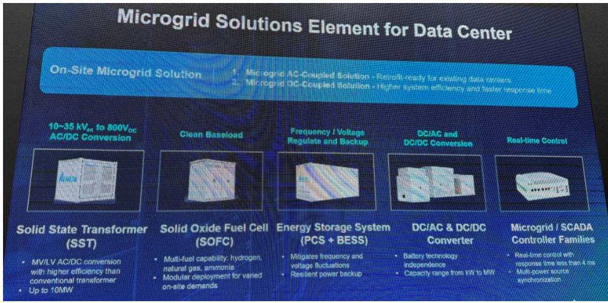
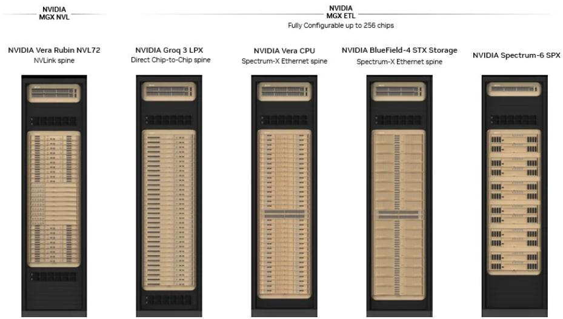

# 市场真正低估的不是需求，而是供给侧的再定价

某外资投行在Computex 2026的展台调研结束后，发布了一份篇幅颇长的行业报告。通常这类报告会被市场快速消化为“AI需求依然强劲”或“供应链继续受益”的线性叙事。但这份报告真正值得读三遍的地方，不在于它确认了增长，而在于它揭示了一个正在发生的结构性转变：AI基础设施的竞争，已经从“谁能造出更大的GPU”转向“谁能把系统级的复杂性转化为可规模化的定价权”。

这不是一个关于需求的故事。这是一个关于供给端如何被重新定义、重新估值的故事。

报告覆盖了从GPU机架到电源架构、从BMC芯片到CPO光交换的多个技术环节。但贯穿其中的主线只有一条：当系统设计从“堆叠组件”走向“极端协同设计”时，那些能够解决信号完整性、功率密度、散热效率和系统集成瓶颈的供应商，将获得远超行业平均的议价能力。而那些仅仅提供标准化零部件的公司，可能面临被压缩的利润空间。

这个判断之所以重要，是因为它直接挑战了当前市场对AI供应链的估值框架。许多投资者仍然在用“量价齐升”的简单模型来给供应商定价，但报告暗示，真正的阿尔法可能来自那些被低估的“系统级难题解决者”。

以下是从报告中提炼出的五个关键洞察，它们共同指向同一个方向：AI基础设施的供给侧正在经历一场深层的再定价。

## 1. 英伟达的“极端协同设计”正在重塑整个供应链的价值分布

报告提到，英伟达在Computex上展示了其“极端协同设计”的Rubin参考架构，覆盖了Vera Rubin NVL72机架、BlueField-4 STX机架、Vera CPU机架、Groq LPU机架以及多种交换机组。这个架构最值得注意的不是性能数字，而是它对BMC（基板管理控制器）数量的需求出现了量级上的跳跃：在Vera CPU、LPU和存储机架中，BMC的数量分别达到99颗、53颗和75颗每机架。

这意味着什么？传统上，BMC被认为是服务器中一个相对“被动”的组件，主要负责远程监控和管理。但当系统复杂度急剧上升，每个机架需要管理上百个计算节点时，BMC的角色正在从“管理芯片”升级为“系统神经末梢”。某外资投行据此上调了对ASPEED BMC在2027年的收入预测，并指出其AST2700新芯片的渗透率可能在2027年底达到20-30%。

这里的关键洞察是：系统复杂度的提升，正在为某些组件创造“非对称价值增长”。BMC的单价可能没有大幅上涨，但每台服务器的BMC数量在增加，同时每个BMC需要处理的软件栈复杂度也在提升。这意味着，那些能够提供完整系统管理解决方案的供应商，将获得比单纯卖芯片更高的利润率。

但这个逻辑能否持续，取决于一个尚未完全回答的问题：当CSP（云服务提供商）开始大规模部署定制化设计时，他们是否会在BMC层面也寻求自研或替代方案？报告对此的表述是“CSPs may deploy customized designs”，但没有深入分析自研BMC的技术壁垒和成本效益。这可能是投资者需要持续跟踪的关键变量。

## 2. Kyber机架的时间线风险暴露了系统集成的真实瓶颈

报告最引人注目的部分之一，是对英伟达Kyber GPU机架时间线风险的讨论。研究团队发现，由于背板信号完整性挑战，Kyber机架的量产时间（目标为2027年下半年）可能存在不确定性。目前英伟达正在评估两种替代设计方案：一种是通过线缆盒将两个NVL72机架背对背互连，另一种是采用NVLink CPO交换。

这个细节之所以重要，是因为它揭示了AI基础设施中最容易被忽视的瓶颈：信号完整性。当数据传输速率达到数百Gbps时，铜缆的长度、弯曲角度、串扰等物理因素都会成为系统设计的约束条件。英伟达之所以在VR200机架中采用中板（midplane）来替代PCIe线缆，正是为了缩短生产周期、提高良率——报告提到，VR200 NVL72计算托盘的生产周期已从GB300的约2小时缩短至约5分钟。

但Kyber机架的问题表明，即使对于英伟达这样的系统级设计大师，物理极限仍然是难以逾越的障碍。这引出了一个更深层的判断：随着AI系统向更高密度、更高带宽演进，那些在高速信号传输、热管理和电源完整性方面拥有核心能力的供应商，其价值将越来越难以被替代。

对于投资者而言，这意味着需要重新评估供应链中那些“看起来不起眼”的组件供应商。例如，中板的独家供应商FIT，以及在高频电容器领域有深厚积累的Nippon Chemi-Con、Nichicon和TDK，它们可能正在成为系统级设计中不可绕过的瓶颈节点。

## 3. HVDC的渗透率可能被低估，但真正的故事是“功率密度竞赛”

报告指出，在VR200代际中，HVDC（高压直流）电源的采用率可能达到约20%，高于此前约15%的假设。多家电源供应商在Computex上展示了HVDC解决方案，英伟达也将HVDC作为Vera Rubin NVL144参考设计的一部分。

表面上看，这是一个渗透率提升的故事。但深入思考后，真正值得关注的是它背后的驱动力：功率密度。随着AI芯片的TDP（热设计功耗）持续上升——VR200芯片的TDP从约2.3kW降至约1.8kW，但机架级的电源配置并未改变，仍然是每机架4个110kW电源架——传统的48V供电架构已经接近物理极限。HVDC（通常为800V）能够在不增加电流的情况下传输更多功率，从而减少线缆损耗和散热压力。

这意味着，HVDC的采用率提升不是一次性的技术切换，而是一个长期的结构性趋势。随着下一代AI芯片的功耗继续攀升，HVDC可能从“可选方案”变成“唯一方案”。报告提到，SiC（碳化硅）器件在800V HVDC机架中几乎是必需的，而GaN（氮化镓）仍在认证中。这为SiC供应链提供了额外的增长动力——数据中心对SiC器件的需求虽然目前仅占整体TAM的低个位数百分比，但可能在两到三年内提升至中高个位数。

但这里有一个尚未完全展开的问题：HVDC的渗透率能否达到100%？报告给出的判断是“不太可能”，原因是功率组件成本（如SiC）的上升。这意味着，在HVDC和非HVDC方案之间，可能会出现一个长期的“双轨运行”格局，而不是简单的替代关系。对于供应商而言，这意味着需要在两种技术路线上同时布局，增加了研发投入的不确定性。

## 4. Vera CPU的早期牵引力暗示了一个被忽视的“非GPU”市场

报告提到，纬创在Computex上展示了英伟达Vera CPU机架，包括风冷和液冷两种配置。某外资投行的半导体团队估计，2026年和2027年Vera CPU的出货量将分别达到约60万颗和约300万颗，且存在上行空间。

这个数据值得单独拿出来讨论，因为它指向了一个被市场严重低估的细分市场：AI基础设施中的CPU需求。在当前的叙事中，市场几乎将所有注意力都集中在GPU上，认为GPU是AI计算的核心，CPU只是“配角”。但Vera CPU的定位——作为AI集群中的“编排/运营”节点——表明，随着AI系统规模的扩大，CPU的角色正在从配角升级为系统级的大脑。

报告提到，Vera CPU的强劲需求对BMC、液冷和DRAM供应商是利好，但对CPU插座供应商的影响则“混合”——因为Vera CPU可能采用LPDDR5 SOCAMM封装，不需要传统插座。这个细节再次印证了我们的核心判断：系统复杂度的提升正在创造新的价值增长点，同时也可能颠覆原有供应链的价值分配。

对于投资者而言，Vera CPU的早期牵引力意味着，不能仅仅关注GPU供应链。那些能够为“非GPU计算节点”提供关键组件的公司——无论是BMC、液冷解决方案还是内存——都可能获得超出预期的增长机会。

## 5. CPO光交换的快速爬坡将重新定义网络设备的价值

报告指出，多个102.4T CPO/NPO项目正在推进，纬创和智邦/明泰在Computex上展示了英伟达的Spectrum-6光子交换机。鸿海预计今年CPO交换机出货量将达到约1万台，明年将翻倍以上。

CPO（共封装光学）技术的意义在于，它将光模块从交换机端口“移入”到交换芯片封装内部，从而大幅缩短电信号传输距离、降低功耗、提高带宽密度。对于AI集群而言，这直接解决了“计算快、通信慢”的瓶颈。

但报告揭示了一个更深层的结构变化：CPO交换机的高利润率正在改变ODM和交换机供应商的盈利模型。传统上，网络设备是一个利润率相对较低的行业，因为产品标准化程度高、竞争激烈。但CPO交换机由于技术壁垒高、定制化程度强，供应商能够获得更高的毛利率。

这意味着，CPO的快速爬坡不仅是技术升级，更是一次行业利润池的再分配。那些能够率先掌握CPO设计、制造和测试能力的供应商，将获得显著的先发优势。而传统交换机供应商如果无法跟上这一波技术迭代，可能面临被边缘化的风险。

这里有一个尚未完全回答的问题：CPO的良率和可靠性是否已经达到大规模量产的要求？报告提到，鸿海预计今年CPO交换机出货量约1万台，但未提供良率数据。对于投资者而言，这可能是需要持续跟踪的关键指标。

---

以上五个洞察，每一个都指向同一个结论：AI基础设施的供给侧正在经历一场深层的再定价。但这份报告也留下了几个尚未完全回答的问题。

例如，在Kyber机架的时间线风险中，背板信号完整性问题的根本原因是什么？是材料限制、设计缺陷还是制造工艺问题？报告提到了M10 CCL（覆铜板）的认证进展和CPO交换机的成熟度是“关键摇摆因素”，但没有进一步分析这些因素的具体时间表。

又如，在HVDC的讨论中，报告提到了功率组件成本上升可能限制渗透率，但没有量化SiC器件在800V系统中的应用成本与传统方案相比的具体差异。这个成本差距是否会随着SiC产能的扩张而迅速缩小？

再如，在Vera CPU的讨论中，报告提到“U.S. hyperscalers”显示了早期兴趣，但没有具体说明是哪些客户、预计的部署规模有多大。对于投资者而言，客户集中度风险是一个需要持续关注的问题。

这些未解问题，恰恰是深入理解这份报告价值的关键。如果你希望获得更完整的分析框架、更详细的图表数据以及对这些未解问题的持续跟踪，欢迎加入我们的星球微信群，与产业界和投资界的同行一起讨论。

Personal reading notes and learning share only. Not investment advice.

