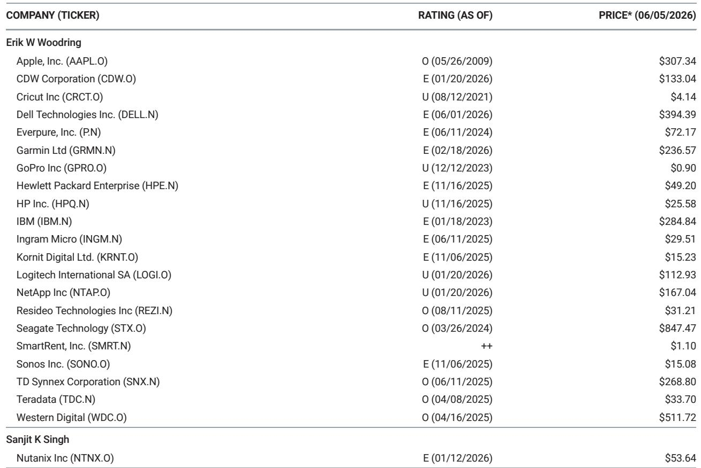

# 硬件市场的真正分化，不是AI与非AI，而是规模与议价权的鸿沟

COMPUTEX 2026刚刚落幕，某外资投行在展会后第一时间发布的供应链调研报告，揭示了一个被市场普遍低估的结构性变化：硬件需求正在发生剧烈且不可逆的分化。但分化的边界，并非简单的AI服务器与非AI硬件，而是一道由规模、供应链议价权和终端客户结构共同划定的分水岭。

这份基于COMPUTEX期间与数十家硬件OEM、存储器供应商、组件厂商深度交流的研报，提供了多个与当前市场共识存在偏差的关键信号。其中最值得关注的判断是：存储器通胀正在成为硬件行业的系统性筛选器，它不会均匀地推高所有厂商的成本，而是会加速淘汰那些缺乏规模优势和供应链掌控力的企业，同时让少数头部企业获得定价权和份额扩张的双重红利。

市场当前的定价，更多反映了AI需求带来的营收弹性，但尚未充分计入存储器持续通胀对行业竞争格局的深层重塑。后者，才是决定未来12-18个月硬件板块相对表现的核心变量。

## 1. 存储器涨价不是短期波动，而是正在改写硬件行业的成本结构和竞争规则

DRAM和NAND价格在C3Q26仍将环比上涨25%-40%，这已经是供应链上下游的共识。但真正值得关注的不是涨价幅度本身，而是涨价对硬件OEM行为模式的根本改变。

研报显示，PC和服务器OEM正在大规模签署覆盖到2028年的NAND和DRAM长期协议。表面上看，这是锁定成本的防御性动作。但更深层的含义在于：存储器供应商正在利用供应紧张周期，将定价权从OEM手中永久性地转移过来。长期协议中包含了按SKU区分的不同价格区间，这意味着存储器厂商可以根据不同客户、不同产品线进行价格歧视——规模越大的OEM，越有可能获得更优的定价条款。

这带来的一个直接后果是：硬件行业的利润分配正在从“组装+品牌”环节向“核心组件”环节倾斜。苹果的应对策略提供了一个典型案例。报告指出，苹果正在利用自身规模优势大量建立存储器库存，预计iPhone 18需求强劲，并可能通过提高售价来转嫁存储器成本。与此同时，苹果还在对其他非存储器组件供应商（如显示面板、机壳）施加降价压力，以对冲存储器成本上升。这种“向上游压价、向下游提价”的双重操作，只有具备极致供应链控制力的企业才能做到。

对于缺乏这种能力的PC和安卓智能手机OEM来说，存储器涨价带来的不仅是利润率压缩，更是市场份额的被动让渡。他们能做的，要么是降低单机存储器容量以控制成本，要么是寻求替代供应商——但无论哪种选择，都会牺牲产品竞争力。

## 2. 通用服务器需求超预期，但真正的赢家是那些能解决“供应瓶颈”的企业

研报中最反直觉的一个信号是：通用服务器需求正在走强。Dell已将2026年通用服务器出货量预期上调至同比增长24%，HPE也预计增长8%-10%。整体CSP加企业级通用服务器出货量预计同比增长约20%。

但驱动这一增长的核心因素并非需求爆发，而是供应端的结构性变化。CPU短缺正在成为比存储器更严重的出货瓶颈。英特尔和AMD正在将更多晶圆产能分配给高端SKU，导致低端CPU供应极度紧张，部分PC OEM甚至被告知低端CPU在2027年可能完全无法获得。这意味着，服务器OEM的出货能力不再取决于自身产能或订单，而取决于能从CPU厂商那里拿到多少配额。

在这种环境下，规模优势再次成为决定性因素。Dell之所以能上调出货预期，与其更强的组件采购能力直接相关。HPE虽然位置有所改善，但仍然更依赖供应端。这揭示了一个容易被忽视的竞争维度：在供应约束周期中，谁能在上游拿到更多配额，谁就能在下游抢到更多份额。市场份额的争夺，正在从“谁的产品更好”转向“谁的供应链更强”。

但这里有一个尚未被完全回答的问题：当前通用服务器的需求走强，究竟是企业正常的更新换代周期，还是AI投资对传统IT预算的挤出效应？报告提到，OEM客户在3月份再次上调了通用服务器需求预测，OEM最初将其视为提前采购，但越来越怀疑这背后是否有AI驱动的因素。这个问题的答案，将决定通用服务器需求的可持续性。

## 3. 消费电子正在经历“供应端通胀+需求端疲软”的双重挤压，安卓阵营首当其冲

如果说服务器市场还能靠企业支出和AI投资维持韧性，那么消费电子——特别是PC和安卓智能手机——正在经历一场完美的风暴。

研报给出的数据令人警醒：组件供应商预计2026年全球智能手机出货量可能同比下降20%，其中中国品牌出货量可能下降30%。PC出货量预计同比下降15%-20%。这些数字背后是三重压力叠加：存储器等关键组件持续涨价、低端CPU供应短缺、以及消费者需求走弱。

更值得注意的是，PC OEM正在被迫向高端产品线迁移。CPU厂商将更多产能分配给高端SKU，意味着即使OEM想出货低端机型，也拿不到足够的芯片。这导致PC的平均售价被动上升，但出货量却在下降。从行业层面看，这有利于提升营收规模，但从竞争格局看，那些依赖低端走量的品牌将面临最严重的压力。

安卓智能手机厂商面临的困境更为严峻。中国品牌出货量预计下降30%，原因不仅是组件短缺和涨价，还包括OEM自身在策略上主动转向高端机型以维持ASP。但问题是，在消费者购买力下降的环境下，提价策略能否被市场接受，存在很大不确定性。

相比之下，苹果的处境要好得多。报告预计iPhone 18系列出货量将同比增长约6%，其中Pro和Pro Max机型增长约30%。苹果不仅有能力通过提价转嫁成本，还能利用规模优势在组件采购中获得更优条款。这种分化，本质上不是产品力的差距，而是供应链管理能力和品牌溢价能力的差距。

## 4. HDD供应紧张正在创造“卖方市场”，但中国市场的替代方案仍是空白

硬盘驱动器市场是当前硬件行业中供需失衡最极端的领域之一。研报指出，超大规模云服务商的HDD部署率已接近100%，远高于历史平均的约70%。这意味着数据中心几乎没有库存缓冲，任何新增需求都将直接转化为订单。

在这种情况下，Seagate和Western Digital作为仅有的两家主要供应商，拥有极强的定价权。它们甚至不愿意向中国CSP供应超过长期协议约定数量的HDD，即使对方愿意支付更高价格。原因是，它们优先将增量供应分配给美国CSP客户——后者拥有更大的HDD需求，也更可能在未来提供稳定的订单。

这一现象揭示了一个重要但尚未被充分讨论的问题：中国数据中心在存储领域的供应链安全。报告明确指出，目前没有证据表明中国正在出现有竞争力的HDD供应商，而且即使有，CSP也不太可能接受其产品，因为数据丢失的风险是不可接受的。更有意思的是，行业人士表示，目前没有任何有意义的冷存储效率改进技术——除了删除旧数据。

这意味着，HDD的供应紧张不仅是周期性的，更是结构性的。在没有新进入者的情况下，现有供应商的定价权将持续增强。这对于持有Seagate和Western Digital仓位的投资者来说，是一个积极的信号。但报告没有完全回答的一个问题是：当SSD价格持续下降、容量持续提升时，HDD在数据中心中的角色是否会加速被替代？这个替代速度的变化，将是影响HDD长期需求的关键变量。

## 5. 报告尚未完全回答的关键问题：AI服务器的需求可持续性

研报中有一个值得特别关注的观察：尽管AI服务器需求依然强劲，但并没有出现从超微电脑向其他AI服务器OEM的大规模订单转移。存储器供应商确实在收紧对超微电脑的供货条件——要求更短的付款周期和预付款——这可能会因为营运资金压力而限制其采购灵活性，从而相对有利于Dell和HPE。但订单本身并未出现显著转移。

这引出了一个更深层的问题：当前AI服务器的需求，有多少是真实的企业级部署，有多少是提前囤货或重复下单？报告提到，Dell目前约有1.5万架AI服务器积压订单，包括约1.3万架GB系列和约2千架VR系列。但积压订单本身并不能直接转化为收入确认，它也可能是供应链瓶颈造成的假象。

某外资投行即将进行的CIO调查可能会为这个问题提供更清晰的答案。但在此之前，市场对AI服务器供应链的定价，可能已经过度乐观。如果未来几个季度出现订单调整或交付延迟，那些高度依赖AI服务器营收的公司将面临较大的估值修正风险。

## 6. 一个更实用的观察框架：用“三条标准”重新评估硬件公司

基于以上分析，我们可以建立一个更简洁的评估框架，用来判断哪些硬件公司更有可能在当前的宏观环境中胜出。这个框架基于三条标准：

第一，规模是否足够大，能够在存储器、CPU等关键组件上获得优先供应权和更优定价条款。规模不仅意味着营收体量，更意味着在上游供应商面前的谈判地位。

第二，终端客户结构是否偏向企业和超大规模云服务商，而非消费者。企业客户的需求更具韧性，且更愿意为高端产品支付溢价。消费电子则在当前环境下承受最大的需求下行风险。

第三，是否具备向上游转嫁成本的能力。这既包括产品定价权，也包括对非存储器组件供应商的议价能力。苹果是这方面的标杆，但不是唯一案例。

用这三条标准来审视当前硬件板块，可以清晰地看到哪些公司处于有利位置，哪些公司面临结构性压力。这也是研报的核心主张：在存储器通胀和供应约束持续存在的环境下，硬件行业的赢家不再是那些“增长最快的”，而是那些“最不容易被替代的”。

---

随着COMPUTEX的结束，市场对硬件行业的关注点将逐渐从展会上的新品发布，转向真实的订单执行和利润率变化。这份研报提供的供应链视角，恰恰是理解这一转变的关键。

但报告本身也有一些尚未完全展开的线索：比如，YMTC在中国市场的渗透速度到底有多快？苹果折叠屏iPhone的供应链是否能如期就位？OpenAI的智能手机野心是否会改变移动生态的竞争格局？这些问题，单靠一份研报无法给出确定答案，它们需要持续的跟踪和讨论。

如果你对这些未解问题感兴趣，欢迎来星球微信群里继续讨论。我们会持续分享来自全球顶级投行的硬件行业研报解读，并在群内与关注产业趋势的朋友们一起，追踪这些关键变量的最新变化。

Personal reading notes and learning share only. Not investment advice.

