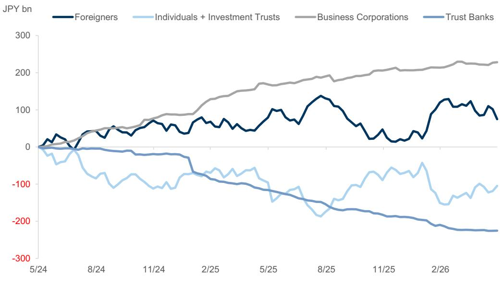
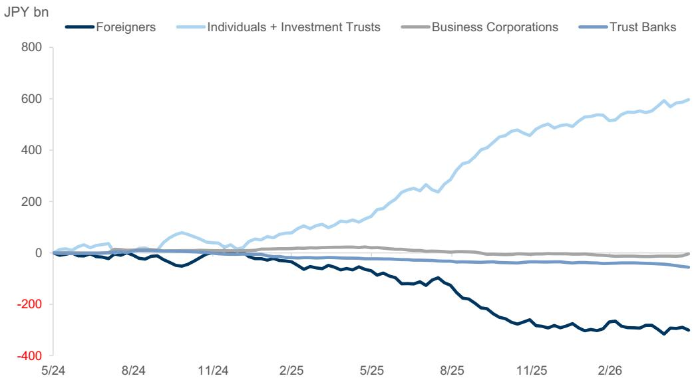
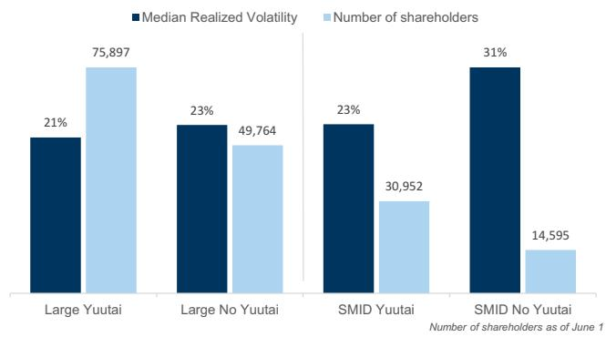
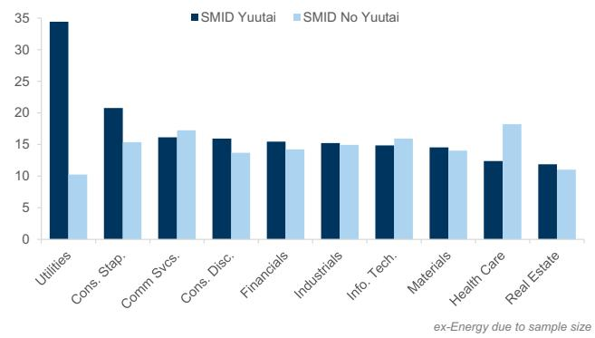
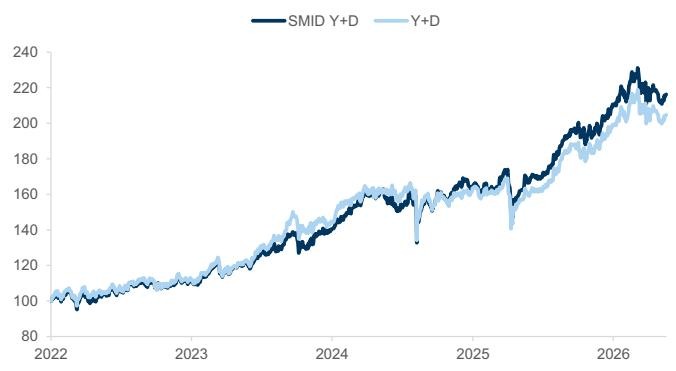
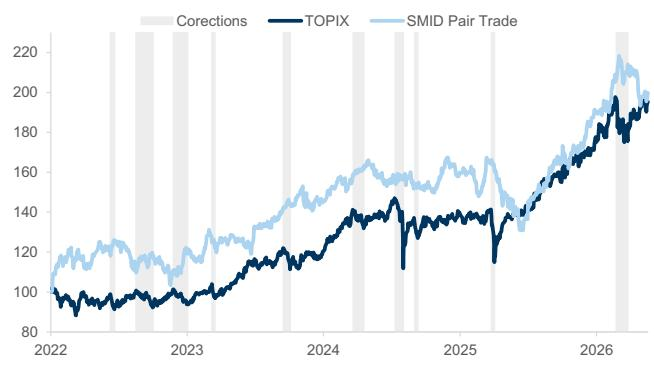
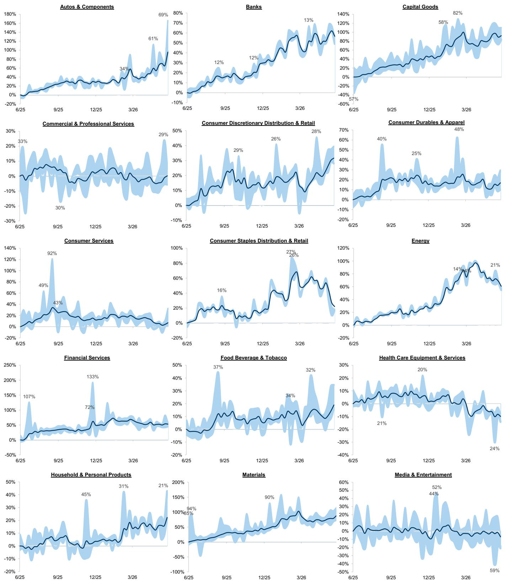
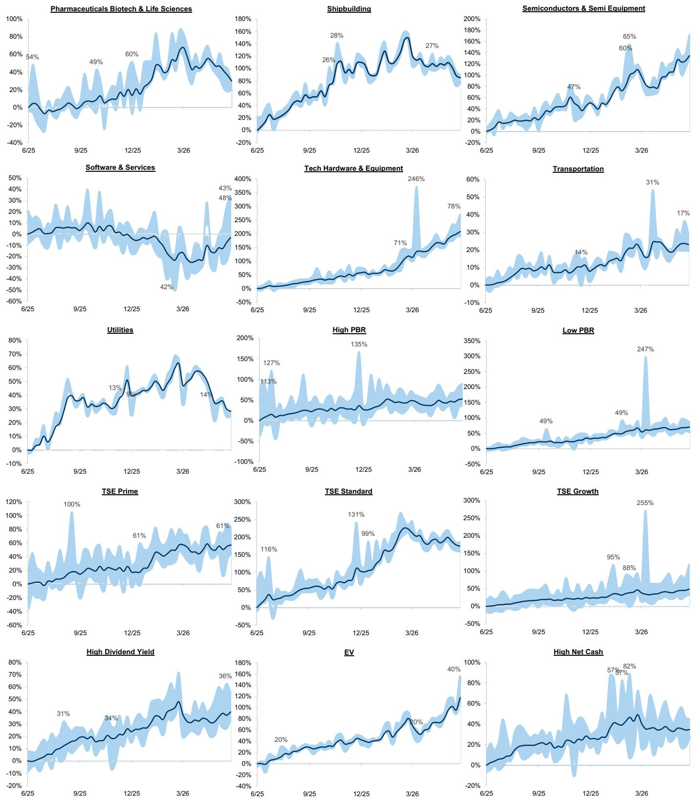
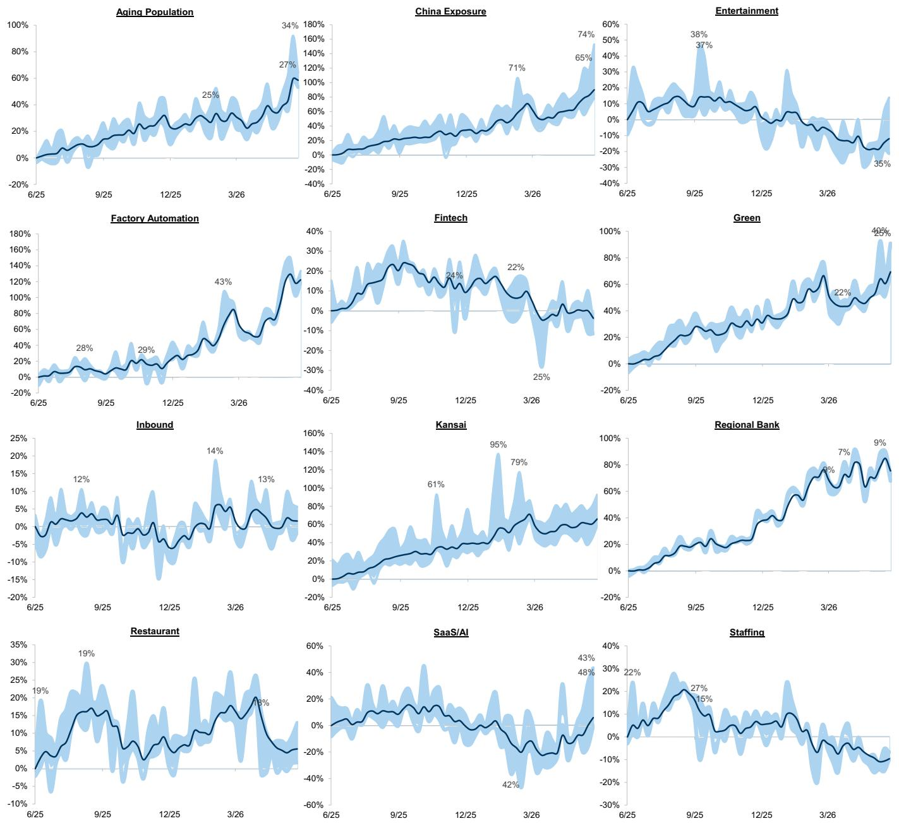
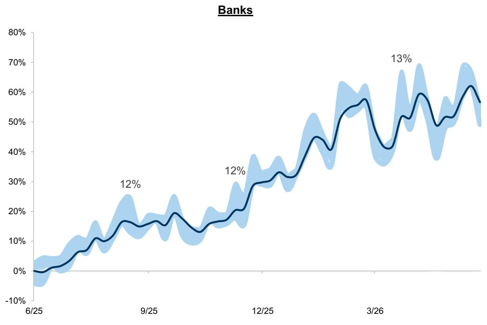

# Japan SMID Monitor: How do yuutai SMIDs perform during corrections?

In this month's edition of the Japan SMID Monitor, we focus on the performance of Japanese SMID stocks with kabunushi yuutai (or shareholder benefits) programs in place, versus those that do not. We first wrote about SMID companies with yuutai programs in Japan SMID Monitor: Measuring the impact of kabunushi yuutai (11 April 2025). We then followed this up with Japan Portfolio Strategy: Unequal equities - How do stocks with shareholder benefits perform during major market corrections? (3 June 2026), which focused more on the broader yuutai universe in Japan. Kabunushi yuutai or ‘shareholder benefits’ programs involve giving domestic Japanese retail investors some sort of in-kind gift or discount for owning a minimum number of shares in the company. Japanese domestic institutions and overseas investors are not eligible for these yuutai programs. One third of listed companies have yuutai programs in place and have tended to trade at a valuation premium to their sector peers, and their price action usually more resilient during corrections.

Japan SMID companies exhibit similar characteristics to their larger cap peers: Japanese SMID stocks with yuutai programs in place tend to have a higher number of retail shareholders, which provides a defensive overlay because retail shareholders usually behave in a contrarian manner during downturns (i.e., they buy when the market is falling), and also because they want to maintain their yuutai benefits even during corrections, so they are less inclined to sell (Exhibit 6).  
Japan SMID companies with yuutai have tended to provide downside protection during major market corrections: Yuutai companies have tended to provide superior volatility-adjusted returns during major market downturns, versus those that did not have yuutai programs in place. They have also tended to trade at a significant valuation premia to their sector peers (Exhibit 7).  
■ History suggests Japan SMID stocks with yuutai programs and high dividend yields should perform well during corrections: We have included in Exhibit 5 a screen of 19 Japanese SMID names which have some sort of yuutai program in place, and which are trading with a dividend yield of at least 3.0%.  
Individuals and Foreigners net bought TSE Growth, and sold TSE Standard: As can be seen in Exhibit 1 and Exhibit 2 below, for the month of May, individuals and foreigners net sold -¥12.6bn and -¥9.5bn of Standard cash equities, whilst buying ¥11.1bn and ¥15.5bn respectively of Growth cash.

Bruce Kirk, CFA

+81(3)4587-9950 | bruce.kirk@gs.com

GS Japan Co., Ltd.

Julius Chan

+81(3)4587-1789 | julius.chan@gs.com

GS Japan Co., Ltd.

Exhibit 1: TSE Standard net buying  
2-year chart as of May 29 2026, JPY bn  

line chart

| Date   | Foreigners | Individuals + Investment Trusts | Business Corporations | Trust Banks |
|--------|------------|----------------------------------|------------------------|-------------|
| 5/24   | 0          | 0                                | 0                      | 0           |
| 8/24   | 50         | -50                              | 50                     | -50         |
| 11/24  | 75         | -75                              | 75                     | -75         |
| 2/25   | 100        | -100                             | 100                    | -100        |
| 5/25   | 125        | -125                             | 125                    | -125        |
| 8/25   | 150        | -150                             | 150                    | -150        |
| 11/25  | 175        | -175                             | 175                    | -175        |
| 2/26   | 200        | -200                             | 200                    | -200        |
| 4/26   | 225        | -225                             | 225                    | -225        |

Source: Bloomberg, Tokyo Stock Exchange

Exhibit 2: TSE Growth net buying  
2-year chart as of May 29 2026, JPY bn  

line chart

| Date   | Foreigners | Individuals + Investment Trusts | Business Corporations | Trust Banks |
|--------|------------|----------------------------------|------------------------|-------------|
| 5/24   | 0          | 0                                | 0                      | 0           |
| 8/24   | -50        | 50                               | 0                      | 0           |
| 11/24  | -100       | 100                              | 0                      | 0           |
| 2/25   | -150       | 150                              | 0                      | 0           |
| 5/25   | -200       | 200                              | 0                      | 0           |
| 8/25   | -250       | 300                              | 0                      | 0           |
| 11/25  | -300       | 450                              | 0                      | 0           |
| 2/26   | -350       | 600                              | 0                      | 0           |

Source: Bloomberg, Tokyo Stock Exchange

## GS Covered Japan SMID Stocks

Exhibit 3: GS covered SMID stocks ranked by monthly performance

Data as of May 29 2026

<table><tr><td>Ticker</td><td>Name</td><td>Analyst</td><td>1W</td><td>2W</td><td>1M</td><td>3M</td><td>6M</td><td>YTD</td></tr><tr><td>6976</td><td>Taiyo Yuden</td><td>Daiki Takayama</td><td>63%</td><td>119%</td><td>125%</td><td>209%</td><td>355%</td><td>319%</td></tr><tr><td>6324</td><td>Harmonic Drive Systems</td><td>Yuichiro Isayama</td><td>11%</td><td>10%</td><td>64%</td><td>71%</td><td>152%</td><td>106%</td></tr><tr><td>6966</td><td>Mitsui High-tec Inc.</td><td>Kota Yuzawa</td><td>37%</td><td>42%</td><td>53%</td><td>17%</td><td>29%</td><td>34%</td></tr><tr><td>4443</td><td>Sansan Inc.</td><td>Norihiro Miyazaki</td><td>14%</td><td>28%</td><td>30%</td><td>43%</td><td>0%</td><td>-3%</td></tr><tr><td>6254</td><td>NOM Micro Science</td><td>Takeru Adachi</td><td>-8%</td><td>-7%</td><td>22%</td><td>30%</td><td>47%</td><td>54%</td></tr><tr><td>4205</td><td>Zeon</td><td>Atsushi Ikeda</td><td>4%</td><td>-2%</td><td>19%</td><td>2%</td><td>23%</td><td>22%</td></tr><tr><td>5253</td><td>Cover Corp.</td><td>Norihiro Miyazaki</td><td>-9%</td><td>9%</td><td>16%</td><td>-8%</td><td>-4%</td><td>6%</td></tr><tr><td>6508</td><td>Meidensha</td><td>Ryo Harada</td><td>-9%</td><td>-8%</td><td>16%</td><td>29%</td><td>74%</td><td>81%</td></tr><tr><td>3923</td><td>Rakus Co.</td><td>Norihiro Miyazaki</td><td>7%</td><td>24%</td><td>16%</td><td>15%</td><td>-19%</td><td>-3%</td></tr><tr><td>6754</td><td>Anritsu</td><td>Ryo Harada</td><td>-1%</td><td>7%</td><td>14%</td><td>50%</td><td>92%</td><td>103%</td></tr><tr><td>6055</td><td>Japan Material</td><td>Takeru Adachi</td><td>3%</td><td>3%</td><td>14%</td><td>-6%</td><td>21%</td><td>33%</td></tr><tr><td>6951</td><td>JEOL</td><td>Shuhei Nakamura</td><td>8%</td><td>2%</td><td>12%</td><td>3%</td><td>48%</td><td>41%</td></tr><tr><td>6407</td><td>CKD</td><td>Yuichiro Isayama</td><td>-3%</td><td>-3%</td><td>12%</td><td>18%</td><td>154%</td><td>114%</td></tr><tr><td>4061</td><td>Denka</td><td>Atsushi Ikeda</td><td>16%</td><td>16%</td><td>11%</td><td>22%</td><td>64%</td><td>63%</td></tr><tr><td>4369</td><td>Tri Chemical Laboratories Inc</td><td>Atsushi Ikeda</td><td>8%</td><td>10%</td><td>11%</td><td>-1%</td><td>35%</td><td>39%</td></tr><tr><td>4202</td><td>Daicel</td><td>Atsushi Ikeda</td><td>5%</td><td>12%</td><td>8%</td><td>-19%</td><td>1%</td><td>-5%</td></tr><tr><td>6674</td><td>GS Yuasa Corp.</td><td>Kota Yuzawa</td><td>7%</td><td>2%</td><td>6%</td><td>18%</td><td>58%</td><td>75%</td></tr><tr><td>6622</td><td>Daihen</td><td>Ryo Harada</td><td>-3%</td><td>-6%</td><td>6%</td><td>9%</td><td>82%</td><td>59%</td></tr><tr><td>8304</td><td>Aozora Bank</td><td>Makoto Kuroda</td><td>-4%</td><td>-2%</td><td>5%</td><td>-5%</td><td>11%</td><td>6%</td></tr><tr><td>4194</td><td>Visional</td><td>Norihiro Miyazaki</td><td>0%</td><td>5%</td><td>5%</td><td>7%</td><td>-25%</td><td>-22%</td></tr><tr><td>7581</td><td>Saizeriya</td><td>Sho Kawano</td><td>1%</td><td>4%</td><td>3%</td><td>-24%</td><td>-9%</td><td>-3%</td></tr><tr><td>9616</td><td>Kyoritsu Maintenance</td><td>Norihiro Miyazaki</td><td>1%</td><td>6%</td><td>3%</td><td>-6%</td><td>-12%</td><td>-11%</td></tr><tr><td>4912</td><td>Lion</td><td>Takashi Miyazaki</td><td>1%</td><td>5%</td><td>3%</td><td>-12%</td><td>-2%</td><td>-2%</td></tr><tr><td>5032</td><td>ANYCOLOR</td><td>Norihiro Miyazaki</td><td>-1%</td><td>5%</td><td>2%</td><td>-26%</td><td>-55%</td><td>-41%</td></tr><tr><td>6592</td><td>Mabuchi Motor</td><td>Daiki Takayama</td><td>0%</td><td>-3%</td><td>2%</td><td>-16%</td><td>12%</td><td>8%</td></tr><tr><td>2222</td><td>Kotobuki Spirits Co.</td><td>Norihiro Miyazaki</td><td>4%</td><td>-2%</td><td>0%</td><td>5%</td><td>13%</td><td>14%</td></tr><tr><td>7988</td><td>Nifco Inc.</td><td>Kota Yuzawa</td><td>10%</td><td>0%</td><td>-1%</td><td>-18%</td><td>-6%</td><td>-7%</td></tr><tr><td>4922</td><td>Kose Holdings</td><td>Takashi Miyazaki</td><td>6%</td><td>8%</td><td>-1%</td><td>-10%</td><td>9%</td><td>7%</td></tr><tr><td>3116</td><td>Toyota Boshoku</td><td>Kota Yuzawa</td><td>2%</td><td>0%</td><td>-3%</td><td>-28%</td><td>-6%</td><td>-9%</td></tr><tr><td>8570</td><td>Aeon Financial Service Co.</td><td>Makoto Kuroda</td><td>-3%</td><td>-3%</td><td>-3%</td><td>-14%</td><td>-4%</td><td>-13%</td></tr><tr><td>9706</td><td>Japan Airport Terminal</td><td>Norihiro Miyazaki</td><td>-2%</td><td>-4%</td><td>-4%</td><td>-9%</td><td>7%</td><td>10%</td></tr><tr><td>2229</td><td>Calbee Inc</td><td>Takashi Miyazaki</td><td>-2%</td><td>0%</td><td>-4%</td><td>-6%</td><td>-2%</td><td>-3%</td></tr><tr><td>6432</td><td>Takeuchi MFG</td><td>Takeru Adachi</td><td>1%</td><td>-4%</td><td>-5%</td><td>-9%</td><td>-4%</td><td>1%</td></tr><tr><td>5805</td><td>SWCC</td><td>Ryo Harada</td><td>8%</td><td>-5%</td><td>-5%</td><td>-4%</td><td>39%</td><td>44%</td></tr><tr><td>4478</td><td>freee K.K.</td><td>Chikai Tanaka, CFA</td><td>-6%</td><td>-3%</td><td>-5%</td><td>-2%</td><td>-30%</td><td>-30%</td></tr><tr><td>4587</td><td>PeptiDream</td><td>Akinori Ueda, Ph.D.</td><td>-9%</td><td>-2%</td><td>-5%</td><td>-22%</td><td>-38%</td><td>-33%</td></tr><tr><td>6728</td><td>Ulvac</td><td>Shuhei Nakamura</td><td>1%</td><td>0%</td><td>-6%</td><td>-9%</td><td>42%</td><td>34%</td></tr><tr><td>6770</td><td>Alps Alpine</td><td>Daiki Takayama</td><td>1%</td><td>-2%</td><td>-7%</td><td>-7%</td><td>7%</td><td>9%</td></tr><tr><td>6103</td><td>Okuma</td><td>Yuichiro Isayama</td><td>1%</td><td>-15%</td><td>-8%</td><td>-13%</td><td>8%</td><td>12%</td></tr><tr><td>7014</td><td>Namura Shipbuilding Co.</td><td>Norihiro Miyazaki</td><td>-2%</td><td>-15%</td><td>-10%</td><td>-33%</td><td>-19%</td><td>6%</td></tr><tr><td>4483</td><td>JMDC</td><td>Akinori Ueda, Ph.D.</td><td>2%</td><td>6%</td><td>-15%</td><td>-32%</td><td>-34%</td><td>-29%</td></tr><tr><td>7383</td><td>Net Protections Holdings</td><td>Makoto Kuroda</td><td>-8%</td><td>-18%</td><td>-17%</td><td>-34%</td><td>-41%</td><td>-32%</td></tr></table>

Source: FactSet, Data compiled by GS Global Investment Research

Exhibit 4: GS covered SMID stocks by analyst, 1M performance and consensus valuations

Data as of May 29 2026

<table><tr><td>Ticker</td><td>Name</td><td>Analyst</td><td>1M price return</td><td>P/B</td><td>P/E NTM</td><td>ROE FY26E</td><td>DY FY26E</td></tr><tr><td>4587</td><td>PeptiDream</td><td>Akinori Ueda, Ph.D.</td><td>-5%</td><td>2.8</td><td>9.1</td><td>30.4</td><td>0.0</td></tr><tr><td>4483</td><td>JMDC</td><td>Akinori Ueda, Ph.D.</td><td>-15%</td><td>2.2</td><td>20.0</td><td>9.9</td><td>0.7</td></tr><tr><td>4205</td><td>Zeon</td><td>Atsushi Ikeda</td><td>19%</td><td>1.1</td><td>13.8</td><td>8.1</td><td>3.5</td></tr><tr><td>4061</td><td>Denka</td><td>Atsushi Ikeda</td><td>11%</td><td>1.2</td><td>19.1</td><td>7.4</td><td>2.3</td></tr><tr><td>4369</td><td>Tri Chemical Laboratories Inc.</td><td>Atsushi Ikeda</td><td>11%</td><td>3.4</td><td>23.7</td><td>13.4</td><td>1.0</td></tr><tr><td>4202</td><td>Daicel</td><td>Atsushi Ikeda</td><td>8%</td><td>1.0</td><td>8.1</td><td>12.6</td><td>4.8</td></tr><tr><td>4478</td><td>freee K.K.</td><td>Chikai Tanaka, CFA</td><td>-5%</td><td>6.4</td><td>36.7</td><td>4.7</td><td>0.0</td></tr><tr><td>6976</td><td>Taiyo Yuden</td><td>Daiki Takayama</td><td>125%</td><td>5.4</td><td>72.0</td><td>7.3</td><td>0.6</td></tr><tr><td>6592</td><td>Mabuchi Motor</td><td>Daiki Takayama</td><td>2%</td><td>1.1</td><td>18.0</td><td>6.1</td><td>3.1</td></tr><tr><td>6770</td><td>Alps Alpine</td><td>Daiki Takayama</td><td>-7%</td><td>0.9</td><td>15.1</td><td>6.1</td><td>2.9</td></tr><tr><td>6966</td><td>Mitsui High-tec Inc.</td><td>Kota Yuzawa</td><td>53%</td><td>1.6</td><td>21.5</td><td>7.2</td><td>1.9</td></tr><tr><td>6674</td><td>GS Yuasa Corp.</td><td>Kota Yuzawa</td><td>6%</td><td>1.7</td><td>16.7</td><td>9.9</td><td>1.4</td></tr><tr><td>7988</td><td>Nifco Inc.</td><td>Kota Yuzawa</td><td>-1%</td><td>1.4</td><td>10.5</td><td>12.8</td><td>2.8</td></tr><tr><td>3116</td><td>Toyota Boshoku</td><td>Kota Yuzawa</td><td>-3%</td><td>0.8</td><td>8.0</td><td>10.3</td><td>3.9</td></tr><tr><td>8304</td><td>Aozora Bank</td><td>Makoto Kuroda</td><td>5%</td><td>0.8</td><td>12.7</td><td>6.1</td><td>3.7</td></tr><tr><td>8570</td><td>Aeon Financial Service Co.</td><td>Makoto Kuroda</td><td>-3%</td><td>0.7</td><td>14.1</td><td>4.4</td><td>3.5</td></tr><tr><td>7383</td><td>Net Protections Holdings</td><td>Makoto Kuroda</td><td>-17%</td><td>1.7</td><td>15.9</td><td>9.9</td><td>0.0</td></tr><tr><td>4443</td><td>Sansan Inc.</td><td>Norihiro Miyazaki</td><td>30%</td><td>14.2</td><td>23.8</td><td>35.8</td><td>0.0</td></tr><tr><td>5253</td><td>Cover Corp.</td><td>Norihiro Miyazaki</td><td>16%</td><td>5.3</td><td>13.7</td><td>29.5</td><td>0.0</td></tr><tr><td>3923</td><td>Rakus Co.</td><td>Norihiro Miyazaki</td><td>16%</td><td>13.7</td><td>17.6</td><td>71.3</td><td>0.6</td></tr><tr><td>4194</td><td>Visional</td><td>Norihiro Miyazaki</td><td>5%</td><td>4.7</td><td>15.9</td><td>23.0</td><td>0.0</td></tr><tr><td>9616</td><td>Kyoritsu Maintenance</td><td>Norihiro Miyazaki</td><td>3%</td><td>1.6</td><td>11.5</td><td>14.5</td><td>1.9</td></tr><tr><td>5032</td><td>ANYCOLOR</td><td>Norihiro Miyazaki</td><td>2%</td><td>8.0</td><td>9.7</td><td>59.9</td><td>3.1</td></tr><tr><td>2222</td><td>Kotobuki Spirits Co.</td><td>Norihiro Miyazaki</td><td>0%</td><td>6.7</td><td>22.2</td><td>27.3</td><td>1.9</td></tr><tr><td>9706</td><td>Japan Airport Terminal</td><td>Norihiro Miyazaki</td><td>-4%</td><td>2.1</td><td>18.2</td><td>11.9</td><td>1.9</td></tr><tr><td>7014</td><td>Namura Shipbuilding Co.</td><td>Norihiro Miyazaki</td><td>-10%</td><td>1.9</td><td>11.8</td><td>16.8</td><td>1.6</td></tr><tr><td>6508</td><td>Meidensha</td><td>Ryo Harada</td><td>16%</td><td>2.6</td><td>22.2</td><td>12.3</td><td>1.4</td></tr><tr><td>6754</td><td>Anritsu</td><td>Ryo Harada</td><td>14%</td><td>4.4</td><td>40.6</td><td>10.1</td><td>1.1</td></tr><tr><td>6622</td><td>Daihen</td><td>Ryo Harada</td><td>6%</td><td>2.4</td><td>21.3</td><td>10.8</td><td>1.4</td></tr><tr><td>5805</td><td>SWCC</td><td>Ryo Harada</td><td>-5%</td><td>4.5</td><td>20.7</td><td>20.1</td><td>1.8</td></tr><tr><td>7581</td><td>Saizeriya</td><td>Sho Kawano</td><td>3%</td><td>2.2</td><td>18.7</td><td>10.3</td><td>0.6</td></tr><tr><td>6951</td><td>JEOL</td><td>Shuhei Nakamura</td><td>12%</td><td>2.4</td><td>16.0</td><td>14.9</td><td>1.9</td></tr><tr><td>6728</td><td>Ulvac</td><td>Shuhei Nakamura</td><td>-6%</td><td>2.1</td><td>19.4</td><td>8.5</td><td>1.7</td></tr><tr><td>4912</td><td>Lion</td><td>Takashi Miyazaki</td><td>3%</td><td>1.4</td><td>17.2</td><td>7.9</td><td>2.1</td></tr><tr><td>4922</td><td>Kose Holdings</td><td>Takashi Miyazaki</td><td>-1%</td><td>1.1</td><td>23.8</td><td>4.6</td><td>2.7</td></tr><tr><td>2229</td><td>Calbee Inc</td><td>Takashi Miyazaki</td><td>-4%</td><td>1.7</td><td>18.7</td><td>9.1</td><td>2.3</td></tr><tr><td>6254</td><td>NOM Micro Science</td><td>Takeru Adachi</td><td>22%</td><td>4.5</td><td>21.5</td><td>22.4</td><td>1.6</td></tr><tr><td>6055</td><td>Japan Material</td><td>Takeru Adachi</td><td>14%</td><td>3.4</td><td>19.3</td><td>16.6</td><td>1.5</td></tr><tr><td>6432</td><td>Takeuchi MFG</td><td>Takeru Adachi</td><td>-5%</td><td>1.7</td><td>12.0</td><td>12.6</td><td>3.2</td></tr><tr><td>6324</td><td>Harmonic Drive Systems</td><td>Yuichiro Isayama</td><td>64%</td><td>9.2</td><td>122.3</td><td>6.5</td><td>0.3</td></tr><tr><td>6407</td><td>CKD</td><td>Yuichiro Isayama</td><td>12%</td><td>2.9</td><td>24.7</td><td>11.0</td><td>1.6</td></tr><tr><td>6103</td><td>Okuma</td><td>Yuichiro Isayama</td><td>-8%</td><td>1.0</td><td>15.2</td><td>6.8</td><td>2.7</td></tr></table>

Source: I/B/E/S, Toyo Keizai, FactSet, Data compiled by GS Global Investment Research

## SMID Yuutai + dividends screen

Our SMID Y+D screen includes companies with yuutai programs in place, and which also offer a relatively high cash dividend of at least 3% to all shareholders. Our full screening criteria were as follows:

■ 6M ADTV of over US\$5mn and with a market cap of ¥50-500bn.  
■ Yuutai program in place.  
■ FY0 dividend yield > 3%.  
■ Listed for at least 3 years.

Exhibit 5: SMID Yuutai + Dividends Screen  
Data as of May 1, 2026, rebalanced semiannually

<table><tr><td rowspan="3">Ticker</td><td rowspan="3">Company Name</td><td rowspan="3">GICS Sector</td><td rowspan="3">Quoted Price (JPY)</td><td>50 - 500</td><td>&gt;5</td><td colspan="2">&gt;0</td><td>&gt;3</td></tr><tr><td colspan="2">Size and Liquidity</td><td colspan="2">Valuations</td><td>Returns</td></tr><tr><td>Mkt Cap(JPY bn)</td><td>6M ADTV(US$ mn)</td><td>FY1 P/E(x)</td><td>FY1 P/B(x)</td><td>FY0 D/Y(%)</td></tr><tr><td colspan="9">Yuutai + dividend screen</td></tr><tr><td>1860</td><td>TODA CORP</td><td>Industrials</td><td>1415.0</td><td>450.0</td><td>6.4</td><td>13.8</td><td>1.1</td><td>4.1</td></tr><tr><td>9076</td><td>SEINO HOLDINGS</td><td>Industrials</td><td>2391.5</td><td>448.8</td><td>7.6</td><td>16.1</td><td>0.9</td><td>4.3</td></tr><tr><td>6141</td><td>DMG MORI CO LTD</td><td>Industrials</td><td>3000.0</td><td>427.0</td><td>25.0</td><td>31.5</td><td>1.2</td><td>3.5</td></tr><tr><td>6417</td><td>SANKYO CO LTD</td><td>Consumer Discretionary</td><td>1834.5</td><td>421.9</td><td>13.1</td><td>7.5</td><td>1.5</td><td>4.9</td></tr><tr><td>6592</td><td>MABUCHI MOTOR CO</td><td>Industrials</td><td>1500.5</td><td>391.1</td><td>9.3</td><td>17.6</td><td>1.1</td><td>3.5</td></tr><tr><td>7984</td><td>KOKUYO CO LTD</td><td>Industrials</td><td>809.9</td><td>357.1</td><td>5.1</td><td>16.2</td><td>1.4</td><td>3.0</td></tr><tr><td>9045</td><td>KEIHAN HOLDINGS CO</td><td>Industrials</td><td>3254.0</td><td>347.6</td><td>5.2</td><td>10.8</td><td>1.0</td><td>3.1</td></tr><tr><td>2296</td><td>ITOHAM YONEKYU HLD</td><td>Consumer Staples</td><td>5190.0</td><td>298.3</td><td>6.2</td><td>15.7</td><td>1.0</td><td>6.2</td></tr><tr><td>4927</td><td>POLA ORBIS HLDG IN</td><td>Consumer Staples</td><td>1288.0</td><td>295.1</td><td>5.5</td><td>28.9</td><td>1.8</td><td>4.0</td></tr><tr><td>8876</td><td>RELO GROUP INC</td><td>Real Estate</td><td>1927.0</td><td>294.9</td><td>5.6</td><td>13.8</td><td>3.5</td><td>3.6</td></tr><tr><td>8381</td><td>SAN-IN GODO BANK</td><td>Financials</td><td>1866.0</td><td>292.9</td><td>5.7</td><td>13.0</td><td>0.9</td><td>3.2</td></tr><tr><td>4540</td><td>TSUMURA &amp; CO</td><td>Health Care</td><td>3630.0</td><td>278.6</td><td>7.7</td><td>10.5</td><td>0.8</td><td>4.0</td></tr><tr><td>1333</td><td>UMIOS CORP</td><td>Consumer Staples</td><td>1309.0</td><td>198.6</td><td>5.3</td><td>10.2</td><td>0.8</td><td>3.4</td></tr><tr><td>4784</td><td>GMO INTERNET INC</td><td>Communication Services</td><td>580.0</td><td>176.7</td><td>8.2</td><td>26.9</td><td>11.6</td><td>3.5</td></tr><tr><td>8698</td><td>MONEX GROUP INC</td><td>Financials</td><td>668.0</td><td>168.1</td><td>8.9</td><td>16.9</td><td>1.3</td><td>4.6</td></tr><tr><td>7172</td><td>JAPAN INVESTMENT A</td><td>Financials</td><td>2112.0</td><td>128.9</td><td>6.4</td><td>10.5</td><td>1.7</td><td>4.1</td></tr><tr><td>3002</td><td>GUNZE LTD</td><td>Consumer Discretionary</td><td>3595.0</td><td>113.6</td><td>6.1</td><td>71.8</td><td>1.0</td><td>6.0</td></tr><tr><td>2379</td><td>DIP CORPORATION</td><td>Industrials</td><td>1822.0</td><td>109.6</td><td>5.1</td><td>13.0</td><td>2.6</td><td>5.2</td></tr><tr><td>2737</td><td>TOMEN DEVICES CORP</td><td>Information Technology</td><td>15070.0</td><td>102.5</td><td>10.3</td><td>9.3</td><td>1.7</td><td>3.6</td></tr></table>

Source: FactSet, Data compiled by GS Global Investment Research

Exhibit 6: Similar volatility gaps between companies with and without yuutai can also be seen in the SMID universe vs. large caps  
Universe as of Jan 1, 2026  

bar chart

| Category | Median Realized Volatility (%) | Number of shareholders |
| :--- | :--- | :--- |
| Large Yuutai | 21 | 75,897 |
| Large No Yuutai | 23 | 49,764 |
| SMID Yuutai | 23 | 30,952 |
| SMID No Yuutai | 31 | 14,595 |
Number of shareholders as of June 1

Source: FactSet, Data compiled by GS Global Investment Research

Exhibit 7: Similarly, the same valuation premia versus sector average are evident in SMID yuutai companies  

bar chart

| Category | SMID Yuutai (%) | SMID No Yuutai (%) |
| :--- | :--- | :--- |
| Utilities | 34.5 | 10.2 |
| Cons. Stap. | 20.7 | 15.4 |
| Comm Sycs. | 16.2 | 17.2 |
| Cons. Disc. | 16.0 | 13.6 |
| Financials | 15.5 | 14.1 |
| Industrials | 15.3 | 14.9 |
| Info. Tech. | 14.8 | 16.0 |
| Materials | 14.5 | 13.9 |
| Health Care | 12.3 | 18.0 |
| Real Estate | 11.8 | 10.9 |
ex-Energy due to sample size

Source: FactSet, Data compiled by GS Global Investment Research

Exhibit 8: SMID Y+D has begun to outperform total Y+D since 2025  
Rebalanced semianually  

line chart

| Year | SMID Y+D | Y+D |
|------|----------|-----|
| 2022 | ~100     | ~100 |
| 2023 | ~120     | ~115 |
| 2024 | ~150     | ~145 |
| 2025 | ~170     | ~165 |
| 2026 | ~230     | ~210 |

Source: FactSet, Data compiled by GS Global Investment Research

Exhibit 9: Dollar-for-dollar, Long SMID Y+D / Short SMID NYND pair trade has tended to hold up well during corrections  
Shaded areas are TOPIX major market corrections since 2022  

line chart

| Year | Corections | TOPIX | SMID Pair Trade |
|------|------------|-------|-----------------|
| 2022 | 100        | 95    | 105             |
| 2023 | 105        | 100   | 110             |
| 2024 | 110        | 120   | 130             |
| 2025 | 115        | 130   | 140             |
| 2026 | 120        | 150   | 170             |
| 2027 | 125        | 170   | 190             |

NYND = no yuutai + no dividend.  
Source: FactSet, GS Global Investment Research

## Market Dashboard

Performance table

<table><tr><td>Sector / Thematic Index</td><td>1-week</td><td>2-week</td><td>1-month</td><td>3-month</td><td>6-month</td><td>52-week</td><td>YTD</td></tr><tr><td>Autos &amp; Components</td><td>18%</td><td>15%</td><td>26%</td><td>36%</td><td>58%</td><td>89%</td><td>70%</td></tr><tr><td>SaaS/AI</td><td>6%</td><td>15%</td><td>23%</td><td>22%</td><td>1%</td><td>12%</td><td>28%</td></tr><tr><td>EV</td><td>11%</td><td>8%</td><td>23%</td><td>18%</td><td>47%</td><td>116%</td><td>113%</td></tr><tr><td>Factory Automation</td><td>2%</td><td>-3%</td><td>21%</td><td>21%</td><td>92%</td><td>121%</td><td>111%</td></tr><tr><td>Aging Population</td><td>-1%</td><td>11%</td><td>17%</td><td>19%</td><td>21%</td><td>79%</td><td>42%</td></tr><tr><td>Software &amp; Services</td><td>5%</td><td>12%</td><td>17%</td><td>17%</td><td>-4%</td><td>2%</td><td>17%</td></tr><tr><td>China Exposure</td><td>4%</td><td>7%</td><td>16%</td><td>13%</td><td>49%</td><td>108%</td><td>91%</td></tr><tr><td>Green</td><td>5%</td><td>4%</td><td>15%</td><td>2%</td><td>26%</td><td>73%</td><td>81%</td></tr><tr><td>Tech Hardware &amp; Equipment</td><td>3%</td><td>6%</td><td>15%</td><td>34%</td><td>95%</td><td>194%</td><td>167%</td></tr><tr><td>Semiconductors &amp; Semi Equipment</td><td>4%</td><td>5%</td><td>13%</td><td>10%</td><td>56%</td><td>131%</td><td>128%</td></tr><tr><td>Consumer Discretionary Distribution &amp; Retail</td><td>1%</td><td>4%</td><td>9%</td><td>9%</td><td>15%</td><td>35%</td><td>47%</td></tr><tr><td>Materials</td><td>5%</td><td>5%</td><td>9%</td><td>-7%</td><td>27%</td><td>83%</td><td>90%</td></tr><tr><td>High PBR</td><td>1%</td><td>6%</td><td>8%</td><td>5%</td><td>13%</td><td>59%</td><td>98%</td></tr><tr><td>Household &amp; Personal Products</td><td>6%</td><td>5%</td><td>7%</td><td>3%</td><td>20%</td><td>28%</td><td>50%</td></tr><tr><td>TSE Prime</td><td>1%</td><td>5%</td><td>7%</td><td>3%</td><td>28%</td><td>66%</td><td>122%</td></tr><tr><td>Food Beverage &amp; Tobacco</td><td>4%</td><td>8%</td><td>6%</td><td>4%</td><td>7%</td><td>18%</td><td>13%</td></tr><tr><td>Entertainment</td><td>3%</td><td>8%</td><td>6%</td><td>-8%</td><td>-18%</td><td>-16%</td><td>-16%</td></tr><tr><td>TSE Growth</td><td>2%</td><td>3%</td><td>6%</td><td>2%</td><td>21%</td><td>56%</td><td>54%</td></tr><tr><td>Capital Goods</td><td>2%</td><td>-2%</td><td>5%</td><td>-1%</td><td>36%</td><td>96%</td><td>102%</td></tr><tr><td>Kansai</td><td>3%</td><td>3%</td><td>5%</td><td>-3%</td><td>20%</td><td>72%</td><td>62%</td></tr><tr><td>High Dividend Yield</td><td>2%</td><td>1%</td><td>5%</td><td>-5%</td><td>11%</td><td>41%</td><td>46%</td></tr><tr><td>Commercial &amp; Professional Services</td><td>1%</td><td>4%</td><td>4%</td><td>-2%</td><td>-2%</td><td>-3%</td><td>33%</td></tr><tr><td>Consumer Durables &amp; Apparel</td><td>2%</td><td>1%</td><td>4%</td><td>-6%</td><td>3%</td><td>28%</td><td>10%</td></tr><tr><td>Low PBR</td><td>1%</td><td>1%</td><td>4%</td><td>0%</td><td>23%</td><td>62%</td><td>58%</td></tr><tr><td>Transportation</td><td>-1%</td><td>0%</td><td>3%</td><td>0%</td><td>11%</td><td>24%</td><td>37%</td></tr><tr><td>Banks</td><td>-3%</td><td>-1%</td><td>1%</td><td>-1%</td><td>22%</td><td>56%</td><td>89%</td></tr><tr><td>Inbound</td><td>0%</td><td>-1%</td><td>1%</td><td>-4%</td><td>5%</td><td>1%</td><td>0%</td></tr><tr><td>Financial Services</td><td>-1%</td><td>2%</td><td>1%</td><td>-9%</td><td>-7%</td><td>77%</td><td>38%</td></tr><tr><td>Regional Bank</td><td>-5%</td><td>-2%</td><td>0%</td><td>-1%</td><td>30%</td><td>72%</td><td>126%</td></tr><tr><td>High Net Cash</td><td>0%</td><td>-1%</td><td>0%</td><td>-10%</td><td>3%</td><td>36%</td><td>36%</td></tr><tr><td>Consumer Services</td><td>3%</td><td>4%</td><td>-1%</td><td>-12%</td><td>-9%</td><td>2%</td><td>31%</td></tr><tr><td>Restaurant</td><td>0%</td><td>1%</td><td>-2%</td><td>-10%</td><td>-4%</td><td>3%</td><td>10%</td></tr><tr><td>Fintech</td><td>-4%</td><td>-4%</td><td>-4%</td><td>-12%</td><td>-16%</td><td>-4%</td><td>-7%</td></tr><tr><td>TSE Standard</td><td>-2%</td><td>-5%</td><td>-4%</td><td>-13%</td><td>27%</td><td>151%</td><td>181%</td></tr><tr><td>Media &amp; Entertainment</td><td>-5%</td><td>-4%</td><td>-4%</td><td>-3%</td><td>-8%</td><td>-10%</td><td>28%</td></tr><tr><td>Staffing</td><td>1%</td><td>1%</td><td>-4%</td><td>-8%</td><td>-16%</td><td>-12%</td><td>-1%</td></tr><tr><td>Health Care Equipment &amp; Services</td><td>-2%</td><td>0%</td><td>-5%</td><td>-13%</td><td>-16%</td><td>-10%</td><td>-14%</td></tr><tr><td>Energy</td><td>-5%</td><td>-7%</td><td>-10%</td><td>-14%</td><td>22%</td><td>57%</td><td>35%</td></tr><tr><td>Shipbuilding</td><td>-2%</td><td>-8%</td><td>-11%</td><td>-25%</td><td>-9%</td><td>95%</td><td>96%</td></tr><tr><td>Utilities</td><td>-1%</td><td>-6%</td><td>-12%</td><td>-22%</td><td>-15%</td><td>25%</td><td>6%</td></tr><tr><td>Pharmaceuticals Biotech &amp; Life Sciences</td><td>-5%</td><td>-8%</td><td>-14%</td><td>-22%</td><td>9%</td><td>56%</td><td>74%</td></tr><tr><td>Consumer Staples Distribution &amp; Retail</td><td>-4%</td><td>-15%</td><td>-19%</td><td>-27%</td><td>6%</td><td>15%</td><td>6%</td></tr></table>

Source: FactSet, GS Global Investment Research

Best-Worst spread table

<table><tr><td>Sector / Thematic Index</td><td>1-week</td><td>2-week</td><td>1-month</td><td>3-month</td><td>6-month</td><td>52-week</td><td>YTD</td></tr><tr><td>Tech Hardware &amp; Equipment</td><td>78%</td><td>135%</td><td>164%</td><td>233%</td><td>386%</td><td>516%</td><td>561%</td></tr><tr><td>TSE Growth</td><td>85%</td><td>137%</td><td>164%</td><td>253%</td><td>410%</td><td>634%</td><td>611%</td></tr><tr><td>High PBR</td><td>51%</td><td>97%</td><td>155%</td><td>207%</td><td>347%</td><td>454%</td><td>476%</td></tr><tr><td>TSE Prime</td><td>38%</td><td>65%</td><td>155%</td><td>207%</td><td>345%</td><td>418%</td><td>486%</td></tr><tr><td>China Exposure</td><td>74%</td><td>134%</td><td>145%</td><td>245%</td><td>387%</td><td>588%</td><td>590%</td></tr><tr><td>Capital Goods</td><td>27%</td><td>64%</td><td>139%</td><td>205%</td><td>332%</td><td>460%</td><td>358%</td></tr><tr><td>Software &amp; Services</td><td>43%</td><td>89%</td><td>117%</td><td>103%</td><td>100%</td><td>239%</td><td>236%</td></tr><tr><td>SaaS/AI</td><td>43%</td><td>89%</td><td>117%</td><td>103%</td><td>100%</td><td>225%</td><td>229%</td></tr><tr><td>Autos &amp; Components</td><td>69%</td><td>74%</td><td>114%</td><td>231%</td><td>235%</td><td>212%</td><td>136%</td></tr><tr><td>Low PBR</td><td>31%</td><td>40%</td><td>109%</td><td>147%</td><td>208%</td><td>246%</td><td>193%</td></tr><tr><td>Materials</td><td>40%</td><td>44%</td><td>96%</td><td>105%</td><td>149%</td><td>298%</td><td>426%</td></tr><tr><td>TSE Standard</td><td>25%</td><td>32%</td><td>94%</td><td>117%</td><td>193%</td><td>457%</td><td>410%</td></tr><tr><td>Green</td><td>25%</td><td>38%</td><td>87%</td><td>83%</td><td>73%</td><td>216%</td><td>216%</td></tr><tr><td>Media &amp; Entertainment</td><td>14%</td><td>32%</td><td>73%</td><td>140%</td><td>100%</td><td>117%</td><td>362%</td></tr><tr><td>Factory Automation</td><td>14%</td><td>25%</td><td>73%</td><td>84%</td><td>146%</td><td>234%</td><td>210%</td></tr><tr><td>Aging Population</td><td>11%</td><td>40%</td><td>72%</td><td>75%</td><td>81%</td><td>309%</td><td>226%</td></tr><tr><td>Semiconductors &amp; Semi Equipment</td><td>40%</td><td>52%</td><td>67%</td><td>47%</td><td>105%</td><td>268%</td><td>286%</td></tr><tr><td>Kansai</td><td>34%</td><td>60%</td><td>66%</td><td>96%</td><td>155%</td><td>328%</td><td>293%</td></tr><tr><td>High Net Cash</td><td>17%</td><td>28%</td><td>61%</td><td>75%</td><td>168%</td><td>286%</td><td>260%</td></tr><tr><td>Commercial &amp; Professional Services</td><td>10%</td><td>37%</td><td>61%</td><td>57%</td><td>97%</td><td>62%</td><td>274%</td></tr><tr><td>High Dividend Yield</td><td>20%</td><td>38%</td><td>51%</td><td>76%</td><td>110%</td><td>257%</td><td>282%</td></tr><tr><td>Financial Services</td><td>13%</td><td>54%</td><td>50%</td><td>84%</td><td>107%</td><td>427%</td><td>400%</td></tr><tr><td>EV</td><td>40%</td><td>50%</td><td>47%</td><td>35%</td><td>55%</td><td>186%</td><td>213%</td></tr><tr><td>Shipbuilding</td><td>12%</td><td>33%</td><td>39%</td><td>52%</td><td>103%</td><td>79%</td><td>82%</td></tr><tr><td>Consumer Durables &amp; Apparel</td><td>19%</td><td>21%</td><td>35%</td><td>50%</td><td>126%</td><td>265%</td><td>226%</td></tr><tr><td>Pharmaceuticals Biotech &amp; Life Sciences</td><td>10%</td><td>24%</td><td>31%</td><td>40%</td><td>173%</td><td>418%</td><td>492%</td></tr><tr><td>Food Beverage &amp; Tobacco</td><td>18%</td><td>40%</td><td>29%</td><td>56%</td><td>65%</td><td>89%</td><td>90%</td></tr><tr><td>Household &amp; Personal Products</td><td>21%</td><td>11%</td><td>27%</td><td>42%</td><td>68%</td><td>120%</td><td>281%</td></tr><tr><td>Consumer Discretionary Distribution &amp; Retail</td><td>12%</td><td>20%</td><td>26%</td><td>72%</td><td>71%</td><td>136%</td><td>159%</td></tr><tr><td>Entertainment</td><td>35%</td><td>31%</td><td>25%</td><td>36%</td><td>64%</td><td>53%</td><td>89%</td></tr><tr><td>Energy</td><td>2%</td><td>4%</td><td>24%</td><td>23%</td><td>7%</td><td>43%</td><td>46%</td></tr><tr><td>Fintech</td><td>7%</td><td>25%</td><td>23%</td><td>43%</td><td>37%</td><td>38%</td><td>55%</td></tr><tr><td>Transportation</td><td>9%</td><td>17%</td><td>21%</td><td>62%</td><td>70%</td><td>80%</td><td>195%</td></tr><tr><td>Consumer Services</td><td>30%</td><td>30%</td><td>21%</td><td>27%</td><td>30%</td><td>116%</td><td>459%</td></tr><tr><td>Consumer Staples Distribution &amp; Retail</td><td>1%</td><td>10%</td><td>20%</td><td>24%</td><td>35%</td><td>32%</td><td>0%</td></tr><tr><td>Staffing</td><td>3%</td><td>7%</td><td>19%</td><td>24%</td><td>21%</td><td>42%</td><td>49%</td></tr><tr><td>Health Care Equipment &amp; Services</td><td>7%</td><td>9%</td><td>14%</td><td>43%</td><td>25%</td><td>29%</td><td>64%</td></tr><tr><td>Inbound</td><td>7%</td><td>10%</td><td>13%</td><td>14%</td><td>25%</td><td>48%</td><td>30%</td></tr><tr><td>Restaurant</td><td>11%</td><td>9%</td><td>11%</td><td>27%</td><td>27%</td><td>32%</td><td>34%</td></tr><tr><td>Banks</td><td>7%</td><td>4%</td><td>9%</td><td>22%</td><td>54%</td><td>83%</td><td>168%</td></tr><tr><td>Utilities</td><td>3%</td><td>4%</td><td>9%</td><td>7%</td><td>16%</td><td>14%</td><td>22%</td></tr><tr><td>Regional Bank</td><td>4%</td><td>2%</td><td>7%</td><td>22%</td><td>29%</td><td>17%</td><td>45%</td></tr></table>

Source: FactSet, GS Global Investment Research

Performance table (by sector)

<table><tr><td>Sector / Thematic Index</td><td>1-week</td><td>2-week</td><td>1-month</td><td>3-month</td><td>6-month</td><td>52-week</td><td>YTD</td></tr><tr><td colspan="8">Consumer</td></tr><tr><td>Consumer Discretionary Distribution &amp; Retail</td><td>1%</td><td>4%</td><td>9%</td><td>9%</td><td>15%</td><td>35%</td><td>47%</td></tr><tr><td>Household &amp; Personal Products</td><td>6%</td><td>5%</td><td>7%</td><td>3%</td><td>20%</td><td>28%</td><td>50%</td></tr><tr><td>Food Beverage &amp; Tobacco</td><td>4%</td><td>8%</td><td>6%</td><td>4%</td><td>7%</td><td>18%</td><td>13%</td></tr><tr><td>Consumer Durables &amp; Apparel</td><td>2%</td><td>1%</td><td>4%</td><td>-6%</td><td>3%</td><td>28%</td><td>10%</td></tr><tr><td>Consumer Services</td><td>3%</td><td>4%</td><td>-1%</td><td>-12%</td><td>-9%</td><td>2%</td><td>31%</td></tr><tr><td>Restaurant</td><td>0%</td><td>1%</td><td>-2%</td><td>-10%</td><td>-4%</td><td>3%</td><td>10%</td></tr><tr><td>Consumer Staples Distribution &amp; Retail</td><td>-4%</td><td>-15%</td><td>-19%</td><td>-27%</td><td>6%</td><td>15%</td><td>6%</td></tr><tr><td colspan="8">Financials</td></tr><tr><td>Banks</td><td>-3%</td><td>-1%</td><td>1%</td><td>-1%</td><td>22%</td><td>56%</td><td>89%</td></tr><tr><td>Financial Services</td><td>-1%</td><td>2%</td><td>1%</td><td>-9%</td><td>-7%</td><td>77%</td><td>38%</td></tr><tr><td>Regional Bank</td><td>-5%</td><td>-2%</td><td>0%</td><td>-1%</td><td>30%</td><td>72%</td><td>126%</td></tr><tr><td>Fintech</td><td>-4%</td><td>-4%</td><td>-4%</td><td>-12%</td><td>-16%</td><td>-4%</td><td>-7%</td></tr><tr><td colspan="8">Health Care</td></tr><tr><td>Health Care Equipment &amp; Services</td><td>-2%</td><td>0%</td><td>-5%</td><td>-13%</td><td>-16%</td><td>-10%</td><td>-14%</td></tr><tr><td>Pharmaceuticals Biotech &amp; Life Sciences</td><td>-5%</td><td>-8%</td><td>-14%</td><td>-22%</td><td>9%</td><td>56%</td><td>74%</td></tr><tr><td colspan="8">Industrials</td></tr><tr><td>Autos &amp; Components</td><td>18%</td><td>15%</td><td>26%</td><td>36%</td><td>58%</td><td>89%</td><td>70%</td></tr><tr><td>EV</td><td>11%</td><td>8%</td><td>23%</td><td>18%</td><td>47%</td><td>116%</td><td>113%</td></tr><tr><td>Factory Automation</td><td>2%</td><td>-3%</td><td>21%</td><td>21%</td><td>92%</td><td>121%</td><td>111%</td></tr><tr><td>Capital Goods</td><td>2%</td><td>-2%</td><td>5%</td><td>-1%</td><td>36%</td><td>96%</td><td>102%</td></tr><tr><td>Commercial &amp; Professional Services</td><td>1%</td><td>4%</td><td>4%</td><td>-2%</td><td>-2%</td><td>-3%</td><td>33%</td></tr><tr><td>Transportation</td><td>-1%</td><td>0%</td><td>3%</td><td>0%</td><td>11%</td><td>24%</td><td>37%</td></tr><tr><td>Staffing</td><td>1%</td><td>1%</td><td>-4%</td><td>-8%</td><td>-16%</td><td>-12%</td><td>-1%</td></tr><tr><td>Energy</td><td>-5%</td><td>-7%</td><td>-10%</td><td>-14%</td><td>22%</td><td>57%</td><td>35%</td></tr><tr><td>Utilities</td><td>-1%</td><td>-6%</td><td>-12%</td><td>-22%</td><td>-15%</td><td>25%</td><td>6%</td></tr><tr><td colspan="8">TMT</td></tr><tr><td>SaaS/AI</td><td>6%</td><td>15%</td><td>23%</td><td>22%</td><td>1%</td><td>12%</td><td>28%</td></tr><tr><td>Software &amp; Services</td><td>5%</td><td>12%</td><td>17%</td><td>17%</td><td>-4%</td><td>2%</td><td>17%</td></tr><tr><td>Tech Hardware &amp; Equipment</td><td>3%</td><td>6%</td><td>15%</td><td>34%</td><td>95%</td><td>194%</td><td>167%</td></tr><tr><td>Semiconductors &amp; Semi Equipment</td><td>4%</td><td>5%</td><td>13%</td><td>10%</td><td>56%</td><td>131%</td><td>128%</td></tr><tr><td>Materials</td><td>5%</td><td>5%</td><td>9%</td><td>-7%</td><td>27%</td><td>83%</td><td>90%</td></tr><tr><td>Media &amp; Entertainment</td><td>-5%</td><td>-4%</td><td>-4%</td><td>-3%</td><td>-8%</td><td>-10%</td><td>28%</td></tr><tr><td colspan="8">Multi-Sector</td></tr><tr><td>Aging Population</td><td>-1%</td><td>11%</td><td>17%</td><td>19%</td><td>21%</td><td>79%</td><td>42%</td></tr><tr><td>China Exposure</td><td>4%</td><td>7%</td><td>16%</td><td>13%</td><td>49%</td><td>108%</td><td>91%</td></tr><tr><td>Green</td><td>5%</td><td>4%</td><td>15%</td><td>2%</td><td>26%</td><td>73%</td><td>81%</td></tr><tr><td>High PBR</td><td>1%</td><td>6%</td><td>8%</td><td>5%</td><td>13%</td><td>59%</td><td>98%</td></tr><tr><td>TSE Prime</td><td>1%</td><td>5%</td><td>7%</td><td>3%</td><td>28%</td><td>66%</td><td>122%</td></tr><tr><td>Entertainment</td><td>3%</td><td>8%</td><td>6%</td><td>-8%</td><td>-18%</td><td>-16%</td><td>-16%</td></tr><tr><td>TSE Growth</td><td>2%</td><td>3%</td><td>6%</td><td>2%</td><td>21%</td><td>56%</td><td>54%</td></tr><tr><td>Kansai</td><td>3%</td><td>3%</td><td>5%</td><td>-3%</td><td>20%</td><td>72%</td><td>62%</td></tr><tr><td>High Dividend Yield</td><td>2%</td><td>1%</td><td>5%</td><td>-5%</td><td>11%</td><td>41%</td><td>46%</td></tr><tr><td>Low PBR</td><td>1%</td><td>1%</td><td>4%</td><td>0%</td><td>23%</td><td>62%</td><td>58%</td></tr><tr><td>Inbound</td><td>0%</td><td>-1%</td><td>1%</td><td>-4%</td><td>5%</td><td>1%</td><td>0%</td></tr><tr><td>High Net Cash</td><td>0%</td><td>-1%</td><td>0%</td><td>-10%</td><td>3%</td><td>36%</td><td>36%</td></tr><tr><td>TSE Standard</td><td>-2%</td><td>-5%</td><td>-4%</td><td>-13%</td><td>27%</td><td>151%</td><td>181%</td></tr><tr><td>Shipbuilding</td><td>-2%</td><td>-8%</td><td>-11%</td><td>-25%</td><td>-9%</td><td>95%</td><td>96%</td></tr></table>

Source: FactSet

Best-Worst spread table (by sector)

<table><tr><td>Sector / Thematic Index</td><td>1-week</td><td>2-week</td><td>1-month</td><td>3-month</td><td>6-month</td><td>52-week</td><td>YTD</td></tr><tr><td colspan="8">Consumer</td></tr><tr><td>Consumer Durables &amp; Apparel</td><td>19%</td><td>21%</td><td>35%</td><td>50%</td><td>126%</td><td>265%</td><td>226%</td></tr><tr><td>Food Beverage &amp; Tobacco</td><td>18%</td><td>40%</td><td>29%</td><td>56%</td><td>65%</td><td>89%</td><td>90%</td></tr><tr><td>Household &amp; Personal Products</td><td>21%</td><td>11%</td><td>27%</td><td>42%</td><td>68%</td><td>120%</td><td>281%</td></tr><tr><td>Consumer Discretionary Distribution &amp; Retail</td><td>12%</td><td>20%</td><td>26%</td><td>72%</td><td>71%</td><td>136%</td><td>159%</td></tr><tr><td>Consumer Services</td><td>30%</td><td>30%</td><td>21%</td><td>27%</td><td>30%</td><td>116%</td><td>459%</td></tr><tr><td>Consumer Staples Distribution &amp; Retail</td><td>1%</td><td>10%</td><td>20%</td><td>24%</td><td>35%</td><td>32%</td><td>0%</td></tr><tr><td>Restaurant</td><td>11%</td><td>9%</td><td>11%</td><td>27%</td><td>27%</td><td>32%</td><td>34%</td></tr><tr><td colspan="8">Financials</td></tr><tr><td>Financial Services</td><td>13%</td><td>54%</td><td>50%</td><td>84%</td><td>107%</td><td>427%</td><td>400%</td></tr><tr><td>Fintech</td><td>7%</td><td>25%</td><td>23%</td><td>43%</td><td>37%</td><td>38%</td><td>55%</td></tr><tr><td>Banks</td><td>7%</td><td>4%</td><td>9%</td><td>22%</td><td>54%</td><td>83%</td><td>168%</td></tr><tr><td>Regional Bank</td><td>4%</td><td>2%</td><td>7%</td><td>22%</td><td>29%</td><td>17%</td><td>45%</td></tr><tr><td colspan="8">Health Care</td></tr><tr><td>Pharmaceuticals Biotech &amp; Life Sciences</td><td>10%</td><td>24%</td><td>31%</td><td>40%</td><td>173%</td><td>418%</td><td>492%</td></tr><tr><td>Health Care Equipment &amp; Services</td><td>7%</td><td>9%</td><td>14%</td><td>43%</td><td>25%</td><td>29%</td><td>64%</td></tr><tr><td colspan="8">Industrials</td></tr><tr><td>Capital Goods</td><td>27%</td><td>64%</td><td>139%</td><td>205%</td><td>332%</td><td>460%</td><td>358%</td></tr><tr><td>Autos &amp; Components</td><td>69%</td><td>74%</td><td>114%</td><td>231%</td><td>235%</td><td>212%</td><td>136%</td></tr><tr><td>Factory Automation</td><td>14%</td><td>25%</td><td>73%</td><td>84%</td><td>146%</td><td>234%</td><td>210%</td></tr><tr><td>Commercial &amp; Professional Services</td><td>10%</td><td>37%</td><td>61%</td><td>57%</td><td>97%</td><td>62%</td><td>274%</td></tr><tr><td>EV</td><td>40%</td><td>50%</td><td>47%</td><td>35%</td><td>55%</td><td>186%</td><td>213%</td></tr><tr><td>Energy</td><td>2%</td><td>4%</td><td>24%</td><td>23%</td><td>7%</td><td>43%</td><td>46%</td></tr><tr><td>Transportation</td><td>9%</td><td>17%</td><td>21%</td><td>62%</td><td>70%</td><td>80%</td><td>195%</td></tr><tr><td>Staffing</td><td>3%</td><td>7%</td><td>19%</td><td>24%</td><td>21%</td><td>42%</td><td>49%</td></tr><tr><td>Utilities</td><td>3%</td><td>4%</td><td>9%</td><td>7%</td><td>16%</td><td>14%</td><td>22%</td></tr><tr><td colspan="8">TMT</td></tr><tr><td>Tech Hardware &amp; Equipment</td><td>78%</td><td>135%</td><td>164%</td><td>233%</td><td>386%</td><td>516%</td><td>561%</td></tr><tr><td>Software &amp; Services</td><td>43%</td><td>89%</td><td>117%</td><td>103%</td><td>100%</td><td>239%</td><td>236%</td></tr><tr><td>SaaS/AI</td><td>43%</td><td>89%</td><td>117%</td><td>103%</td><td>100%</td><td>225%</td><td>229%</td></tr><tr><td>Materials</td><td>40%</td><td>44%</td><td>96%</td><td>105%</td><td>149%</td><td>298%</td><td>426%</td></tr><tr><td>Media &amp; Entertainment</td><td>14%</td><td>32%</td><td>73%</td><td>140%</td><td>100%</td><td>117%</td><td>362%</td></tr><tr><td>Semiconductors &amp; Semi Equipment</td><td>40%</td><td>52%</td><td>67%</td><td>47%</td><td>105%</td><td>268%</td><td>286%</td></tr><tr><td colspan="8">Multi-Sector</td></tr><tr><td>TSE Growth</td><td>85%</td><td>137%</td><td>164%</td><td>253%</td><td>410%</td><td>634%</td><td>611%</td></tr><tr><td>High PBR</td><td>51%</td><td>97%</td><td>155%</td><td>207%</td><td>347%</td><td>454%</td><td>476%</td></tr><tr><td>TSE Prime</td><td>38%</td><td>65%</td><td>155%</td><td>207%</td><td>345%</td><td>418%</td><td>486%</td></tr><tr><td>China Exposure</td><td>74%</td><td>134%</td><td>145%</td><td>245%</td><td>387%</td><td>588%</td><td>590%</td></tr><tr><td>Low PBR</td><td>31%</td><td>40%</td><td>109%</td><td>147%</td><td>208%</td><td>246%</td><td>193%</td></tr><tr><td>TSE Standard</td><td>25%</td><td>32%</td><td>94%</td><td>117%</td><td>193%</td><td>457%</td><td>410%</td></tr><tr><td>Green</td><td>25%</td><td>38%</td><td>87%</td><td>83%</td><td>73%</td><td>216%</td><td>216%</td></tr><tr><td>Aging Population</td><td>11%</td><td>40%</td><td>72%</td><td>75%</td><td>81%</td><td>309%</td><td>226%</td></tr><tr><td>Kansai</td><td>34%</td><td>60%</td><td>66%</td><td>96%</td><td>155%</td><td>328%</td><td>293%</td></tr><tr><td>High Net Cash</td><td>17%</td><td>28%</td><td>61%</td><td>75%</td><td>168%</td><td>286%</td><td>260%</td></tr><tr><td>High Dividend Yield</td><td>20%</td><td>38%</td><td>51%</td><td>76%</td><td>110%</td><td>257%</td><td>282%</td></tr><tr><td>Shipbuilding</td><td>12%</td><td>33%</td><td>39%</td><td>52%</td><td>103%</td><td>79%</td><td>82%</td></tr><tr><td>Entertainment</td><td>35%</td><td>31%</td><td>25%</td><td>36%</td><td>64%</td><td>53%</td><td>89%</td></tr><tr><td>Inbound</td><td>7%</td><td>10%</td><td>13%</td><td>14%</td><td>25%</td><td>48%</td><td>30%</td></tr></table>

Source: FactSet

Top 10 performers in whole SMID universe

<table><tr><td>Bloomberg Tickers</td><td>Company Name</td><td>GICS Sector</td><td>1-week</td><td>2-week</td><td>1-month</td><td>3-month</td><td>6-month</td><td>52-week</td><td>YTD</td></tr><tr><td>6976 JT</td><td>TAIYO YUDEN CO LTD</td><td>Information Technology</td><td>63%</td><td>119%</td><td>125%</td><td>209%</td><td>355%</td><td>505%</td><td>553%</td></tr><tr><td>7220 JT</td><td>MUSASHI SEIMITSU</td><td>Consumer Discretionary</td><td>70%</td><td>74%</td><td>111%</td><td>203%</td><td>229%</td><td>223%</td><td>139%</td></tr><tr><td>3687 JT</td><td>FIXSTARS CORP</td><td>Information Technology</td><td>37%</td><td>74%</td><td>109%</td><td>74%</td><td>65%</td><td>26%</td><td>27%</td></tr><tr><td>186A JT</td><td>ASTROSCALE HOLDING</td><td>Industrials</td><td>16%</td><td>42%</td><td>109%</td><td>161%</td><td>292%</td><td>309%</td><td>246%</td></tr><tr><td>5301 JT</td><td>TOKAI CARBON CO</td><td>Materials</td><td>9%</td><td>16%</td><td>69%</td><td>60%</td><td>73%</td><td>78%</td><td>94%</td></tr><tr><td>4259 JT</td><td>EXAWIZARDS INC</td><td>Information Technology</td><td>-5%</td><td>26%</td><td>67%</td><td>65%</td><td>66%</td><td>183%</td><td>183%</td></tr><tr><td>6324 JT</td><td>HARMONIC DRIVE SYS</td><td>Industrials</td><td>11%</td><td>10%</td><td>64%</td><td>71%</td><td>152%</td><td>125%</td><td>133%</td></tr><tr><td>4980 JT</td><td>DEXERIALS CORP</td><td>Information Technology</td><td>-1%</td><td>5%</td><td>64%</td><td>56%</td><td>35%</td><td>96%</td><td>63%</td></tr><tr><td>6966 JT</td><td>MITSUI HIGH TEC</td><td>Information Technology</td><td>37%</td><td>42%</td><td>53%</td><td>17%</td><td>29%</td><td>39%</td><td>24%</td></tr><tr><td>290A JT</td><td>SYNSPECTIVE INC</td><td>Industrials</td><td>5%</td><td>31%</td><td>46%</td><td>40%</td><td>72%</td><td>26%</td><td>248%</td></tr></table>

Source: FactSet

Bottom 10 performers in whole SMID universe

<table><tr><td>Bloomberg Tickers</td><td>Company Name</td><td>GICS Sector</td><td>1-week</td><td>2-week</td><td>1-month</td><td>3-month</td><td>6-month</td><td>52-week</td><td>YTD</td></tr><tr><td>247A JT</td><td>AI ROBOTICS INC</td><td>Communication Services</td><td>-12%</td><td>-23%</td><td>-46%</td><td>-46%</td><td>-53%</td><td>-30%</td><td>10%</td></tr><tr><td>6740 JT</td><td>JAPAN DISPLAY INC</td><td>Information Technology</td><td>-15%</td><td>-16%</td><td>-39%</td><td>104%</td><td>185%</td><td>256%</td><td>185%</td></tr><tr><td>6366 JT</td><td>CHIYODA CORP</td><td>Industrials</td><td>1%</td><td>-7%</td><td>-30%</td><td>-43%</td><td>6%</td><td>127%</td><td>132%</td></tr><tr><td>6016 JT</td><td>JAPAN ENGINE CORPO</td><td>Industrials</td><td>-7%</td><td>-22%</td><td>-29%</td><td>-43%</td><td>-40%</td><td>124%</td><td>115%</td></tr><tr><td>141A JT</td><td>TRIAL HOLDINGS INC</td><td>Consumer Staples</td><td>-4%</td><td>-20%</td><td>-29%</td><td>-39%</td><td>24%</td><td>31%</td><td>6%</td></tr><tr><td>4592 JT</td><td>SANBIO COMPANY LTD</td><td>Health Care</td><td>-7%</td><td>-21%</td><td>-28%</td><td>-37%</td><td>-35%</td><td>-58%</td><td>90%</td></tr><tr><td>5721 JT</td><td>S-SCIENCE CO LTD</td><td>Materials</td><td>-14%</td><td>-14%</td><td>-27%</td><td>-45%</td><td>-24%</td><td>44%</td><td>420%</td></tr><tr><td>4894 JT</td><td>CUORIPS INC</td><td>Health Care</td><td>-3%</td><td>-21%</td><td>-27%</td><td>-39%</td><td>-21%</td><td>-19%</td><td>7%</td></tr><tr><td>7721 JT</td><td>TOKYO KEIKI INC</td><td>Industrials</td><td>-5%</td><td>-13%</td><td>-24%</td><td>-32%</td><td>1%</td><td>73%</td><td>83%</td></tr><tr><td>1662 JT</td><td>JAPAN PETROLEUM EX</td><td>Energy</td><td>-6%</td><td>-9%</td><td>-22%</td><td>-25%</td><td>25%</td><td>78%</td><td>58%</td></tr></table>

Source: FactSet

Top 10 overbought names in whole SMID universe

<table><tr><td>Bloomberg Tickers</td><td>Company Name</td><td>GICS Sector</td><td>1-week</td><td>2-week</td><td>1-month</td><td>3-month</td><td>6-month</td><td>52-week</td><td>YTD</td><td>RSI</td></tr><tr><td>6976 JT</td><td>TAIYO YUDEN CO LTD</td><td>Information Technology</td><td>63%</td><td>119%</td><td>125%</td><td>209%</td><td>355%</td><td>505%</td><td>553%</td><td>92</td></tr><tr><td>3687 JT</td><td>FIXSTARS CORP</td><td>Information Technology</td><td>37%</td><td>74%</td><td>109%</td><td>74%</td><td>65%</td><td>26%</td><td>27%</td><td>87</td></tr><tr><td>5301 JT</td><td>TOKAI CARBON CO</td><td>Materials</td><td>9%</td><td>16%</td><td>69%</td><td>60%</td><td>73%</td><td>78%</td><td>94%</td><td>85</td></tr><tr><td>7220 JT</td><td>MUSASHI SEIMITSU</td><td>Consumer Discretionary</td><td>70%</td><td>74%</td><td>111%</td><td>203%</td><td>229%</td><td>223%</td><td>139%</td><td>84</td></tr><tr><td>6966 JT</td><td>MITSUI HIGH TEC</td><td>Information Technology</td><td>37%</td><td>42%</td><td>53%</td><td>17%</td><td>29%</td><td>39%</td><td>24%</td><td>83</td></tr><tr><td>2531 JT</td><td>TAKARA HOLDINGS</td><td>Consumer Staples</td><td>11%</td><td>22%</td><td>24%</td><td>37%</td><td>48%</td><td>75%</td><td>64%</td><td>80</td></tr><tr><td>4631 JT</td><td>DIC CORPORATION</td><td>Materials</td><td>4%</td><td>15%</td><td>35%</td><td>9%</td><td>25%</td><td>64%</td><td>43%</td><td>78</td></tr><tr><td>4443 JT</td><td>SANSAN INC</td><td>Information Technology</td><td>14%</td><td>28%</td><td>30%</td><td>43%</td><td>0%</td><td>-11%</td><td>-27%</td><td>77</td></tr><tr><td>4461 JT</td><td>DKS CO. LTD.</td><td>Materials</td><td>21%</td><td>29%</td><td>37%</td><td>-8%</td><td>49%</td><td>226%</td><td>197%</td><td>74</td></tr><tr><td>186A JT</td><td>ASTROSCALE HOLDING</td><td>Industrials</td><td>16%</td><td>42%</td><td>109%</td><td>161%</td><td>292%</td><td>309%</td><td>246%</td><td>74</td></tr></table>

Source: Bloomberg, FactSet

Top 10 oversold companies in whole SMID universe

<table><tr><td>Bloomberg Tickers</td><td>Company Name</td><td>GICS Sector</td><td>1-week</td><td>2-week</td><td>1-month</td><td>3-month</td><td>6-month</td><td>52-week</td><td>YTD</td><td>RSI</td></tr><tr><td>7906 JT</td><td>YONEX CO LTD</td><td>Consumer Discretionary</td><td>-7%</td><td>-7%</td><td>-14%</td><td>-36%</td><td>-33%</td><td>-16%</td><td>10%</td><td>25</td></tr><tr><td>4894 JT</td><td>CUORIPS INC</td><td>Health Care</td><td>-3%</td><td>-21%</td><td>-27%</td><td>-39%</td><td>-21%</td><td>-19%</td><td>7%</td><td>26</td></tr><tr><td>247A JT</td><td>AI ROBOTICS INC</td><td>Communication Services</td><td>-12%</td><td>-23%</td><td>-46%</td><td>-46%</td><td>-53%</td><td>-30%</td><td>10%</td><td>27</td></tr><tr><td>6016 JT</td><td>JAPAN ENGINE CORPO</td><td>Industrials</td><td>-7%</td><td>-22%</td><td>-29%</td><td>-43%</td><td>-40%</td><td>124%</td><td>115%</td><td>28</td></tr><tr><td>9505 JT</td><td>HOKURIKU ELEC PWR</td><td>Utilities</td><td>-3%</td><td>-8%</td><td>-17%</td><td>-25%</td><td>-18%</td><td>19%</td><td>-3%</td><td>30</td></tr><tr><td>9507 JT</td><td>SHIKOKU ELEC POWER</td><td>Utilities</td><td>-2%</td><td>-5%</td><td>-13%</td><td>-18%</td><td>-7%</td><td>25%</td><td>18%</td><td>31</td></tr><tr><td>4784 JT</td><td>GMO INTERNET INC</td><td>Communication Services</td><td>-13%</td><td>-17%</td><td>-13%</td><td>-32%</td><td>-30%</td><td>-83%</td><td>-56%</td><td>31</td></tr><tr><td>5721 JT</td><td>S-SCIENCE CO LTD</td><td>Materials</td><td>-14%</td><td>-14%</td><td>-27%</td><td>-45%</td><td>-24%</td><td>44%</td><td>420%</td><td>32</td></tr><tr><td>1662 JT</td><td>JAPAN PETROLEUM EX</td><td>Energy</td><td>-6%</td><td>-9%</td><td>-22%</td><td>-25%</td><td>25%</td><td>78%</td><td>58%</td><td>32</td></tr><tr><td>141A JT</td><td>TRIAL HOLDINGS INC</td><td>Consumer Staples</td><td>-4%</td><td>-20%</td><td>-29%</td><td>-39%</td><td>24%</td><td>31%</td><td>6%</td><td>32</td></tr></table>

Source: Bloomberg, FactSet

Top 10 names with increasing liquidity (1W>1M ADTV)  
ADTV in USD millions

<table><tr><td>Bloomberg Tickers</td><td>Company Name</td><td>GICS Sector</td><td>1-week</td><td>2-week</td><td>1-month</td><td>3-month</td><td>6-month</td><td>YTD</td><td>1M ADTV</td><td>1W/1M ADTV</td></tr><tr><td>6976 JT</td><td>TAIYO YUDEN CO LTD</td><td>Information Technology</td><td>63%</td><td>119%</td><td>125%</td><td>209%</td><td>355%</td><td>553%</td><td>786</td><td>268%</td></tr><tr><td>3687 JT</td><td>FIXSTARS CORP</td><td>Information Technology</td><td>37%</td><td>74%</td><td>109%</td><td>74%</td><td>65%</td><td>27%</td><td>37</td><td>243%</td></tr><tr><td>6966 JT</td><td>MITSUI HIGH TEC</td><td>Information Technology</td><td>37%</td><td>42%</td><td>53%</td><td>17%</td><td>29%</td><td>24%</td><td>17</td><td>236%</td></tr><tr><td>9348 JT</td><td>ISPACE INC</td><td>Industrials</td><td>18%</td><td>33%</td><td>41%</td><td>9%</td><td>46%</td><td>-1%</td><td>14</td><td>230%</td></tr><tr><td>6993 JT</td><td>DAIKOKUYA HOLDINGS</td><td>Financials</td><td>4%</td><td>3%</td><td>7%</td><td>-16%</td><td>-21%</td><td>354%</td><td>7</td><td>190%</td></tr><tr><td>186A JT</td><td>ASTROSCALE HOLDING</td><td>Industrials</td><td>16%</td><td>42%</td><td>109%</td><td>161%</td><td>292%</td><td>246%</td><td>277</td><td>179%</td></tr><tr><td>9166 JT</td><td>GENDA INC</td><td>Consumer Discretionary</td><td>26%</td><td>26%</td><td>10%</td><td>-2%</td><td>-17%</td><td>-52%</td><td>10</td><td>170%</td></tr><tr><td>7220 JT</td><td>MUSASHI SEIMITSU</td><td>Consumer Discretionary</td><td>70%</td><td>74%</td><td>111%</td><td>203%</td><td>229%</td><td>139%</td><td>137</td><td>170%</td></tr><tr><td>4369 JT</td><td>TRI CHEMICAL LABOR</td><td>Information Technology</td><td>8%</td><td>10%</td><td>11%</td><td>-1%</td><td>35%</td><td>31%</td><td>21</td><td>162%</td></tr><tr><td>9076 JT</td><td>SEINO HOLDINGS</td><td>Industrials</td><td>6%</td><td>7%</td><td>12%</td><td>2%</td><td>21%</td><td>15%</td><td>8</td><td>146%</td></tr></table>

Source: FactSet

Top 10 names with decreasing liquidity (1W<1M ADTV)  
ADTV in USD millions

<table><tr><td>Bloomberg Tickers</td><td>Company Name</td><td>GICS Sector</td><td>1-week</td><td>2-week</td><td>1-month</td><td>3-month</td><td>6-month</td><td>YTD</td><td>1M ADTV</td><td>1W/1M ADTV</td></tr><tr><td>4592 JT</td><td>SANBIO COMPANY LTD</td><td>Health Care</td><td>-7%</td><td>-21%</td><td>-28%</td><td>-37%</td><td>-35%</td><td>90%</td><td>27</td><td>37%</td></tr><tr><td>4483 JT</td><td>JMDC INC</td><td>Health Care</td><td>2%</td><td>6%</td><td>-15%</td><td>-32%</td><td>-34%</td><td>-28%</td><td>14</td><td>46%</td></tr><tr><td>2371 JT</td><td>KAKAKU.COM. INC</td><td>Communication Services</td><td>-2%</td><td>-5%</td><td>27%</td><td>94%</td><td>45%</td><td>38%</td><td>45</td><td>47%</td></tr><tr><td>2695 JT</td><td>KURA SUSHI INC</td><td>Consumer Discretionary</td><td>1%</td><td>5%</td><td>-6%</td><td>-12%</td><td>-2%</td><td>14%</td><td>6</td><td>53%</td></tr><tr><td>1893 JT</td><td>PENTA OCEAN CONST</td><td>Industrials</td><td>5%</td><td>-8%</td><td>-2%</td><td>-17%</td><td>3%</td><td>172%</td><td>40</td><td>61%</td></tr><tr><td>6141 JT</td><td>DMG MORI CO LTD</td><td>Industrials</td><td>5%</td><td>-3%</td><td>19%</td><td>11%</td><td>26%</td><td>35%</td><td>45</td><td>61%</td></tr><tr><td>6890 JT</td><td>FERROTEC CORP</td><td>Information Technology</td><td>-3%</td><td>-8%</td><td>12%</td><td>37%</td><td>78%</td><td>236%</td><td>78</td><td>62%</td></tr><tr><td>4203 JT</td><td>SUMITOMO BAKELITE</td><td>Materials</td><td>2%</td><td>5%</td><td>26%</td><td>15%</td><td>36%</td><td>78%</td><td>41</td><td>62%</td></tr><tr><td>4180 JT</td><td>APPIER GROUP INC</td><td>Information Technology</td><td>-2%</td><td>-2%</td><td>7%</td><td>15%</td><td>-11%</td><td>-35%</td><td>12</td><td>64%</td></tr><tr><td>6268 JT</td><td>NABTESCO CORP</td><td>Industrials</td><td>1%</td><td>-2%</td><td>10%</td><td>9%</td><td>63%</td><td>97%</td><td>55</td><td>65%</td></tr></table>

Source: FactSet

Top 5 Performers (by-sector)

<table><tr><td>Bloomberg Tickers</td><td>Company Name</td><td>Sector / Thematic Index</td><td>1-week</td><td>2-week</td><td>1-month</td><td>3-month</td><td>6-month</td><td>52-week</td><td>YTD</td></tr><tr><td colspan="10">Consumer</td></tr><tr><td>7220 JT</td><td>MUSASHI SEIMITSU</td><td>Autos &amp; Components</td><td>70%</td><td>74%</td><td>111%</td><td>203%</td><td>229%</td><td>223%</td><td>139%</td></tr><tr><td>7806 JT</td><td>MTG CO LTD</td><td>Household &amp; Personal Products</td><td>21%</td><td>12%</td><td>26%</td><td>30%</td><td>65%</td><td>120%</td><td>259%</td></tr><tr><td>2531 JT</td><td>TAKARA HOLDINGS</td><td>Food Beverage &amp; Tobacco</td><td>11%</td><td>22%</td><td>24%</td><td>37%</td><td>48%</td><td>75%</td><td>64%</td></tr><tr><td>2585 JT</td><td>LIFEDRINK CO INC</td><td>Food Beverage &amp; Tobacco</td><td>16%</td><td>38%</td><td>22%</td><td>42%</td><td>-17%</td><td>-14%</td><td>-24%</td></tr><tr><td>3046 JT</td><td>JINS HOLDINGS INC</td><td>Consumer Discretionary Distribution &amp; Retail</td><td>8%</td><td>16%</td><td>22%</td><td>55%</td><td>35%</td><td>-3%</td><td>28%</td></tr><tr><td colspan="10">Financials</td></tr><tr><td>319A JT</td><td>NEXT GENERATION TE</td><td>Financial Services</td><td>6%</td><td>36%</td><td>33%</td><td>51%</td><td>67%</td><td>282%</td><td>-</td></tr><tr><td>6993 JT</td><td>DAIKOKUYA HOLDINGS</td><td>Financial Services</td><td>4%</td><td>3%</td><td>7%</td><td>-16%</td><td>-21%</td><td>395%</td><td>354%</td></tr><tr><td>9449 JT</td><td>GMO INTERNET GROUP</td><td>Software &amp; Services</td><td>-3%</td><td>7%</td><td>6%</td><td>10%</td><td>-18%</td><td>-6%</td><td>23%</td></tr><tr><td>8304 JT</td><td>AOZORA BANK</td><td>Banks</td><td>-4%</td><td>-2%</td><td>5%</td><td>-5%</td><td>11%</td><td>29%</td><td>8%</td></tr><tr><td>8714 JT</td><td>SENSHU IKEDA HLDGS</td><td>Banks</td><td>-1%</td><td>1%</td><td>3%</td><td>4%</td><td>23%</td><td>77%</td><td>143%</td></tr><tr><td colspan="10">Health Care</td></tr><tr><td>4540 JT</td><td>TSUMURA &amp; CO</td><td>Pharmaceuticals Biotech &amp; Life Sciences</td><td>0%</td><td>1%</td><td>3%</td><td>-9%</td><td>-3%</td><td>11%</td><td>-19%</td></tr><tr><td>6849 JT</td><td>NIHON KOHDEN CORP</td><td>Health Care Equipment &amp; Services</td><td>-4%</td><td>-2%</td><td>-1%</td><td>-17%</td><td>-9%</td><td>-14%</td><td>-33%</td></tr><tr><td>4480 JT</td><td>MEDLEY INC</td><td>Health Care Equipment &amp; Services</td><td>-4%</td><td>2%</td><td>-1%</td><td>11%</td><td>-9%</td><td>-27%</td><td>-42%</td></tr><tr><td>4544 JT</td><td>H.U. GROUP HLDGS I</td><td>Health Care Equipment &amp; Services</td><td>-2%</td><td>-3%</td><td>-2%</td><td>-7%</td><td>-15%</td><td>1%</td><td>22%</td></tr><tr><td>4588 JT</td><td>ONCOLYS BIOPHARMA</td><td>Pharmaceuticals Biotech &amp; Life Sciences</td><td>-1%</td><td>3%</td><td>-4%</td><td>1%</td><td>136%</td><td>360%</td><td>434%</td></tr><tr><td colspan="10">Industrials</td></tr><tr><td>186A JT</td><td>ASTROSCALE HOLDING</td><td>Capital Goods</td><td>16%</td><td>42%</td><td>109%</td><td>161%</td><td>292%</td><td>309%</td><td>246%</td></tr><tr><td>6324 JT</td><td>HARMONIC DRIVE SYS</td><td>Capital Goods</td><td>11%</td><td>10%</td><td>64%</td><td>71%</td><td>152%</td><td>125%</td><td>133%</td></tr><tr><td>6966 JT</td><td>MITSUI HIGH TEC</td><td>Semiconductors &amp; Semi Equipment</td><td>37%</td><td>42%</td><td>53%</td><td>17%</td><td>29%</td><td>39%</td><td>24%</td></tr><tr><td>290A JT</td><td>SYNSPECTIVE INC</td><td>Commercial &amp; Professional Services</td><td>5%</td><td>31%</td><td>46%</td><td>40%</td><td>72%</td><td>26%</td><td>248%</td></tr><tr><td>9348 JT</td><td>ISPACE INC</td><td>Capital Goods</td><td>18%</td><td>33%</td><td>41%</td><td>9%</td><td>46%</td><td>-43%</td><td>-1%</td></tr><tr><td colspan="10">TMT</td></tr><tr><td>6976 JT</td><td>TAIYO YUDEN CO LTD</td><td>Tech Hardware &amp; Equipment</td><td>63%</td><td>119%</td><td>125%</td><td>209%</td><td>355%</td><td>505%</td><td>553%</td></tr><tr><td>3687 JT</td><td>FIXSTARS CORP</td><td>Software &amp; Services</td><td>37%</td><td>74%</td><td>109%</td><td>74%</td><td>65%</td><td>26%</td><td>27%</td></tr><tr><td>5301 JT</td><td>TOKAI CARBON CO</td><td>Materials</td><td>9%</td><td>16%</td><td>69%</td><td>60%</td><td>73%</td><td>78%</td><td>94%</td></tr><tr><td>4259 JT</td><td>EXAWIZARDS INC</td><td>Software &amp; Services</td><td>-5%</td><td>26%</td><td>67%</td><td>65%</td><td>66%</td><td>183%</td><td>183%</td></tr><tr><td>4980 JT</td><td>DEXERIALS CORP</td><td>Tech Hardware &amp; Equipment</td><td>-1%</td><td>5%</td><td>64%</td><td>56%</td><td>35%</td><td>96%</td><td>63%</td></tr><tr><td colspan="10">Multi-Sector</td></tr><tr><td>6976 JT</td><td>TAIYO YUDEN CO LTD</td><td>China Exposure</td><td>63%</td><td>119%</td><td>125%</td><td>209%</td><td>355%</td><td>505%</td><td>553%</td></tr><tr><td>7220 JT</td><td>MUSASHI SEIMITSU</td><td>TSE Growth</td><td>70%</td><td>74%</td><td>111%</td><td>203%</td><td>229%</td><td>223%</td><td>139%</td></tr><tr><td>3687 JT</td><td>FIXSTARS CORP</td><td>SaaS/AI</td><td>37%</td><td>74%</td><td>109%</td><td>74%</td><td>65%</td><td>26%</td><td>27%</td></tr><tr><td>186A JT</td><td>ASTROSCALE HOLDING</td><td>High PBR</td><td>16%</td><td>42%</td><td>109%</td><td>161%</td><td>292%</td><td>309%</td><td>246%</td></tr><tr><td>5301 JT</td><td>TOKAI CARBON CO</td><td>Green</td><td>9%</td><td>16%</td><td>69%</td><td>60%</td><td>73%</td><td>78%</td><td>94%</td></tr></table>

Source: FactSet

Bottom 5 Performers (by-sector)

<table><tr><td>Bloomberg Tickers</td><td>Company Name</td><td>Sector / Thematic Index</td><td>1-week</td><td>2-week</td><td>1-month</td><td>3-month</td><td>6-month</td><td>52-week</td><td>YTD</td></tr><tr><td colspan="10">Consumer</td></tr><tr><td>141A JT</td><td>TRIAL HOLDINGS INC</td><td>Consumer Staples Distribution &amp; Retail</td><td>-4%</td><td>-20%</td><td>-29%</td><td>-39%</td><td>24%</td><td>31%</td><td>6%</td></tr><tr><td>7906 JT</td><td>YONEX CO LTD</td><td>Consumer Durables &amp; Apparel</td><td>-7%</td><td>-7%</td><td>-14%</td><td>-36%</td><td>-33%</td><td>-16%</td><td>10%</td></tr><tr><td>9722 JT</td><td>FUJITA KANKO INC</td><td>Consumer Services</td><td>1%</td><td>-2%</td><td>-11%</td><td>-21%</td><td>-20%</td><td>-3%</td><td>16%</td></tr><tr><td>3549 JT</td><td>KUSURI NO AOKI HLD</td><td>Consumer Staples Distribution &amp; Retail</td><td>-5%</td><td>-10%</td><td>-9%</td><td>-15%</td><td>-11%</td><td>-1%</td><td>6%</td></tr><tr><td>3397 JT</td><td>TORIDOLL HLDGS COR</td><td>Consumer Services</td><td>-2%</td><td>1%</td><td>-8%</td><td>-11%</td><td>-16%</td><td>-9%</td><td>-3%</td></tr><tr><td colspan="10">Financials</td></tr><tr><td>7383 JT</td><td>NET PROTECTIONS HL</td><td>Financial Services</td><td>-8%</td><td>-18%</td><td>-17%</td><td>-34%</td><td>-41%</td><td>-20%</td><td>-32%</td></tr><tr><td>7164 JT</td><td>ZENKOKU HOSHO CO L</td><td>Financial Services</td><td>-2%</td><td>-2%</td><td>-7%</td><td>-8%</td><td>-6%</td><td>-6%</td><td>7%</td></tr><tr><td>2127 JT</td><td>NIHON M&amp;A CENTER H</td><td>Financial Services</td><td>-1%</td><td>2%</td><td>-6%</td><td>-10%</td><td>-11%</td><td>-7%</td><td>-1%</td></tr><tr><td>8698 JT</td><td>MONEX GROUP INC</td><td>Financial Services</td><td>-4%</td><td>-3%</td><td>-4%</td><td>-13%</td><td>-12%</td><td>-12%</td><td>-33%</td></tr><tr><td>8524 JT</td><td>NORTH PACIFIC BANK</td><td>Banks</td><td>-3%</td><td>-2%</td><td>-4%</td><td>-11%</td><td>18%</td><td>70%</td><td>112%</td></tr><tr><td colspan="10">Health Care</td></tr><tr><td>4592 JT</td><td>SANBIO COMPANY LTD</td><td>Pharmaceuticals Biotech &amp; Life Sciences</td><td>-7%</td><td>-21%</td><td>-28%</td><td>-37%</td><td>-35%</td><td>-58%</td><td>90%</td></tr><tr><td>4894 JT</td><td>CUORIPS INC</td><td>Pharmaceuticals Biotech &amp; Life Sciences</td><td>-3%</td><td>-21%</td><td>-27%</td><td>-39%</td><td>-21%</td><td>-19%</td><td>7%</td></tr><tr><td>2160 JT</td><td>GNI GROUP LTD</td><td>Pharmaceuticals Biotech &amp; Life Sciences</td><td>-10%</td><td>-14%</td><td>-20%</td><td>-19%</td><td>-1%</td><td>-37%</td><td>-25%</td></tr><tr><td>7777 JT</td><td>3-D MATRIX LTD</td><td>Pharmaceuticals Biotech &amp; Life Sciences</td><td>-7%</td><td>-10%</td><td>-17%</td><td>-35%</td><td>16%</td><td>205%</td><td>161%</td></tr><tr><td>4483 JT</td><td>JMDC INC</td><td>Health Care Equipment &amp; Services</td><td>2%</td><td>6%</td><td>-15%</td><td>-32%</td><td>-34%</td><td>-12%</td><td>-28%</td></tr><tr><td colspan="10">Industrials</td></tr><tr><td>6366 JT</td><td>CHIYODA CORP</td><td>Capital Goods</td><td>1%</td><td>-7%</td><td>-30%</td><td>-43%</td><td>6%</td><td>127%</td><td>132%</td></tr><tr><td>6016 JT</td><td>JAPAN ENGINE CORPO</td><td>Capital Goods</td><td>-7%</td><td>-22%</td><td>-29%</td><td>-43%</td><td>-40%</td><td>124%</td><td>115%</td></tr><tr><td>7721 JT</td><td>TOKYO KEIKI INC</td><td>Capital Goods</td><td>-5%</td><td>-13%</td><td>-24%</td><td>-32%</td><td>1%</td><td>73%</td><td>83%</td></tr><tr><td>1662 JT</td><td>JAPAN PETROLEUM EX</td><td>Energy</td><td>-6%</td><td>-9%</td><td>-22%</td><td>-25%</td><td>25%</td><td>78%</td><td>58%</td></tr><tr><td>1885 JT</td><td>TOA CORP (CONST)</td><td>Capital Goods</td><td>-3%</td><td>-10%</td><td>-21%</td><td>-45%</td><td>-20%</td><td>57%</td><td>96%</td></tr><tr><td colspan="10">TMT</td></tr><tr><td>247A JT</td><td>AI ROBOTICS INC</td><td>Media &amp; Entertainment</td><td>-12%</td><td>-23%</td><td>-46%</td><td>-46%</td><td>-53%</td><td>-30%</td><td>10%</td></tr><tr><td>6740 JT</td><td>JAPAN DISPLAY INC</td><td>Tech Hardware &amp; Equipment</td><td>-15%</td><td>-16%</td><td>-39%</td><td>104%</td><td>185%</td><td>256%</td><td>185%</td></tr><tr><td>5721 JT</td><td>S-SCIENCE CO LTD</td><td>Materials</td><td>-14%</td><td>-14%</td><td>-27%</td><td>-45%</td><td>-24%</td><td>44%</td><td>420%</td></tr><tr><td>4107 JT</td><td>ISE CHEMICALS CORP</td><td>Materials</td><td>-11%</td><td>-5%</td><td>-19%</td><td>-37%</td><td>14%</td><td>68%</td><td>29%</td></tr><tr><td>5243 JT</td><td>NOTE INC</td><td>Media &amp; Entertainment</td><td>-8%</td><td>-8%</td><td>-17%</td><td>-7%</td><td>25%</td><td>31%</td><td>305%</td></tr><tr><td colspan="10">Multi-Sector</td></tr><tr><td>247A JT</td><td>AI ROBOTICS INC</td><td>High PBR</td><td>-12%</td><td>-23%</td><td>-46%</td><td>-46%</td><td>-53%</td><td>-30%</td><td>10%</td></tr><tr><td>6740 JT</td><td>JAPAN DISPLAY INC</td><td>Low PBR</td><td>-15%</td><td>-16%</td><td>-39%</td><td>104%</td><td>185%</td><td>256%</td><td>185%</td></tr><tr><td>6366 JT</td><td>CHIYODA CORP</td><td>High Net Cash</td><td>1%</td><td>-7%</td><td>-30%</td><td>-43%</td><td>6%</td><td>127%</td><td>132%</td></tr><tr><td>6016 JT</td><td>JAPAN ENGINE CORPO</td><td>Shipbuilding</td><td>-7%</td><td>-22%</td><td>-29%</td><td>-43%</td><td>-40%</td><td>124%</td><td>115%</td></tr><tr><td>141A JT</td><td>TRIAL HOLDINGS INC</td><td>TSE Prime</td><td>-4%</td><td>-20%</td><td>-29%</td><td>-39%</td><td>24%</td><td>31%</td><td>6%</td></tr></table>

Source: FactSet

## Sector Dashboard

52-week Weekly Spread Charts  
  
Source: FactSet, GS Global Investment Research

52-week Weekly Spread Charts (cont.)  
  
Source: FactSet, GS Global Investment Research

52-week Weekly Spread Charts (cont.)  
  
Source: FactSet, GS Global Investment Research

Prices and returns are updated as of May 29, 2026 3:30pm JST.

## Appendix One - Methodology

Our SMID Market Monitor product focuses on sector and thematic performance of the small to mid cap portion of the Japanese equities market. This is defined as any Japanese stocks that trade over US\$5mn ADTV and a market cap between ¥50-500bn. By our calculations, there are currently 231 stocks in Japan that satisfy this criteria.

We have sub-divided this universe into 42 equal weighted indices that focus on either MSCI-defined sector and sub-sectors, or areas of thematic focus that stretch across multiple sectors (such as High Dividend Yield or Entertainment). For these thematic indices, we have relied either on quantitative measures and/or GS Equity analyst input on component selection. We hope to expand the number of indices over time and would welcome client feedback on any areas of thematic interest we should focus on.

We track the performance of the equal-weighted sector, sub-sector and thematic indices over time and also measure the spread between the best-performing and the worst-performing stocks within the index. For example, Exhibit 10 illustrates both the volatility of the mean weekly performance in the SMID Banks index (the dark blue line), as well as the relatively large weekly Best-Worst spreads within the index (the light blue cloud).

Exhibit 10: Banks index 52-week equal-weighted cumulative weekly performance and best-worst spreads  

line chart

| Date   | Value |
|--------|-------|
| 9/25   | 12%   |
| 12/25  | 12%   |
| 3/26   | 13%   |

Source: FactSet, Data compiled by GS Global Investment Research

The criteria we have used in our analysis of the liquid Japanese equities market can be summarized as follows:

■ Total universe consists of Japanese stocks with a 6-month ADTV of over US\$5mn and with a market cap of ¥50-500bn (currently 231 stocks).  
■ The universe will be refreshed every 6 months.  
■ Indices are all equal-weighted.  
Index component selection is based on MSCI sector and sub-sector definitions, quantitative factors and/or GS single-stock Equity Analyst guidance.  
■ The same stock can appear in multiple indices.  
The Best-Worst spread is based on the difference between the best performing and worst performing component within each index.  
The first 6 months of trading of any new listing are not included in the index performance.  
■ Japanese stocks on the JPX Securities Under Supervision & Securities to be Delisted list are excluded from the universe

We anticipate that the number of indices will be adjusted over time and would welcome any client feedback on other areas within the liquid Japan equities universe we should be focused on.

## Disclosure Appendix

## Reg AC

We, Bruce Kirk, CFA and Julius Chan, hereby certify that all of the views expressed in this report accurately reflect our personal views, which have not been influenced by considerations of the firm's business or client relationships.

Unless otherwise stated, the individuals listed on the cover page of this report are analysts in GS' Global Investment Research division.

Contributing Authors: Bruce Kirk, CFA GS Japan Co., Ltd., Julius Chan GS Japan Co., Ltd..

Unless otherwise stated, the individuals listed in the Contributing Authors disclosure of this report are analysts in GS' Global Investment Research division.

## Disclosures

## Regulatory disclosures

## Disclosures required by United States laws and regulations

See company-specific regulatory disclosures above for any of the following disclosures required as to companies referred to in this report: manager or co-manager in a pending transaction; 1% or other ownership; compensation for certain services; types of client relationships; managed/co-managed public offerings in prior periods; directorships; for equity securities, market making and/or specialist role. GS trades or may trade as a principal in debt securities (or in related derivatives) of issuers discussed in this report.

The following are additional required disclosures: Ownership and material conflicts of interest: GS policy prohibits its analysts, professionals reporting to analysts and members of their households from owning securities of any company in the analyst's area of coverage. Analyst compensation: Analysts are paid in part based on the profitability of GS, which includes investment banking revenues. Analyst as officer or director: GS policy generally prohibits its analysts, persons reporting to analysts or members of their households from serving as an officer, director or advisor of any company in the analyst's area of coverage. Non-U.S. Analysts: Non-U.S. analysts may not be associated persons of GS & Co. LLC and therefore may not be subject to FINRA Rule 2241 or FINRA Rule 2242 restrictions on communications with a subject company, public appearances and trading in securities covered by the analysts.

## Additional disclosures required under the laws and regulations of jurisdictions other than the United States

The following disclosures are those required by the jurisdiction indicated, except to the extent already made above pursuant to United States laws and regulations. Australia: GS Australia Pty Ltd and its affiliates are not authorised deposit-taking institutions (as that term is defined in the Banking Act 1959 (Cth)) in Australia and do not provide banking services, nor carry on a banking business, in Australia. This research, and any access to it, is intended only for “wholesale clients” within the meaning of the Australian Corporations Act, unless otherwise agreed by GS. In producing research reports, members of Global Investment Research of GS Australia may attend site visits and other meetings hosted by the companies and other entities which are the subject of its research reports. In some instances the costs of such site visits or meetings may be met in part or in whole by the issuers concerned if GS Australia considers it is appropriate and reasonable in the specific circumstances relating to the site visit or meeting. To the extent that the contents of this document contains any financial product advice, it is general advice only and has been prepared by GS without taking into account a client’s objectives, financial situation or needs. A client should, before acting on any such advice, consider the appropriateness of the advice having regard to the client’s own objectives, financial situation and needs. A copy of certain GS Australia and New Zealand disclosure of interests and a copy of GS’ Australian Sell-Side Research Independence Policy Statement are available at: https://www.goldmansachs.com/disclosures/australia-new-zealand/index.html. Brazil: Disclosure information in relation to CVM Resolution n. 20 is available at https://www.gs.com/worldwide/brazil/area/gir/index.html. Where applicable, the Brazil-registered analyst primarily responsible for the content of this research report, as defined in Article 20 of CVM Resolution n. 20, is the first author named at the beginning of this report, unless indicated otherwise at the end of the text. Canada: This information is being provided to you for information purposes only and is not, and under no circumstances should be construed as, an advertisement, offering or solicitation by GS & Co. LLC for purchasers of securities in Canada to trade in any Canadian security. GS & Co. LLC is not registered as a dealer in any jurisdiction in Canada under applicable Canadian securities laws and generally is not permitted to trade in Canadian securities and may be prohibited from selling certain securities and products in certain jurisdictions in Canada. If you wish to trade in any Canadian securities or other products in Canada please contact GS Canada Inc., an affiliate of The GS Group Inc., or another registered Canadian dealer. Hong Kong: Further information on the securities of covered companies referred to in this research may be obtained on request from GS (Asia) L.L.C. India: Further information on the subject company or companies referred to in this research may be obtained from GS (India) Securities Private Limited, Research Analyst - SEBI Registration Number INH000001493, 10th Floor, Ascent-Worli, Sudam Kalu Ahire Marg, Worli, Mumbai-400 025, India, Corporate Identity Number U74140MH2006FTC160634, Phone +91 22 6616 9000, Fax +91 22 6616 9001. GS may beneficially own 1% or more of the securities (as such term is defined in clause 2 (h) the Indian Securities Contracts (Regulation) Act, 1956) of the subject company or companies referred to in this research report. Investment in securities market are subject to market risks. Read all the related documents carefully before investing. Registration granted by SEBI and certification from NISM in no way guarantee performance of the intermediary or provide any assurance of returns to investors. GS (India) Securities Private Limited compliance officer and investor grievance contact details can be found at: https://www.goldmansachs.com/worldwide/india/documents/Grievance-Redressal-and-Escalation-Matrix.pdf, and a copy of the annual audit compliance report can be found at this link: https://publishing.gs.com/content/site/india-annual-compliance-report.html. Japan: See below. Korea: This research, and any access to it, is intended only for “professional investors” within the meaning of the Financial Services and Capital Markets Act, unless otherwise agreed by GS. Further information on the subject company or companies referred to in this research may be obtained from GS (Asia) L.L.C., Seoul Branch. New Zealand: GS New Zealand Limited and its affiliates are neither “registered banks” nor “deposit takers” (as defined in the Reserve Bank of New Zealand Act 1989) in New Zealand. This research, and any access to it, is intended for “wholesale clients” (as defined in the Financial Advisers Act 2008) unless otherwise agreed by GS. A copy of certain GS Australia and New Zealand disclosure of interests is available at: https://www.goldmansachs.com/disclosures/australia-new-zealand/index.html. Russia: Research reports distributed in the Russian Federation are not advertising as defined in the Russian legislation, but are information and analysis not having product promotion as their main purpose and do not provide appraisal within the meaning of the Russian legislation on appraisal activity. Research reports do not constitute a personalized investment recommendation as defined in Russian laws and regulations, are not addressed to a specific client, and are prepared without analyzing the financial circumstances, investment profiles or risk profiles of clients. GS assumes no responsibility for any investment decisions that may be taken by a client or any other person based on this research report. Singapore: GS (Singapore) Pte. (Company Number: 198602165W), which is regulated by the Monetary Authority of Singapore, accepts legal responsibility for this research, and should be contacted with respect to any matters arising from, or in connection with, this research. Taiwan: This material is for reference only and must not be reprinted without permission. Investors should carefully consider their own investment risk. Investment results are the responsibility of the individual investor. United Kingdom: Persons who would be categorized as retail clients in the United Kingdom, as such term is defined in the rules of the Financial Conduct Authority, should read this research in conjunction with prior GS on the covered

companies referred to herein and should refer to the risk warnings that have been sent to them by GS International. A copy of these risks warnings, and a glossary of certain financial terms used in this report, are available from GS International on request.

European Union and United Kingdom: Disclosure information in relation to Article 6 (2) of the European Commission Delegated Regulation (EU) (2016/958) supplementing Regulation (EU) No 596/2014 of the European Parliament and of the Council (including as that Delegated Regulation is implemented into United Kingdom domestic law and regulation following the United Kingdom's departure from the European Union and the European Economic Area) with regard to regulatory technical standards for the technical arrangements for objective presentation of investment recommendations or other information recommending or suggesting an investment strategy and for disclosure of particular interests or indications of conflicts of interest is available at https://www.gs.com/disclosures/europeanpolicy.html which states the European Policy for Managing Conflicts of Interest in Connection with Investment Research.

Japan: GS Japan Co., Ltd. is a Financial Instrument Dealer registered with the Kanto Financial Bureau under registration number Kinsho 69, and a member of Japan Securities Dealers Association, Financial Futures Association of Japan Type II Financial Instruments Firms Association, and Investment Management Association of Japan. Sales and purchase of equities are subject to commission pre-determined with clients plus consumption tax. See company-specific disclosures as to any applicable disclosures required by Japanese stock exchanges, the Japanese Securities Dealers Association or the Japanese Securities Finance Company.

## Global product; distributing entities

GS Global Investment Research produces and distributes research products for clients of GS on a global basis. Analysts based in GS offices around the world produce research on industries and companies, and research on macroeconomics, currencies, commodities and portfolio strategy. This research is disseminated in Australia by GS Australia Pty Ltd (ABN 21 006 797 897); in Brazil by GS do Brasil Corretora de Títulos e Valores Mobiliários S.A.; Public Communication Channel GS Brazil: 0800 727 5764 and / or contatogoldmanbrasil@gs.com. Available Weekdays (except holidays), from 9am to 6pm. Canal de Comunicação com o Público GS Brasil: 0800 727 5764 e/ou contatogoldmanbrasil@gs.com. Horário de funcionamento: segunda-feira à sexta-feira (exceto feriados), das 9h às 18h; in Canada by GS & Co. LLC; in Hong Kong by GS (Asia) L.L.C.; in India by GS (India) Securities Private Ltd.; in Japan by GS Japan Co., Ltd.; in the Republic of Korea by GS (Asia) L.L.C., Seoul Branch; in New Zealand by GS New Zealand Limited; in Russia by OOO GS; in Singapore by GS (Singapore) Pte. (Company Number: 198602165W); and in the United States of America by GS & Co. LLC. GS International has approved this research in connection with its distribution in the United Kingdom.

GS International (“GSI”), authorised by the Prudential Regulation Authority (“PRA”) and regulated by the Financial Conduct Authority (“FCA”) and the PRA, has approved this research in connection with its distribution in the United Kingdom.

European Economic Area: GS Bank Europe SE (“GSBE”) is a credit institution incorporated in Germany and, within the Single Supervisory Mechanism, subject to direct prudential supervision by the European Central Bank and in other respects supervised by German Federal Financial Supervisory Authority (Bundesanstalt für Finanzdienstleistungsaufsicht, BaFin) and Deutsche Bundesbank and disseminates research within the European Economic Area.

## General disclosures

This research is for our clients only. Other than disclosures relating to GS, this research is based on current public information that we consider reliable, but we do not represent it is accurate or complete, and it should not be relied on as such. The information, opinions, estimates and forecasts contained herein are as of the date hereof and are subject to change without prior notification. We seek to update our research as appropriate, but various regulations may prevent us from doing so. Other than certain industry reports published on a periodic basis, the large majority of reports are published at irregular intervals as appropriate in the analyst's judgment.

GS conducts a global full-service, integrated investment banking, investment management, and brokerage business. We have investment banking and other business relationships with a substantial percentage of the companies covered by Global Investment Research. GS & Co. LLC, the United States broker dealer, is a member of SIPC (https://www.sipc.org).

Our salespeople, traders, and other professionals may provide oral or written market commentary or trading strategies to our clients and principal trading desks that reflect opinions that are contrary to the opinions expressed in this research. Our asset management area, principal trading desks and investing businesses may make investment decisions that are inconsistent with the recommendations or views expressed in this research.

We and our affiliates, officers, directors, and employees will from time to time have long or short positions in, act as principal in, and buy or sell, the securities or derivatives, if any, referred to in this research, unless otherwise prohibited by regulation or GS policy.

The views attributed to third party presenters at GS arranged conferences, including individuals from other parts of GS, do not necessarily reflect those of Global Investment Research and are not an official view of GS.

Any third party referenced herein, including any salespeople, traders and other professionals or members of their household, may have positions in the products mentioned that are inconsistent with the views expressed by analysts named in this report.

This research is focused on investment themes across markets, industries and sectors. It does not attempt to distinguish between the prospects or performance of, or provide analysis of, individual companies within any industry or sector we describe.

Any trading recommendation in this research relating to an equity or credit security or securities within an industry or sector is reflective of the investment theme being discussed and is not a recommendation of any such security in isolation.

This research is not an offer to sell or the solicitation of an offer to buy any security in any jurisdiction where such an offer or solicitation would be illegal. It does not constitute a personal recommendation or take into account the particular investment objectives, financial situations, or needs of individual clients. Clients should consider whether any advice or recommendation in this research is suitable for their particular circumstances and, if appropriate, seek professional advice, including tax advice. The price and value of investments referred to in this research and the income from them may fluctuate. Past performance is not a guide to future performance, future returns are not guaranteed, and a loss of original capital may occur. Fluctuations in exchange rates could have adverse effects on the value or price of, or income derived from, certain investments.

Certain transactions, including those involving futures, options, and other derivatives, give rise to substantial risk and are not suitable for all investors. Investors should review current options and futures disclosure documents which are available from GS sales representatives or at https://www.theocc.com/about/publications/character-risks.jsp and https://www.goldmansachs.com/disclosures/cftc\_fcm\_disclosures. Transaction costs may be significant in option strategies calling for multiple purchase and sales of options such as spreads. Supporting documentation will be supplied upon request.

Differing Levels of Service provided by Global Investment Research: The level and types of services provided to you by GS Global Investment Research may vary as compared to that provided to internal and other external clients of GS, depending on various factors including your individual preferences as to the frequency and manner of receiving communication, your risk profile and investment focus and perspective (e.g.,

marketwide, sector specific, long term, short term), the size and scope of your overall client relationship with GS, and legal and regulatory constraints. As an example, certain clients may request to receive notifications when research on specific securities is published, and certain clients may request that specific data underlying analysts' fundamental analysis available on our internal client websites be delivered to them electronically through data feeds or otherwise. No change to an analyst's fundamental research views (e.g., ratings, price targets, or material changes to earnings estimates for equity securities), will be communicated to any client prior to inclusion of such information in a research report broadly disseminated through electronic publication to our internal client websites or through other means, as necessary, to all clients who are entitled to receive such reports.

All research reports are disseminated and available to all clients simultaneously through electronic publication to our internal client websites. Not all research content is redistributed to our clients or available to third-party aggregators, nor is GS responsible for the redistribution of our research by third party aggregators. For research, models or other data related to one or more securities, markets or asset classes (including related services) that may be available to you, please contact your GS representative or go to https://research.gs.com.

Disclosure information is also available at https://www.gs.com/research/hedge.html or from Research Compliance, 200 West Street, New York, NY 10282.

## © 2026 GS.

You are permitted to store, display, analyze, modify, reformat, and print the information made available to you via this service only for your own use. You may not resell or reverse engineer this information to calculate or develop any index for disclosure and/or marketing or create any other derivative works or commercial product(s), data or offering(s) without the express written consent of GS. You are not permitted to publish, transmit, or otherwise reproduce this information, in whole or in part, in any format to any third party without the express written consent of GS. This foregoing restriction includes, without limitation, using, extracting, downloading or retrieving this information, in whole or in part, to train or finetune a machine learning or artificial intelligence system, or to provide or reproduce this information, in whole or in part, as a prompt or input to any such system.