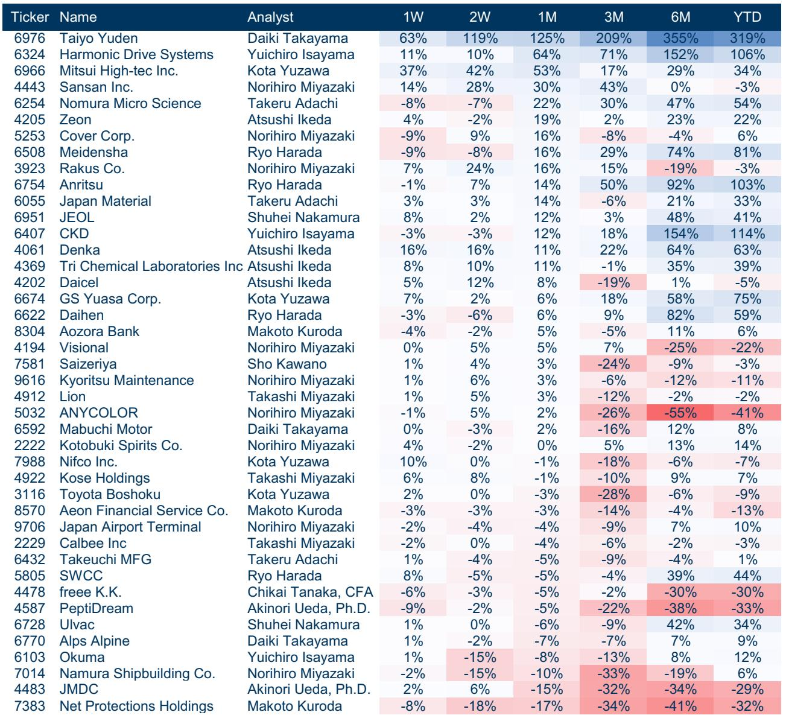
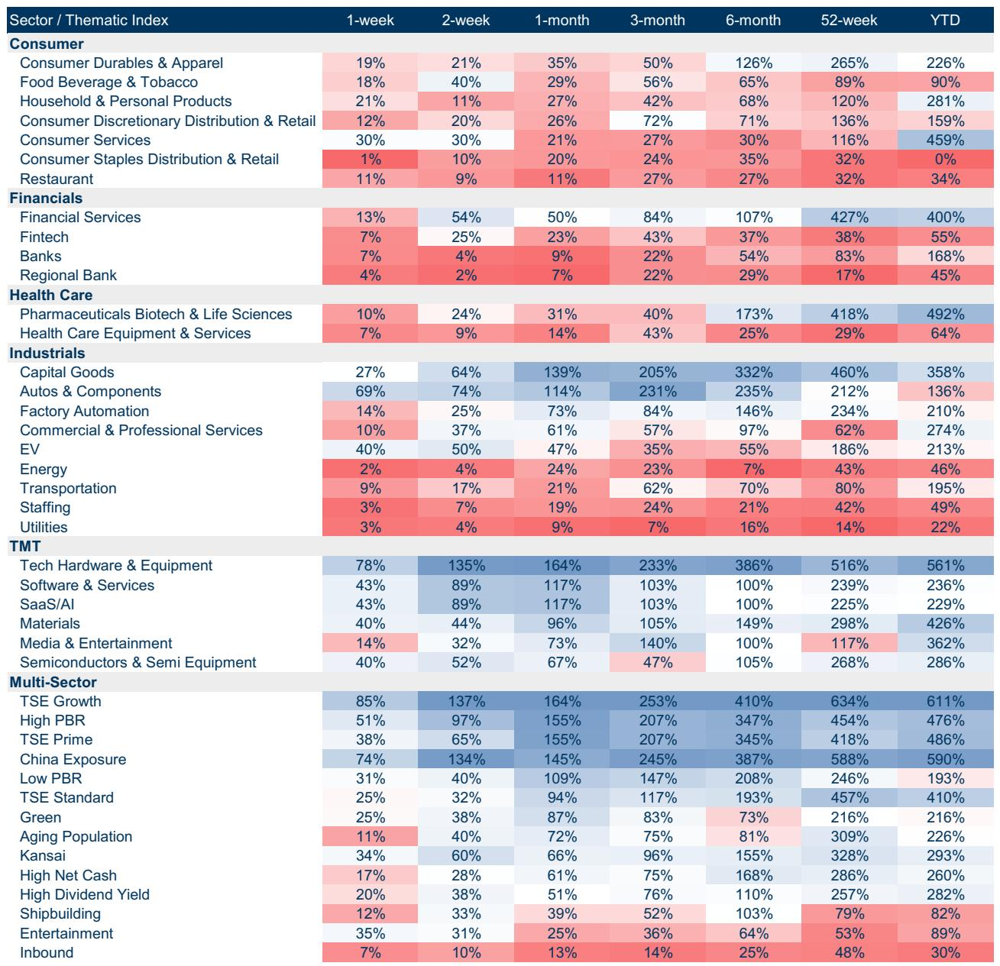
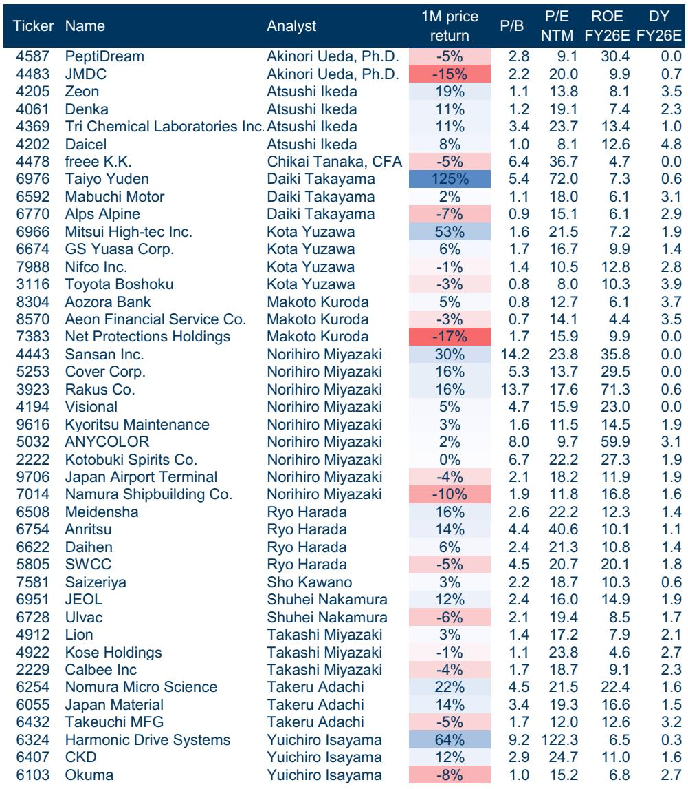

# Japan's SMID Market Has a Structural Defense Mechanism That Most Global Investors Are Ignoring

The conventional wisdom in equity strategy holds that small and mid-cap stocks are inherently more vulnerable during market corrections. They have less liquidity, thinner analyst coverage, and higher information asymmetry. In most developed markets, this thesis holds true. But Japan's SMID segment has a peculiar structural feature that flips this logic on its head for a significant subset of companies. Roughly one-third of listed Japanese companies maintain kabunushi yuutai programs—shareholder benefit schemes that provide in-kind gifts or discounts exclusively to domestic retail investors. These programs create a behavioral moat that fundamentally alters how these stocks behave during downturns. The evidence is now clear: Japanese SMID companies with yuutai programs have consistently delivered superior volatility-adjusted returns during major market corrections compared to their non-yuutai peers.

This is not a marginal observation. It is a structural insight that should reshape how allocators think about defensive positioning in Japanese equities. The typical approach to downside protection in Japan involves rotating into large-cap exporters, trading at elevated multiples, or hedging with index derivatives. Both approaches carry embedded costs and opportunity risks. The yuutai effect offers something different: a behavioral anchor rooted in the incentives of the retail investor base. During corrections, retail shareholders behave in a contrarian manner, buying when institutions sell. They also have a specific reason to hold—maintaining eligibility for their annual benefit—which reduces selling pressure. This combination creates a natural floor that is independent of valuation metrics or corporate fundamentals.

The timing of this insight matters. Flows data from the Tokyo Stock Exchange for May shows a clear pattern: individuals and foreigners net sold Standard market equities while simultaneously buying Growth market equities. This rotation into smaller, more domestically oriented names suggests that the market is already beginning to price in the defensive characteristics of certain SMID segments. The question for investors is whether they are positioned to capture this effect systematically, or whether they are still relying on outdated frameworks that treat all SMID stocks as homogeneous risk assets.

## Yuutai Programs Create a Behavioral Moat That No Valuation Model Captures

The standard approach to valuing equities assumes that all shareholders are economically rational and respond primarily to changes in expected cash flows and discount rates. This assumption breaks down when a significant portion of the shareholder base has a non-pecuniary reason to hold the stock. For yuutai-eligible companies, the domestic retail investor base is not purely price-sensitive. These investors receive a tangible benefit—often a gift certificate, product discount, or company merchandise—simply for holding a minimum number of shares. The value of this benefit is typically modest in absolute terms, but it creates a psychological attachment and a behavioral threshold that reduces the likelihood of panic selling.

The data supports this behavioral mechanism. Yuutai companies have historically traded at a valuation premium to their sector peers, even after controlling for standard factors like size, profitability, and growth. This premium is not a mispricing. It is a rational reflection of the lower expected volatility and reduced downside tail risk that these stocks offer. During the most recent correction cycle, the gap between yuutai and non-yuutai performance widened, confirming that the defensive properties are most valuable precisely when investors need them most.

The implication for portfolio construction is straightforward but underappreciated. If you are building a Japanese equity allocation and your only defensive tools are large-cap exporters or index hedges, you are leaving alpha on the table. The yuutai effect provides a natural hedge that is embedded within the SMID segment itself. It does not require taking on currency risk, paying for expensive options, or sacrificing upside participation.

## The Combination of Yuutai and High Dividend Yield Creates a Powerful Screening Framework

The report identifies a specific subset of SMID stocks that combine two structural advantages: a yuutai program and a dividend yield of at least 3.0%. This combination is analytically elegant because it addresses two distinct sources of downside risk. The dividend yield provides a cash return that compensates investors for waiting through volatility, while the yuutai program provides a behavioral anchor that reduces the probability of forced selling by the retail base.

The screening criteria used to identify these stocks are worth examining in detail. The universe is limited to companies with a market capitalization between 50 billion and 500 billion yen, a six-month average daily trading volume above five million US dollars, a yuutai program in place, a dividend yield above 3.0%, and a listing history of at least three years. These filters ensure that the resulting portfolio is both investable and representative of the structural phenomenon being studied.

What is particularly striking about the resulting screen is the sector diversity. The names span industrials, consumer discretionary, materials, and financials. This is not a single-sector trade. It is a cross-sector phenomenon driven by a common behavioral mechanism. The valuation dispersion within the screen is also notable, with price-to-book ratios ranging from below 1.0 to above 5.0, and forward P/E multiples ranging from single digits to the mid-30s. This suggests that the defensive properties of yuutai-plus-dividend stocks are not concentrated in a particular valuation regime. They appear to be structural rather than cyclical.

## The Retail Flows Data Reveals a Market That Is Already Rotating into This Trade

The May 2026 flow data from the Tokyo Stock Exchange provides a real-time confirmation of the yuutai thesis. Individuals and foreigners were net sellers of Standard market equities, with net outflows of 12.6 billion yen and 9.5 billion yen respectively. Simultaneously, they were net buyers of Growth market equities, with inflows of 11.1 billion yen and 15.5 billion yen. This is precisely the pattern one would expect if investors were rotating into domestically oriented SMID names with stable retail shareholder bases.

The two-year trend lines for both Standard and Growth markets show a gradual but persistent divergence. Foreigners have been reducing exposure to Standard names while increasing exposure to Growth names. Individuals have been doing the same, though with more volatility. Trust banks and business corporations have been the counterparties, absorbing the selling in Standard and providing liquidity on the other side.

This rotation has important implications for positioning. If the flow pattern continues, the valuation premium for yuutai-eligible SMID stocks is likely to expand further. The stocks that benefit from this rotation are not necessarily the highest-growth names in the SMID universe. They are the stocks with the most resilient retail shareholder bases—the ones where the yuutai effect is strongest. This is a subtle but important distinction. The market is not simply rotating into SMID as a size factor play. It is rotating into a specific behavioral cohort within SMID.

## What the Report Does Not Fully Answer: The Sustainability and Scalability of the Yuutai Effect

The evidence for the yuutai effect during corrections is strong, but several important questions remain unanswered. The first concerns sustainability. As Japanese corporate governance reforms continue to evolve, there is pressure on companies to eliminate shareholder benefit programs in favor of more conventional capital allocation policies, such as share buybacks or higher cash dividends. If a significant number of yuutai programs are terminated, the behavioral moat would erode, and the valuation premium could compress.

The second question is about scalability. The report's screen identifies only 19 names that meet the combined yuutai-plus-dividend criteria. This is a concentrated portfolio, and it raises the question of whether the effect can be captured at scale by institutional investors with large AUM. The liquidity filter of five million US dollars in average daily trading volume helps, but even with this filter, the aggregate market depth of the screened universe is limited. This is not a trade that can be executed in size without moving prices.

The third question is about the interaction between the yuutai effect and other defensive factors. Does the yuutai effect provide incremental protection beyond what would be captured by a simple low-volatility or high-dividend factor? The report suggests that the answer is yes, but the data to prove this conclusively would require a multi-factor attribution analysis that separates the yuutai effect from other known return drivers. This analysis is not presented in the report, and it represents a meaningful gap in the evidence base.

## A Decision Framework for Allocating to Japanese SMID Yuutai Stocks

For investors who want to act on this insight, a structured decision framework is essential. The framework should address four questions: identification, sizing, monitoring, and exit.

Identification begins with the screening criteria used in the report. Any SMID stock with a yuutai program and a dividend yield above 3.0% should be considered a candidate for inclusion. The liquidity filter is critical. If the stock does not trade enough volume to allow for meaningful position sizing without market impact, it should be excluded regardless of how attractive the yuutai characteristics appear.

Sizing should be driven by the stock's contribution to portfolio downside protection. The yuutai effect is most valuable during corrections, so the position size should be calibrated to the expected frequency and severity of market drawdowns. This is not a momentum trade. It is a defensive allocation that should be sized accordingly.

Monitoring requires tracking two variables: the status of the yuutai program and the behavior of the retail shareholder base. If a company announces the termination of its yuutai program, the stock should be re-evaluated immediately. Similarly, if the retail shareholder base begins to shrink, the behavioral moat weakens, and the position should be reduced.

Exit should be triggered by either a fundamental deterioration in the company's business or a structural change in the yuutai program. The exit should not be triggered by short-term price movements. The whole point of the yuutai effect is that these stocks are more resilient during corrections. Selling them during a correction would defeat the purpose of holding them in the first place.

## Join the Community to Read the Full Report and Review the Original Charts

The analysis presented here is based on a single month's data and a specific set of screening criteria. The full report includes multi-year historical analysis, sector-by-sector breakdowns, and detailed exhibits that show the performance of individual stocks during past correction cycles. It also includes the complete list of 19 screened names with their valuation metrics, dividend yields, and analyst ratings. To access this data and build your own screening models, join the community to read the full report and review the original charts.

*This article is for learning and discussion only and does not constitute investment advice.*

Personal reading notes and learning share only. Not investment advice.

