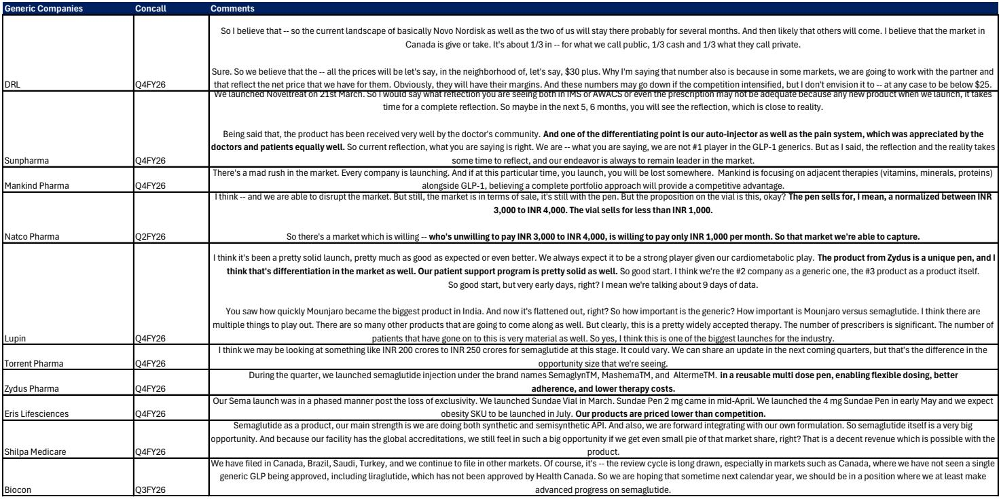
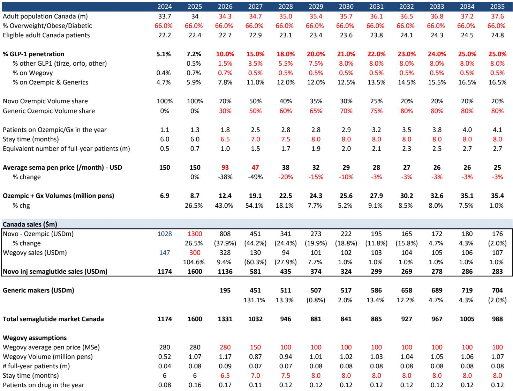
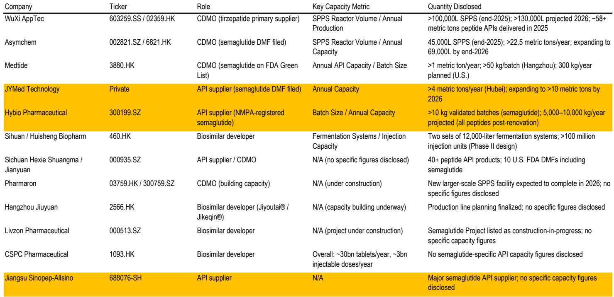

# GLP-1的“Ozempic悬崖”不是终点，而是市场分层的起点

全球糖尿病和肥胖症药物市场正在经历一个结构性拐点。诺和诺德的司美格鲁肽（Ozempic/Wegovy）专利在多个市场相继到期，仿制药已经涌入加拿大、印度和巴西。投资者习惯性地将这一事件理解为“专利悬崖”——原研药销售额崩塌，仿制药厂商分食市场。但某外资投行最新发布的深度研究报告揭示了一个更复杂的判断：**仿制药的进入不会摧毁GLP-1市场，而是将市场推入一个“两层结构”的新阶段，其中真正的赢家不是仿制药厂商本身，而是有能力在“高价值品牌层”持续创新的公司，以及那些能解决仿制药供应链瓶颈的参与者。**

这份报告的价值不在于罗列专利到期时间表，而在于它利用印度、加拿Daiwa巴西三个先行市场的实时数据，构建了一个可推演至美国和欧洲的分析框架。报告的核心洞察可以概括为一句话：**市场真正低估的不是仿制药对原研药的侵蚀速度，而是“可及性扩张”与“供应链瓶颈”之间的结构性矛盾，以及这一矛盾将如何重塑全球GLP-1产业的竞争版图。**

以下是我们从这份报告中提炼出的五个关键判断，以及它们对投资者的含义。

## 1. 仿制药带来的不是市场崩塌，而是“两层市场”的加速形成

报告第一层分析指向一个反直觉的结论：仿制药的进入不会消灭GLP-1市场，反而会通过大幅降价扩大整体市场规模，并催生一个“两层市场”结构。

以加拿大为例。司美格鲁肽专利于2026年1月到期后，Dr. Reddy's和Apotex等仿制药厂商已迅速进入市场。加拿大政府规定，当第三个仿制药获批后，价格将被强制削减65%。这意味着司美格鲁肽的月治疗费用将从约150美元降至约50美元。价格暴跌的后果不是市场萎缩，而是患者基数的大幅扩张。报告预测，加拿大GLP-1市场规模将从2025年的约15-20亿美元继续增长，因为更多原本因价格望而却步的患者将进入治疗。

印度市场提供了更生动的证据。自2026年3月专利到期以来，已有13家公司的26个仿制药获批。价格最低已降至每月15美元（使用西林瓶剂型）。结果是：司美格鲁肽的处方量在2026年2月至4月间增长了6倍以上，仿制药占据了超过80%的处方量份额。但值得注意的是，礼来的替西帕肽（Mounjaro）在同一时期仍保持了约10%的增长——这恰恰是“两层市场”的雏形：仿制药司美格鲁肽成为大众市场的“基础用药”，而替西帕肽等差异化创新药在高端市场继续获得溢价。

巴西的情况类似。首个仿制药（EMS的Ozivy）已于2026年5月获批，另有17个申请在审。当前价格160-320美元/月，报告预测到2027年将降至约60美元/月。但报告同时指出，礼来的替西帕肽预计将在巴西品牌药市场占据主导地位。

**So what：** 对于投资者而言，这意味着不应简单地将仿制药进入视为诺和诺德的“末日”。更准确的框架是：**司美格鲁肽将成为一个“大宗商品化”的基础分子，其市场规模靠量取胜；而真正的价值增长将来自那些能证明差异化疗效的创新药——如礼来的替西帕肽、未来可能上市的瑞他鲁肽等。** 这一逻辑在慢性病领域已有先例：他汀类药物在仿制药化后市场规模并未崩溃，因为新一代创新药（如PCSK9抑制剂）开辟了新的价值空间。

## 2. 仿制药供应链的真正瓶颈不在API，而在“灌装与封装”

报告的第二层分析聚焦于一个投资者争论的核心问题：仿制药厂商能否真正供应得起由降价刺激的爆发性需求？

答案是：API（活性药物成分）供应不是问题，但“灌装与封装”（Fill-and-Finish, F&F）可能成为瓶颈。

先看API。司美格鲁肽是一种肽类药物，其合成比传统小分子药复杂。但报告指出，中国的API供应商已经大规模扩产。截至2024年8月，中国有226家司美格鲁肽API供应商，在90份向美国FDA提交的原料药DMF中，有74份来自中国。中国的API产能已达到“多吨级”水平。报告估算，全球超过1亿患者所需的注射用司美格鲁肽API总量仅为10-15吨——这个数字意味着API供应在可预见的未来不会构成制约。

真正的瓶颈在F&F环节。F&F是将API转化为无菌液体、并灌装到预填充注射笔或装置中的过程。这一环节需要高度受控的洁净室环境，需要FDA的检查和批准，新建F&F产能通常需要3年以上。2022-2024年间，诺和诺德和礼来自身都曾因F&F产能不足而面临供应短缺，诺和诺德甚至为此在2024年收购了Catalent的三个F&F工厂。

对于仿制药厂商而言，F&F的挑战更大。报告提到，目前主要的F&F供应商（如OneSource、Gland Pharma）正在扩产，但能否在短期内匹配需求的爆发性增长仍存疑问。一个可能的变通方案是使用西林瓶（vial）剂型替代预填充注射笔——印度市场已经出现了这一模式，美国市场的复合药房也在使用类似方法。但西林瓶在便利性和患者依从性上不如预填充笔，这可能限制其在大规模商业化中的应用。

**So what：** 这意味着，**在仿制药价值链中，F&F环节的瓶颈可能成为决定谁能在第一波仿制药浪潮中胜出的关键变量。** 那些拥有或能够锁定F&F产能的仿制药厂商（如Dr. Reddy's，其在加拿Daiwa印度率先上市）可能获得先发优势。同时，F&F服务提供商（如Lonza、Sartorius等CDMO）可能因产能利用率上升而受益。对于投资者而言，关注点应从API供应商转向F&F产能的扩张速度和审批进度。

## 3. 口服司美格鲁肽的规模化难题，是诺和诺德被低估的“隐形风险”

报告的第三层分析揭示了一个报告标题中即已点明、但市场可能尚未充分定价的风险：口服司美格鲁肽（Wegovy Pill）的供应链可扩展性存在结构性挑战。

诺和诺德正在开发口服版司美格鲁肽，市场普遍将其视为应对仿制药竞争的重要武器。但报告提供的数据令人震惊：**口服司美格鲁肽所需的API量是注射剂的63-73倍。** 具体而言，维持剂量下，每100万患者每年需要约9.1吨API（口服），而注射剂仅需125公斤。

这一数字差异的根源在于口服肽类药物的生物利用度极低。司美格鲁肽作为一种肽，在胃肠道中容易被降解，因此口服剂型需要极高的剂量才能达到有效的血药浓度。这不仅意味着API成本的大幅上升，更意味着供应链的几何级数扩容需求。报告指出，即使中国的API供应商能够扩产，口服司美格鲁肽的规模化生产在近期内仍“不太可能”实现。

对比之下，礼来的口服GLP-1药物Foundayo（orforglipron）是一种真正的小分子药物，而非肽类。小分子药物可以采用传统的口服固体制剂生产工艺，制造复杂度和成本远低于肽类口服药。这意味着礼来在口服GLP-1赛道上拥有天然的供应链优势。

**So what：** 诺和诺德的口服司美格鲁肽在疗效数据上可能优于礼来的小分子口服药（报告提到“更高疗效”），但疗效优势可能被供应链劣势所抵消。**市场可能低估了口服司美格鲁肽在全球大规模推广的难度——尤其是在低中收入国家，这些国家恰恰是仿制药驱动的市场扩张的主要受益者。** 如果诺和诺德无法在口服剂型上实现全球供应，其对抗仿制药侵蚀的核心武器将大打折扣。这一风险在当前的股价中可能尚未被充分反映。

## 4. 礼来与诺和诺德的分化，本质上是“创新护城河”与“规模护城河”的竞赛

报告的第四层分析将两家原研药巨头的竞争格局置于仿制药冲击的背景下，得出了一个清晰的判断：**礼来更有可能在“后司美格鲁肽时代”保持领先。**

报告对诺和诺德的判断偏谨慎。司美格鲁肽占诺和诺德销售额的约75%，而仿制药的直接冲击将从2026年开始在多个市场展开。报告认为，市场共识对诺和诺德2033年约230亿美元的司美格鲁肽销售额预测“可能面临风险”。诺和诺德的新药管线——CagriSema（预计2027年获批）、zenagamtide口服药（预计2030年获批）——时间上存在明显的空窗期。在这段空窗期内，诺和诺德将面临“低价的司美格鲁肽仿制药”和“礼来及新进入者的创新药”的双重挤压。

礼来的定位则更为有利。替西帕肽（Mounjaro/Zepbound）已在头对头临床试验中证明优于司美格鲁肽，这为其在品牌药市场提供了定价权。更重要的是，礼来的管线中拥有多个差异化候选药物：瑞他鲁肽（三重激动剂）、eloraliptide（选择性胰淀素类似物），以及前述的Foundayo口服小分子。报告预测，礼来的肠促胰岛素类药物总销售额将从2026年的约600亿美元增长至2035年的约1010亿美元，其全球肠促胰岛素市场份额预计将分别达到约53%（国际）和约60%（美国）。

**So what：** 这一判断对投资组合构建的含义是：**在GLP-1领域，投资者可能需要对“创新溢价”和“仿制药侵蚀”进行更精细的量化。** 礼来的优势在于其创新管线的深度和广度，以及口服小分子带来的供应链可扩展性。诺和诺德的核心风险在于其收入高度集中于一个正在被仿制药化的分子，而新药管线的商业化时间表存在不确定性。报告同时指出，其他原研药厂商（安进、罗氏、阿斯利康、辉瑞、Structure Therapeutics等）的新药进入将加剧品牌药层的竞争，但也会推动整个市场规模的扩大。

## 5. 仿制药厂商的赢家，将是那些拥有“全球触角+整合供应链”的玩家

报告最后一部分分析了仿制药行业的竞争格局。在印度市场，已有13家公司推出仿制药，但报告认为，并非所有仿制药厂商都能从市场扩张中同等受益。

报告指出，**拥有全球触角和整合供应链的仿制药厂商更有可能捕获GLP-1类别量增的红利。** Dr. Reddy's在加拿Daiwa印度率先上市仿制药，印证了这一判断。在巴西，本地药企Hypera、零售商Raia Drogasil，以及中国的联合实验室和Medtide等供应链参与者可能从第一波仿制药中受益。

但报告也提出了一个尚未完全回答的问题：**仿制药厂商的利润率能维持多久？** 随着更多玩家进入，仿制药价格竞争将趋于激烈。在印度市场，西林瓶剂型的价格已低至每月15美元，而预填充笔的价格在60-70美元/月——价差反映了剂型和包装的附加值。这意味着，仿制药厂商的盈利能力将取决于其能否在F&F环节建立差异化，或者能否通过规模效应降低成本。

**So what：** 对于仿制药行业的投资者而言，**选择的标准应从“谁能最快推出仿制药”转向“谁能在F&F环节建立可持续的产能优势”。** 同时，报告没有完全展开的一个问题是：全球仿制药厂商的产能扩张计划是否会导致F&F环节的“过度投资”，从而在2028-2030年间出现产能过剩？这一风险需要投资者持续跟踪。

---

**报告尚未完全回答的关键问题**

尽管这份报告提供了丰富的分析框架，但仍有几个关键问题值得进一步探讨。

第一，美国市场的仿制药进入时间（预计2032年）看似遥远，但报告中的先行市场数据对美国的参考价值有多大？加拿大的医保定价机制与美国商业保险为主的支付体系存在本质差异，价格削减的路径可能完全不同。

第二，F&F环节的瓶颈究竟有多严重？报告提到了产能扩张需要3年以上，但未量化当前全球F&F产能与未来需求之间的缺口。这一缺口的精确估算将是判断仿制药厂商投资价值的关键。

第三，口服小分子GLP-1药物（如礼来的Foundayo）的长期疗效和安全性数据尚未完全公布。如果其疗效显著低于注射剂，患者可能更倾向于选择价格更低的注射用仿制药，这将改变“两层市场”的定价结构。

第四，仿制药厂商在巴西、中国等市场的定价策略和渠道能力尚未被充分拆解。不同市场的监管环境、医保覆盖和医生处方习惯将如何影响仿制药的渗透速度？

这些问题正是这份报告的价值所在——它提供了一个可验证的分析框架，而非一个确定性的结论。对于希望深入理解GLP-1市场未来十年的投资者而言，报告中的先行市场数据和供应链分析是不可多得的参考材料。

---

这些未解问题，恰恰是我们在社群中持续跟踪和讨论的核心议题。如果您希望获取完整报告原文、参与对GLP-1市场“两层结构”的深度讨论，欢迎加入我们的知识星球微信群。我们将定期分享全球顶级投行的研报解读、供应链数据更新，以及针对先行市场（印度、加拿大、巴西）的月度跟踪分析。在这里，您不仅能读到报告摘要，更能与产业界和投资界的同行一起，推演市场演变的多种可能路径。

Personal reading notes and learning share only. Not investment advice.

