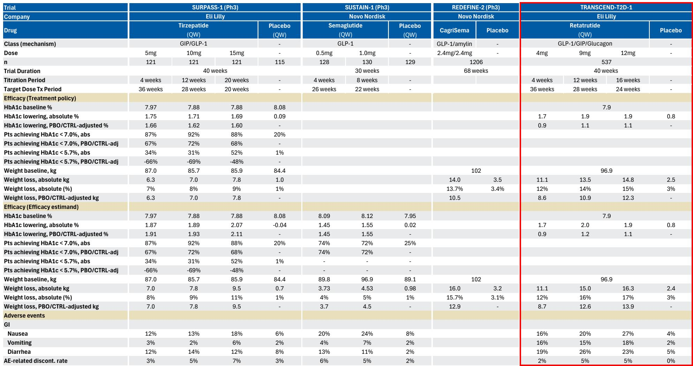
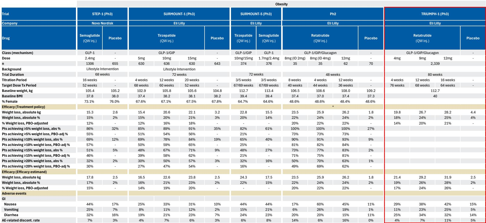
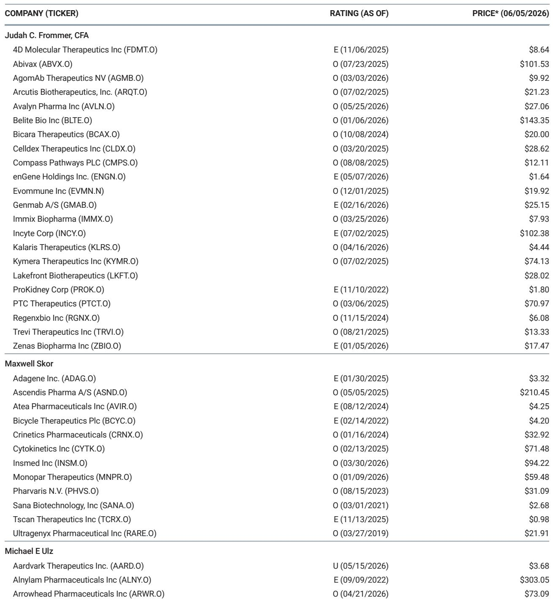

# 1900亿美元市场真正的变量不是需求，而是谁能定义“下一代标准疗法”

当全球最大的糖尿病与肥胖症市场即将突破1900亿美元时，一个关键问题正在被市场重新审视：这个赛道真正的竞争壁垒，不是谁先上市，而是谁能用数据重新定义医生和患者心目中的“标准疗法”。

今年美国糖尿病协会（ADA）年会上公布的一组数据，正在改写竞争格局。某外资投行在会后发布的研报中，通过梳理礼来、辉瑞、GPCR等核心玩家的最新临床进展，以及一场与学术内分泌学家的深度对话，揭示了一个正在形成的判断：礼来正在从“拥有最广泛管线”的公司，向“拥有定义下一代疗效标准能力”的公司跃迁。而这一点，市场可能尚未充分定价。

这不是一个关于“需求爆发”的故事。这是一个关于“供给侧竞争范式切换”的故事。当减重疗效从Tirzepatide的23%提升至Retatrutide的28.3%，当口服GLP-1从肽类转向小分子，当给药频率从周剂迈向月剂——每个技术节点的突破，都在重新划定护城河的边界。

## 1. Retatrutide的Ph3数据不只是数字，而是为整个赛道设定了新的疗效基准

ADA年会上最受关注的数据来自礼来的Retatrutide。这款GLP-1/GIP/胰高血糖素三重激动剂在TRIUMPH-1试验中交出了一份令人瞩目的成绩单：12mg剂量组在80周时实现了28.3%的体重降幅，而安慰剂组仅为2.2%。作为对照，Tirzepatide在SURMOUNT-1中的体重降幅约为23%。

更值得关注的是，在基线BMI大于等于35的患者亚组中，通过预设的延长期观察，体重下降在104周时达到了30.3%。这意味着疗效不仅没有平台期，反而在持续加深。

研报中的学术内分泌学家对此评价为“有史以来报告的最好的减重效果”。他同时指出，Retatrutide在降低糖化血红蛋白方面与Mounjaro相当——考虑到不同的安慰剂反应，这可能意味着要么存在一个疗效“地板”，要么胰高血糖素存在某种反调节机制。

这些数据传递了一个清晰信号：礼来正在用Retatrutide将竞争对手的“最优解”重新定义为“次优解”。对于任何一家试图在这个市场分一杯羹的公司而言，Retatrutide的Ph3数据已经成为了必须对标的新基准。

## 2. 礼来的真正优势不是单点突破，而是“疗效-耐受性-可及性”三角的深度覆盖

研报反复强调的一个判断是：礼来拥有业内最广泛的糖尿病肥胖管线组合，这本身就是关键竞争优势。但我们需要进一步拆解这个“广泛”背后的实质。

礼来的管线覆盖了三类核心资产：已上市的Tirzepatide（GLP-1/GIP双激动剂）、即将申报的Retatrutide（三重激动剂）、以及处于临床后期的Eloralintide（选择性胰淀素受体激动剂）。此外，还有口服小分子GLP-1药物Foundayo。

这种布局的战略意义在于：它不是在同一个维度上堆砌类似分子，而是在不同治疗维度上建立了“疗效-耐受性-可及性”的三角覆盖。Tirzepatide是经过大规模验证的基石产品；Retatrutide瞄准的是追求更强疗效的高BMI患者群体；Eloralintide则提供了“无需滴定、耐受性接近安慰剂”的差异化选择；而Foundayo作为非肽类口服小分子，解决了诺和诺德口服Wegovy因肽类结构带来的规模化限制。

研报中的KOL指出，Retatrutide的最佳使用场景是肥胖症而非2型糖尿病。他认为，Retatrutide可能成为部分肥胖患者（特别是高BMI患者）的一线疗法，但在2型糖尿病领域不太可能超越Mounjaro——后者会用于那些已经尝试过Mounjaro但希望进一步减重的患者。如果他是支付方，他会要求患者先尝试口服GLP-1或Sema/Tirz，然后才能使用Retatrutide。

这意味着礼来的管线组合本身就在构建一个分层治疗体系。不同产品服务于不同患者群体，彼此形成互补而非完全替代。这种“内部生态”一旦建立，竞争对手将面临一个两难选择：要么在每个细分维度上分别与礼来的最优单品竞争，要么在整体解决方案上被拉开差距。

## 3. 辉瑞的Berobenatide展示了“可竞争性”，但尚未回答“能否成为第一梯队”的问题

辉瑞的Berobenatide（长效注射GLP-1）在此次ADA上同样引起了关注。研报认为，其疗效数据具有竞争力，与早前公布的Ph2顶线结果一致。但值得注意的细节是：ADA现场的讨论焦点更多集中在耐受性而非疗效上，特别是从周剂向月剂转换过程中的耐受性问题。

研报中的KOL认为，Berobenatide在减重疗效上与Zepbound相似，在2型糖尿病的血糖控制上也有可比性。但他同时指出，辉瑞如果想在这个市场具备竞争力，需要一个“钩子”——而月剂给药可能是这个钩子。他相信，经过与更多患者的交流后，市场对月剂选项会有需求和兴趣，前提是耐受性必须与现有的周剂产品相当。

对于Berobenatide和安进的Maritide（长效GLP-1/GIP双激动剂），这位KOL认为两者的耐受性仍是巨大的问号，还需要更多数据。但基于现有的Ph2数据，他会选择Berobenatide而非Maritide，原因是对抗体类药物滴定问题的担忧，而非GIP拮抗作用的考量。在他看来，呕吐是两款药物之间最需要比较和监测的副作用。

研报对Berobenatide的定位是：更可能成为安进Maritide的竞争对手，而非直接挑战礼来的管线。辉瑞的目标是2028年推出周剂版本，月剂版本的审批将紧随其后。研报模型给出了60%的成功率假设，2030年风险调整后销售约为20亿美元，2035年为45亿美元。

这个定位本身说明了一个问题：对于后来者而言，即使拥有具有竞争力的分子，也难以在短期内撼动礼来已经建立的疗效和耐受性双重标准。差异化路径可能存在于给药频率或特定患者群体，但前提是耐受性数据必须经得起推敲。

## 4. 口服GLP-1和胰淀素赛道正在分化，但“先发者优势”可能比预想的更脆弱

研报中KOL对口服GLP-1和胰淀素类药物的评价，揭示了这些赛道的真实竞争态势。

对于口服GLP-1，这位不常处方这类药物的内分泌学家认为，礼来的Foundayo由于没有食物和水的限制，其产品特征优于诺和诺德的口服Wegovy。他目前没有听到关于Foundayo药物相互作用的负面反馈。但值得注意的是，他认为口服GLP-1在他自己的临床实践中“只满足有限的需求”。

对于胰淀素类药物，他不认为这些药物能成为一线疗法，因为GLP-1类药物在心血管结局和安全性方面已经积累了大量数据，“这是很难被击败的”。他将诺和诺德的Amycretin评价为“增量式改进，可能比Cagri-Sema稍好”，但对礼来的Eloralintide的单药疗效给予了更积极的评价。他更倾向于将胰淀素作为可以与其他药物联合使用的独立疗法，因为他喜欢能够分别调整剂量的灵活性。

这些判断指向一个关键洞察：口服和胰淀素类药物的竞争格局尚未固化，但“先发者优势”可能比市场预想的更脆弱。原因在于，医生和支付方对疗效和安全性的要求正在提高。在这个1900亿美元的市场中，后来者如果不能在疗效或耐受性上实现阶跃式提升，仅仅依靠“先上市”获得的窗口期可能非常有限。

## 5. 市场尚未充分定价的关键变量：Retatrutide的长期安全性数据和CVOT结果

研报中多次提到一个尚未完全回答的问题：Retatrutide的安全性信号，特别是心律失常和死亡事件的解读。

在TRANSCEND-T2D-1（2型糖尿病）试验中，Retatrutide组出现了心律失常的小幅不平衡（4/2/1 vs 0），但在TRIUMPH-1（肥胖症）试验中未观察到类似信号（1/4/5 vs 5）。试验主持人指出，报告的心律失常事件没有随剂量增加而增加，不严重，且未识别出心脏传导障碍。礼来此前表示，TRIUMPH-3试验的数据将在未来几个月内公布，以完全消除心血管风险方面的疑问。

在死亡事件方面，T2试验中Retatrutide 4mg组出现2例死亡（一例为有心脏危险因素和心脏病的患者，服药一个月后心脏骤停；另一例为有吸烟史的患者，在治疗结束后死于小细胞肺癌），而其他剂量组和安慰剂组均为0。T1试验中，Retatrutide组和安慰剂组的死亡事件数量较小且基本平衡。

KOL对此的解读是：在较小规模、较短时间的试验中观察死亡/MACE事件存在异质性，更合适的做法是在更大规模的结果试验中观察。正在进行的TRIUMPH CVOT试验（预计2029年出结果）将提供更明确的答案。

这些数据的不确定性意味着：Retatrutide的最终商业价值仍然存在一个“尾部风险”。如果长期安全性数据出现意外，整个礼来的管线估值逻辑都需要重估。反过来，如果CVOT数据积极，Retatrutide的峰值销售预测可能远高于当前研报模型的46亿美元（2030年，70%成功率）。

这是报告没有完全展开、但值得读者持续跟踪的关键问题。此外，Retatrutide与Tirzepatide的头对头试验（TRIUMPH-5）数据预计在2027年公布，这将直接回答“三重激动剂是否真的优于双激动剂”这一核心问题。

---

以上分析基于投行研报的公开信息，旨在为决策者提供一个结构化的观察框架。糖尿病肥胖症市场的竞争正在从“谁能先上市”转向“谁能用数据证明自己是更好的选择”。这个过程不会一蹴而就，但每一次ADA年会都在加速这一进程。

如果你对Retatrutide的完整Ph3数据、礼来管线的时间表、以及各公司竞争地位的深度拆解感兴趣，欢迎来我们的知识星球微信群继续讨论。我们会在群里分享研报的完整图表和后续跟踪分析。

Personal reading notes and learning share only. Not investment advice.

