# Software Snippets | Europe

# Increasing Signs of Token Budgeting?

Important events in the world of Software & Services in the week ahead, and key MS research / stories from the past week.

# Key Takeaways

■ Uber and Walmart join the list of firms citing token budget restrictions - does it matter? (#Software)   
■ SAP: A New Lens on Cloud Growth (\*MS Research\*, #SAP)   
■ Microsoft expands the agentic AI layer with an NVIDIA-powered PC (\*MS Research\*, #Software)   
■ RELX & Thomson Reuters: Takeaways from Expert Call on Legal AI (\*MS Research\*, #RELX)   
■ Spanish private software company Factorial raises funds at a \$2.5 billion valuation (#Software)

1) Uber and Walmart join the list of firms citing token budget restrictions - does it matter? (#Software): Corporates have increasingly deployed AI into their ecosystems, and in the early 'AI experimentation' and roll-out phase, we suspect there has been a degree of usage without a sharp focus on token budgeting. With ramping AI token spend, we think that discussion is evolving to also include spend efficiency and budgeting - important given IT budget growth is relatively modest at c. +3.7% y/y (where we think AI spend is still largely being sourced from). In recent weeks we note a number of press reports citing corporates introducing budget restrictions related to AI token consumption; this week Uber and Walmart joined the list. Bloomberg reports that Uber is (as standard) limiting all employees to \$1,500 per month per AI coding tool. This comes after Uber's CTO earlier in 2026 indicated that the firm had spent its entire 2026 AI coding tool budget in just four months. Bloomberg also reported that Walmart has capped usage on its internal AI tool amid high usage. The ROI on GenAI tools remains a complex discussion that is hard to get precise numbers around, and while these types of reports may re-raise those questions, we would see rapid consumption of tokens as tech validation, and these press reports somewhat as 'noise' in the mix. That said, the trend for corporates to better understand their token spend will likely continue through 2H26, and this may at some stage involve into a discussion whereby corporates evaluate spend allocations around tokens more directly against spend allocation for incremental employee hires. For now, the more important big picture is that token consumption continues scaling extremely rapidly - as a proxy, data from OpenRouter, a platform that routes AI app traffic across many large language models and providers, shows an expected 34.7 trillion tokens consumed run-rate for this week, up from just 2.1 trillion in early June 2025.

MS & CO. INTERNATIONAL PLC+

# George W Webb

Equity Analyst

George.Webb@morganstanley.com +44 20 7425-2686

# Mark Hyatt

Equity Analyst

Mark.Hyatt@morganstanley.com +44 20 7677-3663

# William Richards

Research Associate

William.Richards1@morganstanley.com +44 20 7425-0269

# TECHNOLOGY - SOFTWARE & SERVICES

Europe

Industry View

In-Line

MS does and seeks to do business with companies covered in MS. As a result, investors should be aware that the firm may have a conflict of interest that could affect the objectivity of MS. Investors should consider MS as only a single factor in making their investment decision.

# For analyst certification and other important disclosures, refer to the Disclosure Section, located at the end of this report.

+= Analysts employed by non-U.S. affiliates are not registered with FINRA, may not be associated persons of the member and may not be subject to FINRA restrictions on communications with a subject company, public appearances and trading securities held by a research analyst account.

Exhibit 1: OpenRouter-observed token consumption for last week is running well over 15x higher y/y   
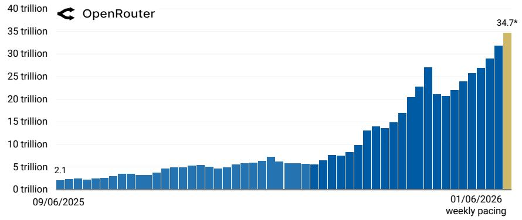

bar

| Date       | Value     |
| ---------- | --------- |
| 09/06/2025 | 2.1       |
| 01/06/2026 | 34.7*     |

NB: Uber Technologies is covered by Brian Nowak, Walmart is covered by Simeon Gutman. Data as of 05/06/26 8am UKT. \*Weekly pacing, per OpenRouter disclosure. Source: OpenRouter.ai, MS

2) SAP: A New Lens on Cloud Growth (\*MS Research\*, #SAP): Migrating on-premise customers to S/4HANA, SAP's flagship cloud ERP product, is the core engine of SAP's cloud growth story. While the licence phase of the transition is largely complete, SAP remains relatively early in converting its €10.5bn maintenance support base to cloud subscriptions, with migrations typically carrying a 2x+ revenue uplift. Recent softness in current cloud backlog (SAP's cloud revenue leading indicator) has raised questions over whether the cloud migration story is maturing, while AI/data monetisation is still not yet visible enough to drive the thesis, which we think has weighed on sentiment. To address these concerns, we use new SAP disclosures to help unpack recent cloud growth, with our analysis pointing to three key conclusions: 1) FY25 appears to mark an inflection in the cloud conversion story - with the rate of migration tripling vs. the prior 4 year run-rate. 2) The remaining conversion runway is substantial - we think we are only 20-25% penetrated into the opportunity. 3) Our estimated S/4HANA cloud revenue series suggests the core ERP transition is scaling, but with strength in breadth across the entire Cloud portfolio (Exhibit 2). With the conversion opportunity still meaningfully under-penetrated, we see a solid runway for sustained cloud growth over the next five years, supporting current valuation levels. See our full note here.

Exhibit 2: We estimate S/4HANA cloud revenue grew \~50% y/y in cc despite running at major scale (we think \~€8.3bn as of FY25)   
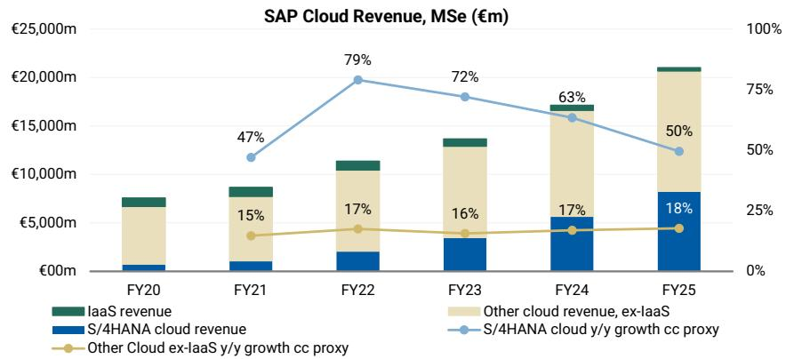

bar_line

SAP Cloud Revenue, MSe (€m)
| Fiscal Year | IaaS revenue (€m) | Other cloud revenue, ex-laaS (€m) | S/4HANA cloud revenue (€m) | Other Cloud ex-laaS y/y growth cc proxy (%) |
| :--- | :--- | :--- | :--- | :--- |
| FY20 | 1,000 | 5,000 | 1,000 | |
| FY21 | 1,500 | 6,000 | 1,500 | 47 |
| FY22 | 2,000 | 7,000 | 2,500 | 79 |
| FY23 | 2,500 | 8,000 | 3,500 | 72 |
| FY24 | 3,000 | 10,000 | 5,000 | 63 |
| FY25 | 3,500 | 11,000 | 7,500 | 50 |

Source: Company data, MS estimates. Note: cc growth rates are approximated using stated cloud revenue growth implied FX headwind (i.e. assuming the FX impact is uniform across both S/4HANA cloud and non-S/4HANA cloud ex-laaS). All figures presented excluding Qualtrics. S/4HANA cloud revenue is reported in FY20, FY21, FY22, and FY23; and estimated in FY24 and FY25.

# 3) Microsoft expands the agentic AI layer with an NVIDIA-powered PC (\*MS

Research\*, #Software): Together with NVIDIA (covered by Joseph Moore), Microsoft (covered by Josh Baer) unveiled a new class of Windows PCs powered by NVIDIA's RTX Spark platform. The announcement is an example of a future leg to Agentic AI, where agents sit on the device (a PC in this instance) - allowing personal agents to be faster and always available. Josh notes that it represents "...the first full-scale Windows systems built around an NVIDIA-designed processor architecture."

"Microsoft has emphasized that Windows is evolving beyond traditional application-centric computing toward an agent-driven experience where users increasingly interact through natural language and AI workflows rather than launching individual software applications." Josh also noted, "Strategically, RTX Spark represents another step in Microsoft's effort to extend AI inference from the cloud toward the edge while simultaneously strengthening the competitiveness of Windows." See the full note on the announcement here.

# 4) RELX & Thomson Reuters: Takeaways from Expert Call on Legal AI (\*MS

Research\*, #RELX): This week our US Information Services colleague Toni Kaplan hosted a call with a Chief Innovation Officer at a US law firm; the expert talked to how the tool landscape and use cases around Legal AI are developing. Several key takeaways are shared below. See the full note here.

- The expert's firm prefers Harvey for generic AI use cases and Westlaw (TRI)/Lexis (RELX) for legal research. The expert noted 82% weekly usage of Harvey within its attorneys and credited its appeal to its strengths with interface, simplicity, and familiarity. Westlaw and Lexis remain the preferred platforms for complex legal research due to their long-standing integration with the legal system, which provides greater confidence and credibility than general-purpose AI tools.   
- While Harvey's access to primary law may be sufficient for many use cases and can get users much of the way to an answer, it lacks the sophisticated legal infrastructure that providers like Westlaw and Lexis have built over more than a century. The expert believes that one of the most difficult challenges for AI is accurately understanding legal precedent relationships, such as whether cases have been followed, distinguished, or overruled, given the complexity of those determinations. Even established citator systems sometimes disagree on these issues.   
- The expert estimated that if Harvey, Westlaw, and Lexis were used for the same query, Harvey's output would be good enough or better \~50% of the time. The expert worries this may give attorneys a false impression that Harvey functions like a legal research tool with an extensive legal corpus, because its answers can often appear comparable to those from Westlaw or Lexis, while actually filling in gaps rather than relying on underlying case content.

# 5) Spanish private software company Factorial raises funds at a \$2.5 billion

valuation (#Software): The \$150m raise this month is a Series D round at a \$2.5

billion valuation, 2.5x their Series C round at \$1 billion in 2022. Factorial says it now serves more than 16,000 businesses, and the company announced it had reached \$100m in ARR in September 2025. Headquartered in Spain, Factorial offers a unified

HR and business management platform designed to automate key people operations for small and medium-sized organizations. It centralizes tasks such as time tracking, absence and leave management, payroll preparation, performance reviews, document handling, expense management, and recruitment in a single system. In a broad software sub-market sense, Factorial plays in a similar arena to private companies such as Personio, BambooHR, and Rippling. Sage is also adjacent through Sage HR/payroll products, though this is a smaller part of Sage's broader accounting/finance software mix.

Exhibit 3: Key week ahead events 

<table><tr><td>Monday08/06/2026</td><td>Tuesday09/06/2026</td><td>Wednesday10/06/2026</td><td>Thursday11/06/2026</td><td>Friday12/06/2026</td></tr><tr><td>London Tech Week</td><td>London Tech Week</td><td>London Tech WeekOracle 4Q26 Results</td><td>Adobe 2Q26 Results</td><td></td></tr><tr><td></td><td></td><td></td><td></td><td></td></tr><tr><td></td><td></td><td></td><td></td><td></td></tr><tr><td></td><td></td><td></td><td></td><td></td></tr><tr><td>Key</td><td>MS Europe Coverage</td><td>Other Global Stocks</td><td>Industry Event</td><td>Other</td></tr></table>

Source: MS

# Coverage Valuation vs. European Market

Exhibit 4: European Software NTM P/E vs STOXX Europe 600   
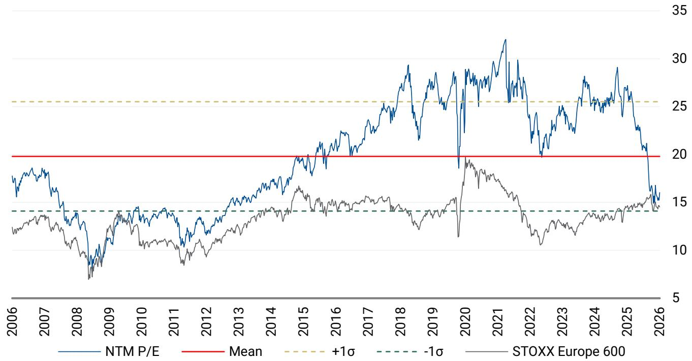

line

| Year | NTM P/E | Mean | +1σ | -1σ | STOXX Europe 600 |
|------|---------|------|-----|-----|------------------|
| 2006 | ~17     | 20   | 25  | ~14 | ~12              |
| 2007 | ~18     | 20   | 25  | ~14 | ~13              |
| 2008 | ~14     | 20   | 25  | ~14 | ~9               |
| 2009 | ~13     | 20   | 25  | ~14 | ~8               |
| 2010 | ~14     | 20   | 25  | ~14 | ~10              |
| 2011 | ~13     | 20   | 25  | ~14 | ~9               |
| 2012 | ~14     | 20   | 25  | ~14 | ~10              |
| 2013 | ~15     | 20   | 25  | ~14 | ~11              |
| 2014 | ~16     | 20   | 25  | ~14 | ~13              |
| 2015 | ~18     | 20   | 25  | ~14 | ~15              |
| 2016 | ~20     | 20   | 25  | ~14 | ~14              |
| 2017 | ~22     | 20   | 25  | ~14 | ~15              |
| 2018 | ~25     | 20   | 25  | ~14 | ~14              |
| 2019 | ~28     | 20   | 25  | ~14 | ~13              |
| 2020 | ~30     | 20   | 25  | ~14 | ~19              |
| 2021 | ~32     | 20   | 25  | ~14 | ~17              |
| 2022 | ~30     | 20   | 25  | ~14 | ~13              |
| 2023 | ~28     | 20   | 25  | ~14 | ~14              |
| 2024 | ~30     | 20   | 25  | ~14 | ~15              |
| 2025 | ~32     | 20   | 25  | ~14 | ~16              |
| 2026 | ~15     | 20   | 25  | ~14 | ~14              |

NB: Mean of CAP, DSY, INF, NEM, REL, SGE, SAP, TEMN, TIETO, and WKL. Price at close as of T-1 business day. Source: FactSet, MS

# Long-Term Valuation Charts

Exhibit 5: Amadeus P/NTM Earnings   
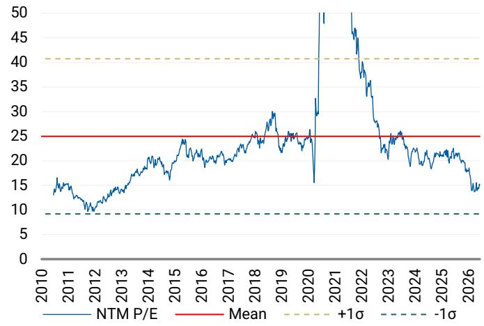

line

| Year | NTM P/E | Mean | +1σ | -1σ |
|------|---------|------|-----|-----|
| 2010 | ~15     | 25   | 40  | 10  |
| 2011 | ~13     | 25   | 40  | 10  |
| 2012 | ~10     | 25   | 40  | 10  |
| 2013 | ~12     | 25   | 40  | 10  |
| 2014 | ~15     | 25   | 40  | 10  |
| 2015 | ~18     | 25   | 40  | 10  |
| 2016 | ~20     | 25   | 40  | 10  |
| 2017 | ~22     | 25   | 40  | 10  |
| 2018 | ~25     | 25   | 40  | 10  |
| 2019 | ~30     | 25   | 40  | 10  |
| 2020 | ~15     | 25   | 40  | 10  |
| 2021 | ~50     | 25   | 40  | 10  |
| 2022 | ~45     | 25   | 40  | 10  |
| 2023 | ~30     | 25   | 40  | 10  |
| 2024 | ~25     | 25   | 40  | 10  |
| 2025 | ~20     | 25   | 40  | 10  |
| 2026 | ~15     | 25   | 40  | 10  |

NB: Price at close as of T-1 business day. Source: FactSet, MS

Exhibit 6: Capgemini P/NTM Earnings   
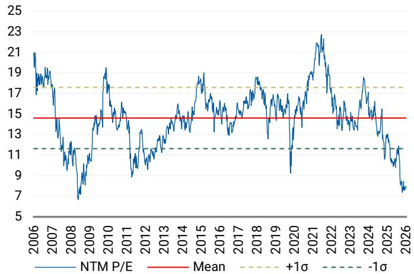

line

| Year | NTM P/E | Mean | +1σ | -1σ |
|------|---------|------|-----|-----|
| 2006 | 21.0    | 15.0 | 17.0 | -11.0 |
| 2007 | 19.0    | 15.0 | 17.0 | -11.0 |
| 2008 | 7.0     | 15.0 | 17.0 | -11.0 |
| 2009 | 14.0    | 15.0 | 17.0 | -11.0 |
| 2010 | 19.0    | 15.0 | 17.0 | -11.0 |
| 2011 | 15.0    | 15.0 | 17.0 | -11.0 |
| 2012 | 9.0     | 15.0 | 17.0 | -11.0 |
| 2013 | 13.0    | 15.0 | 17.0 | -11.0 |
| 2014 | 15.0    | 15.0 | 17.0 | -11.0 |
| 2015 | 19.0    | 15.0 | 17.0 | -11.0 |
| 2016 | 16.0    | 15.0 | 17.0 | -11.0 |
| 2017 | 14.0    | 15.0 | 17.0 | -11.0 |
| 2018 | 18.0    | 15.0 | 17.0 | -11.0 |
| 2019 | 13.0    | 15.0 | 17.0 | -11.0 |
| 2020 | 9.0     | 15.0 | 17.0 | -11.0 |
| 2021 | 23.0    | 15.0 | 17.0 | -11.0 |
| 2022 | 15.0    | 15.0 | 17.0 | -11.0 |
| 2023 | 18.0    | 15.0 | 17.0 | -11.0 |
| 2024 | 16.0    | 15.0 | 17.0 | -11.0 |
| 2025 | 13.0    | 15.0 | 17.0 | -11.0 |
| 2026 | 7.0     | 15.0 | 17.0 | -11.0 |

NB: Price at close as of T-1 business day. Source: FactSet, MS

Exhibit 7: Dassault Systemes P/NTM Earnings   
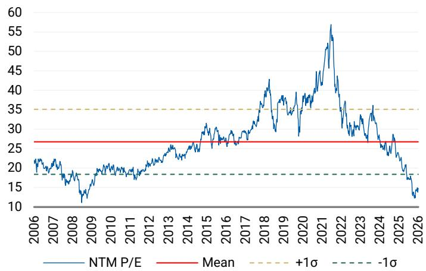

line

| Year | NTM P/E |
|------|---------|
| 2006 | 22      |
| 2007 | 20      |
| 2008 | 15      |
| 2009 | 18      |
| 2010 | 20      |
| 2011 | 19      |
| 2012 | 21      |
| 2013 | 24      |
| 2014 | 26      |
| 2015 | 30      |
| 2016 | 28      |
| 2017 | 32      |
| 2018 | 38      |
| 2019 | 35      |
| 2020 | 37      |
| 2021 | 55      |
| 2022 | 35      |
| 2023 | 30      |
| 2024 | 35      |
| 2025 | 25      |
| 2026 | 15      |

NB: Price at close as of T-1 business day. Source: FactSet, MS

Exhibit 8: HBX P/NTM Earnings   
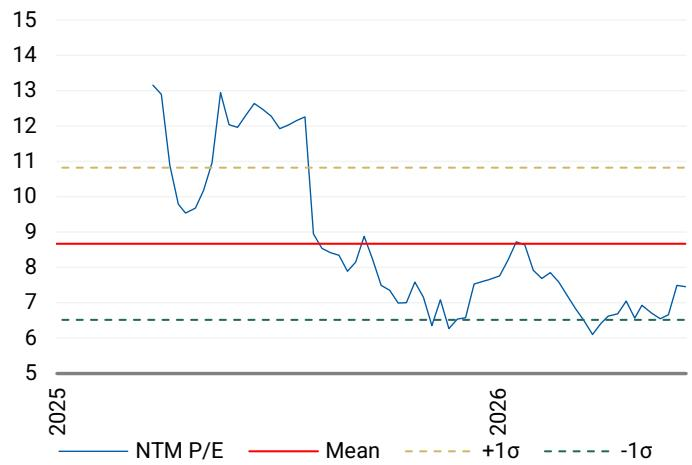

line

| Year | NTM P/E | Mean | +1σ | -1σ |
|------|---------|------|-----|-----|
| 2025 | 13.0    | 8.5  | 11.0| 6.5 |
| 2026 | 6.0     | 8.5  | 11.0| 6.5 |

NB: Price at close as of T-1 business day. Source: FactSet, MS

Exhibit 9: Indra P/NTM Earnings   
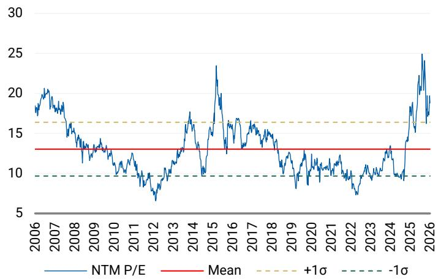

line

| Year | NTM P/E | Mean | +1σ | -1σ |
|------|---------|------|-----|-----|
| 2006 | ~18     | 13   | 16  | 9   |
| 2007 | ~20     | 13   | 16  | 9   |
| 2008 | ~16     | 13   | 16  | 9   |
| 2009 | ~14     | 13   | 16  | 9   |
| 2010 | ~12     | 13   | 16  | 9   |
| 2011 | ~10     | 13   | 16  | 9   |
| 2012 | ~8      | 13   | 16  | 9   |
| 2013 | ~10     | 13   | 16  | 9   |
| 2014 | ~16     | 13   | 16  | 9   |
| 2015 | ~23     | 13   | 16  | 9   |
| 2016 | ~14     | 13   | 16  | 9   |
| 2017 | ~16     | 13   | 16  | 9   |
| 2018 | ~14     | 13   | 16  | 9   |
| 2019 | ~12     | 13   | 16  | 9   |
| 2020 | ~10     | 13   | 16  | 9   |
| 2021 | ~12     | 13   | 16  | 9   |
| 2022 | ~8      | 13   | 16  | 9   |
| 2023 | ~10     | 13   | 16  | 9   |
| 2024 | ~12     | 13   | 16  | 9   |
| 2025 | ~25     | 13   | 16  | 9   |
| 2026 | ~20     | 13   | 16  | 9   |

NB: Price at close as of T-1 business day. Source: FactSet, MS

Exhibit 10: Informa P/NTM Earnings   
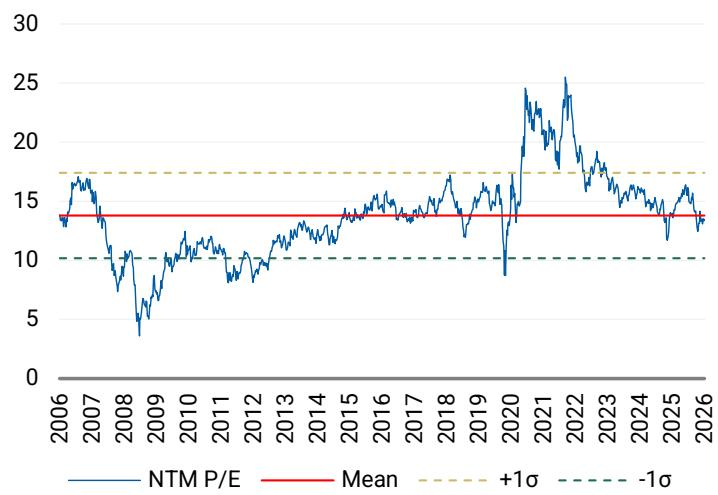

line

| Year | NTM P/E | Mean | +1σ | -1σ |
|------|---------|------|-----|-----|
| 2006 | ~13.5   | 13.5 | 17.0 | 10.0 |
| 2007 | ~16.5   | 13.5 | 17.0 | 10.0 |
| 2008 | ~4.0    | 13.5 | 17.0 | 10.0 |
| 2009 | ~8.0    | 13.5 | 17.0 | 10.0 |
| 2010 | ~11.0   | 13.5 | 17.0 | 10.0 |
| 2011 | ~9.0    | 13.5 | 17.0 | 10.0 |
| 2012 | ~10.5   | 13.5 | 17.0 | 10.0 |
| 2013 | ~12.0   | 13.5 | 17.0 | 10.0 |
| 2014 | ~13.0   | 13.5 | 17.0 | 10.0 |
| 2015 | ~14.0   | 13.5 | 17.0 | 10.0 |
| 2016 | ~14.5   | 13.5 | 17.0 | 10.0 |
| 2017 | ~14.0   | 13.5 | 17.0 | 10.0 |
| 2018 | ~17.0   | 13.5 | 17.0 | 10.0 |
| 2019 | ~13.0   | 13.5 | 17.0 | 10.0 |
| 2020 | ~9.0    | 13.5 | 17.0 | 10.0 |
| 2021 | ~24.0   | 13.5 | 17.0 | 10.0 |
| 2022 | ~25.5   | 13.5 | 17.0 | 10.0 |
| 2023 | ~18.0   | 13.5 | 17.0 | 10.0 |
| 2024 | ~16.5   | 13.5 | 17.0 | 10.0 |
| 2025 | ~15.5   | 13.5 | 17.0 | 10.0 |
| 2026 | ~13.5   | 13.5 | 17.0 | 10.0 |

NB: Price at close as of T-1 business day. Source: FactSet, MS

Exhibit 11: IONOS P/NTM Earnings   
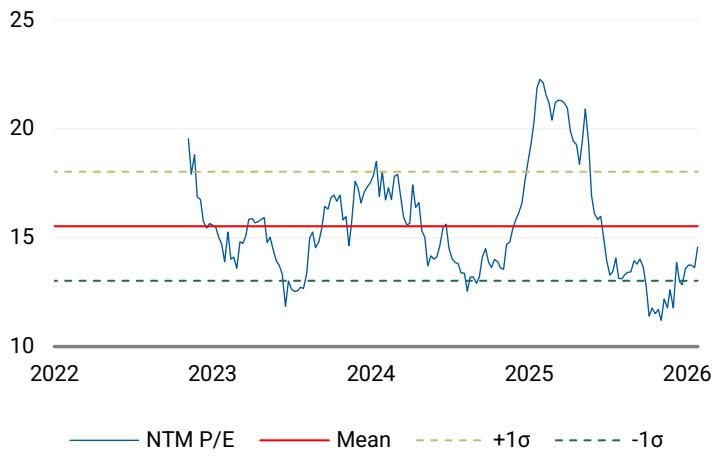

line

| Year | NTM P/E | Mean | +1σ | -1σ |
|------|---------|------|-----|-----|
| 2022 |         |      |     |     |
| 2023 |         |      |     |     |
| 2024 |         |      |     |     |
| 2025 |         |      |     |     |
| 2026 |         |      |     |     |

NB: Price at close as of T-1 business day. Source: FactSet, MS

Exhibit 12: Nemetschek Group P/NTM Earnings   
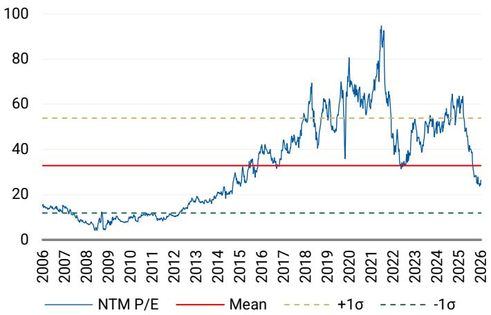

line

| Year | NTM P/E | Mean | +1σ | -1σ |
|------|---------|------|-----|-----|
| 2006 | ~15     | 33   | 54  | 13  |
| 2007 | ~12     | 33   | 54  | 13  |
| 2008 | ~8      | 33   | 54  | 13  |
| 2009 | ~5      | 33   | 54  | 13  |
| 2010 | ~8      | 33   | 54  | 13  |
| 2011 | ~10     | 33   | 54  | 13  |
| 2012 | ~12     | 33   | 54  | 13  |
| 2013 | ~15     | 33   | 54  | 13  |
| 2014 | ~20     | 33   | 54  | 13  |
| 2015 | ~25     | 33   | 54  | 13  |
| 2016 | ~35     | 33   | 54  | 13  |
| 2017 | ~45     | 33   | 54  | 13  |
| 2018 | ~60     | 33   | 54  | 13  |
| 2019 | ~70     | 33   | 54  | 13  |
| 2020 | ~80     | 33   | 54  | 13  |
| 2021 | ~95     | 33   | 54  | 13  |
| 2022 | ~60     | 33   | 54  | 13  |
| 2023 | ~40     | 33   | 54  | 13  |
| 2024 | ~55     | 33   | 54  | 13  |
| 2025 | ~65     | 33   | 54  | 13  |
| 2026 | ~25     | 33   | 54  | 13  |

NB: Price at close as of T-1 business day. Source: FactSet, MS

Exhibit 13: Netcompany P/NTM Earnings   
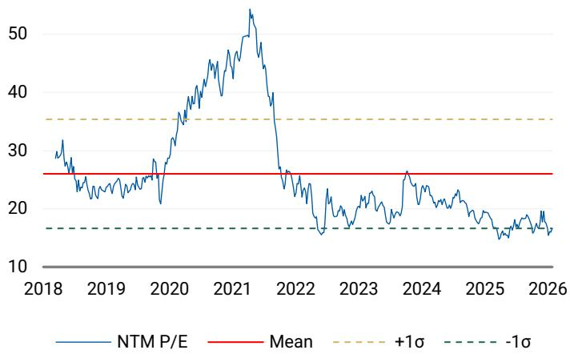

line

| Year | NTM P/E | Mean | +1σ | -1σ |
|------|---------|------|-----|-----|
| 2018 | ~30     | 26   | 35  | 17  |
| 2019 | ~25     | 26   | 35  | 17  |
| 2020 | ~35     | 26   | 35  | 17  |
| 2021 | ~55     | 26   | 35  | 17  |
| 2022 | ~25     | 26   | 35  | 17  |
| 2023 | ~20     | 26   | 35  | 17  |
| 2024 | ~25     | 26   | 35  | 17  |
| 2025 | ~18     | 26   | 35  | 17  |
| 2026 | ~15     | 26   | 35  | 17  |

NB: Price at close as of T-1 business day. Source: FactSet, MS

Exhibit 14: RELX P/NTM Earnings   
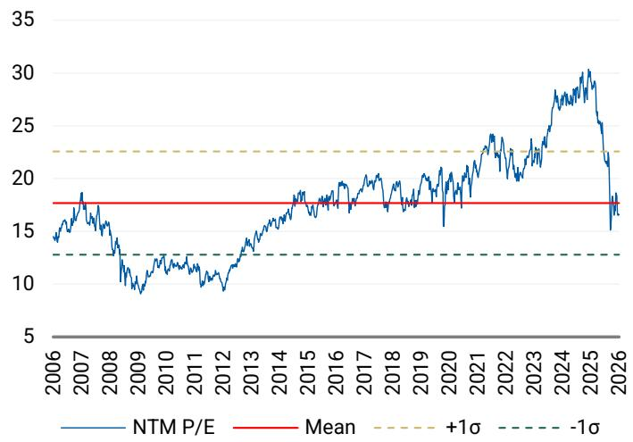

line

| Year | NTM P/E | Mean | +1σ | -1σ |
|------|---------|------|-----|-----|
| 2006 | ~14     | 17.5 | 22.5| 12.5|
| 2007 | ~18     | 17.5 | 22.5| 12.5|
| 2008 | ~13     | 17.5 | 22.5| 12.5|
| 2009 | ~9      | 17.5 | 22.5| 12.5|
| 2010 | ~11     | 17.5 | 22.5| 12.5|
| 2011 | ~10     | 17.5 | 22.5| 12.5|
| 2012 | ~9      | 17.5 | 22.5| 12.5|
| 2013 | ~13     | 17.5 | 22.5| 12.5|
| 2014 | ~16     | 17.5 | 22.5| 12.5|
| 2015 | ~18     | 17.5 | 22.5| 12.5|
| 2016 | ~19     | 17.5 | 22.5| 12.5|
| 2017 | ~20     | 17.5 | 22.5| 12.5|
| 2018 | ~18     | 17.5 | 22.5| 12.5|
| 2019 | ~20     | 17.5 | 22.5| 12.5|
| 2020 | ~16     | 17.5 | 22.5| 12.5|
| 2021 | ~24     | 17.5 | 22.5| 12.5|
| 2022 | ~23     | 17.5 | 22.5| 12.5|
| 2023 | ~24     | 17.5 | 22.5| 12.5|
| 2024 | ~30     | 17.5 | 22.5| 12.5|
| 2025 | ~30     | 17.5 | 22.5| 12.5|
| 2026 | ~16     | 17.5 | 22.5| 12.5|

NB: Price at close as of T-1 business day. Source: FactSet, MS

Exhibit 15: Sage Group P/NTM Earnings   
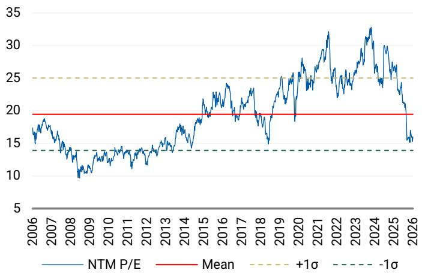

line

| Year | NTM P/E | Mean | +1σ | -1σ |
|------|---------|------|-----|-----|
| 2006 | ~17     | 20   | 25  | 14  |
| 2007 | ~18     | 20   | 25  | 14  |
| 2008 | ~14     | 20   | 25  | 14  |
| 2009 | ~10     | 20   | 25  | 14  |
| 2010 | ~13     | 20   | 25  | 14  |
| 2011 | ~13     | 20   | 25  | 14  |
| 2012 | ~14     | 20   | 25  | 14  |
| 2013 | ~15     | 20   | 25  | 14  |
| 2014 | ~17     | 20   | 25  | 14  |
| 2015 | ~19     | 20   | 25  | 14  |
| 2016 | ~23     | 20   | 25  | 14  |
| 2017 | ~20     | 20   | 25  | 14  |
| 2018 | ~18     | 20   | 25  | 14  |
| 2019 | ~25     | 20   | 25  | 14  |
| 2020 | ~27     | 20   | 25  | 14  |
| 2021 | ~30     | 20   | 25  | 14  |
| 2022 | ~32     | 20   | 25  | 14  |
| 2023 | ~33     | 20   | 25  | 14  |
| 2024 | ~31     | 20   | 25  | 14  |
| 2025 | ~28     | 20   | 25  | 14  |
| 2026 | ~16     | 20   | 25  | 14  |

NB: Price at close as of T-1 business day. Source: FactSet, MS

Exhibit 16: SAP P/NTM Earnings   
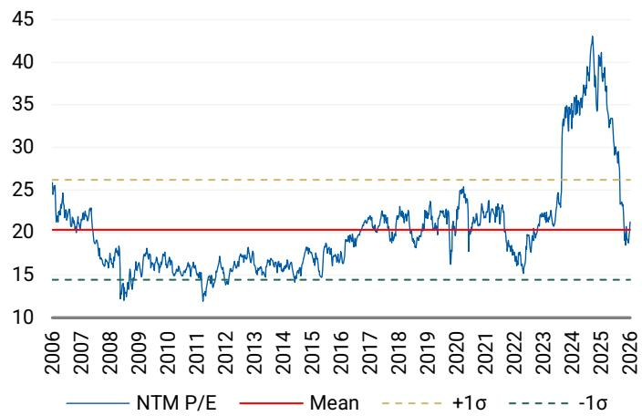

line

| Year | NTM P/E | Mean | +1σ | -1σ |
|------|---------|------|-----|-----|
| 2006 | ~25     | 20   | 25  | 15  |
| 2007 | ~23     | 20   | 25  | 15  |
| 2008 | ~18     | 20   | 25  | 15  |
| 2009 | ~15     | 20   | 25  | 15  |
| 2010 | ~16     | 20   | 25  | 15  |
| 2011 | ~14     | 20   | 25  | 15  |
| 2012 | ~15     | 20   | 25  | 15  |
| 2013 | ~16     | 20   | 25  | 15  |
| 2014 | ~17     | 20   | 25  | 15  |
| 2015 | ~18     | 20   | 25  | 15  |
| 2016 | ~19     | 20   | 25  | 15  |
| 2017 | ~20     | 20   | 25  | 15  |
| 2018 | ~21     | 20   | 25  | 15  |
| 2019 | ~22     | 20   | 25  | 15  |
| 2020 | ~23     | 20   | 25  | 15  |
| 2021 | ~24     | 20   | 25  | 15  |
| 2022 | ~25     | 20   | 25  | 15  |
| 2023 | ~30     | 20   | 25  | 15  |
| 2024 | ~35     | 20   | 25  | 15  |
| 2025 | ~43     | 20   | 25  | 15  |
| 2026 | ~18     | 20   | 25  | 15  |

NB: Price at close as of T-1 business day. Source: FactSet, MS

Exhibit 17: Temenos P/NTM Earnings   
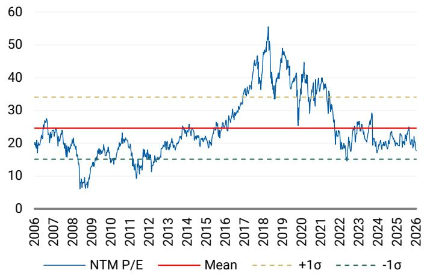

line

| Year | NTM P/E | Mean | +1σ | -1σ |
|------|---------|------|-----|-----|
| 2006 | ~20     | 25   | 33  | 15  |
| 2007 | ~25     | 25   | 33  | 15  |
| 2008 | ~15     | 25   | 33  | 15  |
| 2009 | ~5      | 25   | 33  | 15  |
| 2010 | ~15     | 25   | 33  | 15  |
| 2011 | ~20     | 25   | 33  | 15  |
| 2012 | ~15     | 25   | 33  | 15  |
| 2013 | ~20     | 25   | 33  | 15  |
| 2014 | ~25     | 25   | 33  | 15  |
| 2015 | ~30     | 25   | 33  | 15  |
| 2016 | ~35     | 25   | 33  | 15  |
| 2017 | ~40     | 25   | 33  | 15  |
| 2018 | ~55     | 25   | 33  | 15  |
| 2019 | ~45     | 25   | 33  | 15  |
| 2020 | ~40     | 25   | 33  | 15  |
| 2021 | ~35     | 25   | 33  | 15  |
| 2022 | ~20     | 25   | 33  | 15  |
| 2023 | ~25     | 25   | 33  | 15  |
| 2024 | ~30     | 25   | 33  | 15  |
| 2025 | ~25     | 25   | 33  | 15  |
| 2026 | ~20     | 25   | 33  | 15  |

NB: Price at close as of T-1 business day. Source: FactSet, MS

Exhibit 18: Tieto P/NTM Earnings   
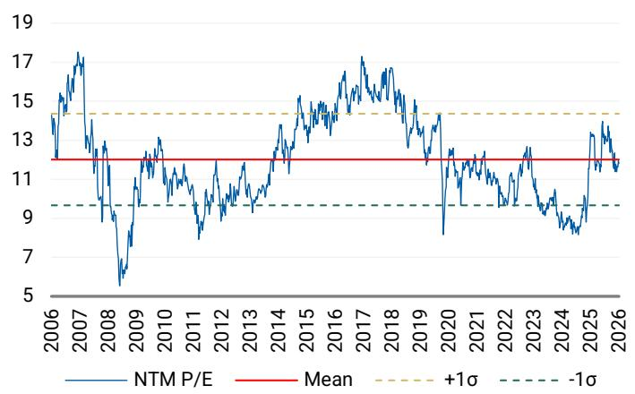

line

| Year | NTM P/E | Mean | +1σ | -1σ |
|------|---------|------|-----|-----|
| 2006 | ~14.5   | 11.5 | 14.5| 9.5 |
| 2007 | ~17.0   | 11.5 | 14.5| 9.5 |
| 2008 | ~5.5    | 11.5 | 14.5| 9.5 |
| 2009 | ~12.0   | 11.5 | 14.5| 9.5 |
| 2010 | ~13.0   | 11.5 | 14.5| 9.5 |
| 2011 | ~8.0    | 11.5 | 14.5| 9.5 |
| 2012 | ~9.0    | 11.5 | 14.5| 9.5 |
| 2013 | ~10.0   | 11.5 | 14.5| 9.5 |
| 2014 | ~13.0   | 11.5 | 14.5| 9.5 |
| 2015 | ~15.0   | 11.5 | 14.5| 9.5 |
| 2016 | ~16.0   | 11.5 | 14.5| 9.5 |
| 2017 | ~17.0   | 11.5 | 14.5| 9.5 |
| 2018 | ~16.0   | 11.5 | 14.5| 9.5 |
| 2019 | ~14.0   | 11.5 | 14.5| 9.5 |
| 2020 | ~8.0    | 11.5 | 14.5| 9.5 |
| 2021 | ~12.0   | 11.5 | 14.5| 9.5 |
| 2022 | ~13.0   | 11.5 | 14.5| 9.5 |
| 2023 | ~12.0   | 11.5 | 14.5| 9.5 |
| 2024 | ~9.0    | 11.5 | 14.5| 9.5 |
| 2025 | ~8.0    | 11.5 | 14.5| 9.5 |
| 2026 | ~13.0   | 11.5 | 14.5| 9.5 |

NB: Price at close as of T-1 business day. Source: FactSet, MS

Exhibit 19: Wolters Kluwer P/NTM Earnings   
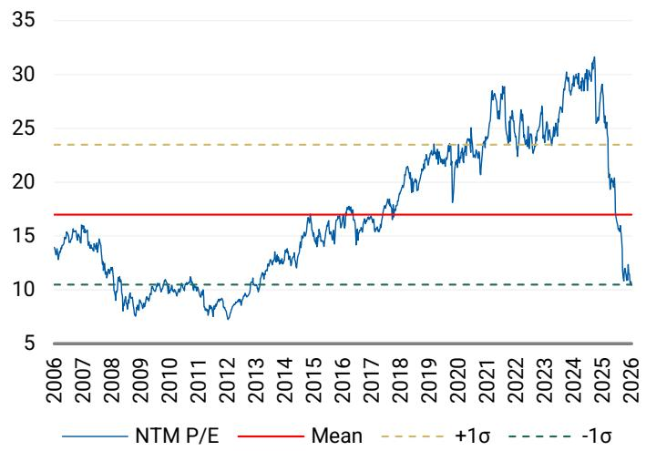

line

| Year | NTM P/E | Mean | +1σ | -1σ |
|------|---------|------|-----|-----|
| 2006 | ~14     | 17   | 23  | 10  |
| 2007 | ~15     | 17   | 23  | 10  |
| 2008 | ~10     | 17   | 23  | 10  |
| 2009 | ~8      | 17   | 23  | 10  |
| 2010 | ~10     | 17   | 23  | 10  |
| 2011 | ~8      | 17   | 23  | 10  |
| 2012 | ~7      | 17   | 23  | 10  |
| 2013 | ~9      | 17   | 23  | 10  |
| 2014 | ~12     | 17   | 23  | 10  |
| 2015 | ~15     | 17   | 23  | 10  |
| 2016 | ~17     | 17   | 23  | 10  |
| 2017 | ~18     | 17   | 23  | 10  |
| 2018 | ~20     | 17   | 23  | 10  |
| 2019 | ~23     | 17   | 23  | 10  |
| 2020 | ~25     | 17   | 23  | 10  |
| 2021 | ~28     | 17   | 23  | 10  |
| 2022 | ~26     | 17   | 23  | 10  |
| 2023 | ~28     | 17   | 23  | 10  |
| 2024 | ~30     | 17   | 23  | 10  |
| 2025 | ~32     | 17   | 23  | 10  |
| 2026 | ~10     | 17   | 23  | 10  |

NB: Price at close as of T-1 business day. Source: FactSet, MS

# Coverage Company Guidance

Exhibit 20: Company Forward Guidance (1/2) 

<table><tr><td colspan="3">Published Company Guidance / Targets</td></tr><tr><td></td><td>FY26</td><td>Mid-term / Long-term</td></tr><tr><td>Amadeus</td><td>High single digit revenue growth (in cc)Adj. EBIT margin stable at cc (FY25: 29.1%)Adj. diluted EPS growth at low double-digitFCF between €1.35-1.45 billion</td><td>Over 2026-2028:High single digit annual revenue growth (in cc)Adj. EBIT margin expansion over the periodAdj. diluted EPS growth CAGR at low double-digitFCF growth CAGR at high single digit</td></tr><tr><td>Capgemini</td><td>Revenue growth of +6.5 to 8.5% cc (organic c. 1.5 to 4%, MSe)Operating margin of 13.6% to 13.8%Organic FCF of €1.8 to 1.9bn</td><td>2028 financial ambitions:2025-28 revenue CAGR at cc of +5.5-7.5% (c. +3.5-5.5% organic)Operating Profit pre-acquisition expense to reach 12.1-12.3% of revenue (c. 130-150bps expansion vs 2025)Cumulative organic FCF &gt;€6bn over 2026-28</td></tr><tr><td>Dassault Systemes</td><td>Total revenue growth between 3 to 5% (cc)Software revenue growth 3 to 5% (cc)Services revenue growth of 2 to 6% (cc)Adj. EBIT margin guidance is 32.2 to 32.6%EPS €1.30 to 1.34</td><td>Basic 2029 EPS of €2.4</td></tr><tr><td>HBX Group</td><td>12-18% YoY growth in TTV2-7% YoY revenue growth2-7% adj. EBITDA growthc. 100% operating FCF conversion</td><td>Low-double digit TTV annual growthHigh-single digit revenue growthLow sixties adj. EBITDA margin %c. 100% cash conversion</td></tr><tr><td>Indra Sistemas</td><td>Revenue &gt;€7,000m in local currencyStated EBIT of &gt;€700mFree cash flow of &gt;€375m</td><td>Long-term (FY24-FY30):Revenues to reach €6bn in FY26 and €10bn in FY30EBITDA margins &gt;12% by FY26 and &gt;14% by FY30EBIT margin at 10% in FY26 and 12% in FY30Cumulative FCF of &gt;€3bn from FY24-FY30</td></tr><tr><td>Informa</td><td>6%± underlying revenue growth7%+ B2B Events underlying revenue growth4%± Taylor &amp; Francis underlying revenue growthReturn to revenue growth for TechTarget</td><td>5%+ underlying revenue growth p.a. out to FY28</td></tr><tr><td>IONOS Group</td><td>Group: c. 7% revenue growth with c. 37-38% adj. EBITDA margin (CC)Web Presence &amp; Productivity: 7-8% revenue growth (CC)Cloud Solutions: c. 10% revenue growth (CC)</td><td>Total revenue growth (CAGR) c. 10%Web Presence &amp; Productivity revenue growth (CAGR) c. 9%Cloud Solutions revenue growth (CAGR) c. 20%Adj. EBITDA margin c. 40%Capex (% of revenue) c. 6%</td></tr><tr><td>Nemetschek Group</td><td>14-15% constant currency revenue growth32-33% adj. EBITDA margin</td><td>None</td></tr><tr><td>Netcompany Group</td><td>Group revenue growth of 15-20% y/y (in CC), 5-10% excluding NBSAdj. EBITDA margin of 16-19%, 17-20% excluding NBS</td><td>Long-term:Annual organic revenue growth of 5-10% &quot;through any business cycle&quot;Adj. EBITDA margins &gt;20% by (in) FY29</td></tr><tr><td>RELX</td><td>&quot;We continue to see positive momentum across the group, and we expect another year of strong underlying growth in revenue and adjusted operating profit, as well as strong growth in adjusted earnings per share on a constant currency basis&quot;.Buybacks of £2,250m</td><td>None</td></tr></table>

Source: Company data, compiled by MS

Exhibit 21: Company Forward Guidance (2/2) 

<table><tr><td colspan="3">Published Company Guidance / Targets</td></tr><tr><td></td><td>FY26</td><td>Mid-term / Long-term</td></tr><tr><td>Sage Group</td><td>Organic total revenue growth in FY26 to be above 9%Operating margins are expected to trend upwards in FY26 and beyond</td><td>None</td></tr><tr><td>SAP</td><td>Cloud revenue of €25.8-26.2bn at cc (23% to 25% cc growth).Cloud and software revenue of €36.3-36.8bn at cc (12%-13% cc growth).Non-IFRS EBIT of €11.9-12.3bn (14-18% cc growth).Free cash flow c. €10bn</td><td>Expect total revenue growth to accelerate in 2027.Total operating expenses are expected to grow at 80 to 90% of total revenue growth in 2027.</td></tr><tr><td>Temenos</td><td>ARR growth of c. 12%Subscription and SaaS growth of c. 9%EBIT growth c. 9%FCF growth c. 16% (reported)</td><td>Mid-term (FY28):ARR to reach more than &gt;$1.23bnNon-IFRS EBIT of at least c.$480mFCF of at least $410m</td></tr><tr><td>Tieto</td><td>Organic growth of -2% to 0% and adj. EBITA margins of 14.8 to 15.8%</td><td>Annual revenue growth of over 5% CAGR in 2027-2028Expect 2026 to be broadly flat to slightly negative on toplineEBITA margins of over 16% by 2028</td></tr><tr><td>Wolters Kluwer</td><td>Good organic revenue growthAdj. EBIT margin: c. 28%Diluted adj. EPS growth (%, cc): High single digit growthAdj. FCF (EURm, cc): €1,300m to €1,350m</td><td>None</td></tr></table>

Source: Company data, compiled by MS

# Appendix: MS European Software & Services Coverage

Exhibit 22: Coverage Summary 

<table><tr><td>Company</td><td>Analyst</td></tr><tr><td>Amadeus</td><td>George Webb</td></tr><tr><td>Capgemini</td><td>George Webb</td></tr><tr><td>Dassault Systemes</td><td>George Webb</td></tr><tr><td>HBX Group International</td><td>Mark Hyatt</td></tr><tr><td>Hexagon AB</td><td>George Webb</td></tr><tr><td>Indra Sistemas</td><td>Adam Wood</td></tr><tr><td>Informa</td><td>George Webb</td></tr><tr><td>IONOS Group</td><td>George Webb</td></tr><tr><td>Nemetschek Group</td><td>George Webb</td></tr><tr><td>Netcompany</td><td>George Webb</td></tr><tr><td>RELX</td><td>George Webb</td></tr><tr><td>Sage Group</td><td>George Webb</td></tr><tr><td>SAP</td><td>Adam Wood</td></tr><tr><td>Temenos</td><td>Mark Hyatt</td></tr><tr><td>Tieto</td><td>Mark Hyatt</td></tr><tr><td>Wolters Kluwer</td><td>George Webb</td></tr></table>

<table><tr><td>Rating</td><td>Price Target</td></tr><tr><td>Overweight</td><td>EUR 65</td></tr><tr><td>Equal-weight</td><td>EUR 117</td></tr><tr><td>Equal-weight</td><td>EUR 21.75</td></tr><tr><td>Equal-weight</td><td>EUR 7.9</td></tr><tr><td>N/A</td><td>N/A</td></tr><tr><td>Equal-weight</td><td>EUR 60</td></tr><tr><td>Overweight</td><td>GBp 990</td></tr><tr><td>Equal-weight</td><td>EUR 29.4</td></tr><tr><td>Equal-weight</td><td>EUR 74.25</td></tr><tr><td>Underweight</td><td>DKK 334</td></tr><tr><td>Equal-weight</td><td>GBp 2970</td></tr><tr><td>Overweight</td><td>GBp 1110</td></tr><tr><td>Overweight</td><td>EUR 190</td></tr><tr><td>Underweight</td><td>CHF 59</td></tr><tr><td>Underweight</td><td>EUR 18</td></tr><tr><td>Equal-weight</td><td>EUR 80.5</td></tr></table>

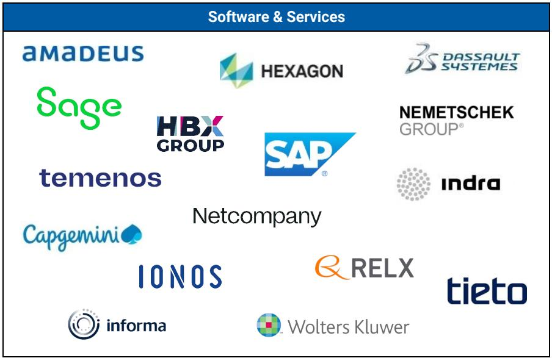

bar

Software & Services
| Company | Category | Value |
|---|---|---|
| amadeus | Software |  |
| Sage | Software |  |
| HBX GROUP | Software |  |
| temenos | Software |  |
| Capgemini | Software |  |
| Ionos | Software |  |
| HEXAGON | Software |  |
| SAP | Software |  |
| NEMETSCHEK GROUP® | Software |  |
| indra | Software |  |
| RELX | Software |  |
| tieto | Software |  |
| informa | Software |  |
| Wolters Kluwer | Software |  |

Source: MS

# Disclosure Section

The information and opinions in MS were prepared or are disseminated by MS Europe S.E., regulated by Bundesanstalt fuer Finanzdienstleistungsaufsicht (BaFin) and/or MS & Co. International plc, authorized by the Prudential Regulation Authority and regulated by the Financial Conduct Authority and the Prudential Regulation Authority. MS & Co. International plc disseminates in the UK research that it has prepared, and which has been prepared by any of its affiliates, only to persons who (i) are investment professionals falling within Article 19(5) of the Financial Services and Markets Act 2000 (Financial Promotion) Order 2005 (as amended, the "Order"); (ii) are persons who are high net worth entities falling within Article 49(2)(a) to (d) of the Order; or (iii) are persons to whom an invitation or inducement to engage in investment activity (within the meaning of section 21 of the Financial Services and Markets Act 2000, as amended) may otherwise lawfully be communicated or caused to be communicated. As used in this disclosure section, MS includes RMB MS Proprietary Limited, MS Europe S.E., MS & Co International plc and its affiliates.

For important disclosures, stock price charts and equity rating histories regarding companies that are the subject of this report, please see the MS Disclosure Website at www.morganstanley.com/eqr/disclosures/webapp/generalresearch, or contact your investment representative or MS at 1585 Broadway, (Attention: Research Management), New York, NY, 10036 USA.

For valuation methodology and risks associated with any recommendation, rating or price target referenced in this research report, please contact the Client Support Team as follows: US/Canada +1 800 303-2495; Hong Kong +852 2848-5999; Latin America +1 718 754-5444 (U.S.); London +44 (0)20-7425-8169; Singapore +65 6834-6860; Sydney +61 (0)2-9770-1505; Tokyo +81 (0)3-6836-9000. Alternatively you may contact your investment representative or MS at 1585 Broadway, (Attention: Research Management), New York, NY 10036 USA.

# Analyst Certification

The following analysts hereby certify that their views about the companies and their securities discussed in this report are accurately expressed and that they have not received and will not receive direct or indirect compensation in exchange for expressing specific recommendations or views in this report: Mark Hyatt; William Richards; George W Webb.

# Global Research Conflict Management Policy

MS has been published in accordance with our conflict management policy, which is available at www.morganstanley.com/institutional/research/conflictpolicies. A Portuguese version of the policy can be found at www.morganstanley.com.br

# Important Regulatory Disclosures on Subject Companies

As of April 30, 2026, MS beneficially owned 1% or more of a class of common equity securities of the following companies covered in MS: Amadeus IT Holdings S.A., Capgemini, Indra, Informa, Nemetschek SE, RELX, Sage, SAP SE, Wolters Kluwer.

Within the last 12 months, MS managed or co-managed a public offering (or 144A offering) of securities of Capgemini, Informa, SAP SE.

Within the last 12 months, MS has received compensation for investment banking services from Capgemini, Dassault Systemes SA, Hexagon AB, Informa, SAP SE.

In the next 3 months, MS expects to receive or intends to seek compensation for investment banking services from Amadeus IT Holdings S.A., Capgemini, Dassault Systemes SA, Hexagon AB, Indra, Informa, IONOS Group SE, Nemetschek SE, Netcompany Group A/S, RELX, Sage, SAP SE, Temenos Group AG, Tietoevry Oyj, Wolters Kluwer.

Within the last 12 months, MS has received compensation for products and services other than investment banking services from Amadeus IT Holdings S.A., Capgemini, Dassault Systemes SA, HBX Group International PLC, Hexagon AB, Informa, RELX, SAP SE, Tietoevry Oyj.

Within the last 12 months, MS has provided or is providing investment banking services to, or has an investment banking client relationship with, the following company: Amadeus IT Holdings S.A., Capgemini, Dassault Systemes SA, Hexagon AB, Indra, Informa, IONOS Group SE, Nemetschek SE, Netcompany Group A/S, RELX, Sage, SAP SE, Temenos Group AG, Tietoevry Oyj, Wolters Kluwer.

Within the last 12 months, MS has either provided or is providing non-investment banking, securities-related services to and/or in the past has entered into an agreement to provide services or has a client relationship with the following company: Amadeus IT Holdings S.A., Capgemini, Dassault Systemes SA, HBX Group International PLC, Hexagon AB, Informa, RELX, Sage, SAP SE, Tietoevry Oyj, Wolters Kluwer.

MS & Co. International plc is a corporate broker to Informa, Sage.

The equity research analysts or strategists principally responsible for the preparation of MS have received compensation based upon various factors, including quality of research, investor client feedback, stock picking, competitive factors, firm revenues and overall investment banking revenues. Equity Research analysts' or strategists' compensation is not linked to investment banking or capital markets transactions performed by MS or the profitability or revenues of particular trading desks.

MS and its affiliates do business that relates to companies/instruments covered in MS, including market making, providing liquidity, fund management, commercial banking, extension of credit, investment services and investment banking. MS sells to and buys from customers the securities/instruments of companies covered in MS on a principal basis. MS may have a position in the debt of the Company or instruments discussed in this report. MS trades or may trade as principal in the debt securities (or in related derivatives) that are the subject of the debt research report.

Certain disclosures listed above are also for compliance with applicable regulations in non-US jurisdictions.

# STOCK RATINGS

MS uses a relative rating system using terms such as Overweight, Equal-weight, Not-Rated or Underweight (see definitions below). MS does not assign ratings of Buy, Hold or Sell to the stocks we cover. Overweight, Equal-weight, Not-Rated and Underweight are not the equivalent of buy, hold and sell. Investors should carefully read the definitions of all ratings used in MS. In addition, since MS contains more complete information concerning the analyst's views, investors should carefully read MS, in its entirety, and not infer the contents from the rating alone. In any case, ratings (or research) should not be used or relied upon as investment advice. An investor's decision to buy or sell a stock should depend on individual circumstances (such as the investor's existing holdings) and other considerations.

# Global Stock Ratings Distribution

(as of May 31, 2026)

The Stock Ratings described below apply to MS's Fundamental Equity Research and do not apply to Debt Research produced by the Firm.

For disclosure purposes only (in accordance with FINRA requirements), we include the category headings of Buy, Hold, and Sell alongside our ratings of Overweight, Equal-weight, Not-Rated and Underweight. MS does not assign ratings of Buy, Hold or Sell to the stocks we cover. Overweight, Equal-weight, Not-Rated and Underweight are not the equivalent of buy, hold, and sell but represent recommended relative weightings (see definitions below). To satisfy regulatory requirements, we correspond Overweight, our most positive stock rating, with a buy recommendation; we correspond Equal-weight and Not-Rated to hold and Underweight to sell recommendations, respectively.

<table><tr><td></td><td colspan="2">Coverage Universe</td><td colspan="3">Investment Banking Clients (IBC)</td><td colspan="2">Other Material Investment ServicesClients (MISC)</td></tr><tr><td>Stock RatingCategory</td><td>Count</td><td>% of Total</td><td>Count</td><td>% of Total IBC</td><td>% of RatingCategory</td><td>Count</td><td>% of Total OtherMISC</td></tr><tr><td>Overweight/Buy</td><td>1542</td><td>42%</td><td>465</td><td>51%</td><td>30%</td><td>707</td><td>43%</td></tr><tr><td>Equal-weight/Hold</td><td>1571</td><td>43%</td><td>369</td><td>40%</td><td>23%</td><td>723</td><td>44%</td></tr><tr><td>Not-Rated/Hold</td><td>3</td><td>0%</td><td>0</td><td>0%</td><td>0%</td><td>1</td><td>0%</td></tr><tr><td>Underweight/Sell</td><td>551</td><td>15%</td><td>86</td><td>9%</td><td>16%</td><td>201</td><td>12%</td></tr><tr><td>Total</td><td>3,667</td><td></td><td>920</td><td></td><td></td><td>1632</td><td></td></tr></table>

Data include common stock and ADRs currently assigned ratings. Investment Banking Clients are companies from whom MS received investment banking compensation in the last 12 months. Due to rounding off of decimals, the percentages provided in the "% of total" column may not add up to exactly 100 percent.

# Analyst Stock Ratings

Overweight (O). The stock's total return is expected to exceed the average total return of the analyst's industry (or industry team's) coverage universe, on a risk-adjusted basis, over the next 12-18 months.

Equal-weight (E). The stock's total return is expected to be in line with the average total return of the analyst's industry (or industry team's) coverage universe, on a risk-adjusted basis, over the next 12-18 months.

Not-Rated (NR). Currently the analyst does not have adequate conviction about the stock's total return relative to the average total return of the analyst's industry (or industry team's) coverage universe, on a risk-adjusted basis, over the next 12-18 months.

Underweight (U). The stock's total return is expected to be below the average total return of the analyst's industry (or industry team's) coverage universe, on a risk-adjusted basis, over the next 12-18 months.

Unless otherwise specified, the time frame for price targets included in MS is 12 to 18 months.

# Analyst Industry Views

Attractive (A): The analyst expects the performance of his or her industry coverage universe over the next 12-18 months to be attractive vs. the relevant broad market benchmark, as indicated below.

In-Line (I): The analyst expects the performance of his or her industry coverage universe over the next 12-18 months to be in line with the relevant broad market benchmark, as indicated below. Cautious (C): The analyst views the performance of his or her industry coverage universe over the next 12-18 months with caution vs. the relevant broad market benchmark, as indicated below. Benchmarks for each region are as follows: North America - S&P 500; Latin America - relevant MSCI country index or MSCI Latin America Index; Europe - MSCI Europe; Japan - TOPIX; Asia - relevant MSCI country index or MSCI sub-regional index or MSCI AC Asia Pacific ex Japan Index.

# Important Disclosures for MS Smith Barney LLC Customers

Important disclosures regarding any material conflict of interest that can reasonably be expected to have influenced MS Smith Barney LLC's choice of a third-party research provider or the subject company of a third-party research report, are available on the MS Wealth Management disclosure website at www.morganstanley.com/online/researchdisclosures. For MS specific disclosures, you may refer to https://www.morganstanley.com/eqr/disclosures/webapp/generalresearch.

Each MS report is reviewed and approved on behalf of MS Smith Barney LLC. This review and approval is conducted by the same person who reviews the research report on behalf of MS. This could create a conflict of interest.

# Other Important Disclosures

MS policy is to update research reports as and when the Research Analyst and Research Management deem appropriate, based on developments with the issuer, the sector, or the market that may have a material impact on the research views or opinions stated therein. In addition, certain Research publications are intended to be updated on a regular periodic basis (weekly/monthly/quarterly/annual) and will ordinarily be updated with that frequency, unless the Research Analyst and Research Management determine that a different publication schedule is appropriate based on current conditions.

MS is not acting as a municipal advisor and the opinions or views contained herein are not intended to be, and do not constitute, advice within the meaning of Section 975 of the Dodd-Frank Wall Street Reform and Consumer Protection Act.

MS produces an equity research product called a "Tactical Idea." Views contained in a "Tactical Idea" on a particular stock may be contrary to the recommendations or views expressed in research on the same stock. This may be the result of differing time horizons, methodologies, market events, or other factors. For all research available on a particular stock, please contact your sales representative or go to Matrix at http://www.morganstanley.com/matrix.

MS is provided to our clients through our proprietary research portal on Matrix and also distributed electronically by MS to clients. Certain, but not all, MS products are also made available to clients through third-party vendors or redistributed to clients through alternate electronic means as a convenience. For access to all available MS, please contact your sales representative or go to Matrix at http://www.morganstanley.com/matrix.

Any access and/or use of MS is subject to MS's Terms of Use (http://www.morganstanley.com/terms.html). By accessing and/or using MS, you are indicating that you have read and agree to be bound by our Terms of Use (http://www.morganstanley.com/terms.html). In addition you consent to MS processing your personal data and using cookies in accordance with our Privacy Policy and our Global Cookies Policy (http://www.morganstanley.com/privacy\_pledge.html), including for the purposes of setting your preferences and to collect readership data so that we can deliver better and more personalized service and products to you. To find out more information about how MS processes personal data, how we use cookies and how to reject cookies see our Privacy Policy and our Global Cookies Policy (http://www.morganstanley.com/privacy\_pledge.html). Please use the provided link to review the Terms and Conditions and Most Important Terms and Conditions for MS India Company Private Limited (https://www.morganstanley.com/assets/pdfs/about-us-global-offices/india/Terms\_and\_conditions.pdf) and the following link to review the audit report (https://ny.matrix.ms.com/eqr/research/webapp/researchdocs/

# MSICPL\_Morgan\_Stanley\_Research\_Audit\_Report.pdf).

If you do not agree to our Terms of Use and/or if you do not wish to provide your consent to MS processing your personal data or using cookies please do not access our research. MS does not provide individually tailored investment advice. MS has been prepared without regard to the circumstances and objectives of those who receive it. MS recommends that investors independently evaluate particular investments and strategies, and encourages investors to seek the advice of a financial adviser. The appropriateness of an investment or strategy will depend on an investor's circumstances and objectives. The securities, instruments, or strategies discussed in MS may not be suitable for all investors, and certain investors may not be eligible to purchase or participate in some or all of them. MS is not an offer to buy or sell or the solicitation of an offer to buy or sell any security/instrument or to participate in any particular trading strategy. The value of and income from your investments may vary because of changes in interest rates, foreign exchange rates, default rates, prepayment rates, securities/instruments prices, market indexes, operational or financial conditions of companies or other factors. There may be time limitations on the exercise of options or other rights in securities/instruments transactions. Past performance is not necessarily a guide to future performance. Estimates of future performance are based on assumptions that may not be realized. If provided, and unless otherwise stated, the closing price on the cover page is that of the primary exchange for the subject company's securities/instruments.

The fixed income research analysts, strategists or economists principally responsible for the preparation of MS have received compensation based upon various factors, including quality, accuracy and value of research, firm profitability or revenues (which include fixed income trading and capital markets profitability or revenues), client feedback and competitive factors. Fixed Income Research analysts', strategists' or economists' compensation is not linked to investment banking or capital markets transactions performed by MS or the profitability or revenues of particular trading desks.

The "Important Regulatory Disclosures on Subject Companies" section in MS lists all companies mentioned where MS owns 1% or more of a class of common equity securities of the companies. For all other companies mentioned in MS, MS may have an investment of less than 1% in securities/instruments or derivatives of securities/instruments of companies and may trade them in ways different from those discussed in MS. Employees of MS not involved in the preparation of MS may have investments in securities/instruments or derivatives of securities/instruments of companies mentioned and may trade them in ways different from those discussed in MS. Derivatives may be issued by MS or associated persons.

With the exception of information regarding MS, MS is based on public information. MS makes every effort to use reliable, comprehensive information, but we make no representation that it is accurate or complete. We have no obligation to tell you when opinions or information in MS change apart from when we intend to discontinue equity research coverage of a subject company. Facts and views presented in MS have not been reviewed by, and may not reflect information known to, professionals in other MS business areas, including investment banking personnel.

MS personnel may participate in company events such as site visits and are generally prohibited from accepting payment by the company of associated expenses unless pre-approved by authorized members of Research management.

MS may make investment decisions that are inconsistent with the recommendations or views in this report.

To our readers based in Taiwan or trading in Taiwan securities/instruments: Information on securities/instruments that trade in Taiwan is distributed by MS Taiwan Limited ("MSTL"). Such information is for your reference only. The reader should independently evaluate the investment risks and is solely responsible for their investment decisions. MS may not be distributed to the public media or quoted or used by the public media without the express written consent of MS. Any non-customer reader within the scope of Article 7-1 of the Taiwan Stock Exchange Recommendation Regulations accessing and/or receiving MS is not permitted to provide MS to any third party (including but not limited to related parties, affiliated companies and any other third parties) or engage in any activities regarding MS which may create or give the appearance of creating a conflict of interest. Information on securities/instruments that do not trade in Taiwan is for informational purposes only and is not to be construed as a recommendation or a solicitation to trade in such securities/instruments. MSTL may not execute transactions for clients in these securities/instruments.

MS is not incorporated under PRC law and the research in relation to this report is conducted outside the PRC. MS does not constitute an offer to sell or the solicitation of an offer to buy any securities in the PRC. PRC investors shall have the relevant qualifications to invest in such securities and shall be responsible for obtaining all relevant approvals, licenses, verifications and/or registrations from the relevant governmental authorities themselves. Neither this report nor any part of it is intended as, or shall constitute, provision of any consultancy or advisory service of securities investment as defined under PRC law. Such information is provided for your reference only.

MS is disseminated in Brazil by MS C.T.V.M. S.A. located at Av. Brigadeiro Faria Lima, 3600, 6th floor, São Paulo - SP, Brazil; and is regulated by the Comissão de Valores Mobiliários; in Mexico by MS México, Casa de Bolsa, S.A. de C.V which is regulated by Comision Nacional Bancaria y de Valores. Paseo de los Tamarindos 90, Torre 1, Col. Bosques de las Lomas Floor 29, 05120 Mexico City; in Japan by MS MUFG Securities Co., Ltd. and, for Commodities related research reports only, MS Capital Group Japan Co., Ltd; in Hong Kong by MS Asia Limited (which accepts responsibility for its contents) and by MS Bank Asia Limited; in Singapore by MS Asia (Singapore) Pte. (Registration number 199206298Z) and/or MS Asia (Singapore) Securities Pte Ltd (Registration number 200008434H), regulated by the Monetary Authority of Singapore (which accepts legal responsibility for its contents and should be contacted with respect to any matters arising from, or in connection with, MS) and by MS Bank Asia Limited, Singapore Branch (Registration number T14FC0118J); in Australia to "wholesale clients" within the meaning of the Australian Corporations Act by MS Australia Limited A.B.N. 67 003 734 576, holder of Australian financial services license No. 233742, which accepts responsibility for its contents; in Australia to "wholesale clients" and "retail clients" within the meaning of the Australian Corporations Act by MS Wealth Management Australia Pty Ltd (A.B.N. 19 009 145 555, holder of Australian financial services license No. 240813, which accepts responsibility for its contents; in Korea by MS & Co International plc, Seoul Branch; in India by MS India Company Private Limited having Corporate Identification No (CIN) U22990MH1998PTC115305, regulated by the Securities and Exchange Board of India ("SEBI") and holder of licenses as a Research Analyst (SEBI Registration No. INH000001105); Stock Broker (SEBI Stock Broker Registration No. INZ000244438), Merchant Banker (SEBI Registration No. INM000011203), and depository participant with National Securities Depository Limited (SEBI Registration No. IN-DP-NSDL-567-2021) having registered office at Altimus, Level 39 & 40, Pandurang Budhkar Marg, Worli, Mumbai 400018, India; Telephone no. +91-22-61181000; Compliance Officer Details: Mr. Tejarshi Hardas, Tel. No.: +91-22-61181000 or Email: tejarshi.hardas@morganstanley.com; Grievance officer details: Mr. Tejarshi Hardas, Tel. No.: +91-22-61181000 or Email: msic-compliance@morganstanley.com. MS India Company Private Limited (MSICPL) may use AI tools in providing research services. All recommendations contained herein are made by the duly qualified research analysts; in Canada by MS Canada Limited; in Germany and the European Economic Area where required by MS Europe S.E., authorised and regulated by Bundesanstalt fuer Finanzdienstleistungsaufsicht (BaFin) under the reference number 149169; in the US by MS & Co. LLC, which accepts responsibility for its contents. MS & Co. International plc, authorized by the Prudential Regulation Authority and regulated by the Financial Conduct Authority and the Prudential Regulation Authority, disseminates in the UK research that it has prepared, and research which has been prepared by any of its affiliates, only to persons who (i) are investment professionals falling within Article 19(5) of the Financial Services and Markets Act 2000 (Financial Promotion) Order 2005 (as amended, the "Order"); (ii) are persons who are high net worth entities falling within Article 49(2)(a) to (d) of the Order; or (iii) are persons to whom an invitation or inducement to engage in investment activity (within the meaning of section 21 of the Financial Services and Markets Act 2000, as amended) may otherwise lawfully be communicated or caused to be communicated. RMB MS Proprietary Limited is a member of the JSE Limited and A2X (Pty) Ltd. RMB MS Proprietary Limited is a joint venture owned equally by MS International Holdings Inc. and RMB Investment Advisory (Proprietary) Limited, which is wholly owned by FirstRand Limited. The information in MS is being disseminated by MS Saudi Arabia, regulated by the Capital Market Authority in the Kingdom of Saudi Arabia, and is directed at Sophisticated investors only.

The information in MS is being communicated by MS & Co. International plc (DIFC Branch), regulated by the Dubai Financial Services Authority (the DFSA) or by MS & Co. International plc (ADGM Branch), regulated by the Financial Services Regulatory Authority Abu Dhabi (the FSRA), and is directed at Professional Clients only, as defined by the DFSA or the FSRA, respectively. The financial products or financial services to which this research relates will only be made available to a customer who we are satisfied meets the regulatory criteria of a Professional Client. A distribution of the different MS Research ratings or recommendations, in percentage terms for Investments in each sector covered, is available upon request from your sales representative.

The information in MS is being communicated by MS & Co. International plc (QFC Branch), regulated by the Qatar Financial Centre Regulatory Authority (the QFCRA), and is directed at business customers and market counterparties only and is not intended for Retail Customers as defined by the QFCRA.

As required by the Capital Markets Board of Turkey, investment information, comments and recommendations stated here, are not within the scope of investment advisory activity. Investment advisory service is provided exclusively to persons based on their risk and income preferences by the authorized firms. Comments and recommendations stated here are general in nature. These opinions may not fit to your financial status, risk and return preferences. For this reason, to make an investment decision by relying solely to this information stated here may not bring about outcomes that fit your expectations.

The trademarks and service marks contained in MS are the property of their respective owners. Third-party data providers make no warranties or representations relating to the accuracy, completeness, or timeliness of the data they provide and shall not have liability for any damages relating to such data. The Global Industry Classification Standard (GICS) was developed by and is the exclusive property of MSCI and S&P.

MS, or any portion thereof may not be reprinted, sold or redistributed without the written consent of MS.

Indicators and trackers referenced in MS may not be used as, or treated as, a benchmark under Regulation EU 2016/1011, or any other similar framework.

The issuers and/or fixed income products recommended or discussed in certain fixed income research reports may not be continuously followed. Accordingly, investors should regard those fixed income research reports as providing stand-alone analysis and should not expect continuing analysis or additional reports relating to such issuers and/or individual fixed income products. MS may hold, from time to time, material financial and commercial interests regarding the company subject to the Research report.

Registration granted by SEBI and certification from the National Institute of Securities Markets (NISM) in no way guarantee performance of the intermediary or provide any assurance of returns to investors. Investment in securities market are subject to market risks. Read all the related documents carefully before investing.

INDUSTRY COVERAGE: Technology - Software & Services 

<table><tr><td>COMPANY (TICKER)</td><td>RATING (AS OF)</td><td>PRICE* (06/04/2026)</td></tr><tr><td colspan="3">Adam Wood</td></tr><tr><td>Indra (IDR.MC)</td><td>E (01/12/2026)</td><td>€54.40</td></tr><tr><td>SAP SE (SAP.N)</td><td>O (02/20/2026)</td><td>US$187.14</td></tr><tr><td>SAP SE (SAPG.DE)</td><td>O (03/20/2020)</td><td>€164.50</td></tr><tr><td colspan="3">George W Webb</td></tr><tr><td>Amadeus IT Holdings S.A. (AMA.MC)</td><td>O (04/10/2026)</td><td>€54.00</td></tr><tr><td>Capgemini (CAPP.PA)</td><td>E (02/19/2026)</td><td>€104.20</td></tr><tr><td>Dassault Systemes SA (DAST.PA)</td><td>E (03/17/2026)</td><td>€20.16</td></tr><tr><td>Hexagon AB (HEXAb.ST)</td><td></td><td>SKr 87.32</td></tr><tr><td>IONOS Group SE (IOSn.DE)</td><td>E (05/12/2025)</td><td>€30.16</td></tr><tr><td>Nemetschek SE (NEKG.DE)</td><td>E (07/13/2022)</td><td>€67.45</td></tr><tr><td>Netcompany Group A/S (NETCG.CO)</td><td>U (01/12/2026)</td><td>DKr 357.00</td></tr><tr><td>Sage (SGE.L)</td><td>O (12/08/2021)</td><td>883p</td></tr><tr><td colspan="3">Mark Hyatt</td></tr><tr><td>HBX Group International PLC (HBX.MC)</td><td>E (04/17/2026)</td><td>€7.11</td></tr><tr><td>Temenos Group AG (TEMN.S)</td><td>U (12/15/2017)</td><td>SFr 71.45</td></tr><tr><td>Tietoevry Oyj (TIETO.HE)</td><td>U (01/12/2026)</td><td>€21.10</td></tr></table>

Stock Ratings are subject to change. Please see latest research for each company.   
\* Historical prices are not split adjusted.