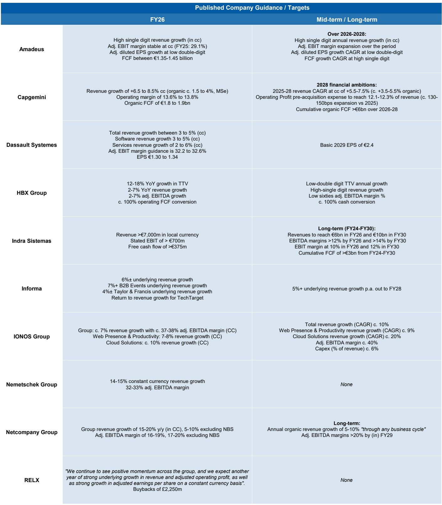
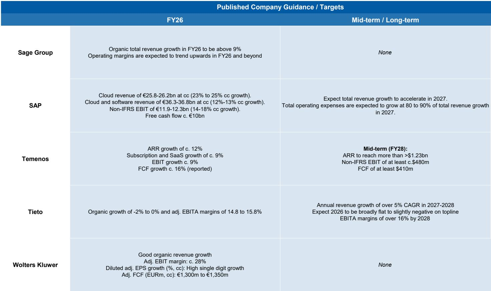

# 市场真正低估的不是AI需求，而是企业对“token预算”的重新定价

当Uber和Walmart先后被曝出限制员工使用AI工具的消息时，市场的第一反应是“AI热潮退潮了”。Uber将所有员工的AI编码工具使用额度限制在每月1500美元，Walmart则因内部AI工具使用量过高而设置使用上限。这些消息在社交媒体上被迅速放大，似乎为“AI泡沫论”提供了新的弹药。

但这份某外资投行最新发布的欧洲软件行业周报提出了一个完全相反的判断：这些限制性措施不是需求疲软的信号，而是AI采用进入新阶段的标志。报告的核心洞察是，企业正在从“AI实验期”进入“token预算管理期”，而这一转变对软件行业投资逻辑的影响，远比表面上的“限制”二字复杂得多。

基于这份报告，我们认为市场真正需要关注的，不是AI需求是否在放缓——因为token消耗量仍在以15倍以上的年增速扩张——而是企业如何重新定价AI能力，以及这一重新定价过程将如何重塑软件行业的竞争格局和估值体系。

## 1. 企业“token预算”的出现不是需求见顶，而是规模化采用的必经阶段

报告引用OpenRouter的数据显示，截至本周，全球AI token消耗的周运行率已达到34.7万亿，而2025年6月初仅为2.1万亿。一年之内增长超过15倍。Uber在2026年前四个月就花光了全年AI编码工具预算，说明的不是需求不足，而是需求远超预期。

从企业IT预算角度看，这一点尤为关键。报告指出，全球IT预算增速约为每年3.7%，而AI支出目前仍主要从这一预算中挤占。当AI token消耗以指数级速度增长时，企业必然面临预算约束。Uber和Walmart的做法，本质上是企业财务管理对技术扩张的自然反应，而非技术价值的否定。

这里需要区分两个概念：一个是AI的“采用率”，另一个是AI的“货币化率”。token预算限制影响的是后者，而非前者。当企业开始系统性地管理token支出时，恰恰说明AI已经嵌入核心业务流程，不再是边缘实验。这一判断的逻辑是：如果AI工具只是偶尔使用，企业根本不需要设置预算上限。

## 2. SAP云转型的真正拐点：迁移速度翻三倍，但市场只看到了近期的“软数据”

报告对SAP的分析是本周最值得深入研读的部分。SAP的云转型故事已经讲了很多年，但近期其“当前云积压订单”增速放缓，引发市场对云迁移故事是否成熟的担忧。

报告通过新的披露数据，给出了三个关键判断：第一，2025财年可能标志着云转换故事的拐点——迁移率较此前四年的年化速度翻了三倍。第二，剩余的转换空间仍然巨大，报告估计目前仅渗透了20%-25%的机会。第三，其旗舰云ERP产品S/4HANA的云收入虽然已接近83亿欧元的规模，但仍保持约50%的同比增长。

这意味着什么？市场可能高估了SAP云迁移的成熟度，同时低估了其持续增长的跑道。核心ERP的云转换不是线性过程，而是存在加速拐点。当客户从观望转向行动时，迁移速度可能远超市场预期。报告没有完全展开的一个问题是：这种加速拐点是否具有行业普遍性，还是SAP独有的产品周期效应？

## 3. 微软与NVIDIA的PC合作，揭示了“边缘AI代理”这一被低估的竞争维度

微软和NVIDIA联合推出的RTX Spark平台，代表了一个重要的结构性变化：AI代理正在从云端向设备端迁移。报告引用微软分析师的观点指出，Windows正在从“以应用为中心”的计算模式转向“以代理驱动”的体验，用户越来越多地通过自然语言和AI工作流与系统交互，而非启动单独的软件应用。

这一变化的战略含义远超硬件升级本身。当AI代理可以驻留在PC上运行，意味着个人AI助手将具备“更快、始终可用”的特性。这不仅仅是用户体验的提升，更是对现有软件分发模式的根本性挑战。如果用户未来通过AI代理而非传统应用界面完成工作，那么SaaS的订阅模式、应用的发现机制、甚至数据的所有权结构都可能被重新定义。

报告对此着墨不多，但这一趋势的长期影响值得深思。边缘AI代理的普及，可能从根本上改变企业软件的定价模式——从按用户收费转向按token收费，或者按代理执行的任务数量收费。这将是软件行业商业模式的一次重大重构。

## 4. 法律AI领域的竞争格局：Harvey的“足够好”陷阱与LexisNexis/Westlaw的护城河

报告通过一场与某美国律师事务所首席创新官的专家电话，揭示了法律AI领域的真实竞争格局。专家所在律所对通用AI用例首选Harvey，对复杂法律研究则仍依赖Westlaw（汤森路透）和Lexis（RELX）。专家估计，Harvey的输出在约50%的情况下与Westlaw或Lexis“足够好或更好”。

这里的关键洞察在于“足够好”可能是一个陷阱。专家担心，当Harvey的输出看起来与专业法律研究工具相当时，律师可能产生一种“它像是一个拥有广泛法律语料库的研究工具”的错觉，而实际上Harvey是在填补内容空白，而非依赖底层案例内容。法律研究的核心价值不在于找到相关案例，而在于理解判例之间的引用关系——哪些案例被遵循、被区分、被推翻。这种关系判断的复杂性，连成熟的引证系统有时都会产生分歧。

这意味着法律AI领域的竞争不是简单的技术竞赛。那些拥有百年法律基础设施积累的传统玩家，其护城河不仅在于数据，更在于对法律推理结构的深刻理解。Harvey等新兴工具可能在通用场景中表现良好，但在需要精确法律判断的高价值场景中，专业平台的信任优势短期内难以被撼动。

## 5. 报告尚未完全回答的关键问题：token预算约束是否会反向抑制AI创新

报告对token预算限制持乐观态度，认为这是技术验证的信号。但这里有一个尚未被充分讨论的反向风险：如果企业普遍引入严格的token预算管理，是否会抑制开发者和产品经理尝试新AI功能的意愿？当每个token都有明确的成本归属时，实验性的AI应用可能被优先削减，而这恰恰是创新的温床。

报告提到了一个值得关注的方向：token支出的讨论未来可能演变为“token支出与新增员工支出之间的直接比较”。如果企业开始将AI token预算与人力资源预算进行替代性权衡，那么AI的定价逻辑将不再是技术成本问题，而是劳动力替代的经济学问题。这一转变的影响范围远超软件行业本身。

另一个未解问题是：token消耗的指数级增长能否持续。OpenRouter的数据虽然惊人，但该平台的路由机制可能放大了增长数字。不同模型的token定价差异、企业自建模型对API调用的替代、以及模型效率的提升，都可能在未来影响token消耗的增速。报告对此没有给出明确的判断框架。

## 观察框架：如何评估一家软件公司的AI定价权

基于上述分析，我们提出一个评估框架，供读者在分析软件公司时参考：

第一，看token消耗密度。一家公司的AI功能是否被高频使用，可以通过其API调用量或用户交互次数来间接衡量。消耗密度高的公司，其AI功能已经嵌入核心工作流，而非边缘功能。

第二，看定价模式转换能力。从按用户收费转向按使用量收费的公司，可能拥有更强的AI货币化能力。但这一转换需要谨慎评估客户接受度和竞争反应。

第三，看AI对客户留存的影响。如果AI功能显著提升了客户的切换成本——比如通过个性化模型训练或数据锁定——那么即使token预算受限，客户也不太可能轻易放弃该平台。

第四，看管理层对token预算的认知。如果公司管理层将token预算视为“成本控制问题”，而非“价值创造问题”，那么其AI战略可能偏保守；反之，如果公司将token预算视为“投资分配问题”，则更可能抓住结构性机会。

这些框架并非公式，而是帮助读者在阅读公司财报和产品更新时，建立自己的判断基准。

## 尾声：哪些问题值得继续追问

这份报告提供了多个有价值的数据点和分析框架，但正如所有研报一样，它留下了一些值得继续探讨的问题。SAP的迁移加速拐点是否可持续？边缘AI代理对SaaS商业模式的冲击何时会显现？法律AI领域的信任优势能否被技术突破所颠覆？token预算的引入是否会改变AI投资回报率的计算方式？

这些问题没有标准答案，但正是这些未解问题构成了持续跟踪和研究的意义。如果你对这些话题感兴趣，欢迎来我们的星球微信群继续讨论。我们会定期分享深度研报解读、行业动态跟踪，以及对这些未解问题的持续思考。

Personal reading notes and learning share only. Not investment advice.

