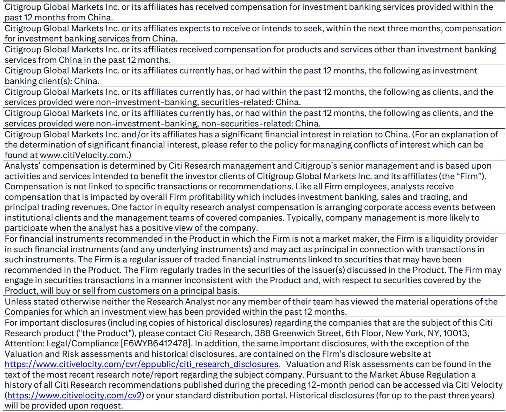
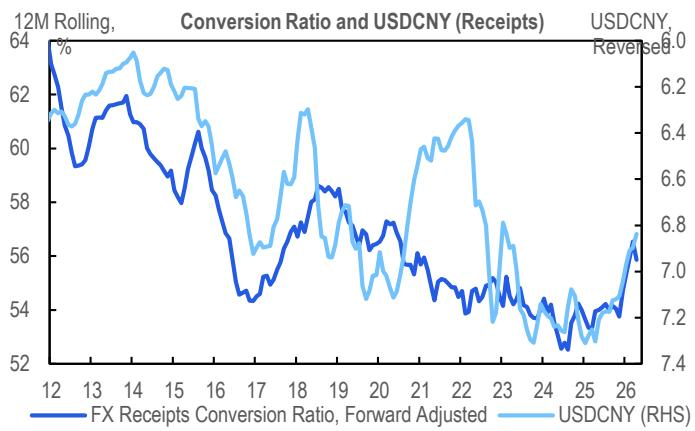
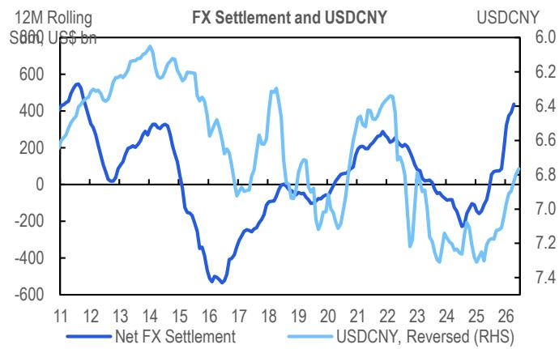

# China's Outbound Investment Tightening Is Not a Capital Control Story — It Is a Regulatory Modernization Signal

The recent series of actions tightening China's outbound investments has been widely interpreted as a new wave of capital controls. This reading is incomplete and potentially misleading. A careful examination of the regulatory actions, the macroeconomic context, and the stated policy objectives suggests a fundamentally different narrative: Beijing is closing regulatory loopholes and strengthening domestic policy effectiveness, not reimposing capital account restrictions. The distinction matters because it changes how investors should assess risk, allocate capital, and position for the next phase of China's financial integration.

Three coordinated actions define this moment. The State Council released new outbound investment regulations that consolidate national security, data, and technology controls into a single unified framework, expanding coverage to individuals. The CSRC issued action plans to rectify illegal cross-border securities operations, singling out three brokers for investigation and penalties. And Hong Kong regulators issued guidance on account openings for mainland investors. Each action targets a specific regulatory gap. Together, they form a coherent pattern that is more about enforcement architecture than about restricting legitimate capital movement.

The timing is deliberate and strategic. Unlike previous tightening episodes in 2015-2016, the renminbi is in an appreciation cycle. Unexplained capital outflows, as measured by balance-of-payments residuals, appear manageable. Exporters' FX conversion ratios are rising. This is not a crisis response. It is a structural upgrade of the regulatory framework at a moment of relative calm, which is precisely when such upgrades are most effective and least disruptive.

## The Policy Focus Is on Closing Regulatory Loopholes, Not Curbing Capital Outflows, and the Macro Impact Will Be Limited

The most common analytical error is to conflate regulatory enforcement with capital control tightening. These actions are fundamentally about closing the gap between what the rules say and what market participants do. The three brokers named by the CSRC were flagged as early as 2016, with a prior tightening round in 2022. The current action is the culmination of a decade-long enforcement trajectory, not a sudden policy reversal.

On the ODI front, national security considerations are growing, particularly amid the AI race and technology competition. The extension of controls to individuals is unsurprising. Chinese firms are expanding abroad structurally, and ODI is on an upward trend as companies search for growth engines beyond the domestic market. The new regulations do not reverse this trend. They impose clearer guardrails around technology transfer, data security, and sensitive sectors. For most legitimate outbound investments, the impact will be procedural rather than prohibitive.

On portfolio flows, the enforcement action targets illegal cross-border operations, not authorized channels. The three named brokers could hold approximately HKD 250 billion in mainland customer assets. Even if the rectification expands to other channels such as Hong Kong property, insurance, or private banking, the macro impact is likely to be measured. The potential inflows from mainland China to Hong Kong across stocks, asset management, insurance, and property total in the hundreds of billions of HKD, but these are stocks, not flows. The marginal impact on capital flows is what matters, and that appears contained.

The macroeconomic context reinforces this view. RMB appreciation reduces the incentive for disguised capital outflows. Middle East funds flowing into Hong Kong post-conflict provide a counterbalancing source of demand. The current account surplus remains substantial. FX reserves are stable. This is not a repeat of 2015, when unexplained capital outflows reached hundreds of billions of dollars and the PBOC was forced to defend the currency. The residual change in FX reserves today is a fraction of that episode.

## The Enforcement Action Targets a Specific Regulatory Architecture, Not the Principle of Capital Mobility

Understanding what is being enforced requires understanding what was previously unenforced. The regulatory framework for outbound investment has long existed on paper. What changed is the willingness and capacity to enforce it comprehensively. The CSRC's action against the three brokers is a signal that regulatory arbitrage through Hong Kong intermediaries is no longer tolerated.

The guidance from HK SFC and HKMA on account openings for mainland investors is particularly telling. It closes a specific loophole where mainland residents could open accounts in Hong Kong through brokers without proper due diligence on the source of funds or the purpose of the investment. This is not about preventing mainland residents from investing abroad. It is about ensuring that when they do, it is through authorized channels with proper documentation and tax compliance.

The expansion of scrutiny to Hong Kong property, insurance, and private banking follows the same logic. These sectors have been used as channels for capital that bypasses official oversight. The regulatory response is to bring these flows within the formal system, not to stop them. For investors using legitimate channels, the impact should be minimal. For those relying on regulatory gaps, the cost of compliance will rise.

## Taxation Is the Second-Order Concern That Could Reshape the Investment Landscape

The most underappreciated implication of this tightening is the taxation question. When funds reroute back to the mainland, either voluntarily or through enforcement, the tax authorities will have a clearer picture of previously unreported overseas gains. Personal income tax revenue growth has already accelerated to 12.2% year-on-year in the first four months of 2025, partially reflecting stepped-up tax collection on overseas gains.

This is not coincidental. The regulatory tightening and tax enforcement are two sides of the same coin. Closing the regulatory loopholes creates visibility. Visibility enables taxation. For high-net-worth individuals and corporate investors who have accumulated overseas assets through channels that were technically legal but poorly documented, the tax exposure could be significant.

The second-order implications extend beyond personal income tax. If funds are repatriated, corporate tax liabilities on previously deferred overseas earnings may become due. The tax treatment of gains from Hong Kong property, insurance products, and private banking investments will come under greater scrutiny. Investors who assumed that regulatory opacity provided tax protection may need to reassess their positions.

This is a structural shift, not a temporary enforcement campaign. The government's fiscal position, constrained by property sector weakness and local government debt, creates a strong incentive to capture tax revenue from overseas gains. The regulatory tightening provides the mechanism. Investors should expect the tax enforcement to persist and potentially intensify.

## Closing the Back Door Does Not Prevent Opening the Front Door Wider — Official Channels Are Likely to Expand

The most strategically important question is whether this tightening represents a retreat from financial opening or a precondition for deeper integration. The evidence points toward the latter. The government has multiple tools to expand official outbound investment channels: increasing the QDII quota from its current USD 176 billion, broadening the Wealth Management Product Connect rollout beyond the Greater Bay Area, and launching pilot programs for Insurance Connect.

Each of these tools represents a front door that is fully under regulatory control. The logic is straightforward: close the back doors that create regulatory arbitrage and financial stability risks, then open the front doors wider through channels that can be monitored, taxed, and managed. This is precisely what the report means when it states that closing the back door will not prevent opening the front door wider.

The expansion of Stock Connect southbound flows provides a precedent. Despite periodic concerns about capital controls, southbound flows have continued to grow, with cumulative net flows reaching significant levels. The key difference is that these flows go through a regulated channel where the authorities can see who is investing, how much, and for what purpose. The current tightening is designed to shift more flows into these visible channels.

For institutional investors, the implication is clear. The most efficient way to access offshore markets will increasingly be through authorized channels. The cost of using unregulated intermediaries will rise, both in terms of regulatory risk and potential tax exposure. The strategic response is not to resist this shift but to position for the expansion of official channels that will follow.

## What the Report Does Not Fully Answer: The Geopolitical Dimension and the RMB Internationalization Paradox

The report makes a compelling case that capital controls do not undermine RMB internationalization because internationalization runs through official channels. This is analytically correct but strategically incomplete. The geopolitical dimension of this tightening receives less attention than it deserves.

The national security provisions in the new outbound investment regulations are explicitly linked to technology and data controls. In the context of US-China technology competition, these provisions create a tension between RMB internationalization and technology security. If Chinese companies cannot invest in foreign technology firms, and if foreign firms face restrictions on technology transfer to China, the volume of cross-border investment that supports RMB internationalization may be constrained.

The report acknowledges that RMB internationalization still has a long way to go as the PBOC tries to find the right balance in the classical trilemma. But the trilemma is becoming a quadrilemma: the traditional trade-off between exchange rate stability, capital mobility, and monetary policy independence is now complicated by technology security concerns. The report does not fully explore how this fourth dimension changes the calculus.

There is also an unresolved question about Hong Kong's role. The report argues that Hong Kong's connector role is not likely to be materially undermined, supported by RMB appreciation and Middle East fund inflows. But if the tightening reduces mainland capital flows into Hong Kong, and if the regulatory scrutiny makes Hong Kong less attractive as a destination for mainland capital, the city's financial ecosystem could face structural headwinds. The Middle East inflows provide a buffer, but they are not a perfect substitute for mainland capital in terms of volume, velocity, or sectoral composition.

## A Decision Framework for Investors: Three Questions to Guide Positioning

The report's analysis translates into a practical decision framework for investors. Three questions should guide strategic positioning in response to this tightening.

First, which channel are you using? If your outbound investment flows through authorized channels such as QDII, Stock Connect, Bond Connect, or CIBM Direct, the direct impact of this tightening is minimal. If you are using Hong Kong intermediaries, insurance products, or property investments as channels for capital that has not gone through official approval, your regulatory and tax risk has increased materially. The appropriate response depends on which bucket you fall into.

Second, what is your time horizon? The expansion of official channels is likely to be gradual, not immediate. QDII quota increases, WMP Connect rollout, and Insurance Connect pilots will take time to implement. For near-term capital deployment, the tightening creates friction. For medium-term positioning, the eventual expansion of official channels creates opportunities. The strategic question is whether to wait for the front door to open wider or to accept higher costs for using existing channels.

Third, how exposed are you to taxation risk? If you have accumulated overseas assets through channels that are now being brought under scrutiny, the tax exposure could be significant. The acceleration of personal income tax collection on overseas gains is a clear signal. Proactive tax planning and disclosure may be more cost-effective than waiting for enforcement actions. The report's data on personal income tax revenue growth suggests that the authorities are serious about capturing this revenue.

For institutional investors, the framework extends to portfolio construction. The tightening reduces the attractiveness of Hong Kong property and certain insurance products as capital outflow channels. It increases the relative attractiveness of authorized investment vehicles. It creates opportunities in sectors that benefit from the expansion of official channels, such as asset managers with QDII licenses and Hong Kong exchange operators that facilitate Stock Connect flows.

## The Unresolved Questions That Define the Next Phase

The report identifies three things to watch: implementation details, taxation concerns, and expansion of official channels. Each of these contains unresolved questions that will define the investment landscape in the coming quarters.

On implementation, the key question is scope. Will the enforcement expand beyond the three named brokers to other intermediaries? Will it extend to insurance, wealth management products, private equity, and property? The report suggests that further expansion would not be surprising, but the pace and breadth remain uncertain. Investors should monitor regulatory announcements for signals about the next targets.

On taxation, the key question is enforcement intensity. Will the government pursue retrospective taxation on previously unreported overseas gains, or will it focus on forward-looking compliance? The acceleration of personal income tax collection suggests retrospective enforcement is possible, but the political and economic costs of aggressive tax enforcement could constrain the authorities. The balance between revenue maximization and capital market stability will determine the outcome.

On official channel expansion, the key question is sequencing. Will QDII quota increases come first, or will the government prioritize WMP Connect and Insurance Connect? Each channel has different implications for different investor segments. The sequencing will reveal the government's priorities and provide signals about which types of outbound investment are being encouraged.

Join the community to read the full report and review the original charts.

*This article is for learning and discussion only and does not constitute investment advice.*

Personal reading notes and learning share only. Not investment advice.

