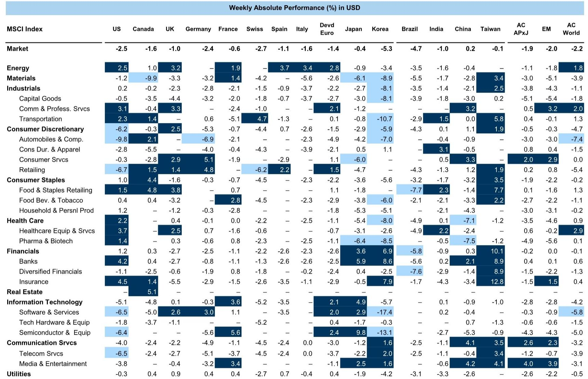
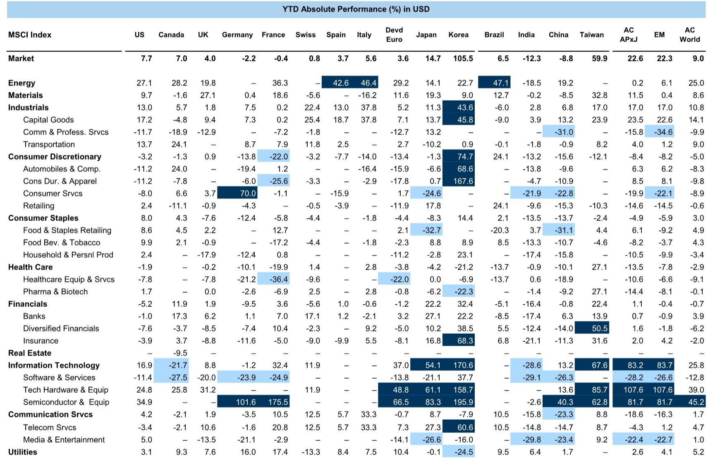
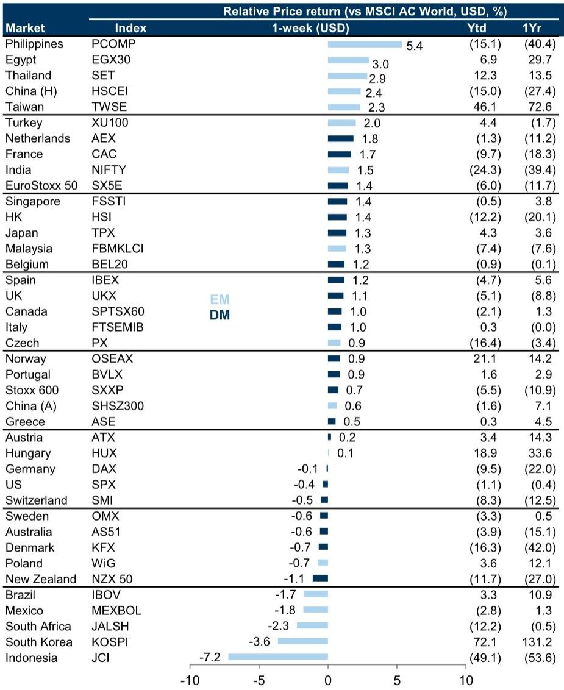

# The Record IPO Wave Will Not Sink Equities: Why Supply Fears Are Misplaced in 2026

The narrative is seductive in its simplicity. Global equities have fallen more than 2% in a single week, US markets are underperforming, and a wall of new equity supply is widely expected to hit the market in 2026. The instinctive conclusion is that a flood of initial public offerings will overwhelm demand, depress prices, and mark the end of the current cycle. This conclusion is wrong. The data tells a more nuanced and ultimately more optimistic story. The coming record for US equity issuance in terms of dollar value will not be a destructive force because the conditions that enable it—robust corporate demand, disciplined issuer behavior, and a fundamentally supportive macroeconomic backdrop—are precisely the conditions that make it absorbable. The market is not being flooded; it is being refilled by confident participants.

The immediate trigger for last week's sell-off is instructive. Stronger US labour data has pushed expectations for rate cuts further into the future, with the final two Fed rate cuts now projected for June and December 2027. US 10-year yields are expected to reach 4.4% by year-end. This repricing of the rate path, not equity supply fears, drove the decline. Momentum factors underperformed the broader market, and the rotation was visible across sectors. Energy and healthcare gained while technology and consumer discretionary fell. This is the reaction of a market repricing the cost of capital, not a market panicking about dilution. The supply narrative is a convenient post-hoc explanation, but it does not withstand scrutiny.

## Record Dollar Issuance Masks a Remarkably Modest Supply Relative to Market Size

The headline statistic is arresting: 2026 is projected to be a record year for the dollar value of US equity issuance. For investors who lived through the dot-com boom or the SPAC frenzy, this sounds like a warning signal. The reality is far more benign. When you scale this issuance against the total US equity market capitalization, the picture transforms. The projected issuance equates to just 1.0% of market cap, compared to a historical average of 1.5%. The absolute dollar figure is high only because the market itself is so much larger than in previous cycles. The supply is not historically heavy; it is historically light relative to the size of the investable universe.

This is the critical distinction that most market commentary misses. The ratio of issuance to market cap is the relevant metric for assessing dilution risk, not the raw dollar amount. A market that has grown to several times its size a decade ago can absorb several times the nominal supply without any change in the supply-demand balance. The historical average of 1.5% provides a clear benchmark, and the current projection sits well below it. Investors should not confuse the magnitude of the market with the magnitude of the burden. The supply is large in absolute terms only because the denominator is enormous.

## The Number of IPOs Remains Historically Average, Indicating Discipline Not Desperation

A second layer of analysis reinforces the point. The number of IPOs this year is likely to match the historical average of around 100. This is not a frenzy of speculative issuance. It is a return to normalcy after a period of subdued activity. Companies are not rushing to market indiscriminately. They are waiting for the right conditions, and those conditions include strong investor demand. The discipline on the supply side is a function of the lessons learned from previous cycles. Issuers and their bankers are acutely aware that a failed IPO is costly and reputationally damaging. They will not bring a deal to market unless they have confidence in the market's capacity to absorb it.

The implication for investors is straightforward: the companies that do come to market are likely to be higher quality than the historical average. The bar for going public has been raised. This is not a market where every startup with a slide deck can list. It is a market where established, growth-oriented companies with clear narratives and strong financials are choosing to debut. The discipline on the supply side is a positive signal for the quality of the investment opportunity set. Investors should view the IPO pipeline not as a source of risk but as a curated selection of new opportunities.

## Corporate Demand Is the Overlooked Counterweight That Makes the Supply Equation Work

The supply side of the equation is only half the story. The demand side is equally important and far more supportive than most narratives acknowledge. Corporate demand for equities is robust across three distinct channels: buybacks, mergers and acquisitions, and investor inflows. Buybacks alone represent a massive and recurring source of demand that is largely independent of the macroeconomic cycle. Companies are using their strong balance sheets to repurchase shares, reducing the net supply of equity even as new issuance occurs. M&A activity, often paid for with stock, creates another layer of demand as acquirers absorb the equity of target companies.

The third channel is investor inflows. The return of IPO activity is itself evidence of strong investor demand. Companies will not come to market without confidence that there are buyers. The pickup in issuance is therefore a lagging indicator of demand, not a leading indicator of supply. It reflects the fact that investors are allocating capital to equities, that they are seeking new opportunities, and that they are willing to underwrite the next wave of public companies. The demand backdrop is not just supportive; it is the very reason the supply is appearing. The two forces are linked, and the direction of causality runs from demand to supply, not the reverse.

## The Macro Repricing Creates a Window of Opportunity for Strategic Issuers

The macro environment, while causing short-term volatility, actually reinforces the case for measured equity supply. The repricing of rate expectations to a higher-for-longer scenario means that the cost of debt is not coming down quickly. For companies that need capital, equity financing becomes relatively more attractive compared to debt. This is not a sign of distress; it is a rational response to the relative pricing of capital. Companies that issue equity in this environment are making a strategic choice to strengthen their balance sheets and fund growth without taking on excessive leverage.

The implication for the broader market is that the equity supply we are seeing is likely to be put to productive use. It is not being used to paper over losses or to cash out insiders before a downturn. It is being used to fund investment, expansion, and strategic repositioning. This is the kind of supply that creates long-term value for the market as a whole. It is a sign of a healthy, functioning capital market, not a sign of excess. The macro repricing, which has spooked momentum-driven investors, is actually creating the conditions for a more sustainable cycle of capital formation.

## What the Report Does Not Yet Answer: The Regional Divergence in Supply and Demand Dynamics

The analysis of US equity supply is compelling, but it leaves a critical question unanswered. The report provides detailed forecasts for US issuance but is less clear on the dynamics in other major regions. Europe, Japan, and Asia-Pacific ex-Japan each have their own supply-demand equations, and the global picture may be more fragmented than the US data suggests. European equity issuance has been subdued for years, and the return of activity there may face different headwinds, including a more cautious investor base and a different regulatory environment. Japan's corporate governance reforms are driving a structural increase in buybacks, but the IPO market there has its own idiosyncrasies.

The second unresolved question is the behavior of retail investors. Institutional demand is well-documented, but the role of retail flows in absorbing new supply is less clear. The rise of zero-commission trading and the democratization of finance have fundamentally changed the demand side of the equation. How durable is this retail demand in a higher-rate environment? Will retail investors continue to allocate to new issues at the same pace, or will they rotate into fixed income as yields become more attractive? The report's framework is institutionally focused, and the retail dimension remains an open variable.

## A Decision Framework for Investors: How to Position for the Supply Wave

Investors should not treat the IPO pipeline as a monolithic risk factor to be hedged or avoided. Instead, they should adopt a selective, opportunity-driven approach. The first step is to distinguish between supply that is driven by growth and supply that is driven by distress. Growth-driven issuance, where companies are raising capital to fund expansion, is a positive signal. Distress-driven issuance, where companies are forced to raise capital to repair balance sheets, is a warning sign. The current cycle is firmly in the growth-driven camp, but investors must monitor the mix.

The second step is to focus on the quality of the issuer rather than the size of the deal. In a cycle where the number of IPOs is average but the dollar value is high, the large deals are likely to be from established, high-quality companies. These are the deals that institutional investors will anchor, and they are the ones most likely to perform well after listing. Investors should be skeptical of small, speculative IPOs that try to capitalize on market enthusiasm without having a clear path to profitability. The discipline on the supply side means that the median quality is higher, but the tail risk remains.

The third step is to recognize that the primary market and the secondary market are connected but not identical. A large IPO can create a temporary drag on the secondary market as investors rebalance their portfolios to make room for the new issue. This is a short-term technical effect, not a long-term fundamental one. Investors with a longer time horizon can use these moments of temporary pressure to add to positions in high-quality secondary stocks that are sold down to make room for new issues. The supply wave creates opportunities for patient capital.

## The Unresolved Analytical Tension: What Happens When Demand Falters?

The report's core argument is that demand will outweigh supply, and the evidence supports this view for the current cycle. But every cycle eventually turns. The unresolved question is what happens when the demand side weakens. If buybacks slow due to regulatory changes or a downturn in corporate profits, if M&A activity declines, or if investor inflows reverse, the supply-demand equation could shift rapidly. The record dollar issuance that is benign today could become a burden tomorrow.

Investors should monitor the leading indicators of demand. The most important are corporate buyback announcements, which provide a forward-looking view of corporate demand. A sustained decline in buyback activity would be a warning signal. The second is the flow of funds into equity mutual funds and ETFs, which provide a measure of retail and institutional demand. The third is the health of the M&A market, which is a proxy for corporate confidence. As long as these indicators remain strong, the supply wave is manageable. If they begin to weaken, the narrative will change, and the market will need to adjust. The current report provides a robust framework for the present, but the future depends on the resilience of demand.

Join the community to read the full report and review the original charts.

*This article is for learning and discussion only and does not constitute investment advice.*

Personal reading notes and learning share only. Not investment advice.

