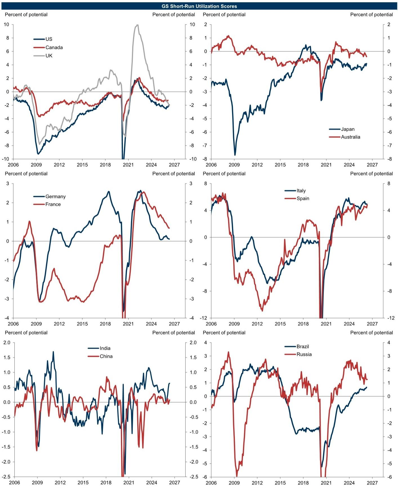
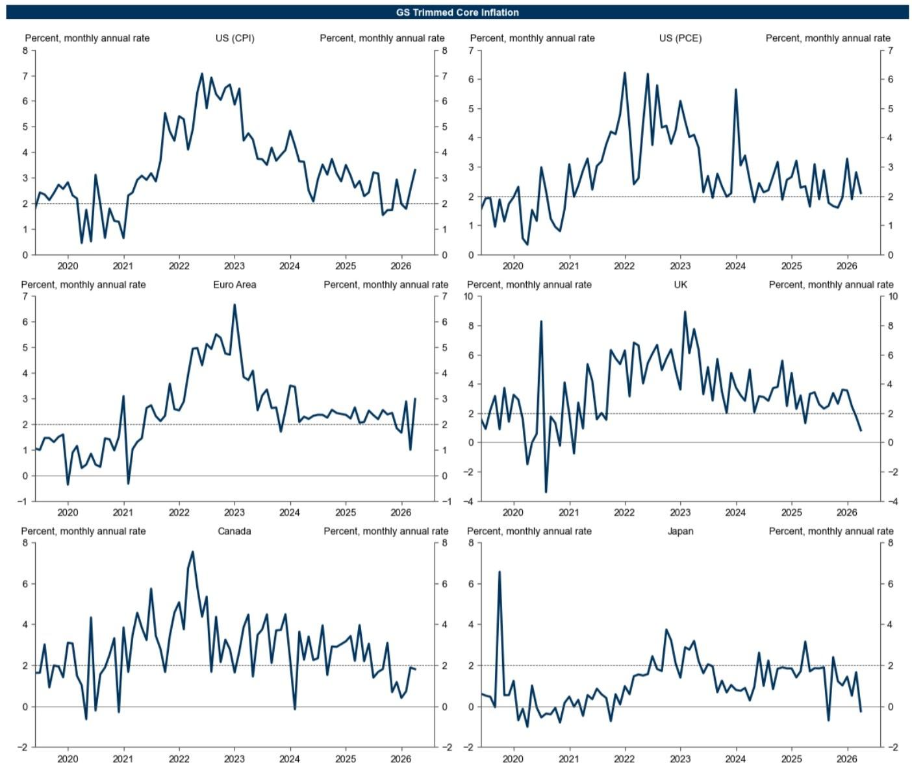

# GS：金融条件收紧的定价信号远比市场想象得更复杂

市场正在重新定价一个被许多人忽略的信号：金融条件正在收紧，而且速度比大多数人预期的要快。这份GS最新发布的全球经济指标更新，提供了一个关键观察窗口——美国金融条件指数（FCI）在就业数据超预期后，已经收紧至俄乌冲突前的水平。这不是一个简单的“加息预期升温”故事，而是一个关于增长、通胀和资产定价之间微妙平衡的重置。

为什么现在重要？因为市场此前一直沉浸在“软着陆”叙事中，认为金融条件会维持宽松以支撑风险资产。但GS的数据显示，过去一周，全球（除俄罗斯）FCI收紧3.3个基点，美国FCI更大幅收紧22.9个基点，其中股票市场贡献了13.7个基点，汇率贡献了6.4个基点。这意味着，市场自身的力量——而非央行政策——正在成为收紧的主要驱动力。对于投资者而言，理解这一动态，比猜测下一次降息时点更为紧迫。

这份报告提供了一个独特的数据框架：它不仅有FCI的周度变化，还有FCI脉冲（FCI Impulse）对GDP增长的前瞻影响，以及当前活动指标（CAI）对经济现状的实时追踪。但真正有价值的，不是这些数字本身，而是它们组合在一起所揭示的“增长-通胀-金融条件”三角关系正在发生结构性转变。以下是我们基于这份研报提炼出的五个核心洞察。

## 1. 美国金融条件收紧并非央行主导，而是市场自身在重新定价风险

GS的FCI数据显示，美国FCI上周收紧22.9个基点，其中股票市场贡献了13.7个基点，汇率贡献了6.4个基点，而短期利率的贡献几乎为零。这是一个值得深思的构成：收紧的主要驱动力来自风险资产价格下跌和美元走强，而非市场对美联储加息路径的重新定价。

这意味着什么？意味着市场正在主动“收紧”自己，而不是被动等待央行的信号。这种自发的收紧往往比政策驱动的收紧更具破坏性，因为它直接作用于资产价格和信心渠道。当股票市场下跌导致金融条件收紧，而收紧的金融条件又可能进一步抑制经济活动，从而形成负反馈循环。GS的数据显示，美国FCI水平已经回到2022年初的水平，那正是俄乌冲突爆发前的状态。但当前的经济基本面与当时截然不同——通胀虽在回落，但仍高于目标，劳动力市场依然紧张。这种“借力”背景下的收紧，对资产定价的含义更为复杂。

对投资者的含义：不要单纯将金融条件收紧解读为“加息预期上升”。当前收紧的根源是风险溢价的重估，这意味着防御性资产和低波动策略可能比单纯做空利率更有价值。

## 2. FCI脉冲显示：美国2026年的增长阻力正在累积，但市场尚未充分定价

GS报告中最具前瞻性的部分可能是FCI脉冲数据。FCI脉冲衡量的是金融条件变化对未来四个季度GDP增长的拖累或提振效应。数据显示，美国2026年的FCI脉冲为正0.40个百分点（以年率计），这意味着金融条件收紧将对2026年的经济增长形成显著拖累。相比之下，2025年的脉冲仅为0.15个百分点，而欧元区2026年的脉冲为负0.10个百分点，日本则为正0.50个百分点。

这些数字的MECE意义在于：美国当前看似稳健的增长（GS5月CAI为+3.1%），正在为2026年的放缓埋下伏笔。金融条件的收紧不是即时的，它通过信贷渠道、财富效应和汇率渠道滞后传导至实体经济。GS的脉冲模型捕捉到了这一点，但市场定价可能尚未完全反映这一滞后效应。

这里仍需验证的关键问题是：FCI脉冲模型的传导机制是否在当前环境下依然有效？因为疫情后，企业资产负债表相对健康，居民部门杠杆率较低，金融条件收紧对实体经济的冲击可能弱于历史均值。GS报告没有完全展开这一点，但投资者需要密切关注这一假设的可靠性。

## 3. 全球增长分化加剧：印度上修、中国持平、欧洲疲弱，但背后是同一套逻辑

GS的5月CAI数据揭示了一个清晰的增长分化格局。印度以+7.4%的CAI增速领跑新兴市场，中国为+5.4%，而德国则录得-0.9%的负增长，英国为-0.2%。发达市场整体CAI仅为+2.1%，而新兴市场为+4.3%。这一分化并非随机，而是由结构性因素驱动。

印度的高增长受益于人口红利和改革红利，但其CAI的持续性仍需验证。报告显示，印度2026年的GDP预测上修了0.30个百分点，但这一上修是否已充分考虑了全球金融条件收紧的溢出效应？中国CAI为+5.4%，但GS对中国2026年GDP预测下修了0.25个百分点，这暗示了内需和外部环境的双重压力。德国和英国的负增长则反映了欧洲制造业的持续疲弱和能源转型阵痛。

这些分化背后有一个共同逻辑：金融条件收紧对不同经济体的传导速度不同。美国收紧最快，但其经济韧性最强；欧洲收紧较慢，但结构性脆弱性更高。这意味着，全球投资者需要从“统一做多风险资产”转向“精选国家和板块”的策略。

## 4. 工资-通胀螺旋正在解耦，但劳动力市场紧张仍是核心变量

GS的工资追踪器显示，美国、欧元区和英国的工资增速仍在高位，但通胀指标已明显回落。美国PCE通胀从2023年的5.5%降至2025年的3.0%附近，而工资增速仍维持在4.5%左右。这种“工资涨、通胀降”的组合看似矛盾，实则揭示了劳动力市场与通胀之间的传统关系正在发生结构性变化。

报告中的“Jobs-Workers Gap”图表（Exhibit 7）提供了一个关键视角：劳动力供需缺口正在收窄，但速度慢于市场预期。这意味着，工资增长可能不会像通胀那样快速回落，从而对服务业通胀形成持续支撑。GS的数据显示，美国工资增速与PCE通胀之间的差距正在扩大，这暗示企业利润空间可能被压缩，或者企业将成本转嫁给消费者的能力在减弱。

对投资者的含义：劳动力成本上升可能成为企业盈利的下一个压力点。那些劳动密集型且定价权较弱的企业，可能面临利润率压缩的风险。而自动化程度高、能通过技术提升效率的行业，则可能相对受益。

## 5. 报告尚未完全回答的关键问题：FCI收紧的可持续性与央行的反应函数

尽管GS报告提供了丰富的数据，但有两个关键问题尚未完全回答。第一，当前FCI收紧的可持续性如何？上周的收紧主要由就业数据超预期触发，但如果后续经济数据走弱，FCI是否会迅速反转？GS的数据显示，美国FCI周度变化中股票贡献了13.7个基点，这意味着如果股市反弹，金融条件可能快速宽松。这种“易松难紧”的格局是否意味着金融条件对实体经济的约束力有限？

第二，央行的反应函数将如何调整？如果金融条件收紧导致经济增长放缓，但通胀仍高于目标，央行将如何权衡？GS报告没有直接讨论这一政策困境，但FCI脉冲数据暗示，2026年美国可能面临“增长放缓+通胀粘性”的滞胀风险。如果这一场景成真，美联储的降息空间将极为有限，而市场目前定价的多次降息可能过于乐观。

这两个问题恰恰是完整报告中最值得深挖的部分。GS的分析师Jan Hatzius团队通常会在更详细的报告中讨论这些政策权衡和情景分析，而这份更新只是提供了数据层面的快照。

## 如何用这些数据构建自己的观察框架

对于高净值读者和产业决策者，与其试图预测FCI的下一周变化，不如建立一个基于GS数据的观察框架。核心是关注三个变量：FCI水平及其构成、FCI脉冲对GDP的滞后影响、以及CAI与工资追踪器的交叉验证。

具体而言，当FCI收紧主要由股票和汇率驱动时，关注风险偏好的变化；当FCI收紧主要由长端利率驱动时，关注通胀预期和期限溢价的变化。同时，将FCI脉冲数据与CAI数据结合，可以判断“金融条件收紧”是否已经开始抑制“当前经济活动”。如果CAI开始走弱而FCI仍在收紧，那可能是资产价格面临更大压力的信号。

此外，工资追踪器与通胀指标之间的差距，是判断企业利润率和货币政策路径的关键先行指标。如果工资增速持续高于通胀，那么服务业通胀的粘性将超出预期，央行可能被迫维持更长时间的高利率。

这份GS报告的数据价值，不在于它给出了一个简单的答案，而在于它提供了一个多维度的分析框架。真正的洞察，来自于将这些指标组合在一起，回答“这些事实合在一起意味着什么”，而不是孤立地看每一个数字。

报告中的一些图表和细节——比如FCI脉冲在不同经济体的分布、CAI的月度变化、以及工资-通胀的解耦速度——在本文中并未完全展开。这些内容在完整报告中都有更详细的讨论和情景分析，值得读者进一步深入。

欢迎来星球微信群里继续讨论：FCI收紧的可持续性如何评估？哪些资产类别在当前环境下更具防御价值？以及GS报告中那些未被充分讨论的假设和风险。

Personal reading notes and learning share only. Not investment advice.

