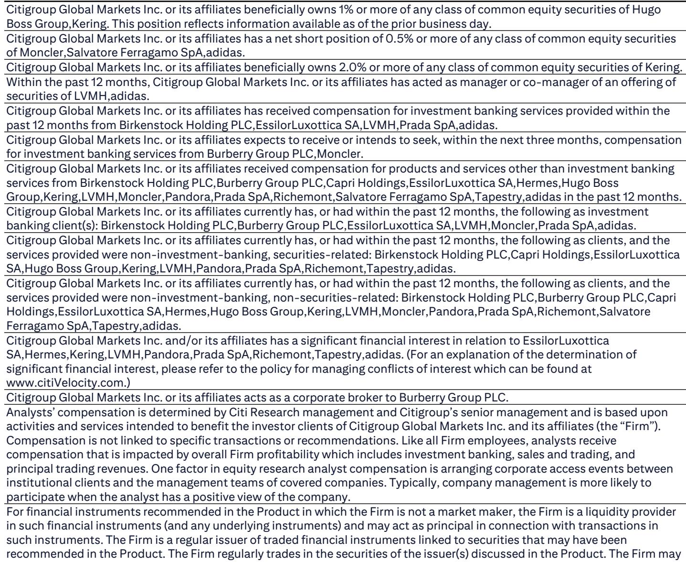
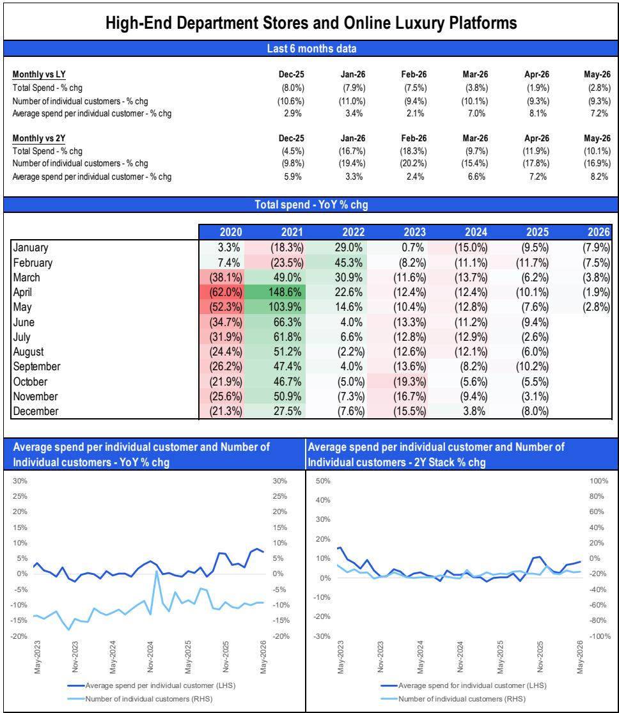
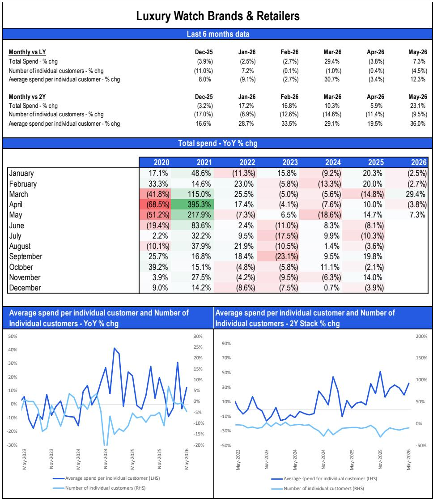

# Citi：美国奢侈品消费的韧性被低估了，但结构分化才是真正的故事

美国消费者还在买奢侈品。5月Citi信用卡数据显示，奢侈品品牌整体消费同比增长3%，已是连续第五个月正增长。更值得关注的是，两年叠加增速自2024年以来首次转正，从4月的-3%回升至+2%。

这个数字本身并不惊人。但放在当前宏观背景下来看——中东冲突持续、通胀粘性未消、消费者信心指数连续三个月走弱——它传递的信号远比表面增速复杂。

市场对奢侈品板块的定价已经反映了相当悲观的预期。年初至今，奢侈品股票跑输欧洲市场约26个百分点，估值回调约20%，当前约20倍远期市盈率较历史均值折价15-20%。问题在于，这种折价究竟是反映了基本面实质恶化，还是市场对“消费降级”叙事的过度反应？

Citi这份基于超过1000万美国信用卡持卡人样本的报告，提供了一个关键视角：美国奢侈品消费并非铁板一块，高端客群与大众客群正在走向截然不同的消费路径。而真正决定未来12个月板块走向的，不是需求总量，而是供给侧的定价策略与客群结构能否匹配。

## 1. 消费总量企稳背后，是高端客群对中低端客群的“替代效应”

5月数据最核心的结构性特征是：客单价（ASP）仍保持中双位数增长，但交易客户数（交易量）同比下降约10%。这意味着，支撑增长的并非更多人在买，而是更少的人在花更多的钱。

这种“量缩价升”的组合，在过去两年中已经成为美国奢侈品消费的常态。Citi报告指出，2023年至2025年期间，高收入人群的消费韧性持续优于中低收入人群，客单价增长始终跑赢客群数量增长。

这背后是一个正在固化的分层逻辑。疫情期间的大幅提价（部分品牌累计涨幅超过20%）将大量中产消费者挤出了核心奢侈品购买圈层，尤其是入门级产品线——小皮具、迷你包、帆布包、运动鞋等。这些品类原本是品牌培养年轻客群和扩大渗透率的关键入口，但现在价格门槛已经显著提升。

真正有意思的是，这种“高端化”并非品牌主动选择的结果，而是在通胀、关税和地缘风险共同作用下被逼出来的。当品牌不得不持续提价以对冲成本压力时，它们事实上在被动筛选客群——留下的客群消费力更强、价格敏感度更低，但基数也在持续收缩。

这对行业意味着什么？如果交易量持续萎缩，即使客单价维持增长，总量增长的天花板也会越来越低。Citi报告中的两年叠加增速转正是一个积极信号，但若无法转化为交易量的实质性回升，这一改善可能只是价格效应的短期反映。

## 2. 品类轮动揭示了一个被忽视的变量：硬奢的定价权正在超越软奢

从品类维度看，5月的轮动方向值得深入追问。手表和珠宝品类表现最为亮眼：手表品牌及零售商同比增长7%，较4月的-4%明显改善；珠宝加速至+6%。相比之下，皮具（+2%）和成衣（+2%）的增速明显温和。

两年叠加数据更能说明问题：手表品类两年叠加增速从4月的+6%跃升至+23%，珠宝从+3%升至+16%。而皮具的两年叠加增速仍为-7%，成衣为-2%。

这种分化的核心驱动力，在于硬奢品类（手表、珠宝）的定价逻辑与软奢（皮具、成衣）存在本质差异。硬奢的定价中，原材料成本（贵金属、宝石）占比更高，品牌在提价时拥有更充分的成本传导依据。同时，硬奢的消费场景更偏向资产配置和长期保值，客群对价格敏感度本身就低于软奢。

Citi报告在定价策略分析中提到，2026年至今，软奢品牌普遍仅执行极低个位数提价，而硬奢品牌提价幅度略高，反映了贵金属成本上升和瑞郎走强的影响。报告还特别指出，爱马仕和历峰集团旗下珠宝品牌（卡地亚、梵克雅宝、Buccellati）仍存在多年的追赶式提价空间。

这实际上指向一个更深层的判断：在通胀环境和关税不确定性持续的背景下，硬奢品类的定价权优势可能进一步扩大。软奢品牌面临一个两难困境——不提价则利润承压，提价则可能进一步压缩本已脆弱的交易量。

## 3. “美国例外论”在奢侈品消费中正在被重新定义

Citi报告明确指出，美国市场仍然是奢侈品公司全球表现中的亮点。一季度奢侈品财报季显示，美国市场继续跑赢其他地区。但这一结论需要放在更细致的框架下审视。

报告中的信用卡数据来自Citi超过1000万美国持卡人的样本，天然偏向消费能力更强的客群（Citi信用卡持卡人整体信用评级高于美国平均水平）。这意味着，这份数据可能高估了美国奢侈品消费的整体健康度。低收入人群的压力——储蓄率已降至2.6%、消费者信心指数中低收入群体下滑更为明显——在这个样本中可能被稀释了。

同时，报告对全球宏观环境的分析提示了一个潜在风险：如果地缘政治紧张和通胀压力持续，实际收入负增长和储蓄侵蚀将最终传导至消费行为。当前高端客群的财富效应（股市上涨、房价温和增长）能否持续对冲这些压力，仍然是一个开放性问题。

Citi在报告中列出了对美出口依赖度最高的奢侈品牌——Tapestry、Capri、Watches of Switzerland、Birkenstock等——以及依赖度最低的品牌——Moncler、Prada、爱马仕等。这一排序本身就是一份风险地图。对于那些高度依赖美国市场的品牌，如果美国消费韧性出现松动，估值折价的修复逻辑将面临根本性挑战。

## 4. 定价策略的收敛与分化：报告尚未完全回答的关键问题

Citi报告对定价策略的梳理提供了一个有价值的分析框架。2023年品牌间定价策略高度分化（从低个位数到约10%不等），2024年趋于收敛（平均3-4%），2025年则因关税调整而出现区域性分化——美国市场因关税上升而提价幅度更高，日本市场则因汇率波动而出现价格洼地。

但报告有一个关键问题没有完全展开：定价策略的收敛是否意味着竞争格局的固化？如果所有品牌都在执行类似的提价节奏，那么品牌之间的差异化将更多依赖产品力和品牌力，而非价格策略。这对于那些过去依赖性价比定位的品牌而言，可能是更大的挑战。

另一个未充分讨论的问题是：日本市场的价格洼地（比中国低约20-25%）引发的代购活动，以及日本政府计划于2026年11月实施的免税购物制度改革，将如何影响全球奢侈品定价体系和区域间的消费分流？这是一个典型的二阶效应——表面上是日本市场的局部调整，实际上可能重塑整个亚太地区的竞争格局。

这些未解问题恰恰是完整报告中值得深入挖掘的部分。Citi在报告中提供了大量细分数据——按品类、按渠道、按品牌——以及详细的估值对比和财务预测调整，这些内容超出了本文所能覆盖的范围。

## 5. 投资者的观察框架：三个核心问题比一个预测更重要

与其试图预测奢侈品消费的拐点，不如建立一个持续跟踪的观察框架。基于Citi报告的分析逻辑，以下三个问题值得持续关注：

第一，交易量何时触底？当前约-10%的交易量降幅是否已经反映了最坏的情况，还是仍有下行空间？这需要结合就业数据、实际收入增长和消费者信心指数来交叉验证。Citi自身对劳动力市场的判断是“招聘率低但裁员率也低”，这意味着交易量可能继续在低位徘徊，但不会出现断崖式下跌。

第二，定价权的结构性差异是否会进一步拉大？如果硬奢品类继续跑赢软奢，那么投资组合中不同品牌的权重分配就需要相应调整。Citi报告中提到的爱马仕和历峰珠宝品牌的“追赶式提价空间”，是一个需要持续跟踪的具体假设。

第三，估值折价何时开始修复？当前奢侈品板块约20倍远期市盈率，较历史均值折价15-20%。如果基本面没有进一步恶化，估值修复本身就可能带来可观的回报。但关键在于，市场需要看到交易量的实质性改善，或者至少是稳定的信号，才可能重新定价。

Citi报告本身对板块的短期展望是谨慎中性的。它承认美国高端客群的韧性，但也明确指出了宏观风险和中低端客群的压力。它没有给出一个简单的“买入”或“卖出”信号，而是提供了一组数据、一个框架和一系列需要验证的假设。

这正是这份报告的价值所在。

---

以上分析只是Citi这份37页报告的冰山一角。报告中还有大量未被提及的细分数据——按品牌的具体信用卡消费趋势、分渠道的表现差异、不同价格区间的消费行为变化、以及完整的财务预测和估值矩阵。这些内容对于理解奢侈品行业的真实图景至关重要。

如果你希望获取完整报告的深度解读和原始数据图表，欢迎来我们的星球微信群里继续讨论。我们会定期分享全球顶尖投行的核心研报解读，帮助你在信息过载的时代抓住真正有价值的信号。

Personal reading notes and learning share only. Not investment advice.

