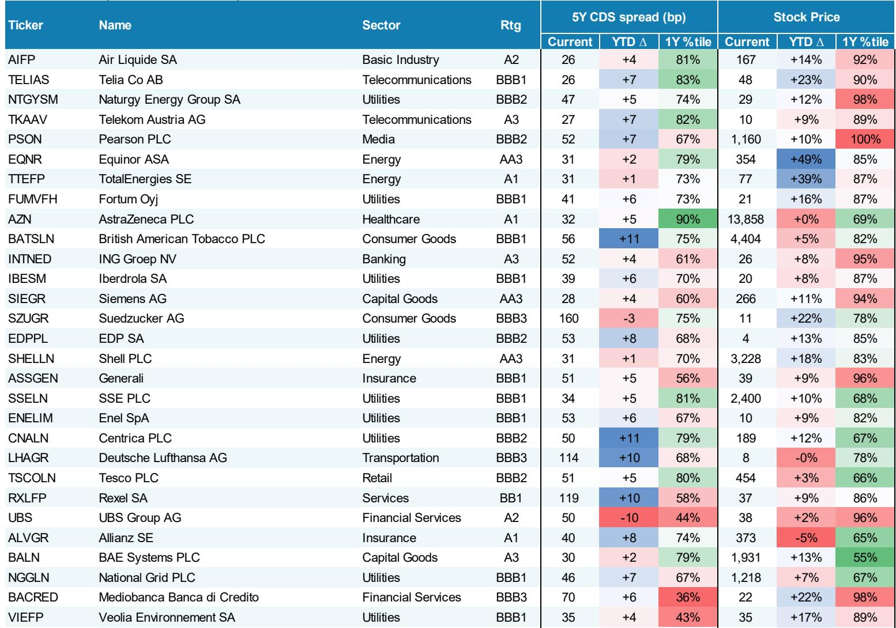
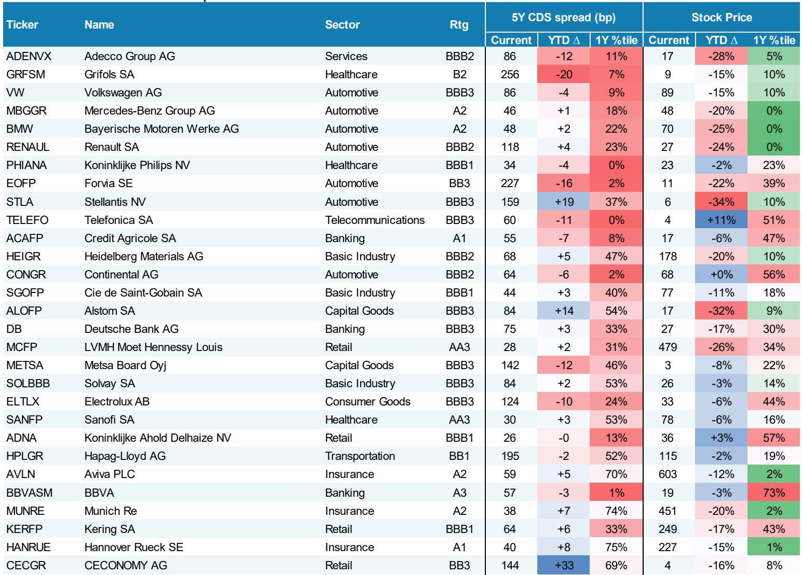
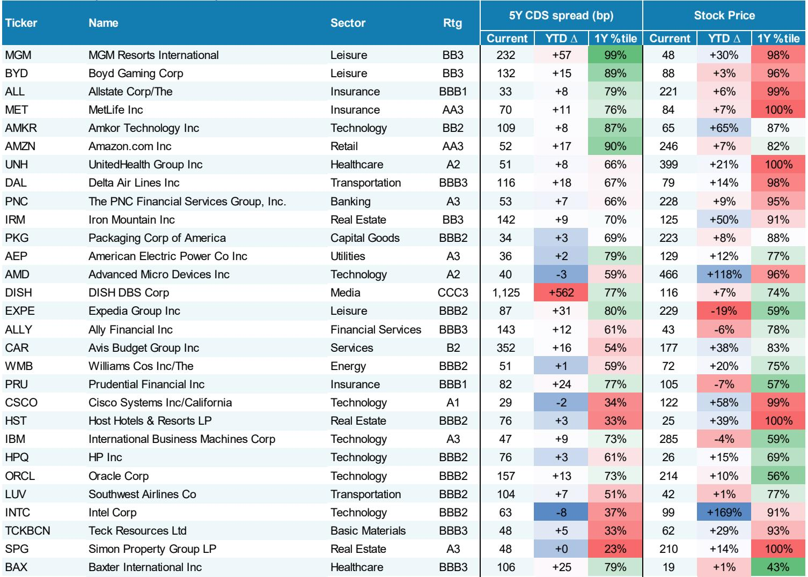

# 摩根斯坦利：全球信用市场正在经历一场“质量分化”而非方向性转折

全球信用市场过去一周的表现，表面看是方向一致的波动，但仔细拆解后会发现，真正有意义的信息藏在结构里，而非方向里。

摩根斯坦利最新一期全球信用策略周报提供了这样一个信号：美国投资级信用利差走阔1bp，欧洲投资级反而收窄3bp；美国高收益走阔7bp，欧洲高收益却收窄13bp。同一类资产，两个市场，走势截然相反。这不是简单的风险偏好波动，而是一场由资金流向、供给结构和评级分化共同驱动的“质量分化”。

对于配置全球信用资产的决策者来说，理解这种分化的成因，比判断整体方向更重要。因为方向可能是噪音，结构才是信号。

这份周报的框架覆盖了美国、欧洲、亚洲三大市场的投资级、高收益、贷款和信用衍生品，并附带了摩根斯坦利在年中展望中确立的行业配置建议。但报告最值得关注的，不是哪一类资产涨了或跌了，而是“资金流向与价格走势之间的错位”以及“同一市场内部评级梯度的断裂”。

以下是我们从这份报告中提炼出的五个核心洞察。

## 1. 美国信用市场正在承受“供给冲击”与“权益溢出”的双重压力，但资金仍在流入

美国投资级信用利差走阔1bp，超额收益为-0.1%。表面看只是微幅调整，但结合以下两个数据，就能看出压力所在。

第一，美国投资级债券上周定价规模高达470亿美元，年初至今累计发行1.095万亿美元，同比增长26%。这是供给端的历史性高水位。第二，权益市场回调直接拖累了信用市场，这是报告原话“the pullback in equities also weighed on credit”。信用与权益的联动在这一周重新变得紧密，而此前市场一度认为信用可以独立于权益走强。

但值得注意的是，美国投资级基金上周仍有36亿美元的净流入，年初至今累计净流入690亿美元。这意味着资金没有撤退，只是定价在重新谈判。供给在放量，需求仍在，但买方变得挑剔。

对于决策者而言，这意味着美国投资级市场的定价权正在从发行人向投资者倾斜。发行人可以趁窗口大量融资，但必须付出更高的利差成本。摩根斯坦利维持对科技/超大规模企业的低配，以及对银行和公用事业的高配，恰好呼应了这一判断——供给冲击之下，防御性和现金流稳定性重新成为定价核心。

## 2. 欧洲信用市场走出了独立行情，但驱动因素并非基本面改善，而是资金结构的变化

欧洲投资级信用利差收窄3bp，欧洲高收益收窄13bp，明显优于美国。但报告揭示了一个关键细节：资金流入高度集中于ETF，共同基金反而出现小幅净流出。

这是一个容易被忽视的信号。ETF的流入往往反映的是被动配置或战术性仓位调整，而共同基金的流出则代表主动管理人的谨慎。欧洲信用市场的“表面繁荣”可能更多来自流动性驱动而非深度价值认可。

此外，欧洲高收益的利差收窄几乎完全由BB级债券贡献，更低的评级表现则更加分化。这说明欧洲高收益市场的风险偏好是有边界的——资金愿意追逐相对安全的BB级，但对B级和CCC级保持距离。

对于配置欧洲信用的投资者，这份报告传递的信息是：欧洲信用并非没有机会，但机会集中在评级光谱的上端。摩根斯坦利在欧洲推荐高配银行、能源和防御性板块，低配周期性板块尤其是汽车，这一配置逻辑与“资金集中在ETF和BB级”的结构完全吻合。

## 3. 亚洲信用市场正在经历最剧烈的压缩，但这一压缩的可持续性需要验证

亚洲信用市场在过去一周整体利差收窄2bp，但内部结构分化极其显著。亚洲高收益收窄18bp，而亚洲投资级仅收窄2bp。中国高收益收窄18bp，中国投资级收窄3bp。

从历史分位数看，亚洲投资级当前利差为53bp，处于5年来的最窄水平（0%分位）。这意味着亚洲投资级几乎已经没有额外的信用溢价。报告将亚洲信用市场描述为“低火、低雇佣”的市场，即交易活跃度低、新增配置意愿低。

亚洲高收益的收窄幅度很大，但报告也指出，亚洲高收益的5年分位数为11%，虽然低于历史中位数，但远高于投资级的0%分位。这说明亚洲高收益仍有压缩空间，但需要持续的资金流入支撑。

对于全球配置者而言，亚洲信用市场提供的是“压缩交易”而非“增长交易”。亚洲投资级已经定价了非常乐观的预期，任何负面消息都可能引发利差反弹。亚洲高收益虽然仍有空间，但流动性不足和评级集中度风险始终是隐忧。

## 4. 信用衍生品市场的信号值得警惕：隐含波动率上升但信用滞后于权益

报告显示，CDX IG和iTraxx Main的利差分别走阔2bp和1bp，而CDX HY和Xover的利差走阔幅度更大。更关键的是，报告专门指出：“while implied volatility ticked up from the YTD lows, credit lagged the rise in equities vol。”

这句话的含义是：权益市场的隐含波动率已经从年内低点回升，但信用市场的波动率尚未跟上。信用市场通常滞后于权益波动率的变化，如果权益波动率继续上升，信用利差的走阔可能才刚刚开始。

这是一个典型的“先行指标”信号。对于持有信用多头仓位的投资者来说，这可能是需要重新审视风险敞口的时刻。信用衍生品市场正在用沉默发出警告——不是现在，但可能很快。

## 5. 报告尚未完全回答的关键问题：供给放量之后，需求能否持续消化

这份周报最有趣的地方在于，它提供了大量数据，但刻意回避了“需求能否持续”这个终极问题。

美国投资级年初至今发行量同比增长26%，高收益同比增长42%。欧洲投资级持平，高收益同比增长11%。供给端的数据非常清晰，但需求端的结构正在变化。美国投资级基金虽然有净流入，但流入速度能否匹配发行节奏？欧洲ETF的资金流入是可持续的战术配置，还是短暂的情绪驱动？亚洲信用市场的利差压缩是否已经过度透支了预期？

这些问题的答案不在周报里，而是需要结合后续的资金流数据和宏观环境变化才能判断。摩根斯坦利在年中展望中已经给出了行业配置框架，但框架的有效性取决于需求端能否持续承接供给。

对于读者来说，这正是需要深入研读完整报告的切入点。周报提供了“是什么”，但“为什么”和“接下来会怎样”需要更系统的分析框架和更长的数据序列来回答。

---

以上分析基于摩根斯坦利全球信用策略周报公开内容。报告还包含了大量未在本文中展开的数据，包括各期限利差曲线、行业细分表现、信用衍生品持仓、以及亚洲信用市场的详细供需分析。

这些数据背后的二阶影响——比如曲线陡峭化对银行资产负债表的含义、ETF资金结构对市场脆弱性的影响、亚洲高收益利差压缩背后的评级迁移风险——都值得进一步拆解。

欢迎来星球微信群里继续讨论。我们会在社群内分享完整研报的逐页解读、关键图表的原始数据，以及针对不同资产配置场景的应对框架。

Personal reading notes and learning share only. Not investment advice.

