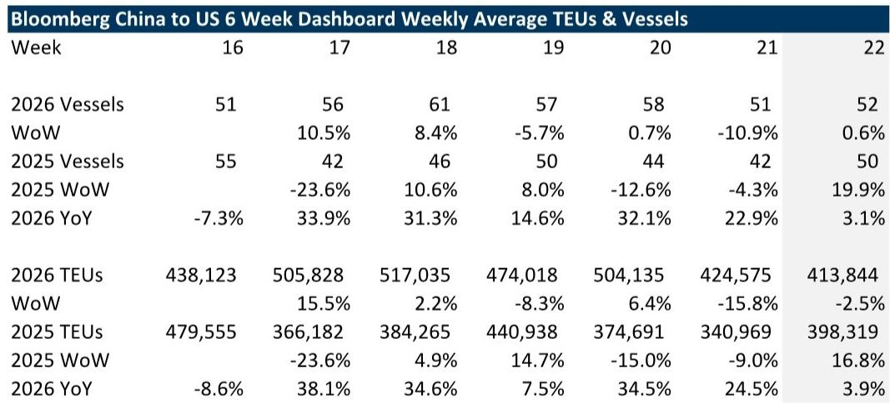
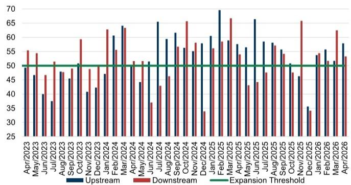
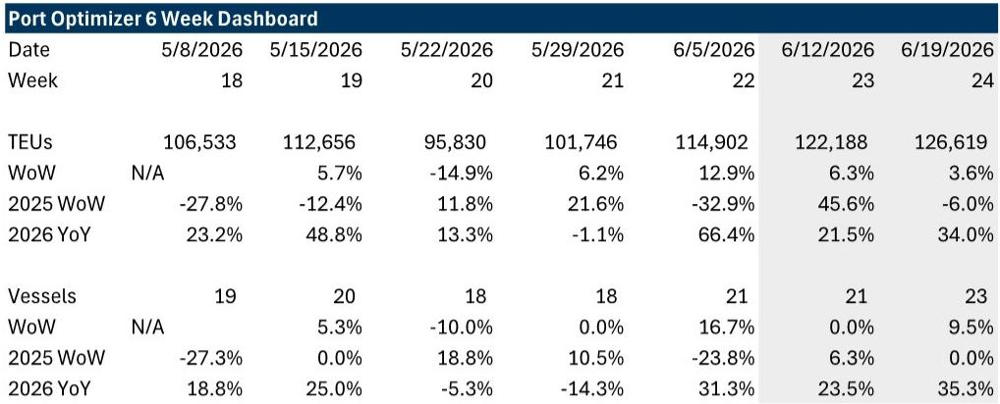

# GS：市场低估的不是短期补库，而是关税博弈正从“一次性冲击”变为“结构性重塑”

过去一周，从中国发往美国的重箱船舶数量环比微增1%，同比仍为正增长3%。洛杉矶港的TEU数据预测未来两周还将保持正增长——同比增幅分别达到21.5%和34%。这些数字本身并不令人意外，毕竟去年同期正是“解放日”关税生效的基数低点。

但真正值得关注的，不是这些短期数字的高低，而是数字背后的行为逻辑正在发生根本性转变。GS最新一期《美国关税影响追踪》报告揭示了一个关键判断：市场当前看到的进口韧性，并非简单的“解放日效应”被消化，而是一种新的、由不确定性驱动的补库模式正在形成。

这份报告的深层价值，不在于它告诉你下周的船运数据是涨是跌，而在于它提供了一个观察框架，帮助投资者把碎片化的周度数据拼成一幅可决策的图景。对于关注全球贸易、物流运输和制造业布局的决策者来说，理解这个框架，比预测任何单一数据点都更重要。

## 1. 补库行为正在从“一次性抢跑”转向“持续性的不确定性对冲”

GS的数据显示，在“解放日”周年之后，进口流量并未如部分市场预期的那样大幅回落。相反，洛杉矶港的TEU预测显示，未来两周的同比增幅仍将维持在20%以上。如果仅仅是基数效应，这个数字应该会快速收窄。

报告对此给出了一个审慎但有力的解释：当前进口的韧性，部分来自“在不确定的地缘政治背景下，以较低的有效关税税率进行补库”。这句话翻译过来就是，进口商不再把关税看作一个需要一次性规避的风险事件，而是将其内化为供应链规划中的常态化变量。

这意味着什么？意味着过去那种“关税宣布-抢运-库存高企-需求断崖”的脉冲式周期，可能正在被一种更平滑、但持续时间更长的补库行为所取代。进口商不再赌关税会取消或降低，而是假设关税将长期存在，并据此调整库存水位和安全边际。

对于航运和物流公司而言，这种变化意味着需求波动率的下降，但同时也意味着“抢运溢价”的消失。对于投资者来说，需要重新评估那些依赖短期运价飙升来获得超额收益的交易逻辑。

## 2. 第122条关税的150天倒计时，才是影响中期运力的真正变量

GS在报告中明确指出了市场尚未充分定价的风险点：美国行政当局依据《第122条》宣布的新关税将在150天后到期，而政府尚未公布后续方案。这种政策路径的不确定性，正在对中长期的货运规划产生实质性影响。

这里需要区分两个时间维度。短期来看，那些有效税率相对较低的国家，可能会增加对美出口。GS特别指出，这种转移“需要时间才能在数据中体现出来”，尤其是中国制造业和航运在经历了较晚的春节后，产能恢复节奏本身就有滞后。

中期来看，150天后的政策走向才是真正的分水岭。如果关税被延续或扩大，当前的供应链转移将加速固化；如果关税出现松动，那些为了避险而建立的冗余库存和替代产能，将面临痛苦的消化过程。

报告没有给出明确的概率判断，但数据本身已经指向一个方向：不确定性本身正在成为驱动贸易流量的独立变量。对于做全球资产配置的投资者而言，这意味着地缘政治风险的定价因子，需要从“尾部风险”上调为“基准情景”。

## 3. 地缘冲突对运价的影响，不能简单类比红海危机

报告对近期地缘冲突对运费的潜在影响进行了冷静的拆解。GS认为，当前冲突对集装箱运价的推升作用，需要区分“成本驱动”和“供需驱动”。霍尔木兹海峡并非集装箱航线的主要通道，因此不太可能像红海危机那样导致有效运力的大幅收缩。

真正需要关注的是燃料成本。如果地缘冲突推高燃油价格，航运公司会通过附加费的形式转嫁成本，这将直接推升全球运价，尤其是亚洲至美国航线。但报告同时指出，更高能源成本对全球货运需求的抑制效应，尤其是对美国消费者的影响，可能更为深远。

这是一个典型的“二阶效应”问题。市场容易看到运价上涨对航运公司利润的直接利好，却容易忽略需求端的反噬。如果能源成本持续高企，最终受损的将是整体货运量。对于投资航运和物流板块的人来说，当前需要警惕的是：运价上涨的驱动力正在从“需求强劲”转向“成本推动”，两者对利润的可持续性有本质区别。

## 4. 2026年运输股的真正催化剂不是关税，而是“量”的拐点

GS在报告中的“2026年贸易与运输情景路线图”部分，提出了一个对行业判断至关重要的框架：运输板块能否走出盈利低谷并迎来升级周期，归根结底取决于“量”的增长，而非“价”的波动。

报告列出了几个可能推动货运量在2026年出现拐点的结构性因素：美联储的降息周期（GS经济学家预测2026年12月有一次降息，2027年3月还有一次）、企业对美国制造业投资的增加（苹果、英伟达、IBM、辉瑞、强生等公司已宣布相关计划）、以及“一个大的美丽法案”中恢复的奖金折旧政策。

这些因素叠加在一起，指向一个判断：即使关税博弈持续，美国国内的货运需求仍有可能在2026年下半年出现实质性改善。报告特别提到，卡车运输板块近期股价表现改善，可能正是市场在提前定价“量”的底部正在形成。

但这里有一个关键的隐含前提：这些利好因素能否兑现，取决于宏观环境是否配合。如果关税导致的经济不确定性持续抑制企业资本开支，或者消费者信心因通胀而走弱，那么“量”的拐点就可能被推迟。报告对此没有给出明确的时间表，但数据框架本身已经为投资者提供了跟踪的锚点。

## 5. 报告没有完全展开的关键问题：供应链转移的“真实成本”尚未被量化

这是阅读这份报告时最需要保持警惕的地方。GS提到了“中国+1或+2策略”可能带来的结构性贸易机会，也提到了美国制造业回流对国内货运需求的提振。但报告没有深入讨论的是，这种转移本身需要付出多大的成本，以及这些成本最终由谁来承担。

供应链转移不是简单的“换个地方生产”。它涉及到新工厂的建设周期、工人的培训成本、配套基础设施的完善程度、以及最关键的一点——生产效率的差异。即使不考虑关税，中国制造业在综合成本、响应速度和产业链配套上的优势，也不是短期内可以被替代的。

报告的数据显示，亚洲（不含中国）对美出口的TEU增速与中国对美出口的增速差距并不大，这说明“替代”的规模效应可能被高估了。真正需要回答的问题是：当企业为了规避关税而进行供应链迁移时，它们愿意承受多高的效率损失？这个“效率-安全”的权衡点，将决定供应链转移的速度和规模。

GS没有给出答案，但数据框架已经提出了这个问题。对于产业决策者来说，这可能比任何短期运价预测都更有价值。

## 6. 投资者需要建立自己的“三层观察框架”

基于这份报告的逻辑，我们建议读者建立一个三层观察框架，来持续跟踪关税对贸易和运输的影响：

第一层是高频数据层。关注每周的船舶数量、TEU变化和运价走势。GS的数据显示，周度数据波动极大，单一数据点几乎没有预测价值。正确的做法是观察多周的趋势，尤其是同比增速的变化方向。

第二层是政策路径层。150天后的关税走向是中期最关键的不确定变量。投资者需要跟踪的不只是关税税率本身，还包括行政当局的沟通信号、国会的立法动向、以及贸易伙伴的反制措施。

第三层是结构变化层。这才是决定长期投资回报的核心。需要跟踪的指标包括：美国制造业的资本开支计划、物流基础设施的投资规模、以及企业关于供应链布局的公开表态。这些数据虽然不如船运数据那样高频，但它们决定了未来三到五年的行业格局。

三层框架的相互作用，才是决策的依据。如果高频数据走强，但政策路径趋紧，那么短期补库可能只是“最后的狂欢”。反之，如果高频数据疲弱，但结构变化层出现积极信号，那么当前的低迷可能正是布局的窗口。

这份GS报告的价值，就在于它提供了一个将这些层次串联起来的逻辑框架。但报告的局限性也同样明显：它只给出了数据，没有给出权重。不同层次的变量在当前环境下孰轻孰重，需要读者根据自己的投资周期和风险偏好来判断。

这正是我们希望在后续讨论中继续深化的议题。

Personal reading notes and learning share only. Not investment advice.

