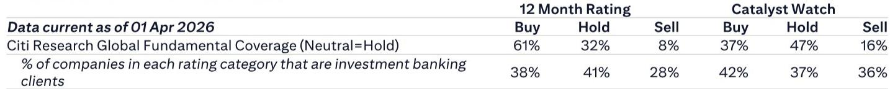

# Nvidia's Memory Cut Is Not a Demand Signal — It Is a Supply Chain Reconfiguration That Reshapes the Entire Memory Stack

The semiconductor industry is currently digesting a seemingly straightforward operational decision: Nvidia is reducing the DRAM capacity in its Vera Rubin SoCAMM2 modules by roughly 50 percent, shifting from 192GB modules to 96GB modules per rack. On the surface, this looks like a cost-cutting measure or a demand downgrade. It is neither. This reduction is a direct consequence of a global DRAM supply constraint that has left memory suppliers capable of meeting only 60 percent of current SoCAMM2 demand. The more important story, however, is not the cut itself but what it reveals about the structural evolution of AI memory architecture. Nvidia is not simply accepting lower performance; it is reengineering the memory hierarchy by introducing a new layer — Context Memory eXtension (CMX) technology — that effectively acts as a third-tier memory system. This development has profound implications for the balance of power between DRAM and NAND suppliers, the architecture of future AI servers, and the investment thesis for the entire semiconductor memory value chain.

The timing is critical. We are approaching the inflection point where AI inference workloads, particularly large language models with massive key-value (KV) caches, are beginning to demand memory capacities that traditional DRAM configurations cannot economically support. The Vera Rubin platform was designed to push the envelope on memory bandwidth and capacity, but the physical and economic realities of DRAM manufacturing have intervened. The decision to halve SoCAMM2 capacity is not a retreat; it is a strategic pivot that forces the industry to confront a question it has been avoiding: How will AI servers scale their memory systems when DRAM alone cannot keep pace with the exponential growth in KV cache requirements?

This report argues that the Vera Rubin SoCAMM2 reduction marks the beginning of a structural shift in AI server memory architecture, one that will elevate NAND flash from a secondary storage role to a primary memory tier. Investors focused solely on the headline reduction in DRAM content per rack are missing the larger point: the total memory demand per server is not declining; it is being redistributed across a more complex hierarchy. The winners in this new regime will be those memory suppliers that can capture value in the CMX layer, while those tied exclusively to high-bandwidth DRAM may face a more constrained growth trajectory than the market currently prices.

## The DRAM Supply Constraint Is Not Temporary — It Is a Structural Cap That Forces Architectural Innovation

The immediate cause of Nvidia's SoCAMM2 reduction is straightforward: global DRAM capacity constraints have limited memory suppliers to delivering only 60 percent of the originally planned SoCAMM2 demand. This is not a cyclical shortage that will resolve with the next fab expansion. The physics of DRAM scaling is encountering diminishing returns, and the capital intensity of building new DRAM capacity, particularly for the advanced nodes required for high-bandwidth memory, is escalating faster than the industry can economically absorb. The result is a structural ceiling on how much DRAM can be packed into a single server rack at a viable cost point.

The critical insight here is that Nvidia's decision to reduce per-module capacity from 192GB to 96GB does not change the total number of SoCAMM2 sockets demanded. The report explicitly states that there will be no change to SoCAMM2 demand. This means Nvidia is not reducing its memory procurement volume; it is reconfiguring the allocation of memory across different tiers. The 50 percent reduction in DRAM per rack is being offset by an increased reliance on CMX technology, which utilizes NAND flash to serve as a complementary memory layer. This is not a demand destruction event for memory suppliers; it is a demand redistribution event that favors NAND over DRAM in certain high-capacity, lower-latency-critical applications.

The strategic implication for investors is that the traditional metric of DRAM content per server is becoming a misleading indicator of overall memory demand. The memory bill of materials for a Vera Rubin rack may shift from being dominated by high-cost, high-bandwidth DRAM to a more balanced mix of DRAM and NAND-based CMX. This has direct implications for revenue per wafer and margin profiles across the memory industry. DRAM suppliers may see unit volumes hold steady, but the shift toward lower-density modules could compress average selling prices. Conversely, NAND suppliers stand to benefit from a new, high-value application that demands enterprise-grade, high-endurance flash — a product category that commands significantly higher margins than commodity SSD storage.

## CMX Is Not a Workaround — It Is the Emergence of a Third Memory Tier That Redefines the AI Memory Hierarchy

The most consequential development buried in this report is the emergence of Context Memory eXtension (CMX) as a "G3.5 memory" layer. This is not a minor technical adjustment; it represents the formal recognition that the traditional two-tier memory hierarchy — fast, expensive DRAM for active computation and slow, cheap storage for persistent data — is insufficient for the memory demands of modern AI inference. The KV cache, which stores the context window for large language models, is growing at a rate that outstrips DRAM's ability to scale cost-effectively. CMX addresses this by providing a mid-tier memory layer that offers higher capacity than DRAM at lower cost, while delivering lower latency than traditional NAND-based storage.

The key strategic question is whether CMX will remain a niche solution for the Vera Rubin platform or become a standard architectural feature across the entire AI server ecosystem. The logic of the KV cache problem suggests the latter. As models grow larger and context windows expand, the memory required to maintain inference state becomes a dominant cost factor. DRAM, even with the most aggressive high-bandwidth configurations, cannot economically provide the terabytes of capacity that next-generation inference workloads will require. CMX, by leveraging NAND flash with a specialized controller and interface, offers a path to scale capacity without exponentially increasing cost.

This development has a direct and underappreciated implication for the NAND industry. For years, NAND suppliers have struggled to escape the commoditization trap of the SSD market, where price declines are relentless and differentiation is difficult. CMX offers a new demand vector that is not simply more gigabytes of storage, but a performance-optimized memory product that commands a premium. The technical requirements for CMX — high endurance, low latency, and tight integration with the server's memory controller — are significantly more demanding than standard enterprise SSDs. This creates a barrier to entry and a potential differentiation opportunity for NAND suppliers that can deliver a reliable, high-performance CMX solution.

## The Report Leaves an Open Question That Will Define the Next Phase of the AI Memory Investment Thesis

While the analysis of SoCAMM2 and CMX is thorough, the report does not fully address a critical variable: the timeline and scalability of CMX adoption across the broader AI server market. The report projects that CMX adoption will boost NAND demand, but it does not quantify the magnitude or the pace of this shift. Several open questions remain that will determine the investment implications.

First, what is the cost crossover point between DRAM and CMX for KV cache workloads? The economic viability of CMX depends on the relative cost per gigabyte between DRAM and NAND, but also on the performance penalty incurred by using flash-based memory for cache operations. If the latency of CMX is close enough to DRAM that the cost savings dominate, adoption could be rapid. If the performance gap is significant, CMX may be limited to less latency-sensitive applications, reducing its total addressable market.

Second, how will memory suppliers respond? The report notes that current DRAM suppliers can only meet 60 percent of SoCAMM2 demand. This capacity gap creates a powerful incentive for memory suppliers to invest in CMX-compatible NAND solutions. But it also creates a strategic dilemma for DRAM-focused suppliers: do they accelerate DRAM capacity expansion to close the gap, or do they pivot toward NAND-based memory solutions? The answer will depend on the relative returns on capital for DRAM versus advanced NAND, and on the speed with which CMX becomes a standard architecture.

Third, what is the competitive response from hyperscalers? If Nvidia is adopting CMX as a standard feature on its flagship Vera Rubin platform, it is reasonable to assume that other AI accelerator designers and hyperscale cloud providers are evaluating similar architectures. The report does not address whether CMX is a proprietary Nvidia solution or an open standard that can be adopted by the broader ecosystem. The answer to this question will determine whether the NAND demand boost is concentrated among a few suppliers or distributed across the entire memory industry.

These open questions create a natural analytical tension: the thesis that CMX will boost NAND demand is compelling, but the magnitude and timing are uncertain. Investors who want to position for this trend need to monitor not just the volume of CMX shipments, but the pace at which the broader AI server ecosystem adopts a three-tier memory hierarchy.

## A Decision Framework for Positioning in the Memory Supply Chain

For readers who are evaluating how to translate this analysis into investment or strategic decisions, the following framework can help organize the key variables. The decision to invest in or allocate resources toward memory-related opportunities should be guided by three questions.

First, where is the value capture in the new memory hierarchy? The traditional memory value chain has been relatively simple: DRAM suppliers capture value in high-bandwidth, low-latency applications, while NAND suppliers compete on cost per gigabyte. CMX disrupts this binary by creating a mid-tier where performance and capacity both matter. The companies that will benefit most are those that can deliver a NAND-based solution with DRAM-like interface characteristics. This favors suppliers with advanced controller technology and experience in high-endurance flash, rather than commodity NAND manufacturers.

Second, what is the elasticity of demand for AI memory? The report's key insight is that total memory demand per server is not declining; it is being reconfigured. Investors should focus on the total memory bill of materials per rack, not just the DRAM component. If CMX adoption leads to a net increase in memory content per server (because the capacity of CMX is much larger than the DRAM it replaces), then the total addressable market for memory could expand even as DRAM content per server declines. The critical metric to track is total terabytes of memory per rack, split between DRAM and NAND-based CMX.

Third, what is the competitive dynamics between memory suppliers? The DRAM capacity constraint that triggered the SoCAMM2 reduction is unlikely to be resolved quickly. This creates a window of opportunity for NAND suppliers to establish a foothold in the AI memory hierarchy. However, DRAM suppliers are not passive; they may respond by investing in alternative memory technologies or by acquiring NAND capabilities. The next 12 to 18 months will be a period of strategic positioning, where early movers in CMX can capture market share that may be difficult to dislodge later.

## The Full Picture Requires Access to the Original Data and Charts

The analysis presented here is based on the key insights from the report, but the full strategic picture requires a deeper dive into the quantitative details. The report includes specific estimates of the DRAM supply-demand gap, the projected impact on NAND demand, and the cost dynamics of CMX versus traditional DRAM configurations. These data points are essential for building a precise investment thesis and for identifying the specific companies that are best positioned to benefit from the architectural shift.

The charts in the original report provide a visual representation of the SoCAMM2 capacity reduction, the projected memory demand trajectory, and the relative cost structures of different memory tiers. Without these visuals, it is difficult to fully appreciate the magnitude of the shift and the timing of the inflection point. For serious investors who want to move beyond the headline narrative and into the granular data, the full report is an essential resource.

Join the community to read the full report and review the original charts.

*This article is for learning and discussion only and does not constitute investment advice.*

Personal reading notes and learning share only. Not investment advice.

