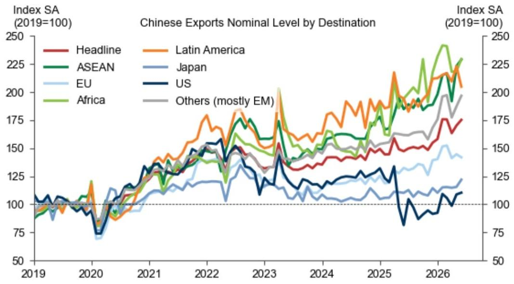
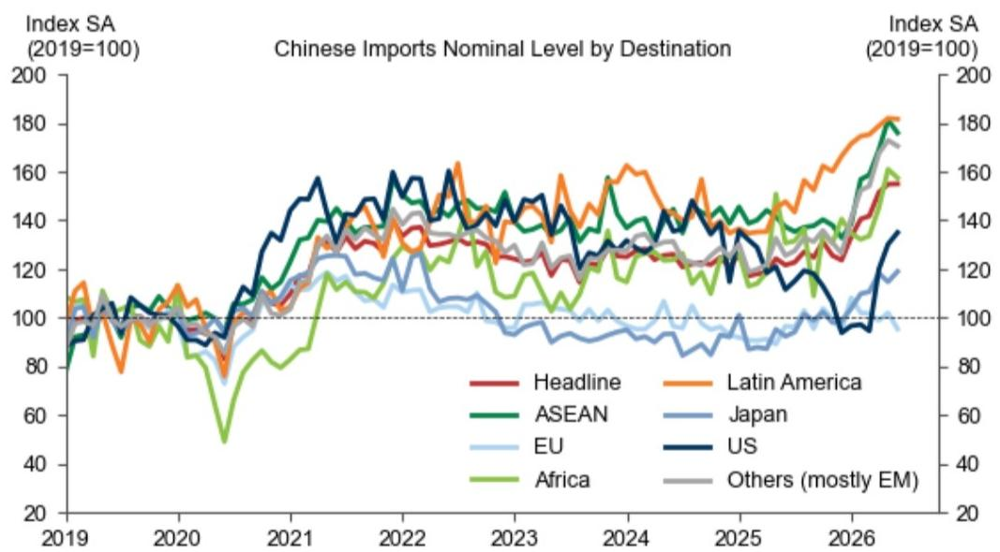
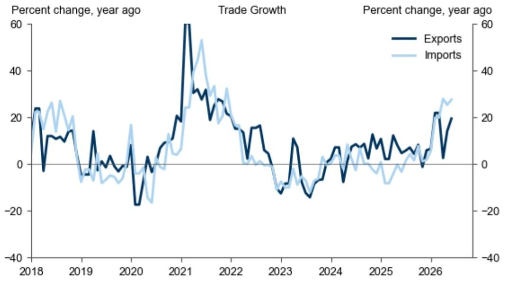

# GS：5月中国贸易数据超预期，但真正值得关注的不是增速，而是价格信号

5月中国出口同比增长19.4%，进口同比增长27.5%，双双超出市场预期的15%和26%。贸易顺差从4月的848亿美元跃升至1054亿美元。这份数据表面上看是“量价齐升”的乐观图景，但GS这份报告揭示了一个更微妙的信号：进口增长的驱动力正在从“量”转向“价”，而出口的韧性背后，结构性分化远比总量数字重要。

对于关注中国资产定价和全球供应链布局的决策者而言，5月数据最值得追问的不是“增速能持续多久”，而是“价格信号在告诉我们什么”。GS的团队在报告中给出了几个关键线索，但一些二阶影响并未完全展开——这正是我们需要深入讨论的地方。

## 1. 出口超预期主要靠美国订单拉动，但低基数效应可能掩盖了真实动能

5月中国对美出口同比增速从4月的11.3%飙升至35.4%，这一数字看起来惊人，但GS明确指出，部分原因是去年同期的低基数。从环比看，经季节性调整后的对美出口仅增长1.5%，远低于4月的4.2%。这意味着，对美出口的“爆发式增长”更多是统计上的错觉，而非需求端的根本性改善。

更值得关注的是区域分化。对欧盟出口增速从13.4%放缓至7.6%，对拉丁美洲出口甚至出现环比下降。与此同时，对东盟出口同比增长24.3%，对非洲和其他新兴市场保持18%-22%的增速。这个格局说明：中国出口的韧性并非来自单一市场的“补库存”，而是新兴市场多元化布局的持续深化。

但这里有一个尚未完全回答的问题：新兴市场的需求是否可持续？GS的报告没有深入分析东盟和非洲国家的进口能力与债务压力，而这些恰恰是判断下半年出口动能的关键变量。

## 2. 进口的“量价背离”才是这份报告最有价值的信号

GS在报告中反复强调一个现象：进口金额增速远高于进口数量增速。半导体进口额同比增长68.0%，但进口量同比下降1.0%；原油进口额增长15.3%，但进口量暴跌29.0%；天然气进口额增长11.0%，但进口量基本持平；铜矿进口额增长34.0%，但进口量下降1.4%。

这不是偶然。这是全球大宗商品价格传导和中国国内需求结构变化的共同结果。进口“量价背离”意味着：中国正在为同样的实物支付更高的价格，而国内的实际需求可能并没有名义数据显示的那样强劲。这对投资者而言，是一个需要警惕的信号——如果价格驱动的进口增长不可持续，那么进口增速的回落可能会比预期更快。

GS没有进一步讨论的是：这种价格压力是否会传导至PPI和CPI，进而影响中国央行的货币政策空间。这是一个需要结合后续通胀数据才能回答的问题。

## 3. 半导体出口的“价格游戏”暴露了中国科技出口的真实竞争力

5月半导体出口额同比增长110.9%，但这个数字同样需要拆解。GS的数据显示，半导体出口量仅增长2.1%，几乎全部增长来自价格效应。这意味着，中国半导体出口的“爆发”并非产能或技术突破带来的量增，而是全球芯片价格上涨的被动受益。

这引出一个更深层次的问题：当全球芯片周期转向下行时，中国半导体出口还能保持这样的增速吗？报告没有给出判断，但我们可以合理推测：如果价格是主要驱动力，那么出口增速的波动性将远高于市场预期，这对于依赖半导体出口增长的地区（如广东、江苏）的经济预测，可能意味着更大的不确定性。

相比之下，铝材出口量的温和增长（同比38.5%，其中部分也是价格驱动）和家电出口的稳定增长（同比9.2%）显得更加“真实”。这些传统制造业的出口韧性，或许才是中国出口基本盘的真实写照。

## 4. 贸易顺差创年内新高，但结构性问题可能限制其可持续性

5月1054亿美元的贸易顺差是2025年以来的最高值。从表面看，这是出口强劲、进口相对疲弱的结果。但结合前面的分析，进口疲弱并非需求不足，而是价格高企抑制了实际采购量。如果价格压力持续，进口额可能被动上升，从而压缩顺差空间。

另一个尚未被充分讨论的问题是：顺差的结构性来源是什么？GS的数据显示，对美顺差在扩大，对欧盟顺差在收窄，对东盟顺差保持稳定。这种区域分化意味着，贸易顺差的可持续性取决于中美贸易关系的演变，而这恰恰是报告无法预测的变量。

## 5. 报告尚未完全回答的关键问题：价格信号是否会改变政策逻辑

GS这份报告的核心贡献，是指出了“量价背离”这一关键现象。但它没有深入回答一个对投资者至关重要的问题：如果进口价格持续高企，中国是否会调整其货币政策或产业政策？

例如，原油和天然气进口价格的上涨，是否会加速中国对可再生能源的投入？半导体进口价格的上涨，是否会改变中国“自主可控”战略的节奏？这些问题的答案，不仅影响资产定价，也影响全球供应链的重新配置。GS的报告留下了这些伏笔，但没有给出判断。

## 6. 投资者需要建立的观察框架：从“总量思维”转向“结构思维”

基于这份报告，我们建议读者建立一个三层观察框架：

第一层：追踪进口“量价拆分”。不要只看进口总额增速，要看数量增速和价格增速的背离程度。如果价格增速持续高于数量增速，说明国内需求可能被高估，而全球通胀压力正在通过贸易渠道传导至中国。

第二层：关注出口的区域结构变化。对美出口的低基数效应将在下半年消退，届时真正的出口动能将暴露出来。如果对东盟和非洲的出口能够持续增长，说明中国制造的多元化布局正在奏效；如果这些地区的增速也开始放缓，那么出口下行风险将显著上升。

第三层：警惕半导体出口的“价格泡沫”。半导体出口的“量平价增”是不可持续的。当全球芯片周期转向时，中国半导体出口数据可能会出现剧烈波动，这将对相关行业指数和市场情绪产生冲击。

---

这份GS报告的价值在于，它没有停留在“超预期”的表层叙事，而是通过拆解量价关系，揭示了数据背后的结构性变化。但正如我们上面讨论的，一些关键问题——价格信号的传导机制、新兴市场需求的可持续性、政策可能的应对——报告并没有完全展开。

欢迎来星球微信群继续讨论这些未解问题。我们会在群里分享GS报告的完整图表，并围绕“量价背离是否会改变中国资产定价逻辑”这一主题，做更深入的推演。如果你已经持有或正在关注中国出口相关资产，这些讨论可能比任何单一数据点都更有价值。

Personal reading notes and learning share only. Not investment advice.

