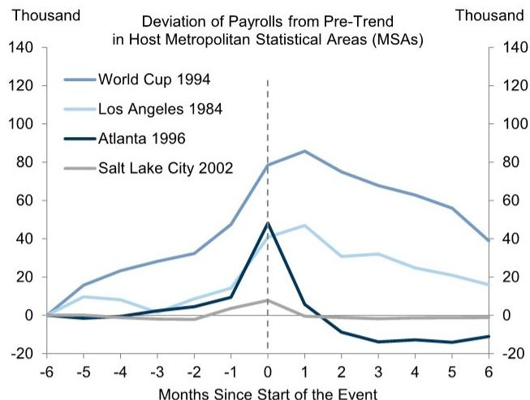
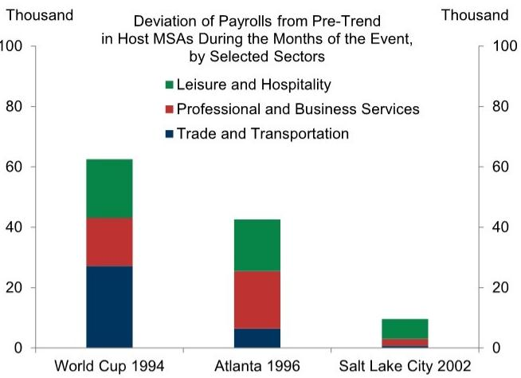
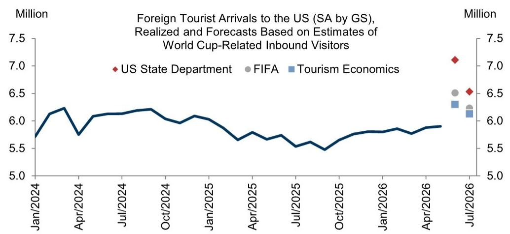
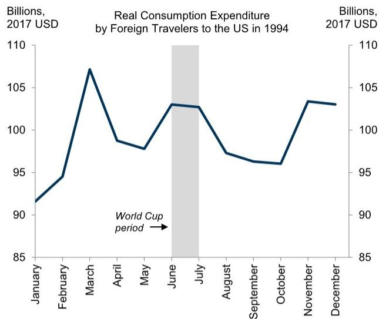
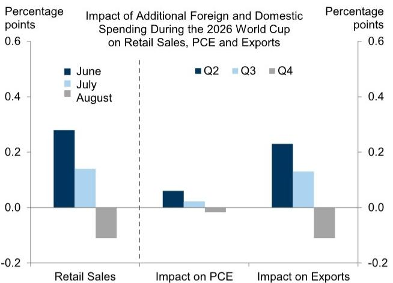
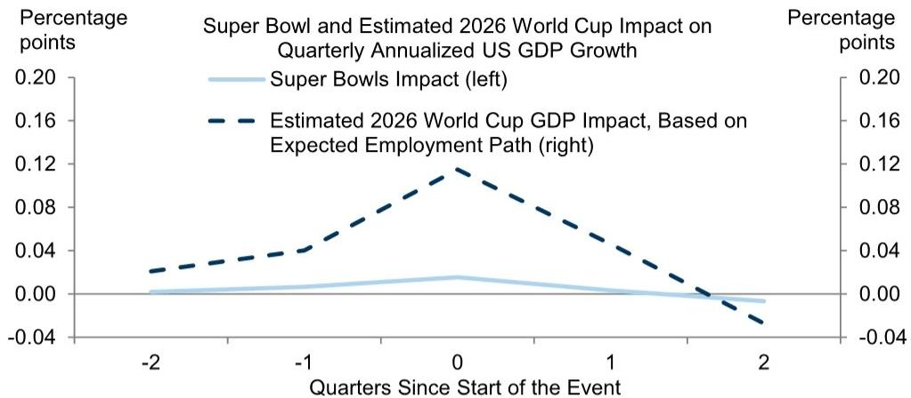
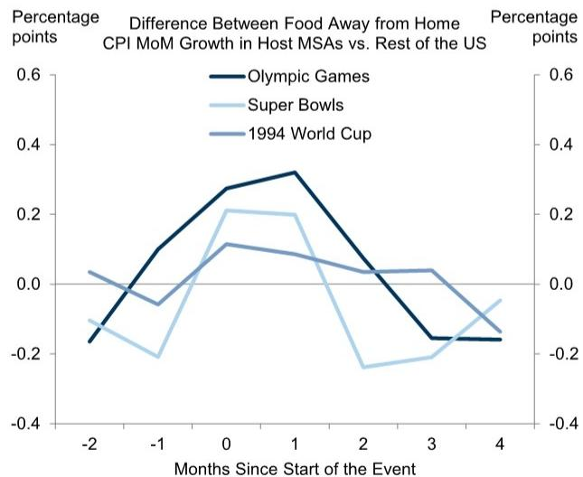
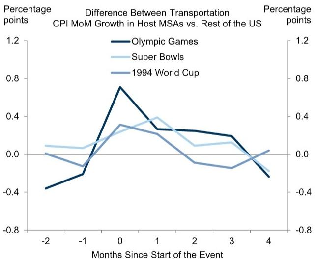
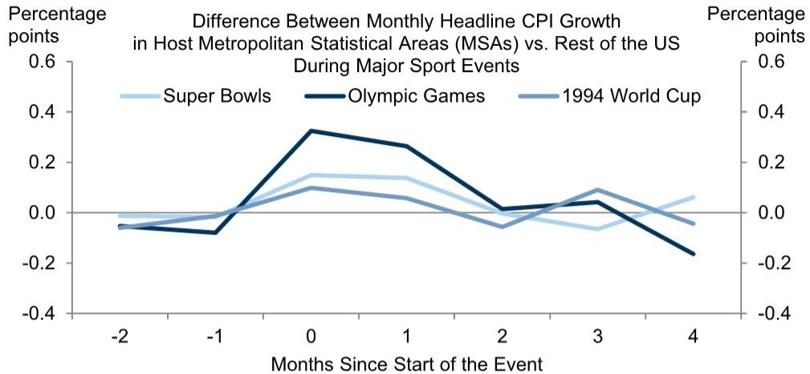

# US ECONOMICS ANALYST

# The Impact of the World Cup on the US Economy

The 2026 World Cup will take place in the US, Mexico, and Canada from June 11 to July 19. An estimated 5-6 million fans will attend 78 matches in the US. More matches will occur in June, but the audience for each match is likely to be much larger during the knockout stage that mostly occurs in July. The matches in the US will be hosted by 11 metropolitan areas that together account for roughly one third of US GDP and one quarter of US employment and the CPI index.

We use historical data from the 1994 US World Cup, 20 years of Super Bowls, and the Olympic Games in Los Angeles, Atlanta, and Salt Lake City to estimate the impact on upcoming economic data releases including payrolls, retail sales, consumer spending, GDP, and CPI and PCE inflation.

The effects of major sporting events tend to be short-lived, reversing in the months following the event. Even so, having a sense of the magnitude of their impact will be useful for distinguishing temporary World Cup effects from changes in underlying economic trends in coming months.

Payroll employment rose 80k above trend in host cities during the 1994 US World Cup and 40k during past Summer Olympics in the event months, before mostly reverting to trend thereafter. The increases were concentrated in leisure and hospitality, retail trade, and transportation around the event, while business services saw earlier hiring in the preceding months for support activities. Scaling to the size of the current World Cup and allowing for some impact already, we estimate a 40k boost to payroll growth in June, a 10k boost in July, a 15k drag after the Cup ends in August, and further gradual reversals in subsequent months as temporary positions end.

GDP should also get a small boost concentrated in consumer spending and exports of services to foreign tourists, an extra $1/2 - 1mn$ of whom are likely to arrive in June and July. We use tourist spending data from the 1994 World Cup and state-level GDP during past Super Bowls to estimate the impact on activity, rescaling to the larger size of the current World Cup. We estimate a boost of 0.3pp in June and 0.1pp in July to retail sales growth, which does not distinguish between spending by residents and foreigners. We expect modest boosts of 0.1pp in Q2 and 0.05pp in Q3 to annualized GDP growth, which should then give way to a small drag in Q4.

■ Prices for hotels have already spiked, and city-level CPI data show that prices for

## Pierfrancesco Mei

+1(212)902-8809

pierfrancesco.mei@gs.com

GS & Co. LLC

## David Mericle

+1(212)357-2619

david.mericle@gs.com

GS & Co. LLC

restaurant meals and transportation also tend to jump in host cities around major sporting events. But the effects of past events on inflation have varied widely, which makes the impact of the World Cup more uncertain. We estimate that it will provide a boost in June of 0.03pp to core CPI inflation and 0.04pp to core PCE, which includes restaurant services, unlike core CPI. We expect a 1bp incremental boost in July, followed by a drag of 1bp in August that continues in later months.

## The Impact of the World Cup on the US Economy

The 2026 FIFA World Cup will take place in the US, Mexico, and Canada from June 11 to July 19. An estimated 5-6 million fans will attend 78 matches in the US. More matches will occur in June, but the audience for each match is likely to be much larger during the knockout stage that mostly occurs in July. As Exhibit 1 shows, the matches in the US will be hosted by 11 metropolitan statistical areas (MSAs) that together account for roughly one third of US GDP and one quarter of US employment and the CPI index.

Exhibit 1: World Cup Matches Will Take Place in 11 Metropolitan Areas Representing One Third of US GDP

<table><tr><td colspan="2">2026 FIFA World Cup in the US</td></tr><tr><td colspan="2">Basic Facts</td></tr><tr><td>US Metropolitan Areas Hosting the Matches*</td><td>11</td></tr><tr><td>Dates</td><td>June 11 - July 19</td></tr><tr><td>Number of Matches</td><td>78</td></tr><tr><td>Estimated Number of Match Attendees</td><td>5-6 Million</td></tr><tr><td colspan="2">Economic Facts About the 11 Host Metropolitan Areas</td></tr><tr><td>Share of US GDP</td><td>32%</td></tr><tr><td>Share of Total US Employment</td><td>23%</td></tr><tr><td>Weight in the CPI Index</td><td>26%</td></tr></table>

\* Matches will be played in the following metropolitan areas: Atlanta, Boston, Dallas, Houston, Kansas City, Los Angeles, Miami, New York City/New Jersey, Philadelphia, San Francisco Bay Area, and Seattle.  
Source: GS Global Investment Research, Bureau of Economic Analysis, US Bureau of Labor Statistics, FIFA

In this week's Analyst, we draw on historical data from the 1994 US World Cup, two decades of Super Bowls, and the Summer Olympic Games held in Los Angeles (1984), Atlanta (1996), and Salt Lake City (2002) to estimate the tournament's impact on upcoming economic data releases, including payrolls, retail sales, consumer spending, GDP, and CPI and PCE inflation.

The economic effects of major sporting events tend to be short-lived, largely reversing in the months following the event. Even so, knowing the rough size of these effects will be important for distinguishing temporary World Cup-related distortions from shifts in underlying economic trends in the months ahead.

## Impact on Payrolls

Payroll employment rose 80k above trend in host cities during the 1994 US World Cup and 40k on average during past Summer Olympics in the event months, before largely reverting to trend in the following months (Exhibit 2). Job gains during the events were concentrated in leisure and hospitality, retail trade, and transportation, while professional and business services hiring tended to accelerate in the months preceding the event to support logistics and operations. Consistent with this pattern, business services employment in the 11 host metropolitan areas rose about 20k in each of March and April, while it was little changed in the rest of the US. While city-level data are not yet available for May, some of the strength in May payroll growth might also have reflected hiring ahead of the World Cup.

Exhibit 2: Payroll Employment Rose More Than 80k Above Trend in Host Cities During the 1994 World Cup, With Job Gains Largely Concentrated in the Leisure & Hospitality, Trade, and Business Services Sectors  

line chart

Deviation of Payrolls from Pre-Trend in Host Metropolitan Statistical Areas (MSAs)
| Months Since Start of the Event | World Cup 1994 (Thousand) | Los Angeles 1984 (Thousand) | Atlanta 1996 (Thousand) | Salt Lake City 2002 (Thousand) |
|---|---|---|---|---|
| -6 | 0 | 0 | 0 | 0 |
| -5 | 15 | 10 | -5 | 0 |
| -4 | 25 | 8 | -5 | 0 |
| -3 | 30 | 5 | -5 | 0 |
| -2 | 35 | 10 | -5 | 0 |
| -1 | 45 | 15 | 10 | 0 |
| 0 | 80 | 45 | 50 | 10 |
| 1 | 85 | 50 | 10 | 5 |
| 2 | 75 | 35 | -10 | 0 |
| 3 | 70 | 30 | -15 | 0 |
| 4 | 65 | 25 | -15 | 0 |
| 5 | 60 | 20 | -15 | 0 |
| 6 | 40 | 15 | -15 | 0 |

Note: Deviation from 12-month trend of nonfarm payrolls calculated up to 6 months before the start of the event. Data for the 1994 World Cup include all nine host MSAs.

stacked bar chart

Deviation of Payrolls from Pre-Trend in Host MSAs During the Months of the Event, by Selected Sectors
| Event | Trade and Transportation (Thousand) | Professional and Business Services (Thousand) | Leisure and Hospitality (Thousand) |
|---|---|---|---|
| World Cup 1994 | 27 | 18 | 23 |
| Atlanta 1996 | 6 | 25 | 20 |
| Salt Lake City 2002 | 0 | 2 | 6 |

Note: Deviation from 12-month trend of nonfarm payrolls calculated up to 6 months before the start of the event. Sector-level payrolls not available for the 1984 LA Olympic Games.  
Source: GS Global Investment Research, US Bureau of Labor Statistics

To estimate the impact of the 2026 World Cup on payrolls, we scale up the trajectory of job gains observed around the 1994 tournament by roughly $30\%$ to reflect the larger number of matches and attendees. Accounting for some hiring that has likely already occurred through May, we estimate a boost to monthly payroll growth of 40k in June and 10k in July, followed by a 15k drag in August as temporary positions wind down, with further gradual reversals throughout the rest of the year.

## Impact on GDP

Economic activity should receive a modest boost from the tournament. Spending on food and beverages by foreign tourists, domestic tourists, and locals will boost retail sales, which does not distinguish between spending by residents and foreigners. In the GDP statistics, all spending by domestic fans will boost consumer spending, and spending by foreign fans will boost exports of tourist services.

Drawing on estimates from the US State Department, FIFA, and Tourism Economics, and assuming that roughly two-thirds of World Cup-associated arrivals represent net additive inflows—with the remaining one-third displacing other tourism due to capacity constraints and elevated prices in host cities $^{1}$ —we estimate that foreign arrivals will run $\frac{1}{2}$ -1mn above trend in June and July (Exhibit 3).

Exhibit 3: The World Cup Should Provide a Tailwind to Foreign Tourism into the US in June and July  

line chart

| Month     | US State Department | FIFA  | Tourism Economics |
| --------- | ------------------- | ----- | ----------------- |
| Jul/2026  | 7.1                 | 6.5   | 6.3               |

Note: We assume that two thirds of World Cup-associated inbound visitors represent additive demand, with one third displacing alternative tourism due to capacity constraints and price effects in host cities.  
Source: GS Global Investment Research, US State Department, FIFA, Tourism Economics

The left side of Exhibit 4 shows that spending by foreign tourists rose about $5\%$ during the 1994 World Cup. To estimate spending by foreign and domestic tourists in coming months, we combine estimates of the expected number of foreign and domestic attendees with US Travel Association estimates of per-traveler spending across transport, lodging, food, and match-related expenditures. We estimate spending by locals by scaling up estimates of spending on Super Bowl entertainment for a typical household from the National Retail Federation by an estimate that the average American watched 2-3 matches during recent World Cups. We supplement these bottom-up estimates with a top-down approach where possible by looking at, for example, food and beverage retail sales during prior events.

The right side of Exhibit 4 shows our estimates based on this approach. We expect a boost to retail sales of 0.3pp in June and 0.1pp in July followed by a drag of 0.1pp in August, a boost to consumer spending of 0.05pp in Q2 and 0.02pp in Q3 followed by a drag of 0.03pp in Q4, and a boost to exports of 0.2pp in Q2 and 0.1pp in Q3 followed by a drag of 0.1pp in Q4.

Exhibit 4: We Estimate That Spending by Foreign and Domestic World Cup Fans Should Provide a Peak Boost to Retail Sales Growth of 0.3pp in June and to Consumer Spending of 0.05pp in Q2  

line chart

Real Consumption Expenditure by Foreign Travelers to the US in 1994
| Month | Real Consumption Expenditure (Billions, 2017 USD) |
|---|---|
| January | 91.5 |
| February | 94.5 |
| March | 107.2 |
| April | 98.8 |
| May | 97.6 |
| June | 103.1 |
| July | 102.8 |
| August | 97.2 |
| September | 96.3 |
| October | 96.0 |
| November | 103.5 |
| December | 103.2 |
World Cup period indicated by arrow between May and June.

bar chart

Impact of Additional Foreign and Domestic Spending During the 2026 World Cup on Retail Sales, PCE and Exports
| Category | June (%) | July (%) | August (%) |
|---|---|---|---|
| Retail Sales | 0.28 | 0.14 | -0.12 |
| Impact on PCE | 0.06 | 0.02 | -0.01 |
| Impact on Exports | 0.23 | 0.13 | -0.11 |

Note: Our estimates assume a $40\%$ international fan share, that about two-thirds of World Cup-related travel spending represents net new activity, and allocates the impact across June (Q2) and July (Q3) based on the matches played in each month.  
Source: GS Global Investment Research, Census Bureau, Bureau of Economic Analysis

Even after imposing the 1.5 multiplier effect estimate from the Bureau of Economic Analysis's Travel and Tourism Satellite Accounts, these fan spending estimates are unlikely to capture the full impact on GDP, which will also include other effects such as government spending on security.

We therefore also consider a top-down estimate of the impact on GDP by estimating the effects of past Super Bowls using Gross State Product data. We then rescale the estimated effect of the Super Bowl to a World Cup effect by assuming that the ratio of the events' GDP effects will be the same as the ratio of their cumulative effects on employment. Exhibit 5 shows that this approach implies a boost to annualized GDP growth of 0.1pp in Q2 and 0.05pp in Q3, which should then give way to a modest drag in Q4. These figures are close to but a bit larger than the bottom-up estimates above, as one would expect.

Exhibit 5: Scaling Up the GDP Impact of Past Super Bowls Using the Estimated Effects on Employment Suggests That the 2026 World Cup Could Add 0.1pp to Annualized GDP Growth in 2026Q2  

line chart

| Quarters Since Start of the Event | Super Bowls Impact (left) | Estimated 2026 World Cup GDP Impact, Based on Expected Employment Path (right) |
| --------------------------------- | ------------------------- | ------------------------------------------------------------------ |
| -2                                | 0.00                      | 0.03                                                               |
| -1                                | 0.01                      | 0.04                                                               |
| 0                                 | 0.02                      | 0.12                                                               |
| 1                                 | 0.01                      | 0.08                                                               |
| 2                                 | -0.01                     | -0.04                                                              |

Note: Super Bowl GDP effects are estimated using state-level quarterly GDP data from 2005. The 2026 World Cup GDP impact is derived by scaling the Super Bowl effect by the ratio of employment gains estimated for the 2026 World Cup to those associated with Super Bowls.

Source: GS Global Investment Research, Bureau of Economic Analysis, US Bureau of Labor Statistics

One downside risk to our estimate is that many World Cup matches, unlike the Super Bowl, will take place during work hours and could reduce the productivity of distracted workers.

## Impact on Inflation

Prices for hotel rooms on match nights have already spiked, as Exhibit 6 shows. We assume that prices will increase by half as much on each of the two nights before and after the match night, and by a quarter as much on the two nights before and after those nights. Accounting for the fact that the official price statistics measure hotel prices at the time of reservation and for the weight of the host MSAs in the CPI, we estimate that the World Cup will boost national average hotel prices by about $1\%$ in June, following increases in April and May. We expect hotel prices to begin to normalize slightly by July, a bit ahead of other prices, because most hotel reservations for the World Cup will already have been made by June and because the smaller number of matches is likely to outweigh the effect of a larger per-match impact, whereas the opposite is likely to be true for activity and prices at bars and restaurants.

Exhibit 6: Sharply Higher Hotel Prices in Host Cities Around Match Days Imply a World Cup Boost to Average US Hotel Prices of About 1% in June  

bar chart

Hotel Room Price Difference from Regular Prices on Match Nights in Host Cities in June/July 2026 and Impact on US Hotel CPI
| City | Difference from Regular Prices (left) (%) | Impact on US Hotel CPI MoM Growth (right) (%) |
|---|---|---|
| Kansas City | 160 | |
| Miami | 75 | |
| Philadelphia | 73 | |
| Houston | 69 | |
| Dallas | 68 | |
| SF/Bay Area | 42 | |
| New York | 39 | |
| Boston | 37 | |
| Atlanta | 35 | |
| Seattle | 31 | |
| Los Angeles | 15 | |
| June US Average | - | 1.0 |
| July | - | -0.5 |
| August | - | -1.0 |

Note: Hotel room price premiums for each host city are based on estimates provided by the New York Times, derived from data on major hotel chains. We assign the price premiums to June and July based on the number of matches played and obtain average effects using the CPI weights for each MSA.  
Source: GS Global Investment Research, US Bureau of Labor Statistics, New York Times

MSA-level CPI data show that prices for food away from home and transportation also tend to jump in host cities around major sporting events, as shown in Exhibit 7. These data also show that while some payback appears to occur in the months following the event, it is less than complete. This seems plausible—restaurant price increases sparked by the event might not fully reverse immediately after and might instead be undone only gradually and undetectably by smaller price increases well after the event.

Exhibit 7: Past Sporting Events Drove Temporary Prices Hikes for Restaurants and Transportation Services  

line chart

Difference Between Food Away from Home CPI MoM Growth in Host MSAs vs. Rest of the US
| Months Since Start of the Event | Olympic Games (Percentage points) | Super Bowls (Percentage points) | 1994 World Cup (Percentage points) |
|---|---|---|---|
| -2 | -0.15 | -0.1 | 0.03 |
| -1 | 0.1 | -0.2 | -0.05 |
| 0 | 0.28 | 0.22 | 0.12 |
| 1 | 0.33 | 0.2 | 0.08 |
| 2 | 0.05 | -0.25 | 0.03 |
| 3 | -0.18 | -0.2 | 0.04 |
| 4 | -0.18 | -0.05 | -0.15 |

line chart

Difference Between Transportation CPI MoM Growth in Host MSAs vs. Rest of the US
| Months Since Start of the Event | Olympic Games (%) | Super Bowls (%) | 1994 World Cup (%) |
|---|---|---|---|
| -2 | -0.4 | 0.1 | 0.0 |
| -1 | -0.2 | 0.1 | -0.1 |
| 0 | 0.7 | 0.3 | 0.3 |
| 1 | 0.3 | 0.4 | 0.2 |
| 2 | 0.3 | 0.1 | -0.1 |
| 3 | 0.2 | 0.1 | -0.2 |
| 4 | -0.3 | -0.2 | 0.0 |

Source: GS Global Investment Research, US Bureau of Labor Statistics

The MSA-level price data do not provide a complete breakout of all of the relevant price categories, but most of the impact of the World Cup on prices should come from hotels, restaurants and bars, and transportation services. For a top-down complement to our bottom-up approach, Exhibit 8 compares headline CPI inflation in host vs. non-host cities during major sporting events. The effects vary widely across events but on average suggest an impact of the World Cup similar to the bottom-up estimate.

Exhibit 8: Past Major Sporting Events Boosted Monthly CPI Inflation by 0.1-0.4pp in the Host Cities in Event Months; a Similar World Cup Impact Would Boost National June CPI Inflation by 0.03-0.1pp  

line chart

Difference Between Monthly Headline CPI Growth in Host Metropolitan Statistical Areas (MSAs) vs. Rest of the US During Major Sport Events
| Months Since Start of the Event | Super Bowls (%) | Olympic Games (%) | 1994 World Cup (%) |
|---|---|---|---|
| -2 | -0.02 | -0.05 | -0.03 |
| -1 | -0.01 | -0.08 | -0.02 |
| 0 | 0.15 | 0.33 | 0.10 |
| 1 | 0.14 | 0.27 | 0.06 |
| 2 | -0.02 | 0.01 | -0.05 |
| 3 | -0.05 | 0.04 | 0.10 |
| 4 | 0.06 | -0.18 | -0.03 |

Note: Olympic Games include Los Angeles 1984 and Atlanta 1996 (MSA-level CPI data are not available for Salt Lake City 2002); Super Bowls include all matches played since 2000 in MSAs for which CPI data are available.  
Source: GS Global Investment Research, US Bureau of Labor Statistics

Putting some weight on both approaches, we estimate that the World Cup will provide a boost in June of 0.03pp to core CPI inflation and 0.04pp to core PCE, which includes restaurant services, unlike core CPI. Exhibit 9 below shows that we expect a 1bp incremental boost in July, followed by a drag of 1bp in August that continues in later months.

## The Impact of the World Cup on Upcoming Data Releases

Exhibit 9 summarizes our estimates of the effect of the World Cup on payrolls, retail sales and consumer spending, GDP, and CPI and PCE inflation. We expect to see the largest effects in June, followed by small positive incremental effects in July, when the knockout stage will present fewer matches but much larger audiences for each match. Payback effects should be visible in August and should continue in subsequent months, though they might be too gradual and modest to see clearly.

Exhibit 9: We Expect the Largest Effects of the World Cup on Payrolls, Retail Sales, and Inflation to Show Up in June, with Small Incremental Positive Effects in July, When Most of the Knockout Stage Takes Place

<table><tr><td colspan="4">Estimated Economic Impact of the 2026 World Cup</td></tr><tr><td colspan="4">MoM Growth</td></tr><tr><td></td><td>June</td><td>July</td><td>August</td></tr><tr><td>Nonfarm Payrolls</td><td>40k</td><td>10k</td><td>-15k</td></tr><tr><td>Retail Sales</td><td>0.3</td><td>0.1</td><td>-0.1</td></tr><tr><td>Headline CPI</td><td>0.04</td><td>0.01</td><td>-0.01</td></tr><tr><td>Core CPI</td><td>0.03</td><td>0.01</td><td>-0.01</td></tr><tr><td>Headline PCE Inflation</td><td>0.04</td><td>0.01</td><td>-0.01</td></tr><tr><td>Core PCE Inflation</td><td>0.04</td><td>0.01</td><td>-0.01</td></tr><tr><td colspan="4">Quarterly Annualized Growth</td></tr><tr><td></td><td>2026Q2</td><td>2026Q3</td><td>2026Q4</td></tr><tr><td>Real GDP</td><td>0.1</td><td>0.05</td><td>-0.05</td></tr><tr><td>Real PCE Consumption</td><td>0.05</td><td>0.02</td><td>-0.03</td></tr></table>

Source: GS Global Investment Research

Our analysis above provides estimates of the effect of hosting the World Cup. Our colleagues also found suggestive evidence that winning the World Cup might give a boost to GDP, which implies that the impact could be larger if the US team prevails, a possibility that our model gives a 1-in-200 chance.

Pierfrancesco Mei

David Mericle

## The US Economic and Financial Outlook

THE US ECONOMIC AND FINANCIAL OUTLOOK  
(% change on previous period, annualized, except where noted)

<table><tr><td rowspan="2"></td><td rowspan="2">2023</td><td rowspan="2">2024</td><td rowspan="2">2025</td><td rowspan="2">2026</td><td rowspan="2">2027</td><td rowspan="2">2025Q4</td><td colspan="4">2026</td><td colspan="4">2027</td></tr><tr><td>Q1</td><td>Q2</td><td>Q3</td><td>Q4</td><td>Q1</td><td>Q2</td><td>Q3</td><td>Q4</td></tr><tr><td colspan="15">OUTPUT AND SPENDING</td></tr><tr><td>Real GDP</td><td>2.9</td><td>2.8</td><td>2.1</td><td>2.0</td><td>2.0</td><td>0.5</td><td>1.6</td><td>1.9</td><td>1.9</td><td>1.8</td><td>2.0</td><td>2.1</td><td>2.2</td><td>2.3</td></tr><tr><td>Real GDP (annual=Q4/Q4, quarterly=yoy)</td><td>3.4</td><td>2.4</td><td>2.0</td><td>1.8</td><td>2.1</td><td>2.0</td><td>2.6</td><td>2.1</td><td>1.5</td><td>1.8</td><td>1.9</td><td>2.0</td><td>2.0</td><td>2.1</td></tr><tr><td>Consumer Expenditures</td><td>2.6</td><td>2.9</td><td>2.6</td><td>1.8</td><td>1.7</td><td>1.9</td><td>1.4</td><td>1.4</td><td>1.3</td><td>1.3</td><td>1.9</td><td>2.0</td><td>2.1</td><td>2.2</td></tr><tr><td>Residential Fixed Investment</td><td>-7.8</td><td>3.2</td><td>-2.2</td><td>-4.2</td><td>1.4</td><td>-1.7</td><td>-6.3</td><td>-6.9</td><td>1.5</td><td>1.5</td><td>2.2</td><td>2.2</td><td>2.2</td><td>2.2</td></tr><tr><td>Business Fixed Investment</td><td>7.3</td><td>2.9</td><td>4.1</td><td>6.4</td><td>5.7</td><td>2.4</td><td>10.1</td><td>6.8</td><td>7.5</td><td>6.9</td><td>4.9</td><td>4.9</td><td>4.9</td><td>4.9</td></tr><tr><td>Structures</td><td>16.7</td><td>1.1</td><td>-5.3</td><td>-3.8</td><td>2.0</td><td>-6.6</td><td>-5.4</td><td>0.4</td><td>-1.0</td><td>-0.2</td><td>3.5</td><td>3.5</td><td>3.5</td><td>3.5</td></tr><tr><td>Equipment</td><td>2.9</td><td>3.5</td><td>8.3</td><td>10.4</td><td>7.0</td><td>4.3</td><td>17.2</td><td>11.9</td><td>11.0</td><td>9.5</td><td>5.0</td><td>5.0</td><td>5.0</td><td>5.0</td></tr><tr><td>Intellectual Property Products</td><td>6.2</td><td>3.5</td><td>5.6</td><td>7.9</td><td>6.2</td><td>5.4</td><td>11.6</td><td>5.0</td><td>8.2</td><td>7.8</td><td>5.5</td><td>5.5</td><td>5.5</td><td>5.5</td></tr><tr><td>Federal Government</td><td>3.3</td><td>3.8</td><td>-1.2</td><td>-1.0</td><td>0.9</td><td>-16.7</td><td>9.5</td><td>0.0</td><td>1.0</td><td>1.0</td><td>1.0</td><td>1.0</td><td>1.0</td><td>1.0</td></tr><tr><td>State &amp; Local Government</td><td>3.6</td><td>3.8</td><td>2.5</td><td>1.3</td><td>0.9</td><td>1.5</td><td>1.5</td><td>0.5</td><td>0.5</td><td>1.0</td><td>1.0</td><td>1.0</td><td>1.0</td><td>1.0</td></tr><tr><td>Net Exports ($bn, &#x27;17)</td><td>-925</td><td>-1,033</td><td>-1,091</td><td>-1,136</td><td>-1,222</td><td>-969</td><td>-1,064</td><td>-1,140</td><td>-1,160</td><td>-1,182</td><td>-1,198</td><td>-1,214</td><td>-1,230</td><td>-1,246</td></tr><tr><td>Inventory Investment ($bn, &#x27;17)</td><td>47</td><td>44</td><td>29</td><td>43</td><td>66</td><td>-16</td><td>-26</td><td>66</td><td>66</td><td>66</td><td>66</td><td>66</td><td>66</td><td>66</td></tr><tr><td>Nominal GDP</td><td>6.7</td><td>5.3</td><td>5.0</td><td>6.0</td><td>4.8</td><td>4.2</td><td>5.2</td><td>8.6</td><td>4.6</td><td>4.6</td><td>4.7</td><td>4.4</td><td>4.5</td><td>4.4</td></tr><tr><td>Industrial Production, Mfg.</td><td>-1.0</td><td>-1.0</td><td>0.8</td><td>3.1</td><td>3.6</td><td>-3.4</td><td>5.3</td><td>6.3</td><td>4.4</td><td>3.7</td><td>3.2</td><td>3.2</td><td>3.2</td><td>3.3</td></tr><tr><td colspan="15">HOUSING MARKET</td></tr><tr><td>Housing Starts (units, thous)</td><td>1,421</td><td>1,370</td><td>1,356</td><td>1,286</td><td>1,322</td><td>1,323</td><td>1,280</td><td>1,290</td><td>1,280</td><td>1,292</td><td>1,304</td><td>1,316</td><td>1,328</td><td>1,340</td></tr><tr><td>New Home Sales (units, thous)</td><td>666</td><td>684</td><td>671</td><td>670</td><td>644</td><td>680</td><td>690</td><td>690</td><td>662</td><td>638</td><td>626</td><td>632</td><td>649</td><td>670</td></tr><tr><td>Existing Home Sales (units, thous)</td><td>4,103</td><td>4,067</td><td>4,076</td><td>4,212</td><td>4,375</td><td>4,157</td><td>4,169</td><td>4,189</td><td>4,223</td><td>4,267</td><td>4,310</td><td>4,353</td><td>4,396</td><td>4,440</td></tr><tr><td>Case-Shiller Home Prices (%yoy)*</td><td>5.3</td><td>3.8</td><td>0.6</td><td>0.8</td><td>2.2</td><td>0.6</td><td>0.3</td><td>0.8</td><td>0.7</td><td>0.8</td><td>1.1</td><td>1.4</td><td>1.8</td><td>2.2</td></tr><tr><td colspan="15">INFLATION (% ch, yr/yr)</td></tr><tr><td>Consumer Price Index (CPI)**</td><td>3.3</td><td>2.9</td><td>2.7</td><td>3.9</td><td>2.0</td><td>2.7</td><td>2.7</td><td>4.0</td><td>3.8</td><td>3.8</td><td>3.5</td><td>2.3</td><td>2.3</td><td>2.1</td></tr><tr><td>Core CPI **</td><td>3.9</td><td>3.2</td><td>2.6</td><td>2.6</td><td>2.2</td><td>2.7</td><td>2.5</td><td>2.8</td><td>2.5</td><td>2.6</td><td>2.4</td><td>2.2</td><td>2.2</td><td>2.2</td></tr><tr><td>Core PCE** †</td><td>3.1</td><td>3.0</td><td>3.0</td><td>3.0</td><td>2.2</td><td>2.9</td><td>3.1</td><td>3.3</td><td>3.2</td><td>3.1</td><td>2.6</td><td>2.3</td><td>2.2</td><td>2.2</td></tr><tr><td colspan="15">LABOR MARKET</td></tr><tr><td>Unemployment Rate (%)^</td><td>3.8</td><td>4.1</td><td>4.4</td><td>4.4</td><td>4.3</td><td>4.4</td><td>4.3</td><td>4.3</td><td>4.4</td><td>4.4</td><td>4.4</td><td>4.4</td><td>4.3</td><td>4.3</td></tr><tr><td>U6 Underemployment Rate (%)^</td><td>7.2</td><td>7.6</td><td>8.4</td><td>8.3</td><td>8.0</td><td>8.4</td><td>8.0</td><td>8.1</td><td>8.3</td><td>8.3</td><td>8.3</td><td>8.3</td><td>8.1</td><td>8.0</td></tr><tr><td>Payrolls (thous, monthly rate)</td><td>210</td><td>122</td><td>10</td><td>72</td><td>92</td><td>-39</td><td>73</td><td>130</td><td>40</td><td>47</td><td>70</td><td>97</td><td>100</td><td>100</td></tr><tr><td>Employment-Population Ratio (%)^</td><td>60.1</td><td>59.9</td><td>59.7</td><td>59.1</td><td>58.9</td><td>59.7</td><td>59.2</td><td>59.2</td><td>59.1</td><td>59.1</td><td>59.0</td><td>58.9</td><td>58.9</td><td>58.9</td></tr><tr><td>Labor Force Participation Rate (%)^</td><td>62.5</td><td>62.5</td><td>62.4</td><td>61.8</td><td>61.5</td><td>62.4</td><td>61.9</td><td>61.8</td><td>61.8</td><td>61.8</td><td>61.7</td><td>61.7</td><td>61.6</td><td>61.5</td></tr><tr><td>Average Hourly Earnings (%yoy)</td><td>4.4</td><td>3.9</td><td>4.0</td><td>3.9</td><td>3.8</td><td>4.0</td><td>4.0</td><td>4.0</td><td>3.9</td><td>3.8</td><td>3.8</td><td>3.8</td><td>3.8</td><td>3.8</td></tr><tr><td colspan="15">GOVERNMENT FINANCE</td></tr><tr><td>Federal Budget (FY, $bn)</td><td>-1,694</td><td>-1,833</td><td>-1,775</td><td>-1,950</td><td>-2,050</td><td>--</td><td>--</td><td>--</td><td>--</td><td>--</td><td>--</td><td>--</td><td>--</td><td>--</td></tr><tr><td colspan="15">FINANCIAL INDICATORS</td></tr><tr><td>FF Target Range (Bottom-Top, %)^</td><td>5.25-5.5</td><td>4.25-4.5</td><td>3.5-3.75</td><td>3.5-3.75</td><td>3-3.25</td><td>3.5-3.75</td><td>3.5-3.75</td><td>3.5-3.75</td><td>3.5-3.75</td><td>3.5-3.75</td><td>3.5-3.75</td><td>3.25-3.5</td><td>3.25-3.5</td><td>3-3.25</td></tr><tr><td>10-Year Treasury Note^</td><td>3.88</td><td>4.58</td><td>4.18</td><td>4.40</td><td>4.25</td><td>4.18</td><td>4.30</td><td>4.50</td><td>4.45</td><td>4.40</td><td>4.35</td><td>4.30</td><td>4.25</td><td>4.25</td></tr><tr><td>Euro (€/$)^</td><td>1.11</td><td>1.04</td><td>1.17</td><td>1.18</td><td>1.20</td><td>1.17</td><td>1.15</td><td>1.16</td><td>1.19</td><td>1.18</td><td>1.19</td><td>1.20</td><td>1.20</td><td>1.20</td></tr><tr><td>Yen ($/¥)^</td><td>141</td><td>157</td><td>157</td><td>158</td><td>141</td><td>157</td><td>159</td><td>158</td><td>158</td><td>158</td><td>156</td><td>141</td><td>101</td><td>141</td></tr></table>

\* Weighted average of metro-level HPIs for 381 metro cities where the weights are dollar values of housing stock reported in the American Community Survey. Annual numbers are Q4/Q4.  
\*\* Annual inflation numbers are December year-on-year values. Quarterly values are Q4/Q4.  
† PCE = Personal consumption expenditures. ^ Denotes end of period.  
Note: Published figures in bold.  
Source: GS Global Investment Research

## The US Economics Team

## Jan Hatzius

+1(212)902-0394

jan.hatzius@gs.com

GS & Co. LLC

## Alec Phillips

+1(202)637-3746

alec.phillips@gs.com

GS & Co. LLC

## David Mericle

+1(212)357-2619

david.mericle@gs.com

GS & Co. LLC

## Ronnie Walker

+1(917)343-4543

ronnie.walker@gs.com

GS & Co. LLC

## Manuel Abecasis

+1(212)902-8357

manuel.abecasis@gs.com

GS & Co. LLC

## Elsie Peng

+1(212)357-3137

elsie.peng@gs.com

GS & Co. LLC

## Pierfrancesco Mei

+1(212)902-8809

pierfrancesco.mei@gs.com

GS & Co. LLC

## Jessica Rindels

+1(972)368-1516

jessica.rindels@gs.com

GS & Co. LLC

## Disclosure Appendix

## Reg AC

We, Pierfrancesco Mei and David Mericle, hereby certify that all of the views expressed in this report accurately reflect our personal views, which have not been influenced by considerations of the firm's business or client relationships.

Unless otherwise stated, the individuals listed on the cover page of this report are analysts in GS' Global Investment Research division.

Contributing Authors: Pierfrancesco Mei GS & Co. LLC, David Mericle GS & Co. LLC.

Unless otherwise stated, the individuals listed in the Contributing Authors disclosure of this report are analysts in GS' Global Investment Research division.

## Disclosures

## Regulatory disclosures

## Disclosures required by United States laws and regulations

See company-specific regulatory disclosures above for any of the following disclosures required as to companies referred to in this report: manager or co-manager in a pending transaction; $1\%$ or other ownership; compensation for certain services; types of client relationships; managed/co-managed public offerings in prior periods; directorships; for equity securities, market making and/or specialist role. GS trades or may trade as a principal in debt securities (or in related derivatives) of issuers discussed in this report.

The following are additional required disclosures: Ownership and material conflicts of interest: GS policy prohibits its analysts, professionals reporting to analysts and members of their households from owning securities of any company in the analyst's area of coverage. Analyst compensation: Analysts are paid in part based on the profitability of GS, which includes investment banking revenues. Analyst as officer or director: GS policy generally prohibits its analysts, persons reporting to analysts or members of their households from serving as an officer, director or advisor of any company in the analyst's area of coverage. Non-U.S. Analysts: Non-U.S. analysts may not be associated persons of GS & Co. LLC and therefore may not be subject to FINRA Rule 2241 or FINRA Rule 2242 restrictions on communications with a subject company, public appearances and trading in securities covered by the analysts.

## Additional disclosures required under the laws and regulations of jurisdictions other than the United States

The following disclosures are those required by the jurisdiction indicated, except to the extent already made above pursuant to United States laws and regulations. Australia: GS Australia Pty Ltd and its affiliates are not authorised deposit-taking institutions (as that term is defined in the Banking Act 1959 (Cth)) in Australia and do not provide banking services, nor carry on a banking business, in Australia. This research, and any access to it, is intended only for “wholesale clients” within the meaning of the Australian Corporations Act, unless otherwise agreed by GS. In producing research reports, members of Global Investment Research of GS Australia may attend site visits and other meetings hosted by the companies and other entities which are the subject of its research reports. In some instances the costs of such site visits or meetings may be met in part or in whole by the issuers concerned if GS Australia considers it is appropriate and reasonable in the specific circumstances relating to the site visit or meeting. To the extent that the contents of this document contains any financial product advice, it is general advice only and has been prepared by GS without taking into account a client’s objectives, financial situation or needs. A client should, before acting on any such advice, consider the appropriateness of the advice having regard to the client’s own objectives, financial situation and needs. A copy of certain GS Australia and New Zealand disclosure of interests and a copy of GS’ Australian Sell-Side Research Independence Policy Statement are available at: https://www.goldmansachs.com/disclosures/australia-new-zealand/index.html. Brazil: Disclosure information in relation to CVM Resolution n. 20 is available at https://www.gs.com/worldwide/brazil/area/gir/index.html. Where applicable, the Brazil-registered analyst primarily responsible for the content of this research report, as defined in Article 20 of CVM Resolution n. 20, is the first author named at the beginning of this report, unless indicated otherwise at the end of the text. Canada: This information is being provided to you for information purposes only and is not, and under no circumstances should be construed as, an advertisement, offering or solicitation by GS & Co. LLC for purchasers of securities in Canada to trade in any Canadian security. GS & Co. LLC is not registered as a dealer in any jurisdiction in Canada under applicable Canadian securities laws and generally is not permitted to trade in Canadian securities and may be prohibited from selling certain securities and products in certain jurisdictions in Canada. If you wish to trade in any Canadian securities or other products in Canada please contact GS Canada Inc., an affiliate of The GS Group Inc., or another registered Canadian dealer. Hong Kong: Further information on the securities of covered companies referred to in this research may be obtained on request from GS (Asia) L.L.C. India: Further information on the subject company or companies referred to in this research may be obtained from GS (India) Securities Private Limited, Research Analyst - SEBI Registration Number INH000001493, 10th Floor, Ascent-Worli, Sudam Kalu Ahire Marg, Worli, Mumbai-400 025, India, Corporate Identity Number U74140MH2006FTC160634, Phone +91 22 6616 9000, Fax +91 22 6616 9001. GS may beneficially own 1% or more of the securities (as such term is defined in clause 2 (h) the Indian Securities Contracts (Regulation) Act, 1956) of the subject company or companies referred to in this research report. Investment in securities market are subject to market risks. Read all the related documents carefully before investing. Registration granted by SEBI and certification from NISM in no way guarantee performance of the intermediary or provide any assurance of returns to investors. GS (India) Securities Private Limited compliance officer and investor grievance contact details can be found at: https://www.goldmansachs.com/worldwide/india/documents/Grievance-Redressal-and-Escalation-Matrix.pdf, and a copy of the annual audit compliance report can be found at this link: https://publishing.gs.com/content/site/india-annual-compliance-report.html. Japan: See below. Korea: This research, and any access to it, is intended only for “professional investors” within the meaning of the Financial Services and Capital Markets Act, unless otherwise agreed by GS. Further information on the subject company or companies referred to in this research may be obtained from GS (Asia) L.L.C., Seoul Branch. New Zealand: GS New Zealand Limited and its affiliates are neither “registered banks” nor “deposit takers” (as defined in the Reserve Bank of New Zealand Act 1989) in New Zealand. This research, and any access to it, is intended for “wholesale clients” (as defined in the Financial Advisers Act 2008) unless otherwise agreed by GS. A copy of certain GS Australia and New Zealand disclosure of interests is available at: https://www.goldmansachs.com/disclosures/australia-new-zealand/index.html. Russia: Research reports distributed in the Russian Federation are not advertising as defined in the Russian legislation, but are information and analysis not having product promotion as their main purpose and do not provide appraisal within the meaning of the Russian legislation on appraisal activity. Research reports do not constitute a personalized investment recommendation as defined in Russian laws and regulations, are not addressed to a specific client, and are prepared without analyzing the financial circumstances, investment profiles or risk profiles of clients. GS assumes no responsibility for any investment decisions that may be taken by a client or any other person based on this research report. Singapore: GS (Singapore) Pte. (Company Number: 198602165W), which is regulated by the Monetary Authority of Singapore, accepts legal responsibility for this research, and should be contacted with respect to any matters arising from, or in connection with, this research. Taiwan: This material is for reference only and must not be reprinted without permission. Investors should carefully consider their own investment risk. Investment results are the responsibility of the individual investor. United Kingdom: Persons who would be categorized as retail clients in the United Kingdom, as such term is defined in the rules of the Financial Conduct Authority, should read this research in conjunction with prior GS on the covered

companies referred to herein and should refer to the risk warnings that have been sent to them by GS International. A copy of these risks warnings, and a glossary of certain financial terms used in this report, are available from GS International on request.

European Union and United Kingdom: Disclosure information in relation to Article 6 (2) of the European Commission Delegated Regulation (EU) (2016/958) supplementing Regulation (EU) No 596/2014 of the European Parliament and of the Council (including as that Delegated Regulation is implemented into United Kingdom domestic law and regulation following the United Kingdom's departure from the European Union and the European Economic Area) with regard to regulatory technical standards for the technical arrangements for objective presentation of investment recommendations or other information recommending or suggesting an investment strategy and for disclosure of particular interests or indications of conflicts of interest is available at https://www.gs.com/disclosures/europeanpolicy.html which states the European Policy for Managing Conflicts of Interest in Connection with Investment Research.

Japan: GS Japan Co., Ltd. is a Financial Instrument Dealer registered with the Kanto Financial Bureau under registration number Kinsho 69, and a member of Japan Securities Dealers Association, Financial Futures Association of Japan Type II Financial Instruments Firms Association, and Investment Management Association of Japan. Sales and purchase of equities are subject to commission pre-determined with clients plus consumption tax. See company-specific disclosures as to any applicable disclosures required by Japanese stock exchanges, the Japanese Securities Dealers Association or the Japanese Securities Finance Company.

## Global product; distributing entities

GS Global Investment Research produces and distributes research products for clients of GS on a global basis. Analysts based in GS offices around the world produce research on industries and companies, and research on macroeconomics, currencies, commodities and portfolio strategy. This research is disseminated in Australia by GS Australia Pty Ltd (ABN 21 006 797 897); in Brazil by GS do Brasil Corretora de Títulos e Valores Mobiliários S.A.; Public Communication Channel GS Brazil: 0800 727 5764 and / or contatogoldmanbrasil@gs.com. Available Weekdays (except holidays), from 9am to 6pm. Canal de Comunicação com o Público GS Brasil: 0800 727 5764 e/ou contatogoldmanbrasil@gs.com. Horário de funcionamento: segunda-feira à sexta-feira (exceto feriados), das 9h às 18h; in Canada by GS & Co. LLC; in Hong Kong by GS (Asia) L.L.C.; in India by GS (India) Securities Private Ltd.; in Japan by GS Japan Co., Ltd.; in the Republic of Korea by GS (Asia) L.L.C., Seoul Branch; in New Zealand by GS New Zealand Limited; in Russia by OOO GS; in Singapore by GS (Singapore) Pte. (Company Number: 198602165W); and in the United States of America by GS & Co. LLC. GS International has approved this research in connection with its distribution in the United Kingdom.

GS International (“GSI”), authorised by the Prudential Regulation Authority (“PRA”) and regulated by the Financial Conduct Authority (“FCA”) and the PRA, has approved this research in connection with its distribution in the United Kingdom.

European Economic Area: GS Bank Europe SE (“GSBE”) is a credit institution incorporated in Germany and, within the Single Supervisory Mechanism, subject to direct prudential supervision by the European Central Bank and in other respects supervised by German Federal Financial Supervisory Authority (Bundesanstalt für Finanzdienstleistungsaufsicht, BaFin) and Deutsche Bundesbank and disseminates research within the European Economic Area.

## General disclosures

This research is for our clients only. Other than disclosures relating to GS, this research is based on current public information that we consider reliable, but we do not represent it is accurate or complete, and it should not be relied on as such. The information, opinions, estimates and forecasts contained herein are as of the date hereof and are subject to change without prior notification. We seek to update our research as appropriate, but various regulations may prevent us from doing so. Other than certain industry reports published on a periodic basis, the large majority of reports are published at irregular intervals as appropriate in the analyst's judgment.

GS conducts a global full-service, integrated investment banking, investment management, and brokerage business. We have investment banking and other business relationships with a substantial percentage of the companies covered by Global Investment Research. GS & Co. LLC, the United States broker dealer, is a member of SIPC (https://www.sipc.org).

Our salespeople, traders, and other professionals may provide oral or written market commentary or trading strategies to our clients and principal trading desks that reflect opinions that are contrary to the opinions expressed in this research. Our asset management area, principal trading desks and investing businesses may make investment decisions that are inconsistent with the recommendations or views expressed in this research.

We and our affiliates, officers, directors, and employees will from time to time have long or short positions in, act as principal in, and buy or sell, the securities or derivatives, if any, referred to in this research, unless otherwise prohibited by regulation or GS policy.

The views attributed to third party presenters at GS arranged conferences, including individuals from other parts of GS, do not necessarily reflect those of Global Investment Research and are not an official view of GS.

Any third party referenced herein, including any salespeople, traders and other professionals or members of their household, may have positions in the products mentioned that are inconsistent with the views expressed by analysts named in this report.

This research is focused on investment themes across markets, industries and sectors. It does not attempt to distinguish between the prospects or performance of, or provide analysis of, individual companies within any industry or sector we describe.

Any trading recommendation in this research relating to an equity or credit security or securities within an industry or sector is reflective of the investment theme being discussed and is not a recommendation of any such security in isolation.

This research is not an offer to sell or the solicitation of an offer to buy any security in any jurisdiction where such an offer or solicitation would be illegal. It does not constitute a personal recommendation or take into account the particular investment objectives, financial situations, or needs of individual clients. Clients should consider whether any advice or recommendation in this research is suitable for their particular circumstances and, if appropriate, seek professional advice, including tax advice. The price and value of investments referred to in this research and the income from them may fluctuate. Past performance is not a guide to future performance, future returns are not guaranteed, and a loss of original capital may occur. Fluctuations in exchange rates could have adverse effects on the value or price of, or income derived from, certain investments.

Certain transactions, including those involving futures, options, and other derivatives, give rise to substantial risk and are not suitable for all investors. Investors should review current options and futures disclosure documents which are available from GS sales representatives or at https://www.theocc.com/about/publications/character-risks.jsp and https://www.goldmansachs.com/disclosures/cftc\_fcm\_disclosures. Transaction costs may be significant in option strategies calling for multiple purchase and sales of options such as spreads. Supporting documentation will be supplied upon request.

Differing Levels of Service provided by Global Investment Research: The level and types of services provided to you by GS Global Investment Research may vary as compared to that provided to internal and other external clients of GS, depending on various factors including your individual preferences as to the frequency and manner of receiving communication, your risk profile and investment focus and perspective (e.g.,

marketwide, sector specific, long term, short term), the size and scope of your overall client relationship with GS, and legal and regulatory constraints. As an example, certain clients may request to receive notifications when research on specific securities is published, and certain clients may request that specific data underlying analysts' fundamental analysis available on our internal client websites be delivered to them electronically through data feeds or otherwise. No change to an analyst's fundamental research views (e.g., ratings, price targets, or material changes to earnings estimates for equity securities), will be communicated to any client prior to inclusion of such information in a research report broadly disseminated through electronic publication to our internal client websites or through other means, as necessary, to all clients who are entitled to receive such reports.

All research reports are disseminated and available to all clients simultaneously through electronic publication to our internal client websites. Not all research content is redistributed to our clients or available to third-party aggregators, nor is GS responsible for the redistribution of our research by third party aggregators. For research, models or other data related to one or more securities, markets or asset classes (including related services) that may be available to you, please contact your GS representative or go to https://research.gs.com.

Disclosure information is also available at https://www.gs.com/research/hedge.html or from Research Compliance, 200 West Street, New York, NY 10282.

## © 2026 GS.

You are permitted to store, display, analyze, modify, reformat, and print the information made available to you via this service only for your own use. You may not resell or reverse engineer this information to calculate or develop any index for disclosure and/or marketing or create any other derivative works or commercial product(s), data or offering(s) without the express written consent of GS. You are not permitted to publish, transmit, or otherwise reproduce this information, in whole or in part, in any format to any third party without the express written consent of GS. This foregoing restriction includes, without limitation, using, extracting, downloading or retrieving this information, in whole or in part, to train or finetune a machine learning or artificial intelligence system, or to provide or reproduce this information, in whole or in part, as a prompt or input to any such system.