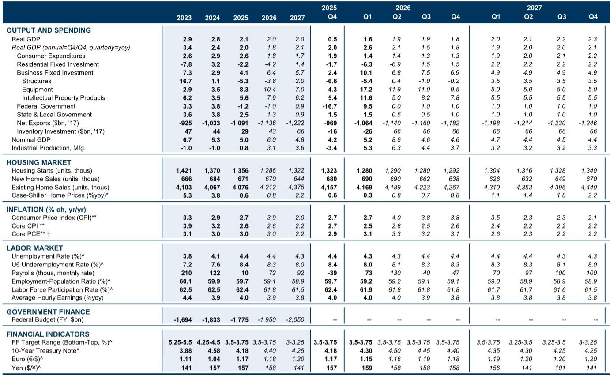
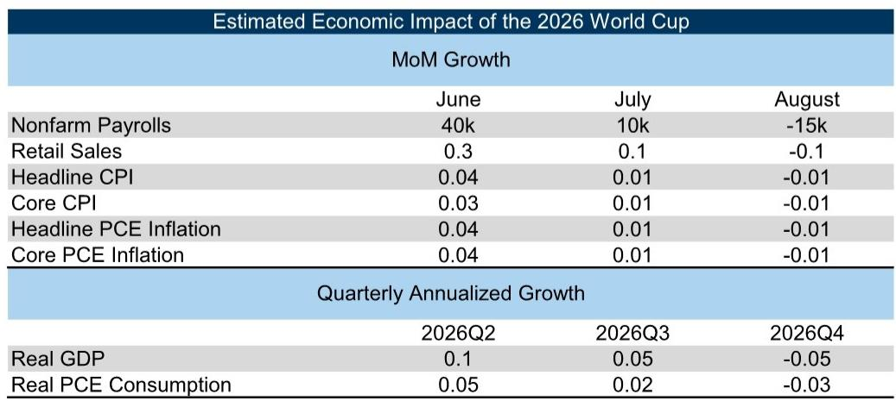
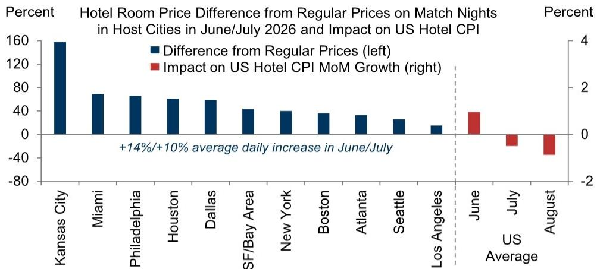

# The 2026 World Cup Will Distort US Economic Data, But Not the Underlying Trend — Here Is How to Read Through It

The 2026 FIFA World Cup is not just a sporting event. It is a concentrated, multi-city economic shock that will temporarily reshape the monthly data flows that investors, policymakers, and corporate strategists rely on. From June 11 to July 19, an estimated 5 to 6 million fans will attend 78 matches across 11 US metropolitan areas that together account for roughly one third of US GDP and one quarter of US employment. The scale is unprecedented for a single peacetime event on American soil in the modern data era.

The central argument of this article is straightforward: the World Cup will inject a measurable but short-lived boost into payrolls, retail sales, consumer spending, and GDP in the second and third quarters of 2026, followed by a partial reversal in the fourth quarter. Inflation will also see a modest, temporary nudge, particularly in hotel prices, restaurant meals, and transportation services. These effects are real, but they are not structural. The critical task for any serious analyst is not to forecast the World Cup impact itself, but to distinguish it from the underlying economic trajectory that will persist after the final whistle.

Why does this matter now? Because the data releases for June, July, and August will arrive in a noisy environment. A 40,000 boost to payrolls in June could easily be misinterpreted as a sign of labor market acceleration. A 0.3 percentage point jump in retail sales growth could be read as consumer resilience. The risk is not that the World Cup effects are large — they are modest in aggregate — but that they will be misinterpreted, leading to overreaction in markets or premature policy signals. The purpose of this analysis is to provide a framework for reading through the noise.

This article draws on historical data from the 1994 US World Cup, two decades of Super Bowls, and the Summer Olympic Games held in Los Angeles, Atlanta, and Salt Lake City. The patterns are consistent: employment rises in host cities before and during the event, concentrated in leisure and hospitality, retail trade, transportation, and business services. Spending by foreign and domestic tourists spikes. Hotel prices surge. And then, within months, most of these effects reverse. The 2026 edition will follow the same playbook, albeit at a larger scale.

The following sections break down the specific impacts on payrolls, GDP, and inflation, and then address the most consequential open question: what the report does not fully answer yet. The final section translates these findings into a decision framework for readers who need to act on the data as it arrives.

## Payrolls Will See a 40,000 Boost in June, But Temporary Hiring Will Reverse by August

The historical record is clear. During the 1994 World Cup, payroll employment in host cities rose 80,000 above trend. During the Summer Olympics in Atlanta, Los Angeles, and Salt Lake City, the average boost was 40,000 in the event months. In every case, the gains were concentrated in sectors directly tied to the event: leisure and hospitality, retail trade, and transportation. Professional and business services hiring tended to accelerate in the months *before* the event, as logistics and operations were set up, and then normalized.

Scaling these patterns to the 2026 World Cup — which has roughly 30% more matches and attendees than the 1994 edition — yields a clear trajectory. The report estimates a boost of 40,000 to monthly payroll growth in June, followed by 10,000 in July. Then comes the reversal: a drag of 15,000 in August as temporary positions end, with further gradual reversals in subsequent months. Importantly, some of the hiring has likely already occurred. Business services employment in the 11 host metropolitan areas rose about 20,000 in each of March and April, while it was little changed in the rest of the US. This suggests that the pre-event hiring wave is already underway.

The so-what here is twofold. First, the June payroll number will be distorted upward, and the August number will be distorted downward. A sequential comparison of these two months will exaggerate the apparent slowdown. Second, the sector composition matters. If the strength in June is concentrated in leisure and hospitality and retail trade, while manufacturing and professional services are flat, that is a World Cup effect, not a broad-based acceleration. Investors and policymakers should look through the headline and focus on the underlying trend in core sectors.

## GDP Will Get a Modest 0.1 Percentage Point Boost in Q2, Followed by a Small Drag in Q4

The GDP impact is smaller than the payroll impact in percentage terms, but it is more complex because it involves multiple channels. The report identifies three main sources of spending: foreign tourists, domestic tourists from outside the host cities, and local residents attending matches or watching in bars and restaurants. Each has a different effect on the national accounts.

Foreign tourist spending boosts exports of services. The report estimates that foreign arrivals will run 0.5 to 1 million above trend in June and July, assuming that roughly two-thirds of World Cup-associated arrivals represent net additive inflows and one-third displaces other tourism due to capacity constraints and higher prices. This is a reasonable assumption, but it is also the most uncertain part of the estimate. If capacity constraints are tighter than expected — for example, if hotel rooms in host cities are fully booked and drive away business travelers — the net addition could be smaller.

Domestic tourist spending boosts consumer spending. The report combines estimates of attendee numbers with per-traveler spending data from the US Travel Association and scales up Super Bowl spending patterns for local residents. The bottom-up estimate suggests a boost to retail sales growth of 0.3 percentage points in June and 0.1 percentage points in July, followed by a drag of 0.1 percentage points in August. For GDP, the estimated boost is 0.05 percentage points in Q2 and 0.02 percentage points in Q3, with a drag of 0.03 percentage points in Q4.

The report also provides a top-down estimate using state-level GDP data from past Super Bowls, scaled by the ratio of employment effects. This approach yields a slightly larger boost: 0.1 percentage points in Q2 and 0.05 percentage points in Q3. The fact that the top-down estimate is larger is reassuring — it suggests that the bottom-up approach may be missing some spillover effects, such as government spending on security or infrastructure, which are real but hard to measure.

The key insight for readers is that the GDP boost is small and temporary. A 0.1 percentage point addition to quarterly annualized growth is within the margin of error for most GDP estimates. It will not change the trajectory of the economy. What it will do is create a one-time step-up in Q2 and Q3 that will reverse in Q4. Anyone forecasting GDP growth for the second half of 2026 should adjust for this pattern.

## Inflation Will See a Transient Spike in Hotels, Restaurants, and Transportation, But the Magnitude Is Highly Uncertain

The inflation impact is the most uncertain part of the analysis, and the report is appropriately cautious. Hotel prices on match nights in host cities have already spiked, with premiums ranging from 15% in Los Angeles to 160% in Kansas City. The report estimates that this will boost national average hotel prices by about 1% in June, followed by a partial reversal in July and a full reversal in August. The reason is that most hotel reservations for the World Cup will already have been made by June, so the price spike is already baked into the data.

For restaurant meals and transportation services, the historical pattern is more variable. City-level CPI data from past Super Bowls and Olympic Games show that prices for food away from home and transportation tend to jump in host cities during the event. But the magnitude varies widely, and the payback in subsequent months is often incomplete. This makes sense: a restaurant that raises prices during the World Cup may not immediately lower them afterward, especially if competitors follow suit. The result is a gradual, undetectable normalization rather than a sharp reversal.

The report estimates a boost of 0.03 percentage points to core CPI inflation in June and 0.04 percentage points to core PCE, which includes restaurant services. July adds another 1 basis point, followed by a drag of 1 basis point in August and beyond. These are tiny numbers — well within the noise of monthly inflation data. But they matter for a different reason.

The risk is that the World Cup will be blamed for inflation that is actually structural, or that the reversal will be misinterpreted as disinflation. If hotel prices spike in June and then drop in August, a naive reading of the data could suggest that inflation is cooling faster than it actually is. The report's analysis provides a benchmark for what to expect, but the wide range of historical outcomes means that the actual numbers could deviate significantly.

## What the Report Does Not Fully Answer: The Interaction Between World Cup Effects and the Broader Economic Cycle

The report is rigorous in its use of historical analogs and its scaling methodology. But it leaves several important questions unresolved, and these are worth highlighting because they define the boundary of what we can know.

First, the report assumes that the World Cup effects are additive to the underlying trend. This is the standard approach, but it may not hold if the economy is already at full employment or if capacity constraints are binding. If hotels in host cities are already running at 95% occupancy, the World Cup will not create more rooms — it will just drive prices higher and crowd out other travelers. The report accounts for this partially through its assumption that one third of World Cup arrivals displace other tourism, but this assumption is a placeholder, not a robust estimate.

Second, the report does not model the impact on business productivity. It notes in passing that many World Cup matches will take place during work hours and could reduce the productivity of distracted workers. This is a real effect, but it is not quantified. If millions of workers are watching matches during the workday, the impact on output could be non-trivial, especially in sectors like finance, technology, and professional services where productivity is high. This would offset some of the GDP boost from tourist spending.

Third, the report does not address the distributional effects across host cities. The 11 metropolitan areas that host matches are diverse in size, economic structure, and capacity. Los Angeles and New York will absorb the shock differently than Kansas City or Salt Lake City. The national aggregates mask this variation, but for investors with exposure to specific regions or sectors, the local effects matter more than the national average.

These are not criticisms of the report. They are the natural limits of any forward-looking analysis. But they are also the questions that a serious reader should ask before using these estimates to make decisions.

## A Decision Framework for Reading the 2026 Data Releases

For readers who need to act on the data as it arrives, the following framework is designed to separate World Cup noise from underlying signals.

First, always compare the actual data to the report's estimated World Cup effect. If payrolls come in at 200,000 in June, the report's estimate implies that the underlying trend is around 160,000. If payrolls come in at 250,000, the underlying trend is around 210,000. This is a simple subtraction, but it is surprisingly easy to forget in real time.

Second, focus on sector composition. The World Cup effects are concentrated in leisure and hospitality, retail trade, transportation, and business services. If the headline payroll number is strong but these sectors account for all of the strength, the underlying trend is weaker than it appears. Conversely, if manufacturing, construction, and professional services are also strong, the signal is more positive.

Third, watch for reversals. The World Cup effects are temporary by design. If payrolls are strong in June and July, expect a drag in August and September. If retail sales spike in June, expect a pullback in August. The reversal is not a sign of economic weakness; it is the natural unwinding of a temporary boost. Do not overreact to it.

Fourth, be skeptical of inflation narratives during the summer months. The hotel price spike is real but temporary. The restaurant price increases may be more persistent, but they are likely to be small. If inflation comes in hotter than expected in June, ask whether the World Cup can explain the deviation. If it cannot, the signal is more concerning.

Finally, remember that the World Cup effects are small in the context of the US economy. A 40,000 boost to payrolls is less than 0.03% of total employment. A 0.1 percentage point boost to GDP growth is within the normal range of quarterly revisions. The risk is not that the World Cup will change the economic trajectory. The risk is that it will distort our perception of it.

Join the community to read the full report and review the original charts.

*This article is for learning and discussion only and does not constitute investment advice.*

Personal reading notes and learning share only. Not investment advice.

