# Global Aerospace & Defense

# European Defense: War or peace - What budgets are saying

  
Adrien Rabier

+44 20 7676 6820

adrien.rabier@bernsteinsg.com

  
Douglas S. Harned, Ph.D.

+1 917 344 8430

douglas.harned@bernsteinsg.com

  
Cyriaque Blanchet

+44 20 7676 7342

cyriaque.blanchet@bernsteinsg.com

## Specialist Sales

  
James Brady

+44 20 7762 5272

james.brady@bernsteinsg.com

2026 brought more wars and political instability, but Global Defense stocks recently sold off. Yet, we don't see valuations as particularly attractive overall, nor see a clear catalyst to trigger a recovery. Hence, we continue to favor self-help stories: Leonardo, Thales and Rheinmetall.

Deal or no deal. Putin's weakened position revived hopes of a cease-fire. And Ukraine's recent military performance plus media reports of eroding local support for Putin's war make the discussions more credible. But, we have seen similar hopes in the past. The incentives for Putin to keep fighting and the number of negotiating points still make a deal difficult to reach, in our view. If there was a sustainable cease-fire, we would expect European stocks to de-rate sharply, as it would lead to concerns over the sustainability of the re-arming cycle and remove the key catalyst for the sector: an active conflict in Europe.

European Defense still isn't cheap. Prior to the sell off that started in Q2'26, stocks were trading at peak valuations. And valuations are just below where they were at the start of the year (currently 12.9x EV/EBITDA vs. 13.6x at the beginning of 2026). We do not see these levels as a no-brainer. Nor do we see a clear catalyst to trigger the recovery.

The truth lies in the budgets. In a challenging environment for European Defense, we believe the key driver of long-term performance remains military budgets growth. We look for fundamental reassurance in the key geographies (US, Germany, France). We believe the re-arming cycle will continue until the end of the decade, even if there is durable peace in Ukraine. Therefore we believe stocks can still work.

United States. We do not expect the \$1.5tn budget to make it through Congress. But, even if only the “base” 2027 budget was approved, it would imply strong growth (\$1.1tn vs. \$0.9tn in 2026, +22%). In our European coverage BAE Systems (45% of sales) and Leonardo (25% of sales) are most exposed to the US and should strongly benefit. Even if they are not most exposed to the key segments (missiles, air defense systems, space).

Germany remains the best market in Europe. We model a +21% CAGR for the opportunity, captured by local champions and US/Israeli exporters. German players with exposure to ammunition, land vehicles and naval should benefit most. Rheinmetall is in the sweet spot.

France's addressable market should grow at an $+8\%$ CAGR until 2030. Thales and Dassault Aviation should continue to capture a large share of the opportunity, given the focus on aircraft, space, ammunition and air defense.

We like three stocks, for three different reasons. Leonardo has the most room for earnings upgrades, in our view. We see the recent CEO change dip as an entry point. For Thales, we believe our tactical upgrade will start playing out in Q2'26. We see the set-up (lower expectations in Cyber paired with continued strength in the core business) as attractive. Rheinmetall is in a league of its own when it comes to growth (+29% sales CAGR until 2030 vs. peers +10%). The stock is in the penalty box because of short-term volatility but, at these levels, we see an attractive risk-reward into Q2'26. BAE Systems and Dassault Aviation are the most resilient but we struggle to see a catalyst for short-term upgrades. We expect TKMS to win a mega order in Canada but see the stock as fairly valued.

BERNSTEIN TICKER TABLE

<table><tr><td rowspan="2">Ticker</td><td rowspan="2">Rating</td><td colspan="3">5 Jun 2026</td><td rowspan="2">TTMRel.</td><td colspan="4">Adjusted EPS</td><td colspan="3">Adjusted P/E (x)</td></tr><tr><td>ClosingPrice</td><td>PriceTarget</td><td>Cur</td><td>2025A</td><td>2026E</td><td>2027E</td><td>2025A</td><td>2026E</td><td>2027E</td><td></td></tr><tr><td>RHM.GY (Rheinmetall)</td><td>O</td><td>EUR</td><td>1,209.80</td><td>1,900.00</td><td>(44.3)%</td><td>EUR</td><td>22.29</td><td>35.51</td><td>54.53</td><td>54.3</td><td>34.1</td><td>22.2</td></tr><tr><td>HO.FP (Thales)</td><td>O</td><td>EUR</td><td>232.40</td><td>260.00</td><td>(22.6)%</td><td>EUR</td><td>9.76</td><td>10.93</td><td>12.89</td><td>23.8</td><td>21.3</td><td>18.0</td></tr><tr><td>AM.FP (Dassault Aviation)</td><td>M</td><td>EUR</td><td>297.80</td><td>330.00</td><td>(16.2)%</td><td>EUR</td><td>13.60</td><td>16.93</td><td>20.58</td><td>21.9</td><td>17.6</td><td>14.5</td></tr><tr><td>BA/.LN (BAE Systems)</td><td>M</td><td>GBp</td><td>1,930.50</td><td>2,050.00</td><td>(10.8)%</td><td>GBP</td><td>0.75</td><td>0.86</td><td>0.99</td><td>25.7</td><td>22.4</td><td>19.4</td></tr><tr><td>TKMS.GY (TKMS)</td><td>M</td><td>EUR</td><td>75.90</td><td>76.00</td><td>NA</td><td>EUR</td><td>1.65</td><td>2.10</td><td>2.57</td><td>21.9</td><td>17.1</td><td>14.2</td></tr><tr><td>LDO.IM (Leonardo)</td><td>O</td><td>EUR</td><td>51.86</td><td>65.00</td><td>(13.6)%</td><td>EUR</td><td>2.12</td><td>2.34</td><td>2.78</td><td>24.4</td><td>22.2</td><td>18.7</td></tr><tr><td>EDME</td><td></td><td></td><td>1,542.17</td><td></td><td></td><td></td><td></td><td></td><td></td><td></td><td></td><td></td></tr></table>

O - Outperform, M - Market-Perform, U - Underperform, NR - Not Rated, CS - Coverage Suspended  
LDO.IM estimate is Reported EPS; TKMS.GY valuation is EV/EBITDA (x); LDO.IM valuation is Reported P/E (x);  
Source: Bloomberg, Bernstein estimates and analysis.

## INVESTMENT IMPLICATIONS

We rate Leonardo, Thales and Rheinmetall Outperform. We rate TKMS, Dasault Aviation and BAE Systems Market-Perform.

## DETAILS

EXHIBIT 1: European Defense stocks have been weak since Q2'26...  
European Defense Stocks YTD Performance Since Ukraine War, (base 100 from 1st Jan. 2026)  
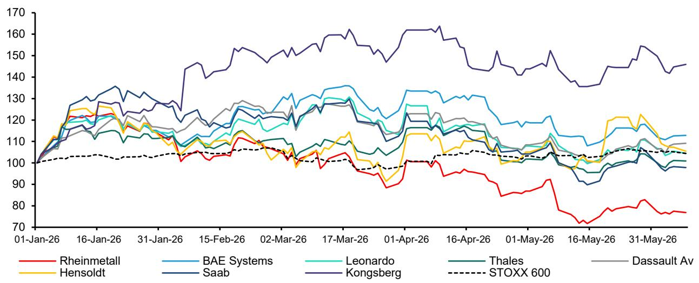

line chart

| Date       | Rheinmetall | BAE Systems | Leonardo | Thales | Dassault Av | Hensoldt | Saab | Kongsberg | STOXX 600 |
|------------|-------------|-------------|----------|--------|-------------|----------|------|-----------|-----------|
| 01-Jan-26  | 100         | 100         | 100      | 100    | 100         | 100      | 100  | 100       | 100       |
| 16-Jan-26  | 120         | 125         | 120      | 115    | 120         | 125      | 135  | 130       | 105       |
| 31-Jan-26  | 115         | 120         | 115      | 110    | 115         | 120      | 130  | 145       | 105       |
| 15-Feb-26  | 105         | 115         | 110      | 105    | 110         | 115      | 125  | 150       | 105       |
| 02-Mar-26  | 100         | 125         | 120      | 110    | 120         | 125      | 130  | 145       | 105       |
| 17-Mar-26  | 95          | 130         | 125      | 115    | 125         | 130      | 135  | 160       | 105       |
| 01-Apr-26  | 90          | 135         | 130      | 120    | 130         | 135      | 140  | 165       | 105       |
| 16-Apr-26  | 85          | 130         | 125      | 115    | 125         | 130      | 135  | 160       | 105       |
| 01-May-26  | 80          | 125         | 120      | 110    | 120         | 125      | 130  | 155       | 105       |
| 16-May-26  | 75          | 120         | 115      | 105    | 115         | 120      | 125  | 145       | 105       |
| 31-May-26  | 70          | 115         | 110      | 100    | 110         | 115      | 120  | 140       | 105       |

Source: Bloomberg, Bernstein analysis

EXHIBIT 2: ... But valuations are only back to the levels of January 2026  
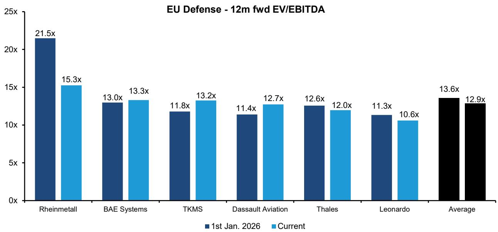

bar chart

EU Defense - 12m fwd EV/EBITDA
| Company | 1st Jan. 2026 (x) | Current (x) |
| :--- | :--- | :--- |
| Rheinmetall | 21.5 | 15.3 |
| BAE Systems | 13.0 | 13.3 |
| TKMS | 11.8 | 13.2 |
| Dassault Aviation | 11.4 | 12.7 |
| Thales | 12.6 | 12.0 |
| Leonardo | 11.3 | 10.6 |
| Average | 13.6 | 12.9 |

Source: Bloomberg, Berntein analysis

EXHIBIT 3: Rheinmetall should significantly outgrow peers until 2030  
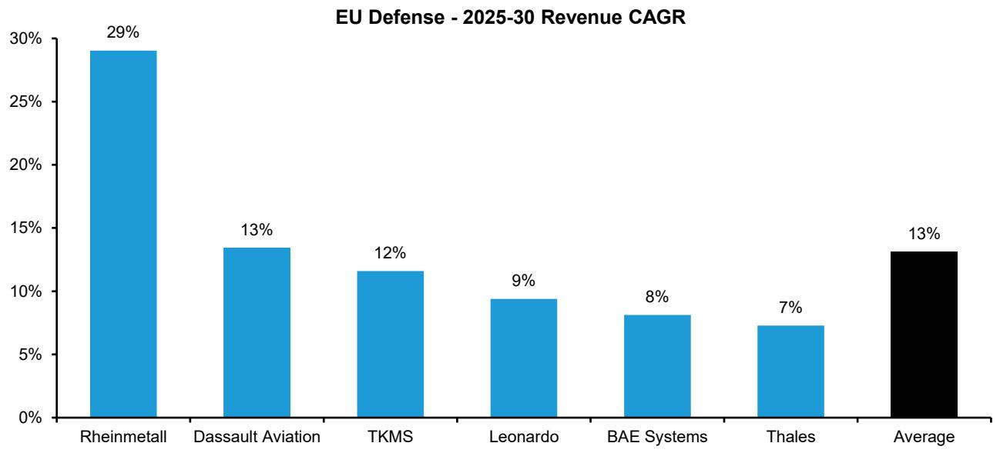

bar chart

EU Defense - 2025-30 Revenue CAGR
| Company | CAGR (%) |
| :--- | :--- |
| Rheinmetall | 29 |
| Dassault Aviation | 13 |
| TKMS | 12 |
| Leonardo | 9 |
| BAE Systems | 8 |
| Thales | 7 |
| Average | 13 |

Source: Bernstein analysis and estimates

We believe long-term performance for European Defense stocks will be driven by the geographical and segment exposure. We look for fundamental reassurance on the prospects, across key geographies.

## UNITED STATES

US stocks down despite the environment. The broad sector rotation out of Global A&D has impacted US defense primes too. Prior to the start of the Iran war, defense stocks were near peak historical valuations. While we see the fundamentals as solid for defense, it appears to have become less attractive at these levels when investors are seeking higher top line growth opportunities. We do not see any significant issues with specific US defense stocks. But, we also do not see a near-term catalyst that will take these stocks higher, despite the lower valuations.

A strong 2027 budget. The 2027 budget proposal of \$1.45tn, combining discretionary appropriations and reconciliation funding, is a record increase. We do not expect such a budget to make it through Congress, although we do expect upside. This view is consistent with perspectives we heard from defense CEOs at our Strategic Decisions Conference last week. Even if only the base budget request makes it through (i.e., no reconciliation), there would still likely be strong upside from a budget standpoint. And the base budget tends to be resilient, which should bring visibility over the coming years.

Space, missiles and air defense systems remain the key categories. We continue to see exposure to space, missiles, and missile defense as particularly attractive. Autonomous systems and counter-UAS are also critical emerging areas for demand. The large primes all have programs related to these emerging areas. But, these types of programs are being aggressively pursued by many new entrants (e.g., Anduril, Shield Al, Saronic (all private)). There will be a competitive shakeout over time.

Few European companies have sizable exposure to the US. BAE Systems should be the key beneficiary. The company might not be among the best positioned for space, missiles and air defense (or golden dome) but will largely benefit from the growing budgets. BAE Systems derives close to half of its sales from the US. Leonardo is also exposed (close to a quarter of sales), mostly through the DRS stake. The other European companies have limited exposure to the US budget.

EXHIBIT 4: Some European Defense companies have large exposure to the US market  
EU Defense Revenue Exposure to US (excluding civil sales when possible), 2024  
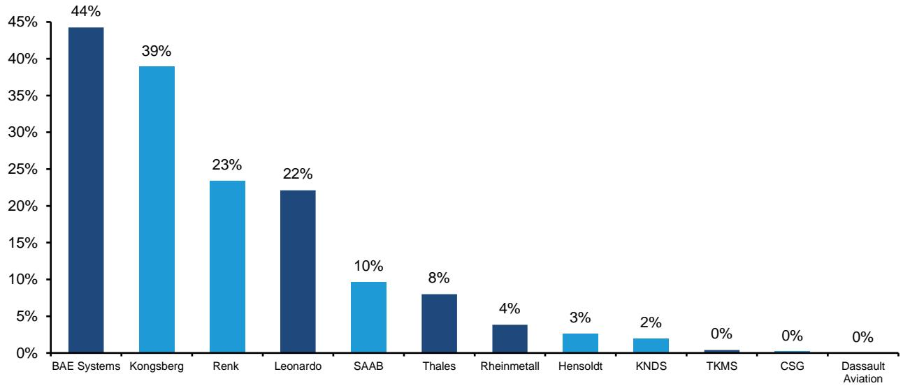

bar chart

| Company | Percentage (%) |
| :--- | :--- |
| BAE Systems | 44 |
| Kongsberg | 39 |
| Renk | 23 |
| Leonardo | 22 |
| SAAB | 10 |
| Thales | 8 |
| Rheinmetall | 4 |
| Hensoldt | 3 |
| KNDS | 2 |
| TKMS | 0 |
| CSG | 0 |
| Dassault Aviation | 0 |

\* BAE Systems US revenue is at group level; Kongsberg North America revenue is for the Defense & Aerospace division; Renk America revenue is at group level; Leonardo US revenue is at group level excluding Aerostructure; SAAB North America revenue is at group level; Thales North America revenue is only for the Defense division; Rheinmetall revenues encompass North-, Middle- and South-America excluding Power Systems; Hensoldt North America revenue is at group level; KNDS Americas revenue is at group level; TKMS FY24 data is from the Marine System division from Thyssenkrupp before the spin-off; CSG US revenue is for the Defense division  
Source: Company reports, Bernstein analysis and estimates

EXHIBIT 5: Total Defense Budget (\$bn)  
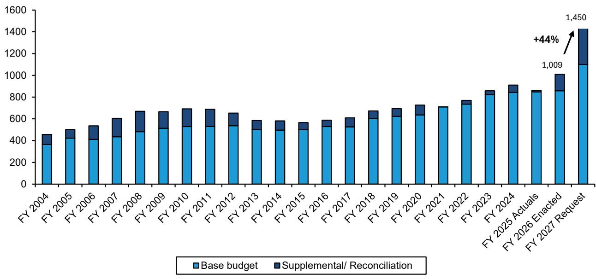

stacked bar chart

| Fiscal Year | Base budget | Supplemental/ Reconciliation |
| :--- | :--- | :--- |
| FY 2004 | 350 | 100 |
| FY 2005 | 410 | 80 |
| FY 2006 | 400 | 120 |
| FY 2007 | 420 | 180 |
| FY 2008 | 470 | 220 |
| FY 2009 | 500 | 180 |
| FY 2010 | 520 | 210 |
| FY 2011 | 520 | 210 |
| FY 2012 | 530 | 160 |
| FY 2013 | 490 | 110 |
| FY 2014 | 480 | 110 |
| FY 2015 | 490 | 80 |
| FY 2016 | 520 | 90 |
| FY 2017 | 530 | 110 |
| FY 2018 | 590 | 110 |
| FY 2019 | 610 | 130 |
| FY 2020 | 630 | 150 |
| FY 2021 | 710 | 130 |
| FY 2022 | 750 | 80 |
| FY 2023 | 840 | 60 |
| FY 2024 | 860 | 90 |
| FY 2025 Actuals | 850 | - |
| FY 2026 Enacted | 850 | 160 |
| FY 2027 Request | 1100 | 380 |
+44% indicates a +44% increase in the final period. The chart displays a stacked bar format with two segments: “Base budget” (blue) and “Supplemental/Reconciliation” (dark blue).

Source: DoW, the Congress, Bernstein analysis

EXHIBIT 6: Total Inv Account (RDT&E + Procurement) Budget (\$bn)  
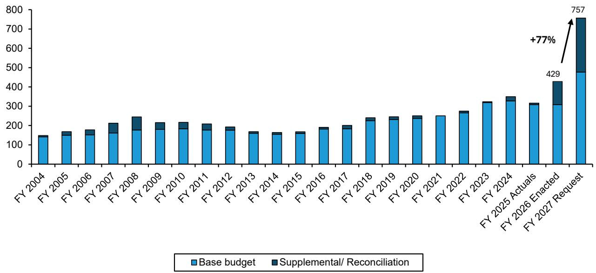

stacked bar chart

| Fiscal Year | Base budget | Supplemental/ Reconciliation |
| :--- | :--- | :--- |
| FY 2004 | 145 | 0 |
| FY 2005 | 155 | 30 |
| FY 2006 | 155 | 30 |
| FY 2007 | 160 | 50 |
| FY 2008 | 175 | 70 |
| FY 2009 | 180 | 30 |
| FY 2010 | 180 | 30 |
| FY 2011 | 180 | 30 |
| FY 2012 | 185 | 20 |
| FY 2013 | 165 | 0 |
| FY 2014 | 155 | 0 |
| FY 2015 | 160 | 0 |
| FY 2016 | 180 | 0 |
| FY 2017 | 195 | 10 |
| FY 2018 | 235 | 0 |
| FY 2019 | 240 | 10 |
| FY 2020 | 245 | 15 |
| FY 2021 | 250 | 15 |
| FY 2022 | 270 | 0 |
| FY 2023 | 325 | 0 |
| FY 2024 | 345 | 30 |
| FY 2025 Actuals | 315 | 15 |
| FY 2026 Enacted | 305 | 135 |
| FY 2027 Request | 475 | 337 |
+77%

Source: DoW, the Congress, Bernstein analysis

## GERMANY

Germany is now the largest market in Europe. Germany accounts for 17% of Europe's 2025 military budget (ex. Russia). It has become the 4 $^{th}$ largest country globally. Germany has been the most vocal on its ambition to re-arm and expects to spend 3.7% of GDP in defense by the end of the decade (vs. 2.2% of GDP in 2025). The special fund to accelerate spending. In 2022, Germany approved the creation of a €100bn special fund dedicated to defense (separate from the 2025 “German bazooka” of 500bn). The fund is aimed at financing equipment projects for the Herman Armed Forces. As of 2026, €73bn of the €100bn was spent.

Europe's sweet spot. Since 2022, the German budget doubled to just over €100bn. We expect it to grow to €180bn by 2030. This implies a +12% CAGR for the German budget. The opportunity should be amplified by higher spending on equipment (vs. personnel and infrastructure), driving a +21% CAGR for the addressable market until 2030.

Local champions, US and Israel as key beneficiaries. Despite being vocal about the need to repatriate spending in Europe, Germany tends to allocate the budgets to local champions and a few large global players, almost only from the US and Israel. We do not expect this allocation to change much. Hence, we believe the German defense companies will capture most of the opportunity. Especially players who have large scale in domestic markets, as Germany benefits from strong capabilities in some segments (ammunition, land vehicles, naval...) but outsources some of the most advanced weapons (combat aircraft, missiles, air defense systems...). Rheinmetall should be the main beneficiary.

EXHIBIT 7: Germany is the largest Defense market in Europe ex. Russia  
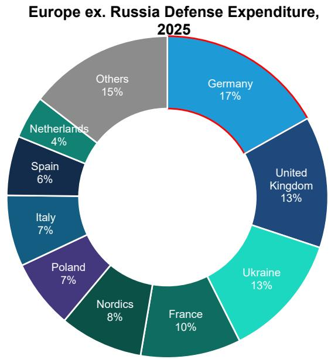

donut chart

| Country/Region | Percentage |
| -------------- | ---------- |
| Germany        | 17%        |
| United Kingdom | 13%        |
| Ukraine        | 13%        |
| France         | 10%        |
| Nordics        | 8%         |
| Italy          | 7%         |
| Poland         | 7%         |
| Spain          | 6%         |
| Netherlands    | 4%         |
| Others         | 15%        |

Source: SIPRI, Bernstein analysis

EXHIBIT 8: Air is the largest spending segment among equipment spending over 2022-26...  
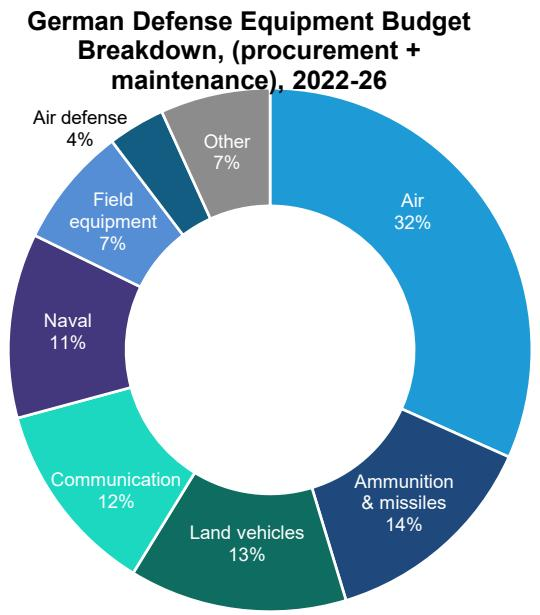

pie chart

German Defense Equipment Budget Breakdown, (procurement + maintenance), 2022-26
| Category | Budget (%) |
|---|---|
| Air | 32 |
| Ammunition & missiles | 14 |
| Land vehicles | 13 |
| Communication | 12 |
| Naval | 11 |
| Field equipment | 7 |
| Air defense | 4 |
| Other | 7 |

Source: Bundeshaushalt, Bernstein analysis

EXHIBIT 9: The German defense budget is expected to grow by 12% until 2030  
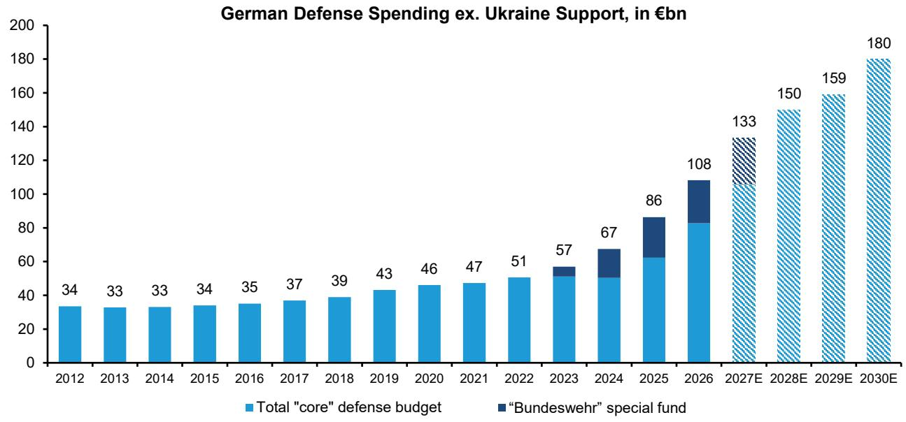

stacked bar chart

German Defense Spending ex. Ukraine Support, in €bn
| Year | Total "core" defense budget (€bn) | "Bundeswehr" special fund (€bn) |
| :--- | :--- | :--- |
| 2012 | 34 | 0 |
| 2013 | 33 | 0 |
| 2014 | 33 | 0 |
| 2015 | 34 | 0 |
| 2016 | 35 | 0 |
| 2017 | 37 | 0 |
| 2018 | 39 | 0 |
| 2019 | 43 | 0 |
| 2020 | 46 | 0 |
| 2021 | 47 | 0 |
| 2022 | 51 | 0 |
| 2023 | 57 | 5 |
| 2024 | 67 | 15 |
| 2025 | 86 | 25 |
| 2026 | 108 | 25 |
| 2027E | 133 | 45 |
| 2028E | 150 | 0 |
| 2029E | 159 | 0 |
| 2030E | 180 | 0 |

Source: Bundeshaushalt, Deutscher BundeswehrVerband (DBwV), Bernstein analysis

EXHIBIT 10: The German addressable market should grow at a +20.5% CAGR until 2030  
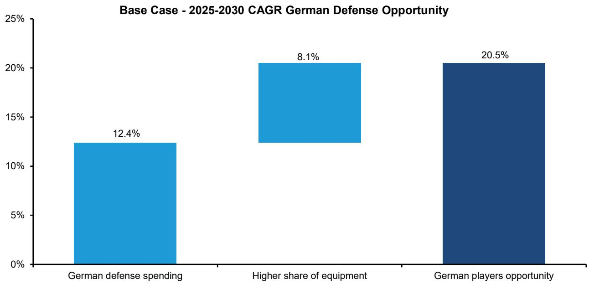

bar chart

Base Case - 2025-2030 CAGR German Defense Opportunity
| Category | Value (%) |
|---|---|
| German defense spending | 12.4 |
| Higher share of equipment | 8.1 |
| German players opportunity | 20.5 |

Source: NATO, Bernstein analysis and estimates

## FRANCE

France is a purely domestic market. France is the ninth-largest market globally and fourth-largest in Europe. However, France is almost entirely sovereign, and does not import weapons. The French Defense industry is also a major global exporter, second only to the US globally.

The French defense budget to grow at a +7% CAGR until 2030. France is re-arming at a slower pace than Germany, because of its softer fiscal power. To accelerate military spending towards the 3.5% of GDP target set by NATO, the French government created an updated 2024-30 defense budget, the LPM (Loi de Programmation Militaire or military planning act). The LPM adds €36bn of spending over 2026-30. Of the total €36bn, €9bn will be allocated to ammunition, €4bn to space, €3bn to combat aircraft, €3bn to transport aircraft, €2bn to drones, €2bn to land systems and €2bn to air defense. France is already allocating a large share of the budget to equipment (40%). We model the opportunity to grow at a +8% CAGR, to be captured by local players. Thales and Dassault Aviation are best positioned in our coverage.

EXHIBIT 11: France is the fourth-largest Defense market in Europe  
Europe ex. Russia Defense Expenditure, 2025  
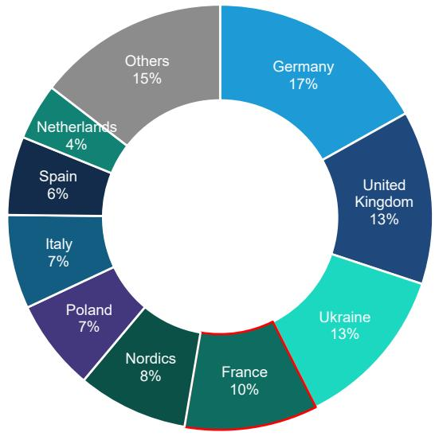

pie chart

| Country/Region | Percentage (%) |
| :--- | :--- |
| Germany | 17 |
| United Kingdom | 13 |
| Ukraine | 13 |
| France | 10 |
| Nordics | 8 |
| Poland | 7 |
| Italy | 7 |
| Spain | 6 |
| Netherlands | 4 |
| Others | 15 |

Source: SIPRI, Bernstein analysis

EXHIBIT 12: ...and the second-largest exporter in the world  
Arm Exports by Country of Origin, 2020-25  
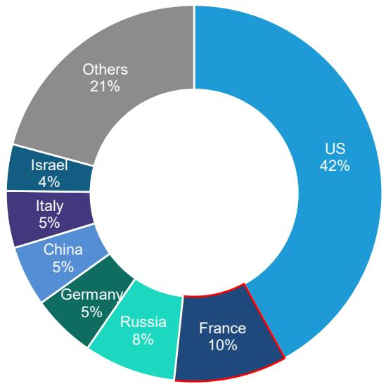

pie chart

| Country/Region | Percentage (%) |
| :--- | :--- |
| US | 42 |
| France | 10 |
| Russia | 8 |
| Germany | 5 |
| China | 5 |
| Italy | 5 |
| Israel | 4 |
| Others | 21 |

Source: SIPRI, Bernstein analysis

EXHIBIT 13: French defense spending is expected to grow by +7% annually until 2030  
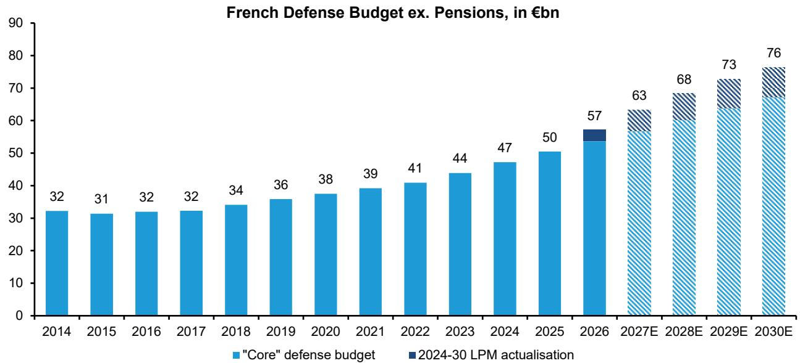

bar chart

| Year   | "Core" defense budget | 2024-30 LPM actualisation |
|--------|------------------------|----------------------------|
| 2014   | 32                     | -                          |
| 2015   | 31                     | -                          |
| 2016   | 32                     | -                          |
| 2017   | 32                     | -                          |
| 2018   | 34                     | -                          |
| 2019   | 36                     | -                          |
| 2020   | 38                     | -                          |
| 2021   | 39                     | -                          |
| 2022   | 41                     | -                          |
| 2023   | 44                     | -                          |
| 2024   | 47                     | -                          |
| 2025   | 50                     | -                          |
| 2026   | 57                     | (with a small segment)    |
| 2027E  | -                      | 63                         |
| 2028E  | -                      | 68                         |
| 2029E  | -                      | 73                         |
| 2030E  | -                      | 76                         |

Source: Sénat Francais, Bernstein analysis

EXHIBIT 14: The French addressable market is forecast to grow at an +8.4% CAGR until 2030  
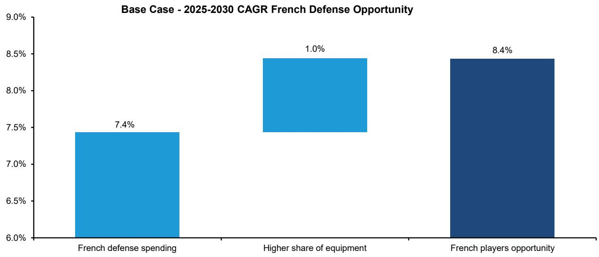

bar chart

Base Case - 2025-2030 CAGR French Defense Opportunity
| Category | CAGR (%) |
| :--- | :--- |
| French defense spending | 7.4 |
| Higher share of equipment | 1.0 |
| French players opportunity | 8.4 |

Source: NATO, Bernstein analysis and estimates

## UK

Slower growth in the UK. The United Kingdom's defense budgets are larger than France's. The country has committed to reaching $2.5\%$ of spending by 2027, and has indicated its intention to take the budgets to $3\%$ of GDP in the next parliament, depending on fiscal firepower. But, we only expect budgets to grow at a $+3\%$ CAGR until 2030, from current levels.

Imports are almost entirely American. The US accounts for the vast majority of UK imports, and are spread across many categories. In the country, the largest local player is BAE Systems and should maintain a dominant market share.

EXHIBIT 15: The UK defense budget should grow slowly from current levels  
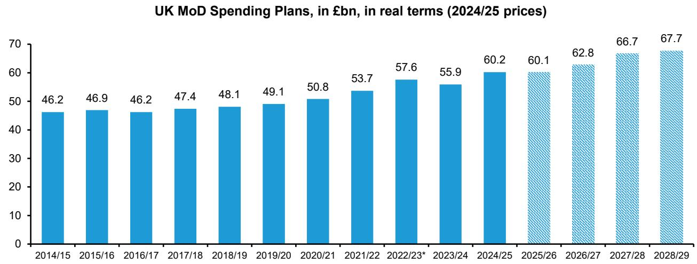

bar chart

UK MoD Spending Plans, in £bn, in real terms (2024/25 prices)
| Year | Spending Plan (£bn) |
| :--- | :--- |
| 2014/15 | 46.2 |
| 2015/16 | 46.9 |
| 2016/17 | 46.2 |
| 2017/18 | 47.4 |
| 2018/19 | 48.1 |
| 2019/20 | 49.1 |
| 2020/21 | 50.8 |
| 2021/22 | 53.7 |
| 2022/23* | 57.6 |
| 2023/24 | 55.9 |
| 2024/25 | 60.2 |
| 2025/26 | 60.1 |
| 2026/27 | 62.8 |
| 2027/28 | 66.7 |
| 2028/29 | 67.7 |

\*2022/23 spend includes around £3bn to finance the implementation of accounting standard IFRS 16 (a non-cash movement)
Source: UK Government, Bernstein analysis

## SAFE FUND

In 2025, the Council of the European Union adopted the SAFE (Security Action for Europe). The SAFE is a €150bn fund aimed at supporting the member states to speed up defense readiness via competitive long-maturity loans. The SAFE funds require that defense equipment component costs are at least 65% from the EU, EEA-EFTA or Ukraine.

Romania inaugurated the SAFE fund spending its €17bn envelope on 21 procurement projects amounting to €9.5bn, €4.2 for dual use infrastructure and €2.8bn for the Ministry of Internal Affairs.

EXHIBIT 16: Poland, Romania and Hungary benefit the most from the SAFE fund  
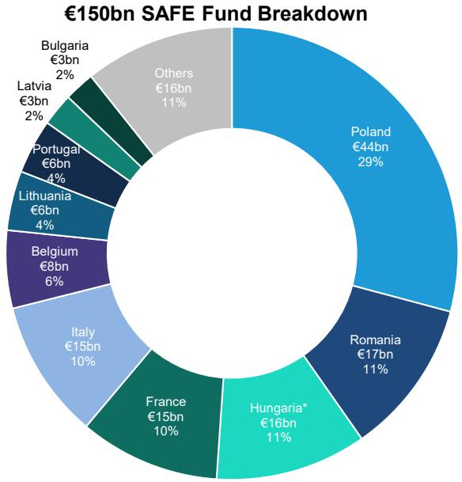

donut chart

| Country/Region | Value (€bn) | Percentage |
| -------------- | ----------- | ---------- |
| Poland         | 44          | 29%        |
| Romania        | 17          | 11%        |
| Hungary*       | 16          | 11%        |
| France         | 15          | 10%        |
| Italy          | 15          | 10%        |
| Belgium        | 8           | 6%         |
| Portugal       | 6           | 4%         |
| Lithuania      | 6           | 4%         |
| Latvia         | 3           | 2%         |
| Bulgaria       | 3           | 2%         |
| Others         | 16          | 11%        |

\*Currently under evaluation, tentative amounts as allocated in September 2025  
following the expression of interest.  
Source: European Comission, Bernstein analysis

## I. REQUIRED DISCLOSURES

References to "Bernstein" or the "Firm" in these disclosures relate to the following entities: Bernstein Institutional Services LLC (April 1, 2024 onwards), Bernstein & Co., LLC (pre April 1, 2024), Bernstein Autonomous LLP, BSG France S.A. (April 1, 2024 onwards), Bernstein (Hong Kong) Limited 盛博香港有限公司, Bernstein (Canada) Limited, Bernstein (India) Private Limited (SEBI registration no. INH000006378), Bernstein (Singapore) Private Limited, Bernstein Japan KK (サンフォード・C・バーンスタイン株式会社) and analysts employed by SG Africa Technologies & Services to produce Bernstein under a Global Services Agreement in place between Bernstein and SG.

Bernstein is part of a joint venture between SG (SG) and AllianceBernstein, L.P. (AB). Unless specifically noted otherwise, for purposes of these disclosures, references to Bernstein's “affiliates” relate to both SG and AB and their respective affiliates.

## VALUATION METHODOLOGY

## Rheinmetall AG

To value Rheinmetall, we estimate its EBITDA 5 years in the future, and apply an EV/EBITDA method, based on assumed multiples relative to the market multiple and a premium to reflect its competitive positioning. We adjust for net debt to arrive at an equity value, discounted, and add the discounted value of cash distributions to shareholders, to reach our 12-month target. For Rheinmetall, we use an absolute EV/discounted 2029 EBITDA multiple of 13.7x to get to our price target of €1,900.

## Thales SA

To value Thales, we estimate its enterprise value 4 years in the future, and apply an EV/EBITDA method, based on assumed multiples relative to the market multiple. We adjust for net debt to arrive at an equity value, discount that to our valuation date, and add the discounted value of cash distributions to shareholders between now and the terminal date, to reach our 12-month targets. For Thales, we use an absolute EV/EBITDA multiple of 13x to get to our price target of €260.

## Dassault Aviation SA

To value Dassault Aviation, we estimate its enterprise value 4 years in the future, and apply an EV/EBITDA method, based on assumed multiples relative to the market multiple. We adjust for net debt to arrive at an equity value, discount that to our valuation date, and add the discounted value of cash distributions to shareholders between now and the terminal date, to reach our 12-month targets. For Dassault Aviation, we use an absolute EV/EBITDA multiple of 10.3x. We separately value Dassault's 25% stake in Thales through a dividend discount model, with a terminal growth rate of 6% assumed beyond our modeling horizon. We also remove an estimate of over-financing in the computation of Dassault's net cash position. All this gets to our price target of €330.

## BAE Systems PLC

To value BAE Systems, we estimate its enterprise value 4 years in the future, and apply an EV/EBITDA method, based on assumed multiples relative to the market multiple. We adjust for net debt to arrive at an equity value, discount that to our valuation date, and add the discounted value of cash distributions to shareholders between now and the terminal date, to reach our 12-month targets. For BAE Systems, we use an absolute EV/EBITDA multiple of 13x to get to our price target of £20.50.

## TKMS

To value TKMS, we estimate its EBITDA 5 years in the future, and apply an EV/EBITDA method, based on assumed multiples relative to the market multiple and a premium to reflect its competitive positioning. We adjust for net debt, minorities and provisions to arrive at an equity value, discounted, and add the discounted value of cash distributions to shareholders, to reach our 12-month target. For TKMS, we use an absolute EV/EBITDA multiple of 11.1x to get to our price target of €76.

## Leonardo SpA

To value Leonardo, we estimate its enterprise value 4 years in the future, and apply an EV/EBITDA method, based on assumed multiples relative to the market multiple. We adjust for net debt to arrive at an equity value, discount that to our valuation date, and add the discounted value of cash distributions to shareholders between now and the terminal date, to reach our 12-month targets. For Leonardo, we use an absolute EV/EBITDA multiple of 11.7x to get to our price target of €65.

## RISKS

## Rheinmetall AG

## Downside risks:

1. Potential cease-fire of Ukraine  
2. Additional capacity in ammunition and ground vehicles comes to the market while demand shifts to long-cycle products  
3. Execution risk as Rheinmetall shifts to a long-cycle portfolio

## Thales SA

## Downside risks:

1. Uncertainty in French defense budgets.  
2. Slower recovery for commercial telecom satellites.  
3. Prolonged Cyber weakness.

## Dassault Aviation SA

## Upside risks:

1. Continued order intake for Rafale program.  
2. Falcon gradual improvement.  
3. Margin improvement as Falcon 6X program matures.

## Downside risks:

1. FCAS project uncertainty.  
2. Softening of business jet demand, inability to ramp up Falcon deliveries due to supply chain challenges.  
3. Higher than expected self-funded R&D investment.

## BAE Systems PLC

## Upside risks:

1. More favorable US environment and budgets.  
2. Increased UK defense budgets.  
3. Order intake boosted by superior portfolio outside the UK.

## Downside risks:

1. Negative changes in US, UK, and/or international defense funding levels due to political and fiscal challenges.  
2. Negative sentiment on the European defense group, including BAE Systems, if the conflict in Ukraine subsides.  
3. Challenges on program execution could hold back growth, margins, and/or cash flow.

## TKMS

## Upside risks:

1. Better profitability in key divisions. We see the risk of a positive surprise regarding the divisional profitability, which could highlight the turn around in a business that has been penalized by weak underlying fundamentals historically.  
2. Invasion of Ukraine continues and the focus on European defense increases. TKMS should be among the most resilient, given the long cycle nature of the naval business and a significant order backlog.  
3. Ongoing technical support for a rare European, long-cycle pure play within European defense.

## Downside risks:

1. Further charges linked to legacy contracts which remain for longer.  
2. F127 and F126 contracts not awarded to TKMS.  
3. Poor operational execution slowing down the turnaround.

## Leonardo SpA

## Downside risks:

1. Program execution challenges, as well as negative changes in US, European, and international defense funding levels.  
2. Inability to realize the financial targets out to 2028.  
3. Large transformations that involve expensive acquisitions.

## RATINGS DEFINITIONS, BENCHMARKS AND DISTRIBUTION

## EQUITY RATINGS DEFINITIONS

## Bernstein brand

The Bernstein brand rates stocks based on forecasts of relative performance for the next 12 months versus the S&P 500 for stocks listed on the U.S. and Canadian exchanges, versus the Bloomberg Europe Developed Markets Large and Mid Cap Price Return Index EUR (EDME) for stocks listed on the European exchanges and emerging markets exchanges outside of the Asia Pacific region, versus the Bloomberg Japan Large and Mid Cap Price Return Index USD (JPL) for stocks listed on the Japanese exchanges, and versus the Bloomberg Asia ex-Japan Large and Mid Cap Price Return Index (ASIAX) for stocks listed on the Asian (ex-Japan) exchanges -unless otherwise specified.

The Bernstein brand has three categories of ratings:

- Outperform: Stock will outpace the market index by more than 15 pp  
• Market-Perform: Stock will perform in line with the market index to within +/-15 pp  
• Underperform: Stock will trail the performance of the market index by more than 15 pp

Coverage Suspended: Coverage of a company under the Bernstein brand has been suspended. Ratings and price targets are suspended temporarily, are no longer current, and should therefore not be relied upon.

Not Rated: A rating assigned when the stock cannot be accurately valued, or the performance of the company accurately predicted, at the present time. The covering analyst may continue to publish research reports on the company to update investors on events and developments.

Not Covered (NC) denotes companies that are not under coverage.

Bernstein brand stock ratings are based on a 12-month time horizon.

## Autonomous brand – common stocks

The Autonomous brand rates common stocks as indicated below. As our benchmarks we use the Bloomberg Europe 500 Banks And Financial Services Index (BEBANKS) and Bloomberg Europe Dev Mkt Financials Large and Mid Cap Price Ret Index EUR (EDMFI) index for developed European banks and Payments, the Bloomberg Europe 500 Insurance Index (BEINSUR) for European insurers, the S&P 500 and S&P Financials for US banks and Payments coverage, S5LIFE for US Insurance, the S&P Insurance Select Industry (SPSIINS) for US Non-Life Insurers coverage, and the Bloomberg Emerging Markets Financials Large, Mid and Small Cap Price Return Index (EMLSF) for emerging market banks and insurers and Payments. Ratings are stated relative to the sector (not the market).

The Autonomous brand has three categories of common stock ratings:

- Outperform (OP): Stock will outpace the relevant index by more than 10 pp  
- Neutral (N): Stock will perform in line with the market index to within +/-10 pp  
• Underperform (UP): Stock will trail the performance of the relevant index by more than 10 pp

Coverage Suspended: Coverage of a company under the Autonomous research brand has been suspended. Ratings and price targets are suspended temporarily, are no longer current, and should therefore not be relied upon.

Not Rated: A rating assigned when the stock cannot be accurately valued, or the performance of the company accurately predicted, at the present time. The covering analyst may continue to publish research reports on the company to update investors on events and developments.

Those denoted as ‘Feature’ (e.g., Feature Outperform FOP, Feature Under Outperform FUP) are our core ideas.

Not Covered (NC) denotes companies that are not under coverage.

Autonomous brand common stock ratings are based on a 12-month time horizon.

## Autonomous brand – preferred stocks

The Autonomous brand has three categories of preferred stock ratings:

- Outperform (OP): The total return of the preferred instrument is expected to outperform preferred securities of other issuers operating in similar sectors or rating categories over the next six months.  
- Neutral (N): The total return of the preferred instrument is expected to perform in line with preferred securities of other issuers operating in similar sectors or rating categories over the next six months.  
- Underperform (UP): The total return of the preferred instrument is expected to underperform preferred securities of other issuers operating in similar sectors or rating categories over the next six months.

Autonomous preferred stock ratings are based on a 6-month time horizon.

## AUTONOMOUS CREDIT RESEARCH

Where this report contains investment recommendations for credit instruments, as defined in article 3(1)(35) of the Market Abuse Regulation, the information below is presented to comply with its disclosure requirements.

The report may also include reference(s) to published opinions by other Autonomous or Bernstein analysts covering the equity securities of the issuer(s) referenced herein. Please note an investment recommendation for credit instruments published by the author(s) of this report may differ from the published view of the analyst covering equity securities for the issuer(s) contained in this report and vice versa.

## CREDIT RATINGS DEFINITIONS

The Autonomous brand has three categories of credit ratings:

\- Credit Outperform (C-OP): The total return of the Reference Credit Instrument is expected to outperform the credit spread of bonds of other issuers operating in similar sectors or rating categories over the next six months.

- Credit Neutral (C-N): The total return of the Reference Credit Instrument is expected to perform in line with the credit spread of bonds of other issuers operating in similar sectors or rating categories over the next six months.  
- Credit Underperform (C-UP): The total return of the Reference Credit Instrument is expected to underperform the credit spread of bonds of other issuers operating in similar sectors or rating categories over the next six months.

Autonomous credit ratings are based on a 6-month time horizon.

A list of all investment recommendations produced by the author(s) of this report alongside credit ratings history are available upon request.

It is at the sole discretion of the Firm as to when to initiate, update and cease research coverage. The Firm has established, maintains and relies on information barriers to control the flow of information contained in one or more areas (i.e. the private side) within the Firm, and into other areas, units, groups or affiliates (i.e. public side) of the Firm

DISTRIBUTION OF EQUITY RATINGS/INVESTMENT BANKING SERVICES

<table><tr><td>Equity Rating</td><td>Market Abuse Regulation (MAR) and FINRA Rating Category</td><td>Global Rating Distribution</td><td>Investment Banking Relationships*</td></tr><tr><td>Outperform</td><td>BUY</td><td>51.1%</td><td>16.5%</td></tr><tr><td>Market-Perform (Bernstein Brand) Neutral (Autonomous Brand)</td><td>HOLD</td><td>36.3%</td><td>17.8%</td></tr><tr><td>Underperform</td><td>SELL</td><td>12.6%</td><td>14.9%</td></tr></table>

\* These figures represent the percentage of companies within each equity rating category for which affiliates of Bernstein have provided investment banking services within the previous 12 months.
As of March 31, 2026. All figures are updated quarterly.

## PRICE CHARTS / RATINGS AND PRICE TARGET HISTORY

Rheinmetall AG (RHM.GY) Rating History for Bernstein as of 06/08/2026  
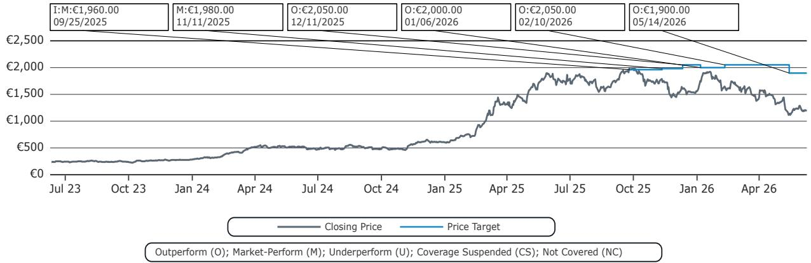

line chart

| Date       | Closing Price | Price Target |
| ---------- | ------------- | ------------ |
| 09/25/2025 | €1,960.00     | -            |
| 11/11/2025 | -             | €1,980.00    |
| 12/11/2025 | -             | €2,050.00    |
| 01/06/2026 | -             | €2,000.00    |
| 02/10/2026 | -             | €2,050.00    |
| 05/14/2026 | -             | €1,900.00    |

Thales SA (HO.FP) Rating History for Bernstein as of 06/08/2026  

line chart

| Date       | Closing Price | Price Target |
|------------|---------------|--------------|
| 03/08/2024 | €160.00       | -            |
| 04/09/2024 | €170.00       | -            |
| 07/26/2024 | €162.00       | -            |
| 10/24/2024 | €170.00       | -            |
| 11/18/2024 | €173.00       | -            |
| 03/18/2025 | €240.00       | -            |
| 04/25/2025 | €247.00       | -            |
| 07/25/2025 | €257.00       | -            |
| 10/23/2025 | €259.00       | -            |
| 01/06/2026 | €275.00       | -            |
| 03/03/2026 | €285.00       | -            |
| 05/14/2026 | €260.00       | -            |

Dassault Aviation SA (AM.FP) Rating History for Bernstein as of 06/08/2026  

line chart

| Date       | Closing Price | Price Target |
| ---------- | ------------- | ------------ |
| 11/08/2023 | €220.00       | €220.00      |
| 01/29/2024 | €215.00       | €215.00      |
| 04/09/2024 | €240.00       | €240.00      |
| 07/02/2024 | €230.00       | €230.00      |
| 07/24/2024 | €225.00       | €225.00      |
| 11/22/2024 | €230.00       | €230.00      |
| 03/18/2025 | €305.00       | €305.00      |
| 07/23/2025 | €319.00       | €319.00      |
| 01/06/2026 | €310.00       | €310.00      |
| 01/07/2026 | €330.00       | €330.00      |
| 05/14/2026 | €340.00       | €340.00      |
| 06/02/2026 | €330.00       | €330.00      |

BAE Systems PLC (BA/.LN) Rating History for Bernstein as of 06/08/2026  

line chart

| Date       | Closing Price | Price Target |
| ---------- | ------------- | ------------ |
| 01/09/2024 | 1,350.00p     | 1,350.00p    |
| 02/06/2024 | 1,400.00p     | 1,400.00p    |
| 02/28/2024 | 1,450.00p     | 1,450.00p    |
| 04/09/2024 | 1,500.00p     | 1,500.00p    |
| 09/12/2024 | 1,550.00p     | 1,550.00p    |
| 03/18/2025 | 1,890.00p     | 1,890.00p    |
| 07/03/2025 | 2,100.00p     | 2,100.00p    |
| 07/31/2025 | 2,250.00p     | 2,250.00p    |
| 01/06/2026 | 1,950.00p     | 1,950.00p    |
| 02/18/2026 | 2,200.00p     | 2,200.00p    |
| 05/14/2026 | 2,050.00p     | 2,050.00p    |

TKMS (TKMS.GY) Rating History for Bernstein as of 06/08/2026  
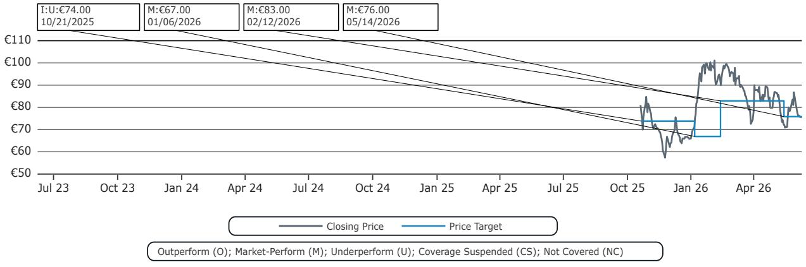

line chart

| Date       | Closing Price | Price Target |
| ---------- | ------------- | ------------ |
| 10/21/2025 | €74.00        | -            |
| 01/06/2026 | -             | €67.00       |
| 02/12/2026 | -             | €83.00       |
| 05/14/2026 | -             | €76.00       |

Leonardo SpA (LDO.IM) Rating History for Bernstein as of 06/08/2026  
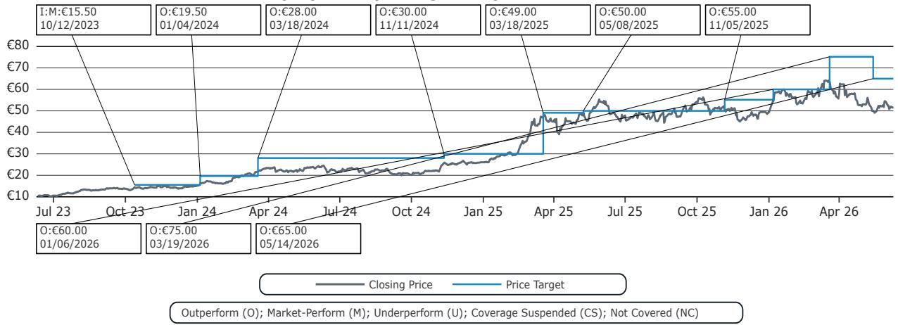

line chart

| Date       | Closing Price | Price Target |
| ---------- | ------------- | ------------ |
| 10/12/2023 | €15.50        | -            |
| 01/04/2024 | €19.50        | -            |
| 03/18/2024 | €28.00        | -            |
| 11/11/2024 | €30.00        | -            |
| 03/18/2025 | €49.00        | -            |
| 05/08/2025 | €50.00        | -            |
| 11/05/2025 | €55.00        | -            |
| 01/06/2026 | €60.00        | -            |
| 03/19/2026 | €75.00        | -            |
| 05/14/2026 | €65.00        | -            |

All price target and closing price data in the chart(s) above are denominated in the currency noted in the Ticker Table of this report.

## CONFLICTS OF INTEREST

SG and/or an affiliate acted as Joint Bookrunner in Rheinmetall AG bond issuance (EUR 500mn 5-year (WNG))

SG and/or its affiliates beneficially own 1% or more of a class of common equity securities of the following companies: Rheinmetall AG and Leonardo SpA.

Bernstein Autonomous LLP or BSG France SA, beneficially, has either a net long or short position of 0.5% or more of the total issued share capital of a class of common equity securities of the following MiFID eligible securities: BAE Systems PLC.

Bernstein and/or affiliates have received compensation for investment banking services in the past twelve months from Rheinmetall AG.

Bernstein and/or affiliates have received compensation for non-investment banking securities-related products or services in the previous twelve months from the following clients: Thales SA, Dassault Aviation SA, BAE Systems PLC, TKMS and Leonardo SpA.

Bernstein has received compensation for non-investment banking securities-related products or services in the previous twelve months from the following clients: BAE Systems PLC.

Bernstein and/or affiliates expect to receive or intend to seek compensation for investment banking services in the next three months from Rheinmetall AG and Thales SA.

Bernstein and/or affiliates had an investment banking client relationship during the past twelve months with Rheinmetall AG and Thales SA.

Affiliates of Bernstein managed or co-managed in the past twelve months a public offering of securities of Rheinmetall AG.

Certain affiliates of Bernstein act as market maker or liquidity provider in the equities securities of: Thales SA, Dassault Aviation SA, BAE Systems PLC and Leonardo SpA.

Certain affiliates of Bernstein act as market maker or liquidity provider in the debt securities of: Thales SA, Dassault Aviation SA and BAE Systems PLC.

## OTHER MATTERS

The legal entity(ies) employing the analyst(s) listed in this report, and their location, can be determined by the country code of their phone number, as follows:

+1 Bernstein Institutional Services LLC; New York, New York, USA

+44 Bernstein Autonomous LLP; London UK

+212 SG Africa Technologies & Services; Casablanca, Morocco

+33 BSG France S.A.; Paris, France

+34 BSG France S.A.; Madrid, Spain

+41 Bernstein Autonomous LLP; Geneva, Switzerland

+49 BSG France S.A.; Frankfurt, Germany

+91 Bernstein (India) Private Limited; Mumbai, India

+852 Bernstein (Hong Kong) Limited 盛博香港有限公司; Hong Kong, China

+65 Bernstein (Singapore) Private Limited; Singapore

+81 Bernstein Japan KK; Tokyo, Japan

Where this report has been prepared by research analyst(s) employed by a non-US affiliate, such analyst(s), is/are (unless otherwise expressly noted below) not registered as associated persons of Bernstein Institutional Services LLC or any other SEC-registered broker-dealer and are not licensed or qualified as research analysts with FINRA. Accordingly, such analyst(s) may not be subject to FINRA's restrictions regarding (among other things) communications by research analysts with a subject company, interactions between research analysts and investment banking personnel, participation by research analysts in solicitation and marketing activities relating to investment banking transactions, public appearances by research analysts, and trading securities held by a research analyst account.

Where this report has been prepared by research analyst(s) employed by SG Africa Technologies & Services (part of the SG group of companies), it has been prepared on behalf of a Bernstein company under a Global Services Agreement in place between Bernstein and SG.

## CERTIFICATION

Each research analyst listed in this report, who is primarily responsible for the preparation of the content of this report, certifies that all of the views expressed in this publication accurately reflect that analyst's personal views about any and all of the subject securities or issuers and that no part of that analyst's compensation was, is, or will be, directly or indirectly, related to the specific recommendations or views in this publication.

## II. ADDITIONAL GLOBAL CONFLICT DISCLOSURES

It is at the sole discretion of the Firm as to when to initiate, update and cease research coverage. The Firm has established, maintains and relies on information barriers to control the flow of information contained in one or more areas (i.e., the private side) within the Firm, and into other areas, units, groups or affiliates (i.e., public side) of the Firm.

## III. OTHER IMPORTANT INFORMATION AND DISCLOSURES

Separate branding is maintained for “Bernstein” and “Autonomous” research products.

- Bernstein produces a number of different types of research products including, among others, fundamental analysis and quantitative analysis under both the “Autonomous” and “Bernstein” brands. Recommendations contained within one type of research product may differ from recommendations contained within other types of research products, whether as a result of differing time horizons, methodologies or otherwise. Furthermore, views or recommendations within a research product issued under one brand may differ from views or recommendations under the same type of research product issued under the other brand. The Research Ratings System for the two brands and other information related to those Rating Systems are included in the previous section.  
- Autonomous operates as a separate business unit within the following entities: Bernstein Institutional Services LLC, Bernstein Autonomous LLP, Bernstein (Hong Kong) Limited 盛博香港有限公司 and Bernstein (India) Private Limited. For information relating to “Autonomous” branded products (including certain Sales materials) please visit: www.autonomous.com. For information relating to Bernstein branded products please visit: www.bernsteinresearch.com.

Analysts are compensated based on aggregate contributions to the research franchise as measured by account penetration, productivity and proactivity of investment ideas. No analysts are compensated based on performance in, or contributions to, generating investment banking revenues.

This report has been produced by an independent analyst as defined in Article 3 (1)(34)(i) of EU 596/2014 Market Abuse Regulation (“MAR”) and the same article of MAR as it forms part of United Kingdom domestic law by virtue of the European Union (Withdrawal) Act 2018.

To our readers in the United States: Bernstein Institutional Services LLC, a broker-dealer registered with the U.S. Securities and Exchange Commission (“SEC”) and a member of the U.S. Financial Industry Regulatory Authority, Inc. (“FINRA”) is distributing this publication in the United States and accepts responsibility for its contents. Where this material contains an analysis of debt product(s), such material is intended only for institutional investors and is not subject to the US independence and disclosure standards applicable to debt research prepared for retail investors.

Bernstein Institutional Services LLC may act as principal for its own account or as agent for another person (including an affiliate) in sales or purchases of any security which is a subject of this report. This report does not purport to meet the objectives or needs of any specific individuals, entities or accounts.

To our readers in Canada: If this publication pertains to a Canadian domiciled company, it is being distributed in Canada by Bernstein (Canada) Limited, which is licensed and regulated by the Canadian Investment Regulatory Organization. If the publication pertains to a non-Canadian domiciled company, it is being distributed by Bernstein Institutional Services LLC, which is licensed and regulated by both the SEC and FINRA, into Canada under the International Dealers Exemption.

This document may not be passed onto any person in Canada unless that person qualifies as "permitted client" as defined in Section 1.1 of NI 31-103.

To our readers in Brazil: This report has been prepared by Bernstein Institutional Services LLC, and Banco BTG Pactual S.A. ("BTG") is responsible for the distribution of this report in Brazil.

To readers in the United Kingdom: This publication has been issued or approved for issue in the United Kingdom by Bernstein Autonomous LLP, authorised and regulated by the Financial Conduct Authority and located at 60 London Wall, London EC2M 5SH, +44 (0)20-7170-5000. Registered in England & Wales No OC343985.

This document is for distribution only to persons who (i) have professional experience in matters relating to investments falling within Article 19(5) of the Financial Services and Markets Act 2000 (Financial Promotion) Order 2005 (as amended, the “Financial Promotion Order”), (ii) are persons falling within Article 49(2)(a) to (d) (“high net worth companies, unincorporated associations, etc.”) of the Financial Promotion Order, (iii) are outside the United Kingdom, or (iv) are persons to whom an invitation or inducement to engage in investment activity (within the meaning of section 21 of the FSMA) in connection with the issue or sale of any securities may otherwise lawfully be communicated or caused to be communicated (all such persons together being referred to as “relevant persons”). This document is directed only at relevant persons and must not be acted on or relied on by persons who are not relevant persons. Any investment or investment activity to which this document relates is available only to relevant persons and will be engaged in only with relevant persons.

To our readers in the member states of the EEA: This publication is being distributed by BSG France SA, which is authorised and regulated by the Autorité de Contrôle Prudentiel et de Résolution (ACPR) and Autorité des Marchés Financiers (AMF).

To our readers in Hong Kong: This publication is being distributed in Hong Kong by Bernstein (Hong Kong) Limited 盛博香港有限公司, which is licensed and regulated by the Hong Kong Securities and Futures Commission (Central Entity No. AXC846) to carry out Type 4 (Advising on Securities) regulated activities and subject to the licensing conditions mentioned in the SFC Public Register (https://www.sfc.hk/publicregWeb/corp/AXC846/details)). This publication is solely for professional investors, as defined in the Securities and Futures Ordinance (Cap. 571). The purpose of this report is solely to provide an analysis of the issuers referred to in this report and is not intended for any purpose contrary to the laws of Hong Kong.

To our readers in Singapore: This publication is being distributed in Singapore by Bernstein (Singapore) Private Limited, only to accredited investors or institutional investors, as defined in the Securities and Futures Act 2001 of Singapore ("SFA"). Recipients in Singapore should contact Bernstein (Singapore) Private Limited in respect of matters arising from, or in connection with, this publication. Bernstein (Singapore) Private Limited is regulated by the Monetary Authority of Singapore and licensed under the SFA as a capital markets services licence holder for dealing in capital markets products that are securities and collective investment schemes and an exempt financial adviser for advising on, issuing and promulgating analyses and reports on securities. Bernstein (Singapore) Private Limited is registered in Singapore with Company Registration No. 20213710W and located at One Raffles Quay, #27-11 South Tower, Singapore 048583, +65-6230-4612.

To our readers in the People's Republic of China: The securities referred to in this document are not being offered or sold and may not be offered or sold, directly or indirectly, in the People's Republic of China (for such purposes, not including the Hong Kong and Macau Special Administrative Regions or Taiwan, the "PRC") in contravention of any applicable laws of the PRC.

This document does not constitute an offer to sell or the solicitation of an offer to buy any securities in the PRC to any person to whom it is unlawful to make the offer or solicitation in the PRC.

We do not represent that this document may be lawfully distributed, or that any securities may be lawfully offered, in compliance with any applicable registration or other requirements in the PRC, or pursuant to an exemption available thereunder, or assume any responsibility for facilitating any such distribution or offering. In particular, no action has been taken by us which would permit a public offering of any securities or distribution of this document in the PRC. Accordingly, the securities are not being offered or sold within the PRC by means of this document or any other document. Neither this document nor any advertisement or other offering material may be distributed or published in the PRC, except under circumstances that will result in compliance with any applicable laws and regulations.

To our readers in Japan: This publication is being distributed in Japan by Bernstein Japan KK (サンフォード・C・バーンスタイン株式会社), which is registered in Japan as a Financial Instruments Business Operator with the Kanto Local Finance Bureau (registration number: The Director-General of Kanto Local Finance Bureau (FIBO) No.3387) and regulated by the Financial Services Agency. It is also a member of Japan Investment Advisers Association. This publication is solely for qualified institutional investors in Japan only, as defined in Article 2, paragraph (3), items (i) of the Financial Instruments and Exchange Act.

For the institutional client readers in Japan who have been granted access to the Bernstein website by Daiwa Group Inc. ("Daiwa"), your access to this document should not be construed as meaning that Bernstein is providing you with investment advice for any purposes. Whilst Bernstein has prepared this document, your relationship is, and will remain with, Daiwa, and Bernstein has neither any contractual relationship with you nor any obligations towards you.

To our readers in Australia: Bernstein (Hong Kong) Limited 盛博香港有限公司 is responsible for distributing research in Australia. It is regulated by the Securities and Exchange Commission under U.S. laws, by the Financial Conduct Authority under U.K. laws, which differs from Australian laws. Bernstein (Hong Kong) Limited 盛博香港有限公司 is exempt from the requirement to hold an Australian financial services license under the Corporations Act 2001 in respect of the provision of the following financial services to wholesale clients:

• providing financial product advice;  
• dealing in a financial product;  
• making a market for a financial product; and  
• providing a custodial or depository service.

To our readers in India: This publication is being distributed in India by Bernstein (India) Private Limited (SCB India) which is licensed and regulated by Securities and Exchange Board of India ("SEBI") as a research analyst entity under the SEBI (Research Analyst) Regulations, 2014, having registration no. INH000006378 and as a stock broker having registration no. INZ000213537. SCB India is currently engaged in the business of providing research and stock broking services. Please refer to

www.bernsteinresearch.in for more information.

\- SCB India is a Private limited company incorporated under the Companies Act, 2013, on April 12, 2017 bearing corporate identification number U65999MH2017FTC293762, and registered office at Level 3A, 4th Floor, First International Financial Centre, Plot Nos C-54 and C-55, G Block, Near CBI Office, Bandra Kurla Complex, Bandra (East), Mumbai 400098, Maharashtra, India (Phone No: +91-22-68421401).

\- For details of Associates (i.e., affiliates/group companies) of SCB India, kindly email MUM-BERNSTEIN-InCompliance@bernsteinsg.com.

• SCB India does not have any disciplinary history as on the date of this report.

\- Except as noted above, SCB India and/or its Associates (i.e., affiliates/group companies), the Research Analysts authoring this report, and their relatives

• do not have any financial interest in the subject company  
• do not have actual/beneficial ownership of one percent or more in securities of the subject company;  
- is not engaged in any investment banking activities for Indian companies, as such;

• have not managed or co-managed a public offering in the past twelve months for any Indian companies;

\- have not received any compensation for investment banking services or merchant banking services from the subject company in the past 12 months;

• have not received compensation for brokerage services from the subject company in the past twelve months;

\- have not received any compensation or other benefits from the subject company or third party related to the specific recommendations or views in this report; and

\- do not currently, but may in the future, act as a market maker in the financial instruments of the companies covered in the report.

\- do not have any conflict of interest in the subject company as of the date of this report.

\- Except as noted above, the subject company has not been a client of SCB India during twelve months preceding the date of distribution of this research report. Neither SCB India nor its Associates (i.e., affiliates/group companies) have received compensation for products or services other than investment banking, merchant banking or brokerage services from the subject company in the past twelve months.

\- The principal research analyst(s) who prepared this report, members of the analysts' team, and members of their households are not an officer, director, employee or advisory board member of the companies covered in the report.

\- Our Compliance officer / Grievance officer is Ms. Rupal Talati, who can be reached at +91-22-68421451, or MUM-BERNSTEIN-InCompliance@bernsteinsg.com / Scbin-investorgrievance@bernsteinsg.com

\- The Research investor charter and Terms & Conditions of SCB India are available on its website and may be accessed at Bernstein (India) Private Limited (https://bernsteinresearch.in/) for your reference.

\- Disclaimer: Registration granted by SEBI, and certification from NISM, is in no way a guarantee of performance of the intermediary or provide any assurance of returns to investors. Investments in securities market are subject to market risks. Read all the related documents carefully before investing.

To our readers in Switzerland: This document is provided in Switzerland by or through Bernstein Autonomous LLP, and is provided only to qualified investors as defined in article 10 of the Swiss Collective Investment Scheme Act (“CISA”) and related provisions of the Collective Investment Scheme Ordinance and in strict compliance with applicable Swiss law and regulations. The products mentioned in this document may not be suitable for all types of investors. This document is based on the Directives on the Independence of Financial Research issued by the Swiss Bankers Association (SBA) in January 2008.

To our readers in the Middle East: Bernstein Autonomous LLP, DIFC branch has its principal office at Gate Village 06, DIFC, Dubai, UAE. Bernstein Autonomous LLP, DIFC branch is regulated by the Dubai Financial Services Authority (DFSA) with the registration number CL10040 and is provisioned for Arranging Deals in Investments and Advising on Financial Products. All communications and services are directed at Professional Clients and Market Counterparties only (as defined in the DFSA rulebook). Persons other than Professional Clients and Market Counterparties, such as Retail Clients, are not the intended recipients of our communications or services.

## LEGAL

All research publications are disseminated to our clients through posting on the firm's password protected websites, bernsteinresearch.com and autonomous.com. Certain, but not all, research publications are also made available to clients through third-party vendors or redistributed to clients through alternate electronic means as a convenience.

This publication has been published and distributed in accordance with the Firm's policy for management of conflicts of interest in investment research, a copy of which is available from Bernstein Institutional Services LLC, Director of Compliance, 245 Park Avenue, New York, NY 10167. Additional disclosures and information regarding Bernstein's business are available on our website www.bernsteinresearch.com.

The securities described herein may not be eligible for sale in all jurisdictions or to certain categories of investors where that permission profile is not consistent with the licenses held by the entities noted herein. This document is for distribution only as may be permitted by law. This publication is not directed to, or intended for distribution to or use by, any person or entity who is a citizen or resident of, or located in any locality, state, country or other jurisdiction where such distribution, publication, availability or use would be contrary to law or regulation or which would subject any of the entities referenced herein or any of their subsidiaries or affiliates to any registration or licensing requirement within such jurisdiction. This publication is based upon public sources we believe to be reliable, but no representation is made by us that the publication is accurate or complete. We do not undertake to advise you of any change in the reported information or in the opinions herein. This publication was prepared and issued by entity referred to herein for distribution to eligible counterparties or professional clients. This publication is not an offer to buy or sell any security, and it does not constitute investment, legal or tax advice. The investments referred to herein may not be suitable for you. Investors must make their own investment decisions in consultation with their professional advisors in light of their specific circumstances. The value of investments may fluctuate, and investments that are denominated in foreign currencies may fluctuate in value as a result of exposure to exchange rate movements. Information about past performance of an investment is not necessarily a guide to, indicator of, or assurance of, future performance.

This report is directed to and intended only for our clients who are “eligible counterparties”, “professional clients”, “institutional investors” and/or “professional investors” as defined by the aforementioned regulators, and must not be redistributed to retail clients as defined by the aforementioned regulators. Retail clients who receive this report should note that the services of the entities noted herein are not available to them and should not rely on the material herein to make an investment decision. The result of such act will not hold the entities noted herein liable for any loss thus incurred as the entities noted herein are not registered/authorised/licensed to deal with retail clients and will not enter into any contractual agreement/arrangement with retail clients. This report is provided subject to the terms and conditions of any agreement that the clients may have entered into with the entities noted herein. All research reports are disseminated on a simultaneous basis to eligible clients through electronic publication to our client portal.

The information in this report was prepared by Bernstein solely for the internal business use of our clients. Clients may store, display, analyze, reformat and print the information in this report for this limited use only. Clients may not copy, alter, create derivative works, resell, reverse engineer, commercially exploit, share or distribute any part of the information contained herein for any purpose without Bernstein's express written consent. These restrictions include extracting data or using the content to develop indices or other products. Further, you may not use this report, or any portion of this report, to train or finetune any third-party machine learning or artificial intelligence system, or as a prompt or input into any such system. You also may not, without Bernstein's express written consent, do any of the foregoing in connection with your own internal machine learning or artificial intelligence system.

Bernstein may use artificial intelligence tools in the preparation of its materials. Any such materials are reviewed by Bernstein's research analysts prior to publication.

This report has been prepared for information purposes only and is based on current public information that we consider reliable, but the entities noted herein do not warrant or represent (express or implied) as to the sources of information or data contained herein are accurate, complete, not misleading or as to its fitness for the purpose intended even though the entities noted herein rely on reputable or trustworthy data providers, it should not be relied upon as such. Opinions expressed are the author(s)' current opinions as of the date appearing on the material only and we do not undertake to advise you of any change in the reported information or in the opinions herein.

Any references to SG herein are purely factual, based upon publicly available information, and included for comparative purposes only. They do not constitute an opinion or recommendation with respect to the securities of SG.

This publication was prepared and issued by the entity referred to herein for distribution to eligible counterparties or professional clients. The information in this report is intended for general circulation and does not constitute an offer to buy or sell any security, investment, legal or tax advice nor a personal recommendation, as defined by any of the aforementioned regulators. It does not take into account the particular investment objectives, financial situations, or needs of individual investors. The report has not been reviewed by any of the aforementioned regulators and does not represent any official recommendation from the aforementioned regulators. The investments referred to herein may not be suitable for you. Investors must make their own investment decisions in consultation with advice sought from a financial adviser regarding the suitability of the investment product, taking into account the specific investment objectives, financial situation or particular needs of any recipient of the recommendation, before the recipient makes a commitment to purchase the investment product.

The analysis contained herein is based on numerous assumptions. Different assumptions could result in materially different results. The information in this report does not constitute, or form part of, any offer to sell or issue, or any offer to purchase or subscribe for shares, or to induce engage in any other investment activity. The value of any securities or financial instruments mentioned in this report may fluctuate subject to market conditions. Information about past performance of an investment is not necessarily a guide to, indicative of, or assurance of future performance. Estimates of future performance mentioned by the research analyst in this report are based on assumptions that may not be realized due to unforeseen factors like market volatility/fluctuation. In relation to securities or financial instruments denominated in a foreign currency other than the clients' home currency, movements in exchange rates will have an effect on the value, either favorable or unfavorable. Before acting on any recommendations in this report, recipients should consider the appropriateness of investing in the subject securities or financial instruments mentioned in this report and, if necessary, seek for independent professional advice.

The securities described herein may not be eligible for sale in all jurisdictions or to certain categories of investors where that permission profile is not consistent with the licenses held by the entities noted herein. This document is for distribution only as may be permitted by law. It is not directed to, or intended for distribution to or use by, any person or entity who is a citizen or resident of or located in any locality, state, country or other jurisdiction where such distribution, publication, availability or use would be contrary to law or regulation or would subject the entities noted herein to any regulation or licensing requirement within such jurisdiction.

Source: Bloomberg Index Services Limited. BLOOMBERG® is a trademark and service mark of Bloomberg Finance L.P. and its affiliates (collectively “Bloomberg”). Bloomberg or Bloomberg’s licensors own all proprietary rights in the Bloomberg Indices. Neither Bloomberg nor Bloomberg’s licensors approves or endorses this material, or guarantees the accuracy or completeness of any information herein, or makes any warranty, express or implied, as to the results to be obtained therefrom and, to the maximum extent allowed by law, neither shall have any liability or responsibility for injury or damages arising in connection therewith.

No part of this material may be reproduced, distributed or transmitted or otherwise made available without prior consent of the entities noted herein. Copyright Bernstein Institutional Services LLC Bernstein Autonomous LLP, BSG France S.A., Bernstein (Hong Kong) Limited 盛博香港有限公司, Bernstein (Canada) Limited, Bernstein (India) Private Limited (SEBI registration no. INH000006378), Bernstein (Singapore) Private Limited and Bernstein Japan KK (サンフォード・C・バーンスタイン株式会社). All rights reserved. The trademarks and service marks contained herein are the property of their respective owners. Any unauthorized use or disclosure is strictly prohibited. The entities noted herein may pursue legal action if the unauthorized use results in any defamation and/or reputational risk to the entities noted herein and research published under the Bernstein and Autonomous brands.