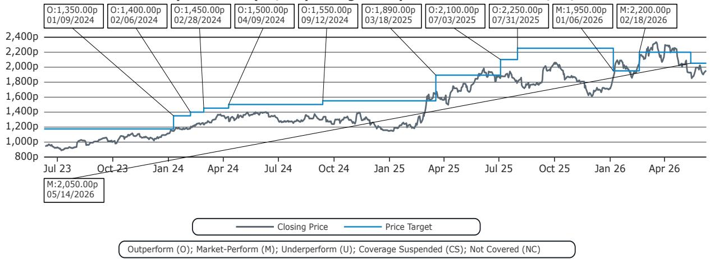
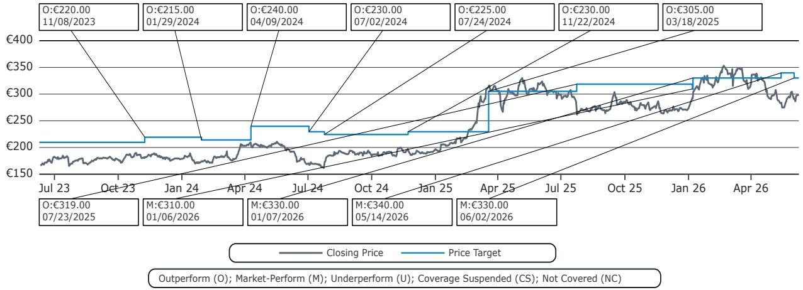
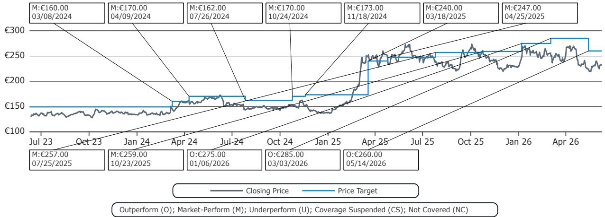

# European Defense Stocks Are Priced for Peace, But the Budgets Still Point to War

The recent sell-off in European defense stocks has created a dangerous analytical trap. It is tempting to view lower valuations as an entry opportunity, especially after a period of extraordinary geopolitical tension. But the market is not simply mispricing risk. It is pricing in a specific narrative: that the re-armament cycle has peaked and that a durable peace in Ukraine will trigger a sharp de-rating. This narrative is seductive, but it is not yet supported by the data that matters most—military budgets.

The truth is that European defense stocks are not cheap by historical standards. Prior to the sell-off that began in the second quarter of 2026, the sector was trading at peak valuations. Even after the decline, the average EV/EBITDA multiple has only reverted to levels seen at the start of the year. At 12.9x, the sector is not a bargain. It is simply less expensive than it was. The question investors must answer is whether this level represents fair value for a cycle that still has years to run, or whether it is a plateau before a structural decline.

The answer lies in the budgets. A global investment bank report makes a compelling case that the re-armament cycle will continue until the end of the decade, even if a sustainable cease-fire in Ukraine is achieved. This is not a contrarian view. It is a fundamentally grounded one. The budgets of the United States, Germany, and France all point to sustained growth in defense spending. The market is currently discounting this reality. For investors willing to look past the noise of peace talks and political turnover, the opportunity is not in betting on a recovery in sentiment. It is in understanding which companies are structurally positioned to capture the spending that is already locked in.

The key is to stop thinking about defense stocks as a single trade on geopolitical headlines and start thinking about them as a granular, budget-driven exposure to specific programs, geographies, and technologies. The companies that will outperform are not necessarily the largest primes. They are the ones with the most room for earnings upgrades, the highest organic growth rates, and the most direct exposure to the segments that governments are prioritizing.

## The Market Is Confusing a Sentiment Correction with a Fundamental Reversal

The sell-off in European defense stocks since the second quarter of 2026 has been broad and indiscriminate. Rheinmetall, the high-growth German champion, has been hit hardest, followed by Thales and Leonardo. Even BAE Systems, which derives nearly half its revenue from the more stable U.S. market, has declined. The trigger appears to be a combination of factors: renewed hopes for a cease-fire in Ukraine, a rotation out of defense into higher-growth technology names, and the absence of a near-term catalyst to reignite interest in the sector.

But the sell-off is not a signal that the defense cycle is ending. It is a sentiment correction. The market had priced in a continuation of the geopolitical crisis premium that drove stocks to peak valuations. When peace talks became more credible, that premium was removed. The problem is that the market has not yet fully priced in the second-order effect of those same peace talks: that governments, having committed to multi-year budget increases, will not reverse course simply because the fighting stops.

The report makes this point explicitly. Even if there is a durable peace in Ukraine, the re-armament cycle will continue until the end of the decade. The reason is simple. The war exposed critical capability gaps across Europe. Decades of under-investment cannot be reversed in two years. The budgets that have been passed are not emergency measures. They are structural commitments. Germany has doubled its defense budget since 2022 and expects to reach 3.7% of GDP by 2030. France is growing its addressable market at an 8% CAGR. The U.S. 2027 budget proposal, even if only the base budget passes, implies a 22% increase over 2026.

The market is treating the peace talks as a binary event. Either there is a cease-fire, and defense stocks de-rate, or there is not, and they re-rate. This framework is too simplistic. The more likely outcome is a prolonged period of negotiation and partial de-escalation, during which budgets continue to grow. The stocks that will work are the ones that can deliver earnings growth independent of the headline narrative.

## The U.S. Budget Is the Most Underappreciated Driver of European Defense Earnings

Most investors think of European defense companies as purely exposed to European budgets. This is incorrect. BAE Systems derives 44% of its sales from the United States. Leonardo, through its DRS stake, has 22% exposure. These are not marginal contributions. They are structural earnings drivers that are currently being ignored by a market focused on European geopolitics.

The U.S. defense budget proposal for 2027 is staggering. At $1.45 trillion, it represents a record increase. Even if the reconciliation portion does not pass Congress, the base budget of $1.1 trillion would still be a 22% increase over the 2026 enacted level of $0.9 trillion. This is not a cyclical uptick. It is a structural re-armament driven by competition with China, the Iran conflict, and the need to replenish stockpiles.

The key segments to watch are space, missiles, and air defense systems. These are the areas where the U.S. is investing most heavily, and they are also the areas where new entrants like Anduril and Shield AI are competing aggressively. The large primes have programs in these areas, but the competitive shakeout will take years. In the meantime, the incumbents with existing contracts and production capacity will benefit.

For European companies, the U.S. exposure is a source of diversification and growth that is not dependent on European peace talks. BAE Systems is the clearest beneficiary, but it is not the best positioned for the highest-growth segments. That distinction belongs to companies with exposure to missiles and space, which are primarily U.S.-based primes. For European investors, the key question is whether the U.S. budget can provide enough of a tailwind to offset any potential slowdown in European spending. The answer, at least for BAE Systems and Leonardo, is yes.

## Germany Is the Best Market in Europe, and Rheinmetall Is the Best Proxy

Germany has become the largest defense market in Europe, excluding Russia. It accounts for 17% of the continent's military budget and is now the fourth-largest defense spender globally. The ambition is clear: Germany expects to spend 3.7% of GDP on defense by the end of the decade, up from 2.2% in 2025. This is not a marginal increase. It is a doubling of the budget from just over €100 billion today to €180 billion by 2030.

The opportunity is amplified by the composition of spending. Germany is shifting a higher share of its budget toward equipment, as opposed to personnel and infrastructure. This means the addressable market for defense companies is growing at a 21% CAGR, nearly double the rate of the overall budget. The companies that benefit most are the ones with exposure to ammunition, land vehicles, and naval systems.

Rheinmetall sits in the sweet spot. It has the highest organic growth rate in the European defense sector, with a projected 29% revenue CAGR through 2030, compared to an average of 10% for peers. The stock has been in the penalty box due to short-term volatility and the broader sector sell-off, but the fundamental story is intact. Rheinmetall is a German champion with large-scale domestic capabilities in ammunition and land vehicles. It is also benefiting from the special fund created in 2022, of which €73 billion of the €100 billion has already been spent.

The risk is that the market is already pricing in much of this growth. At 15.3x EV/EBITDA, Rheinmetall is not cheap relative to the sector average of 12.9x. But the growth differential is so large that the premium is justified. The question is not whether Rheinmetall will grow. It is whether the market will reward that growth with a higher multiple, or whether the multiple will compress as growth becomes more visible. For investors with a two-to-three-year horizon, the risk-reward is attractive.

## France Provides Stability, but the Catalysts Are Different

France is the third-largest defense market in Europe, and its addressable market is growing at an 8% CAGR through 2030. The focus is on aircraft, space, ammunition, and air defense. Thales and Dassault Aviation are the primary beneficiaries, given their dominant positions in these segments.

Thales is the most interesting story among the French primes. The report highlights a tactical upgrade that should start playing out in the second quarter of 2026. The set-up is attractive: lower expectations in the Cyber division, paired with continued strength in the core defense business. Thales is not as high-growth as Rheinmetall, but it offers a more stable earnings profile and a lower valuation. At 12.0x EV/EBITDA, it is trading below the sector average and close to its January 2026 level.

Dassault Aviation is more resilient but lacks a near-term catalyst. The company is heavily exposed to the Rafale program, which has a multi-year backlog, but the stock is already pricing in much of this visibility. At 12.7x EV/EBITDA, Dassault is not expensive, but it is not a value trap either. The risk is that the market has already moved past the re-rating phase for Dassault and is now waiting for earnings to catch up.

The key insight for France is that the growth is steady but not spectacular. The 8% CAGR is respectable, but it is not enough to drive the kind of multiple expansion that investors have seen in Germany or in the U.S.-exposed names. The French champions are more likely to deliver steady compounding than explosive upside.

## The Report Leaves Three Critical Questions Unanswered

The report provides a rigorous framework for understanding the defense cycle, but it does not fully resolve three critical questions that investors must answer for themselves.

First, what happens to defense stocks if the U.S. budget is significantly reduced? The report acknowledges that the $1.45 trillion proposal is unlikely to pass Congress in its current form, but it assumes that the base budget will still imply strong growth. This is a reasonable assumption, but it is not a certainty. The U.S. political environment is volatile, and defense spending is not immune to fiscal pressure. If the base budget is cut, the earnings impact on BAE Systems and Leonardo could be significant.

Second, how should investors think about the competitive threat from new entrants? The report notes that new entrants like Anduril and Shield AI are aggressively pursuing programs in space, missiles, and autonomous systems. These companies are private, so their financials are not visible. But their presence is already affecting the competitive dynamics of the sector. The large primes may face margin pressure as they compete with more agile, technology-driven competitors. The report does not quantify this risk.

Third, what is the exit strategy for defense stocks? The re-armament cycle is expected to last until the end of the decade, but what happens after 2030? If budgets plateau or decline, the stocks could de-rate sharply. The report does not address the post-cycle valuation framework. Investors who buy today must have a view on where the cycle ends and how to position for that outcome.

These are not flaws in the analysis. They are the natural limits of a forward-looking research report. The report provides the data and the framework. It is up to each investor to form their own view on the uncertainty.

## A Decision Framework for Navigating the Defense Cycle

The report provides enough information to construct a simple but powerful decision framework for investing in European defense. The framework has three dimensions: budget exposure, growth profile, and valuation.

First, map each company to its primary budget exposure. BAE Systems and Leonardo are exposed to the U.S. budget. Rheinmetall is exposed to the German budget. Thales and Dassault are exposed to the French budget. TKMS is exposed to naval programs across multiple European countries. This mapping determines the top-line growth trajectory.

Second, assess the growth profile relative to the sector. Rheinmetall is the clear outlier with a 29% revenue CAGR. BAE Systems and Leonardo are growing at 8-9%. Thales and Dassault are at 7-13%. TKMS is at 12%. The higher the growth, the more the stock can justify a premium multiple.

Third, compare the current valuation to the historical range and to the growth profile. Rheinmetall is expensive on an absolute basis but cheap relative to its growth. Thales is cheap on an absolute basis but has lower growth. BAE Systems is fairly valued with limited catalysts.

The framework suggests that the most attractive risk-reward is in the high-growth names that have been punished by the sentiment correction. Rheinmetall and Leonardo fit this profile. Thales offers a more defensive entry point with a tactical catalyst. BAE Systems and Dassault are resilient but lack near-term upside. TKMS is fairly valued.

The framework also highlights what to avoid: companies with low growth, high exposure to a single budget that is at risk, and no catalyst for earnings upgrades. The market is currently pricing all defense stocks as if the cycle is ending. The framework helps identify which companies are mispriced.

## The Full Report Contains the Charts That Make the Argument Visual

The analysis above is based on a parsing of a global investment bank report, but the full report contains the charts and data that make the argument concrete. The exhibits on U.S. budget history, German spending projections, and revenue exposure by geography are essential for understanding the magnitude of the opportunity. Without them, the analysis is abstract.

The charts show the trajectory of U.S. defense spending from 2004 to 2027, with the base budget and reconciliation funding clearly separated. They show the German defense budget growing from €34 billion in 2012 to an estimated €180 billion in 2030. They show the revenue exposure of each European company to the U.S. market. These are not theoretical constructs. They are the building blocks of a fundamental investment case.

Join the community to read the full report and review the original charts.

*This article is for learning and discussion only and does not constitute investment advice.*

Personal reading notes and learning share only. Not investment advice.

