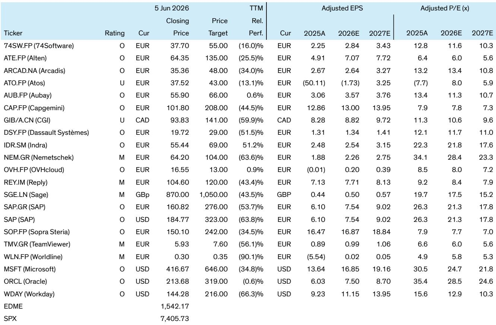

# AI Will Not Lift All Boats: The Structural Dispersion Reshaping European Software and Services

The dominant narrative that artificial intelligence will uniformly benefit the European software and IT services sector is fundamentally flawed. A detailed analysis of the sector reveals that AI is not a rising tide that lifts all vessels but a powerful force of structural dispersion that is already separating winners from losers based on economic fundamentals, not technological hype. The market is only beginning to price this divergence, creating both significant opportunity and material risk for investors who treat AI as a sector-wide catalyst rather than a stock-picking regime.

The core insight is deceptively simple: AI is reshaping business models, pricing power, and margin structures in fundamentally different ways across the software and services landscape. For platform-led software companies with deep workflow integration and high switching costs, AI represents a monetization accelerator that expands total addressable markets and drives operating leverage. For labor-intensive services firms and low-moat software vendors, AI threatens to compress pricing, accelerate commoditization, and erode margins before cost adaptation can catch up.

This is not a theoretical debate about future possibilities. Enterprise behavior is already shifting faster than consensus expects, with approximately 60% of clients planning to replace people-led delivery models by 2028. The question is no longer whether AI will reshape the sector but which business models will capture the economic value and which will be left holding structurally impaired revenue streams.

## The Shift from Systems of Record to Systems of Action Creates a New Economic Hierarchy

The most consequential structural change underway is the migration of software from passive "systems of record" to active AI-enabled "systems of action." This is not a feature upgrade but a fundamental redefinition of value creation in enterprise software. Traditional enterprise applications served as digital filing cabinets—they recorded transactions, stored data, and provided reporting capabilities. AI transforms these applications into autonomous agents that execute workflows, make decisions, and drive outcomes without human intervention.

The economic implications are profound. When software moves from recording to acting, the basis of competition shifts from feature breadth to economic impact. Vendors that embed AI deeply into workflow automation can capture pricing power through measurable ROI—reduced working capital, fewer supply chain disruptions, higher service levels. This creates a virtuous cycle where AI deployment drives customer retention, enables premium bundling, and expands total addressable markets.

Consider the supply chain software segment, where AI is driving what the report identifies as a structural supercycle. The opportunity is estimated at approximately $217 billion in cumulative revenue from 2026 through 2029, with AI-enabled spending projected to approach 80% of the market by 2030. This is not incremental growth but a full-stack reinvention where AI acts as a new operating system for enterprise operations.

The critical insight for investors is that this shift reinforces incumbent moats rather than disrupting them. Deep integration with enterprise workflows, proprietary data sets, and high switching costs mean that platform leaders are better positioned to capture AI economics than new entrants. The market is still pricing many of these companies as steady SaaS compounders rather than AI execution stories, creating valuation disconnects that disciplined investors can exploit.

## The Rise of Services-as-Software Compresses Legacy Revenue Pools While Expanding New Ones

The IT services sector is undergoing an equally fundamental transformation, though the direction of travel is different. The traditional services model—selling time and materials, billing by the hour, competing on labor arbitrage—is being disrupted by what the report terms "Services-as-Software." This model combines consulting expertise, AI capabilities, and proprietary intellectual property to deliver scalable, outcome-based services that compete directly with traditional people-led delivery.

The speed of this transition is striking. Enterprise clients are moving faster than expected toward AI-enabled delivery models, with the majority planning to reduce reliance on human-delivered services within three years. This creates a structural tension for services firms: the legacy revenue pool is compressing, but the new AI-enabled services market is expanding. The winners will be those that can navigate this transition, building proprietary IP and scalable delivery platforms while managing the decline of traditional revenue streams.

The report identifies several characteristics that separate AI transformers from laggards in services. Winners combine deep consulting capabilities with AI expertise and proprietary data assets, enabling them to deliver outcomes rather than hours. They invest in forward-deployed engineering models that embed AI directly into client operations. They build scalable platforms that generate recurring revenue rather than project-based billing.

The bear case for traditional services firms is equally clear. Labor-heavy delivery models face rising pricing pressure as AI alternatives become more capable and cost-effective. The time-and-materials billing model becomes increasingly difficult to defend when AI can automate significant portions of delivery. Margin structures that depend on utilization rates and offshore arbitrage face structural compression as AI eliminates the cost advantages of labor arbitrage.

## The Disruption Framework Reveals That Outcomes Depend on Revenue Mix, Not Company Labels

A critical analytical contribution is the disruption framework that maps companies based on two dimensions: automatability and defensibility. This framework reveals that AI outcomes depend primarily on revenue mix rather than sector classification or company size.

High-defensibility platforms—enterprise resource planning, database management, deeply embedded workflow systems—remain resilient because their value comes from integration, data control, and switching costs rather than feature breadth. For these companies, AI is a monetization layer that enhances pricing power and customer retention. They can deploy AI as a premium feature, bundle it into existing subscriptions, or charge based on outcomes.

High-automatability segments—analytics, business process services, application development—face structural pricing pressure because AI can directly substitute for human labor and automate core functions. In these segments, AI is not an upsell opportunity but a competitive threat that compresses pricing and accelerates commoditization.

The framework produces a clear hierarchy of outcomes. Platform leaders with high defensibility and moderate automatability are positioned to capture AI economics. Services firms with high automatability but moderate defensibility face a more complex transition, where success depends on building proprietary IP and scalable delivery models. Companies with low defensibility and high automatability face the most significant risk of value destruction.

This analysis suggests that sector-level bets on AI are misguided. Within any given subsector—ERP, IT services, supply chain software—the dispersion between winners and losers is likely to widen structurally. The market is not yet fully pricing this dispersion, creating opportunities for investors who can identify the specific business model characteristics that determine AI outcomes.

## What the Report Does Not Yet Fully Answer: The Unresolved Questions of Timing and Magnitude

While the framework provides powerful analytical clarity, several critical questions remain unresolved. The most important is the timing of the dispersion. The report argues that the timeline for differentiation is compressing, but the exact pace of market repricing remains uncertain. Valuations do not yet fully reflect the gap between AI transformers and low-moat models, but the question is whether this gap will close through multiple expansion for winners, multiple compression for losers, or some combination of both.

A second unresolved question concerns the magnitude of margin expansion for AI winners. The bull case suggests that AI lowers cost-to-serve, shortens implementation cycles, and supports premium bundling, driving operating leverage and higher free cash flow conversion. The bear case warns that AI becomes table stakes before pricing catches up, forcing vendors to absorb elevated R&D and compute costs with limited revenue upside. The actual outcome likely lies somewhere between these extremes, but the range of possible outcomes is unusually wide.

A third question involves the competitive dynamics between scaled platforms and focused specialists. The report suggests that both ends of the market can succeed—large platforms benefit from data scale and ecosystem advantages, while specialists retain defensible niches where domain-specific AI delivers faster ROI. But the middle ground of undifferentiated generalists faces pressure. The question is where the boundary lines fall and which companies are most at risk of being caught in the middle.

These unresolved questions are not weaknesses in the analysis but reflections of genuine uncertainty in a rapidly evolving landscape. They create the analytical tension that makes the sector interesting and the investment opportunity compelling.

## A Decision Framework for Navigating the AI Dispersion

For investors seeking to apply this analysis, a structured decision framework can help identify which companies are positioned to capture AI economics and which face structural headwinds.

The first filter is business model defensibility. Companies with high switching costs, deep workflow integration, and proprietary data assets are better positioned to monetize AI. This includes enterprise platform vendors with installed bases, ecosystem lock-in, and mission-critical applications. It excludes point solutions with low integration requirements and high substitutability.

The second filter is revenue mix exposure to automatability. Companies with significant revenue from highly automatable activities—analytics, business process services, application development—face pricing pressure that may outpace their ability to adapt. Companies whose revenue comes from activities with lower automatability—complex workflow integration, domain-specific expertise, regulatory compliance—have more time to adjust and capture AI benefits.

The third filter is AI investment capacity and execution capability. AI deployment requires significant R&D investment, data infrastructure, and talent acquisition. Companies with strong balance sheets, existing data assets, and demonstrated execution capability are better positioned to capture AI economics. Companies with limited investment capacity or weak execution track records risk falling behind.

The fourth filter is pricing power and monetization strategy. Companies that can embed AI into existing pricing models—premium bundling, outcome-based pricing, usage-based models—are better positioned to capture value. Companies that must compete on feature parity or face pricing pressure from AI alternatives face margin compression.

Applying this framework produces a clear hierarchy of investment opportunities. Platform-led software companies with high defensibility, moderate automatability, strong investment capacity, and demonstrated pricing power represent the most attractive opportunities. AI-enabled services leaders with proprietary IP, scalable delivery platforms, and outcome-based pricing models represent a second tier of opportunity. Labor-led services firms and low-moat software vendors face the most significant risks and require careful scrutiny.

## The Community Question: Where Does the Analysis Lead Next?

The analysis presented here represents a significant advance in understanding how AI will reshape European software and services. But it also raises questions that require deeper investigation. How will the competitive dynamics between scaled platforms and focused specialists evolve as AI deployment accelerates? Which specific business models are most at risk of structural disruption, and what are the leading indicators of value destruction? How should investors weigh the timing of AI monetization against the risk of competitive displacement?

These questions point toward the need for continuous, granular analysis rather than static investment conclusions. The dispersion between AI winners and losers is not a one-time event but an ongoing process that will unfold over multiple years. Companies will move between categories as strategies succeed or fail, as competitive dynamics shift, and as AI capabilities advance.

Join the community to read the full report and review the original charts. The proprietary frameworks—including the AI leverage scorecards, disruption mapping, and platform positioning analysis—provide the analytical tools needed to navigate this dispersion. The detailed company-level analysis reveals which specific companies are positioned to capture AI economics and which face structural headwinds. The unresolved questions point toward the next generation of analytical challenges that will define investment outcomes in European software and services.

*This article is for learning and discussion only and does not constitute investment advice.*

Personal reading notes and learning share only. Not investment advice.

