## Global Media

# Global Media: A beginner's guide to investing in Advertising

  
Annick Maas

+44 20 7676 6683

annick.maas@bernsteinsg.com

  
Christophe Cherblanc

+41 582 723 540

christophe.cherblanc@bernsteinsg.com

  
Mark Shmulik

+1 917 344 8508

mark.shmulik@bernsteinsg.com

  
Laurent Yoon

+1 917 344 8502

laurent.yoon@bernsteinsg.com

  
Nikhil Devnani, CFA

+1 917 344 8425

nikhil.devnani@bernsteinsg.com

Advertising is totally unnecessary. Unless you hope to make money." - Jef I. Richards

Following on from “A beginner's guide to investing in Media” published last year, we are focusing this year on the sub-sector Advertising. From traditional media owners, over agencies, ad tech and martech to the big digital platforms, combined this ever evolving industry is worth \$1trn globally. We look into the various sub-sectors, what KPIs to look into, the share price drivers and how the US/European markets compare/contrast.

The key structural insight: advertising growth is driven by redistribution, not consumption expansion. Global media consumption has plateaued at \~11 hours per day, constraining total inventory growth and implying intensifying competition for attention. Rather than structural volume expansion, value is shifting across formats and platforms, with digital now accounting for over two-thirds of global ad spend. This fragmentation increases execution complexity and raises the premium on scale, targeting, and measurement—favouring large digital platforms with superior data ecosystems

## Two distinct advertising markets underpin diverging growth and risk profiles.

Market #1 (agencies, traditional media) is concentrated, cyclical, and dependent on a few thousand large clients; spend is volatile and often the first cost to be cut in downturns. Market #2 (digital platforms) is driven by millions of SMEs, structurally more resilient, and less predictable from top-down indicators. Our data shows SME-driven revenues account for roughly two-thirds of major platform ad revenues, highlighting a fundamentally different growth engine. This distinction is often underappreciated by the market and explains persistent outperformance of platform-led models.

## Digital advertising growth remains intact, but is evolving into a second phase.

The first phase was driven by SME onboarding and self-serve tools; the second phase (since \~2023) is driven by inventory expansion (retail media, marketplaces, OTT) and personalisation at scale. Retail media in particular represents structurally high-margin, near-zero-cost inventory with strong targeting advantages, benefiting platforms like Amazon and delivery ecosystems. AI acts as an accelerant—enhancing targeting, creative generation, and conversion—while reinforcing the competitive moat of scaled platforms

## Traditional players are adapting—but the mix shift remains insufficient.

Broadcasters, OOH, and agencies are successfully replicating digital characteristics (e.g., ITVx, VIOOH), achieving higher growth in these segments. However, these businesses still represent a small proportion of group revenues, limiting their impact on overall growth and valuation. Meanwhile, core linear advertising continues to decline in markets like the US, with DTC growth only partially offsetting the gap. High client concentration and cyclical exposure further weigh on investment appeal.

## Table Of Contents

How to think about Global Advertising Categorisations....2

Revenue model - A volatile ride, but it is worth it....3

The exchange and free rider model....4

From digital transition to digital fragmentation in advertising....4

Digital advertising growth formula....6

Advertising - It is not all the same - market #1 emulates market #2 successfully....7

This drives some conclusions, which we believe are essential to consider when looking at the advertising market:....9

Complexity - Fragmentation - Data transparency....11

Regulation & Measurement....12

Advertising and AI....13

The Advertising Sub-Sectors....14

Free-to-Air and pay tv in transition....14

Transition from Linear Advertising to DtC Advertising in the US....15

Outdoor Advertisers....19

Advertising Agencies....21

Classifieds....23

Ad Tech....24

Social media....25

Marketplaces....26

Commerce Advertising / Retail Media....27

## DETAILS

## HOW TO THINK ABOUT GLOBAL ADVERTISING CATEGORISATIONS

\- Traditional Advertising: The term traditional media typically refers to the advertising channels that were around before the emergence of the digital advertising era. Traditional advertising sub-sectors include free-to-air broadcasters, outdoor advertisers (e.g. billboard advertising companies), radio and newspapers, although the latter are no longer listed as standalone categories

\- Digital Advertising: Digital advertising encompasses the sub-sectors that have emerged with the rise of the internet. It is a very wide wrapper that includes anything from digital advertising video on demand, classifieds, marketplaces, ad tech companies and the FAANGs.

Beyond the traditional/digital dissection, advertising can be split in the following four categories.

\- Big digital platforms: search, social, video platforms - essentially consumer platforms that aim to sell targeted advertising at scale.

\- Search engines: platforms that monetize intent via keyword auctions and other advertising products.

- Social networks: stories, short-form video and feeds that are monetized via native advertising formats.  
• Video platforms: these platforms include long and short-form videos with in-stream, in-feed, and sponsorship formats.  
- Marketplaces and retail media: e-commerce and marketplace platforms selling on-site search/display and sponsored advertising/listings.

\- Traditional media owners: TV broadcasters, outdoor advertising, print, radio and their digital extensions - these companies monetize their audiences as they sell advertising space alongside their content.

• TV and streaming: broadcasters, cable/satellite networks, and AVoD platforms.  
- Out-of-home (OOH): traditional/digital billboards, street furniture, transport advertising networks.  
- Print: newspapers, magazines, and digital news' groups monetizing their audiences via advertising.  
- Audio: radio and digital audio platforms (i.e. streaming music) that have ad-supported tiers.  
- Thematic/specialist publishers: niche websites, trade media, and other information portals monetizing via display advertising.

\- Agencies/holding groups: This category includes advertising/media agencies that plan, buy, create and execute media campaigns for brands; they take a fee or margin on ad spend.

- Holding companies: The likes of WPP, Publicis, Omnicom. They manage diversified networks offering creative, media, PR, and other data/consulting services.  
- Specialist agencies: These tend to be focused on particular verticals (healthcare, performance, influencer, etc.).  
- Digital-first performance agencies: Agencies that tend to focus on all things digital and data-driven i.e. programmatic, search, social, CRM, and data-driven performance marketing.

\- Ad tech and martech: demand-side platforms (DSPs), supply-side platforms (SSP), measurement, data, and marketing-automation providers that enable digital advertising. These tend to be softwares that sit between the advertisers and the media owners and take a cut on the spend.

- Demand-side platforms (DSPs): tools advertisers and agencies use to buy advertising inventory on exchanges.  
• Supply-side platforms (SSPs): platforms that help media owners to monetize inventory via auctions.  
- Ad servers: They manage ad delivery and frequency for web and in-app inventory.  
- Attribution and measurement: Platforms that track and attribute advertising posts and conversion rates.  
- Verification and brand safety: viewability, fraud detection and brand suitability.  
- Connected TV/OTT ad platforms: marketplaces that allow seamless booking/buying of streaming video ad inventory.

## REVENUE MODEL - A VOLATILE RIDE, BUT IT IS WORTH IT

Advertising powered revenue models are dominant in the media sector. An advertising revenue model has the following features:

- Advertising is typically viewed as being early cycle as it (arguably counter intuitively) is the first expense that companies cut when the macro environment deteriorates. It tends to show a correlation with consumer confidence KPIs. We’d argue that exactly in these pressure moments it is crucial to invest in advertising to support brand strength and, over the long term, a company’s valuation.  
- Advertising revenues are therefore relatively volatile, with DD quarterly swings in stressed macro conditions.  
- As a rule of thumb, one can assume that most advertising-driven businesses are consumer-facing.  
- The overall advertising world has been benefitting from a mix shift to digital, which tends to grow quicker than traditional advertising. Over the last decade advertising spend has aggregated around a few platforms only.  
- Advertising is all about scale. The more a platform is scaled the higher advertising prices it can command. Advertising is paid generally by CPM/CPT in other words one is paying to have access to 1000 impressions.

## THE EXCHANGE AND FREE RIDER MODEL

Most advertising models provide something in exchange to be able to charge advertising. For example, free-to-air broadcasters provide content (TV shows and films) in exchange for advertising breaks that allow them to collect revenues. Outdoor advertisers provide bus shelters and billboards that allow councils to display community messages in exchange for being able to place advertising on these panels as well. News portals provide content/information and display advertising alongside to pay for it.

Then there are the free riders. For example, the leading classified players, which can display cars for sale and have car dealers pay to be able to place these listings (the content in this case) on the website. These types of firms consistently exhibit very high margins across many geographies. This is the by-product of enjoying a content supply paid for by external contributors (the ultimate sweet spot for a “media” business!). This is also the case for social media platforms enjoying free user-generated content.

## FROM DIGITAL TRANSITION TO DIGITAL FRAGMENTATION IN ADVERTISING

In the last 25 years the media sector has been dominated by the digital transition theme. This digitalisation has led to the disruption of some business models, higher capex/opex spend and, ultimately, to the emergence of new companies. The world's biggest advertising firms have only appeared in the last two decades. Today >2/3rds of global advertising revenues are coming from Digital.

EXHIBIT 1: Digital vs Traditional ad spending growth worldwide, 2020-2026  
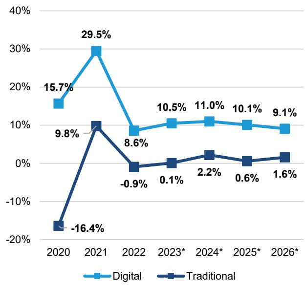

line chart

| Year | Digital (%) | Traditional (%) |
| :--- | :--- | :--- |
| 2020 | 15.7 | -16.4 |
| 2021 | 29.5 | 9.8 |
| 2022 | 8.6 | -0.9 |
| 2023* | 10.5 | 0.1 |
| 2024* | 11.0 | 2.2 |
| 2025* | 10.1 | 0.6 |
| 2026* | 9.1 | 1.6 |

digital includes advertising that appears on desktop and laptop computers as well as mobile phones, tablets, and other internet-connected devices, and includes all the various formats of advertising on the platforms; traditional includes TV, magazines, newspapers, out-of-home, and radio

\* Forecast

Source: eMarketer

EXHIBIT 2: Digital advertising spending worldwide from 2021 to 2026 (in billion U.S. dollars)  
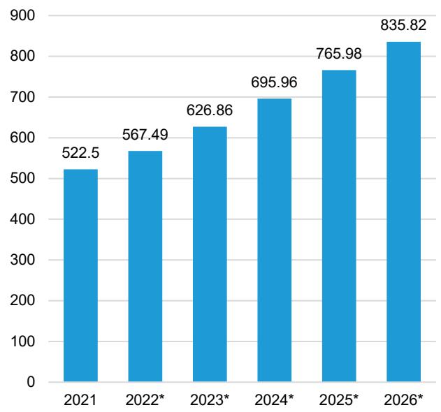

bar chart

| Year | Value |
| :--- | :--- |
| 2021 | 522.5 |
| 2022* | 567.49 |
| 2023* | 626.86 |
| 2024* | 695.96 |
| 2025* | 765.98 |
| 2026* | 835.82 |

includes advertising that appears on desktop and laptop computers as well as mobile phones connected devices, and includes all the various formats of advertising on those platforms

\* Forecast

Source: eMarketer, PubMatic

EXHIBIT 3: Digital ad spending worldwide, 2021-2026 (in billions)  
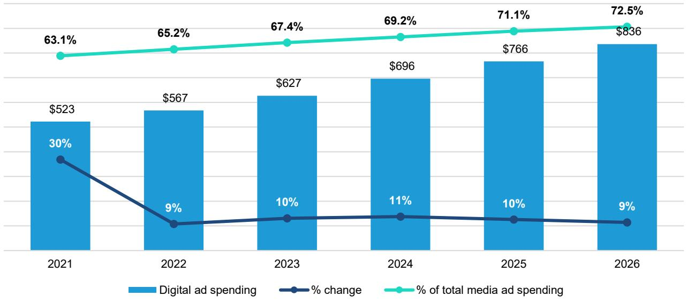

bar-line hybrid chart

| Year | Digital ad spending | % change |
|------|---------------------|----------|
| 2021 | $523                | 30%      |
| 2022 | $567                | 9%       |
| 2023 | $627                | 10%      |
| 2024 | $696                | 11%      |
| 2025 | $766                | 10%      |
| 2026 | $836                | 9%       |

includes advertising that appears on desktop and laptop computers as well as mobile phones, tablets, and other internet-connected devices, an includes all the various formats of advertising on the platforms; excludes SMS, MMS, P2P messaging-based advertising

Source: eMarketer

Digital ad growth has remained robust. There are three key reasons why Digital ad growth has continued to defy expectations, even though its share of the total ad market is maturing and user time spent on media is stabilizing.

- Commercial activity continues to migrate online. Globally ex-China, e-commerce penetration of total retail is in the mid-teens. Given that digital advertising is more measurable than analogue and often tied directly to a conversion event, there's a strong correlation between digital ad spend growth and e-commerce growth rates.  
- Time spent shift to digital channels. While slowing, time spent with media continues to shift from traditional to digital channels. For example Connected TV have reached a tipping point with YouTube now the most watched TV channel in the US.  
- AI improvements to advertising performance. In no field outside of coding/engineering has the impact of AI been more pronounced than in digital advertising. Not only have algorithms made it easier for advertisers to target their ads and send the right message to the right person at the right time, regardless of their campaign objective, but generative AI is now driving a shift in advertising creation.

## DIGITAL ADVERTISING GROWTH FORMULA

## Online ad growth = Volume (penetration/usage) x Price (auction based) x New clients (2/3s SMEs)

The two stages of digital advertising growth:

Stage 1: In this stage, which has dominated the last decade, we saw digital growth driven by SMEs as they were enjoying newfound self-service communications capabilities. To put this statement into context, SMEs actually account for two-thirds of online mega caps Alphabet and Meta's ad revs.

Stage 2: This phase started in 2023, with the accelerated expansion of media inventory (retail media, marketplaces, delivery apps, OTT platforms). Combined with emerging personalisation-at-scale opportunities, this creates the once unthinkable opportunity for larger advertisers to move more fluidly up and down the marketing funnel. Redefining the marketing funnel, with Retail Media exploiting free ad inventory at scale is a major opportunity for what were originally ‘non-media’ companies (retailers, apps, marketplaces).

EXHIBIT 4: Only four of today's top 10 most valuable digital companies existed prior to 2000

<table><tr><td></td><td>Est. brand value in 2026</td><td>Launch year</td></tr><tr><td>Google</td><td>$1,484bn</td><td>1998</td></tr><tr><td>Facebook</td><td>$366bn</td><td>2004</td></tr><tr><td>Instagram</td><td>$286bn</td><td>2010</td></tr><tr><td>Tencent</td><td>$251bn</td><td>1998</td></tr><tr><td>YouTube</td><td>$169bn</td><td>2005</td></tr><tr><td>Netflix</td><td>$139bn</td><td>1997</td></tr><tr><td>TikTok</td><td>$98bn</td><td>2016</td></tr><tr><td>LinkedIn</td><td>$76bn</td><td>2003</td></tr><tr><td>Disney</td><td>$52bn</td><td>1923</td></tr><tr><td>Spotify</td><td>$35bn</td><td>2006</td></tr></table>

We excluded all AI companies  
Source: Kantar, Bernstein analysis

EXHIBIT 5: Global digital ad spend keeps on rising although slightly less strong than over the last decades  
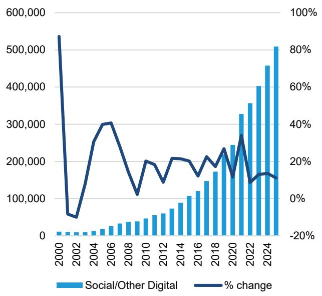

bar-line hybrid chart

| Year | Social/Other Digital | % change |
|------|------------------------|----------|
| 2000 | ~10,000                | ~90%     |
| 2002 | ~15,000                | ~-10%    |
| 2004 | ~20,000                | ~30%     |
| 2006 | ~30,000                | ~45%     |
| 2008 | ~40,000                | ~-5%     |
| 2010 | ~50,000                | ~25%     |
| 2012 | ~60,000                | ~15%     |
| 2014 | ~80,000                | ~25%     |
| 2016 | ~110,000               | ~15%     |
| 2018 | ~170,000               | ~35%     |
| 2020 | ~240,000               | ~15%     |
| 2022 | ~350,000               | ~5%      |
| 2024 | ~510,000               | ~15%     |

Source: GroupM, Bernstein analysis

EXHIBIT 6: In recent years, the media sector has been dominated by the transition from traditional media to digital  
Total Media Ad Spending in the US, by Media (Share; %)  
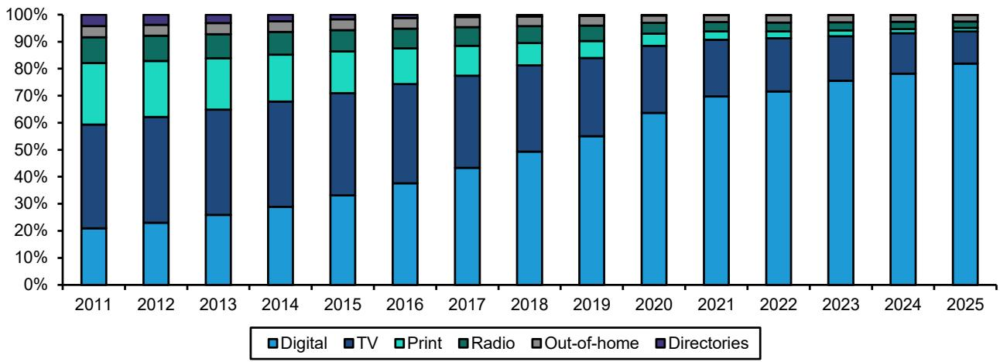

stacked bar chart

| Year | Digital | TV   | Print | Radio | Out-of-home | Directories |
|------|---------|------|-------|-------|-------------|-------------|
| 2011 | 20%     | 35%  | 20%   | 10%   | 5%          | 5%          |
| 2012 | 22%     | 37%  | 18%   | 9%    | 4%          | 4%          |
| 2013 | 25%     | 38%  | 16%   | 8%    | 4%          | 4%          |
| 2014 | 28%     | 35%  | 14%   | 7%    | 4%          | 4%          |
| 2015 | 32%     | 32%  | 12%   | 6%    | 4%          | 4%          |
| 2016 | 37%     | 30%  | 10%   | 5%    | 4%          | 4%          |
| 2017 | 42%     | 28%  | 8%    | 4%    | 4%          | 4%          |
| 2018 | 48%     | 25%  | 6%    | 3%    | 4%          | 4%          |
| 2019 | 55%     | 22%  | 5%    | 3%    | 4%          | 4%          |
| 2020 | 63%     | 18%  | 4%    | 3%    | 4%          | 4%          |
| 2021 | 70%     | 15%  | 3%    | 3%    | 4%          | 4%          |
| 2022 | 72%     | 14%  | 3%    | 3%    | 4%          | 4%          |
| 2023 | 75%     | 13%  | 3%    | 3%    | 4%          | 4%          |
| 2024 | 78%     | 12%  | 3%    | 3%    | 4%          | 4%          |
| 2025 | 82%     | 10%  | 3%    | 3%    | 4%          | 4%          |

eMarketer data updated May 2026  
Source: eMarketer; Bernstein analysis

## ADVERTISING - IT IS NOT ALL THE SAME - MARKET #1 EMULATES MARKET #2 SUCCESSFULLY

We believe there are two fundamentally different advertising markets that are often referred to as one, yet they are structurally very different:

1. Advertising Market #1: The first one is dealing with large advertising clients (think global FMCG, retail, beauty brands, luxury sector etc). This advertising market is the one that is addressed in the trade press. It is the one that media/advertising agencies are dealing with. It is ultimately dependent on only a few thousand clients (Exhibit 11). These advertisers have big brand budgets but when they have operational/cyclical issues, often advertising (arguably counter intuitively) is the first cost line that is cut. Given the high client concentration any account loss can creative volatile sector developments (Exhibit 12).  
2. Advertising Market #2: The second advertising market is the one that is addressed by the major advertising platforms (e.g. Amazon, Meta, Google). The client base here is in the multiple millions - the SMEs of this world. This advertising market is no so much covered in the trade press even though it is larger and sees better growth levels. This is explained by the millions of small clients that this market is dealing with. It implies that the prediction power of one client is not really relevant nor telling. (Who cares if the bakery network of East London raises their advertising budget / it is more telling if P&G tells us they are raising their UK budget).

EXHIBIT 7: There are two structurally different advertising markets with one growing much more than the other one, which is reflective of and in the client base  
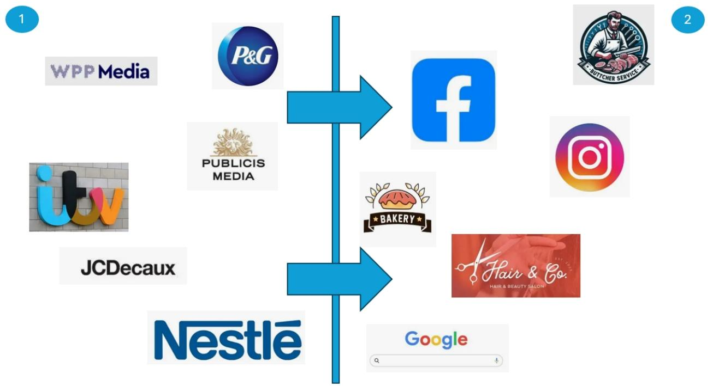

flowchart

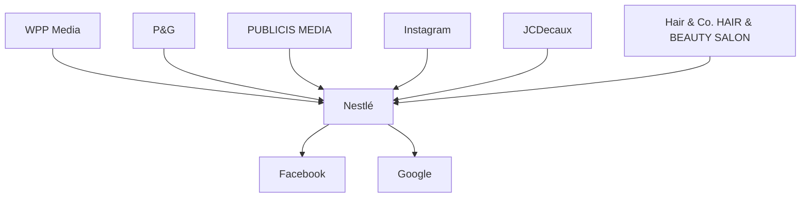

Source: trade press, company logos, Bernstein estimates and analysis

Market #1 is dominated by traditional advertising groups, where growth tends to be more muted at the group level. However, many of these firms are actively repositioning to emulate the faster-growing, more dynamic players in Market #2. When they do so they do it in a successful way as the growth rates in Exhibit 8 would testify. The challenge though is that the percentage of total revenues generated from the these higher growth revenues are still small as Exhibit 9 shows:

- ITVx is ITV's SVoD/ADVoD platform,  
- Joyn is ProSieben's AdVoD platform targeting local SMEs,  
- VIOOH is JCDecaux's automated ad platforms targeting SMEs.

Even though the above platforms are in groups that typically have the characteristics of the Market #1 (i.e. few big clients that grow moderately), they have managed to emulate the features of Market #2 (i.e. attracting smaller high growth clients).

EXHIBIT 8: When Market 1 players adopt Market 2 practices they see good growth at least in line with players from Market 2 (2025 revenue growth)  
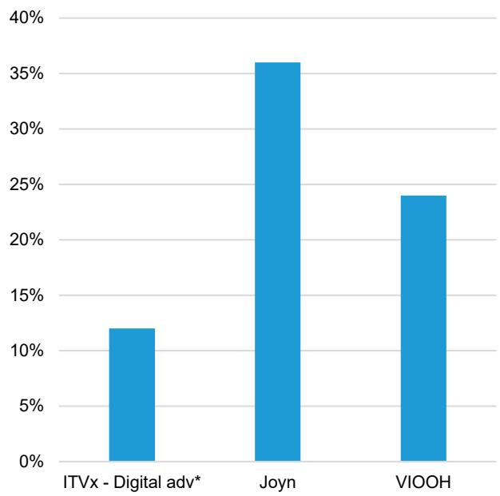

bar chart

| Category | Value (%) |
| :--- | :--- |
| ITVx - Digital adv* | 12 |
| Joyn | 36 |
| VIOOH | 24 |

for ITVx we used total ITVx advertising revs
Source: company reports, Bernstein estimates and analysis

EXHIBIT 9: However, these business units are only making up a small part of total revenues of their respective groups (% of FY25 revenues)  
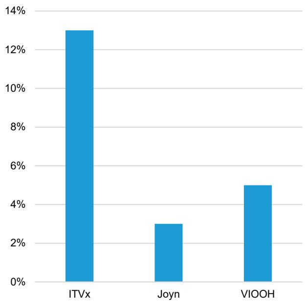

bar chart

| Category | Value |
| -------- | ----- |
| ITVx     | 13%   |
| Joyn     | 3%    |
| VIOOH    | 5%    |

For ITVx we used adv and subscription revenues and we divided them by total ITV revenues (not only the Medaia & Entertainment business)
Source: company reports, Bernstein estimates and analysis

## THIS DRIVES SOME CONCLUSIONS, WHICH WE BELIEVE ARE ESSENTIAL TO CONSIDER WHEN LOOKING AT THE ADVERTISING MARKET:

- The advertising market generally is not under pressure - Exhibit 10 clearly shows that advertising depending on where you look at is growing quite aggressively.  
• Major digital advertising platforms are more client agnostic than traditional advertising agencies.  
- Agencies deal with an entirely different market than digital advertising platforms.  
- The mandate to plan and execute a marketing plan is very different depending on the client. It goes without saying that planning and executing a global advertising campaign for P&G is more difficult than making sure the Bakery chain of East London has a nice looking Instagram ad.  
- This has implications for AI transformations- we believe a marketing self serve model is unlikely to replace agencies but is likely driving further growth for Internet platforms.  
- What the trade press is covering is not reflective of the entire advertising market.  
- The advertising market is becoming more complex, fragmented and data intense.

EXHIBIT 10: Advertising dynamics are different depending on who you look at - based on FY25 revenue growth (organic for the agencies)  
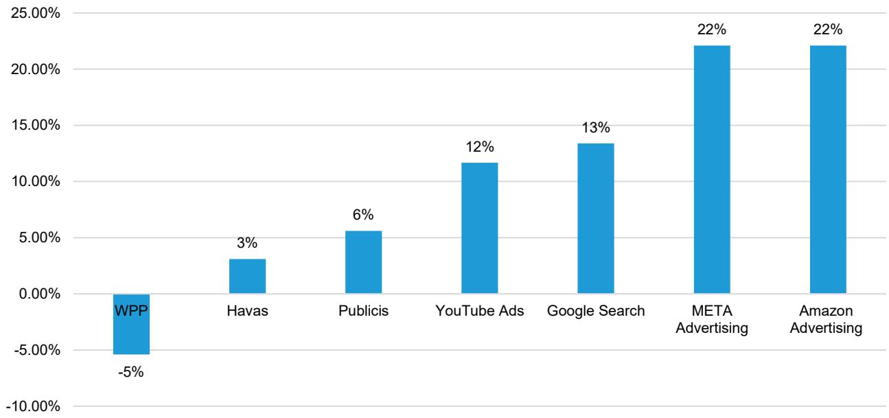

bar chart

| Category | Value (%) |
|---|---|
| WPP | -5 |
| Havas | 3 |
| Publicis | 6 |
| YouTube Ads | 12 |
| Google Search | 13 |
| META Advertising | 22 |
| Amazon Advertising | 22 |

Source: company reports, Bernstein analysis

EXHIBIT 11: The advertising client pool of of agencies is dramatically different to the one of the major Internet platforms  
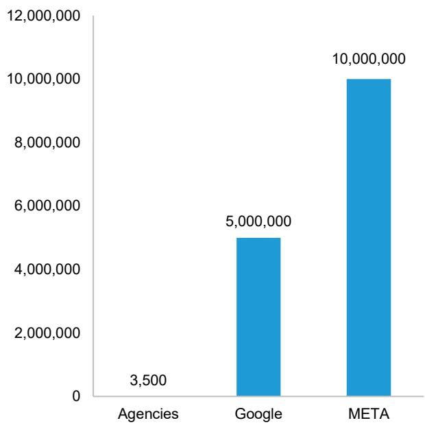

bar chart

| Category | Value |
| :--- | :--- |
| Agencies | 3,500 |
| Google | 5,000,000 |
| META | 10,000,000 |

Source: Bernstein estimates and analysis

EXHIBIT 12: Client concentration is very high at the agencies (approximate revenues coming from top 10 clients)  
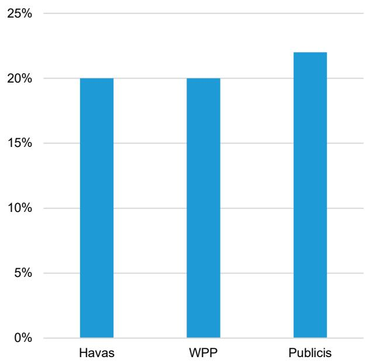

bar chart

| Category  | Value |
| --------- | ----- |
| Havas     | 20%   |
| WPP       | 20%   |
| Publicis  | 22%   |

Source: company reports, Bernstein estimates and analysis

EXHIBIT 13: Agencies margins have been rising over the last two decades despite ongoing change and topline growth which not always looks super exciting

<table><tr><td></td><td>2004</td><td>2005</td><td>2006</td><td>2007</td><td>2008</td><td>2009</td><td>2010</td><td>2011</td><td>2012</td><td>2013</td><td>2014</td></tr><tr><td>Havas</td><td>11.5%</td><td>8.8%</td><td>8.2%</td><td>11.0%</td><td>12.1%</td><td>10.4%</td><td>11.8%</td><td>12.0%</td><td>12.4%</td><td>12.8%</td><td>13.0%</td></tr><tr><td>Interpublic</td><td>-1.5%</td><td>-1.7%</td><td>1.7%</td><td>5.6%</td><td>8.5%</td><td>5.9%</td><td>8.4%</td><td>9.8%</td><td>9.8%</td><td>8.4%</td><td>10.5%</td></tr><tr><td>Publicis</td><td>15.1%</td><td>15.7%</td><td>16.3%</td><td>16.7%</td><td>16.7%</td><td>15.0%</td><td>15.8%</td><td>16.0%</td><td>16.1%</td><td>16.5%</td><td>16.4%</td></tr><tr><td>Omnicom</td><td>12.5%</td><td>12.8%</td><td>13.0%</td><td>13.4%</td><td>13.0%</td><td>12.2%</td><td>12.2%</td><td>12.7%</td><td>13.4%</td><td>13.2%</td><td>13.4%</td></tr><tr><td>WPP</td><td>14.1%</td><td>14.0%</td><td>14.5%</td><td>15.0%</td><td>15.0%</td><td>11.7%</td><td>13.2%</td><td>14.3%</td><td>14.8%</td><td>16.5%</td><td>16.7%</td></tr><tr><td>Average Big 5</td><td>10.3%</td><td>9.9%</td><td>10.7%</td><td>12.3%</td><td>13.1%</td><td>11.0%</td><td>12.3%</td><td>13.0%</td><td>13.3%</td><td>13.5%</td><td>14.0%</td></tr><tr><td></td><td>2015</td><td>2016</td><td>2017</td><td>2018</td><td>2019</td><td>2020</td><td>2021</td><td>2022</td><td>2023</td><td>2024</td><td>2025</td></tr><tr><td>Havas</td><td>13.4%</td><td>13.0%</td><td>9.4%</td><td>9.8%</td><td>10.0%</td><td>5.9%</td><td>10.7%</td><td>10.3%</td><td>10.8%</td><td>11.5%</td><td>12.9%</td></tr><tr><td>Interpublic</td><td>11.5%</td><td>12.0%</td><td>12.8%</td><td>13.5%</td><td>14.0%</td><td>13.5%</td><td>16.8%</td><td>16.6%</td><td>16.7%</td><td>16.5%</td><td>n/a</td></tr><tr><td>Publicis</td><td>15.5%</td><td>15.6%</td><td>15.5%</td><td>17.0%</td><td>17.3%</td><td>16.0%</td><td>17.5%</td><td>18.0%</td><td>18.0%</td><td>18.0%</td><td>18.2%</td></tr><tr><td>Omnicom</td><td>13.4%</td><td>13.8%</td><td>14.4%</td><td>14.0%</td><td>14.2%</td><td>12.1%</td><td>15.4%</td><td>14.6%</td><td>14.3%</td><td>14.5%</td><td>15.0%</td></tr><tr><td>WPP</td><td>16.9%</td><td>17.4%</td><td>17.3%</td><td>16.0%</td><td>14.4%</td><td>12.9%</td><td>14.4%</td><td>14.8%</td><td>14.8%</td><td>15.0%</td><td>13.0%</td></tr><tr><td>Average Big 5</td><td>14.1%</td><td>14.4%</td><td>13.9%</td><td>14.1%</td><td>14.0%</td><td>12.1%</td><td>15.0%</td><td>14.9%</td><td>14.9%</td><td>15.1%</td><td>14.8%</td></tr></table>

Source: company reports, Bernstein analysis

## COMPLEXITY - FRAGMENTATION - DATA TRANSPARENCY

In Mad Men days, buying and booking advertising used to be easy with limited choices (i.e. TV, Outdoor, Newspaper or Radio). Today ad buyers navigate between leaderboard, skyscraper, MPU/rectangle, half-pages and mobile banners - and these acronyms are all only formats of “standard banners” in display advertising. There are thousands of media platforms and advertising formats available today. Needless to say not only the amount of advertising increased exponentially but also the complexity of the space driven among others by the ongoing fragmentation of the advertising space rose.

The reality is that global media consumption has plateaued at around 11 hours per day, effectively signaling market maturity given we're awake roughly 15 hours daily. This underscores our view that despite the growth of certain advertising channels, we are facing a redistribution of value across an ever more fragmented media landscape, rather than a true expansion of media consumption. It shows that it is ever more complicated to capture the audience that ultimately will drive advertising revenues.

EXHIBIT 14: The advertising options have multiplied since the Mad Men days  
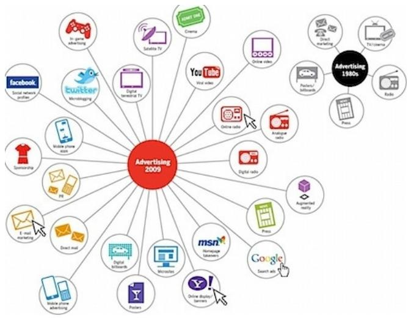

flowchart

Source: https://www.idcomms.com/blog/agency-remuneration-the-key-to-just-about-everything

EXHIBIT 15: Today on instagram alone you can advertise in 8 formats but there are 1000s of other options in which one can advertise  

text_image

Discover the 8 Types
of Instagram Ads (+
Inspiring Examples)
TO ENJOY
WHATEVER
THE WEATHER
ON MOBID
COulate
WHICH COLORWAY SUITS
THIS OUTFIT BEST?

Source: https://madgicx.com/blog/types-of-instagram-ads

EXHIBIT 16: Among media access points, mobile devices dominate time spent, but CTV is Growing Faster  
average hr:mins spent per day with media/device among US adults, digital vs. traditional, 2014-2026  
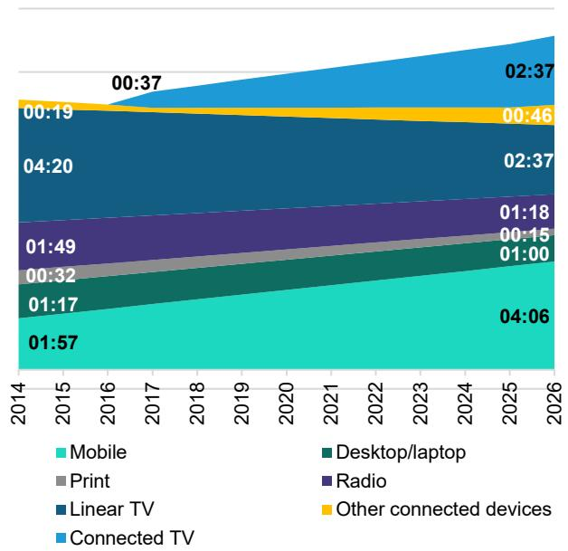

stacked bar chart

| Year | Mobile | Print | Linear TV | Desktop/laptop | Radio | Other connected devices |
| --- | --- | --- | --- | --- | --- | --- |
| 2014 | 01:57 | 00:32 | 04:20 | 01:17 | 01:49 | 00:19 |
| 2015 | 01:17 | 00:32 | 04:20 | 01:17 | 01:49 | 00:19 |
| 2016 | 01:17 | 00:32 | 04:20 | 01:17 | 01:49 | 00:19 |
| 2017 | 01:17 | 00:32 | 04:20 | 01:17 | 01:49 | 00:19 |
| 2018 | 01:17 | 00:32 | 04:20 | 01:17 | 01:49 | 00:19 |
| 2019 | 01:17 | 00:32 | 04:20 | 01:17 | 01:49 | 00:19 |
| 2020 | 01:17 | 00:32 | 04:20 | 01:17 | 01:49 | 00:19 |
| 2021 | 01:17 | 00:32 | 04:20 | 01:17 | 01:49 | 00:19 |
| 2022 | 01:17 | 00:32 | 04:20 | 01:17 | 01:49 | 00:19 |
| 2023 | 01:17 | 00:32 | 04:20 | 01:17 | 01:49 | 00:19 |
| 2024 | 01:17 | 00:32 | 04:20 | 01:17 | 01:49 | 00:19 |
| 2025 | 01:17 | 00:32 | 04:20 | 01:17 | 01:49 | 00:19 |
| 2026 | 01:17 | 00:32 | 04:20 | 01:17 | 01:49 | 00:19 |

We assumed linear growth in between 2014 and 2026 and for Connected TV between 2017 and 2026.  
Source: eMarketer, Bernstein analysis

EXHIBIT 17: US adults spend over eight hours per day with Digital Media via a multitude of disparate activities  
average hrs:mins spent per day among US adults with select platforms/digital activities, 2014-2026  
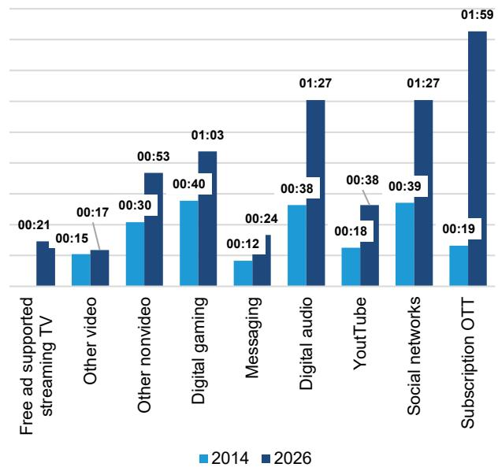

bar chart

| Category | 2014 | 2026 |
| :--- | :--- | :--- |
| Free ad supported streaming TV | 00:21 | 00:15 |
| Other video | 00:17 | 00:17 |
| Other nonvideo | 00:30 | 00:53 |
| Digital gaming | 00:40 | 01:03 |
| Messaging | 00:12 | 00:24 |
| Digital audio | 00:38 | 01:27 |
| YouTube | 00:18 | 00:38 |
| Social networks | 00:39 | 01:27 |
| Subscription OTT | 00:19 | 01:59 |

Ages 18+; includes all time spent with internet activites on any device; Free ad-supported streaming TV time is included in “other video” prior to 2021; \*includes YouTubeTV  
Source: eMarketer, Bernstein analysis

## REGULATION & MEASUREMENT

Regulation and measurement dictate a lot in advertising. Data regulations notably GDPR (General Data Protection Regulation) put limits to what can be done today with digital advertising. Here below we lay out some of the major advertising regulations. However, as a rule of thumb data regulations are more relaxed in the US than in Europe. This has implications on the data strategies companies adopt (e.g. 10 Apr 2026 - WPP and Media Complexities - Episode 2: Data Playbooks - Sizing up Walled Gardens vs Open Ecosystems).

- GDPR is an EU regulation that aims at protection personal data/privacy as it gives people control over their data while putting obligations on companies such as the implementation of certain tools and practices. The regulation has been in place since 2018.  
- The Digital Directive is also an EU regulation that aims to guarantee a safe online environment. This regulation encompasses the Digital Services Act ensures the detection of illegal content or misinformation.

Measurement is a major theme in advertising. This is linked to the fact that in advertising it is all about reaching the maximum audience and if you can measure who/how many you reach you have more pricing power. Although measurement intuitively should be easy today given we all carry a mobile phone around that connects to various Wifi networks or browse websites that are cookie enabled, the reality is that the currency on which most traditional media is measured is still outdated. For example, Outdoor advertising is still measured by people self-assessing at the end of the day. Because these measurement systems are the official ones they tend to be viewed as reliable and explain why still so much money is going to some of the traditional advertising channels notably TV.

Traditional advertising notably TV and Outdoor are seen as brand building channels with a longer-term impact on consumers' purchasing behavior (Exhibit 18). Arguably though the long-term impact is more difficult to measure. Digital advertising comes with the advantage that commercial impact can be measured pretty much instantly as the process from awareness of a product to actual purchase is much shorter (Exhibit 19/Exhibit 20).

EXHIBIT 18: Brand-building and sales activation work over different timescales  
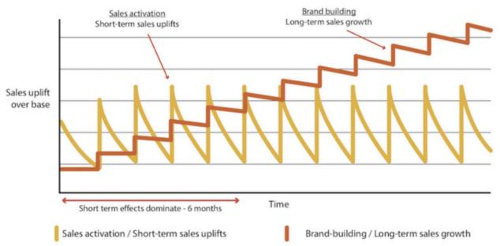

line chart

| Time Period | Sales activation / Short-term sales uplifts | Brand-building / Long-term sales growth |
| ----------- | ------------------------------------------ | ---------------------------------------- |
| Short term effects | High peaks then decline, then rise sharply | Low peak then rise, then fall sharply |
| Long-term sales growth | High volatility with stepwise increases | Low volatility with stepwise increases |

Source: Les Binet and Peter Field, Media in Focus: Marketing Effectiveness in the Digital Era, IPA

EXHIBIT 19: Digital advertising can reach the entire marketing funnel whereas traditional advertising was always limited to the top of the funnel.  
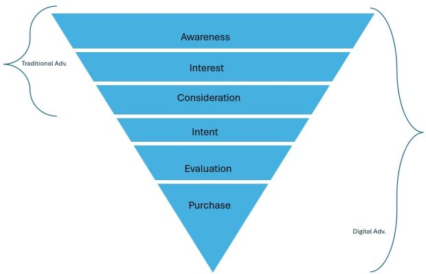

flowchart

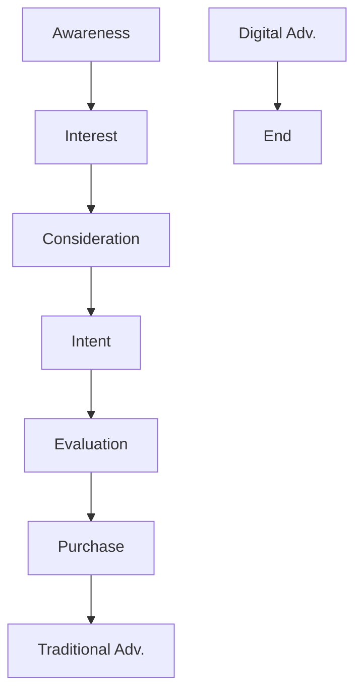

Source: Bernstein estimates and analysis

EXHIBIT 20: Particularly newer forms of Digital Advertising reduce the journey from awareness to POS  

flowchart

Source: Bernstein estimates and analysis; Images from trade press

## ADVERTISING AND AI

The future of advertising and AI depends on whether one's view is that shopping agents will take over or not. We believe the world is slightly less black and white. While shopping agents may take over some of the purchases, we believe generally the higher the stakes of the transaction, the less likely shopping agents are involved. For reference, when e-commerce gained traction in the 90s the view was that all the shopping would instantly move online and $>35$ years later, despite Covid-19 accelerating the online shopping experience, still only mid-teens percentage of all shopping is done online. This illustrates well that consumer habits tend to take time to shift. Assuming shopping agents are taking over, platforms will have to establish product preference, which ultimately will be established by advertising we believe.

For advertising market #1 and #2 we believe the stakes are slightly different:

Within advertising market #1 the traditional media owners (e.g. TV broadcasters) should be able to extract synergies from AI both on the cost (e.g. system automation) and revenue side (e.g. sales acceleration).

With AI, agencies have access to tools that allow them to perform their services in a quicker fashion putting at risk their time-based billing model. Does that mean agencies will disappear? We do not believe so - in an increasingly fragmented and complex advertising world, major companies will need helpers to plan and execute their marketing plans.

As for advertising market #2 self-serve models should allow a multiplication of advertising revenues as more SMEs tip their feet into advertising themselves. AI-driven marketing raises regulatory concerns around data privacy, misleading advertising, and brand safety, which will be difficult for any regulator to address given the ever-changing environment.

## Our teams have written various AI advertising reports over the year:

5 Nov 2025 - The Long View: Challenging AI concerns - Trust and ROI beat "wow" effect

10 Feb 2026 - Classifieds: AI meets real world challenges

## THE ADVERTISING SUB-SECTORS

## FREE-TO-AIR AND PAY TV IN TRANSITION

## Universe

Commercial TV companies generate revenues by showing consumers ads during and in between the TV shows, films and news programs they broadcast. FTA TV is perceived by brands as a mass marketing (and brand building) channel, the only one with OOH advertising.

EXHIBIT 21: Broadcasters under Bernstein coverage

<table><tr><td>Ticker</td><td>Company</td><td>Rating</td><td>Currency</td><td>Close Price</td><td>Price Target</td><td>Up-/downside</td></tr><tr><td>PSM.GR</td><td>ProSiebenSat1 Media</td><td>Market-Perform</td><td>EUR</td><td>$ 3.7</td><td>€ 4.3</td><td>16%</td></tr><tr><td>RRTL.GY</td><td>RTL Group</td><td>Market-Perform</td><td>EUR</td><td>$ 31.7</td><td>€ 37.0</td><td>17%</td></tr><tr><td>TFI.FP</td><td>Societe Television Francaise 1</td><td>Market-Perform</td><td>EUR</td><td>$ 6.8</td><td>€ 7.5</td><td>10%</td></tr><tr><td>MMT.FP</td><td>Metropole Television SA</td><td>Market-Perform</td><td>EUR</td><td>$ 11.4</td><td>€ 11.0</td><td>-4%</td></tr><tr><td>ITV.LN</td><td>ITV PLC</td><td>Market-Perform</td><td>GBp</td><td></td><td>86p</td><td>4%</td></tr><tr><td>CAN.LN</td><td>Canal+ SA</td><td>Outperform</td><td>GBp</td><td></td><td>270p</td><td>315p</td></tr><tr><td>CMCSA</td><td>Comcast Corp</td><td>Market-Perform</td><td>USD</td><td>$ 23.5</td><td>$ 32.0</td><td>36%</td></tr><tr><td>FOXA</td><td>Fox Corp</td><td>Market-Perform</td><td>USD</td><td>$ 64.3</td><td>$ 73.0</td><td>14%</td></tr><tr><td>DIS</td><td>Walt Disney Co</td><td>Outperform</td><td>USD</td><td>$ 99.4</td><td>$ 129.0</td><td>30%</td></tr><tr><td>PSKY</td><td>Paramount Skydance</td><td>Underperform</td><td>USD</td><td>$ 10.5</td><td>$ 12.0</td><td>15%</td></tr></table>

Source: Bloomberg, Bernstein estimates and analysis

## SHARE PRICE MOVERS AND SHAKERS

The main share price mover is the development of advertising revenues. The profit drop-through from advertising revenues is so high given a fixed cost base (e.g. c.80%) that a better top-line trend can have a meaningful impact on EBIT and FCF.

## KEY FINANCIALS

1. Revenue growth. Broadcasters typically rely on advertising, some content revenues, distribution revenues and other revenues depending on the diversification. What to look for: audience and revenue trends over time to see whether the broadcaster is monetizing its content effectively.

2. Advertising revenue. Advertising is the biggest source of income for free-to-air broadcasters. What to look for: change in advertising revenue, season-specific events such as Easter or sporting events can be big swing factors on a QoQ basis. As a rule of thumb free to air broadcasters used to shy away from live content (due to the higher cost). However, in the last couple of years they have started to sporadically buy selected sports content - these events drive other revenues (e.g. Sponsorship) and help to drive audiences with a positive impact on the adjacent TV shows.

3. Audience reach and share. The size of the audience is the USP of a broadcaster. It directly impacts the broadcaster's revenue potential from advertising. Investors have recently been focusing on the TV companies' online audiences as broadcasters are in the midst of changing from traditional free-to-air broadcasting to advertising video on demand (AdVoD) platforms. What to look for: broadcaster audience share and the demographics of the audience can help predict a company's performance.

4. Program costs. One of the biggest cost lines for broadcasters is programming costs. Content costs can include in-house produced shows, licensed content, and library assets. Typically, relying on local content is cheaper than American content. Also, sports events such as football can inflate content costs massively in one year. What to look for: how the budget changes YoY and what explains these changes. As TV broadcasters develop their streaming offers, some have raised their content budgets significantly.

5. Streaming adoption. The rise of digital streaming has significantly impacted traditional broadcasters, as audiences shift to online platforms. What to look for: online viewer numbers (unique and recurring) as well as time spent on the OTT (over the top) platforms.

## TRANSITION FROM LINEAR ADVERTISING TO DTC ADVERTISING IN THE US

In the US, the number of Pay TV subscribers has been declining for several years, as viewers replace traditional linear TV packages with streaming subscriptions. As a result of this shift, linear advertising revenues for US Media companies have generally been declining (Exhibit 22 and Exhibit 24) (FOXA is a notable exception), while DTC advertising revenues are growing (Exhibit 23).

While the growth in DTC advertising revenue offsets some of the linear decline, the industry total ad revenue is still declining (Exhibit 25) as eyeballs also transition to vMVPD platforms - such as YouTube TV - or social media/short form content.

EXHIBIT 22: Normalized linear advertising revenue continue to decline for all media companies except for Fox  
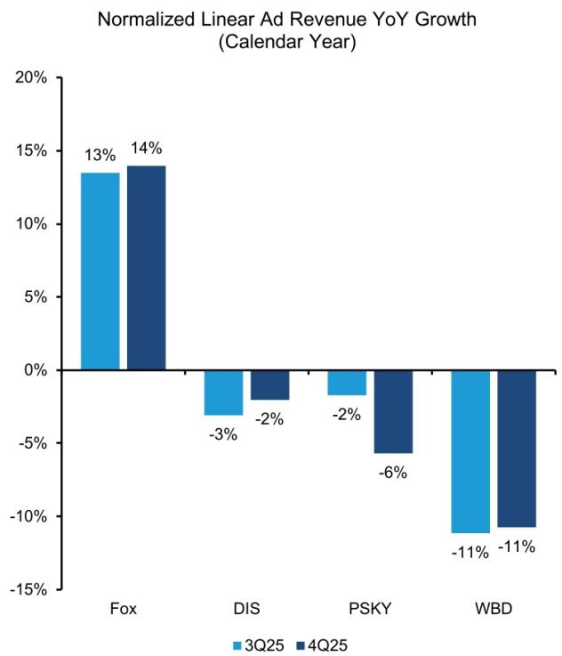

bar chart

Normalized Linear Ad Revenue YoY Growth (Calendar Year)
| Company | 3Q25 (%) | 4Q25 (%) |
| :--- | :--- | :--- |
| Fox | 13 | 14 |
| DIS | -3 | -2 |
| PSKY | -2 | -6 |
| WBD | -11 | -11 |

Normalized advertising revenue takes out the revenue from sports events such as the Olympics and the Super Bowl, and political advertising revenue around the presidential election in 2024; Fox's linear advertising revenue excludes Tubi revenue, which is our estimate; CMCSA refers to NBC Universal Source: Company filings

EXHIBIT 23: All DTC platforms had strong advertising revenue growth  
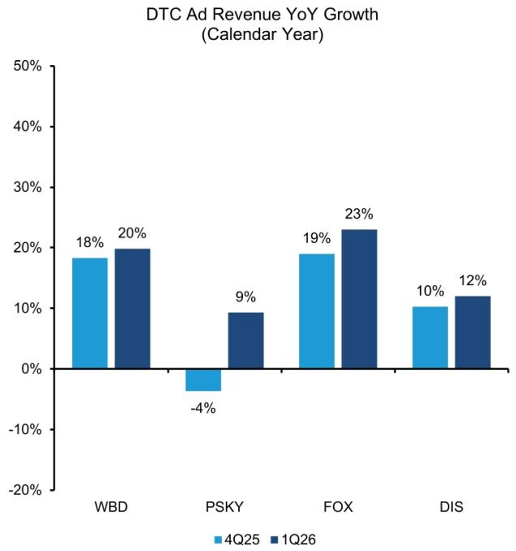

bar chart

DTC Ad Revenue YoY Growth (Calendar Year)
| Company | 4Q25 (%) | 1Q26 (%) |
| :--- | :--- | :--- |
| WBD | 18 | 20 |
| PSKY | -4 | 9 |
| FOX | 19 | 23 |
| DIS | 10 | 12 |

Fox's revenue from Tubi is based on our estimate; CMCSA refers to NBC Universal  
Source: Company reports, Bernstein estimates and analysis

EXHIBIT 24: Industry total linear advertising revenue has continued to decline, Fox remains the only player with positive linear ad revenue growth  
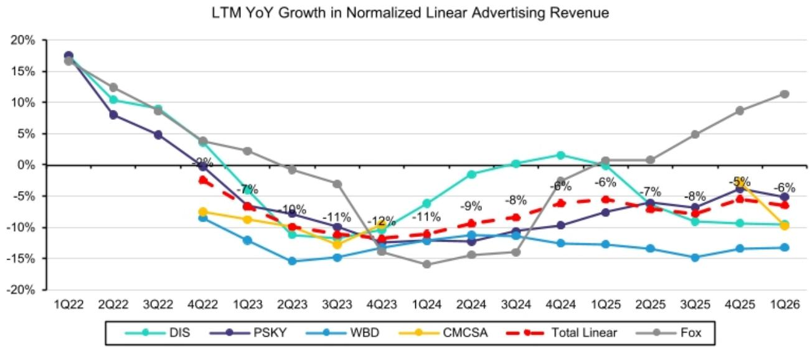

line chart

| Quarter | DIS   | PSKY  | WBD   | CMCSA | Total Linear | Fox   |
|---------|-------|-------|-------|-------|--------------|-------|
| 1Q22    | 17%   | 18%   | 17%   | 17%   | 17%          | 17%   |
| 2Q22    | 10%   | 8%    | 10%   | 10%   | 10%          | 12%   |
| 3Q22    | 9%    | 5%    | 9%    | 9%    | 9%           | 9%    |
| 4Q22    | -2%   | -2%   | -9%   | -9%   | -9%          | 4%    |
| 1Q23    | -7%   | -7%   | -10%  | -10%  | -10%         | 2%    |
| 2Q23    | -10%  | -10%  | -15%  | -10%  | -10%         | -1%   |
| 3Q23    | -11%  | -11%  | -15%  | -11%  | -11%         | -3%   |
| 4Q23    | -12%  | -12%  | -13%  | -12%  | -12%         | -15%  |
| 1Q24    | -11%  | -11%  | -13%  | -11%  | -11%         | -16%  |
| 2Q24    | -9%   | -9%   | -13%  | -9%   | -9%          | -15%  |
| 3Q24    | -8%   | -8%   | -13%  | -8%   | -8%          | -15%  |
| 4Q24    | -6%   | -6%   | -13%  | -6%   | -6%          | -8%   |
| 1Q25    | -6%   | -6%   | -13%  | -6%   | -6%          | 0%    |
| 2Q25    | -7%   | -7%   | -13%  | -7%   | -7%          | 0%    |
| 3Q25    | -8%   | -8%   | -15%  | -8%   | -8%          | 5%    |
| 4Q25    | -5%   | -5%   | -13%  | -5%   | -5%          | 9%    |
| 1Q26    | -6%   | -6%   | -13%  | -6%   | -6%          | 11%   |

Normalized advertising revenue takes out the revenue from sports events such as the Olympics and the Super Bowl, and political advertising revenue around the presidential election in 2024; Fox's linear advertising revenue excludes Tubi revenue, which is our estimate; CMCSA refers to NBC Universal.

Comcast revenue growth is removed in 2024 and 2025 due to the recasting of Ex-Versant revenues.

Source: Company reports, Bernstein estimates and analysis

## EXHIBIT 25: While the growth in DTC advertising revenue offset some of the linear decline, the industry total ad revenue is still declining

Implies Linear ad dollars not shifting fast enough to Streaming and/or new SVOD inventory (e.g., Netflix and APV) taking share

LTM YoY Growth in Normalized Linear+DTC Advertising Revenue (ex. NFLX)  
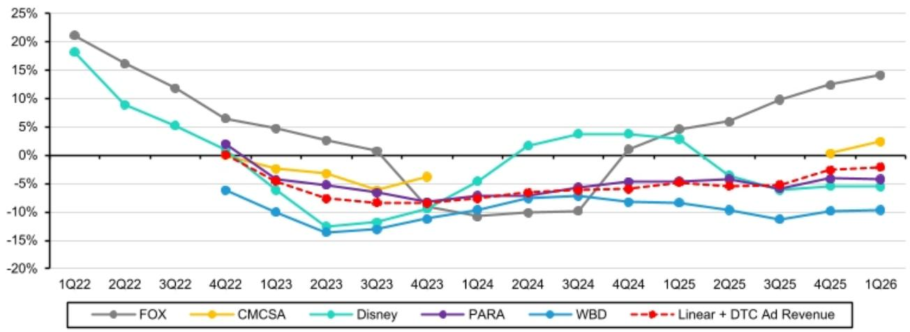

line chart

| Quarter | FOX   | CMCSA | Disney | PARA  | WBD   | Linear + DTC Ad Revenue |
|---------|-------|-------|--------|-------|-------|--------------------------|
| 1Q22    | 21.0% | -     | 18.0%  | -     | -     | -                        |
| 2Q22    | 16.0% | -     | 9.0%   | -     | -     | -                        |
| 3Q22    | 12.0% | -     | 5.0%   | -     | -     | -                        |
| 4Q22    | 7.0%  | -     | -      | 2.0%  | -6.0% | 0.0%                     |
| 1Q23    | 5.0%  | -3.0% | -6.0%  | -4.0% | -10.0%| -4.0%                    |
| 2Q23    | 3.0%  | -4.0% | -13.0% | -5.0% | -14.0%| -7.0%                    |
| 3Q23    | 1.0%  | -4.0% | -11.0% | -6.0% | -13.0%| -8.0%                    |
| 4Q23    | -     | -4.0% | -9.0%  | -7.0% | -11.0%| -9.0%                    |
| 1Q24    | -     | -     | -4.0%  | -7.0% | -10.0%| -8.0%                    |
| 2Q24    | -     | -     | 2.0%   | -7.0% | -8.0% | -7.0%                    |
| 3Q24    | -     | -     | 4.0%   | -6.0% | -8.0% | -6.0%                    |
| 4Q24    | 1.0%  | -     | 4.0%   | -5.0% | -8.0% | -5.0%                    |
| 1Q25    | 5.0%  | -     | 3.0%   | -5.0% | -8.0% | -5.0%                    |
| 2Q25    | 6.0%  | -     | -4.0%  | -5.0% | -9.0% | -5.0%                    |
| 3Q25    | 10.0% | -     | -6.0%  | -5.0% | -11.0%| -5.0%                    |
| 4Q25    | 13.0% | 1.0%  | -6.0%  | -5.0% | -10.0%| -3.0%                    |
| 1Q26    | 14.0% | 3.0%  | -6.0%  | -5.0% | -10.0%| -3.0%                    |

Normalized advertising revenue takes out the revenue from sports events such as the Olympics and the Super Bowl, and political advertising revenue around the presidential election in 2024; CMCSA refers to NBC Universal. Comcast revenue growth is removed in 2024 and 2025 due to the recasting of Ex-Versant revenues. Source: Company reports, Bernstein analysis

## CAPITAL ALLOCATION, BUYBACKS AND DIVIDENDS

EXHIBIT 26: Bernstein FTA TV coverage and track record in terms of dividends, share buybacks and M&A

<table><tr><td>Ticker</td><td>Company</td><td>Dividend</td><td>Share buyback</td><td>M&amp;A</td></tr><tr><td>PSM.GR</td><td>ProSiebenSat1 Media</td><td>+</td><td>N/A</td><td>N/A</td></tr><tr><td>RRTL.GY</td><td>RTL Group</td><td>++</td><td>N/A</td><td>N/A</td></tr><tr><td>TFI.FP</td><td>Societe Television Francaise</td><td>++</td><td>N/A</td><td>N/A</td></tr><tr><td>MMT.FP</td><td>Metropole Television SA</td><td>++</td><td>N/A</td><td>N/A</td></tr><tr><td>ITV.LN</td><td>ITV PLC</td><td>+</td><td>N/A</td><td>N/A</td></tr><tr><td>CAN.LN</td><td>Canal+ SA</td><td>+</td><td>N/A</td><td>++</td></tr><tr><td>CMCSA</td><td>Comcast Corp</td><td>+</td><td>+</td><td>++</td></tr><tr><td>FOXA</td><td>Fox Corp</td><td>+</td><td>+</td><td>N/A</td></tr><tr><td>DIS</td><td>Walt Disney Co</td><td>+</td><td>+</td><td>N/A</td></tr><tr><td>PSKY</td><td>Paramount Skydance</td><td>+</td><td>N/A</td><td>++</td></tr></table>

N/A stands for no major M&A or buyback in the last couple of years
Source: Bernstein estimates and analysis

## REGULATION / COMPETITION

Competition. Free-to-air broadcasters face increasing competition from streaming services, social media and digital platforms that show short-form videos. Many of these streaming platforms, which initially launched with the idea of disrupting the traditional TV space with the adoption of subscription monetisation models, have since added advertising-funded tiers.

What are the key regulations? The biggest regulatory risk for traditional broadcasters is that certain advertising categories may be prohibited from advertising on TV entirely or at certain hours of the day.

## US VS EUROPE

Ad breaks. Ad breaks in Europe are often limited to \~12 minutes per hour in Europe, whereas in the US it's 16 minutes during the day time and 12 minutes in prime time. This varies by country and time of the day but creates a supply-side limit that can favour pricing. The ad breaks are shorter for pure players like Netflix and other DTC platforms, which range from 4 to 10 minutes per hour. Netflix and Disney+ are at the lower end of that range, while other platforms like Hulu focus more on advertising monetisation and are at the higher end of that range.

State TV. Most European countries have national broadcasters, which are in competition with the commercial broadcasters. The national broadcasters are often allowed to advertise but only during restricted time windows.

## OUTDOOR ADVERTISERS

## Universe

Often referred to as Out-of-Home advertising (OOH), outdoor advertising is the only other mass marketing channel that exists in the advertising world. OOH firms rent space (from mostly cities or councils) and place billboards or bus shelters on these spaces where they can display ads. In exchange the public sector has the right to advertise its services for a certain share of the time. There is a narrative that OOH is taking share from TV as the latter is attracting fewer viewers than in the past.

EXHIBIT 27: Listed OOH businesses

<table><tr><td>Ticker</td><td>Company</td><td>Rating</td><td>Currency</td><td>Close Price</td><td>Price Target</td><td>Up-/downside</td></tr><tr><td>SAX.GY</td><td>Stroeer SE &amp; CO KGAA</td><td>Market-Perform</td><td>EUR</td><td>€ 35.3</td><td>€ 36.0</td><td>2%</td></tr><tr><td>DEC.FP</td><td>JCDecaux SE</td><td>Market-Perform</td><td>EUR</td><td>€ 18.7</td><td>€ 20.9</td><td>12%</td></tr><tr><td>OUT.US</td><td>Outfront Media</td><td>No Rating</td><td>USD</td><td>$ 31.3</td><td></td><td></td></tr><tr><td>CCO.US</td><td>Clear Channel</td><td>No Rating</td><td>USD</td><td>$ 2.4</td><td></td><td></td></tr><tr><td>LAMR.US</td><td>Lamar Advertising</td><td>No Rating</td><td>USD</td><td>$ 149.6</td><td></td><td></td></tr></table>

Outfront Media, Clear Channel and Lamar Advertising are not covered by Bernstein Source: Bloomberg, Bernstein estimates and analysis

## SHARE PRICE DRIVERS

The key KPIs for outdoor advertising companies are organic revenue growth of the Out-of-Home divisions. Again, these are advertising revenues and therefore have a high profit drop-through and impact on FCF. Also, capex is a notable KPI in OOH. OOH is a high-capex industry, particularly as it is in the midst of digitizing its billboards and bus shelters (a process that was initiated in 2012/13). Typically, OOH firms spend 6-8% of sales on capex.

In February Mubadala Capital announced the acquisition of Clear Channel in an all-cash deal. The transaction is subject to shareholder and regulatory approvals and is expected to close by the end of 3Q26. Also for Stroeer - takeover headlines hit the press from time to time. There has been a lot of M&A in the space over the last 12m, and we would not be surprised to see more of this in the coming 12m.

## KEY FINANCIALS

1. OOH revenues. Outdoor advertisers rely on advertising as their main revenue source. What to look for: track OOH revenues over time. Extraordinary events that are advertised on billboards (e.g. the Olympics) can impact OOH advertising revenues positively.  
2. Rent is typically the largest cost line for outdoor advertisers. They pay landlords (e.g. cities or other private landlords) rents to be able to put their billboards or bus shelters in a certain location. Since the introduction of IFRS16, seeing the rent impact on a like-for-like basis has been challenging.  
3. Capex. Outdoor advertising is a high-capex business model. Typically, European OOH spend 6-8% of sales on capex per year. This is a lot for the media sector. The capex is spent on the construction of billboards or bus shelters. Capital expenditure has been particularly high since 2012/13, when the inventory started to become digital

CAPITAL ALLOCATION, BUYBACKS AND DIVIDENDS

EXHIBIT 28: Listed OOH businesses

<table><tr><td>Ticker</td><td>Company</td><td>Dividend</td><td>Share buyback</td><td>M&amp;A</td></tr><tr><td>SAX.GY</td><td>Stroeer SE &amp; CO KGAA*</td><td>+</td><td>+</td><td>N/A</td></tr><tr><td>DEC.FP</td><td>JCDecaux SE</td><td>+</td><td>N/A</td><td>+</td></tr><tr><td>OUT.US</td><td>Outfront Media</td><td>+</td><td>+</td><td>N/A</td></tr><tr><td>CCO.US</td><td>Clear Channel</td><td>N/A</td><td>N/A</td><td>N/A</td></tr><tr><td>LAMR.US</td><td>Lamar Advertising</td><td>+</td><td>++</td><td>N/A</td></tr></table>

Outfront Media, Clear Channel and Lamar Advertising are not covered by Bernstein. \*Stroeer executed once in its history a small buyback Source: Bernstein estimates and analysis

## US VS EUROPE

The US has three listed OOH firms, Clear Channel, Lamar Advertising and Outfront Media. Lamar is closest to Stroeer in that both are more regional businesses whose key clients are SMEs. Clear Channel, JCDecaux and Outfront Media compare more easily from a client point of view and in terms of geographic exposure. Outfront Media and Lamar Advertising are both REITs. Clear Channel has been taken out but the deal is currently undergoing regulatory checks.

## ADVERTISING AGENCIES

## Universe

These agencies can be thought of as consultants that help brands to plan, buy and launch their advertising campaigns. In most cases (although the revenue model is about to change), they are paid commissions on the work they do for the brands. The biggest cost line for these companies is staff.

The industry is currently facing an unprecedented consolidation - the merger of Omnicom and IPG in 2025 led to four (down from 5) major holding advertising agencies, a competitive dynamic not seen in over 15 years. It was in 2012 /13 when Dentsu joined the ranks of the holdcos as it acquired Aegis. Prior to this the 4 leading agencies had dominated the space since pretty much the 1990s.

EXHIBIT 29: Listed advertisement agencies

<table><tr><td>Ticker</td><td>Company</td><td>Rating</td><td>Currency</td><td>Close Price</td><td>Price Target</td><td>Up-/downside</td></tr><tr><td>PUB.FP</td><td>Publicis Groupe</td><td>Outperform</td><td>EUR</td><td>€ 89.2</td><td>€ 115.0</td><td>29%</td></tr><tr><td>WPP.LN</td><td>WPP PLC</td><td>Market-Perform</td><td>GBp</td><td>271p</td><td>332p</td><td>22%</td></tr><tr><td>Havas.LN</td><td>Havas NV</td><td>Outperform</td><td>EUR</td><td>€ 16.2</td><td>€ 21.0</td><td>30%</td></tr><tr><td>OMC.US</td><td>Omnicom</td><td>No Rating</td><td>USD</td><td>$ 73.7</td><td></td><td></td></tr><tr><td>DNTUY</td><td>Dentsu</td><td>No Rating</td><td>Yen</td><td>¥ 2,989</td><td></td><td></td></tr></table>

Source: Bloomberg, Bernstein estimates and analysis

## SHARE PRICE DRIVERS

Organic revenue growth is the key metric that investors focus on for agencies. The other KPI is operating margin, as agencies have demonstrated that they are able to grow margin even though they are operating in a sector that is in constant flux.

## KEY FINANCIALS

1. Revenue growth. Agency revenue growth used to correlate to GDP growth. This is because the C-suite has the view that macro deterioration stands for less consumer purchasing power. We believe exactly in these instances, it is important to advertise to grab a higher share of the consumer wallet. What to look for: organic revenue growth and how it compares to peers.  
2. US revenues. Investors tend to concentrate on US growth as in the US most agencies have larger media-buying operations (a scale business) which therefore implies bigger margins.  
3. Operating profit. Agencies have over the past two decades demonstrated that they can deliver on margin despite operating in a sector that is in constant flux. Agencies are people businesses, and for the last decades revenue and staff inflation have been correlated. Since last year (is it AI or the unprecedented market structure?) we have seen for the first time a de-correlation between staff/revenue inflation. If this is to persist it could be a catalyst for agency margins. What to look for: any comments regarding salary progression or off-shore ambitions can give an indication as to how a company handles its margins.

There is a narrative out there that the disconnect seen between revenue growth and wage inflation observed at some agencies at FY25 is due to AI. We do not believe this is the case (for now) - for reference as we speak both WPP and Publicis have c.3k live job listings on their respective websites, which does not scream AI efficiencies - but if a disconnect between revenue and wage inflation would be persistent this would be a catalyst for agencies' margins.

CAPITAL ALLOCATION, BUYBACKS AND DIVIDENDS

EXHIBIT 30: Agencies tend to pay out dividends and occasionally carry out buybacks

<table><tr><td>Ticker</td><td>Company</td><td>Dividend</td><td>Share buyback</td><td>M&amp;A</td></tr><tr><td>PUB.FP</td><td>Publicis Groupe</td><td>+</td><td>+</td><td>+</td></tr><tr><td>WPP.LN</td><td>WPP PLC</td><td>+</td><td>+</td><td>+</td></tr><tr><td>Havas.LN</td><td>Havas NV</td><td>+</td><td>+</td><td>+</td></tr><tr><td>OMC.US</td><td>Omnicom</td><td>+</td><td>+</td><td>++</td></tr><tr><td>DNTUY</td><td>Dentsu</td><td>+</td><td>+</td><td>N/A</td></tr></table>

Source: Bernstein estimates and analysis

## US VS EUROPE

While Omnicom is the only listed major American agency, Publicis is almost American as it derives 60% of its revenues from the continent. American agencies tend to have higher profit margins as they benefit from greater economies of scale.

## CLASSIFIEDS

## Universe

Think of the car or house ads that used to be at the back of a newspaper or on a flyer in your post box. Classifieds are essentially that but in a digital format. These days consumers visit websites to browse used cars or houses. Revenues are generated by charging subscriptions to dealers/agencies allowing them to list their inventory on the classifieds' website.

EXHIBIT 31: Classifieds under our coverage

<table><tr><td>Ticker</td><td>Company</td><td>Rating</td><td>Currency</td><td>Close Price</td><td>Price Target</td><td>Up-/downside</td></tr><tr><td>G24.GY</td><td>Scout24 SE</td><td>Outperform</td><td>EUR</td><td>€ 74.5</td><td>€ 90.0</td><td>21%</td></tr><tr><td>RMV.LN</td><td>Rightmove PLC</td><td>Outperform</td><td>GBp</td><td>440p</td><td>563p</td><td>28%</td></tr><tr><td>AUTO.LN</td><td>Autotrader Group PLC</td><td>Market-Perform</td><td>GBp</td><td>460p</td><td>545p</td><td>19%</td></tr><tr><td>ZG.US</td><td>Zillow Group</td><td>Outperform</td><td>USD</td><td>$ 35.5</td><td>$ 70.0</td><td>97%</td></tr></table>

Source: Bloomberg, Bernstein estimates and analysis

## SHARE PRICE DRIVERS

Generally ARPU/A (average revenue per agency/dealer) and dealer/agent penetration numbers are share price drivers, but the last 10 month the industry (and the share prices) have been dominated by AI disintermediation fears.

## KEY FINANCIALS

1. Revenue growth: Revenue growth is predominantly a metric of ARPU/A (average revenue per agency/dealer) and dealer/agent penetration numbers are share price drivers. Classifieds tend to charge their services via memberships that they sell to agencies and dealers - these drive ARPU. Often classifieds sell add-on services on top of the membership features.  
2. EBITDA margin: Leading classified players consistently exhibit very high margins across many geographies. This is the by-product of 1) enjoying a content supply paid for by external contributors (the ultimate sweet spot for a “media” business!) 2) underlying markets liquidity optimized by the dominance of one player by geo/vertical.

## CAPITAL ALLOCATION, BUYBACKS AND DIVIDENDS

EXHIBIT 32: Classifieds tend to pay out dividends and buybacks

<table><tr><td>Ticker</td><td>Company</td><td>Dividend</td><td>Share buyback</td><td>M&amp;A</td></tr><tr><td>G24.GY</td><td>Scout24 SE</td><td>+</td><td>++</td><td>++</td></tr><tr><td>RMV.LN</td><td>Rightmove PLC</td><td>+</td><td>++</td><td>N/A</td></tr><tr><td>AUTO.LN</td><td>Autotrader Group PLC</td><td>+</td><td>++</td><td>N/A</td></tr><tr><td>ZG.US</td><td>Zillow Group</td><td>N/A</td><td>++</td><td>+</td></tr></table>

Source: Bernstein estimates and analysis

## US VS EUROPE

There are multiple listed US classifieds; we only cover Zillow. A major difference between Europe and the US is that in the former the focus monetizes seller leads, in the latter it is more common to monetize buyer leads. US classifieds have experimented more with the transactional element of classifieds. In Europe, these places remain high margin marketplaces.

For example, Zillow is shifting from a prepaid advertising model for buyer leads toward a post-transaction take rate model. Zillow's involvement in housing transactions goes beyond buyer lead monetization as well (e.g., booking tours, financing, and listing monetization). The US also has real estate Multiple Listing Service (MLS) networks, which are databases where real estate agents pool property listings and cooperate on sales under the regulatory framework. In Europe, there is no real MLS equivalent and markets are therefore more portal-centric.

## AD TECH

## Universe

These programmatic platforms use data and algorithms to help advertisers buy and optimize digital media across channels like display, video and CTV in real time. They are intermediaries and sit in between brands, agencies and retailers - they then use the data available to them to target audiences, measure performance and drive higher return on ad spend.

EXHIBIT 33: Ad tech

<table><tr><td>Ticker</td><td>Company</td><td>Rating</td><td>Currency</td><td>Close Price</td><td>Price Target</td><td>Up-/downside</td></tr><tr><td>TTD.US</td><td>Trade Desk</td><td>No Rating</td><td>USD</td><td>$ 20.6</td><td></td><td></td></tr><tr><td>CRTO.US</td><td>Criteo</td><td>Outperform</td><td>USD</td><td>$ 17.2</td><td>$ 35.0</td><td>104%</td></tr></table>

Source: Bloomberg, Bernstein estimates and analysis

## SHARE PRICE DRIVERS

Revenue acceleration/deceleration as well as headlines around adapting to an ever-changing ecosystem. In the current context a key question for Criteo is for instance whether agentic AI will shorten consumer journeys, and reduce ad exposure opportunities. A key monetization model for shopping agents, and LLMs platforms will be to tap the advertising market. This will open yet another source of ad inventory, with high intent value (cue Generative Engine Optimization). Management sees agents as an “enhanced search” tool, and believes that its network and transactions dataset (\$1tn of transactions and 4.5bn products SKUs “seen” every year) will remain critical to deliver contextual advertising. The company has also launched an “Agentic Commerce Recommendation Service”, which “assists” AI shopping assistants by surfacing relevant items (incl. availability, user preferences) and proposing a curated short list of recommendations. This could emerge as an organic way of reaching agents (vs the paid GEO approach).

## KEY FINANCIALS

1. Revenue growth For Trade Desk "Platform spend" is a key metric as trade desk takes 15-20% of these gross revenues going through the platform. For Criteo "Contribution ex-TAC", which reflects the group's revenue minus Traffic Acquisition Costs, is a key metric.  
2. EBITDA margin On the profitability side ad tech companies tend to focus on Adjusted EBITDA, which comes pre capex (HSD to 10% of revs at CRTO), and pre share based compensation which is a sizeable cost line

## CAPITAL ALLOCATION, BUYBACKS AND DIVIDENDS

EXHIBIT 34: Ad Tech capital allocation

<table><tr><td>Ticker</td><td>Company</td><td>Dividend</td><td>Share buyback</td><td>M&amp;A</td></tr><tr><td>TTD.US</td><td>Trade Desk*</td><td>N/A</td><td>+</td><td>N/A</td></tr><tr><td>CRTO.US</td><td>Criteo</td><td>N/A</td><td>++</td><td>N/A</td></tr></table>

Trade Desk executes a minimal buyback  
Source: Bloomberg, Bernstein estimates and analysis

## US VS EUROPE

There are no major data ad tech data platforms headquartered in Europe, we believe this is due to the fact that data regulation is much stricter in Europe.

## SOCIAL MEDIA

## Universe

These large-scale platforms allow users to create, engage with and share content. This leads to highly engaged communities around certain topics that can then be monetized via targeted advertising.

EXHIBIT 35: Bernstein's Social Media coverage

<table><tr><td>Ticker</td><td>Company</td><td>Rating</td><td>Currency</td><td>Close Price</td><td>Price Target</td><td>Up-/downside</td></tr><tr><td>RDDT.US</td><td>Reddit Inc</td><td>Market-Perform</td><td>USD</td><td>$ 169.5</td><td>$ 190.0</td><td>12%</td></tr><tr><td>META.US</td><td>Meta Platforms Inc</td><td>Outperform</td><td>USD</td><td>$ 623.0</td><td>$ 850.0</td><td>36%</td></tr><tr><td>PINS.US</td><td>Pinterest Inc</td><td>Outperform</td><td>USD</td><td>$ 20.7</td><td>$ 28.0</td><td>35%</td></tr><tr><td>SNAP.US</td><td>Snap Inc</td><td>Market-Perform</td><td>USD</td><td>$ 5.7</td><td>$ 7.0</td><td>22%</td></tr></table>

Source: Bloomberg, Bernstein estimates and analysis

## SHARE PRICE DRIVERS

Top-line growth remains the most important metric for our covered companies. Since CPMs are an output of advertising supply and demand, and the shift in ad formats wreaks havoc on traditional P\*Q approaches to forecasting digital advertising markets, we think the best way to think about top-line growth is in terms of (1) how fast the market growing; and (2) whether each specific company is gaining or losing share

## KEY FINANCIALS

1. Revenue growth The most important metric for these players is advertising revenue, but each company also has other particular revenue streams. Reddit has other revenue tied to its data licensing business, where it closed substantial deals with players such as Google and OpenAI last year, but its growth looks set to slow as it has only signed deals with smaller players. AppLovin also monetises through in-app purchases, which include fees collected from users who purchase virtual goods in mobile games, and Roku has its own hardware business.

2. Users. An important measure of engagement is user/subscriber growth, while Average Revenue per User (ARPU) is a measure of monetisation. Reddit discloses its number of Daily Active Users (DAU) per quarter, split into US and ROW.

## CAPITAL ALLOCATION, BUYBACKS AND DIVIDENDS

EXHIBIT 36: Social Media - capital allocation

<table><tr><td>Ticker</td><td>Company</td><td>Dividend</td><td>Share buyback</td><td>M&amp;A</td></tr><tr><td>RDDT.US</td><td>Reddit Inc</td><td>N/A</td><td>+</td><td>+</td></tr><tr><td>META.US</td><td>Meta Platforms Inc</td><td>+</td><td>+</td><td>+</td></tr><tr><td>PINS.US</td><td>Pinterest Inc</td><td>N/A</td><td>++</td><td>+</td></tr><tr><td>SNAP.US</td><td>Snap Inc</td><td>N/A</td><td>+</td><td>N/A</td></tr></table>

Source: Bloomberg, Bernstein estimates and analysis

## US VS EUROPE

There are no social media platforms listed in Europe. The more significant competition here is based in Asia.

## MARKETPLACES

## Universe

These digital platforms connect buyers and sellers. The raison d'être is providing merchants with access to a large audience without having to build their own storefront from scratch. Other services provided by these platforms include the infrastructure for listings, payments, and often fulfillment. The products sold depend on the platform.

EXHIBIT 37: Marketplace coverage

<table><tr><td>Ticker</td><td>Company</td><td>Rating</td><td>Currency</td><td>Close Price</td><td>Price Target</td><td>Up-/downside</td></tr><tr><td>EBAY.US</td><td>Ebay</td><td>Market-Perform</td><td>USD</td><td>$ 108.8</td><td>$ 100.0</td><td>-8%</td></tr><tr><td>AMZN.US</td><td>Amazon</td><td>Outperform</td><td>USD</td><td>$ 250.0</td><td>$ 315.0</td><td>26%</td></tr><tr><td>ETSY.US</td><td>Etsy</td><td>Market-Perform</td><td>USD</td><td>$ 67.1</td><td>$ 65.0</td><td>-3%</td></tr></table>

Source: Bloomberg, Bernstein estimates and analysis

## SHARE PRICE DRIVERS

The main topics that drive the share price of these companies beyond macro are the competitive dynamics and the broader e-commerce demand.

## KEY FINANCIALS

1. GMV, which measures the total transaction value processed through the platform before any deductions.  
2. Take-rate, which equals the percentage of transaction value the platform captures as revenue, and is indicative of value-added services and advertising revenue.  
3. Operating profit and/or EBITDA margin, which captures profits after operating expenses including marketing intensity, fixed costs, and other costs.

## CAPITAL ALLOCATION, BUYBACKS AND DIVIDENDS

EXHIBIT 38: Marketplace capital allocation

<table><tr><td>Ticker</td><td>Company</td><td>Dividend</td><td>Share buyback</td><td>M&amp;A</td></tr><tr><td>EBAY.US</td><td>Ebay</td><td>+</td><td>+</td><td>+</td></tr><tr><td>AMZN.US</td><td>Amazon</td><td>N/A</td><td>N/A</td><td>+</td></tr><tr><td>ETSY.US</td><td>Etsy</td><td>N/A</td><td>+</td><td>+</td></tr></table>

Source: Bloomberg, Bernstein estimates and analysis

## US VS EUROPE

There are no similar marketplaces listed in Europe. The closest is Allegro in Poland, which is not covered at Bernstein.

## COMMERCE ADVERTISING / RETAIL MEDIA

## Universe

The main raison d'être of these companies is not advertising but when breaking down their profitability one notices that a disproportionately large chunk is coming from advertising. Think Food Delivery companies for example, they benefit enormously from retail media.

A Retail Media network refers to advertising displayed within a retail online environment. It is similar to display advertising but instead of the advertisement being put on a random website, it is placed on the website/app of the retailer, which puts it closer to the point of sale. Retailers' consumer data (think purchase history, browsing and payment method, location, etc.) and insights help brands target their advertising to consumers, while the retailers themselves benefit from a new high-margin revenue stream, advertising, at seemingly no cost.

EXHIBIT 39: Our Retail Media coverage

<table><tr><td>Ticker</td><td>Company</td><td>Rating</td><td>Currency</td><td>Close Price</td><td>Price Target</td><td>Up-/downside</td></tr><tr><td>GOOGL.US</td><td>Alphabet Inc</td><td>Market-Perform</td><td>USD</td><td>$ 359.0</td><td>$ 390.0</td><td>9%</td></tr><tr><td>CART.US</td><td>Maplebear Inc</td><td>Outperform</td><td>USD</td><td>$ 40.0</td><td>$ 50.0</td><td>25%</td></tr><tr><td>UBER.US</td><td>Uber Technologies Inc</td><td>Outperform</td><td>USD</td><td>$ 71.7</td><td>$ 110.0</td><td>53%</td></tr><tr><td>DASH.US</td><td>DoorDash Inc</td><td>Outperform</td><td>USD</td><td>$ 154.6</td><td>$ 270.0</td><td>75%</td></tr><tr><td>DHER.GY</td><td>Delivery Hero</td><td>Outperform</td><td>EUR</td><td>€ 38.1</td><td>€ 28.0</td><td>-27%</td></tr></table>

Source: Bloomberg, Bernstein estimates and analysis

## SHARE PRICE DRIVERS

The share prices of many of these stocks are driven by M&A headlines. While Alphabet is sensitive to Cloud and Search growth KPIs, the food delivery companies are also sensitive to regulation changes notably around the hiring model of drivers.

## KEY FINANCIALS

1. Revenue. Revenue growth is driven by order numbers and basket size for the food delivery companies. However, they have adjacent revenue lines notably advertising, which have a disproportionate impact on profitability.  
2. EBITDA margin and FCF. The food delivery market is still in consolidation mode, this has as an implication that incumbents are still spending heavily to fend of competition (this and continued regulatory issues/fines) have an adverse impact on profitability and cash generation. Investors are looking for consistent cash generation.

CAPITAL ALLOCATION, BUYBACKS AND DIVIDENDS  
EXHIBIT 40: Retail Media capital allocation

<table><tr><td>Ticker</td><td>Company</td><td>Dividend</td><td>Share buyback</td><td>M&amp;A</td></tr><tr><td>GOOGL.US</td><td>Alphabet Inc</td><td>+</td><td>+</td><td>N/A*</td></tr><tr><td>CART.US</td><td>Maplebear Inc</td><td>N/A</td><td>+</td><td>N/A</td></tr><tr><td>UBER.US</td><td>Uber Technologies Inc</td><td>N/A</td><td>+</td><td>+</td></tr><tr><td>DASH.US</td><td>DoorDash Inc</td><td>N/A</td><td>+</td><td>+</td></tr><tr><td>DHER.GY</td><td>Delivery Hero</td><td>N/A</td><td>N/A</td><td>+</td></tr></table>

\*limited due to concentration issues  
Source: Bloomberg, Bernstein estimates and analysis

## US VS EUROPE

Only Delivery Hero is listed in Europe even though it barely has any operations in Europe. The market is consolidating, with DoorDash's acquisition of Deliveroo following Prosus' acquisition of Just Eat Takeaway in 2025. There is more recent movement toward further consolidation as well (see: UBER and DASH: Delivery Hero is on the menu — a pro forma P&L). DoorDash is investing behind Deliveroo's integration, and cost synergies and heightened competition are key themes to watch for on the back of consolidation.

On the advertising side, there is no major difference between US and European food delivery companies. We believe though the more developed tipping nature of the US should play into the cards of US food delivery firms over the rest of the world where the tipping nature is more subdued.

## APPENDIX - FINANCIAL FORECASTS

## ACRONYMS

CPM/CPT: cost per thousand. This is a measurement metric in media. It provides the cost for media based on thousand impressions.

Cost-plus model: This is a licensing deal model in which a broadcaster/streamer/network pays a production house for the entire cost of production. It also pays the production margin and a premium for the rights to broadcast the show on certain channels for a pre-defined length of time.

Display advertising: It refers to advertising on a website for example the small ads that one can see on the right / left or top of a website.

Media buyer: This is a person that works in a media agency and is in charge of buying media space/inventory i.e. TV slots, Billboard space or digital space for example.

Media planner: This is a person that works in an advertising agency and helps big brands to allocate their budget to different media channels such as TV, OOH, Digital etc

Retail Media: It refers to advertising in an online retail environment. It is similar to display advertising but contrarily to the former, it is usually closer to a point of sale.

Demand side platform / DSP: It is a platform tool that helps advertisers automatically buy online ads across many media channels.

Supply side platform / SSP: It is platform that helps media owners to automatically sell their ad space to many different buyers, aiming to get the best price for each impression.

## INITIATIONS PUBLISHED IN 2025 & 2026

12 Jan 2026 - Auto Trader: Greasing the wheels of the used car ecosystem — Initiating at Market-Perform

5 Nov 2025 - Scout24: Home alone - Initiating at Outperform

1 Oct 2025 - Rightmove: Innovating from strong foundations - Initiating at Outperform

16 Jul 2025 - Informa: Clone and conquer

## INDUSTRY PRIMERS PUBLISHED IN 2025 & 2026

5 Sep 2025 - US Internet 101: A back-to-school primer on Digital Ads, eCommerce, and On-Demand services

5 Nov 2025 - The Long View: Challenging AI concerns - Trust and ROI beat "wow" effect

30 Sep 2025 - Global Internet: Top of the Funnel goes (Nano) Banana(s)

10 Feb 2026 - Classifieds: AI meets real world challenges

3 Mar 2025 - Global Internet: 10 things that matter at the Top of the Funnel

BERNSTEIN TICKER TABLE

<table><tr><td rowspan="2"></td><td colspan="4">5 Jun 2026</td><td rowspan="2">TTMRel.</td><td colspan="4">Adjusted EPS</td><td colspan="3">Adjusted P/E (x)</td></tr><tr><td colspan="2"></td><td rowspan="2">ClosingPrice</td><td rowspan="2">PriceTarget</td><td colspan="4"></td><td colspan="3"></td></tr><tr><td>Ticker</td><td>Rating</td><td>Cur</td><td>Perf.</td><td>Cur</td><td>2025A</td><td>2026E</td><td>2027E</td><td>2025A</td><td>2026E</td><td>2027E</td></tr><tr><td>HAVAS.NA (Havas)</td><td>O</td><td>EUR</td><td>16.70</td><td>21.00</td><td>(1.2)%</td><td>EUR</td><td>1.91</td><td>2.03</td><td>2.13</td><td>8.7</td><td>8.2</td><td>7.8</td></tr><tr><td>WPP.LN (WPP)</td><td>M</td><td>GBp</td><td>262.70</td><td>332.00</td><td>(65.4)%</td><td>GBP</td><td>0.63</td><td>0.51</td><td>0.52</td><td>4.2</td><td>5.2</td><td>5.0</td></tr><tr><td>PUB.FP (Publicis)</td><td>O</td><td>EUR</td><td>87.44</td><td>115.00</td><td>(20.3)%</td><td>EUR</td><td>7.48</td><td>7.86</td><td>8.37</td><td>11.7</td><td>11.1</td><td>10.4</td></tr><tr><td>ITV.LN (ITV)</td><td>M</td><td>GBp</td><td>82.65</td><td>86.00</td><td>(4.5)%</td><td>GBP</td><td>0.08</td><td>0.09</td><td>0.09</td><td>9.8</td><td>9.7</td><td>9.2</td></tr><tr><td>PSM.GR (ProSieben)</td><td>M</td><td>EUR</td><td>3.71</td><td>4.30</td><td>(60.0)%</td><td>EUR</td><td>0.90</td><td>0.63</td><td>0.83</td><td>4.1</td><td>5.9</td><td>4.5</td></tr><tr><td>RRTL.GY (RTL)</td><td>M</td><td>EUR</td><td>31.55</td><td>37.00</td><td>(18.7)%</td><td>EUR</td><td>0.15</td><td>2.62</td><td>2.78</td><td>214.8</td><td>12.0</td><td>11.4</td></tr><tr><td>TFI.FP (TF1)</td><td>M</td><td>EUR</td><td>6.79</td><td>7.50</td><td>(33.4)%</td><td>EUR</td><td>0.69</td><td>0.57</td><td>0.64</td><td>9.8</td><td>11.9</td><td>10.6</td></tr><tr><td>MMT.FP (M6)</td><td>M</td><td>EUR</td><td>11.48</td><td>11.00</td><td>(21.1)%</td><td>EUR</td><td>1.24</td><td>0.95</td><td>1.21</td><td>9.3</td><td>12.1</td><td>9.5</td></tr><tr><td>CRTO (Criteo)</td><td>O</td><td>USD</td><td>17.29</td><td>35.00</td><td>(45.3)%</td><td>USD</td><td>4.62</td><td>3.95</td><td>4.13</td><td>3.7</td><td>4.4</td><td>4.2</td></tr><tr><td>DEC.FP (JCDecaux)</td><td>M</td><td>EUR</td><td>18.69</td><td>20.90</td><td>5.0%</td><td>EUR</td><td>1.25</td><td>1.30</td><td>1.48</td><td>14.9</td><td>14.4</td><td>12.7</td></tr><tr><td>SAX.GR (Stroeer)</td><td>M</td><td>EUR</td><td>35.12</td><td>36.00</td><td>(45.9)%</td><td>EUR</td><td>2.70</td><td>2.55</td><td>3.00</td><td>13.0</td><td>13.8</td><td>11.7</td></tr><tr><td>AUTO.LN (Auto Trader)</td><td>M</td><td>GBp</td><td>468.70</td><td>545.00</td><td>(53.1)%</td><td>GBP</td><td>0.33</td><td>0.34</td><td>0.40</td><td>14.3</td><td>13.9</td><td>11.7</td></tr><tr><td>RMV.LN (Rightmove)</td><td>O</td><td>GBp</td><td>438.80</td><td>563.00</td><td>(54.6)%</td><td>GBP</td><td>0.28</td><td>0.30</td><td>0.34</td><td>15.7</td><td>14.5</td><td>13.0</td></tr><tr><td>G24.GR (Scout24)</td><td>O</td><td>EUR</td><td>74.60</td><td>90.00</td><td>(50.0)%</td><td>EUR</td><td>3.47</td><td>4.19</td><td>4.85</td><td>21.5</td><td>17.8</td><td>15.4</td></tr><tr><td>UBER (Uber )</td><td>O</td><td>USD</td><td>72.21</td><td>110.00</td><td>(40.3)%</td><td>USD</td><td>2.45</td><td>3.35</td><td>4.37</td><td>29.4</td><td>21.6</td><td>16.5</td></tr><tr><td>DASH (DoorDash)</td><td>O</td><td>USD</td><td>160.07</td><td>270.00</td><td>(50.9)%</td><td>USD</td><td>5.08</td><td>5.48</td><td>7.84</td><td>31.5</td><td>29.2</td><td>20.4</td></tr><tr><td>ZG (Zillow)</td><td>O</td><td>USD</td><td>35.98</td><td>70.00</td><td>(72.6)%</td><td>USD</td><td>1.65</td><td>2.26</td><td>3.15</td><td>21.8</td><td>15.9</td><td>11.4</td></tr><tr><td>CART (Instacart)</td><td>O</td><td>USD</td><td>41.48</td><td>50.00</td><td>(35.0)%</td><td>USD</td><td>3.42</td><td>4.05</td><td>4.70</td><td>12.1</td><td>10.3</td><td>8.8</td></tr><tr><td>LYFT (Lyft)</td><td>M</td><td>USD</td><td>14.12</td><td>16.00</td><td>(35.6)%</td><td>USD</td><td>1.31</td><td>1.59</td><td>1.88</td><td>10.8</td><td>8.9</td><td>7.5</td></tr><tr><td>EBAY (eBay)</td><td>M</td><td>USD</td><td>109.15</td><td>100.00</td><td>17.1%</td><td>USD</td><td>5.52</td><td>6.12</td><td>6.45</td><td>19.8</td><td>17.8</td><td>16.9</td></tr><tr><td>ETSY (Etsy)</td><td>M</td><td>USD</td><td>67.05</td><td>65.00</td><td>(16.4)%</td><td>USD</td><td>4.80</td><td>5.97</td><td>7.07</td><td>14.0</td><td>11.2</td><td>9.5</td></tr><tr><td>W (Wayfair )</td><td>M</td><td>USD</td><td>72.49</td><td>85.00</td><td>30.5%</td><td>USD</td><td>2.60</td><td>2.76</td><td>3.68</td><td>27.9</td><td>26.3</td><td>19.7</td></tr><tr><td>NFLX (Netflix)</td><td>O</td><td>USD</td><td>81.52</td><td>110.00</td><td>(56.5)%</td><td>USD</td><td>2.53</td><td>3.20</td><td>3.80</td><td>32.3</td><td>25.5</td><td>21.5</td></tr><tr><td>DIS (Disney)</td><td>O</td><td>USD</td><td>99.34</td><td>129.00</td><td>(35.3)%</td><td>USD</td><td>5.93</td><td>6.85</td><td>7.37</td><td>16.8</td><td>14.5</td><td>13.5</td></tr><tr><td>WBD (Warner Bros)</td><td>M</td><td>USD</td><td>27.00</td><td>27.75</td><td>155.7%</td><td>USD</td><td>0.29</td><td>(1.23)</td><td>(0.32)</td><td>93.1</td><td>(22.0)</td><td>(85.3)</td></tr><tr><td>PSKY (Paramount Skydance)</td><td>U</td><td>USD</td><td>10.68</td><td>12.00</td><td>NA</td><td>USD</td><td>0.52</td><td>0.66</td><td>0.60</td><td>20.5</td><td>16.2</td><td>17.8</td></tr><tr><td>FOXA (Fox)</td><td>M</td><td>USD</td><td>65.54</td><td>73.00</td><td>(0.5)%</td><td>USD</td><td>4.47</td><td>5.16</td><td>5.81</td><td>14.6</td><td>12.7</td><td>11.3</td></tr><tr><td>CMCSA (Comcast)</td><td>M</td><td>USD</td><td>23.33</td><td>32.00</td><td>(50.2)%</td><td>USD</td><td>4.30</td><td>3.34</td><td>3.90</td><td>5.4</td><td>7.0</td><td>6.0</td></tr><tr><td>GOOGL (Alphabet)</td><td>M</td><td>USD</td><td>372.19</td><td>390.00</td><td>96.3%</td><td>USD</td><td>10.81</td><td>14.47</td><td>14.32</td><td>34.4</td><td>25.7</td><td>26.0</td></tr><tr><td>AMZN (Amazon)</td><td>O</td><td>USD</td><td>253.79</td><td>315.00</td><td>(1.9)%</td><td>USD</td><td>7.17</td><td>8.78</td><td>11.12</td><td>35.4</td><td>28.9</td><td>22.8</td></tr><tr><td>META (Meta)</td><td>O</td><td>USD</td><td>627.57</td><td>850.00</td><td>(34.0)%</td><td>USD</td><td>23.49</td><td>33.54</td><td>37.04</td><td>26.7</td><td>18.7</td><td>16.9</td></tr><tr><td>SNAP (Snap )</td><td>M</td><td>USD</td><td>6.07</td><td>7.00</td><td>(52.9)%</td><td>USD</td><td>0.39</td><td>0.61</td><td>0.74</td><td>15.7</td><td>9.9</td><td>8.2</td></tr><tr><td>PINS (Pinterest)</td><td>O</td><td>USD</td><td>21.59</td><td>28.00</td><td>(61.7)%</td><td>USD</td><td>1.60</td><td>1.78</td><td>2.18</td><td>13.5</td><td>12.1</td><td>9.9</td></tr><tr><td>RDDT (Reddit)</td><td>M</td><td>USD</td><td>183.91</td><td>190.00</td><td>29.8%</td><td>USD</td><td>2.63</td><td>4.35</td><td>5.45</td><td>70.0</td><td>42.2</td><td>33.8</td></tr><tr><td>DHER.GR (Delivery Hero)</td><td>O</td><td>EUR</td><td>38.03</td><td>28.00</td><td>51.1%</td><td>EUR</td><td>(3.10)</td><td>(2.62)</td><td>(2.90)</td><td>1.2</td><td>1.0</td><td>1.0</td></tr><tr><td>CAN.LN (Canal+)</td><td>O</td><td>GBp</td><td>275.80</td><td>3.15</td><td>26.0%</td><td>GBP</td><td>0.15</td><td>0.24</td><td>0.34</td><td>19.0</td><td>11.5</td><td>8.2</td></tr><tr><td>EDME</td><td></td><td></td><td>1,542.17</td><td></td><td></td><td></td><td></td><td></td><td></td><td></td><td></td><td></td></tr><tr><td>SPX</td><td></td><td></td><td>7,405.73</td><td></td><td></td><td></td><td></td><td></td><td></td><td></td><td></td><td></td></tr></table>

O - Outperform, M - Market-Perform, U - Underperform, NR - Not Rated, CS - Coverage Suspended  
GOOGL, AMZN, META estimate is Reported EPS; GOOGL, AMZN, META valuation is Reported P/E (x); DHER.GR valuation is EV/Sales (x); DHER.GR base year is 2024; CAN.LN Price Target currency is in GBP  
Source: Bloomberg, Bernstein estimates and analysis.

## I. REQUIRED DISCLOSURES

References to "Bernstein" or the "Firm" in these disclosures relate to the following entities: Bernstein Institutional Services LLC (April 1, 2024 onwards), Bernstein & Co., LLC (pre April 1, 2024), Bernstein Autonomous LLP, BSG France S.A. (April 1, 2024 onwards), Bernstein (Hong Kong) Limited 盛博香港有限公司, Bernstein (Canada) Limited, Bernstein (India) Private Limited (SEBI registration no. INH000006378), Bernstein (Singapore) Private Limited, Bernstein Japan KK (サンフォード・C・バーンスタイン株式会社) and analysts employed by SG Africa Technologies & Services to produce Bernstein under a Global Services Agreement in place between Bernstein and SG.

Bernstein is part of a joint venture between SG (SG) and AllianceBernstein, L.P. (AB). Unless specifically noted otherwise, for purposes of these disclosures, references to Bernstein's “affiliates” relate to both SG and AB and their respective affiliates.

## VALUATION METHODOLOGY

This research publication covers six or more companies. For valuation methodology and other company disclosures:

Please visit: https://bernstein-autonomous.bluematrix.com/sellside/Disclosures.action.

Or, you can also write to the Director of Compliance, Bernstein Institutional Services LLC, 245 Park Avenue, New York, NY 10167.

## RISKS

This research publication covers six or more companies. For risks and other company disclosures:

Please visit: https://bernstein-autonomous.bluematrix.com/sellside/Disclosures.action.

Or, you can also write to the Director of Compliance, Bernstein Institutional Services LLC, 245 Park Avenue, New York, NY 10167.

An associate contributing to this report has a financial interest in the equity or debt securities of Alphabet Inc.

An associate contributing to this report has a financial interest in the equity or debt securities of Amazon.Com Inc.

An associate contributing to this report has a financial interest in the equity or debt securities of Meta Platforms Inc..

## RATINGS DEFINITIONS, BENCHMARKS AND DISTRIBUTION

## EQUITY RATINGS DEFINITIONS

## Bernstein brand

The Bernstein brand rates stocks based on forecasts of relative performance for the next 12 months versus the S&P 500 for stocks listed on the U.S. and Canadian exchanges, versus the Bloomberg Europe Developed Markets Large and Mid Cap Price Return Index EUR (EDME) for stocks listed on the European exchanges and emerging markets exchanges outside of the Asia Pacific region, versus the Bloomberg Japan Large and Mid Cap Price Return Index USD (JPL) for stocks listed on the Japanese exchanges, and versus the Bloomberg Asia ex-Japan Large and Mid Cap Price Return Index (ASIAX) for stocks listed on the Asian (ex-Japan) exchanges -unless otherwise specified.

The Bernstein brand has three categories of ratings:

- Outperform: Stock will outpace the market index by more than 15 pp  
• Market-Perform: Stock will perform in line with the market index to within +/-15 pp  
• Underperform: Stock will trail the performance of the market index by more than 15 pp

Coverage Suspended: Coverage of a company under the Bernstein brand has been suspended. Ratings and price targets are suspended temporarily, are no longer current, and should therefore not be relied upon.

Not Rated: A rating assigned when the stock cannot be accurately valued, or the performance of the company accurately predicted, at the present time. The covering analyst may continue to publish research reports on the company to update investors on events and developments.

Not Covered (NC) denotes companies that are not under coverage.

Bernstein brand stock ratings are based on a 12-month time horizon.

## Autonomous brand – common stocks

The Autonomous brand rates common stocks as indicated below. As our benchmarks we use the Bloomberg Europe 500 Banks And Financial Services Index (BEBANKS) and Bloomberg Europe Dev Mkt Financials Large and Mid Cap Price Ret Index EUR (EDMFI) index for developed European banks and Payments, the Bloomberg Europe 500 Insurance Index (BEINSUR) for European insurers, the S&P 500 and S&P Financials for US banks and Payments coverage, S5LIFE for US Insurance, the S&P Insurance Select Industry (SPSIINS) for US Non-Life Insurers coverage, and the Bloomberg Emerging Markets Financials Large, Mid and Small Cap Price Return Index (EMLSF) for emerging market banks and insurers and Payments. Ratings are stated relative to the sector (not the market).

The Autonomous brand has three categories of common stock ratings:

\- Outperform (OP): Stock will outpace the relevant index by more than 10 pp

\- Neutral (N): Stock will perform in line with the market index to within +/-10 pp

• Underperform (UP): Stock will trail the performance of the relevant index by more than 10 pp

Coverage Suspended: Coverage of a company under the Autonomous research brand has been suspended. Ratings and price targets are suspended temporarily, are no longer current, and should therefore not be relied upon.

Not Rated: A rating assigned when the stock cannot be accurately valued, or the performance of the company accurately predicted, at the present time. The covering analyst may continue to publish research reports on the company to update investors on events and developments.

Those denoted as ‘Feature’ (e.g., Feature Outperform FOP, Feature Under Outperform FUP) are our core ideas.

Not Covered (NC) denotes companies that are not under coverage.

Autonomous brand common stock ratings are based on a 12-month time horizon.

## Autonomous brand – preferred stocks

The Autonomous brand has three categories of preferred stock ratings:

- Outperform (OP): The total return of the preferred instrument is expected to outperform preferred securities of other issuers operating in similar sectors or rating categories over the next six months.  
- Neutral (N): The total return of the preferred instrument is expected to perform in line with preferred securities of other issuers operating in similar sectors or rating categories over the next six months.  
- Underperform (UP): The total return of the preferred instrument is expected to underperform preferred securities of other issuers operating in similar sectors or rating categories over the next six months.

Autonomous preferred stock ratings are based on a 6-month time horizon.

## AUTONOMOUS CREDIT RESEARCH

Where this report contains investment recommendations for credit instruments, as defined in article 3(1)(35) of the Market Abuse Regulation, the information below is presented to comply with its disclosure requirements.

The report may also include reference(s) to published opinions by other Autonomous or Bernstein analysts covering the equity securities of the issuer(s) referenced herein. Please note an investment recommendation for credit instruments published by the author(s) of this report may differ from the published view of the analyst covering equity securities for the issuer(s) contained in this report and vice versa.

## CREDIT RATINGS DEFINITIONS

The Autonomous brand has three categories of credit ratings:

- Credit Outperform (C-OP): The total return of the Reference Credit Instrument is expected to outperform the credit spread of bonds of other issuers operating in similar sectors or rating categories over the next six months.  
- Credit Neutral (C-N): The total return of the Reference Credit Instrument is expected to perform in line with the credit spread of bonds of other issuers operating in similar sectors or rating categories over the next six months.  
- Credit Underperform (C-UP): The total return of the Reference Credit Instrument is expected to underperform the credit spread of bonds of other issuers operating in similar sectors or rating categories over the next six months.

Autonomous credit ratings are based on a 6-month time horizon.

A list of all investment recommendations produced by the author(s) of this report alongside credit ratings history are available upon request.

It is at the sole discretion of the Firm as to when to initiate, update and cease research coverage. The Firm has established, maintains and relies on information barriers to control the flow of information contained in one or more areas (i.e. the private side) within the Firm, and into other areas, units, groups or affiliates (i.e. public side) of the Firm

DISTRIBUTION OF EQUITY RATINGS/INVESTMENT BANKING SERVICES

<table><tr><td>Equity Rating</td><td>Market Abuse Regulation (MAR) and FINRA Rating Category</td><td>Global Rating Distribution</td><td>Investment Banking Relationships*</td></tr><tr><td>Outperform</td><td>BUY</td><td>51.1%</td><td>16.5%</td></tr><tr><td>Market-Perform (Bernstein Brand) Neutral (Autonomous Brand)</td><td>HOLD</td><td>36.3%</td><td>17.8%</td></tr><tr><td>Underperform</td><td>SELL</td><td>12.6%</td><td>14.9%</td></tr></table>

\* These figures represent the percentage of companies within each equity rating category for which affiliates of Bernstein have provided investment banking services within the previous 12 months.  
As of March 31, 2026. All figures are updated quarterly.

Prior to April 1, 2024, Bernstein & Co., LLC. issued the ratings and price target information in the graph(s) below for the following companies: Uber Technologies Inc, DoorDash Inc, Zillow Group Inc, Maplebear Inc, Lyft Inc, eBay Inc, Etsy Inc, Wayfair Inc, Netflix Inc, Walt Disney Co, Warner Bros Discovery Inc, Fox Corp, Comcast Corp, Alphabet Inc, Amazon.Com Inc, Meta Platforms Inc., Snap Inc and Pinterest Inc.

## PRICE CHARTS/ RATINGS AND PRICE TARGET HISTORY

This research publication covers six or more companies. For price chart and other company disclosures, please visit https://bernstein-autonomous.bluematrix.com/sellside/Disclosures.action or you can write to the Director of Compliance, Bernstein Institutional Services LLC, 245 Park Avenue, New York, NY 10167.

## CONFLICTS OF INTEREST

SG and/or an affiliate is acting as Co-Manager in Comcast Corp's bond issue (EUR 8y, EUR 12y, GBP 16y).

SG and/or its affiliate.s is acting as Joint Bookrunner for Alphabet Inc's bond issue (EUR, 3, 6, 9, 13, 19, 39Y).

SG and/or its affiliates acted as Joint Global Coordinator in Canal + SA's bond issue (6Y EUR Benchmark expected Reg S Bearer, fixed-rate, senior unsecured, 6Y)

SG and/or its affiliates beneficially own 1% or more of a class of common equity securities of the following companies: Criteo, Auto Trader Group, Rightmove, Lyft Inc, Etsy Inc, Warner Bros Discovery Inc and Delivery Hero SE.

Bernstein Autonomous LLP or BSG France SA, beneficially, has either a net long or short position of 0.5% or more of the total issued share capital of a class of common equity securities of the following MiFID eligible securities: Auto Trader Group, Netflix Inc, Walt Disney Co, Alphabet Inc, Meta Platforms Inc. and Reddit Inc.

AB and/or its affiliates beneficially own 1% or more of a class of common equity securities of the following company: Reddit Inc.

Bernstein and/or affiliates have received compensation for investment banking services in the past twelve months from Comcast Corp, Alphabet Inc, Amazon.Com Inc and Canal+ SA.

Bernstein and/or affiliates have received compensation for non-investment banking securities-related products or services in the previous twelve months from the following clients: Havas, Publicis Groupe SA, RTL Group, Societe Television Francaise 1, Metropole Television SA, Criteo, JCDecaux SA, Netflix Inc, Walt Disney Co, Warner Bros Discovery Inc, Fox Corp, Comcast Corp, Alphabet Inc, Amazon.Com Inc and Canal+ SA.

An affiliate of Bernstein has received compensation for non-investment banking securities-related products or services in the previous twelve months from the following clients: RTL Group, Netflix Inc, Fox Corp and Comcast Corp.

Bernstein has received compensation for non-investment banking securities-related products or services in the previous twelve months from the following clients: Comcast Corp.

Bernstein and/or affiliates expect to receive or intend to seek compensation for investment banking services in the next three months from Netflix Inc, Warner Bros Discovery Inc, Alphabet Inc, Amazon.Com Inc and Canal+ SA.

Certain affiliates of Bernstein act as market maker or liquidity provider in the debt securities of: Havas, RTL Group, Societe Television Francaise 1, Metropole Television SA, JCDecaux SA, Netflix Inc, Paramount Skydance, Comcast Corp, Alphabet Inc, Amazon.Com Inc and Meta Platforms Inc..

Certain affiliates of Bernstein act as market maker or liquidity provider in the equities securities of: WPP PLC, Publicis Groupe SA, ITV PLC, Prosiebensat1 Media, RTL Group, Societe Television Francaise 1, Metropole Television SA, JCDecaux SA, Stroeer, Auto Trader Group, Rightmove, Scout24, Uber Technologies Inc, DoorDash Inc, Zillow Group Inc, Lyft Inc, eBay Inc, Wayfair Inc, Netflix Inc, Walt Disney Co, Fox Corp, Comcast Corp, Alphabet Inc, Amazon.Com Inc, Meta Platforms Inc., Pinterest Inc, Reddit Inc and Delivery Hero SE.

Bernstein and/or affiliates had an investment banking client relationship during the past twelve months with Warner Bros Discovery Inc, Comcast Corp, Alphabet Inc, Amazon.Com Inc and Canal+ SA.

Affiliates of Bernstein managed or co-managed in the past twelve months a public offering of securities of Comcast Corp, Alphabet Inc, Amazon.Com Inc and Canal+ SA.

## OTHER MATTERS

The legal entity(ies) employing the analyst(s) listed in this report, and their location, can be determined by the country code of their phone number, as follows:

+1 Bernstein Institutional Services LLC; New York, New York, USA  
+44 Bernstein Autonomous LLP; London UK  
+212 SG Africa Technologies & Services; Casablanca, Morocco  
+33 BSG France S.A.; Paris, France  
+34 BSG France S.A.; Madrid, Spain  
+41 Bernstein Autonomous LLP; Geneva, Switzerland  
+49 BSG France S.A.; Frankfurt, Germany  
+91 Bernstein (India) Private Limited; Mumbai, India  
+852 Bernstein (Hong Kong) Limited 盛博香港有限公司; Hong Kong, China  
+65 Bernstein (Singapore) Private Limited; Singapore

+81 Bernstein Japan KK; Tokyo, Japan

Where this report has been prepared by research analyst(s) employed by a non-US affiliate, such analyst(s), is/are (unless otherwise expressly noted below) not registered as associated persons of Bernstein Institutional Services LLC or any other SEC-registered broker-dealer and are not licensed or qualified as research analysts with FINRA. Accordingly, such analyst(s) may not be subject to FINRA's restrictions regarding (among other things) communications by research analysts with a subject company, interactions between research analysts and investment banking personnel, participation by research analysts in solicitation and marketing activities relating to investment banking transactions, public appearances by research analysts, and trading securities held by a research analyst account.

Where this report has been prepared by research analyst(s) employed by SG Africa Technologies & Services (part of the SG group of companies), it has been prepared on behalf of a Bernstein company under a Global Services Agreement in place between Bernstein and SG.

## CERTIFICATION

Each research analyst listed in this report, who is primarily responsible for the preparation of the content of this report, certifies that all of the views expressed in this publication accurately reflect that analyst's personal views about any and all of the subject securities or issuers and that no part of that analyst's compensation was, is, or will be, directly or indirectly, related to the specific recommendations or views in this publication.

## II. ADDITIONAL GLOBAL CONFLICT DISCLOSURES

It is at the sole discretion of the Firm as to when to initiate, update and cease research coverage. The Firm has established, maintains and relies on information barriers to control the flow of information contained in one or more areas (i.e., the private side) within the Firm, and into other areas, units, groups or affiliates (i.e., public side) of the Firm.

## III. OTHER IMPORTANT INFORMATION AND DISCLOSURES

Separate branding is maintained for “Bernstein” and “Autonomous” research products.

- Bernstein produces a number of different types of research products including, among others, fundamental analysis and quantitative analysis under both the “Autonomous” and “Bernstein” brands. Recommendations contained within one type of research product may differ from recommendations contained within other types of research products, whether as a result of differing time horizons, methodologies or otherwise. Furthermore, views or recommendations within a research product issued under one brand may differ from views or recommendations under the same type of research product issued under the other brand. The Research Ratings System for the two brands and other information related to those Rating Systems are included in the previous section.  
- Autonomous operates as a separate business unit within the following entities: Bernstein Institutional Services LLC, Bernstein Autonomous LLP, Bernstein (Hong Kong) Limited 盛博香港有限公司 and Bernstein (India) Private Limited. For information relating to “Autonomous” branded products (including certain Sales materials) please visit: www.autonomous.com. For information relating to Bernstein branded products please visit: www.bernsteinresearch.com.

Analysts are compensated based on aggregate contributions to the research franchise as measured by account penetration, productivity and proactivity of investment ideas. No analysts are compensated based on performance in, or contributions to, generating investment banking revenues.

This report has been produced by an independent analyst as defined in Article 3 (1)(34)(i) of EU 596/2014 Market Abuse Regulation (“MAR”) and the same article of MAR as it forms part of United Kingdom domestic law by virtue of the European Union (Withdrawal) Act 2018.

To our readers in the United States: Bernstein Institutional Services LLC, a broker-dealer registered with the U.S. Securities and Exchange Commission (“SEC”) and a member of the U.S. Financial Industry Regulatory Authority, Inc. (“FINRA”) is distributing this publication in the United States and accepts responsibility for its contents. Where this material contains an analysis of debt product(s), such material is intended only for institutional investors and is not subject to the US independence and disclosure standards applicable to debt research prepared for retail investors.

Bernstein Institutional Services LLC may act as principal for its own account or as agent for another person (including an affiliate) in sales or purchases of any security which is a subject of this report. This report does not purport to meet the objectives or needs of any specific individuals, entities or accounts.

To our readers in Canada: If this publication pertains to a Canadian domiciled company, it is being distributed in Canada by Bernstein (Canada) Limited, which is licensed and regulated by the Canadian Investment Regulatory Organization. If the publication pertains to a non-Canadian domiciled company, it is being distributed by Bernstein Institutional Services LLC, which is licensed and regulated by both the SEC and FINRA, into Canada under the International Dealers Exemption.

This document may not be passed onto any person in Canada unless that person qualifies as "permitted client" as defined in Section 1.1 of NI 31-103.

To our readers in Brazil: This report has been prepared by Bernstein Institutional Services LLC, and Banco BTG Pactual S.A. ("BTG") is responsible for the distribution of this report in Brazil.

To readers in the United Kingdom: This publication has been issued or approved for issue in the United Kingdom by Bernstein Autonomous LLP, authorised and regulated by the Financial Conduct Authority and located at 60 London Wall, London EC2M 5SH, +44 (0)20-7170-5000. Registered in England & Wales No OC343985.

This document is for distribution only to persons who (i) have professional experience in matters relating to investments falling within Article 19(5) of the Financial Services and Markets Act 2000 (Financial Promotion) Order 2005 (as amended, the “Financial Promotion Order”), (ii) are persons falling within Article 49(2)(a) to (d) (“high net worth companies, unincorporated associations, etc.”) of the Financial Promotion Order, (iii) are outside the United Kingdom, or (iv) are persons to whom an invitation or inducement to engage in investment activity (within the meaning of section 21 of the FSMA) in connection with the issue or sale of any securities may otherwise lawfully be communicated or caused to be communicated (all such persons together being referred to as “relevant persons”). This document is directed only at relevant persons and must not be acted on or relied on by persons who are not relevant persons. Any investment or investment activity to which this document relates is available only to relevant persons and will be engaged in only with relevant persons.

To our readers in the member states of the EEA: This publication is being distributed by BSG France SA, which is authorised and regulated by the Autorité de Contrôle Prudentiel et de Résolution (ACPR) and Autorité des Marchés Financiers (AMF).

To our readers in Hong Kong: This publication is being distributed in Hong Kong by Bernstein (Hong Kong) Limited 盛博香港有限公司, which is licensed and regulated by the Hong Kong Securities and Futures Commission (Central Entity No. AXC846) to carry out Type 4 (Advising on Securities) regulated activities and subject to the licensing conditions mentioned in the SFC Public Register (https://www.sfc.hk/publicregWeb/corp/AXC846/details)). This publication is solely for professional investors, as defined in the Securities and Futures Ordinance (Cap. 571). The purpose of this report is solely to provide an analysis of the issuers referred to in this report and is not intended for any purpose contrary to the laws of Hong Kong.

To our readers in Singapore: This publication is being distributed in Singapore by Bernstein (Singapore) Private Limited, only to accredited investors or institutional investors, as defined in the Securities and Futures Act 2001 of Singapore ("SFA"). Recipients in Singapore should contact Bernstein (Singapore) Private Limited in respect of matters arising from, or in connection with, this publication. Bernstein (Singapore) Private Limited is regulated by the Monetary Authority of Singapore and licensed under the SFA as a capital markets services licence holder for dealing in capital markets products that are securities and collective investment schemes and an exempt financial adviser for advising on, issuing and promulgating analyses and reports on securities. Bernstein (Singapore) Private Limited is registered in Singapore with Company Registration No. 20213710W and located at One Raffles Quay, #27-11 South Tower, Singapore 048583, +65-6230-4612.

To our readers in the People's Republic of China: The securities referred to in this document are not being offered or sold and may not be offered or sold, directly or indirectly, in the People's Republic of China (for such purposes, not including the Hong Kong and Macau Special Administrative Regions or Taiwan, the "PRC") in contravention of any applicable laws of the PRC.

This document does not constitute an offer to sell or the solicitation of an offer to buy any securities in the PRC to any person to whom it is unlawful to make the offer or solicitation in the PRC.

We do not represent that this document may be lawfully distributed, or that any securities may be lawfully offered, in compliance with any applicable registration or other requirements in the PRC, or pursuant to an exemption available thereunder, or assume any responsibility for facilitating any such distribution or offering. In particular, no action has been taken by us which would permit a public offering of any securities or distribution of this document in the PRC. Accordingly, the securities are not being offered or sold within the PRC by means of this document or any other document. Neither this document nor any advertisement or other offering material may be distributed or published in the PRC, except under circumstances that will result in compliance with any applicable laws and regulations.

To our readers in Japan: This publication is being distributed in Japan by Bernstein Japan KK (サンフォード・C・バーンスタイン株式会社), which is registered in Japan as a Financial Instruments Business Operator with the Kanto Local Finance Bureau (registration number: The Director-General of Kanto Local Finance Bureau (FIBO) No.3387) and regulated by the Financial Services Agency. It is also a member of Japan Investment Advisers Association. This publication is solely for qualified institutional investors in Japan only, as defined in Article 2, paragraph (3), items (i) of the Financial Instruments and Exchange Act.

For the institutional client readers in Japan who have been granted access to the Bernstein website by Daiwa Group Inc. ("Daiwa"), your access to this document should not be construed as meaning that Bernstein is providing you with investment advice for any purposes. Whilst Bernstein has prepared this document, your relationship is, and will remain with, Daiwa, and Bernstein has neither any contractual relationship with you nor any obligations towards you.

To our readers in Australia: Bernstein (Hong Kong) Limited 盛博香港有限公司 is responsible for distributing research in Australia. It is regulated by the Securities and Exchange Commission under U.S. laws, by the Financial Conduct Authority under U.K. laws, which differs from Australian laws. Bernstein (Hong Kong) Limited 盛博香港有限公司 is exempt from the requirement to hold an Australian financial services license under the Corporations Act 2001 in respect of the provision of the following financial services to wholesale clients:

• providing financial product advice;  
• dealing in a financial product;  
• making a market for a financial product; and  
• providing a custodial or depository service.

To our readers in India: This publication is being distributed in India by Bernstein (India) Private Limited (SCB India) which is licensed and regulated by Securities and Exchange Board of India ("SEBI") as a research analyst entity under the SEBI (Research Analyst) Regulations, 2014, having registration no. INH000006378 and as a stock broker having registration no. INZ000213537. SCB India is currently engaged in the business of providing research and stock broking services. Please refer to www.bernsteinresearch.in for more information.

- SCB India is a Private limited company incorporated under the Companies Act, 2013, on April 12, 2017 bearing corporate identification number U65999MH2017FTC293762, and registered office at Level 3A, 4th Floor, First International Financial Centre, Plot Nos C-54 and C-55, G Block, Near CBI Office, Bandra Kurla Complex, Bandra (East), Mumbai 400098, Maharashtra, India (Phone No: +91-22-68421401).  
- For details of Associates (i.e., affiliates/group companies) of SCB India, kindly email MUM-BERNSTEIN-InCompliance@bernsteinsg.com.  
• SCB India does not have any disciplinary history as on the date of this report.  
- Except as noted above, SCB India and/or its Associates (i.e., affiliates/group companies), the Research Analysts authoring this report, and their relatives

• do not have any financial interest in the subject company  
• do not have actual/beneficial ownership of one percent or more in securities of the subject company;  
- is not engaged in any investment banking activities for Indian companies, as such;  
• have not managed or co-managed a public offering in the past twelve months for any Indian companies;  
- have not received any compensation for investment banking services or merchant banking services from the subject company in the past 12 months;  
• have not received compensation for brokerage services from the subject company in the past twelve months;  
- have not received any compensation or other benefits from the subject company or third party related to the specific recommendations or views in this report; and  
- do not currently, but may in the future, act as a market maker in the financial instruments of the companies covered in the report.  
- do not have any conflict of interest in the subject company as of the date of this report.

- Except as noted above, the subject company has not been a client of SCB India during twelve months preceding the date of distribution of this research report. Neither SCB India nor its Associates (i.e., affiliates/group companies) have received compensation for products or services other than investment banking, merchant banking or brokerage services from the subject company in the past twelve months.  
- The principal research analyst(s) who prepared this report, members of the analysts' team, and members of their households are not an officer, director, employee or advisory board member of the companies covered in the report.  
- Our Compliance officer / Grievance officer is Ms. Rupal Talati, who can be reached at +91-22-68421451, or MUM-BERNSTEIN-InCompliance@bernsteinsg.com / Scbin-investorgrievance@bernsteinsg.com  
- The Research investor charter and Terms & Conditions of SCB India are available on its website and may be accessed at Bernstein (India) Private Limited (https://bernsteinresearch.in/) for your reference.  
- Disclaimer: Registration granted by SEBI, and certification from NISM, is in no way a guarantee of performance of the intermediary or provide any assurance of returns to investors. Investments in securities market are subject to market risks. Read all the related documents carefully before investing.

To our readers in Switzerland: This document is provided in Switzerland by or through Bernstein Autonomous LLP, and is provided only to qualified investors as defined in article 10 of the Swiss Collective Investment Scheme Act (“CISA”) and related provisions of the Collective Investment Scheme Ordinance and in strict compliance with applicable Swiss law and regulations. The products mentioned in this document may not be suitable for all types of investors. This document is based on the Directives on the Independence of Financial Research issued by the Swiss Bankers Association (SBA) in January 2008.

To our readers in the Middle East: Bernstein Autonomous LLP, DIFC branch has its principal office at Gate Village 06, DIFC, Dubai, UAE. Bernstein Autonomous LLP, DIFC branch is regulated by the Dubai Financial Services Authority (DFSA) with the registration number CL10040 and is provisioned for Arranging Deals in Investments and Advising on Financial Products. All communications and services are directed at Professional Clients and Market Counterparties only (as defined in the DFSA rulebook). Persons other than Professional Clients and Market Counterparties, such as Retail Clients, are not the intended recipients of our communications or services.

## LEGAL

All research publications are disseminated to our clients through posting on the firm's password protected websites, bernsteinresearch.com and autonomous.com. Certain, but not all, research publications are also made available to clients through third-party vendors or redistributed to clients through alternate electronic means as a convenience.

This publication has been published and distributed in accordance with the Firm's policy for management of conflicts of interest in investment research, a copy of which is available from Bernstein Institutional Services LLC, Director of Compliance, 245 Park Avenue, New York, NY 10167. Additional disclosures and information regarding Bernstein's business are available on our website www.bernsteinresearch.com.

The securities described herein may not be eligible for sale in all jurisdictions or to certain categories of investors where that permission profile is not consistent with the licenses held by the entities noted herein. This document is for distribution only as may be permitted by law. This publication is not directed to, or intended for distribution to or use by, any person or entity who is a citizen or resident of, or located in any locality, state, country or other jurisdiction where such distribution, publication, availability or use would be contrary to law or regulation or which would subject any of the entities referenced herein or any of their subsidiaries or affiliates to any registration or licensing requirement within such jurisdiction. This publication is based upon public sources we believe to be reliable, but no representation is made by us that the publication is accurate or complete. We do not undertake to advise you of any change in the reported information or in the opinions herein. This publication was prepared and issued by entity referred to herein for distribution to eligible counterparties or professional clients. This publication is not an offer to buy or sell any security, and it does not constitute investment, legal or tax advice. The investments referred to herein may not be suitable for you. Investors must make their own investment decisions in consultation with their professional advisors in light of their specific circumstances. The value of investments may fluctuate, and investments that are denominated in foreign currencies may fluctuate in value as a result of exposure to exchange rate movements. Information about past performance of an investment is not necessarily a guide to, indicator of, or assurance of, future performance.

This report is directed to and intended only for our clients who are “eligible counterparties”, “professional clients”, “institutional investors” and/or “professional investors” as defined by the aforementioned regulators, and must not be redistributed to retail clients as defined by the aforementioned regulators. Retail clients who receive this report should note that the services of the entities noted herein are not available to them and should not rely on the material herein to make an investment decision. The result of such act will not hold the entities noted herein liable for any loss thus incurred as the entities noted herein are not registered/ authorised/ licensed to deal with retail clients and will not enter into any contractual agreement/arrangement with retail clients. This report is provided subject to the terms and conditions of any agreement that the clients may have entered into with the entities noted herein. All research reports are disseminated on a simultaneous basis to eligible clients through electronic publication to our client portal.

The information in this report was prepared by Bernstein solely for the internal business use of our clients. Clients may store, display, analyze, reformat and print the information in this report for this limited use only. Clients may not copy, alter, create derivative works, resell, reverse engineer, commercially exploit, share or distribute any part of the information contained herein for any purpose without Bernstein's express written consent. These restrictions include extracting data or using the content to develop indices or other products. Further, you may not use this report, or any portion of this report, to train or finetune any third-party machine learning or artificial intelligence system, or as a prompt or input into any such system. You also may not, without Bernstein's express written consent, do any of the foregoing in connection with your own internal machine learning or artificial intelligence system.

Bernstein may use artificial intelligence tools in the preparation of its materials. Any such materials are reviewed by Bernstein's research analysts prior to publication.

This report has been prepared for information purposes only and is based on current public information that we consider reliable, but the entities noted herein do not warrant or represent (express or implied) as to the sources of information or data contained herein are accurate, complete, not misleading or as to its fitness for the purpose intended even though the entities noted herein rely on reputable or trustworthy data providers, it should not be relied upon as such. Opinions expressed are the author(s)' current opinions as of the date appearing on the material only and we do not undertake to advise you of any change in the reported information or in the opinions herein.

Any references to SG herein are purely factual, based upon publicly available information, and included for comparative purposes only. They do not constitute an opinion or recommendation with respect to the securities of SG.

This publication was prepared and issued by the entity referred to herein for distribution to eligible counterparties or professional clients. The information in this report is intended for general circulation and does not constitute an offer to buy or sell any security, investment, legal or tax advice nor a personal recommendation, as defined by any of the aforementioned regulators. It does not take into account the particular investment objectives, financial situations, or needs of individual investors. The report has not been reviewed by any of the aforementioned regulators and does not represent any official recommendation from the aforementioned regulators. The investments referred to herein may not be suitable for you. Investors must make their own investment decisions in consultation with advice sought from a financial adviser regarding the suitability of the investment product, taking into account the specific investment objectives, financial situation or particular needs of any recipient of the recommendation, before the recipient makes a commitment to purchase the investment product.

The analysis contained herein is based on numerous assumptions. Different assumptions could result in materially different results. The information in this report does not constitute, or form part of, any offer to sell or issue, or any offer to purchase or subscribe for shares, or to induce engage in any other investment activity. The value of any securities or financial instruments mentioned in this report may fluctuate subject to market conditions. Information about past performance of an investment is not necessarily a guide to, indicative of, or assurance of future performance. Estimates of future performance mentioned by the research analyst in this report are based on assumptions that may not be realized due to unforeseen factors like market volatility/fluctuation. In relation to securities or financial instruments denominated in a foreign currency other than the clients' home currency, movements in exchange rates will have an effect on the value, either favorable or unfavorable. Before acting on any recommendations in this report, recipients should consider the appropriateness of investing in the subject securities or financial instruments mentioned in this report and, if necessary, seek for independent professional advice.

The securities described herein may not be eligible for sale in all jurisdictions or to certain categories of investors where that permission profile is not consistent with the licenses held by the entities noted herein. This document is for distribution only as may be permitted by law. It is not directed to, or intended for distribution to or use by, any person or entity who is a citizen or resident of or located in any locality, state, country or other jurisdiction where such distribution, publication, availability or use would be contrary to law or regulation or would subject the entities noted herein to any regulation or licensing requirement within such jurisdiction.

Source: Bloomberg Index Services Limited. BLOOMBERG® is a trademark and service mark of Bloomberg Finance L.P. and its affiliates (collectively “Bloomberg”). Bloomberg or Bloomberg’s licensors own all proprietary rights in the Bloomberg Indices. Neither Bloomberg nor Bloomberg’s licensors approves or endorses this material, or guarantees the accuracy or completeness of any information herein, or makes any warranty, express or implied, as to the results to be obtained therefrom and, to the maximum extent allowed by law, neither shall have any liability or responsibility for injury or damages arising in connection therewith.

No part of this material may be reproduced, distributed or transmitted or otherwise made available without prior consent of the entities noted herein. Copyright Bernstein Institutional Services LLC Bernstein Autonomous LLP, BSG France S.A., Bernstein (Hong Kong) Limited 盛博香港有限公司, Bernstein (Canada) Limited, Bernstein (India) Private Limited (SEBI registration no. INH000006378), Bernstein (Singapore) Private Limited and Bernstein Japan KK (サンフォード・C・バーンスタイン株式会社). All rights reserved. The trademarks and service marks contained herein are the property of their respective owners. Any unauthorized use or disclosure is strictly prohibited. The entities noted herein may pursue legal action if the unauthorized use results in any defamation and/or reputational risk to the entities noted herein and research published under the Bernstein and Autonomous brands.