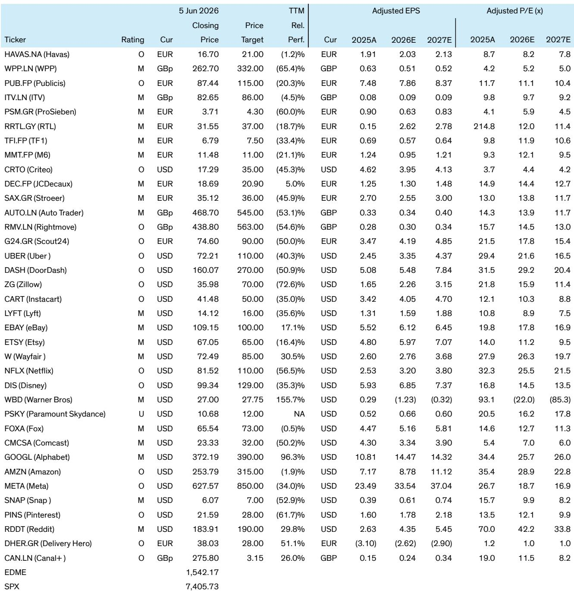
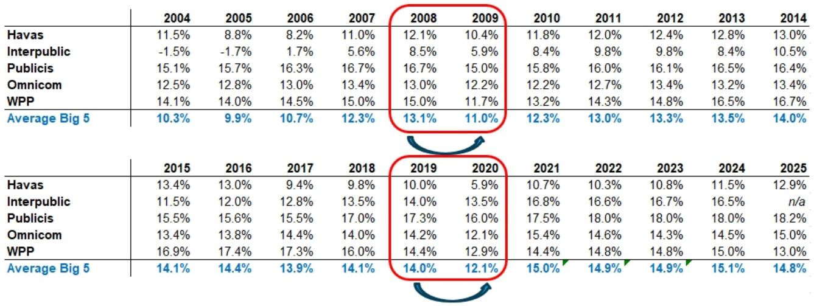
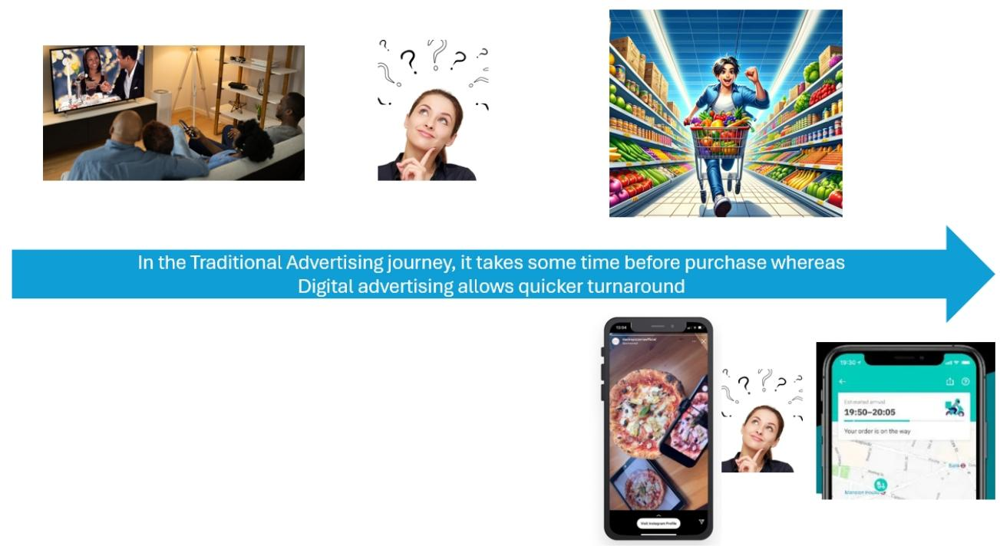

# Bernstein：广告市场真正被低估的不是总量增长，而是结构性再分配中的定价权迁移

全球广告市场正处在一个微妙的拐点。一方面，数字广告依然保持着两位数的增长，2024年全球数字广告支出预计将达到近7000亿美元。另一方面，传统媒体的广告收入增长几乎停滞，甚至在某些季度出现负增长。市场的主流叙事仍然聚焦于“数字化渗透率还有多少空间”这样的总量问题。

但Bernstein这份最新研报提供了一个更具穿透力的结构性判断：广告增长的核心驱动力并非消费总量的扩张，而是注意力的再分配。全球媒体消费时间已经稳定在每天约11小时，这意味着总库存的增长空间极为有限。真正发生的是价值在不同格式、不同平台之间的系统性迁移。而这场迁移的赢家，将不是那些拥有最多用户的平台，而是那些能够将规模优势转化为不可替代的定价权的玩家。

这份报告的价值不在于罗列数字广告的增长数据，而在于它提供了一个理解广告市场底层逻辑的分析框架。它揭示了两个截然不同的广告市场、两阶段增长模型，以及一个正在被市场低估的关键变量——碎片化带来的执行复杂性溢价。

## 1. 两个截然不同的广告市场，决定了完全不同的增长韧性与估值逻辑

Bernstein的核心洞见之一，是将全球广告市场拆分为两个本质上不同的市场。这不是一个简单的“线上vs线下”的二分法，而是一个基于客户结构、收入稳定性和增长驱动力的根本性区分。

市场一由传统媒体和广告代理构成。这个市场的特点是高度集中、强周期性，收入高度依赖数千个大客户。在经济下行周期，广告支出往往成为企业最先削减的成本项。这种结构决定了其收入的波动性极高，且与宏观消费信心指数高度相关。Bernstein的数据显示，这类市场的收入在宏观压力下可能出现两位数的季度波动。

市场二由数字平台主导。这个市场的增长引擎是数百万中小企业。Bernstein的数据揭示了一个被市场普遍低估的事实：中小企业贡献了主要数字平台约三分之二的广告收入。中小企业的广告支出决策逻辑与大企业截然不同——它们更关注可量化的投资回报率，而非品牌预算的周期性调整。这使得市场二的收入结构更具韧性，也更难通过传统的宏观指标进行预测。

这两个市场的分化意味着，简单地用“广告行业是周期性行业”这一笼统判断来给所有相关资产定价，很可能导致系统性的误判。数字平台的收入结构本质上更具防御性，而这种结构性优势尚未被市场充分定价。

## 2. 数字广告增长已进入第二阶段，零售媒体成为新的结构性增量来源

Bernstein将数字广告的增长划分为两个阶段，这一框架对于理解当前的投资机会至关重要。

第一阶段是过去十年的主导叙事：中小企业通过自助式广告工具大规模涌入数字平台。这一阶段的增长驱动力是“新客户 onboarding”。Bernstein强调，正是中小企业贡献了Meta和Alphabet约三分之二的广告收入，这解释了为什么这些平台能够在宏观逆风中依然保持增长韧性。

第二阶段始于2023年左右，增长驱动力发生了根本性转变。这一阶段的核心是媒体库存的扩张，以及随之而来的规模化个性化投放能力。零售媒体、电商平台、外卖应用、OTT平台等新兴广告库存的涌现，正在重新定义广告漏斗的边界。

零售媒体尤其值得关注。Bernstein将其描述为“结构性高利润率、近乎零成本的广告库存”。对于亚马逊这样的电商平台，或者DoorDash这样的配送平台，广告位几乎是一种纯增量收入——它们不需要额外生产内容，不需要新增带宽成本，只需要在现有用户界面中插入广告位。更重要的是，这些平台拥有购物意图数据，能够实现远超传统媒体的精准投放。

这意味着，原本被视为“非媒体公司”的零售商和应用平台，正在成为广告市场中最具增长潜力的新玩家。这一趋势的隐含含义是：数字广告市场的竞争格局正在从“平台vs平台”演变为“数据生态vs数据生态”。拥有交易数据的平台，在广告定价权上可能比纯粹的社交或搜索平台更具优势。

## 3. 传统媒体的数字化努力值得肯定，但结构性缺陷限制了估值修复空间

面对数字化的冲击，传统媒体并非无所作为。Bernstein的报告指出，广播公司、户外广告公司和广告代理正在成功复制数字化的特征。例如，英国ITV的流媒体平台ITVx、户外广告公司的程序化数字广告牌VIOOH，都在各自细分领域取得了高于集团平均水平的增长。

然而，这些数字化业务的体量仍然太小。它们占集团总收入的比例有限，无法从根本上改变整体增长轨迹和估值逻辑。与此同时，核心线性广告业务在美国等主要市场仍在持续下滑，DTC（直接面向消费者）业务的增长只能部分弥补这一缺口。

更深层的问题在于客户集中度和周期性暴露。传统媒体和广告代理的收入高度依赖少数大客户，这些客户的预算决策受宏观环境影响极大。即便数字化业务增长良好，只要核心业务仍然暴露于周期性风险，市场就不太可能给予这些公司高于行业平均的估值倍数。

这引出一个关键判断：传统媒体的数字化转型，在投资层面可能是一个“必要的防御动作”，而非“价值重估的催化剂”。除非数字化业务能够占到集团收入的50%以上，否则市场对这类资产的定价逻辑不会发生根本性变化。

## 4. 碎片化正在创造一种新的稀缺资源：执行能力

Bernstein的报告反复强调一个主题：广告市场的碎片化程度正在急剧上升。数字广告已经不再是一个单一的渠道，而是包含了搜索、社交、视频、零售媒体、CTV、程序化展示等数十个细分领域。每个领域都有不同的定价机制、不同的效果衡量标准、不同的投放优化逻辑。

这种碎片化对广告主意味着巨大的执行复杂性。过去，一个品牌只需要在电视和报纸上投放广告，最多再加一个搜索广告。现在，它需要同时管理数十个平台、数百种广告格式、数千个定向维度。而每一个平台的算法都在不断变化，每一次cookie政策的更新都可能颠覆现有的投放策略。

在这个背景下，规模和数据生态成为最核心的竞争壁垒。大型数字平台之所以能够持续获得更高的定价权，不是因为它们拥有最多的用户，而是因为它们拥有最完整的数据闭环和最先进的投放算法。AI的引入正在进一步强化这一优势——它提高了定向精度、降低了创意成本、优化了转化路径。

对于投资者而言，这意味着在广告产业链中，真正值得关注的不是那些“拥有用户注意力的平台”，而是那些“能够将注意力转化为可衡量商业结果的系统”。后者才拥有真正的定价权。

## 5. 报告尚未完全回答的关键问题：AI对广告定价权的二阶影响

Bernstein的报告对AI在广告领域的应用给予了高度评价，认为其在数字广告中的影响力仅次于编程和工程领域。AI不仅优化了定向和创意生成，还在重新定义整个广告投放的自动化水平。

但报告也留下了一个尚未完全展开的关键问题：当AI使得广告投放变得越来越自动化、越来越“无摩擦”时，广告定价权将如何演变？一个可能的推演是，AI会降低中小企业的广告投放门槛，从而进一步扩大数字平台的客户基础，巩固其网络效应。但另一个可能性是，AI也会让广告主更容易地在不同平台之间进行优化和迁移，从而削弱单个平台的议价能力。

此外，AI对传统广告代理的影响同样值得关注。如果AI能够自动化创意生成、媒体规划和效果分析，那么广告代理的“中间人”价值是否会大幅缩水？Bernstein的报告提到了广告代理正在通过数据和咨询业务转型，但这一转型的速度是否足以抵消核心业务被AI替代的风险，报告没有给出明确的结论。

这些未解问题，恰恰是深入阅读完整报告的价值所在。Bernstein的团队在报告中提供了详细的子行业分析、关键KPI框架以及美欧市场的对比视角，这些内容对于形成自己的投资判断至关重要。

Personal reading notes and learning share only. Not investment advice.

