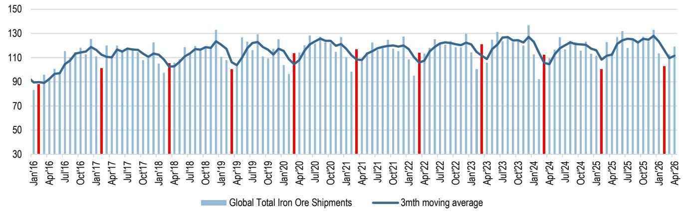
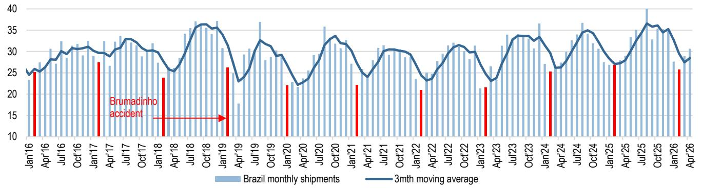

# China's Metals Demand Is Splitting in Two: The Real Signal Is Not the Aggregate Slowdown but the Divergence Between Copper and Aluminium

The headline from the latest China metals inventory tracker is that overall demand is weakening. Copper consumption has stalled for six consecutive weeks. Manufacturing activity, as reflected in the May NBS PMI, is softening. And a prolonged Strait of Hormuz closure is adding cost inflation to an already fragile demand picture. But the real strategic insight is not that China's metals appetite is fading. It is that the pattern of demand is diverging in a way that reveals a structural shift in China's industrial composition—one that has direct implications for how investors should position across metals, miners, and geographies.

Copper and aluminium are telling two different stories. Copper inventories are flat, demand is muted, and the Yangshan premium has moderated. Aluminium, by contrast, is still drawing down at a pace slightly above seasonal norms. Zinc is building inventory at the highest level since 2022. Steel mill margins are under pressure from rising coking coal costs. These are not random fluctuations. They are signals of a rebalancing within China's economy that favors light-weighting, energy transition infrastructure, and regional supply chains over traditional heavy industrial expansion.

The conventional narrative—that China's reopening boost has faded and the economy is settling into a lower gear—is too simple. What is actually happening is that the composition of demand is changing faster than most investors appreciate. The metals that benefit from grid investment, electric vehicle production, and lightweight construction are holding up better than those tied to property, heavy machinery, and export-oriented manufacturing. This divergence will persist, and it will create winners and losers that cut across traditional commodity cycles.

## Copper's Stalled Consumption Is Not a Demand Problem; It Is a Composition Problem

The report shows that copper inventory movement was broadly flat in the week ended 5 June, marking the sixth consecutive week of weak demand. Total visible copper inventory sits at roughly 218 kilotons. That is at the bottom end of the seasonal range, but it is still about 40 kilotons higher than the same period last year. The Yangshan premium has moderated to around $65 per tonne, confirming that Chinese buying appetite for imported copper has softened.

The instinct is to attribute this to a general economic slowdown. But the data does not support that conclusion alone. Copper demand in China is heavily concentrated in power generation, construction wiring, and industrial machinery. These end-markets are not all moving in the same direction. Grid investment remains robust, and the buildout of ultra-high-voltage transmission lines continues. What has weakened is the property-linked portion of copper demand and the export-oriented manufacturing that relies on copper-intensive components.

The real issue is that the post-reopening surge in March and April pulled forward demand from sectors that are now normalizing. Construction activity, which had a strong rebound after Chinese New Year, is settling back to trend. Meanwhile, the manufacturing PMI weakness flagged in the report is concentrated in export-facing industries, not domestic infrastructure. The Strait of Hormuz disruption adds a cost layer that further depresses marginal consumption, particularly in price-sensitive industrial applications.

The so-what for investors is straightforward: copper's current softness is not a signal to sell the entire metals complex. It is a signal to differentiate between demand drivers. The copper that goes into renewable energy and grid infrastructure will recover. The copper that goes into housing and commodity exports may not. Investors who treat the aggregate copper number as a single signal will miss the underlying rotation.

## Aluminium's Resilience Points to a Structural Shift in China's Industrial Mix

While copper stalls, aluminium is drawing down inventory at a rate of 26 kilotons per week, slightly above the seasonal average for this time of year. Total visible aluminium inventory stands at 1.4 million tonnes, the highest level for this period since 2019, but the rate of destocking is accelerating. This is not a cyclical blip. It reflects a structural increase in aluminium intensity across China's economy.

Aluminium's demand profile is fundamentally different from copper's. It is the metal of choice for lightweight vehicles, solar panel frames, energy-efficient building facades, and battery enclosures. These are precisely the sectors that China is prioritizing in its industrial policy. Electric vehicle production continues to grow. Solar installations are on track to set another record this year. And the push toward energy efficiency in commercial buildings is driving aluminium substitution for steel in structural applications.

The report's data on aluminium inventory dynamics is consistent with this narrative. The destocking is happening even as total inventory remains elevated, which suggests that supply is also responding to demand signals. The key question for investors is whether this trend is sustainable. If China's property sector remains weak, aluminium demand from construction could soften. But the offset from automotive and renewable energy is large enough to absorb that slack.

The strategic implication is that aluminium is becoming a proxy for China's transition away from heavy industry and toward green manufacturing. This is not a short-term trade. It is a multi-year structural shift that will reward producers with exposure to regional premia and low-carbon production. The report's reference to Norsk Hydro as the only overweight in the Industrials Metals space is consistent with this logic: it is not about aluminium as a commodity; it is about aluminium in a specific regional and regulatory context.

## The Strait of Hormuz Closure Is a Cost Shock That Magnifies Demand Divergence

The report notes that the Strait of Hormuz closure has extended beyond the base case of a 1 June reopening. This is not a footnote. It is a second-order shock that amplifies the divergence between metals. The impact is not uniform across the commodity complex, and understanding the asymmetry is critical for positioning.

Iron ore shipping costs from Australia, Brazil, and South Africa to China have all increased by more than 50 percent since the start of the Iran conflict. This feeds directly into steel mill margins, which are already under pressure from higher coking coal prices. The report shows that Chinese steel mill margins are extending losses. For copper and aluminium, the cost impact is more indirect. Higher oil prices raise mining and transportation costs, but the effect on refined metal pricing is mediated by local supply and demand balances.

The real story here is that the cost shock reduces the affordability of metals in price-sensitive applications while leaving premium applications relatively unscathed. This means that metals used in high-value, policy-driven sectors—like aluminium in EVs and solar—will absorb the cost increase more easily than metals used in commoditized construction and manufacturing. The demand divergence we are seeing now will widen if energy costs remain elevated.

For investors, this creates a clear framework. Companies with exposure to premium end-markets and regional supply chains will have pricing power. Companies that depend on global commodity pricing and cost-sensitive customers will face margin compression. The report's recommendation to reduce EMEA Metals and Mining exposure while maintaining an overweight in Norsk Hydro is a direct application of this logic.

## The Report Leaves a Critical Question Unanswered: How Much of the Demand Weakness Is Cyclical Versus Structural?

The report provides high-frequency inventory data and links it to broader macroeconomic signals like the NBS PMI. It also flags the Strait of Hormuz disruption as a complicating factor. But it does not fully disentangle the cyclical from the structural components of the demand slowdown.

This is the most important analytical gap for investors to address. If the current weakness is primarily cyclical—a normal post-reopening normalization compounded by a temporary geopolitical shock—then the right strategy is to wait for the trough and buy exposure to the recovery. If the weakness is structural—reflecting a permanent shift away from metals-intensive heavy industry toward services and light manufacturing—then the recovery may never come for certain metals.

The copper data is particularly ambiguous. Copper inventories are low by historical standards, which typically signals tightness and supports prices. But the lack of restocking suggests that end-users are not confident enough to rebuild inventory. Is that caution justified? Or is it a temporary response to uncertainty about trade policy and energy costs?

Similarly, aluminium's destocking could be a leading indicator of stronger demand, or it could reflect supply discipline rather than consumption growth. The report shows that total aluminium inventory is at the highest seasonal level since 2019, which means the destocking is happening from a high base. That is consistent with a market that is rebalancing after a period of oversupply, not one that is tightening on the back of surging demand.

Investors need to resolve this ambiguity before committing capital. The full report likely contains more granular data on end-market consumption and supply-side dynamics that would help answer these questions.

## A Decision Framework for Positioning Across the Metals Complex

Based on the data and analysis presented, investors should adopt a three-part framework for positioning:

**First, separate metals by demand driver.** Copper and zinc are more exposed to cyclical manufacturing and property. Aluminium is more exposed to structural green investment. Steel sits in the middle, with both cyclical and structural drivers but heavy exposure to cost inflation from shipping and coking coal.

**Second, assess the duration of the cost shock.** The Strait of Hormuz closure is the wild card. If it resolves within weeks, the cost pressure on steel and base metals will ease. If it persists into the third quarter, the divergence between premium and commoditized metals will widen. Investors should scenario-test their portfolios for both outcomes.

**Third, focus on regional exposure and cost position.** The report's overweight on Norsk Hydro is instructive. It is not a bet on aluminium prices. It is a bet on a producer with low-cost, low-carbon production and exposure to European regional premia that insulate it from global commodity volatility. Similarly, the underweight on Anglo American and Lundin Mining reflects concern about cost inflation and geographic risk.

This framework implies that the traditional approach of buying a diversified basket of miners is unlikely to work in the current environment. The dispersion between metals is too wide, and the cost dynamics are too asymmetric. Active selection based on end-market exposure and cost structure will determine performance.

## Join the Community to Read the Full Report and Review the Original Charts

The analysis above draws on high-frequency inventory data that is only available in the full report. The charts on copper, aluminium, and zinc inventory trends provide a level of granularity that is essential for making informed investment decisions. The report also includes the latest EMEA Metals and Mining valuations and commodity price scenario analysis, which are not summarized here. Join the community to read the full report and review the original charts.

*This article is for learning and discussion only and does not constitute investment advice.*

Personal reading notes and learning share only. Not investment advice.

