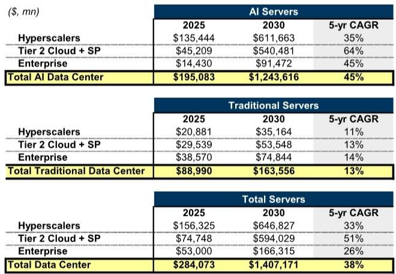
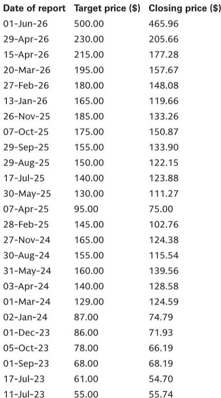
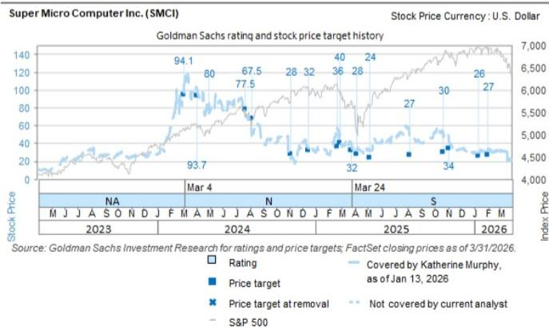

# The Server Market Is Not Just Growing — It Is Restructuring, and the Winners Will Be Determined by How They Serve the New Buyers

The global server market is no longer a single narrative of cyclical upgrades and hyperscaler dominance. The latest data from 650 Group, covering the first calendar quarter of 2026, reveals a market undergoing a fundamental structural shift. The overall server market is now projected to reach $1.4 trillion by 2030, a 38% compound annual growth rate from 2025, and these forecasts have been revised upward by an average of 20% from just one quarter ago. This is not a gentle acceleration. It is a re-rating of the entire addressable opportunity, driven by two distinct engines that are pulling in different directions.

The first engine is AI servers, now expected to hit $1.24 trillion by 2030, a 45% five-year CAGR. The second, and perhaps more surprising, is the traditional server market, which has been revised upward by 31% on average and is now forecast to reach $164 billion by 2030, growing at a 13% five-year CAGR. The conventional wisdom that traditional servers are in terminal decline is being challenged by a wave of enterprise and neocloud demand that is lifting both unit shipments and average selling prices.

But the headline growth numbers obscure a more consequential story. The structure of competition is shifting rapidly, and the early winners are not necessarily the same players who dominated the last cycle. The data shows that market share is being redistributed with unusual velocity, particularly in the AI segment and within the neocloud and enterprise verticals. The question for investors is not simply which company has the best technology, but which company can capture the value being created by a bifurcating customer base with diverging needs.

This article argues that the server market is entering a phase where distribution, customer relationship depth, and the ability to serve both traditional and AI workloads will be more determinative of success than raw compute performance alone. The report from a global investment bank, based on 650 Group data, provides the empirical foundation for this argument, and we will use it to build a strategic framework for understanding who wins and why.

## The AI Server Forecast Upgrade Is a Bet on Neoclouds, Not Just Hyperscalers, and That Changes the Competitive Dynamics

The upward revision to AI server forecasts is significant, but the composition of that revision matters more than the total. 650 Group raised its annual AI server forecasts for 2026-2030 by approximately 18% on average. However, the revision was not evenly distributed across customer verticals. The neocloud segment saw the largest upward revision, at 22% on average, driven by a 4% increase in unit expectations and a 17% increase in average selling prices. Hyperscaler AI server forecasts were raised by 17%, and enterprise AI by 16%.

The implication is clear: the incremental demand is coming from a new class of buyers. Neoclouds — specialized cloud providers focused on AI infrastructure — are scaling faster than the hyperscalers, and they are willing to pay higher prices per unit. This is not a commodity market. The 17% ASP uplift in neocloud AI servers suggests that these customers are demanding higher-performance, more integrated systems, and they are less price-sensitive than the hyperscalers who build their own infrastructure at scale.

This shift creates a strategic opportunity for server vendors who can deliver integrated solutions rather than just white-box hardware. The data from the report confirms this. In the AI server market, Dell Technologies captured 17% share in 1Q26, up from just 5% in 1Q25. More strikingly, Dell’s AI server revenue was up 622% year-over-year, driven by a 300% increase in units and an 81% increase in ASPs. By vertical, Dell’s AI server growth was broad-based, but the neocloud segment was the primary driver, adding $9 billion in incremental revenue.

The neocloud vertical is the key battleground. Unlike hyperscalers, who often design their own servers and source components directly, neoclouds rely on OEMs for fully integrated systems. This creates a structural advantage for vendors like Dell, who have the supply chain, sales force, and service capabilities to serve this segment at scale. The report shows that Dell’s share of the neocloud AI server market reached 48% in 1Q26, up from 24% in 1Q25. This is a dramatic shift in a single year, and it suggests that the neocloud opportunity is not just about volume, but about relationship stickiness.

The strategic question for investors is whether this neocloud-driven growth is sustainable. Neoclouds are capital-intensive businesses, and their demand is tied to the availability of financing and the willingness of investors to fund AI infrastructure buildouts. If the neocloud funding environment tightens, the AI server market could face a demand shock. However, the upward revision to forecasts suggests that the research firms and analysts see this as a multi-year trend, not a bubble.

## The Traditional Server Market Is Not Dying — It Is Being Resurrected by Enterprise Modernization and ASP Expansion

The most surprising finding in the report is the dramatic upward revision to traditional server forecasts. 650 Group raised its annual traditional server forecasts for 2026-2030 by approximately 31% on average, now expecting the market to reach $164 billion by 2030. This is not a rounding error. The previous forecast from the 4Q25 report was $105 billion. The revision implies that the traditional server market is growing at a 13% five-year CAGR, driven by both unit growth (+5% CAGR) and ASP growth (+8% CAGR).

Why is this happening? The report provides a clue in the vertical breakdown. Enterprise traditional server revenue growth for 2026-2030 was revised upward by 48% on average, with a 30% increase in unit expectations and a 13% increase in ASPs. Hyperscale traditional server forecasts were raised by 47%, with a 32% increase in units and a 10% increase in ASPs.

The enterprise segment is the engine. After years of being told that the future is in the cloud, many enterprises are choosing to modernize their on-premise infrastructure. This is partly driven by data sovereignty concerns, partly by the need for low-latency AI inference at the edge, and partly by the simple fact that many workloads are still better served by dedicated hardware. The ASP growth in enterprise traditional servers (+13%) suggests that these customers are not just buying replacement boxes — they are buying higher-performance systems with more memory, faster storage, and better networking.

The competitive implications are significant. Dell’s traditional server revenue was up 85% year-over-year in C1Q26, driven by a 24% increase in units and a 49% increase in ASPs. By vertical, Dell’s enterprise traditional server revenue was up 91% year-over-year, and its neocloud traditional server revenue was up 102%. Dell’s share of the traditional server market reached 30% in 1Q26, up from 20% in 1Q25. In the enterprise traditional server segment, Dell’s share jumped to 38% from 25%.

This is a textbook case of a company benefiting from a structural shift in demand. Dell’s strength in the enterprise segment, built over decades of relationship selling, is now being rewarded as enterprises reinvest in on-premise infrastructure. The report also shows that Dell’s traditional server ASPs are rising faster than units, which is a positive sign for profitability. The combination of volume growth and price mix improvement is a powerful driver of revenue and margin expansion.

The traditional server market is not a relic. It is a growth market, and the winners will be the vendors who can serve the enterprise customer with the same level of integration and service that they provide for AI workloads.

## Market Share Is Shifting Faster Than Many Investors Realize, and the Old Hierarchies Are Breaking Down

The most actionable insight from the report is the speed at which market share is changing. In the AI server market, Dell’s share went from 5% to 17% in one year. Super Micro’s share went from 8% to 11%. HPE’s share declined from 5% to 3%. Nvidia’s share, while still dominant at 44%, has been declining from a peak of 65% in 3Q23.

The neocloud AI server market is even more volatile. Dell’s share oscillated between 25% and 45% over the past five quarters, while Super Micro’s share swung from 35% to 50% and back to 30%. This is not a stable market. It is a market where customer relationships are being formed and broken quickly, and where the ability to deliver systems at scale is the primary competitive advantage.

In the traditional server market, the shifts are equally dramatic. Dell’s share rose from 20% to 30% in one year, while HPE’s share remained flat at 11% and Lenovo’s share declined from 11% to 7%. The neocloud traditional server market is particularly interesting, where Dell’s share jumped to 43% from 23%, and Super Micro’s share rose to 25% from 8%. The white-box players, who had dominated this segment, saw their share fall from 25% to 12%.

The pattern is clear: the market is consolidating around a small number of vendors who can serve both traditional and AI workloads across multiple customer verticals. The days of a single vendor dominating a single segment are over. The winners will be those who can offer a full portfolio, from enterprise servers to AI-optimized systems, and who have the supply chain and sales force to execute at scale.

The strategic question for investors is whether this consolidation is sustainable. Dell’s rapid share gains raise the question of whether it can maintain its growth trajectory without sacrificing margins. Super Micro’s volatility suggests that its business model, which relies on rapid customization and a direct sales approach, may be more vulnerable to shifts in customer preferences. HPE’s stagnation, particularly in AI servers, suggests that it may need to make strategic acquisitions or partnerships to regain relevance.

## The Report Raises Unanswered Questions About Profitability, Sustainability, and the Role of the White-Box Players

While the report provides a rich dataset, it leaves several important questions unanswered. The first is profitability. The report focuses on revenue market share, but it does not address the margin implications of the shift toward AI servers and neocloud customers. AI servers are typically lower-margin than traditional servers, because they require more expensive components and more customization. If Dell’s revenue mix shifts heavily toward AI, its gross margins could compress, even as its revenue grows.

The second question is sustainability. The neocloud segment is growing rapidly, but it is also highly cyclical. Neoclouds are funded by venture capital and private equity, and their demand for servers is tied to the availability of capital. If the funding environment tightens, the neocloud segment could experience a sharp slowdown, which would disproportionately affect vendors like Dell and Super Micro who have bet heavily on this vertical.

The third question is the role of the white-box players. The report shows that white-box vendors still hold 22% of the AI server market and 24% of the traditional server market. These players are typically smaller, more agile, and more willing to customize systems for specific customers. As the market matures, the white-box players could lose share to the larger OEMs, but they could also carve out profitable niches in specialized segments like edge computing or inference at scale.

The report does not provide enough data to answer these questions definitively. Investors who rely solely on this report may be missing the full picture. The full report, which includes detailed financial models and margin analysis, would provide the context needed to make informed investment decisions.

## A Decision Framework for Investors: Three Questions to Ask Before Taking a Position

Based on the data and analysis in this report, investors should evaluate server market opportunities using the following three-question framework.

First, which customer vertical is the company best positioned to serve? The server market is no longer a single market. It is three distinct markets: hyperscaler, neocloud, and enterprise. Each has different growth rates, margin profiles, and competitive dynamics. Dell’s strength in enterprise and neocloud is driving its growth, but it also exposes it to the cyclicality of those segments. HPE’s focus on enterprise may limit its upside, but it also provides a more stable revenue base. Super Micro’s reliance on neocloud makes it a high-beta play on the AI infrastructure buildout.

Second, what is the company’s mix of traditional versus AI server revenue? The report shows that traditional servers are growing faster than expected, and they come with higher ASPs and potentially higher margins. Companies like Dell, which have a balanced mix, may be better positioned than companies like Super Micro, which are heavily weighted toward AI. The traditional server segment also provides a natural hedge against a slowdown in AI investment.

Third, can the company maintain its market share gains? The report shows that market share is shifting rapidly, but it does not provide data on customer retention or contract duration. A company that gains share by winning large, one-time deals may not be able to sustain its growth. A company that wins recurring contracts or builds long-term relationships with customers will have a more durable advantage. Investors should look for evidence of customer stickiness, such as multi-year contracts, service agreements, or proprietary software integrations.

These three questions provide a framework for evaluating any server market investment. The companies that can answer them positively are likely to be the long-term winners. The companies that cannot may be riding a temporary wave that will recede as the market matures.

## The Full Report Contains the Data and Analysis Needed to Answer These Questions

This article has drawn on the key findings from a global investment bank report based on 650 Group data, but it has only scratched the surface. The full report includes detailed financial models, margin analysis, and competitive positioning for each of the major server vendors. It also includes the original charts and data tables that show the year-by-year forecast revisions and market share shifts.

For investors who want to make informed decisions about the server market, the full report is essential reading. It provides the context and detail needed to evaluate the opportunities and risks in this rapidly changing market.

Join the community to read the full report and review the original charts.

*This article is for learning and discussion only and does not constitute investment advice.*

Personal reading notes and learning share only. Not investment advice.

