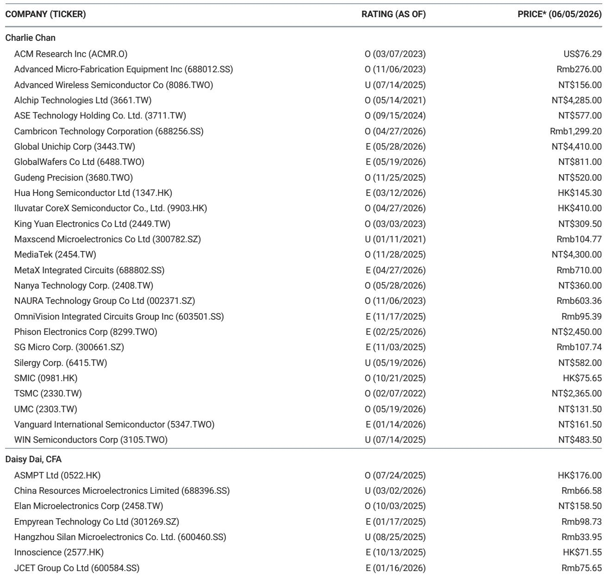
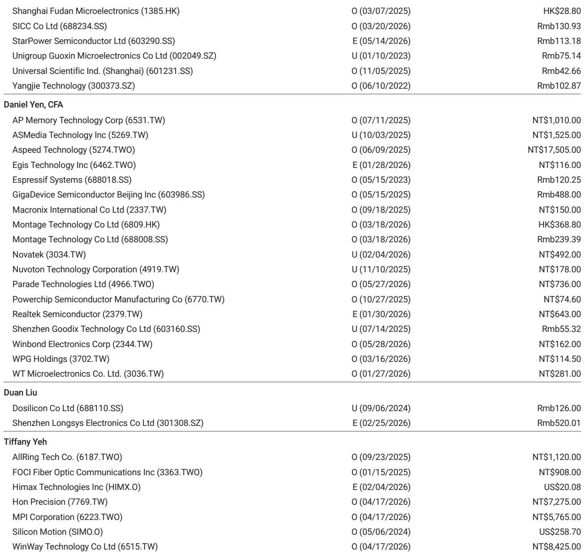
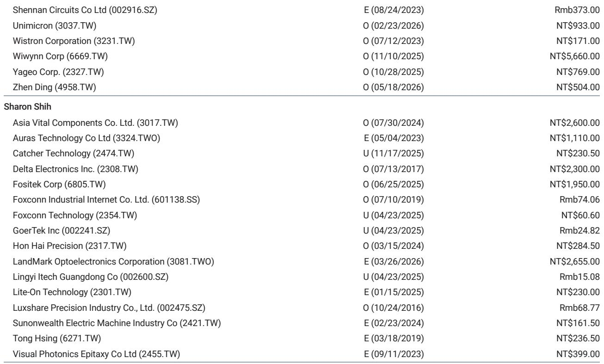

# 摩根斯坦利：面板价格周期的高点已至，市场定价的乐观情绪正在透支未来

这份摩根斯坦利在2026年6月发布的TFT-LCD面板价格展望报告，传递了一个清晰且克制的信号：面板价格在经历了一轮温和上涨后，正在接近本轮周期的顶部。对于关注面板行业的投资者而言，真正需要警惕的不是6月价格的短期波动，而是当前估值已经反映了太多尚未兑现的乐观预期。

报告的核心判断可以概括为一句话：TV面板价格将从三季度开始转跌，IT面板价格将从四季度开始走弱，而市场对“新兴业务”的期待——尤其是玻璃基板在先进封装中的应用——短期内难以贡献实质性的业绩增量。这意味着，当前台湾面板厂商的股价，已经跑在了基本面之前。

## 1. TV面板价格的红利期仅剩一个季度，供给纪律正在被需求走弱所抵消

摩根斯坦利预计，6月主流TV面板尺寸的价格将环比持平。这一判断本身并不令人意外，真正值得注意的是报告对后续趋势的定性：从三季度开始，TV面板价格将进入下行通道。

支撑这一判断的逻辑链条是清晰的。需求端，年初以来品牌厂商的提前备货正在退潮，面板订单动能明显放缓。供给端，尽管面板厂仍然展现出良好的产出控制纪律，但上半年强劲的出货量意味着下半年的出货量可能低于季节性水平，这将进一步削弱面板厂的议价能力。

报告隐含的一个关键洞察是：供给纪律虽然能够为价格提供下行支撑，但无法阻止价格拐点的到来。在需求走弱和出货量低于季节性的双重压力下，面板厂“控产保价”的策略效果将逐步递减。这本质上是周期力量对人为干预的修正。

从季度平均价格来看，报告预计2Q26 TV面板价格仍可实现低个位数的环比增长，但这已经是本轮上涨的尾声。对于投资者而言，三季度开始的价格下行预期，意味着当前估值中隐含的持续涨价假设需要被修正。

## 2. IT面板价格的相对稳定更像是一种被动平衡，而非主动强势

与TV面板相比，IT面板价格的走势更为平淡。报告预计6月显示器面板价格环比微涨0.2%，笔记本面板价格环比持平，且这种相对稳定的状态有望在后续季度延续。

但“相对稳定”并不等同于“基本面强劲”。IT面板市场的供需格局更像是双方在低水平上达成的一种平衡。终端需求缺乏爆发性增长的动力，而面板厂在TV面板价格走弱后，可能将更多产能转向IT面板，从而压制IT面板价格的上涨空间。

报告对IT面板的表述值得细读：IT面板价格相对于TV面板“更具稳定性”。这种比较本身就是在暗示，IT面板并非一个具有独立上行逻辑的市场，而是一个跟随整体面板周期、波动幅度更小的细分领域。对投资者而言，IT面板的稳定只能提供防御性，而非进攻性。

## 3. 面板厂的结构性变化被市场过度定价，估值已透支中周期均值

报告在讨论行业结构性变化时，承认了积极的一面：中国面板厂已经从追求规模转向追求利润，政府补贴的减少强化了供给纪律，“以销定产”的商业模式正在被更多投资者接受，行业整合（如LGD出售广州工厂给TCL、Sharp关闭堺工厂）也在改善供给格局。

但摩根斯坦利同时指出，这些结构性变化“并没有被公平地定价”。这句话的潜台词是：市场已经将这些积极因素充分甚至过度地计入了股价，而忽略了价格周期本身的下行风险。

以台湾面板厂为例，友达光电的市净率已经达到1.4倍，群创光电达到1.9倍，均高于过去几年的周期峰值。即使考虑到新兴业务的潜在价值，摩根斯坦利认为当前估值提供的风险回报比已经不再吸引人。相比之下，报告更偏好京东方，理由是规模优势、更多元化的收入组合以及相对便宜的估值。

这一判断的核心含义是：结构性变化是真实的，但它并不能免疫于周期性下行。当周期向下时，即使是结构性改善后的行业，其盈利能力和估值也会受到压力。当前市场对结构性变化的定价，可能已经透支了未来2-3年的改善空间。

## 4. 玻璃基板在先进封装中的应用：方向正确，但2026-2027年不是它的故事

报告中提到的一个可能被市场过度追捧的主题是玻璃基板在先进封装中的应用。摩根斯坦利承认，玻璃基板的大尺寸特性可以带来更好的成本效率，同时具有更低的信号损耗、更优的热膨胀系数匹配以及更高的机械强度，在理论上确实是先进封装的理想材料。

但报告紧接着给出了一个冷静的判断：供应链仍在优化工艺，这意味着“2026-2027年还不是它的故事”。

这一判断对当前市场的叙事构成了直接挑战。部分投资者将玻璃基板视为面板厂从周期股转向成长股的催化剂，但摩根斯坦利的分析表明，这一转向在时间维度上存在显著的不确定性。更重要的是，面板厂并非唯一试图进入这一市场的参与者。当半导体材料和设备厂商也在积极布局时，面板厂能否在竞争中获得显著份额，本身就是一个需要验证的问题。

报告没有完全否定这一方向，但明确表示“有意义的贡献需要时间”。对于投资者而言，如果当前估值中已经包含了玻璃基板带来的增长溢价，那么这一溢价的存在本身就是一种风险。

## 5. 报告尚未完全回答的关键问题：价格下行的幅度与节奏

尽管报告对价格方向给出了明确的判断，但有两个关键问题并未完全展开。

第一，价格下行的幅度会有多大？报告提到“跌幅不会显著”，理由是供给纪律提供了下行支撑。但“不显著”是一个相对概念，如果需求超预期走弱，或者品牌厂商大幅削减库存，供给纪律能否真正抵御价格下行压力，仍然存在不确定性。

第二，价格下行的节奏是否可能提前？报告预计TV面板从三季度开始下跌，IT面板从四季度开始走弱。但这一判断建立在当前需求逐步放缓的基准假设之上。如果中国经济复苏不及预期，或者全球消费电子需求在通胀压力下进一步萎缩，价格下行的起点可能比报告预期更早。

这些未解问题，恰恰是投资者在阅读完整报告时需要重点关注的细节。报告中的图表和季度价格预测数据，提供了比文字更丰富的判断依据——尤其是关于行业产能利用率与价格走势之间的联动关系。

---

面板行业的周期拐点从来不是突然降临的，它总是伴随着一系列微妙的前兆信号。这份摩根斯坦利报告的价值，不仅在于给出了明确的结论，更在于帮助读者识别了哪些信号值得关注、哪些乐观预期需要被重新审视。

对于希望深入理解面板行业周期逻辑、获取完整季度价格预测图表以及各公司目标价与评级详情的读者，欢迎来星球微信群里继续讨论。我们将结合更多行业数据，对报告中的关键假设进行持续跟踪与验证。

Personal reading notes and learning share only. Not investment advice.

