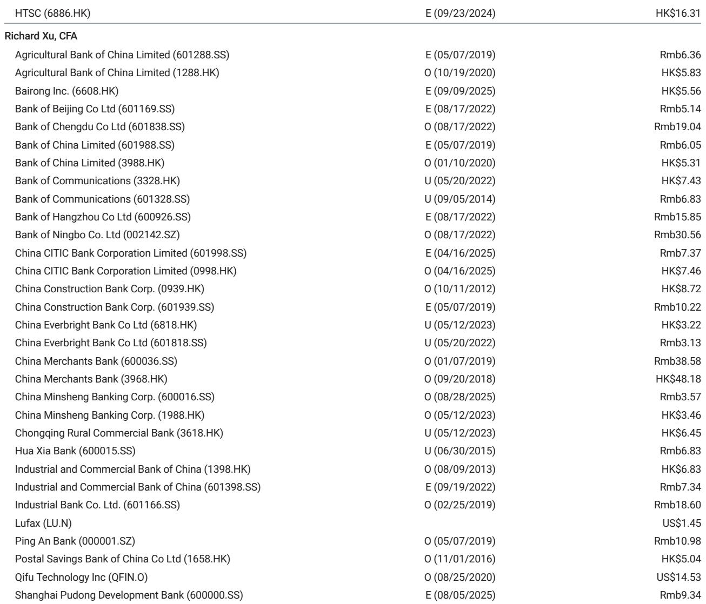
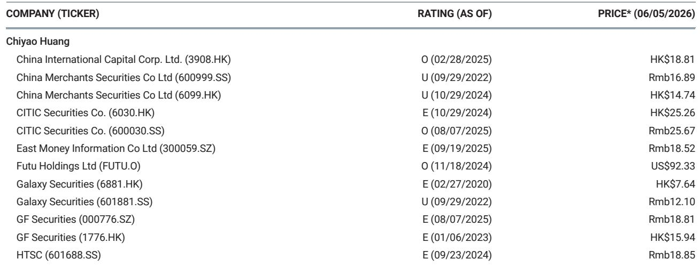

# China’s New Interest Rate Rulebook Is Not a Minor Regulatory Update -- It Is a Structural Shift in Bank Profitability

The People's Bank of China has published a draft consultation paper on RMB Deposit and Loan Interest Rate Management Rules, and the market should treat this as more than a compliance event. This is the first comprehensive rewrite of the 1999 framework, and its implications reach far beyond technical adjustments to interest calculation methods. The new rules explicitly ban high-interest deposit solicitation, mandate full disclosure of annualized loan costs including all fees, and replace rigid penalty-rate add-ons with negotiated penalty rates. For investors watching Chinese banks, the message is clear: the era of regulatory ambiguity in pricing is ending, and a new regime of market-based but tightly supervised pricing is beginning.

Why does this matter now? Chinese banks have been operating under a dual pressure of compressed net interest margins and rising credit risk. Deposit competition had become increasingly disorderly, with smaller institutions offering off-book interest supplements to attract funding. Loan pricing, meanwhile, remained opaque, with borrowers often unaware of the true cost of credit. The PBOC's draft rules address both sides of the balance sheet simultaneously. If implemented as proposed, these rules will reduce funding cost volatility for banks while improving transparency for borrowers. The net effect, according to the analysis from a global investment bank, should be supportive of continued revenue recovery and stable profit growth across the sector.

This article argues that the new rules represent a deliberate regulatory strategy to stabilize bank profitability without resorting to direct interest rate controls. The PBOC is not micromanaging rates. It is creating a rule book that makes predatory pricing and hidden fees unviable, thereby allowing market forces to operate within a disciplined framework. For bank executives, this means rethinking business models that relied on aggressive deposit gathering or opaque fee structures. For investors, it means reassessing which banks are best positioned to benefit from cleaner competition.

The following sections unpack the logic of the new rules, identify the banks most likely to benefit, highlight what the report does not yet answer, and offer a decision framework for portfolio positioning.

## The Ban on High-Interest Deposit Solicitation Directly Addresses the Root Cause of NIM Compression

For years, the most destructive force in Chinese banking has been the race for deposits. Smaller banks, particularly city commercial banks and rural financial institutions, have used illegal manual interest supplements, breaches of self-regulatory caps, and deposit-loan linkage schemes to attract funds. These practices inflate funding costs across the system, because larger banks are forced to respond to retain their deposit bases. The result is a collective action problem: every bank is worse off, but no single bank can unilaterally stop competing.

The new rules make these practices explicitly illegal. The prohibition on high-interest deposit solicitation is not a vague guideline. It is a clear, enforceable ban that covers both explicit rate violations and indirect methods such as deposit-loan bundling. This is the regulatory equivalent of a binding commitment to end the arms race. Once enforcement is credible, banks will no longer need to offer above-market rates to defend their deposit franchises. The marginal cost of funding should decline, and the decline will be most pronounced for banks that were previously forced to pay a premium to attract deposits.

The implication for net interest margins is straightforward. If deposit costs decline by even 10 to 20 basis points across the system, the impact on bank earnings is material. For a typical large commercial bank, a 10-basis-point improvement in net interest margin translates into a high-single-digit percentage increase in pre-provision profit. The banks that benefit most are those with large deposit bases that were previously under pricing pressure -- not necessarily the largest banks, but those with weak pricing power in their local markets.

## Mandatory Disclosure of All-in Loan Costs Will Reshape Competitive Dynamics in Lending Markets

The second major pillar of the new rules is the requirement that lenders clearly display annualized loan rates that include both interest and all fees directly related to the loan. This is a transparency measure with teeth. Historically, Chinese banks have used fee structures to obscure the true cost of credit. A loan might carry a headline rate of 4.5 percent, but when origination fees, service charges, and penalty clauses are included, the effective cost could be significantly higher. This opacity benefits banks that rely on cross-selling and fee income to compensate for low headline rates.

Mandatory all-in pricing changes the game. When borrowers can compare the true cost of credit across institutions, pricing power shifts from lenders to borrowers. Banks that were charging high effective rates while advertising low headline rates will face margin compression. Conversely, banks that already operate with transparent pricing and efficient cost structures will gain market share. This is a classic case of regulation accelerating competitive differentiation.

The strategic implication is that banks with strong brand trust and low-cost operating models will become more attractive to borrowers. The losers will be institutions that built their lending businesses around hidden fees and complex pricing structures. For investors, the key question is not which banks have the lowest headline loan rates today, but which banks have the most transparent pricing models and the lowest all-in cost structures. Those are the banks that will thrive in a regime of mandatory disclosure.

## The Shift from Fixed Penalty Add-Ons to Negotiated Penalty Rates Reduces Systemic Tail Risk

One of the most technical but important changes in the new rules is the elimination of fixed penalty-rate add-ons in favor of negotiated penalty rates. Under the old framework, penalty rates were often set as a fixed multiple of the base rate, creating rigid and sometimes punitive outcomes for borrowers who defaulted. This rigidity had a perverse effect: it made loan recovery less flexible and increased the likelihood of borrower distress cascading into credit losses.

Negotiated penalty rates introduce flexibility. Banks and borrowers can agree on penalty terms that reflect the specific risk profile of the loan and the circumstances of the borrower. This does not mean penalties will be lower. It means they will be more rational. A bank facing a borrower with temporary liquidity problems can negotiate a penalty that preserves the relationship and avoids pushing the borrower into default. A borrower with a pattern of delinquency can face a higher penalty. The system becomes more responsive to actual risk.

For bank credit costs, this is a meaningful improvement. Rigid penalty structures often forced banks into a binary choice: enforce the penalty and risk a full default, or waive the penalty and lose credibility. Negotiated penalties create a middle ground. Over time, this should reduce the volatility of credit costs and improve recovery rates on non-performing loans. The effect will be most visible in retail and small business lending, where borrower circumstances are heterogeneous and flexibility matters most.

## What the Report Does Not Fully Answer: Enforcement Credibility and the Transition Path

The draft rules are ambitious, but the report leaves several critical questions unanswered. The most important is enforcement. The PBOC and its branches are tasked with strengthening supervision and guiding the market interest rate self-regulatory mechanism. But the history of financial regulation in China is replete with rules that were strong on paper and weak in practice. The ban on high-interest deposit solicitation has been attempted before, with mixed results. The difference this time is the comprehensive nature of the framework, but credibility will only be established through visible enforcement actions.

A second unresolved question is the transition path. The rules replace a 1999 framework that has been deeply embedded in bank operations for more than two decades. Banks will need to update systems, retrain staff, and renegotiate contracts. The timeline for implementation is not yet clear, and the risk of transitional disruption is real. Banks that move quickly to comply will gain a competitive advantage, but those that lag may face regulatory penalties or operational chaos.

A third question is the impact on smaller banks. The rules are designed to level the playing field, but smaller institutions may struggle to adapt. They have fewer resources for compliance, weaker technology systems, and less diversified business models. If enforcement is strict, some smaller banks may face existential pressure. The report does not address whether the PBOC is prepared to allow bank failures as a consequence of the new rules, or whether there will be a safety net for institutions that cannot comply.

These open questions are not weaknesses in the analysis. They are the natural boundaries of what can be known before the rules are finalized and implemented. For investors, the appropriate response is to monitor enforcement actions closely and to favor banks with strong compliance cultures and diversified revenue streams.

## A Decision Framework for Investors: Three Dimensions to Assess Bank Positioning

The new rules create winners and losers, but the differentiation is not simply between large banks and small banks. Investors should evaluate banks along three dimensions.

First, assess deposit franchise strength. Banks with stable, low-cost deposit bases will benefit most from the ban on high-interest solicitation. The key metric is the proportion of demand deposits to total deposits, and the trend in deposit costs over the past two years. Banks that have already been disciplined in deposit pricing will gain a relative advantage.

Second, assess loan pricing transparency. Banks that already disclose all-in costs and have simple fee structures will face minimal disruption. Banks that rely on opaque pricing and cross-selling fees will need to restructure their business models. The relevant data points are the ratio of fee income to net interest income, and the volatility of effective loan yields across customer segments.

Third, assess operational flexibility in credit recovery. Banks with sophisticated risk management systems and a track record of negotiated loan workouts will benefit from the shift to negotiated penalty rates. Banks that rely on rigid enforcement and legal action will face higher costs. The proxy here is the ratio of non-performing loan recoveries to total provisions.

A portfolio overweight in banks that score highly on all three dimensions is the logical positioning. A portfolio underweight in banks that score poorly on deposit franchise strength and pricing transparency is the corresponding hedge.

## The Full Report Contains the Charts and Data That Support This Analysis

The consultation paper is a turning point for Chinese banking, but the implications are complex and data-dependent. The original report from the global investment bank includes detailed charts on net interest margin trends, deposit cost evolution, and loan pricing dispersion across bank types. These charts are essential for understanding which banks are most exposed to the new rules and which stand to benefit.

The report also includes a sensitivity analysis that quantifies the impact of a 10-basis-point decline in deposit costs on bank earnings, broken down by institution. This is the kind of granular analysis that turns a regulatory story into an actionable investment thesis.

Join the community to read the full report and review the original charts.

*This article is for learning and discussion only and does not constitute investment advice.*

Personal reading notes and learning share only. Not investment advice.

