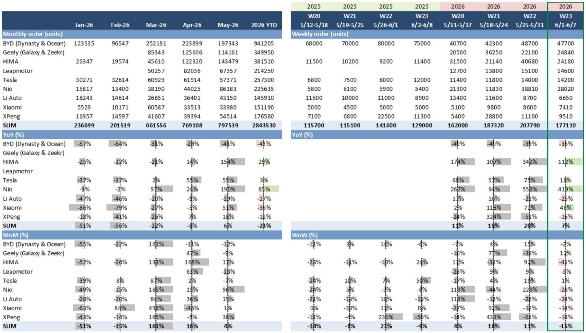
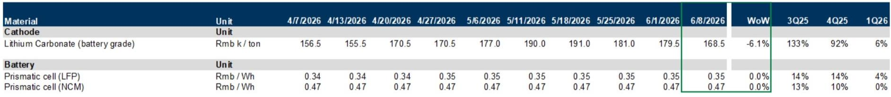

# China's NEV Market Has Entered a Demand Normalization Phase That Rewards Execution Over Hype

The weekly order data for China's new energy vehicle market in Week 23 of 2026 reveals a market that is no longer driven by breakthrough adoption curves but by competitive displacement and product cycle management. Aggregate weekly orders from key NEV brands rose 7% year-on-year but fell 15% week-on-week, a pattern that signals the exhaustion of the initial surge from recent model launches. This is not a market in retreat. It is a market maturing into a rhythm that punishes over-optimism and rewards operational discipline.

Retail NEV penetration reached 63% in May, up from 62.8% in April, while wholesale penetration climbed to 61.1% from 57.3%. These are not incremental gains. They represent a structural shift in the composition of China's passenger vehicle market. The ICE segment is now a shrinking pool, and the competition within NEV is becoming a zero-sum game for market share among a growing roster of capable players. The question for investors and strategists is no longer whether electrification will happen, but who will capture the value as the market consolidates around a new equilibrium.

The data from this weekly chartbook, compiled from a major global investment bank's research, provides a granular view of this transition. By examining order trends, dealer pricing behavior, and upstream battery costs, we can construct a framework for understanding which companies are building durable competitive advantages and which are merely riding a wave.

## The Post-Launch Demand Dip Reveals Which Brands Have Genuine Pull Versus Promotional Push

The 15% week-on-week decline in aggregate orders is the most instructive data point in this report. It follows the initial pulse of new model launches, and its magnitude varies significantly across brands. This is not a uniform market slowdown. It is a differentiation event.

Geely, Tesla, and BYD showed what the report terms "defensive growth," with week-on-week changes of +12%, +1%, and -2% respectively. These three brands, representing very different market positions and price points, share one characteristic: they have deep product pipelines and established brand equity that can sustain order momentum beyond a launch event. Geely's +12% wow performance, in particular, stands out as a signal that its Galaxy and Zeekr sub-brands are gaining traction independent of a single model cycle.

Contrast this with the broader market. Brands that experienced hyperbolic order surges during their launch windows are now facing the arithmetic of normalization. The week-on-week decline is not alarming in isolation, but it does expose which companies have built sustainable demand generation engines and which are still dependent on the episodic excitement of a new model reveal. For investors, the critical metric is not the peak order rate during a launch but the slope of the decline afterward. A shallow decline suggests strong repeat purchase intent and brand loyalty. A steep decline suggests that the launch pulled forward demand without creating lasting franchise value.

The year-to-date order data reinforces this interpretation. Nio leads with +85% YTD order growth, followed by HIMA at +29% and Tesla at +3%. These figures, however, must be read against the base effects and the specific product cycles of each brand. Nio's dramatic YTD growth is partly a recovery from a weak prior year and partly a reflection of its expanding product portfolio. The question is whether this growth trajectory can be maintained as the ONVO L60 facelift launches in June and as competitive pressures intensify in the premium segment.

## Widening Dealer Discounts Signal That Pricing Power Is Concentrating in Fewer Hands

The pricing data in this report tells a story that is more concerning than the order trends alone. Both NEV and ICE dealer discounts widened week-on-week as of June 6. The average NEV dealer discount reached 7.79% of MSRP, up from 7.75% the prior week. ICE discounts stood at 19.54%, up from 19.47%. These are small movements in isolation, but they occur against a backdrop of already elevated discount levels.

What matters is the dispersion. BYD's average dealer discount remained stable at 5.14%, unchanged from the prior week. This stability, in a market where discounts are widening, is a powerful signal of pricing power. BYD's vertical integration, scale advantages, and dominant market position allow it to maintain discipline while competitors are forced to offer greater incentives to move inventory. The ICE segment, with discounts approaching 20%, is in a structural price war from which there is no exit. These brands are not just discounting to clear inventory; they are discounting to defend market share against an irreversible technological shift.

The strategic implication is clear. In a market where 63% of retail sales are already NEV, the remaining ICE share is a contested battleground of declining value. The NEV segment, meanwhile, is beginning to show signs of pricing stratification. Brands with genuine product differentiation and cost advantages can maintain or even reduce discount levels. Brands that are undifferentiated will find themselves in a race to the bottom, compressing margins and destroying shareholder value.

This dynamic has second-order implications for the supply chain. When NEV brands are forced to discount, the pressure cascades upstream to component suppliers and battery manufacturers. The report notes that battery-grade lithium carbonate prices decreased to RMB 168,500 per ton, down 6.1% week-on-week, while prismatic cell prices for both LFP and NCM remained stable. This divergence is instructive. Lithium carbonate prices are falling, but cell prices are holding. This suggests that battery manufacturers are absorbing some of the raw material cost declines to protect their margins, but they cannot do so indefinitely. If NEV retail pricing pressure continues to intensify, battery pricing will eventually have to adjust, creating a new set of winners and losers in the upstream segment.

## The Upstream Battery Cost Structure Is Creating a Hidden Divergence Between Market Leaders and Challengers

The stability of prismatic cell prices amid declining lithium carbonate costs is a data point that deserves deeper analysis than the report provides. At first glance, stable cell prices suggest a healthy battery supply chain. But the reality is more complex. The battery industry is experiencing a capacity overhang, with significant new production coming online from both established players and new entrants. The fact that cell prices are not falling in lockstep with lithium carbonate suggests that manufacturers are prioritizing margin preservation over market share capture, at least for now.

This creates an interesting strategic dynamic. For NEV OEMs that have secured long-term battery supply agreements at favorable terms, the declining raw material costs represent a margin tailwind. For OEMs that are dependent on spot purchases or shorter-term contracts, the benefit is more limited. The divergence in battery procurement strategies will increasingly translate into divergence in vehicle pricing power and profitability.

Furthermore, the stability of cell prices masks significant variation by chemistry and form factor. LFP cells, which dominate the mass-market segment, are approaching their theoretical cost floor. NCM cells, used in premium and performance vehicles, still have room for cost reduction through improved nickel and cobalt utilization. The OEMs that can optimize their battery chemistry mix for each vehicle segment will have a structural cost advantage over competitors that take a one-size-fits-all approach.

This is a point where the report's data raises more questions than it answers. Which OEMs have the most favorable battery supply contracts? How much of the lithium carbonate price decline is being passed through to vehicle manufacturers versus retained by battery producers? The answers to these questions will determine which NEV brands emerge from the current consolidation phase with sustainable margins.

## What the Report Does Not Yet Answer: The Sustainability of Order Growth Beyond the Product Cycle

The most significant analytical gap in this weekly chartbook is the lack of visibility into order conversion rates and customer retention metrics. Weekly orders are a leading indicator, but they do not tell us how many of those orders convert into actual sales, nor do they reveal the demographic profile of the order book. Are the orders coming from first-time NEV buyers, or from repeat purchasers? Are they conquest orders from ICE brands, or are they intra-NEV brand switching?

These questions matter because the nature of demand is changing. The early adopters who drove the initial wave of NEV adoption were price-insensitive and brand-loyal. The next wave of buyers, the early majority, is more value-conscious and more willing to switch brands based on incentives and features. If a significant portion of the weekly orders is coming from promotional-driven purchases rather than organic demand, the post-launch order declines could be steeper and more persistent than the current data suggests.

The report also does not address the impact of used vehicle prices on new vehicle demand. As NEV penetration rises, the used NEV market is growing, and falling used vehicle prices can cannibalize new vehicle sales. This is a dynamic that has already played out in the ICE market and is now beginning to affect NEV. The OEMs that can manage their used vehicle inventory and residual values effectively will have a competitive advantage in maintaining new vehicle pricing power.

## A Decision Framework for Evaluating NEV Investment Opportunities in the Normalization Phase

The data in this report can be synthesized into a three-part decision framework for investors and corporate strategists. This framework is designed to cut through the noise of weekly fluctuations and focus on the structural factors that determine long-term value creation.

First, evaluate pricing power stability. The key metric is not the absolute level of dealer discounts but the trend relative to competitors. A brand whose discounts are stable or narrowing while the market average is widening is demonstrating genuine demand pull. BYD's stable 5.14% discount in a market where NEV discounts are approaching 8% is a clear signal. Investors should apply this same analysis to every major brand, tracking discount trends on a monthly basis and comparing them against order momentum.

Second, assess product cycle management capability. The week-on-week order decline after a launch is a direct measure of how well a company manages its product cycle. A shallow decline indicates strong brand equity and a pipeline of incremental improvements that sustain interest between major launches. A steep decline indicates that the company is reliant on the novelty of a single product. The upcoming launches of the ONVO L60 facelift, BYD's Da Tang, and Li Auto's L8 facelift will provide fresh data points for this analysis. The companies that can maintain order momentum across multiple product cycles, rather than spiking and troughing with each launch, are building durable franchise value.

Third, analyze battery cost exposure. This is the most opaque but potentially most impactful variable. Investors should seek to understand the structure of each OEM's battery supply agreements, including contract duration, price adjustment mechanisms, and chemistry mix. The companies that have locked in favorable terms during the current period of capacity oversupply will have a margin advantage that compounds over time. The companies that are exposed to spot market pricing will face margin compression as raw material costs eventually rebound.

## The Full Report Contains Granular Data on Brand-Level Orders and Pricing That Is Essential for This Analysis

The weekly chartbook from which this analysis is drawn contains detailed exhibits on brand-level order trends, dealer discount trajectories for both NEV and ICE segments, and upstream battery pricing dynamics. These charts are not decorative. They are the raw material for the kind of structural analysis that separates informed investment decisions from speculative bets.

The order summary table, broken down by month and by brand for the key players, allows for a granular assessment of which brands are building momentum and which are losing share. The dealer discount charts, showing trends for individual NEV and ICE brands, provide the data needed to assess pricing power at the brand level rather than the aggregate level. The battery pricing data, while limited in this excerpt, is part of a broader analysis that tracks the economics of the most critical component in the NEV value chain.

To make informed decisions in this market, you need access to this level of granularity. Aggregate penetration rates and industry growth figures are useful for setting the context, but they are not sufficient for identifying the winners and losers. The divergence between brands is widening, and the data that captures this divergence is available in the full report.

Join the community to read the full report and review the original charts.

*This article is for learning and discussion only and does not constitute investment advice.*

Personal reading notes and learning share only. Not investment advice.

