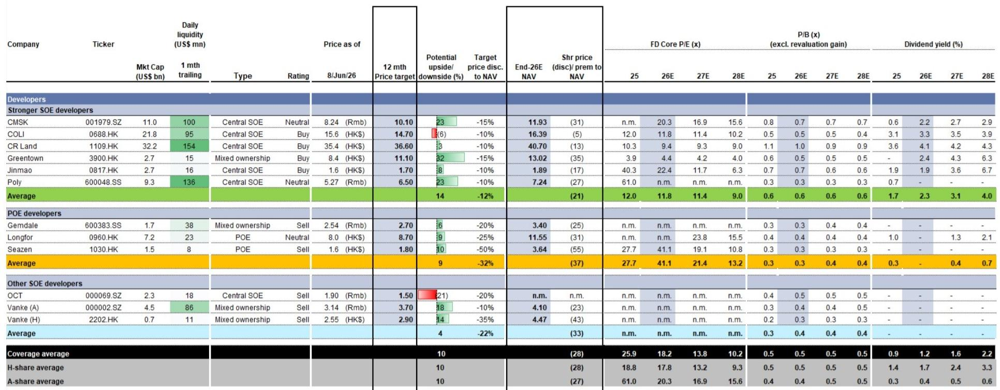
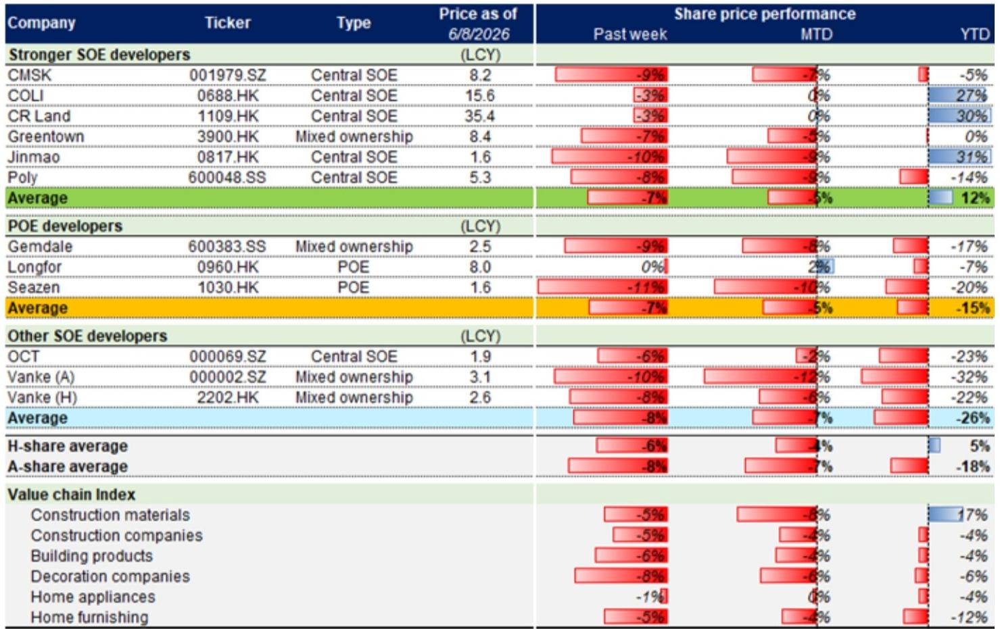

# GS：公积金改革范围超预期，但市场真正低估的是供给侧的再定价信号

中国房地产市场的焦点正在从“成交量能走多远”转向“制度变量如何重塑行业定价逻辑”。GS在最新一期周报中给出了一个值得反复推敲的判断：公积金改革的范围超出了此前预期，但市场对这一变化的定价可能仍然偏保守。周度交易量虽然环比回落，但同比仍在扩张，更重要的是，情绪指标保持稳定——这不是典型的政策刺激后的快速衰减，而更像是一种新的稳态正在形成。

这份报告的核心价值不在于周度数据本身，而在于它提示了一个正在发生的结构性变化：政策工具正在从单纯的“需求刺激”转向“制度优化+供给调控”的组合。公积金改革、新开工与竣工的持续分化、以及库存去化周期的微妙变化，这些信号叠加在一起，指向一个更深刻的命题——中国房地产市场的再平衡，可能比多数投资者预期的更早到来，但路径也将更加分化。

## 1. 公积金改革的制度红利被低估，其影响将超越短期的需求刺激

GS在报告中明确指出，住建部最新发布的《住房公积金管理条例》修订征求意见稿，在三个维度上超出了市场预期。最值得关注的是两点：一是将自住住房装修和物业管理费纳入提取范围，二是明确将灵活就业人员纳入缴存体系。后者的潜在覆盖人群据估算超过2亿人。

这不仅仅是扩大公积金的使用场景，更是一次制度性的“扩围”。过去市场对公积金改革的预期主要集中在贷款利率下调和使用门槛降低上，但这次修订触及了公积金作为“住房金融基础设施”的核心定位。当灵活就业人员能够合法、合规地参与公积金体系，意味着这部分此前被排除在正规住房金融之外的购买力，有了进入市场的通道。

从时点上看，这一改革发生在市场情绪已经企稳、但交易量尚未显著回升的阶段。GS的数据显示，尽管第23周新房销售面积环比下降13%，但同比仍增长15%，二手房更是同比增长31%。情绪指标——经纪人预期指数（CSI）环比上升0.4个百分点——表明市场并非在“降温”，而是在“换挡”。公积金改革的制度红利，将在换挡期提供额外的购买力支撑。

但报告也提示了一个关键未解问题：公积金贷款的利率是否会进一步下调？以及，大量沉淀的公积金存款如何更有效地投放出去？这两个问题将决定制度红利的实际释放力度。目前来看，改革框架已经搭建，但具体的“弹药”尚未完全就位。

## 2. 交易量环比回落不是风险信号，而是市场从脉冲式修复转向稳态运行的标志

GS第23周的数据显示，新房销售面积环比下降13%，二手房下降7%，看房和认购量也环比下降约5%。乍看之下，这似乎是市场动能在减弱。但深入分析会发现，环比回落是在前一周同比大幅扩张（新房+9%、二手房-2%）之后的正常修正，且同比表现依然强劲——新房+15%、二手房+31%。

更值得关注的是情绪指标的稳定性。新房搜索活动环比持平，新增挂牌节奏与5月相当，经纪人预期指数（CSI）环比上升，卖房者报价指数（CAI）也保持稳定。这说明市场参与者对价格走势的判断没有发生方向性变化。

GS还提供了一个关键参照系：2025年以来的累计数据显示，新房销售面积同比下降13%，但二手房累计同比增长1%。这一“新弱二强”的格局并非首次出现，但报告将其置于更长的历史维度中观察——当前二手房交易量已较2024年全年平均水平高出22%，较2023年高出8%。这意味着二手房市场正在成为真正的“价格发现”场所，而新房市场则更多受到供给端约束的影响。

对于投资者而言，这意味着“量”的波动不应被过度解读为趋势逆转。真正需要关注的是“价”的稳定性——只要价格预期没有出现系统性下行，交易量的正常波动就只是市场在寻找均衡点的过程。

## 3. 新开工与竣工的持续背离，正在重塑行业供给侧的定价逻辑

GS通过其独有的GSPC（GS房地产完工指数）模型，对竣工数据进行了前瞻性估算。报告指出，基于浮法玻璃供需模型，5月竣工面积可能录得高双位数的同比降幅（与此前4月NBS公布的-19%基本一致），而全年竣工面积预计同比下降1%。

与此同时，新开工面积在5月可能录得低20%区间的同比降幅。这意味着，行业正在经历一个“新开工大幅收缩、竣工缓慢下降”的阶段。从供给端看，这带来的直接结果就是库存去化周期的改善——GS数据显示，当前库存月数约为27.8个月，低于5月平均的28.5个月。

但更深刻的含义在于：当新开工持续低于竣工时，行业正在“消化存量、压缩增量”。这一过程对资产定价的影响是双向的。一方面，存量的去化有助于改善开发商的现金流和资产负债表；另一方面，新增供给的减少将限制未来可售资源的规模，从而对开发商的收入增长形成约束。

GS在估值部分提供了一个值得深思的数据：当前其覆盖的开发商股价平均较2026年底的净资产价值（NAV）折价28%（离岸）和27%（在岸），对应的2026年预期市净率分别为0.5倍和0.4倍。这一估值水平已经低于历史上的多个周期底部（如2008年下半年、2011年下半年、2014年上半年）。但报告没有直接回答的问题是：在“去增量”的供给格局下，NAV本身是否需要被重新定价？如果可开发土地的价值系统性下降，那么基于历史NAV的折价可能并不具有真正的“安全边际”。

## 4. 开发商之间的分化正在加剧，但市场的定价尚未充分反映这一趋势

GS在周报中详细列出了不同类别开发商的股价表现。第23周，其覆盖的“较强国企开发商”股价平均下跌7%，其中华润置地（1109.HK）和中国海外发展（0688.HK）表现相对较好，仅下跌3%；而民营开发商和其他国企开发商分别下跌7%和8%。

这一分化并非偶然。在“去增量”的供给环境下，开发商的竞争焦点正在从“拿地规模”转向“存量资产运营能力”和“融资成本优势”。华润置地和中国海外发展之所以相对抗跌，很大程度上得益于它们在商业地产和物业管理领域的布局，这些业务提供了相对稳定的现金流，对冲了开发业务的周期性波动。

但报告也暗示，当前的市场定价可能尚未充分反映这一分化趋势。从估值看，离岸覆盖开发商整体较NAV折价28%，在岸折价27%，不同类别之间的折价差异并不显著。这意味着，市场可能仍在用“行业整体”的框架来定价，而忽略了“个体信用资质”和“业务结构”的差异。

对于投资者而言，这意味着一个潜在的定价错位：那些拥有优质商业资产、低融资成本、以及稳定现金流的企业，其估值折价应该小于行业平均水平。如果这一判断成立，那么当前市场可能提供了买入这类企业的窗口。

## 5. 报告尚未完全回答的关键问题：制度红利能否转化为实际购买力

GS的报告在多个维度上提供了有价值的分析，但有一个关键问题尚未完全回答：公积金改革的制度红利，究竟能在多大程度上转化为实际的住房购买力？

从历史经验看，制度扩围到落地执行之间存在显著的时滞。灵活就业人员参与公积金体系，需要配套的征缴机制、跨区域转移接续系统、以及贷款审核标准。这些基础设施的完善可能需要6到12个月。而装修和物业费提取虽然扩大了使用场景，但其对住房消费的边际拉动效果仍有待验证。

更核心的变量在于：公积金贷款的实际利率是否会进一步下调？以及，沉淀在公积金账户中的大量存款（目前规模超过10万亿元）能否通过更积极的贷款投放政策（如贷款利息补贴）被激活？GS在报告中将其列为“关键观察点”，但没有给出明确的预测。

对于读者而言，这意味着在做出投资决策时，需要区分“制度改革的信号价值”和“实际效果的可预测性”。前者已经明确，后者仍需跟踪。

## 6. 一个尚未被充分定价的观察框架：从“量价博弈”转向“资产质量定价”

综合GS报告中的信号，我们认为，投资者需要调整对中国房地产板块的分析框架。过去几年，市场的主要矛盾是“量”与“价”的博弈——交易量能否支撑价格企稳。但随着供给侧的持续收缩和制度改革的推进，一个新的分析维度正在浮现：资产质量定价。

这一框架的核心逻辑是：在“去增量”的环境下，存量资产的质量（位置、租金回报率、运营效率）将决定开发商的长期价值。那些拥有核心城市优质商业资产、低空置率、以及稳定租金收入的开发商，其资产价值将获得重估。而那些依赖高周转、高杠杆模式的企业，其资产价值可能面临永久性折价。

GS报告中的估值数据已经暗示了这一趋势：离岸开发商的0.5倍市净率和在岸的0.4倍市净率，从历史角度看属于底部区域。但“底部”并不等同于“反转”。只有当市场开始用“资产质量”而非“开发规模”来重新定价这些企业时，估值修复才有望真正启动。

这份报告提供了丰富的周度数据和制度分析，但真正的价值在于它提示了这些正在发生的结构性变化。对于希望深入理解行业逻辑的读者，完整报告中还包含了更多关于新开工、竣工、以及库存去化的详细图表和模型假设，这些都是理解供给侧再定价的关键素材。

欢迎来星球微信群里继续讨论这些未解问题——比如公积金贷款利率的下行空间、以及资产质量定价框架下哪些开发商最有可能获得重估。

Personal reading notes and learning share only. Not investment advice.

