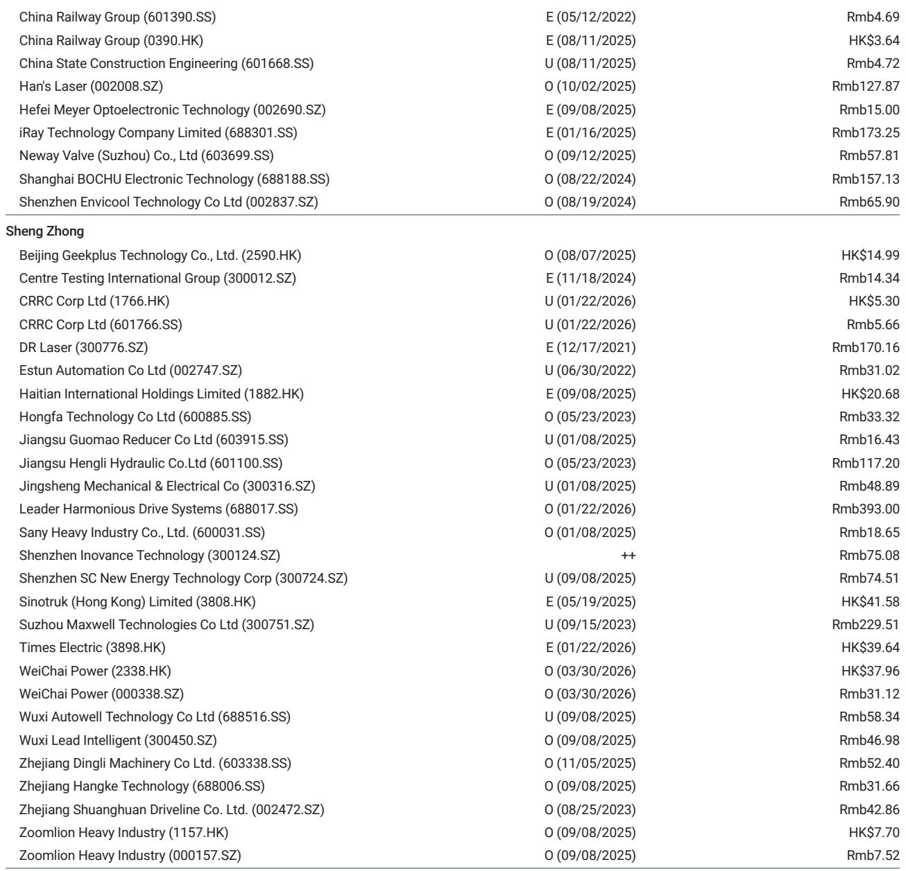
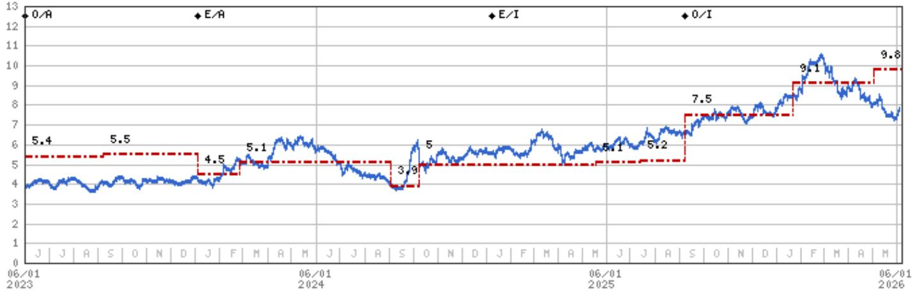
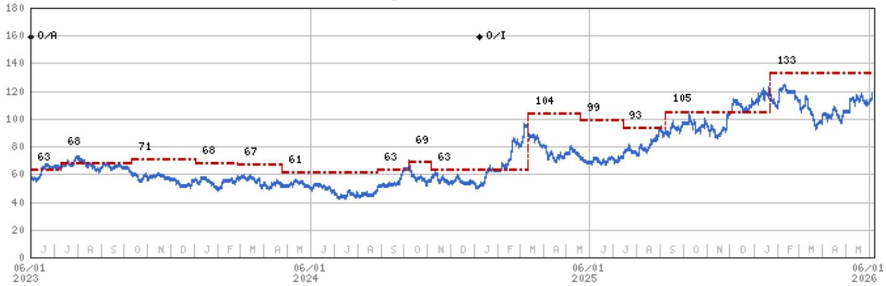

# China's Excavator Boom Is Not Just a Stimulus Story: The Real Driver Is Structural Global Share Gains

The narrative around China's construction machinery sector has long been framed by domestic property cycles and fiscal stimulus. May 2026 excavator sales data shatters that narrow lens. Total sales surged 36% year-on-year to 24,794 units, with domestic sales climbing 39% and exports rising 34%. The headline numbers are impressive, but the pattern beneath them tells a more important story. This is not merely a cyclical rebound fueled by front-loaded local government special bond issuance. It is the emergence of a structural upcycle driven by two forces that are far more durable: the electrification-led replacement cycle inside China, and the irreversible expansion of Chinese original equipment manufacturers (OEMs) into global markets.

The market is currently pricing these companies as if they are still tied to the fate of Chinese real estate. That assumption is increasingly outdated. The composition of demand, the pricing power being exercised by OEMs, and the geographic diversification of revenues all point to a regime change. Investors who treat this as just another stimulus bounce risk missing the bigger transformation underway. The question is not whether the cycle is real. The question is whether the market has fully grasped how the cycle has changed.

## The Domestic Surge Is Driven by Electric Replacement, Not Property Recovery

Domestic excavator sales of 11,628 units in May, up 39% year-on-year, appear at first glance to signal a rebound in construction activity. A closer reading of the data and management commentary suggests otherwise. The primary catalyst is the front-loading of local government special bond issuance, which has accelerated infrastructure spending. But the more significant structural factor is the replacement cycle for electric excavators.

China's emissions standards upgrade is creating a forced replacement dynamic that is fundamentally different from past cycles. Operators of older diesel excavators face mounting regulatory pressure and operating cost disadvantages. Electric models, while carrying a higher upfront price, offer dramatically lower total cost of ownership in urban and high-utilization applications. This is not discretionary spending. It is a compliance-driven capital expenditure cycle that will persist regardless of property market conditions.

The OEM price hikes announced by Sany, XCMG, and Liugong, effective from mid-May through June, provide critical evidence that this demand is not price-sensitive. In a truly weak market, manufacturers cannot raise prices without losing volume. The fact that they are doing so, and still seeing 39% domestic growth, indicates that customers are buying out of necessity, not optionality. This pricing power supports margin recovery and suggests that the replacement cycle has further to run.

Yet the domestic story still carries risk. The 31% month-on-month decline from April to May reflects the lumpy nature of bond-funded infrastructure projects. The sustainability of domestic demand depends on whether local governments continue to issue and deploy special bonds at a pace that sustains machine hours. The second half of the year could see a deceleration if fiscal front-loading exhausts the annual quota early. Investors must distinguish between the structural electric replacement tailwind and the cyclical infrastructure boost that will eventually fade.

## Export Growth Is Becoming Self-Reinforcing and Diversified

The export data is where the structural thesis becomes most compelling. May exports of 13,166 units grew 34% year-on-year, bringing the five-month total to 58,748 units, up 33%. These numbers are particularly striking given the headwinds: the ongoing Middle East conflict, rising fuel prices, and geopolitical tensions that have disrupted supply chains for many Chinese exporters in other sectors.

Chinese excavator exports are growing not because of a single market windfall, but because of broad-based share gains across Europe, Latin America, and Africa. This is the result of a multi-year investment in distribution networks, after-sales service infrastructure, and product reliability that has finally reached a tipping point. Chinese OEMs are no longer selling on price alone. They are competing on availability, parts supply, and financing terms that incumbents like Caterpillar and Komatsu struggle to match in emerging markets.

The resilience of export growth through a period of geopolitical uncertainty suggests that Chinese manufacturers have achieved a degree of market penetration that is unlikely to reverse. Once local dealers and rental fleets commit to a brand ecosystem, switching costs become significant. The export trajectory is now less dependent on any single region or macroeconomic shock. It is becoming a structural growth engine that can sustain 20-30% annual growth for several more years.

The key question for investors is whether export margins can match domestic margins. Historically, Chinese OEMs have accepted lower margins on exports to gain market share. Sany's guidance of approximately 20% top-line growth on overseas demand, with a better excavator mix and stable pricing, suggests that margin convergence is beginning. If export margins continue to improve, the earnings power of these companies will expand faster than volume growth alone would imply.

## OEM Pricing Power Signals a Shift from Volume Competition to Value Competition

The decision by Sany, XCMG, and Liugong to raise prices in the middle of a strong demand cycle is one of the most underappreciated signals in the report. For years, the Chinese construction machinery industry was defined by brutal price competition that compressed margins and punished shareholders. The current price increases suggest that the industry structure is changing.

Several factors support this shift. First, the electric replacement cycle reduces price sensitivity because customers are making long-term total cost of ownership calculations rather than comparing upfront purchase prices. Second, the consolidation of the industry has reduced the number of aggressive price-cutters. Third, the strong export market provides an alternative outlet for production capacity, reducing the incentive to chase domestic volume at any cost.

Zoomlion's expectation of improving growth as FX drag eases and overseas momentum broadens further supports the view that margins are at an inflection point. The foreign exchange losses that have weighed on reported earnings are a near-term accounting issue, not a structural problem. As the renminbi stabilizes and overseas revenues grow as a share of total revenue, the FX impact will diminish.

The sustainability of pricing power depends on demand remaining strong. If domestic sales decelerate in the second half of the year, the temptation to cut prices will return. But the combination of electric replacement demand and export growth provides a buffer that did not exist in previous cycles. The industry may have reached a point where pricing discipline is self-reinforcing, because no single player wants to trigger a price war that would destroy the margin recovery they have all worked to achieve.

## What the Report Does Not Fully Answer: The Durability of the Global Upcycle

The report is unequivocally positive on the global construction machinery upcycle, and the data supports that view. But there are several open questions that the report does not fully resolve, and these are the questions that will determine whether the current cycle is a multi-year opportunity or a peak that fades quickly.

First, how much of the export growth is driven by inventory restocking by overseas dealers versus genuine end-user demand? If dealers are building inventories in anticipation of further price increases or supply constraints, the export numbers may overstate final demand. A destocking cycle would reverse the growth trajectory abruptly.

Second, can Chinese OEMs maintain their market share gains in Europe if protectionist measures are escalated? The European Union has already shown willingness to impose tariffs on Chinese electric vehicles. Construction machinery could be next. The report notes share gains in Europe, but does not address the regulatory risk that could reverse them.

Third, what is the replacement cycle for electric excavators? The initial wave of replacement demand is strong, but the addressable market for electric models is limited by infrastructure constraints. Not all construction sites have access to reliable charging. The pace of adoption will depend on battery technology improvements and grid investment that are outside the control of OEMs.

Fourth, how will the property sector recovery, or lack thereof, affect domestic demand in 2027? If infrastructure spending normalizes and electric replacement demand peaks, the domestic market could face a sharp deceleration. The report's positive view on domestic sales is heavily dependent on policy support that may not be sustained.

These unanswered questions do not invalidate the bullish thesis. But they define the risk parameters that serious investors must monitor. The cycle is real, but it is not without vulnerabilities.

## A Decision Framework for Investors: Distinguishing Cyclical from Structural

The most valuable contribution of this report is not the sales data itself, but the framework it provides for distinguishing between cyclical and structural drivers. Investors who treat all revenue growth as equal will misprice these companies. A disciplined approach requires separating the components.

Start with domestic sales. Break them into three buckets: infrastructure-driven demand, electric replacement demand, and property-related demand. Infrastructure-driven demand is cyclical and policy-dependent. Electric replacement demand is structural and regulatory-driven. Property-related demand is secularly declining. The composition matters more than the total. A company with high exposure to electric replacement will have more durable earnings than one that relies on infrastructure.

Next, analyze export growth by region. Distinguish between market share gains in mature markets like Europe, where Chinese brands are displacing incumbents, and growth in emerging markets, where the overall pie is expanding. The former is a zero-sum game that depends on competitive advantage. The latter is a rising tide that lifts all players. The quality of export revenue differs significantly between these two scenarios.

Finally, assess pricing power. The ability to raise prices in a strong demand cycle is a sign of industry structure improvement. But the real test will come when demand softens. Investors should watch for whether OEMs maintain price discipline during seasonal downturns or revert to volume-at-any-cost behavior. The price increases announced in May and June are a positive signal, but they are not yet proof of a permanent shift.

This framework allows investors to build scenarios. In the base case, electric replacement sustains domestic demand, export growth continues at 20-30%, and pricing holds. In the bear case, infrastructure spending fades, export growth slows due to protectionism, and price competition returns. The current data supports the base case, but the bear case risks are real and should be priced accordingly.

## The Full Picture Requires Looking Beyond the Headlines

The May excavator sales data is undeniably strong. But the real insight lies in the composition of that strength. Domestic growth is not a property recovery. Export growth is not a one-off. Pricing power is not a mirage. These are structural shifts that are reshaping the competitive landscape of the global construction machinery industry.

The report from a global investment bank provides the data and the initial analysis. But the full picture requires understanding the strategic implications for each company in the ecosystem. Sany's guidance of 20% top-line growth on overseas demand is a signal. Zoomlion's expectation of improving growth as FX drag eases is a signal. The price increases are a signal. The question is whether the market is reading these signals correctly or still anchoring to the old narrative.

For investors who want to go deeper, the original report includes detailed charts on monthly excavator sales volume versus Sany's share price, valuation methodologies, and risk factors for each covered company. These materials provide the granularity needed to make informed investment decisions.

Join the community to read the full report and review the original charts.

*This article is for learning and discussion only and does not constitute investment advice.*

Personal reading notes and learning share only. Not investment advice.

