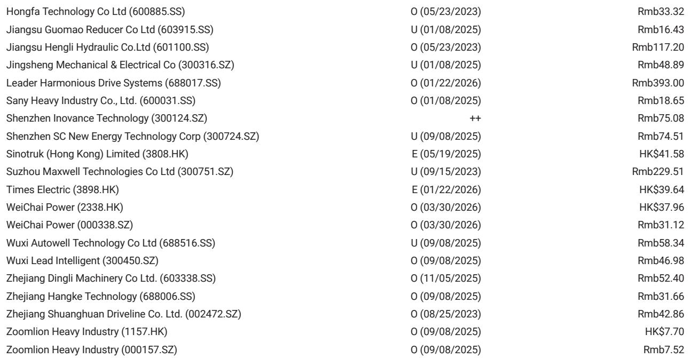
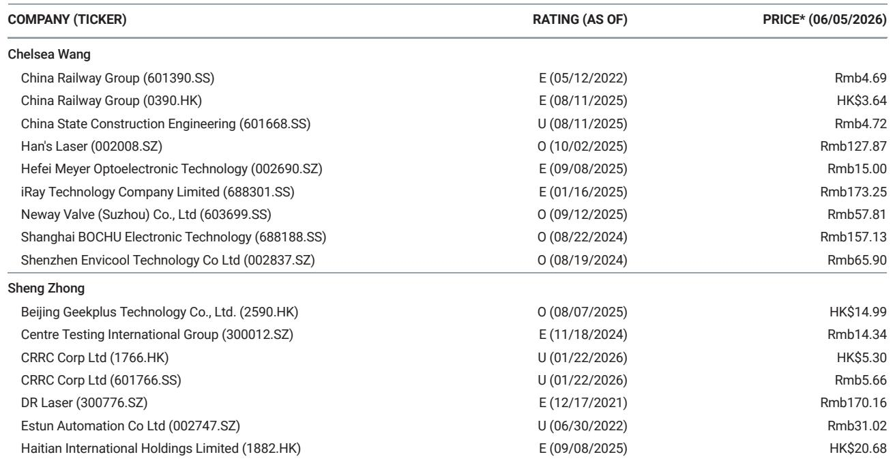
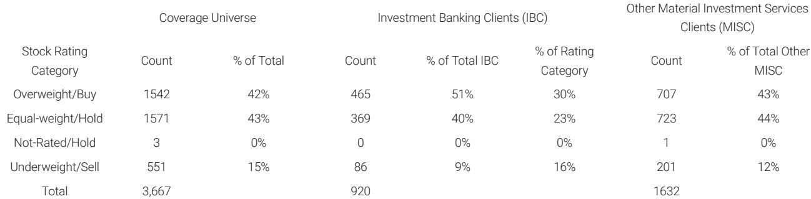

# China's Industrial Capex Boom Is Broader and More Structural Than the Market Realizes

The conventional narrative that China's industrial recovery is narrow, fragile, or merely policy-driven misses what is actually unfolding on the ground. A recent field trip meeting with more than two dozen industrial companies across automation, AI equipment, battery machinery, and construction equipment reveals something far more consequential: a capital expenditure upcycle that is simultaneously broader in scope, deeper in technology intensity, and more durable in its drivers than any cycle in recent memory. This is not a repeat of the 2016-2017 commodity-led rebound or the 2020-2021 post-COVID export surge. It is a structural shift anchored by three mutually reinforcing forces: artificial intelligence hardware investment, multi-year product innovation cycles in consumer electronics, and a globalization strategy that is transforming Chinese manufacturers from low-cost exporters into indispensable technology partners.

The most striking finding from this trip is the breadth of optimism. Unlike prior cycles where demand was concentrated in a single downstream sector, this upcycle touches everything from ultrafast laser drilling machines for AI servers to harmonic reducers for humanoid robots, from solid-state battery equipment to electric construction machinery. Companies are not merely reporting strong orders; they are expanding capacity, raising margin expectations, and extending their technology roadmaps. The message from management teams is consistent and unambiguous: the demand environment today is meaningfully stronger than it was just three months ago, and the visibility into 2026 and 2027 is improving.

This article translates the field-level evidence into a strategic framework for investors. The core argument is that China's industrial equipment sector has entered a super-cycle defined by technology iteration, supply chain localization, and global capacity deployment. The implications for portfolio construction are significant, but so are the unresolved questions that the report leaves open. We will examine why this cycle is different, where the biggest surprises are emerging, what risks remain underappreciated, and how investors can position themselves for the next phase.

## AI Hardware Equipment Is Driving a Step-Change in Equipment Value and Margins, Not Just Volume

The most powerful force in this cycle is the artificial intelligence hardware buildout, and its impact on equipment suppliers is fundamentally different from past technology waves. In previous cycles, equipment demand was largely about adding capacity to produce more of the same product. This time, the demand is driven by rapid technology iteration that forces customers to upgrade their production lines every generation, creating a recurring revenue stream for equipment makers.

Consider the evidence from Han's Laser, which is seeing its ultrafast laser drilling equipment deployed for AI servers, optical modules, and through-glass via applications. The average selling price for these machines is RMB 5-7 million per unit, and the company has already secured over 20 new orders year-to-date from leading PCB manufacturers. This is not a commodity business. The gross margin on AI-related equipment is significantly higher than on conventional laser systems, and the technology moat is widening with each generation. Similarly, GKG Precision's solder paste equipment used in AI servers commands gross margins of approximately 65%, far above the company's average.

The structural insight here is that AI is not just creating demand for more chips and servers; it is creating demand for entirely new classes of manufacturing equipment. Optical module assembly automation, X-ray CT inspection for PCB back drilling, and automated optical inspection for optical modules are all examples of equipment categories that barely existed two years ago. The companies that master these technologies are building competitive advantages that will persist across multiple product cycles. The question investors should ask is not whether AI equipment demand will grow, but which companies have the technology depth to capture the highest-value segments of this emerging ecosystem.

## The Apple Supply Chain Is Entering a Multi-Year Innovation Cycle That Extends Well Beyond Smartphones

One of the most underappreciated themes from the trip is the strength of the Apple supply chain. The consensus view has been that Apple's equipment demand is cyclical and tied to iPhone replacement cycles. The evidence from this trip suggests something very different. Apple is preparing for a major product innovation cycle spanning 2026 and 2027, including a foldable phone launch this year and six new phone models next year, including an anniversary edition. But the equipment opportunity extends far beyond traditional 3C automation.

The new technology roadmaps include 3D printing for structural components, vapor chamber thermal solutions, variable-aperture camera modules, and ultra-thin glass processing. Each of these requires specialized equipment that Chinese suppliers are developing in close collaboration with Apple. Han's Laser, for example, expects its consumer electronics revenue to roughly double from approximately RMB 2 billion in 2025 to approximately RMB 4 billion in 2026, driven by vapor chamber laser welding, camera module laser cutting, and 3D printing equipment. The gross margin on these new Apple projects is expected to exceed 40%.

The strategic implication is that Apple's equipment supply chain is becoming more diversified and more technologically sophisticated. The old model of buying generic assembly lines from Japanese or European suppliers is giving way to customized, high-precision equipment developed by Chinese manufacturers who can combine rapid prototyping with cost-effective mass production. This creates a virtuous cycle: as Chinese equipment makers prove themselves in Apple's supply chain, they become credible suppliers for other global technology companies. The report notes that Han's Laser is already supplying Meta, and several other companies are in early discussions with non-Apple customers. The question is how quickly this capability can be exported to other end markets.

## Next-Generation Technologies Are Moving from Laboratory Concepts to Early Commercial Validation, Creating Optionality for Equipment Suppliers

Perhaps the most important strategic finding from the trip is that next-generation technology roadmaps are increasingly moving from conceptual discussions to early product research and development and customer validation. This is happening across multiple domains simultaneously: solid-state transformer technology for AI data center power, high-voltage direct current power shelves, co-packaged optics for optical modules, glass substrates for advanced packaging, and solid-state batteries for electric vehicles.

The significance of this shift cannot be overstated. For the past two years, these technologies have been discussed primarily as future opportunities with uncertain timelines. Now, companies are reporting concrete progress. Megmeet has begun HVDC side-car related testing for AI data center power. RoboTechnik has early CPO-related engagement with foreign customers, although mass production is still likely from 2027 onward. Lens Technology, Han's Laser, and Hymson are all working on TGV and glass-substrate related processes, with pilot-line opportunities expected next year.

This creates a powerful optionality for equipment suppliers. Even if only a fraction of these technologies achieve mass production, the equipment demand could be substantial. Solid-state battery equipment, for example, has an estimated equipment value of approximately RMB 500 million per GWh, and full-line equipment tenders could emerge by year-end. The report indicates that Japanese and Korean customers are targeting high-end vehicle adoption of solid-state batteries in 2027, while CATL targets small-scale mass production around 2030. For companies like Wuxi Lead, which already dominates lithium battery equipment, the solid-state transition represents a second growth curve that could extend the cycle for another decade.

The unresolved question is which of these technologies will achieve mass production first, and which equipment suppliers will emerge as leaders. The report is candid in acknowledging that it is still too early to identify clear winners at this stage. The competition will intensify when new technologies enter the mass production phase, and the companies with the deepest customer relationships and the most advanced process knowledge will have significant advantages. For investors, the key is to identify companies that are investing in multiple next-generation technologies simultaneously, creating a portfolio of options that can capture upside regardless of which technology wins.

## Globalization of Capacity Is Becoming a Structural Competitive Moat, Not Just a Tariff Hedge

The conventional view of Chinese industrial companies' overseas expansion is that it is primarily a defensive response to tariffs and trade barriers. The evidence from this trip suggests a more strategic motivation. Several companies are preparing overseas capacity not just to serve customers who require local content, but to build a "China engineering plus overseas delivery" capability that is becoming a key competitive differentiator in the AI era.

Consider the examples from the report. Megmeet is preparing Thailand capacity for Nvidia power products. Hengli Hydraulic is preparing Mexico screw capacity for the leading US humanoid robot company. Zhaowei has Thailand capacity largely ready for overseas humanoid customers. Topstar is preparing Vietnam capacity for Apple-related precision equipment. These are not low-cost assembly operations. They are high-technology manufacturing facilities that combine Chinese engineering expertise with local delivery capability.

The strategic logic is compelling. As technology cycles accelerate, customers increasingly value suppliers who can provide rapid product development and fast delivery. Chinese companies have demonstrated an unmatched ability to iterate quickly and scale production efficiently. By establishing overseas capacity, they can offer the best of both worlds: Chinese speed and innovation combined with local responsiveness and supply chain resilience. This is particularly important in the AI hardware supply chain, where technology cycles are measured in months rather than years and where supply chain disruptions can have outsized consequences.

The report does not fully address the risks associated with this globalization strategy. Building overseas capacity requires significant capital investment, management attention, and navigation of complex regulatory environments. Not all companies will succeed. The question for investors is which companies have the financial strength, operational expertise, and customer relationships to execute this strategy effectively. The early evidence suggests that the companies with the strongest technology positions and the deepest customer relationships are the most likely to succeed.

## A Decision Framework for Investors: Three Dimensions to Evaluate Equipment Companies

Based on the evidence from this trip, investors should evaluate industrial equipment companies along three dimensions: technology intensity, customer concentration, and globalization capability. Each dimension captures a different aspect of the structural opportunity and risk.

Technology intensity measures the degree to which a company's equipment is driven by rapid technology iteration rather than simple capacity expansion. Companies with high technology intensity benefit from recurring upgrade cycles, higher margins, and stronger competitive moats. Han's Laser's ultrafast laser drilling and GKG Precision's AI server solder paste equipment are examples of high technology intensity. Companies with low technology intensity, such as those producing commodity automation components, face more cyclical demand and greater pricing pressure.

Customer concentration captures the diversity and quality of a company's customer base. Companies serving multiple high-growth end markets, such as AI hardware, consumer electronics, and electric vehicles, have more resilient demand than companies dependent on a single customer or end market. Wuxi Lead's diversification across lithium battery, solid-state battery, SOFC, MLCC, and humanoid equipment is an example of desirable customer diversification. Companies with high exposure to a single customer, such as those heavily dependent on Apple, face concentration risk even if the near-term outlook is strong.

Globalization capability measures a company's ability to establish overseas manufacturing capacity and serve global customers. Companies with strong globalization capability can capture market share from foreign competitors and build structural competitive advantages. Hengli Hydraulic's Mexico capacity for humanoid screws and Megmeet's Thailand capacity for Nvidia power products are examples of companies investing in globalization. Companies without overseas capacity face the risk of being shut out of key growth markets due to tariff barriers or customer preferences for local content.

The most attractive investment opportunities are companies that score highly on all three dimensions: high technology intensity, diversified customer base, and strong globalization capability. These companies have multiple paths to growth and are best positioned to navigate the uncertainties of the current cycle.

## The Unanswered Questions: What the Report Does Not Fully Resolve

Despite the breadth and depth of the evidence, the report leaves several important questions unanswered. The most significant is the trajectory of humanoid robotics. While the report indicates that a leading US company's near-term ramp appears slower than earlier expectations, with current volumes still limited and unlikely to reach 1,000 units per week in the fourth quarter, the medium-term outlook remains positive. But the gap between expectations and reality is substantial, and the risk of further delays is real. Investors should monitor quarterly shipment data closely and be prepared for volatility in related stocks.

Another unresolved question is the sustainability of the AI hardware equipment cycle. The current wave of investment is driven by the buildout of AI data centers and the transition to next-generation server architectures. But technology cycles can be unpredictable, and a slowdown in AI investment or a shift to a different technology paradigm could disrupt the equipment demand trajectory. The report does not model what happens if AI capex growth decelerates in 2027 or 2028.

Finally, the report does not fully address the competitive dynamics within the Chinese equipment industry. As the upcycle attracts new entrants and existing players expand capacity, pricing pressure could emerge, particularly in segments where technology differentiation is limited. The report highlights several companies with strong competitive positions, but it does not provide a systematic analysis of which segments are most vulnerable to margin compression.

## Join the Community to Read the Full Report and Review the Original Charts

The evidence from this field trip represents a critical data point for understanding the trajectory of China's industrial equipment sector. The full report contains detailed takeaways from each company meeting, including specific revenue guidance, margin expectations, and capacity expansion plans. The original charts provide visual context for the key trends and comparisons across companies and segments.

For investors who want to go deeper, the report identifies specific companies that are best positioned to benefit from each of the structural themes discussed above. It also highlights the key risks and uncertainties that could alter the trajectory. The analysis is grounded in direct conversations with management teams and reflects the most current information available.

Join the community to read the full report and review the original charts. The complete analysis includes company-specific data points, cross-segment comparisons, and a detailed assessment of the technology roadmaps that will shape the next phase of the cycle.

*This article is for learning and discussion only and does not constitute investment advice.*

Personal reading notes and learning share only. Not investment advice.

