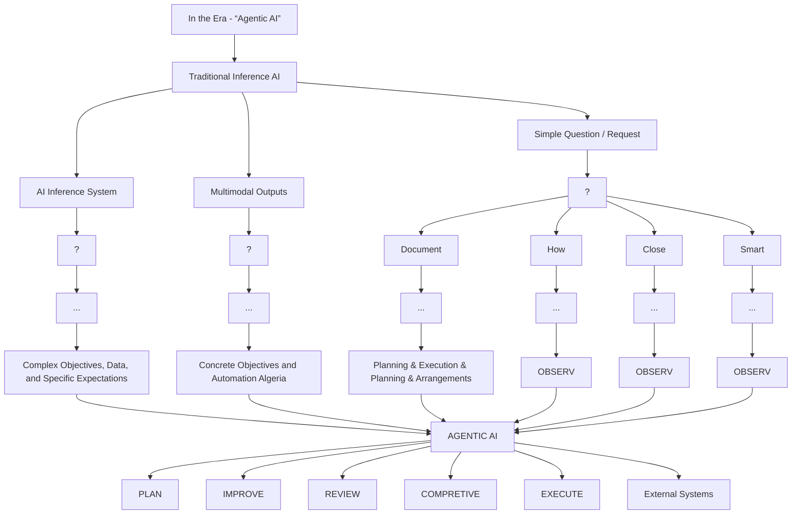

你是闲鱼资料类商品文案编辑，擅长把一份投研/行业/公司研报改写成适合闲鱼发布的商品说明。

【目标】
- 基于下面研报解析内容，生成一份可以复制到闲鱼商品详情里的中文文案。
- 风格参考用户提供的闲鱼对标笔记：标题直给、信息密度高、用途明确、适合人群明确、交付方式清楚。
- 语言要自然，像真实卖家发布，不要像公众号文章、小红书笔记或 AI 摘要。
- 不要使用太夸张的营销词，不要承诺收益，不要说“稳赚”“内幕”“必涨”。
- 可以适度口语化，但不要低俗。
- 硬性要求：全文不要使用任何 emoji 或符号表情。
- 硬性要求：全文必须低于 1500 字，宁可少写，也不要超长。

【必须输出结构】
1. `闲鱼标题：` 一行，控制在 30 字以内，适合商品标题。
2. `商品描述：` 正文，适合直接粘贴到闲鱼详情页。
3. `Hashtag：` 一行，给 6-10 个平台可用标签，用 `#` 开头，空格分隔。

【长度硬性要求】
- 输出总字数必须低于 1500 字，包括标题、商品描述、Hashtag。
- 商品描述控制在 900-1200 字以内，避免写成长文。
- 亮点 bullet 每条控制在 30 字以内。

【严禁输出】
- 不要输出 `建议价格：`。
- 不要输出 `搜索关键词：`。
- 不要输出“搜索词”“关键词”“搜索关键词”等栏目。
- 不要给具体价格区间、成交承诺或价格建议。
- 不要使用任何 emoji，例如 ✅、🔥、📌、👉、💰、⭐ 等。

【商品描述写法】
- 第一段：直接说明这是什么报告，页数/语言/主题/公司或行业。如果页数、日期、语言不确定，就不要编。
- 第二段：说明适合谁，比如投研、券商面试、PE/VC、行业研究、学习参考、写报告等。
- 第三段：用 3-5 个亮点 bullet，风格参考：
  - 三大情景框架：DCF、P/ARR、EV/Sales
  - 关键变量分析
  - 估值逻辑、假设、终值占比等核心内容覆盖
  - 适合准备 AI 相关面试、研究 AI 估值的同学
- 第四段：交付说明，参考：`资料为电子版 PDF，拍下后 24 小时内发网盘链接或邮箱。`
- 第五段：虚拟商品说明，参考：`电子类资料一经发货不退不换，有问题可以提前咨询。`
- 可以补一句：`需要其他报告也可以私聊，支持一站式咨询。`

【Hashtag 写法】
- 只输出平台相对安全、偏学习和资料属性的标签。
- 推荐从这些里选择：`#学习资料` `#研究笔记` `#学习笔记` `#行业研究` `#研报资料` `#资料整理` `#报告学习` `#案例研究`。
- 不要输出 `#财经` `#投资` `#股票` `#基金` `#理财` `#暴富` `#内幕` 等敏感标签。

【平台发布合规要求】
- 不要出现“投资建议”“买入”“卖出”“强烈推荐”“稳赚”“保本”“必涨”“抄底”“上车”“内幕”“翻倍”等金融操作或收益承诺表达。
- “投资”相关词尽量改成“投研”“研究”“观察”“学习参考”；如果必须保留，也要保持中性。
- 不要出现“独家”“原版”“内部”“无水印”“全网最低”“最全”“最强”“必看”等高风险或极限词。
- 不要写“关注”“点赞”“求关注”“评论区留言”等直接互动诱导。
- 不要承诺资料一定可用于获利、就业、通过面试或获得收益。

【合规与避坑】
- 默认避免出现具体投行品牌名，比如“GS”“GS”“MS”，统一写作“投行研报”或“投行研报”。
- 不要承诺研究或交易结果。
- 不要伪造页数、日期、作者、公司覆盖范围。研报未给出时就不写。
- 不要输出解释说明，只输出闲鱼文案本身。

【研报解析内容】
"""
## Greater China Technology Semiconductors | Asia Pacific

# Computex takeaways: Cloud, PC and old memory

Data points suggest a stronger outlook. The memory optimization on server is more of a supply issue. Recent share price volatility should provide a good entry point.

## Key Takeaways

■ Stronger outlook for CPU, GPU and peripherals (e.g. CXL) in 2027  
■ Agentic PC has not taken off yet, but PC semis remain stable on orders/GM into 2H26  
- Old memory: stronger pricing for legacy flash into 2H26  
We continue to like cloud semis and old memory over PC semis

Cloud semis: Need more supply for strong demand: GPU servers continue to ramp up with some minor changes to specs. CPU servers see strong demand mainly on AI/agentic applications (link). The lower DRAM content on ARM servers is more of a supply issue (link), while we see stronger demand on CXL to expand RDIMM usage in x86 CPUs. CPO-related components could see earlier pull-in from 1Q27 to 4Q26.

PC semis: Agentic PC makes sense but is very expensive; better than feared 2H26 outlook: Not only are there CPU and memory upgrades in RTX Spark NB, but we also see some brands upgrading the screen to 4K. For the DT, we learned potential specs could be 128GB DRAM with 4TB SSD; starting pricing point at US\$10k. Near term, we think PC semis customers are willing to pay the price hikes on memory. This suggests the PC semis GM could remain stable even with the further wafer cost hike from foundries in 3Q.

Old memory: likely in more shortage: We believe legacy NAND (SLC), could enjoy stronger growth outlook into the next two years. SLC NAND could be used as the high performance eSSD in the datacenter (link). Meanwhile, we also believe SLC will be used by hard disk drives to enhance performance. We also noticed high-density NOR pricing hit US\$8 from the prior US\$1 at channel, likely driven by 2x content in VR vs GB.

Stock implications – stay bullish amid market volatility: We continue to like cloud semis (Aspeed, Montage, both OW), old memory (Winbond, Macronix, APMemory, Gigadevice, all OW). PC semis could see a better than feared 2H outlook. Parade (OW) and Elan (OW) have new growth drivers vs Realtek (EW), Novatek (UW), Asmedia (UW).

MS TAIWAN LIMITED+

## Daniel Yen, CFA

Equity Analyst

Daniel.Yen@morganstanley.com +886 2 2730-2863

## Charlie Chan

Equity Analyst

Charlie.Chan@morganstanley.com +886 2 2730-1725

MS ASIA LIMITED+

## Daisy Dai, CFA

Equity Analyst

Daisy.Dai@morganstanley.com +852 2848-7310

MS TAIWAN LIMITED+

## Tiffany Yeh

Equity Analyst

Tiffany.Yeh@morganstanley.com +886 2 7712-3032

MS ASIA LIMITED+

## Ethan Jia

Research Associate

Ethan.Jia@morganstanley.com +852 3963-2287

MS TAIWAN LIMITED+

## Lucas Wang

Research Associate

Lucas.Wang@morganstanley.com +886 2 2730-2875

text_image

Asia Summer School 2026

## GREATER CHINA TECHNOLOGY SEMICONDUCTORS

Asia Pacific

Industry View

Attractive

MS does and seeks to do business with companies covered in MS. As a result, investors should be aware that the firm may have a conflict of interest that could affect the objectivity of MS. Investors should consider MS as only a single factor in making their investment decision.

## For analyst certification and other important disclosures, refer to the Disclosure Section, located at the end of this report.

+= Analysts employed by non-U.S. affiliates are not registered with FINRA, may not be associated persons of the member and may not be subject to FINRA restrictions on communications with a subject company, public appearances and trading securities held by a research analyst account.

## Key takeaways

## Cloud remains strong, especially on the CPU side:

Vera CPU is built for running agents, aside from pre-training, post-training and inference. Highlights include: 1) high IPCs (instructions per clock) - 10 instructions fetched, decoded, and executed per clock; 2) high bandwidth per core - each of the 88 Olympus cores is provisioned with up to 14 GB/s of memory bandwidth; 3) high external bandwidth of 1.2 TB/s and high core-to-core bandwidth of 3.4 TB/s; 4) high energy efficiency, as the first CPU to use LPDDR5X. Vera achieves 3x more bandwidth per core vs x86 CPUs with DDR5, and 40% lower peak memory latency vs x86, 1.8x agentic sandbox performance of x86 CPUs.

During his meeting with financial analysts (link), Nvidia's CEO mentioned that they plan to sell millions of Vera CPUs; half of those will be in the headnode, and outside of headnode, the other half of the CPUs are to orchestrate workloads or to be in storage servers. When asked about the future CPU to GPU ratio, his response was that it's hard to guess the ratio, but that the AI factory is valued for tokens, so he would suggest his customers to maximize the amount of Vera Rubin NVL72 racks, and put as many CPUs as necessary, while as few CPUs as possible to support the GPUs.

We believe the 2.5mn-4mn units of Vera CPUs in preparation for not just Vera Rubin but also standalone Vera CPU servers (link) represent a strong opportunity for Aspeed from its BMC content, and will be neutral for Montage as it continues to use SOCAMM rather RDIMM modules.

Separately, during Marvell's keynote speech, Nvidia's CEO shared his view that as useful AI arrives, agents have a particular computing pattern which is disaggregated and distributed, and that connectivity is necessary in the agentic AI computing process. This reaffirms our positive view on Montage as a leader in global memory interface chips and China PCIe interconnect chips.

Exhibit 1: Nvidia Vera CPU specs  

text_image

NVIDIA Vera
CPU for Agents
NVIDIA-Custom Olympus Core
88-Core / 176-Threads
Spatial Multithreading
10-Wide Instruction Fetch/Decode
2MB L2 per Core / 164MB L3
250W - 450W TDP
1.2 TB/s LPDDR5X ECC
40% Lower Loaded Latency
(vs x86)
3.4 TB/s Core-to-Core BW
1.4 TB/s PCIe Gen6
1.8 TB/s NVLink C2C

Source: Nvidia

Exhibit 2: Close-up look of a Vera CPU tray  

natural_image

Model of a satellite or spacecraft module with grid panels and labeled 'MEMSIA Hens CPU tray' (no readable text beyond label)

Source: Nvidia

## AI PC is a positive driver but could take time to materialize:

During his meeting with financial analysts, Nvidia's CEO described the future AI PC as assistants that run all the time with easy access and strong agentic capabilities. The idea is to reshape what a PC is, from what is similar to a typewriter today to becoming an assistant in the future, implying significant ASP upside per PC. He believes the future AI PC will be run by agents smart enough to fully utilize the full features of the operating system and software, and as PCs become agentic (with "useful AI"), inference takes off. AI PC is not meant to be a competition to the agents run on cloud, as the cloud AI models will still be smarter, but the on-premise AI models will be smart enough; for example, Nemotron Ultra 3 is near the frontier and as good as the frontier model 6 months ago. AI PC will be uniquely useful when handling local files and local tools compared to AI on

cloud.

While AI PC is a positive driver for the PC semi names, their price points seem expensive. Our checks with PC brands at this year's Computex (link) suggest AI PCs with N1X will need to price at US\$2,899, while N1 models will be priced at US\$1,799. Our view on PC semi names remain cautious due to compressed demand and elevated component and manufacturing costs. On the positive side, customers seem fine with price hikes, and therefore we now believe PC semis players could see a better than feared 2H outlook. Parade (OW) and Elan (OW) have new growth drivers vs Realtek (EW), Novatek (UW), Asmedia (UW).

Exhibit 3: Nvidia RTX Spark Laptops with Blackwell RTX GPU, Grace CPU, and 128GB unified memory  

text_image

Announcing NVIDIA and
Microsoft Reinvent PC
Powered by RTX Spark

Blackwell RTX GPU
1 Petaflop FP4 AI Performance

20 Core Grace CPU
Custom Built with MediaTek

128 GB Unified Memory
600 GB/s NVLink C2C

Full NVIDIA Stack
CUDA | TensorRT | NVFP4
RTX Ray Tracing | DLSS | Reflex | G-SYNC

Source: Nvidia

Exhibit 4: Nvidia's Nemotron Ultra 3 open model is cost effective and fast  

line chart

Announcing NVIDIA Nemotron 3 Ultra
30% Lower Cost
| Model | Cost to Task Completion (USD) | % Coding Tasks Completed (%) |
|---|---|---|
| Alibaba | $250 | 22 |
| Kimi | $750 | 23 |
| NVIDIA | $500 | 21 |
| Z.ai | $750 | 22 |
| Kimi-K2.6 | $1,000 | 43 |
| GLM-5.1 | $1,500 | 60 |
| Qwen3.5 | $2,000 | 75 |

Source: Nvidia

Exhibit 5: Integrated AI vision & camera system for drones will be a major growth driver for Elan  

text_image

LAN
Integrated AI Vision &
Camera System
for Drones
Author: Heliangyuan Drones
High Speed Delivery Drone
Advanced Drones
Advanced Ground Control
Station
Solution & AI
Smart Accessories
System
BC
12.0000
12.0000
12.0000
12.0000
12.0000
12.0000
12.0000
12.0000
12.0000
12.0000
12.0000
12.0000
12.0000
12.
12.05
12.14
12.23
12.32
12.41
12.50
12.69
12.88
12.97
13.06
13.15
13.24
13.33
13.42
13.51
13.60
13.79
13.88
13.97
14.06
14.15
14.24
14.33
14.42
14.51
14.60
14.79
14.88
14.97
15.06
15.15
15.24
15.33
15.42
15.51
15.60
15.79
15.88
15.97
16.06
16.15
16.24
16.33
16.42
16.51
16.60
16.79
16.88
16.97
17.06
17.15
17.24
17.33
17.42
17.51
17.60
17.79
17.88
17.97
18.06
18.15
18.24
18.33
18.42
18.51
18.60
18.79
18.88
18.97
19.06
19.15
19.24
19.33
19.42
19.51
19.60
19.79
19.88
19.97
20.06

Source: Elan

Exhibit 6: Realtek's single-chip solution for ethernet and high-speed IO integration  

text_image

REALTEK
RTL9151AS
PCIe 60 Multi-IO Bridge Controller
Single-Chip for Ethernet and
High-Speed IO Integration
RTL9151AS
• The Only PCIe to Multi-IO Bridge Solution on the Market: BGA239
13x13mm2
• Flexible IO Configuration: 2.5GbE LAN, USB 10G, USB 5Gbps, USB 2.0,
and SATA 8
• Only 1-Lane PCIe UFP: Save PCIe Lanes for Other Applications Such as
Storage and Graphics
• Single Chip Solution: Simplifies PCB Layout Design
• Applications, Motherboards, (Mini) PCIe, NAS, Game Consoles, and More
REALTEK

Source: Realtek

## Old memory:

Kioxia shared their latest view on NAND demand and technology in the context of AI inference and especially agentic AI. Data center NAND bit demand is expected to grow at a 34% CAGR from 2025 to 2031, with AI inference CAGR at 56%, based on numbers quoted from Techinsights. In the era of agentic AI, inference becomes multi-step with increasing compute demand; long context increases data and KV cache, making storage efficiency and bandwidth critical; rack server systems grow in importance requiring frequent access to large data.

Kioxia proposed 3 key development directions for SSD products, namely super high IOPS GPU direct storage; high performance / high capacity context memory storage; and ultra high capacity training & inference data storage. The GPU direct storage solution is what we believe adopts Kioxia's proprietary SLC chip (link), which we believe is positive for legacy NAND vendors in our coverage, namely GigaDevice, Winbond, and Macronix.

More details on the GPU direct storage: HBM has very high performance but limited capacity, so there is a gap between data size and memory capacity. SSDs serve as an extension layer, but traditional data transfer goes through CPUs, which cases delays and overheads. GPU direct storage solves this by transferring data directly between SSD and

GPU. This reduces latency and improves efficiency. As a result, SSD can extend HBM with large capacity. This allows GPUs to handle larger data sets more efficiently. For example, with direct high-speed data transfer enabled by GPU direct storage, graph neural networks can stream large data sets from SSD to GPU with low latency, and RAG systems can process vector database indexing faster and more efficiently. With GPU direct storage, HBM, DRAM and SSD work together as one memory system.

Exhibit 7: Agentic AI transforms inference  

flowchart

Source: Kioxia

Exhibit 8: GPU direct storage  

text_image

GPU Direct Storage
■ Expanding HBM capacity by GPU direct SSD access.
GPU Server
Direct GPU-to-SSD Access
GPU Direct Storage Server
Super High IOPS SSD
□ Designed to overcome HBM scalability and cost constraints
□ GPU-Driven IO
√ UP-5 200 MIPS/GPU
□ Small Chunk Data Access
✓ 9/2 Byte
✓ Low Latency
Best Suited Applications
Large-Scale Data for Graph Neural Networks
Accelerating Vector DB Indexing with GPU
Vector DB

Source: Kioxia

Exhibit 9: Expansion of inference AI server system  

text_image

Expansion of Inference AI Server System - TOMORROW
Storage Server
Training & Inference Data
Context Memory
Storage Server
KV Cache
GPU Server
Leaming Snapshot
LLM Inference Cache
GPU Direct
Storage Server
New Use Case
RAG Server
Vector DB for RAG

Source: Kioxia

Exhibit 10: Key directions for SSD products  

text_image

3 Key Directions for SSD products
Super High IOPS
GPU Direct Storage
High Performance
High Capacity
Context Memory Storage
Cusing Controlled I/O/G/L Band SDD
Ultra High Capacity
■ Generative AI evolution has created and accelerated
3 direction for SSD.
Segment
Typical Usage
Super High IOPS
KIOXIA GP series
■ GPU Direct Storage
High Performance / High Capacity
KIOXIA CM series
■ Context Memory Storage
Ultra High Capacity
KIOXIA LC series
Training & Inference Data Storage

Source: Kioxia

## Disclosure Section

The information and opinions in MS were prepared or are disseminated by MS Asia Limited (which accepts the responsibility for its contents) and/or MS Asia (Singapore) Pte. (Registration number 199206298Z) and/or MS Asia (Singapore) Securities Pte Ltd (Registration number 200008434H), regulated by the Moneta

[中间内容因长度限制已省略]

/td></tr><tr><td>OmniVision Integrated Circuits Group Inc (603501.SS)</td><td>E (11/17/2025)</td><td>Rmb95.39</td></tr><tr><td>Phison Electronics Corp (8299.TWO)</td><td>E (02/25/2026)</td><td>NT$2,450.00</td></tr><tr><td>SG Micro Corp. (300661.SZ)</td><td>E (11/03/2025)</td><td>Rmb107.74</td></tr><tr><td>Silergy Corp. (6415.TW)</td><td>U (05/19/2026)</td><td>NT$582.00</td></tr><tr><td>SMIC (0981.HK)</td><td>O (10/21/2025)</td><td>HK$75.65</td></tr><tr><td>TSMC (2330.TW)</td><td>O (02/07/2022)</td><td>NT$2,365.00</td></tr><tr><td>UMC (2303.TW)</td><td>O (05/19/2026)</td><td>NT$131.50</td></tr><tr><td>Vanguard International Semiconductor (5347.TWO)</td><td>E (01/14/2026)</td><td>NT$161.50</td></tr><tr><td>WIN Semiconductors Corp (3105.TWO)</td><td>U (07/14/2025)</td><td>NT$483.50</td></tr><tr><td colspan="3">Daisy Dai, CFA</td></tr><tr><td>ASMPT Ltd (0522.HK)</td><td>O (07/24/2025)</td><td>HK$176.00</td></tr><tr><td>China Resources Microelectronics Limited (688396.SS)</td><td>U (03/02/2026)</td><td>Rmb66.58</td></tr><tr><td>Elan Microelectronics Corp (2458.TW)</td><td>O (10/03/2025)</td><td>NT$158.50</td></tr><tr><td>Empyrean Technology Co Ltd (301269.SZ)</td><td>E (01/17/2025)</td><td>Rmb98.73</td></tr><tr><td>Hangzhou Silan Microelectronics Co. Ltd. (600460.SS)</td><td>U (08/25/2025)</td><td>Rmb33.95</td></tr><tr><td>Innoscience (2577.HK)</td><td>E (10/13/2025)</td><td>HK$71.55</td></tr><tr><td>JCET Group Co Ltd (600584.SS)</td><td>E (01/16/2026)</td><td>Rmb75.65</td></tr><tr><td>Shanghai Fudan Microelectronics (1385.HK)</td><td>O (03/07/2025)</td><td>HK$28.80</td></tr><tr><td>SICC Co Ltd (688234.SS)</td><td>O (03/20/2026)</td><td>Rmb130.93</td></tr><tr><td>StarPower Semiconductor Ltd (603290.SS)</td><td>E (05/14/2026)</td><td>Rmb113.18</td></tr><tr><td>Unigroup Guoxin Microelectronics Co Ltd (002049.SZ)</td><td>U (01/10/2023)</td><td>Rmb75.14</td></tr><tr><td>Universal Scientific Ind. (Shanghai) (601231.SS)</td><td>O (11/05/2025)</td><td>Rmb42.66</td></tr><tr><td>Yangjie Technology (300373.SZ)</td><td>O (06/10/2022)</td><td>Rmb102.87</td></tr><tr><td colspan="3">Daniel Yen, CFA</td></tr><tr><td>AP Memory Technology Corp (6531.TW)</td><td>O (07/11/2025)</td><td>NT$1,010.00</td></tr><tr><td>ASMedia Technology Inc (5269.TW)</td><td>U (10/03/2025)</td><td>NT$1,525.00</td></tr><tr><td>Aspeed Technology (5274.TWO)</td><td>O (06/09/2025)</td><td>NT$17,505.00</td></tr><tr><td>Egis Technology Inc (6462.TWO)</td><td>E (01/28/2026)</td><td>NT$116.00</td></tr><tr><td>Espressif Systems (688018.SS)</td><td>O (05/15/2023)</td><td>Rmb120.25</td></tr><tr><td>GigaDevice Semiconductor Beijing Inc (603986.SS)</td><td>O (05/15/2025)</td><td>Rmb488.00</td></tr><tr><td>Macronix International Co Ltd (2337.TW)</td><td>O (09/18/2025)</td><td>NT$150.00</td></tr><tr><td>Montage Technology Co Ltd (6809.HK)</td><td>O (03/18/2026)</td><td>HK$368.80</td></tr><tr><td>Montage Technology Co Ltd (688008.SS)</td><td>O (03/18/2026)</td><td>Rmb239.39</td></tr><tr><td>Novatek (3034.TW)</td><td>U (02/04/2026)</td><td>NT$492.00</td></tr><tr><td>Nuvoton Technology Corporation (4919.TW)</td><td>U (11/10/2025)</td><td>NT$178.00</td></tr><tr><td>Parade Technologies Ltd (4966.TWO)</td><td>O (05/27/2026)</td><td>NT$736.00</td></tr><tr><td>Powerchip Semiconductor Manufacturing Co (6770.TW)</td><td>O (10/27/2025)</td><td>NT$74.60</td></tr><tr><td>Realtek Semiconductor (2379.TW)</td><td>E (01/30/2026)</td><td>NT$643.00</td></tr><tr><td>Shenzhen Goodix Technology Co Ltd (603160.SS)</td><td>U (07/14/2025)</td><td>Rmb55.32</td></tr><tr><td>Winbond Electronics Corp (2344.TW)</td><td>O (05/28/2026)</td><td>NT$162.00</td></tr><tr><td>WPG Holdings (3702.TW)</td><td>O (03/16/2026)</td><td>NT$114.50</td></tr><tr><td>WT Microelectronics Co. Ltd. (3036.TW)</td><td>O (01/27/2026)</td><td>NT$281.00</td></tr><tr><td colspan="3">Duan Liu</td></tr><tr><td>Dosilicon Co Ltd (688110.SS)</td><td>U (09/06/2024)</td><td>Rmb126.00</td></tr><tr><td>Shenzhen Longsys Electronics Co Ltd (301308.SZ)</td><td>E (02/25/2026)</td><td>Rmb520.01</td></tr><tr><td>AllRing Tech Co. (6187.TWO)</td><td>O (09/23/2025)</td><td>NT$1,120.00</td></tr><tr><td>FOCI Fiber Optic Communications Inc (3363.TWO)</td><td>O (01/15/2025)</td><td>NT$908.00</td></tr><tr><td>Himax Technologies Inc (HIMX.O)</td><td>E (02/04/2026)</td><td>US$20.08</td></tr><tr><td>Hon Precision (7769.TW)</td><td>O (04/17/2026)</td><td>NT$7,275.00</td></tr><tr><td>MPI Corporation (6223.TWO)</td><td>O (04/17/2026)</td><td>NT$5,765.00</td></tr><tr><td>Silicon Motion (SIMO.O)</td><td>O (05/06/2024)</td><td>US$258.70</td></tr><tr><td>WinWay Technology Co Ltd (6515.TW)</td><td>O (04/17/2026)</td><td>NT$8,425.00</td></tr></table>

Stock Ratings are subject to change. Please see latest research for each company.  
\* Historical prices are not split adjusted.

Tiffany Yeh

© 2026 MS
"""
