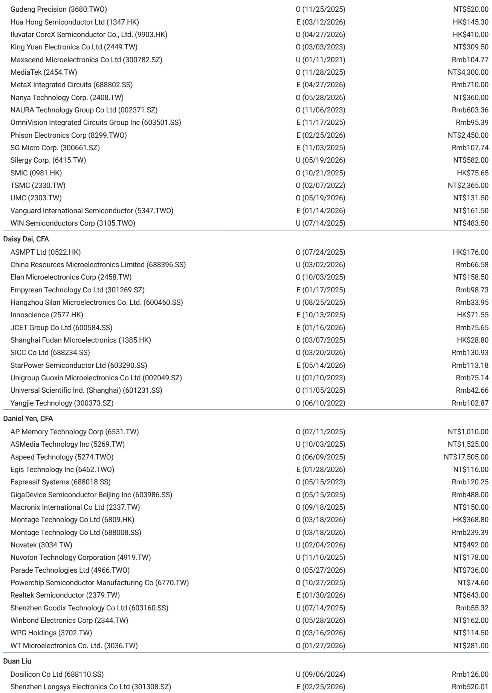
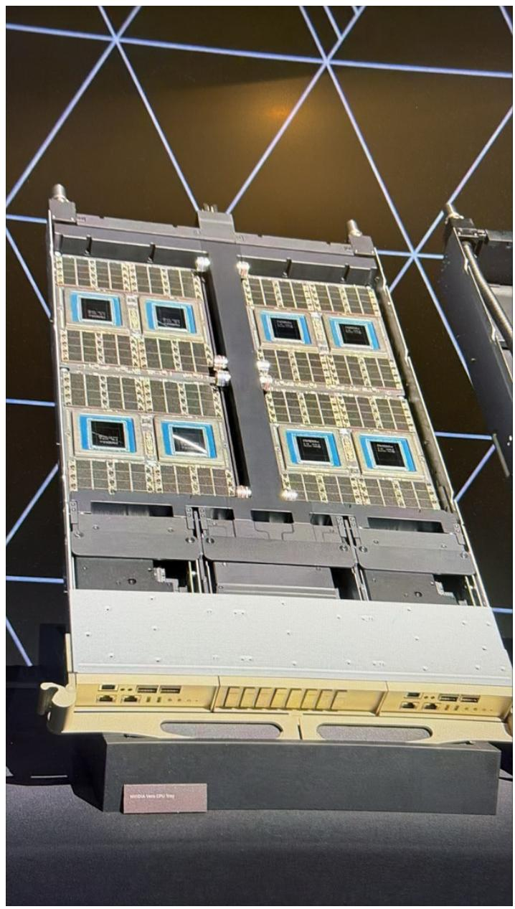
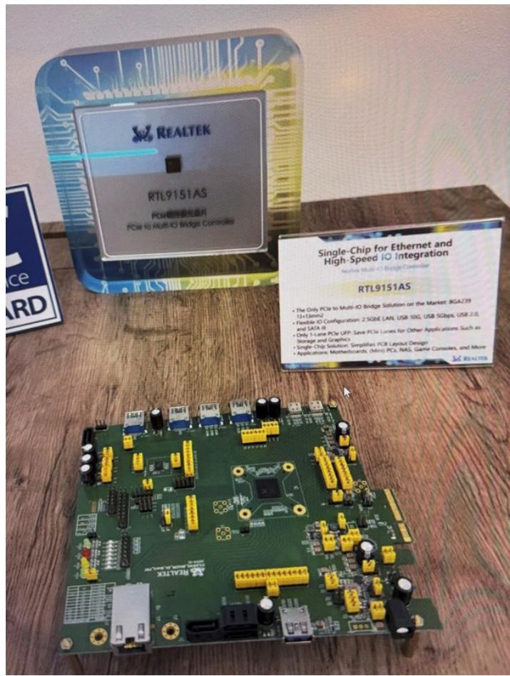

# The Semiconductor Demand Story Is Shifting from Training to Inference, and the Winners Are Not Who You Think

The conventional narrative that the semiconductor boom is solely about training large language models is becoming dangerously incomplete. Data emerging from Computex 2025 suggests a more nuanced, and strategically important, shift is underway. The next wave of demand is being driven by agentic AI—systems that plan, execute, and iterate autonomously—and this shift has profound implications for which semiconductor segments will outperform. The evidence points to a stronger outlook for cloud CPUs, GPU peripherals, and a surprising resurgence in "old memory" technologies, even as the much-hyped agentic PC remains a promise for the future rather than a present-day revenue driver. For investors, the key insight is that the recent share price volatility in the sector is not a signal to retreat, but rather a tactical entry point into a market that is fundamentally restructuring around inference workloads.

The central argument emerging from the Computex data is that the semiconductor supply chain is being reshaped by two forces operating at different speeds. On one hand, cloud infrastructure demand is accelerating as hyperscalers prepare for the agentic era, requiring more CPUs, more memory bandwidth, and new interconnect technologies. On the other hand, the PC segment is experiencing a "better than feared" stabilization, driven not by a surge in consumer demand but by a willingness among enterprise buyers to absorb higher component costs for AI-capable machines. The disconnect between these two speeds creates a clear investment hierarchy: cloud semiconductors and legacy memory are the structural winners, while PC semiconductors offer tactical, but not strategic, opportunities.

## The Cloud CPU Is No Longer a Supporting Actor; It Is Becoming a Co-Star in the AI Infrastructure Story

The most consequential insight from Computex is that the CPU is being re-architected for the agentic era, and this is not a marginal upgrade. Nvidia's Vera CPU, designed explicitly for running agents, represents a fundamental rethinking of what a server CPU must deliver. The specifications are telling: 88 custom Olympus cores capable of fetching, decoding, and executing 10 instructions per clock cycle, provisioned with up to 14 GB/s of memory bandwidth per core, and a total external bandwidth of 1.2 TB/s. This is a machine built for the disaggregated, distributed computing pattern that agentic AI requires.

What matters for the semiconductor supply chain is the scale of the opportunity. Nvidia's CEO has signaled plans to sell millions of Vera CPUs, with half deployed in headnodes and the other half distributed across storage servers and workload orchestration roles. This implies a unit volume of 2.5 million to 4 million Vera CPUs in preparation not just for the Vera Rubin GPU platform but also for standalone CPU servers. For a company like Aspeed, which supplies the baseboard management controllers (BMCs) for these servers, this represents a direct and measurable demand driver. For Montage Technology, the implications are equally clear: the continued use of SOCAMM memory modules in Vera systems, rather than standard RDIMMs, preserves its competitive position, while the broader trend toward disaggregated computing reinforces the need for its memory interface and PCIe interconnect chips.

The strategic point here is that the CPU-to-GPU ratio in future AI factories is not a fixed parameter. When asked directly about this ratio, Nvidia's CEO gave an answer that should be read carefully: the AI factory is valued for tokens, so customers should maximize GPU racks and use "as many CPUs as necessary, while as few CPUs as possible to support the GPUs." This is not a negative signal for CPU demand. On the contrary, the phrase "as many CPUs as necessary" implies a floor, not a ceiling. The necessity is driven by the agentic workload pattern, which is inherently CPU-intensive for orchestration, data movement, and context management. The Vera CPU is the physical embodiment of this necessity. The investment implication is that cloud CPU semiconductor suppliers are not merely riding the coattails of GPU growth; they are becoming essential infrastructure for a new computing paradigm.

## The Agentic PC Is Real, but It Is a 2027 Story Disguised as a 2026 Headline

The Computex show floor was filled with demonstrations of AI PCs, and the technology is genuinely impressive. Nvidia's RTX Spark laptops, combining a Blackwell RTX GPU, a Grace CPU, and 128 GB of unified memory, represent a genuine leap in local computing capability. The vision is compelling: a PC that runs an always-on AI assistant capable of fully utilizing the operating system and software, handling local files and tools in ways that cloud-based models cannot. Nvidia's CEO described this as reshaping the PC from a "typewriter" into an "assistant," implying significant average selling price (ASP) upside per unit.

The problem is the price point. Our checks with PC brands at Computex indicate that AI PCs with the N1X chip will need to be priced at USD 2,899, while N1 models will come in at USD 1,799. These are not consumer price points. They are enterprise workstation price points. The market for a USD 2,899 laptop, no matter how capable, is fundamentally limited in the near term. The question is not whether the technology works, but whether the addressable market is large enough to move the needle for PC semiconductor suppliers in 2026.

The answer, based on the data, is that the PC semiconductor outlook is "better than feared" rather than "strong." Customers appear willing to absorb price hikes on memory and other components, which suggests that gross margins for PC semiconductor players could remain stable even as foundry costs rise. This is a tactical positive, not a strategic inflection. Companies like Parade Technologies and Elan Microelectronics have new growth drivers—Parade in display interfaces and Elan in integrated AI vision systems for drones—that provide idiosyncratic upside beyond the PC cycle. But for the broader PC semiconductor complex, the agentic PC is a 2027 story. The 2026 outlook is one of stabilization, not acceleration.

This creates a clear analytical distinction. The cloud semiconductor opportunity is structural and front-loaded. The PC semiconductor opportunity is cyclical and back-loaded. Investors should weight their portfolios accordingly.

## Legacy Memory Is Experiencing a Renaissance Driven by GPU Direct Storage and Agentic Inference

The most counterintuitive finding from Computex is the resurgence of "old memory" technologies, specifically SLC NAND and high-density NOR flash. In an era dominated by HBM and DDR5, the idea that legacy NAND could be a growth story seems almost anachronistic. Yet the data supports this view, and the logic is compelling.

The driver is GPU Direct Storage, a technology that allows data to move directly between SSDs and GPUs without passing through the CPU. This eliminates a significant latency bottleneck in the current server architecture. HBM offers very high performance but limited capacity, creating a gap between the size of AI datasets and the available fast memory. SSDs serve as an extension layer, but traditional data transfer through the CPU introduces delays and overhead. GPU Direct Storage solves this by enabling direct, high-speed data transfer, effectively creating a unified memory system where HBM, DRAM, and SSD work together.

Kioxia's presentation at Computex laid out the implications clearly. Data center NAND bit demand is expected to grow at a 34% CAGR from 2025 to 2031, with AI inference demand growing at 56%. The key development directions for SSD products are super-high IOPS for GPU Direct Storage, high-performance/high-capacity context memory storage, and ultra-high capacity training and inference data storage. The super-high IOPS segment is precisely where Kioxia's proprietary SLC chip is deployed, and this is positive for legacy NAND vendors such as GigaDevice, Winbond, and Macronix.

The second leg of the legacy memory story comes from NOR flash. We observed high-density NOR pricing reaching USD 8, up from a prior level of USD 1 at the channel level. This is likely driven by a doubling of NOR content in VR headsets compared to previous generations, as well as broader adoption in edge AI devices. The magnitude of this price increase suggests a genuine supply-demand imbalance, not a temporary spike.

The strategic implication is that the market is systematically underestimating the demand for non-HBM memory in the AI era. The narrative has been dominated by HBM capacity constraints and the race to stack more DRAM layers. But the agentic AI workload pattern—multi-step inference, long context windows, frequent access to large datasets—creates demand for a tiered memory hierarchy where high-performance SSDs and specialized NOR flash play essential roles. The legacy memory vendors in our coverage are not relics; they are beneficiaries of a structural shift in how AI systems manage data.

## The Report Leaves an Unanswered Question About the Sustainability of Cloud Capex at These Levels

For all the conviction in the cloud semiconductor thesis, there is a question that the Computex data does not fully resolve: how sustainable is the current level of cloud capital expenditure? The demand signals are strong, but they are being driven by a relatively small number of hyperscale customers who are placing bets on the agentic AI thesis. If those bets prove premature, or if the ROI from agentic AI deployments takes longer to materialize than expected, the capex cycle could moderate.

The Vera CPU volumes cited in the report—2.5 million to 4 million units—are substantial, but they are also dependent on the pace of Vera Rubin adoption. Nvidia's roadmap is aggressive, but the history of semiconductor investment cycles is littered with examples of capacity built in anticipation of demand that arrived later than expected. The question is not whether agentic AI will drive demand, but when. If the adoption curve is slower than the current capex trajectory assumes, the cloud semiconductor suppliers could face a period of inventory correction.

This is not a reason to be bearish on the thesis, but it is a reason to be disciplined about entry points. The report's suggestion that recent share price volatility provides a good entry point is consistent with this view. The volatility reflects uncertainty about timing, not about direction. For investors with a 12- to 18-month horizon, the risk-reward is favorable. But the full report would benefit from a more detailed analysis of the sensitivity of cloud capex to agentic AI adoption rates, and the potential for a mid-cycle pause.

## A Decision Framework for Positioning in the Semiconductor Cycle

The Computex data provides a clear framework for portfolio positioning. The first principle is to distinguish between structural and cyclical demand. Cloud semiconductors are structural: the shift to agentic AI requires more CPUs, more memory bandwidth, and more interconnect bandwidth regardless of the macroeconomic environment. Legacy memory is also structural: the GPU Direct Storage architecture is a permanent change to server design, not a temporary trend.

The second principle is to be cautious about extrapolating PC semiconductor strength. The "better than feared" outlook for the second half of 2026 is a function of customer willingness to absorb cost increases, not of surging end-demand. This is a margin story, not a volume story. It supports tactical positions in companies with idiosyncratic growth drivers, such as Parade and Elan, but it does not justify broad exposure to the PC semiconductor complex.

The third principle is to use volatility as an opportunity. The report's recommendation to stay bullish amid market volatility is supported by the data. The demand signals from Computex are stronger than the market appears to be pricing in, particularly for cloud CPUs and legacy memory. The recent sell-off in semiconductor stocks reflects macro uncertainty and positioning adjustments, not a deterioration in the fundamental outlook.

The actionable framework is straightforward: overweight cloud semiconductors and legacy memory, underweight PC semiconductors except for names with specific catalysts, and use any further weakness as an opportunity to add to positions. The agentic AI thesis is intact, and the supply chain is preparing for a multiyear investment cycle.

---

Join the community to read the full report and review the original charts.

*This article is for learning and discussion only and does not constitute investment advice.*

Personal reading notes and learning share only. Not investment advice.

