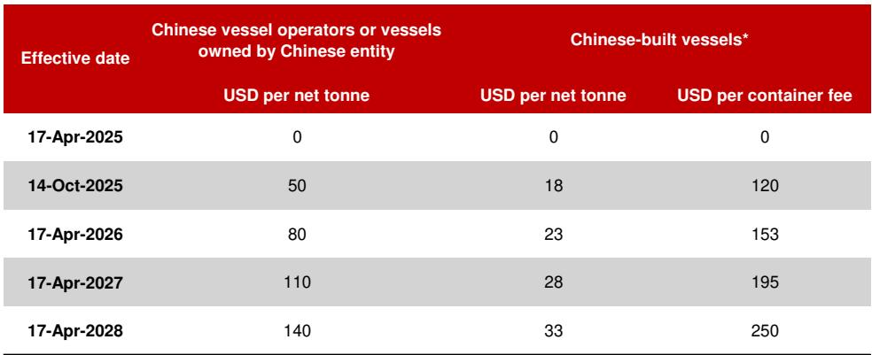
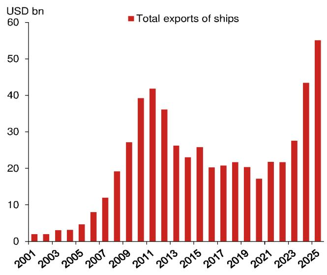
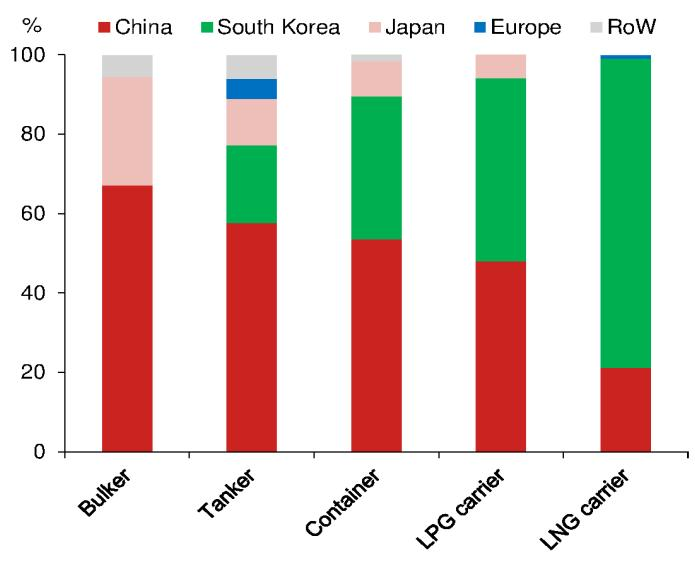

# China's Shipbuilding Lead Is Not Fading—It Is Being Misread Through a Policy Lens

The dominant narrative of the past year—that China's shipbuilding dominance is cracking under Washington's pressure—is a statistical illusion. Headline market share figures have swung sharply, dropping from roughly three-quarters of new orders in 2024 to a trough in mid-2025, before recovering to approximately 63 percent for the full year and close to 70 percent in the first quarter of 2026. This V-shaped pattern has been widely attributed to the effectiveness of U.S. sanctions and allied diversion strategies. That interpretation is wrong. The primary driver was not policy but a cyclical contraction in global ordering concentrated precisely in the segments where China is strongest. The policy-driven diversion that did occur was real but largely temporary, and it has already begun to unwind.

The suspension of the U.S. Trade Representative's Section 301 docking fees, agreed at the Xi-Trump summit in Busan and left intact after President Trump's subsequent state visit to Beijing, has removed the most immediate source of uncertainty. Yet the suspension expires on 10 November 2026, with no successor framework in place. This creates a specific, time-bound risk that investors and strategists must track closely. But the underlying structural reality is clear: China's yards hold close to 70 percent of the global orderbook by tonnage so far in 2026, and our core view is that this lead will persist through the cycle.

The question for serious observers is not whether China's dominance is eroding—it is not—but how the contest is actually evolving beneath the surface. The answer reveals a more complex picture: Washington's allied-yards strategy is advancing faster than its domestic rebuilding efforts, but it remains constrained by the same industrial bottlenecks it is designed to overcome. And a leadership change at the U.S. Navy has exposed an unresolved tension over how far that allied role can extend.

## The swing in China's market share reflects the cycle, not a structural loss of competitiveness

The most widely cited statistic of the past year—that China's share of new shipbuilding orders roughly halved from its 2024 peak—requires careful decomposition. On a Clarksons Research compensated-gross-tonnage basis, the share fell from around three-quarters in 2024 to a trough in mid-2025, when South Korea briefly led monthly ordering, before recovering to roughly 63 percent for the full year. China's Ministry of Industry and Information Technology reports a higher figure of 69 percent on a deadweight basis, which structurally flatters China given its order mix. The early data for 2026 reinforce the recovery trajectory, with China taking around 70 percent of global orders by compensated gross tonnage in the first quarter, even as total global contracting rose by some 40 percent year-on-year.

Three forces drove this pattern, and they carry very different weights. The first was genuine policy-driven diversion. Between the initial USTR announcement in April 2025 and the actual implementation of fees in October, owners facing an uncertain charge structure had a rational incentive to steer orders linked to U.S. trade lanes away from Chinese yards. Major liner alliances reconfigured their rotations to limit Chinese-built calls at American ports. This accounts for much of South Korea's surge in the first half of 2025. But it represents a hedge against policy uncertainty, not a durable reallocation of demand.

The second and most underappreciated force is the cyclical mismatch. Global ordering fell sharply in 2025—down 27 percent by compensated gross tonnage—and the contraction was concentrated in tankers and bulkers, precisely the segments in which China has the largest share. In the first ten months of the year, product-tanker orders fell by close to 85 percent year-on-year, while crude-tanker orders declined by around 31 percent. The only major segment to grow over the full year was containerships, a segment where China also holds a commanding position. Much of the apparent quarterly share loss was therefore a statistical artefact of a shrinking and unfavourably weighted denominator. This is the single most overlooked feature of the 2025 data.

The third force was the post-truce unwinding. Once the Busan understanding established a twelve-month buffer, the incentive to avoid Chinese yards faded, and China's share climbed through the closing months of 2025 and into 2026. This is the clearest evidence that the earlier dip was contingent on sentiment and order mix rather than reflecting a permanent loss of competitiveness.

## China's green-shipbuilding pivot is creating a self-reinforcing structural advantage

The most strategically significant development in China's shipbuilding sector over the past year is not captured by headline market share figures at all. Green-fuel-capable vessels—spanning LNG, methanol, LPG, ethane-based and electric propulsion—accounted for 80.2 percent of China's new international shipbuilding orders in the first quarter of 2026, according to the Ministry of Industry and Information Technology. This represents an increasingly successful hedge into the high-value segments where China has historically lagged behind South Korea.

The milestone deliveries in the first quarter of 2026 are instructive. China delivered the 15,000-TEU methanol dual-fuel "Kun" series containership and the 174,000 cubic-metre "Tianshan" LNG carrier, demonstrating that its yards can now produce the most technically demanding vessels in the energy transition fleet. As the global fleet transitions toward alternative fuels under the International Maritime Organization's greenhouse gas framework and the European Union's FuelEU Maritime regulation, China's early and aggressive positioning means that its structural share could rise as a natural consequence of the energy transition, independent of policy or cyclical factors.

The implication is straightforward: the more the world regulates carbon emissions from shipping, the more it will need the vessels that China is best positioned to build. This is not a forecast of market share stability. It is a forecast of market share expansion driven by regulatory tailwinds that are beyond the reach of trade policy.

## The Strait of Hormuz closure exposed the limits of allied capacity

The closure of the Strait of Hormuz in early 2026 generated a powerful demand pulse in tanker ordering that revealed the true state of global shipbuilding capacity. The transmission mechanism operates through tonne-miles rather than cargo volumes. As Gulf crude is re-routed via longer alternative paths, each vessel is occupied for more days per voyage, while dozens of tankers trapped inside the strait are physically removed from the trading fleet. The combination of a structurally constrained fleet, freight rates roughly double their year-earlier levels, and the expectation of a prolonged inventory replenishment cycle created a compelling case for new orders—particularly given that approximately 20 percent of the crude tanker fleet is over 20 years old.

The data are striking. Tanker orders tripled year-on-year in the first quarter of 2026, with tankers accounting for 32 percent of total contracts, the highest proportion since the second quarter of 2017. And China captured this surge disproportionately: its yards took over 90 percent of new VLCC orders.

This episode matters not because it is repeatable—the Hormuz closure is a singular event—but because it demonstrates the structural depth of China's capacity advantage. When the market needed volume and speed, it turned to the yards that could deliver. Allied yards, constrained by capacity and lead times, could not respond at scale. This is the pattern that Washington's strategy must overcome.

## Japan's marginalisation means the allied strategy rests almost entirely on Korean capacity

Japan's continued decline in commercial shipbuilding is one of the most consequential developments for the allied-yards strategy, yet it receives remarkably little attention. According to BIMCO and Clarksons data, Japanese yards captured approximately 1 percent of global newbuilding contracting in the first quarter of 2026, the lowest share since at least 1996. Japan's new export orders fell a further 15 percent in fiscal year 2025, marking a fourth consecutive annual decline. The Japan Ship Exporters' Association attributes the weakness to a persistent labour shortage.

Tokyo has responded by designating shipbuilding a strategic sector and targeting a doubling of annual capacity by 2035, backed by roughly one trillion yen in planned public and private investment. But the gap between ambition and reality is large. If Japan cannot contribute meaningfully to commercial shipbuilding, then the allied pillar of Washington's strategy rests almost entirely on Korean capacity. That is a single point of failure in a strategy designed to diversify away from dependence on China.

The structural detail of the Korean commitment matters a great deal. As part of its July 2025 trade agreement, Seoul committed a $150 billion package to support shipbuilding in the U.S. under the banner of "Make American Shipbuilding Great Again." This commitment was tied directly to a reduction in its U.S. tariffs. The package is constructed predominantly from government-backed guarantees and loans, with the U.S. retaining project-selection authority. This design secures allied financing while concentrating control on the American side. The flagship project is Hanwha's planned investment of roughly $5 billion to expand the Philadelphia shipyard toward twenty vessels a year. In early 2026, Hanwha won a subcontract for concept-design work on the Navy's Next-Generation Logistics Ship, and President Trump signalled that the Navy could partner with Hanwha on a new frigate class.

But the programme has proceeded despite Beijing's previously announced—and now suspended—sanctions on Hanwha's U.S. subsidiaries. This provides an early read on both the limits of Beijing's tolerance and the resilience of the arrangement. Japan, meanwhile, remains a step behind, with its contribution still concentrated in naval maintenance and repair without a shipbuilding investment framework of comparable scale.

## The submarine constraint frames the entire allied strategy and exposes its limits

The reliance on allied yards is ultimately a symptom of a binding capacity constraint, and nowhere is that constraint clearer than in submarines. The U.S. still holds a clear and enduring advantage over the PLA Navy in this domain, but the industrial arithmetic is unforgiving.

Following its review, the administration reaffirmed the first pillar of AUKUS, preserving the sale of three Virginia-class attack submarines to Australia from the early 2030s. The June 2026 Shangri-La trilateral announcement revised the composition to three in-service hulls rather than the original mix of new and pre-owned submarines. The base must reach 2.33 attack boats per year to sustain both the U.S. fleet and the Australian transfers, whereas the current rate is around 1.2 to 1.3, according to the Congressional Research Service.

With Virginia-class construction, the Columbia programme for ballistic missile submarines, the commercial revival, and the AUKUS commitments all competing for the same scarce docks, supply chains and skilled workers, the dependence on Korean and Japanese capacity reflects a hard constraint rather than a policy preference. This is precisely why the allied route has advanced more quickly than domestic rebuilding. But it also means that the allied strategy is itself constrained by the same bottlenecks it is designed to overcome.

The abrupt dismissal of Navy Secretary John Phelan on 22 April 2026 exposed the unresolved tension at the heart of this agenda. The proximate trigger appears to have been Phelan's public suggestion that the Navy should consider building warships in allied yards abroad to ease the domestic labour shortage. This seemingly crossed President Trump's "built in America" line. The distinction that matters is where the ships are built, not primarily who builds them: it is one thing to welcome foreign capital into U.S. yards, as the Korean investment programme does, and quite another to construct American warships overseas.

Acting Navy Secretary Hung Cao has since recast the foreign role in deliberately narrower terms, endorsing a model under which allied partners build only non-sensitive modules while U.S. shipyards retain final assembly and the integration of classified systems. The episode leaves the FY2027 budget request—which seeks $65.8 billion for shipbuilding against the $27.2 billion enacted for FY2026—pointing to clear intent, even as Washington has yet to settle how far the allied role can extend.

## What the report does not fully answer: the durability of the Busan truce and the second-order effects of the capacity constraint

The report provides a detailed and persuasive account of why China's structural lead has endured and why the allied strategy faces significant headwinds. But it leaves several meaningful questions unresolved.

The most immediate is the fate of the Busan truce. The suspension expires on 10 November 2026, and while the report assigns a two-thirds probability that it will be rolled over or softened around the autumn, when President Xi is scheduled to pay a reciprocal state visit to Washington, the mechanism for such an extension is unclear. Neither side derives much benefit from what has proven to be a high-cost and low-yield fight, but the political dynamics on both sides are unpredictable. The report's base case is reasonable, but the range of outcomes is wider than the probability assignment suggests.

The second unresolved question concerns the second-order effects of the U.S. capacity constraint. If the allied strategy is itself constrained by the same bottlenecks it is designed to overcome, then the entire framework rests on an assumption that Korean and Japanese capacity can expand faster than the historical record suggests. The report documents Japan's decline and Korea's steady position, but it does not model the rate at which Korean capacity can scale under the MASGA framework. The $150 billion commitment is large, but the lead times for shipyard expansion are measured in years, not quarters.

The third question is the most strategic: what happens when the current upswing in ordering inevitably gives way to a softer phase? The report acknowledges this as a longer-term challenge, but it does not explore the implications for China's capacity expansion plans or for the allied strategy. If China's yards have been investing aggressively in green-shipbuilding capacity, a downturn in orders could create financial stress that Beijing has not yet had to manage at scale. Conversely, if the allied strategy has not yet built the capacity to capture market share during the downturn, the opportunity to narrow the gap will be lost until the next upswing.

## A decision framework for investors and strategists

The evidence over the past year points to a contest that is intensifying in ambition but narrowing in effect. For readers who need to translate this analysis into actionable decisions, three questions provide a useful framework.

First, what is your time horizon? For the next twelve to eighteen months, the Busan truce is the single most important variable. If it is extended, the current equilibrium holds, and China's structural advantage continues to compound. If it is not extended, the uncertainty premium returns, and the policy-driven diversion that characterised the first half of 2025 could re-emerge. The expiry date is 10 November 2026. Track it as you would a bond maturity.

Second, which segments matter most for your exposure? The report's analysis makes clear that the headline market share figures obscure significant variation across vessel types. China's dominance is strongest in tankers and bulkers, where it holds 58 percent and 67 percent of orders respectively. Its position in LNG carriers is weaker, at 21 percent, though the green-shipbuilding pivot is narrowing this gap. South Korea remains dominant in LNG, with 71 percent of orders. If your exposure is concentrated in LNG shipping, the competitive dynamics are different from those in tanker or bulker markets.

Third, how do you assess the allied strategy's credibility? The report's evidence suggests that the Korean investment programme is real and advancing, but that it is operating at the margin of a binding capacity constraint. The submarine data provide the clearest signal: if the U.S. cannot build enough attack submarines to meet its own requirements plus the AUKUS commitment, it is unlikely to rebuild its commercial shipbuilding capacity on a timeline that matters for the current cycle. The allied strategy is a hedge, not a solution.

## The full picture requires the data

The charts and data underlying this analysis—the V-shaped recovery in China's market share, the composition of the orderbook by vessel type, the trajectory of global ordering, the submarine production shortfall, and the escalation in U.S. Navy shipbuilding requests—provide the empirical foundation for the argument presented here. The report from which this analysis is drawn contains the full set of figures, including the detailed fee schedule for Chinese operators and Chinese-built vessels, the breakdown of green-fuel-capable vessel orders, and the timeline of the Busan truce and its expiry.

These data points are not optional background. They are the evidence that distinguishes the argument made here from the conventional narrative. The headline statistics that dominated media coverage over the past year—the halving of China's market share, the surge in Korean orders, the effectiveness of U.S. sanctions—are either misleading or incomplete without the decomposition that the report provides.

Join the community to read the full report and review the original charts.

*This article is for learning and discussion only and does not constitute investment advice.*

Personal reading notes and learning share only. Not investment advice.

