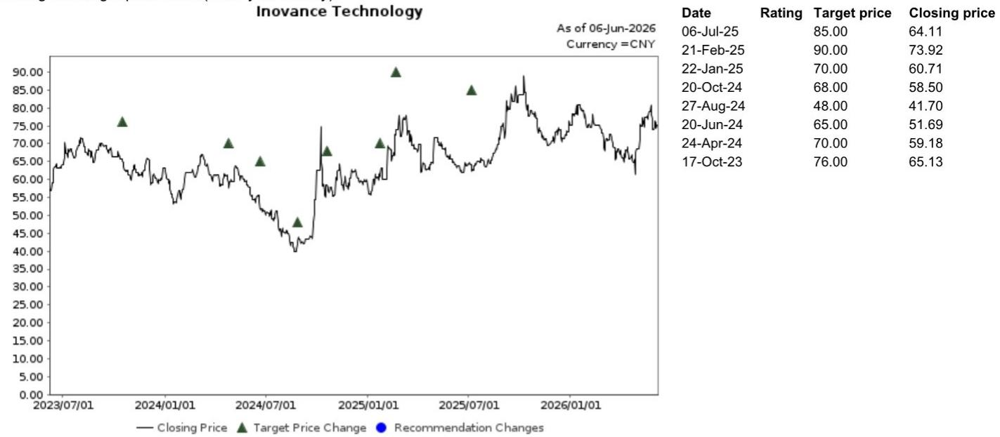
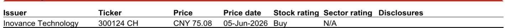

# NOM：工业AI的货币化，市场低估了2-3年过渡期的结构性摩擦

市场对工业AI的讨论，大多集中在“谁先落地”、“谁有模型”、“谁拿到订单”这些叙事层面。但NOM在2026年6月发布的最新研报中，提出了一个更值得深思的框架性判断：工业AI在短期内不是独立的增长引擎，而是附着在存量DCS（分布式控制系统）基础上的收入放大器。真正决定胜负的，不是AI模型的能力，而是谁能把AI嵌入到已经存在的工业控制基础设施中。

这份报告的核心洞察在于，它没有陷入“AI赋能一切”的乐观叙事，而是指出了市场普遍低估的一个关键变量——从当前状态到工业AI规模化落地，中间存在一个2到3年的“过渡痛苦期”。这不仅仅是技术成熟度的问题，而是涉及客户采购习惯、跨厂商兼容性、以及商业模式从项目制向订阅制切换的结构性障碍。

对于关注中国自动化赛道的投资者和产业决策者来说，这份报告提供了一个难得的冷思考视角：在工业AI的宏大叙事背后，真正的货币化路径远比想象中曲折。以下是我们从报告中提炼出的五个关键层次，每一个都指向一个尚未被充分定价的判断。

## 1. 工业AI的竞争，不是模型之争，而是存量工业基础设施的“附着权”

市场容易将工业AI与通用大模型混为一谈，认为谁的自然语言处理能力强、谁的参数规模大，谁就能在工业场景中胜出。NOM的调研给出了截然不同的结论：中国流程工业的AI堆栈建立在四个软件支柱之上——TPT（时序预训练Transformer）、UCS（通用控制系统）、AOP（自主运行工厂）和OMC（运营管理与控制系统），它们全部层叠在开源基础模型之上。这意味着，底层模型的同质化程度很高，真正的差异化来自垂直行业的工艺知识积累。

报告清晰地绘制了国内OT（运营技术）厂商的定位地图：中控技术锚定石化化工，和利时锚定轨交与电力，汇川技术则以新能源为核心。每一个厂商的护城河都不是模型参数，而是数十年积累的工艺know-how。这种“附着权”一旦建立，竞争对手很难通过AI技术突破来撬动客户关系。

这里有一个关键推论：工业AI的竞争本质上是存量DCS安装基础的争夺战。谁控制了DCS，谁就掌握了AI落地的入口。对于新进入者来说，即便AI技术再先进，如果没有与现有控制系统的深度绑定，也很难撬动客户的信任和采购预算。

## 2. 汇川的“物理融合”路径，可能比软件订阅模式更具防御性

NOM在报告中对比了两种截然不同的AI部署路径。中控技术的模式是典型的软件驱动：将其旗舰AOP与TPT和订阅制MaaS/RaaS捆绑，销售给石化客户。2026年第一季度，中控披露了1.84亿元人民币的工业AI收入，占其总收入的12%。但NOM调研指出，其中至少20%是捆绑的DCS硬件收入，这意味着纯粹的软件订阅收入可能比表面数字更少。

汇川的路径则完全不同。它不是卖软件，而是将AI和计算能力直接嵌入伺服驱动器、电机和专用PLC中，以“物理融合”的方式实现AI部署。在新能源和电池工厂，汇川的集成控制器-伺服解决方案搭配AI与实时力控，甚至直接服务于人形机器人供应链。NOM认为，汇川通过硬件拉动实现AI货币化，而非依赖订阅软件。

这种差异意味着什么？从商业模式的防御性来看，硬件的替换成本远高于软件。一旦汇川的伺服驱动器和PLC成为工厂自动化产线的物理组成部分，客户更换供应商的摩擦成本极高。而软件订阅模式虽然边际利润更高，但在当前阶段面临客户对数据安全、国产替代的抵触，以及“先试用再付款”的采购惯性。汇川的路径虽然看起来更“重”，但可能构建了更深的护城河。

## 3. 2-3年过渡期的核心障碍，不是技术，而是“协议不通”和“客户不信任”

NOM报告中最具洞察力的部分，是对过渡痛苦期的诊断。它列出了两个关键的结构性约束。

第一个是MaaS/RaaS订阅模式面临的阻力。国有企业的客户对数据上云和第三方模型服务存在天然的抵触，这种抵触不仅来自安全考量，也来自国产替代的政策压力。报告指出，这种阻力已经导致一些传统订单的流失。这意味着，即使AI软件本身的技术成熟度足够，客户侧的采购意愿也可能成为瓶颈。

第二个约束更具杀伤力：跨厂商的协议不兼容。报告举了一个生动的例子：一个采用西门子PCS7的生物制药项目，因为Profinet协议无法桥接到中控技术的Modbus协议，项目停滞超过半年，最终的解决方案是“全部替换”。这种协议层面的不兼容，在工业场景中几乎是常态。它意味着，AI的规模化落地不仅仅是单个厂商的技术突破，而是整个工业通信生态的协调问题。在各方利益博弈尚未达成共识之前，项目级交付的摩擦成本将长期存在。

这两个约束叠加，使得NOM判断：工业AI的收入拐点不会在短期内出现，至少需要2到3年的过渡期。这期间，市场可能会看到AI相关的收入增长，但更多是存量DCS升级的附属品，而非独立的增量。

## 4. 报告尚未完全回答的关键问题：软件订阅的“粘性”能否在国企客户中真正建立？

NOM在报告中乐观地指出，工业AI软件的利润率（超过20%）远超DCS不到10%的利润率，一旦规模上量，将带动混合利润率扩张。同时，报告强调“订阅粘性，而非一次性项目，才是持久的拐点”。

但这里有一个尚未被充分验证的假设：在中国的国有企业客户群体中，软件订阅模式能否真正建立“粘性”？国企的采购流程通常以项目制为主，预算按年度审批，对持续性的服务费支出存在天然的抵触。即使AI软件能带来效率提升，客户的决策逻辑可能仍然是“这次买断，下次再说”，而非“长期订阅，持续优化”。

NOM报告没有深入分析这个文化层面的障碍。对于投资者来说，这是一个需要持续跟踪的关键变量。如果订阅模式在国企客户中难以规模化，那么工业AI厂商的收入可预测性将大打折扣，估值逻辑也需要重新调整。

## 5. 一个更务实的观察框架：用“DCS升级渗透率”替代“AI收入占比”

如果NOM的判断成立，那么投资者和产业观察者可能需要调整自己的评估框架。与其盯着各家厂商公布的“工业AI收入”数字，不如关注一个更底层的指标：存量DCS升级为UCS或AOP的渗透率。

原因在于，报告明确指出，AI的收入目前高度捆绑在DCS升级项目中。中控的AI收入中有至少20%是捆绑的DCS硬件，这意味着，如果DCS升级的节奏放缓，AI收入也会随之收缩。反过来，只有当DCS升级渗透率达到一定阈值，AI软件订阅才有可能独立增长。

这个框架还指向另一个重要判断：汇川的“物理融合”路径与中控的“软件捆绑”路径，在评估时应该使用不同的指标体系。对于汇川，需要关注伺服驱动器和PLC的出货量与单价变化，以及AI功能是否真正拉动了硬件定价权。对于中控，则需要拆解其AI收入中的硬件与软件比例，并跟踪MaaS/RaaS的续约率。将两者混为一谈，可能得出错误的结论。

---

NOM这份报告的真正价值，不在于给出了“买入”或“卖出”的建议，而在于它提供了一个框架，帮助读者在喧嚣的工业AI叙事中，识别出哪些是真正的结构性变化，哪些只是短期噪音。2到3年的过渡期听起来很长，但对于一个正在重塑中国制造业底层逻辑的变革来说，这或许只是序章。

报告中还有一些更具体的公司分析、估值模型和竞争格局拆解，由于篇幅限制无法在这篇导读中完全展开。例如，NOM对汇川技术的目标价设定为85元人民币，基于39倍2026年预测市盈率，这个估值逻辑背后有哪些假设？中控技术尚未被评级，但报告中对其AI收入的拆解暗含了哪些风险？这些问题，我们会在后续的社群讨论中继续深入。

如果你对这份报告中的某个判断有不同看法，或者想看到完整的原始图表和估值模型，欢迎来星球微信群里继续讨论。那里会有更细致的拆解，以及来自不同产业背景的读者之间的碰撞。

Personal reading notes and learning share only. Not investment advice.

