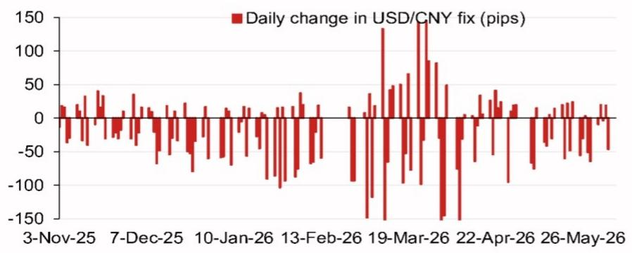
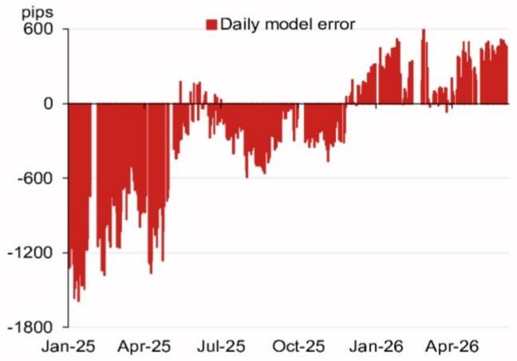

# The USD/CNY Fix Model Is Signaling a Strategic Shift, Not a Tactical Adjustment

The People's Bank of China does not set the daily USD/CNY fix by discretion alone. It uses a systematic reference rate mechanism that incorporates overnight currency moves, a basket of trade-weighted peers, and a discretionary counter-cyclical factor. For serious market participants, understanding the model's output is not an academic exercise; it is a direct window into Beijing's tolerance for depreciation and its broader macroeconomic strategy. A recent projection from a global investment bank's Asia FX strategy team places the model fix at 6.7921, a full 236 pips lower than the previous projection of 6.8157. This is the first signal that deserves attention, but it is far from the full story.

The raw model projection without the counter-cyclical factor suggests the fix should be meaningfully stronger. Yet the adjusted projection, which incorporates the discretionary factor, lands at 6.8109, only 48 pips lower than the prior fix. The gap between these two numbers is the critical analytical space. It tells us that the PBOC is actively leaning against the market's implied appreciation pressure. This is not a neutral stance. It is a deliberate intervention to manage the pace of renminbi strengthening, and it carries profound implications for anyone holding RMB-denominated assets, managing cross-border trade exposure, or positioning for the second half of 2026.

Why now? The timing is not random. China faces a dense calendar of high-stakes events through the remainder of 2026: a Politburo economic work meeting in late July, the APEC leaders' summit in Shenzhen in November, the Central Economic Work Conference in mid-December, and a potential state visit by President Xi to Washington toward year-end. Each of these events places the exchange rate under a different kind of pressure. The fix model, and the discretionary adjustments applied to it, become the primary tool through which Beijing manages external expectations while preserving domestic policy autonomy. The reader who understands this mechanism gains a structural advantage in anticipating not just currency moves, but the broader direction of Chinese economic policy.

This article will argue that the USD/CNY fix model is best understood not as a forecasting tool for the next day's rate, but as a strategic communication device. The model reveals the PBOC's reaction function to external shocks, its willingness to absorb or deflect market pressure, and its implicit guidance for the currency's trajectory over the coming quarters. By dissecting the model's components, its recent error patterns, and the political calendar ahead, we can construct a decision framework that goes far beyond a simple projection number.

## The Model's Components Reveal a Deliberate Slowing of Appreciation Pressure

The raw model projection of 6.7921 is derived from a weighted basket of overnight currency moves. The top four contributors to the projected change are the euro at 67 pips, the Korean won at 34 pips, the Australian dollar at 27 pips, and the Mexican peso at 11 pips. This composition is not arbitrary. It reflects the PBOC's decision to anchor the fix to a broad trade-weighted basket rather than to the dollar alone. The euro's dominant contribution signals that European demand conditions and ECB policy expectations are now the single most important external driver of the fix, surpassing even direct dollar movements.

The implication is strategic. When the PBOC allows the euro's strength to pull the fix lower, it is effectively importing European monetary conditions into its own exchange rate policy. This is a form of policy coordination without formal agreement. It also means that any divergence between the ECB and the Federal Reserve in the second half of 2026 will have outsized effects on the fix. If the ECB holds rates steady while the Fed cuts, the euro strengthens, the basket pulls the fix lower, and the RMB appreciates against the dollar even if the PBOC does nothing actively. The model is not passive; it is a rule-based mechanism that forces the PBOC to respond to external conditions, and the counter-cyclical factor is the only lever to override that response.

The counter-cyclical factor adjustment of only 48 pips is itself a message. In previous periods of intense depreciation pressure, the factor has been used aggressively to slow the pace of weakening. Here, the factor is being used in the opposite direction, to slow the pace of strengthening. But the magnitude is small. This suggests that the PBOC is comfortable with a gradual appreciation trend, but it does not want to accelerate it. The 48-pip adjustment is a speed bump, not a wall. The question for the reader is whether this speed bump will remain in place as the political calendar intensifies, or whether the PBOC will shift to a more active intervention stance.

## Recent Model Errors Indicate the PBOC Is Willing to Absorb Volatility, Not Eliminate It

The model error chart in the report shows a striking pattern. Daily model errors, measured as the difference between the model projection and the actual fix, have ranged from roughly minus 1,800 pips in early 2025 to plus 600 pips by early 2026. The errors were negative in 2025, meaning the actual fix was consistently weaker than the model projected. By early 2026, the errors turned positive, meaning the fix was stronger than the model implied.

This reversal is not noise; it is a policy shift. In 2025, the PBOC was using the counter-cyclical factor and other tools to resist depreciation pressure, allowing the fix to be weaker than the model's raw signal. By 2026, as external conditions shifted and the dollar softened, the PBOC allowed the fix to be stronger than the model, effectively absorbing some of the appreciation pressure that the basket was generating. The magnitude of the positive errors in early 2026, reaching around 600 pips, suggests that the PBOC is now leaning into the trend rather than against it.

The strategic implication is that the PBOC is not trying to eliminate volatility. It is trying to manage the direction of volatility. The model errors show that the central bank is willing to let the fix deviate from the model's mechanical output when it serves a broader policy objective. This means that relying solely on the model's projection to predict the next fix is insufficient. The reader must also assess the PBOC's current policy stance, which can only be inferred from the recent pattern of errors and the broader macroeconomic context.

The open question is whether the positive error pattern will persist. If the PBOC continues to allow the fix to be stronger than the model, the RMB will appreciate faster than the basket alone would dictate. This would be a clear signal that Beijing is prioritizing external confidence and import cost reduction over export competitiveness. If the errors revert to negative territory, the opposite is true. The model error chart is therefore not a historical curiosity; it is the closest thing to a policy reaction function that external analysts can observe.

## The Political Calendar Creates a Sequence of Distinct FX Regime Windows

The calendar of events listed in the report is not a passive schedule. It is a roadmap of inflection points where the PBOC's exchange rate strategy will be tested and potentially recalibrated. The late July Politburo meeting typically produces a readout that includes specific economic priorities. If the readout emphasizes currency stability or export support, the counter-cyclical factor could be increased to slow appreciation. If it emphasizes opening up the financial system or attracting foreign capital, the factor could be reduced to allow faster appreciation.

The APEC summit in Shenzhen in November is a different kind of event. Hosting a major international gathering creates a political incentive for stability. The PBOC is unlikely to allow sharp currency moves during a period when China is presenting itself as a reliable economic partner. This suggests that the model's output in October and November will be subject to more aggressive discretionary smoothing. The fix may deviate further from the model projection during this window, and the error pattern will likely narrow.

The potential state visit by President Xi to Washington toward the end of 2026 is the most consequential event of the year for the exchange rate. A visit of this nature typically involves pre-negotiated agreements on trade, tariffs, and currency commitments. The RMB fix will become a bargaining chip. The PBOC may agree to a certain pace of appreciation or a specific band as part of a broader deal. This means that the model's projection in December is not just a technical output; it is a variable that will be managed to satisfy diplomatic commitments. The reader who is positioning for year-end must consider not just the economic data, but the state of US-China negotiations.

The Central Economic Work Conference in mid-December will then set the tone for 2027. The exchange rate guidance embedded in the conference's output will shape the PBOC's reaction function for the following year. The model will still produce daily projections, but the discretionary adjustments will be calibrated to the policy framework established at this meeting. The sequence of events creates a natural tension: the model's mechanical output will push in one direction, while the political calendar will pull in another. The skill is in identifying which force dominates at each stage.

## What the Report Does Not Fully Answer: The Counter-Cyclical Factor as a Black Box

The report provides the model projection with and without the counter-cyclical factor, but it does not fully specify the factor's composition or the triggers for its adjustment. This is not a limitation of the analysis; it is an inherent feature of the PBOC's communication strategy. The counter-cyclical factor is deliberately opaque. The PBOC has never fully disclosed the formula, and analysts must infer its magnitude from the difference between the model projection and the actual fix.

This opacity creates a meaningful analytical gap. The reader knows that the factor was 48 pips on the date of this projection, but there is no way to know whether that adjustment was driven by a desire to slow appreciation, to manage expectations ahead of a specific event, or to offset a temporary market dislocation. The factor could be a function of recent volatility, of the pace of change in the fix, or of a hidden target band that the PBOC is defending. Without knowing the trigger, it is impossible to predict how the factor will change.

The report's model error chart partially addresses this, but only retrospectively. The reader can see that the errors have been large and variable, but the chart does not decompose the errors into the counter-cyclical factor versus other residual components. There may be multiple layers of adjustment happening simultaneously. The PBOC could be using the factor to lean against the wind while also using direct market intervention to influence the spot rate. The model captures only the fix, not the full set of tools available to the central bank.

For the serious analyst, this means that the model projection is a necessary but insufficient input. It must be supplemented with real-time monitoring of the spot rate, offshore CNH pricing, and the PBOC's daily fix statements. The model tells you what the fix should be under normal conditions. The gap between that and the actual fix tells you what the PBOC is doing. But the reason for that gap remains a judgment call, and different analysts will reach different conclusions. This is where the value of a full report, with its original charts and detailed footnotes, becomes essential.

## A Decision Framework for Positioning Around the Fix Model

Translating the report's analysis into actionable decisions requires a structured framework. The first step is to monitor the model's projection daily and compare it to the actual fix. The difference, measured in pips, is the most important single data point. A widening gap in either direction signals that the PBOC is actively intervening. A narrowing gap signals that the PBOC is allowing the market to determine the fix.

The second step is to contextualize the gap using the recent error history. If the gap is small relative to the recent range, the PBOC is likely in a neutral stance. If the gap is large, the PBOC is signaling a policy shift. The direction of the gap matters. A fix that is weaker than the model implies the PBOC is resisting depreciation. A fix that is stronger than the model implies the PBOC is resisting appreciation. The magnitude of the gap indicates the intensity of the resistance.

The third step is to overlay the political calendar. A large gap in the weeks before a major event, such as the Politburo meeting or APEC, should be interpreted differently from a large gap during a quiet period. Before an event, the PBOC is likely building a buffer or signaling its preferred direction. During a quiet period, the gap is more likely to reflect a structural shift in policy.

The fourth step is to consider the basket composition. If the euro or the won is contributing heavily to the projected change, as it is in this projection, the reader must also assess the outlook for those currencies independently. A shift in ECB policy or a change in Korean export competitiveness will feed through the model into the fix. The model is not a closed system; it is a transmission mechanism for global currency moves.

The final step is to form a view on whether the counter-cyclical factor will be increased or decreased. This is the most subjective part of the framework, but it can be informed by the PBOC's recent behavior. If the central bank has been allowing the fix to deviate from the model in a consistent direction, it is likely to continue until a new policy signal emerges. The reader who waits for that signal will be late. The reader who anticipates it will have a positioning advantage.

## The Full Report Contains the Charts That Make This Analysis Possible

The analysis presented here is built on the model projection, the error chart, and the calendar of events. But each of these elements is far more powerful when viewed in its original chart form. The bar chart of the top four weighted contributions to the projected change shows not just the pips, but the relative magnitude of each currency's influence. The line chart of model errors over time reveals the trend and the volatility in a way that a single data point cannot. The fix change chart shows the actual daily adjustments, which are often zero for extended periods, punctuated by sudden moves.

These charts are the raw material for the kind of strategic analysis that serious investors require. They allow the reader to test their own assumptions, to identify patterns that are not obvious from the text, and to form independent judgments. A summary or a reinterpretation cannot replace the original data.

The community that has access to the full report and its original charts gains a structural edge. They can monitor the model output in real time, compare it to the actual fix, and adjust their positioning as the PBOC's stance evolves. They can see the error patterns before they become consensus. They can anticipate the political calendar and its impact on the fix. The model projection is a starting point. The full report is the map.

Join the community to read the full report and review the original charts.

*This article is for learning and discussion only and does not constitute investment advice.*

Personal reading notes and learning share only. Not investment advice.

