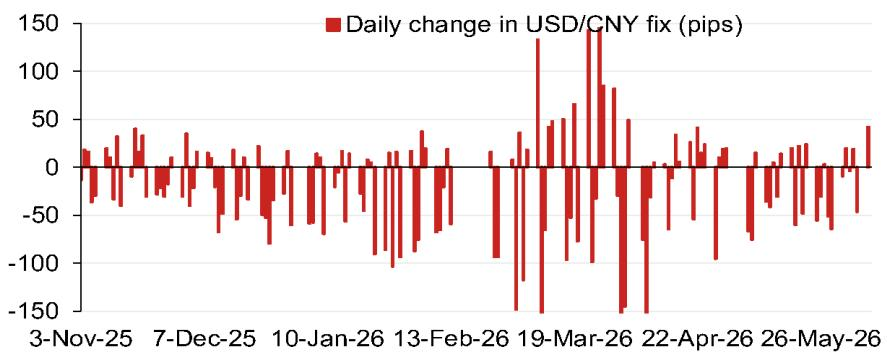
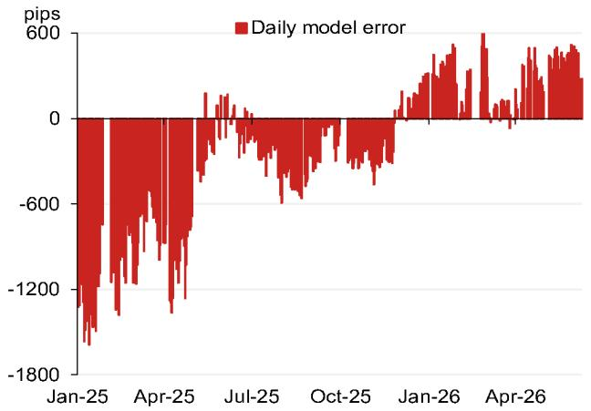

# The USD/CNY Fix Model Is Signaling a Strategic Shift, Not Just a Technical Adjustment

The daily fixing of the USD/CNY exchange rate is the single most important price signal in Asian foreign exchange markets, and a new projection model from a leading Asia FX strategy team suggests that the mechanism governing this fix is entering a new phase. The model's latest projection of 6.7812, a full 386 pips lower than the previous reading, is not merely a routine recalibration. It represents a deliberate and potentially durable shift in how Chinese authorities are managing the renminbi's trajectory against the dollar.

This matters now because the global macroeconomic environment is at an inflection point. With the US dollar facing pressure from a softening domestic economy, and China's own growth narrative hinging on export competitiveness and capital flow management, the renminbi fix has become the central battleground for competing policy objectives. The model's output suggests that the People's Bank of China is preparing to allow greater renminbi flexibility, but with a critical layer of control embedded in the counter-cyclical factor.

The conventional wisdom holds that China uses the daily fix to signal its policy stance, and that the counter-cyclical factor is a tool for smoothing volatility. But the data embedded in this model tells a more nuanced story. The projection without the counter-cyclical factor is 6.7812, while the adjusted projection incorporating that factor is 6.8109. The 89-pip gap between these two numbers is the policy signal. It reveals that the authorities are willing to let market forces push the renminbi stronger, but only within a carefully managed band.

For institutional investors, corporate treasurers, and macro hedge funds, this is not an academic exercise. The daily fix anchors the entire offshore CNH market, influences trade settlement decisions, and sets the tone for emerging market currency dynamics across Asia. Understanding the mechanics of this model, and the strategic logic behind its current output, is essential for positioning in the months ahead.

## The Model's Output Reveals a Deliberate Policy Divergence Between the Fix and the Spot Market

The most striking finding from the model is not the absolute level of the projection, but the relationship between the unadjusted and adjusted figures. The 386-pip decline from the previous projection of 6.8198 is substantial, but it is the 89-pip gap between the model projection and the counter-cyclical-adjusted projection that demands attention. This gap is the policy buffer. It tells us that the market, left to its own devices, would push the renminbi even stronger, but the authorities are actively choosing to hold it back.

This is a deliberate policy divergence. The spot market close, which feeds into the model, is reflecting genuine demand for renminbi, driven by trade surplus dynamics and perhaps some portfolio inflows. But the People's Bank of China is signaling that it does not want the renminbi to appreciate too quickly. The counter-cyclical factor is being used not to resist the trend, but to modulate its speed. This is a classic Chinese policy approach: allow the direction of travel to be market-driven, but retain the ability to control the pace.

The implication is clear. Investors who assume that the fix is a simple reflection of market forces are missing the strategic overlay. The fix is a managed signal, and the gap between the model and the actual fix is the most important variable to watch. A widening gap suggests increasing policy discomfort with the pace of appreciation. A narrowing gap suggests growing confidence in letting the market lead.

## The Composition of the Model's Inputs Highlights the Growing Influence of Asian and Commodity Currency Crosswinds

The model's top four weighted contributions to the projected change provide a fascinating window into the forces driving the fix. The Australian dollar contributes positively, while the Russian ruble, Korean won, and euro all contribute negatively. This is not a random assortment. It tells a story about the competing pressures on the renminbi from different parts of the global economy.

The positive contribution from the Australian dollar reflects China's commodity demand picture and the health of the Australian economy as a proxy for global growth expectations. When the Australian dollar strengthens, it typically signals confidence in the global growth cycle, which benefits the renminbi. The negative contributions from the Korean won and the euro are more complex. The won is a direct competitor to the renminbi in export markets, and its weakness puts pressure on China to maintain its own competitiveness. The euro's negative contribution reflects the broader dollar dynamic: when the euro weakens, the dollar strengthens, and the renminbi fix must adjust accordingly.

What is missing from this list is almost as important as what is present. The Japanese yen and the Thai baht do not appear in the top four. This suggests that the model is currently more sensitive to direct trade competitors and commodity currencies than to broader Asian or developed market dynamics. For investors, this means that monitoring the Korean won and the Australian dollar may be more predictive of renminbi fix movements than watching the yen or the offshore CNH market itself.

## The Historical Pattern of Model Errors Indicates That the Current Projection Should Be Read with Caution

The model's error history reveals a pattern that cannot be ignored. The daily model error, measured in pips, shows significant volatility over the past year. In January 2025, the error was approximately -1800 pips. By April 2025, it had narrowed to -600 pips. It reached zero around July 2025, before widening again to -600 pips in October 2025. Since then, it has swung positive, reaching around +600 pips by January 2026 and remaining at that level through April 2026.

This pattern is telling. The model has historically been more accurate during periods of relative stability and less accurate during periods of rapid change or policy intervention. The current positive error suggests that the model is systematically underestimating the strength of the renminbi fix relative to what the actual fix has been. In other words, the authorities have been fixing the renminbi stronger than the model would predict, given the inputs.

This has two possible interpretations. The first is that the model is missing some factor that is systematically pushing the fix stronger. The second is that the authorities are actively choosing to fix the renminbi stronger than the model's inputs would suggest, perhaps as a signal of confidence or as a tool to manage inflation expectations. Either way, the current projection of 6.7812 should be interpreted with the understanding that the model has a track record of being off by several hundred pips during periods of policy activism.

## The Calendar of Political Events Creates a Sequence of Decision Points That Will Test the Fix Mechanism

The model's output does not exist in a vacuum. The calendar of events for the remainder of 2026 creates a series of decision points that will inevitably influence the fix mechanism. The Politburo meeting in late July 2026 will set the economic agenda for the second half of the year, and any signals about currency policy will be closely watched. The APEC meeting in Shenzhen in November 2026 is a particularly important milestone, as China will be hosting and will want to project stability and openness.

The most significant event on the calendar, however, is the planned visit of President Xi to the United States towards the end of 2026. This visit, confirmed by President Trump in February 2026, creates a powerful incentive for China to manage the renminbi in a way that avoids becoming a point of tension in bilateral relations. A rapidly appreciating renminbi could be seen as a concession, while a rapidly depreciating renminbi could be seen as a competitive devaluation. The likely outcome is a period of managed stability in the lead-up to the visit, with the fix being used as a tool to signal goodwill without making any binding commitments.

For investors, this means that the current model projection may be less relevant for the second half of the year than the political calendar. The fix mechanism is not just an economic tool; it is a diplomatic instrument. The model can tell you where the fix would be if market forces were the only consideration, but the actual fix will be determined by a complex calculus that includes trade negotiations, geopolitical positioning, and domestic political priorities.

## What the Report Does Not Fully Answer: The Transmission Mechanism from Fix to Real Economy Remains Opaque

For all its analytical rigor, the model leaves several critical questions unanswered. The most important of these is the transmission mechanism from the daily fix to the real economy. We know that the fix influences the onshore spot rate, which in turn affects trade settlement, corporate borrowing decisions, and portfolio flows. But the magnitude and timing of these effects are not well understood.

Does a 100-pip change in the fix translate into a measurable change in export volumes? Does it affect the profitability of Chinese manufacturers in a meaningful way? Does it influence the decisions of multinational corporations regarding where to locate production or how to manage their working capital? The model does not address these questions, and the broader research literature is surprisingly thin on empirical evidence.

This gap creates both risk and opportunity for investors. The risk is that the market may over-interpret the fix signal, assuming that it has more real economic impact than it actually does. The opportunity is that investors who can develop a better understanding of the transmission mechanism may be able to identify mispricings in related assets, such as Chinese equities, credit markets, or commodity futures.

## A Decision Framework for Interpreting the Fix Model Output

For readers who want to translate the model's output into actionable decisions, the following framework may be useful. It is not a trading strategy, but a lens through which to interpret the signal.

First, distinguish between the direction and the pace of the fix. The direction tells you where the authorities want the renminbi to go. The pace tells you how quickly they want it to get there. The current model output suggests a direction of gradual appreciation, but a pace that is being deliberately slowed by the counter-cyclical factor.

Second, monitor the gap between the model projection and the counter-cyclical-adjusted projection. A widening gap indicates increasing policy intervention. A narrowing gap indicates growing market alignment. The current 89-pip gap is moderate, but it has been larger in the past. A sudden widening would be a signal that the authorities are uncomfortable with the current pace of change.

Third, cross-reference the model output with the calendar of political events. The fix is likely to be more stable in the weeks leading up to major diplomatic engagements and more volatile in the weeks following them. The APEC meeting in November and the Xi visit to the US are the two most important events on the horizon.

Fourth, do not treat the model projection as a forecast. It is a snapshot of where the fix would be if the model's inputs were the only factors at play. The actual fix will reflect a broader set of considerations, including political priorities that cannot be quantified. Use the model as a baseline, but be prepared for deviations.

Join the community to read the full report and review the original charts.

*This article is for learning and discussion only and does not constitute investment advice.*

Personal reading notes and learning share only. Not investment advice.

