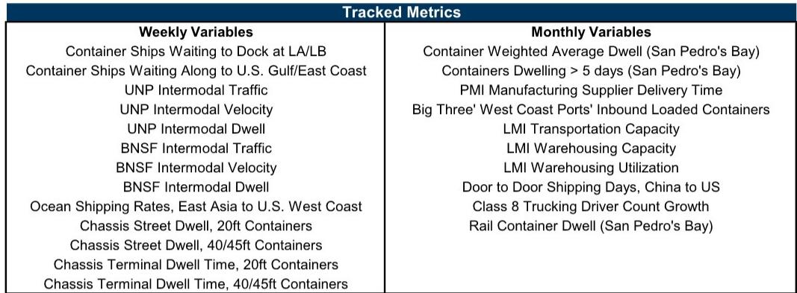
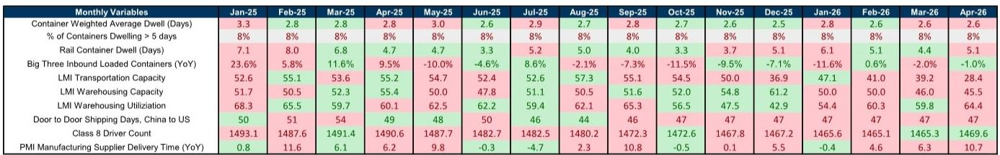
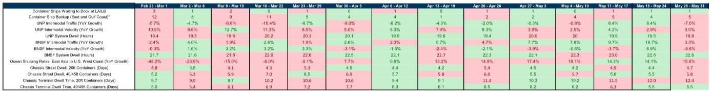

# GS：美国供应链的“新常态”比市场预期的更早到来

市场观察者仍在等待新一轮供应链危机的爆发信号——关税冲击、地缘冲突、港口劳资谈判，每一个变量都被视为潜在的导火索。但GS最新的供应链拥堵追踪报告给出了一个值得认真对待的判断：美国供应链的拥堵水平已经回落至疫情前基线附近，并且这种状态可能比大多数人预期的更具持续性。

这份发布于6月初的报告显示，GS每周供应链拥堵指数在最近一周环比上升了7%，但瓶颈规模评分仍维持在“2”的水平。这个数字意味着什么？在2021年底至2022年初的供应链危机高峰期，该评分曾达到“10”的顶峰。而当前“2”的水平，已经与2020年疫情前的流动性水平基本一致。更重要的是，GS5月的周度平均拥堵评分同样录得“2.0”，这一结果不仅远低于2021年12月至2022年1月的峰值，而且与疫情前基线几乎完全对齐。

这不是一个短期波动，而是一个结构性信号。

## 1. 这轮变化真正考验的是企业能否把规模转化为议价权

GS在报告中明确指出，如果供应链压力继续缓解，该指数有望在2026年更持续地停留在“1”的区间。这绝不是一句轻描淡写的预测。它意味着，过去三年驱动全球物流成本飙升、港口拥堵、运价暴涨的核心变量，正在从“供给不足”转向“需求正常化”。

对于投资者和企业决策者来说，这一判断的含金量在于：它不是一个孤立的港口数据改善，而是整个物流体系的系统性恢复。从GS追踪的指标来看，西海岸集装箱船等待靠泊数量已经连续数周保持在“1”的水平，东海岸虽然从4上升至5，但相比2021年动辄数十艘的积压，已是天壤之别。铁路多式联运方面，西海岸一级铁路（联合太平洋和伯灵顿北方圣达菲）的周度平均运量增速从上周的+14%大幅放缓至-2%，这并非需求崩塌，而是高基数效应和正常化进程的自然体现。

这些数据合在一起意味着：过去两年支撑海运、仓储、卡车运输等环节定价权的“稀缺溢价”正在消失。企业不能再依赖供应链紧张带来的被动议价能力，而必须主动将规模优势转化为真正的成本结构和客户关系壁垒。

## 2. 西海岸的平静掩盖了东海岸正在积累的结构性压力

GS报告中最值得关注的细节之一，是东西海岸的差异。西海岸的集装箱船积压量已经稳定在“1”附近，几乎可以忽略不计。但东海岸的积压量从4上升至5，虽然绝对值不高，却是一个连续上升的趋势。

这个差异背后有两个相互交织的驱动因素。第一，东海岸和墨西哥湾沿岸的港口正在吸收原本通过西海岸进口的货物，这是过去几年供应链多元化战略的直接结果。第二，巴拿马运河的水位限制和劳资谈判的不确定性，正在促使部分货主将订单前置或调整航线。

从GS追踪的月度指标来看，4月“三大港”（洛杉矶、长滩、奥克兰）的进口重箱量同比增速从3月的+11.6%降至+9.5%，而5月的数据已经转为-10%。这种剧烈波动不是需求崩溃，而是前置订单的消化和库存调整的结果。对于投资者而言，这意味着运输类股票的盈利可预测性正在下降，季度间的波动可能成为常态而非例外。

## 3. 铁路多式联运的增速放缓不是衰退信号，而是正常化

GS报告显示，5月西海岸一级铁路的多式联运平均运量同比增长约6%，但周度数据波动剧烈。BNSF的周度运量从+18.7%骤降至+3.3%，UNP则从+8.4%降至-7%。这种大起大落很容易被解读为需求疲软，但GS的数据分析框架提供了另一种解释。

从更长的周期看，2024年铁路多式联运经历了强劲的增长，部分原因是2023年的低基数效应。进入2025年，基数效应消退，加上零售商和制造商已经完成了库存重建，运量增速自然回归到更温和的水平。GS的月度拥堵评分在2023年1月至2025年5月期间几乎稳定在1.8，这本身就说明，当前的状态不是“好转”，而是“稳定”。

对于投资者，这里的关键洞察是：铁路公司的盈利增长动力正在从“量”转向“价”和“效率”。UNP的系统中转停留时间最近一周为19.8小时，BNSF为22.6小时，均处于可控区间。这意味着铁路公司可以通过精细化运营来提升利润率，而不是依赖运量增长。那些能够持续降低中转时间、提高资产周转率的公司，将在下一阶段获得估值溢价。

## 4. 海运运价的同比转正是一个被低估的定价信号

GS报告显示，东亚至美国西海岸的海洋集装箱运价同比增长率已经连续多周为正。5月25日至5月31日当周，同比增速为+15.6%，而此前一周为+14.1%。这看起来是一个温和的上涨，但需要放在更长的背景下理解。

2023年和2024年初，运价同比跌幅曾高达-48%。从深度负值转为持续正值，意味着供需关系已经发生了根本性变化。GS没有在报告中详细展开这一点，但我们可以基于数据逻辑推导：运价的同比转正，既反映了2024年低基数的影响，也暗示着当前的有效运力供给已经不再过剩。船公司通过减速航行、拆船和闲置运力等手段，正在主动管理供给。

这个判断如果成立，意味着海运运价的下行风险已经显著减小。对于依赖海运的进口商和零售商，这不是好消息；但对于班轮公司和物流服务商，这可能是利润率稳定的信号。值得继续跟踪的是，GS报告中的运价数据是基于Freightos的即期运价，而合同运价的变化通常滞后2-3个月。如果即期运价持续正增长，合同运价在2025年下半年可能面临上行压力。

## 5. 报告尚未完全回答的关键问题：关税和地缘冲突的传导机制

GS在报告中坦诚地提出了一个核心问题：“关税和地缘冲突将对货运需求和时间安排产生什么影响？”这是整份报告最大的不确定性来源。

报告中的拥堵指数和瓶颈评分都是基于高频的物理指标——船舶等待数量、铁路运量、底盘停留时间等。这些指标反映的是已经发生的物流活动，而不是未来的订单意愿。关税政策的变化可以通过两个渠道影响供应链：一是前置订单效应（在关税生效前抢运），二是需求抑制效应（关税推高成本后减少进口）。

GS在报告中提到了“关税影响追踪器”，但没有给出具体结论。这意味着，当前供应链的平静状态可能是一种“暴风雨前的宁静”——如果新一轮关税落地，前置订单可能导致短期拥堵反弹；而如果关税持续，结构性需求转移（如从中国转向东南亚）将改变港口和航线的长期格局。

对于读者来说，这个未解问题恰恰是最值得投入时间研究的。当前的“2”评分可能是一种脆弱平衡。GS预测2026年指数可能进入“1”区间，但这个预测的前提是“供应链压力继续缓解”。关税和地缘冲突是最大的下行风险。

## 6. 投资者应该用“正常化框架”而非“危机框架”来重新评估运输资产

基于GS报告的数据和逻辑，市场可能需要调整对运输和物流行业的分析框架。过去三年的供应链危机催生了一套“稀缺定价”逻辑——谁的运力多、谁的港口好、谁的仓库大，谁就能赚取超额利润。这个框架正在失效。

新的框架应该围绕三个维度展开：

第一，成本结构的差异化。在运价和运量都正常化的环境下，能够通过数字化、自动化和网络优化来降低单位成本的企业，才能维持利润水平。GS报告中提到的底盘停留时间、中转时间等运营指标，恰恰是衡量成本效率的先行信号。

第二，客户粘性的深度。当运力不再稀缺，货主的选择权重新变大。那些能够提供端到端解决方案、数据透明度和合同灵活性的物流服务商，将更容易锁定长期合约。

第三，资产负债表的质量。正常化环境意味着资本开支的回报率将下降。过去几年大量投资于港口设施、仓储和船队的公司，如果投资回报率不能覆盖资本成本，将面临资产减值的风险。

GS报告本身没有给出投资建议，但数据指向一个清晰的结论：供应链的“新常态”可能比市场预期的更早到来，而市场对这一变化的定价可能还不够充分。那些还在用2021年的框架思考运输板块的投资者，很可能低估了利润回归均值的力量。

---

这份报告还隐藏了许多值得深入挖掘的细节——例如LMI运输能力指数从4月的55.2骤降至5月的28.4，这背后是卡车运力的快速收缩还是统计口径的变化？又如底盘终端停留时间的持续上升，是否暗示着内陆物流瓶颈正在从港口向仓储转移？这些二阶影响在报告中没有完全展开，但对于理解供应链的下一步演变至关重要。欢迎来星球微信群里继续讨论这些未解问题，以及GS原报告中的完整图表和数据逻辑。

Personal reading notes and learning share only. Not investment advice.

