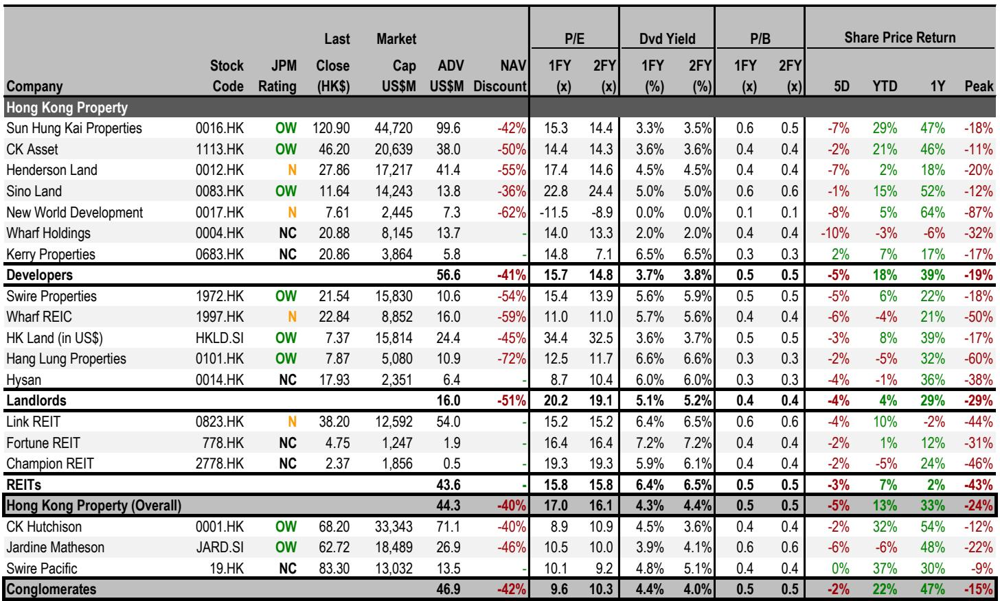
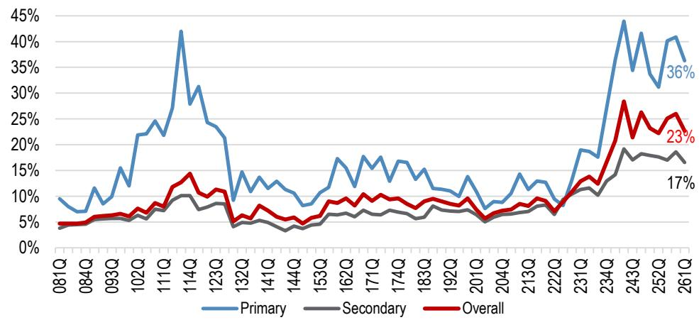

# JPM：香港地产市场真正的考验不是政策阴云，而是数据能否持续验证复苏

过去两周，香港地产股跑输恒生指数7%。一个旧隐忧尚未消散——内地资本外流管控可能收紧；一个新隐忧又浮出水面——美国强劲的就业数据重新点燃了加息预期。两个“悬顶之剑”同时压境，市场情绪迅速转冷。

但JPM在这份最新研报中给出了一个值得细品的判断：这两个隐忧本身，都不足以推翻香港住宅市场的复苏趋势。房价年初至今已上涨9.6%，该机构维持2026财年全年10%-15%的涨幅预测。真正值得关注的，不是这些担忧会不会发生，而是市场需要什么样的证据才能重新建立信心。

这份报告的价值不在于罗列风险，而在于它提供了一个清晰的框架：在不确定性中，哪些变量真正决定方向，哪些公司会在震荡中相对坚挺，以及投资者应该在什么位置重新入场。

## 1. 两个“悬顶之剑”都未落地，但市场已经提前定价

第一个隐忧是内地资本外流管控可能收紧。市场担心这会切断来自内地买家的需求。JPM在5月底和6月初的两份报告中已经详细拆解过这个问题：截至目前，没有官方禁令禁止内地居民在香港购房；资本外流管控并非新政策，历史上已有先例；即使在最极端情景下——所有“基于内地的内地买家”完全退出市场——他们只占成交量的5%-10%，按金额计算也仅为10%-15%。更重要的是，报告中区分了“基于内地的内地买家”和“基于香港的内地买家”，后者受到的影响应该有限。香港楼市的绝大多数买家仍然是本地居民。

第二个隐忧是加息预期重燃。美国劳动力数据超预期后，市场开始重新定价利率路径。JPM目前维持利率暂停至2027年一季度的预测。但如果美国真加息，香港最优惠利率可能跟随上调，按揭利率也会走高。不过报告指出一个关键细节：如果利率维持在现有水平，香港购房者仍然享有边际正carry——名义按揭利率3.25%，扣除现金回赠后的实际按揭利率约2.9%-3.0%，而净租金收益率为3.0%。这个正利差虽然微薄，但方向是积极的。

这两个隐忧的共同特点是：都还没有实质化。但市场已经提前做出了反应。JPM认为，这种担忧可能只会因为持续强劲的数据而消退——比如房价、新盘销售率、二手成交量等关键指标继续保持韧性。

## 2. 内地买家真实影响力被高估，但局部风险确实存在

市场对内地买家退场的担忧，部分源于数据误读。报告提供了两组关键数据来校正认知。

第一组来自税务局：在2024/25财年，非香港身份证持有者的个人买家占成交量5.5%，按金额计占7.2%。这个比例虽然较前几年有明显上升——2020/21财年仅为0.1%——但绝对占比仍然有限。

第二组来自中原地产，以买家姓氏拼音定义“内地买家”，口径更宽。按这个标准，2026年第一季度，“内地买家”在整体市场占比约23%，在初级市场更高达36%。但报告特意指出，这个口径无法区分买家当前居住地或身份，因此长期居住在香港的内地背景人士，甚至姓氏拼音为普通话拼音的本地居民，都被归入此类。

真正值得关注的是区域集中度。报告列出了自2024年3月“撤辣”以来，内地买家最集中的五大区域：启德、黄竹坑、长沙湾/深水埗、将军澳、中西区。启德以3,050宗交易遥遥领先，其中初级市场占2,786宗。这意味着，如果资本管控真的收紧，启德高端住宅项目可能首当其冲。而启德跑道区的未售单位中，中国海外发展占21%，恒基兆业占13%，会德丰和长实集团各占12%-13%。这些开发商的短期销售节奏可能因此承压。

这里的含义很清楚：内地买家退场不是系统性风险，但对特定区域和特定开发商而言，这是一个需要密切跟踪的尾部风险。

## 3. 加息影响被过度渲染，历史经验表明利率上升不等于楼市下跌

市场对加息的恐惧，部分源于对历史经验的误读。JPM在报告中明确指出一个反直觉的事实：2004-2006年和2016-2018年，香港都经历了加息周期，但房价和地产股都同步上涨。

背后的逻辑并不复杂。加息通常发生在经济过热、就业强劲、收入增长的背景下。此时居民的购房能力和意愿往往同步提升，足以抵消融资成本上升的负面影响。真正摧毁楼市的是“衰退式加息”——即经济已经下行，但通胀迫使央行继续收紧。当前美国经济数据强劲，恰恰属于前者。

报告还做了详细的利率敏感性分析。如果香港银行同业拆息每上升100个基点，对地产公司盈利的影响差异巨大：新鸿基地产盈利影响约1.5%，恒基兆业高达11.4%，而信和置业和长实集团分别仅为0.3%和1.0%。这种分化背后的核心变量是浮动利率债务占比。净现金充裕的公司几乎不受影响，而高杠杆公司则面临显著的盈利压力。

但需要指出的是，这份敏感性分析没有考虑利息资本化的会计处理。在实际操作中，开发中的物业利息可以资本化，这会在一定程度上缓冲对当期利润表的冲击。报告没有完全展开这个细节，但它意味着实际影响可能比数字显示的温和。

## 4. 估值已经反映了相当程度的悲观，但下行空间有限

当前香港地产板块的交易价格相对于资产净值折让47%，接近历史均值下方一个标准差的位置。按股息率计算，板块收益率为4.4%，高于历史均值0.5个标准差。这两个指标共同指向一个判断：估值不算便宜，但也没有到泡沫程度。

更重要的是，JPM认为只要房价保持稳定，板块出现大幅估值下修的可能性不大。但需要警惕的是，地产股年初至今已经上涨12%，而恒生指数同期下跌3%。这个相对表现意味着部分乐观预期已经被定价。报告特别指出，即使不考虑新增隐忧，板块下行空间也控制在10%以内。

对于长期投资者，报告在回调时建议关注的标的有四个：新鸿基地产（未来2-3年每股盈利和股息有望实现中个位数增长）、信和置业（5%股息率且派息确定性高）、太古地产（内地零售持续改善，香港写字楼触底，5.6%股息率加5%年化股息增长）、香港置地（内地租户销售有望超预期，6.6%高股息率且确定性高）。

## 5. 报告尚未完全回答的关键问题：数据韧性能否持续

这份报告最有力的部分，是它明确指出了市场重新定价的触发条件——“持续强劲的数据”。但报告没有回答，或者说无法回答的是：这些数据能否持续？

房价年初至今上涨9.6%，但这个涨幅中，有多少是“撤辣”后的短期脉冲，多少是真实需求的持续释放？新盘销售率目前表现不错，但其中有多少来自开发商以低于市价的定价策略来吸引买家？二手成交量是否已经见顶？这些问题的答案，将决定市场是继续修复还是重新陷入调整。

另一个未充分展开的问题是：如果内地资本管控政策确实没有官方澄清，市场需要多久才能通过数据验证来消化不确定性？报告承认“可能不会有任何官方澄清”，这意味着市场可能进入一个“数据依赖”的漫长等待期。在这个期间，任何一次销售数据不及预期，都可能引发新一轮情绪波动。

报告还提到，恒基兆业在启德的高敞口和利率敏感性使其在短期承压，而新鸿基地产因年初至今跑赢恒指30%而面临获利回吐压力。但报告没有深入拆解的是，这些公司的估值折让是否已经充分反映了这些风险。如果市场情绪进一步恶化，这些“相对弱势股”是否反而提供了更好的入场机会？

## 6. 投资者的观察框架：从“会不会发生”转向“何时确认”

综合这份报告的分析，投资者的关注点应该从“两个隐忧会不会发生”转向“需要看到什么证据才能确认复苏趋势不变”。

第一个观察维度是房价。10%-15%的全年涨幅预测能否兑现，取决于未来几个月的月度环比数据。如果房价在年中出现季节性回调，但回调幅度有限，那么趋势仍然健康。

第二个观察维度是息差。实际按揭利率与租金收益率之间的正利差是当前市场的重要支撑。如果美国加息导致香港最优惠利率上调，这个利差可能迅速收窄甚至转负。届时需要重新评估房价的估值锚。

第三个观察维度是区域分化。启德和黃竹坑等内地买家集中区域的销售数据，将成为检验“内地买家退场风险”最直接的指标。如果这些区域的房价和销售率保持稳定，那么资本管控的担忧将自然消退。

第四个观察维度是公司层面的财务韧性。净现金充裕、浮动利率债务占比低的公司，在两个隐忧面前具备更强的防御性。而高杠杆、高利率敏感性的公司，则需要更长时间才能获得市场重新信任。

这些未解问题，恰恰是这份研报最有价值的部分。它没有给出一个简单的“买”或“卖”的结论，而是提供了一个持续观察和验证的框架。对于真正理解香港地产市场的人来说，这才是最稀缺的认知工具。

Personal reading notes and learning share only. Not investment advice.

