## U.S. Healthcare Services

# US Healthcare Services: A summary of our teach in on Medicare Advantage

Lance Wilkes

+1 917 344 8501

lance.wilkes@bernsteinsg.com

We kicked off our Summer Healthcare Teach In Series last Friday, providing an overview of Medicare Advantage, its history, policy and margin impacts, and future outlook (replay here and slides here). This note provides key takeaways from our session.

We will continue our Summer Teach In series with a session on Optum Health (6/18) at 11am ET (Click here to register);

Insurance cycle - We see the recent negative margins in MA as having been the result of a traditional insurance cycle driven by excessive competition. Revenue growth rates in the 15-20% range during 2005-2015 and margins of around 5% attracted a significant amount of additional competition. This competition lead to reduced margins and set the stage for a margin crisis as rates shocks occurred.

We see MA margins inflecting after a trough period. Following a period of margin compression, we expect industry MA margins to expand \~1% in 2026, followed by \~0.5% annual growth through 2030. This recovery is driven by a withdrawal of competition, rate improvement off 2024–25 lows, and an industry focus on pricing for profitability.

MA growth remains durable, but is moderating. Moving forward, we expect MA enrollment to grow at a \~4–5% pace. The value proposition remains compelling with MA offering enhanced supplemental benefits for beneficiaries and structurally lower costs versus FFS for the government. We ultimately see MA capturing virtually all the Medicare market.

The long-term Government MCO market will trend “utility-like.” Over time, we expect both MA and Medicaid to resemble utility-like markets, consolidating around \~4–5 scaled players and operating with relatively modest margins (\~1.5% for Medicaid; \~2–3% for MA).

Key disruptors include GLP-1s, AI, and VBC. GLP-1s will contribute to rising pharmacy costs, but offer the potential of increasing life span, potentially expanding Medicare TAM by 5-10%. AI offers the opportunity to improve the efficiency of hospital operations and patient care. VBC will become increasingly central as margin pressure persists, driven by our view that reimbursement rates will lag medical cost trend by \~100–150 bps long-term.

Affordability and access will dominate the policy debate. Policy focus is increasingly centered on affordability and coverage expansion. Medicare for All appears less viable than in prior cycles, particularly with MA now representing \~55% of Medicare enrollment vs. \~1/3 during earlier reform debates. We expect a Democratic push to restore the uninsured rate to around the 5% level, from what we see could drift towards a potential 9% by 2028.

BERNSTEIN TICKER TABLE

<table><tr><td rowspan="2">Ticker</td><td colspan="4">8 Jun 2026</td><td rowspan="2">TTMRel.</td><td colspan="4">Adjusted EPS</td><td colspan="3">Adjusted P/E (x)</td></tr><tr><td>Rating</td><td>Cur</td><td>Closing Price</td><td>Price Target</td><td>Cur</td><td>2025A</td><td>2026E</td><td>2027E</td><td>2025A</td><td>2026E</td><td>2027E</td></tr><tr><td>AGL (agilon health)</td><td>M</td><td>USD</td><td>95.33</td><td>86.00</td><td>53.1%</td><td>USD</td><td>(24.46)</td><td>(4.81)</td><td>(4.52)</td><td>(3.9)</td><td>(19.8)</td><td>(21.1)</td></tr><tr><td>CNC (Centene)</td><td>O</td><td>USD</td><td>65.03</td><td>68.00</td><td>(5.5)%</td><td>USD</td><td>2.08</td><td>3.38</td><td>4.23</td><td>31.2</td><td>19.2</td><td>15.4</td></tr><tr><td>CI (Cigna)</td><td>O</td><td>USD</td><td>289.61</td><td>371.00</td><td>(30.7)%</td><td>USD</td><td>29.84</td><td>30.38</td><td>33.00</td><td>9.7</td><td>9.5</td><td>8.8</td></tr><tr><td>CVS (CVS)</td><td>O</td><td>USD</td><td>97.08</td><td>106.00</td><td>29.3%</td><td>USD</td><td>6.75</td><td>7.37</td><td>8.14</td><td>14.4</td><td>13.2</td><td>11.9</td></tr><tr><td>ELV (Elevance)</td><td>O</td><td>USD</td><td>418.15</td><td>424.00</td><td>(17.1)%</td><td>USD</td><td>30.30</td><td>26.93</td><td>28.88</td><td>13.8</td><td>15.5</td><td>14.5</td></tr><tr><td>HCA (HCA)</td><td>M</td><td>USD</td><td>361.32</td><td>413.00</td><td>(29.4)%</td><td>USD</td><td>28.21</td><td>30.44</td><td>33.14</td><td>12.8</td><td>11.9</td><td>10.9</td></tr><tr><td>HUM (Humana)</td><td>O</td><td>USD</td><td>355.98</td><td>425.00</td><td>30.9%</td><td>USD</td><td>16.60</td><td>9.12</td><td>15.41</td><td>21.4</td><td>39.0</td><td>23.1</td></tr><tr><td>MOH (Molina)</td><td>O</td><td>USD</td><td>198.41</td><td>208.00</td><td>(56.6)%</td><td>USD</td><td>11.03</td><td>5.35</td><td>9.65</td><td>18.0</td><td>37.1</td><td>20.6</td></tr><tr><td>UNH (UNH)</td><td>O</td><td>USD</td><td>406.57</td><td>492.00</td><td>10.7%</td><td>USD</td><td>16.35</td><td>18.86</td><td>21.99</td><td>24.9</td><td>21.6</td><td>18.5</td></tr><tr><td>SPX</td><td></td><td></td><td>7,405.73</td><td></td><td></td><td></td><td></td><td></td><td></td><td></td><td></td><td></td></tr></table>

O - Outperform, M - Market-Perform, U - Underperform, NR - Not Rated, CS - Coverage Suspended  
Source: Bloomberg, Bernstein estimates and analysis.

## INVESTMENT IMPLICATIONS

We rate AGL Market-Perform with a target price of \$86, CNC Outperform with a target price of \$68, CI Outperform with a target price of \$371, CVS Outperform with a target price of \$106, ELV Outperform with a target price of \$424, HCA Market-Perform with a target price of \$413, HUM Outperform with a target price of \$425, and UNH Outperform with a target price of \$492.

## DETAILS

## WHAT IS MEDICARE ADVANTAGE?

Medicare covers about 20% of the population. Medicaid and safety net programs cover \~30% and employer \~50%. However, the amount of spend on Medicare is larger than its proportion of members due to the increased medical spend by the senior population.

EXHIBIT 1: Where Medicare fits into health insurance coverage

## Major US Insurance Programs – Spends and Enrollments

US Health Insurance - Spends  
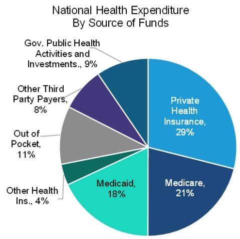

pie chart

National Health Expenditure By Source of Funds
| Source | Percentage (%) |
| :--- | :--- |
| Private Health Insurance | 29 |
| Medicare | 21 |
| Medicaid | 18 |
| Other Health Ins. | 4 |
| Out of Pocket | 11 |
| Other Third Party Payers | 8 |
| Gov. Public Health Activities and Investments | 9 |

US Health Insurance - Enrollment  
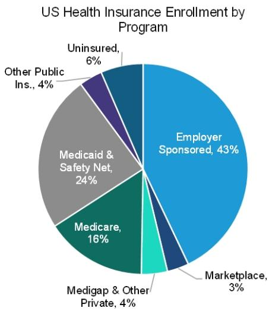

pie chart

US Health Insurance Enrollment by Program
| Program | Enrollment (%) |
| :--- | :--- |
| Employer Sponsored | 43 |
| Marketplace | 3 |
| Medicare | 16 |
| Medicaid & Safety Net | 24 |
| Uninsured | 6 |
| Other Public Ins., | 4 |
| Medigap & Other Private | 4 |

Source: CMS, NHE, and Bernstein analysis

Medicare has \~70m enrollees, with 90% being 65 years old or older and the remainder being disabled. The Medicare population is a growing population, with an age-in growth rate around 5.5% and a mortality rate around 4.5%. Increasing life expectancy, potentially influenced by GLP-1s, is poised to be a tailwind for Medicare member growth. Virtually all the growth in the Medicare population since the 1990s has been in Medicare Advantage, with traditional Medicare staying flat.

## EXHIBIT 2: MA market size

## Medicare is around 70m enrollees with $90\%$ 65 years old and older

• Medicare enrollment – 70 m

• Aged 90%; Disabled 10%  
• MA 51%; FFS 49%  
• Age bands: 65-74, 52%, 75-84 35%, 85+ 12%

• Average mortality rate of 4.5 %

• Age-in growth rate - around 5.5%

• Life expectancy gains

• Historically +1.8yrs/decade  
• Recent US experience +0.6 yr/decade  
- GLP1s could add an additional +1 yr/decade

## Most of the growth in Medicare has been in MA over the past decades

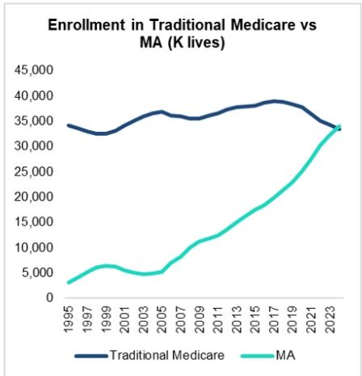

line chart

Enrollment in Traditional Medicare vs MA (K lives)
| Year | Traditional Medicare (K lives) | MA (K lives) |
|---|---|---|
| 1995 | 34000 | 3000 |
| 1997 | 33000 | 6000 |
| 1999 | 32500 | 6500 |
| 2001 | 33500 | 5500 |
| 2003 | 36000 | 5000 |
| 2005 | 37000 | 6000 |
| 2007 | 36500 | 10000 |
| 2009 | 36000 | 12000 |
| 2011 | 37500 | 13500 |
| 2013 | 38500 | 16500 |
| 2015 | 39500 | 19500 |
| 2017 | 40500 | 22500 |
| 2019 | 40000 | 26500 |
| 2021 | 38500 | 31500 |
| 2023 | 34500 | 34500 |

Source: CMS, Bernstein analysis

UNH is the largest player in the MA space. UNH and HUM have been the #1 and #2 players for a decade, with CVS being a consistent #3. There is a long tail of other competitors in the space, with the big 3 players representing \~55% of the market. It is a relatively fragmented market, but our long-term view is the industry becoming utility-like, with 4-6 large, scaled players.

## EXHIBIT 3: Who are the major players in Medicare Advantage

MA Membership of major MCOs  
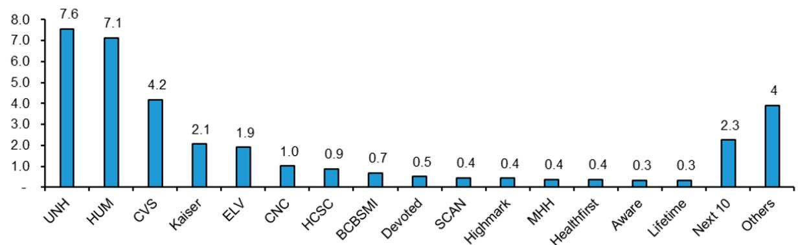

bar chart

| Entity | Value |
| :--- | :--- |
| UNH | 7.6 |
| HUM | 7.1 |
| CVS | 4.2 |
| Kaiser | 2.1 |
| ELV | 1.9 |
| CNC | 1.0 |
| HCSC | 0.9 |
| BCBSMI | 0.7 |
| Devoted | 0.5 |
| SCAN | 0.4 |
| Highmark | 0.4 |
| MHH | 0.4 |
| Healthfirst | 0.4 |
| Aware | 0.3 |
| Lifetime | 0.3 |
| Next 10 | 2.3 |
| Others | 4 |

Next 10 includes: Alignment, Corewell, Medica, Guidwell Mutual, UPMC, MOH, BCBSTN, CuraCor, Clover, Independence Health  
Source: CMS, Company reports, Bernstein analysis

## THE MA PRODUCT, DISTRIBUTION, AND VALUE PROPOSITION

Value proposition of MA. In general, traditional medicare pays for 80% of healthcare costs and the patient pays for 20%. Members have to purchase stand-alone drug coverage and supplemental insurance to pay for the remainder. MA plans cover these extra expenses, usually have out of packet maximums, and provide supplemental benefits like vision, dental, and hearing aids.

EXHIBIT 4: Traditional Medicare vs MA

## Traditional Medicare

## Medical coverage

Part A – hospital coverage

Part B – physician coverage

## Price / structure

- \$0 premium for Part A; monthly premium for Part B  
• 80% Medicare / 20% patient

## Medicare Supplement

\- Seniors can buy Medicare Supplement insurance to cover their cost share and cap financial exposure

## Drugs

Seniors can purchase Part D insurance

## Medicare Advantage

## Medical coverage

Part A – hospital coverage

Part B – physician coverage

## Drugs

Included in the MA plan (MAPD)

## Other benefits

• Vision, dental, hearing  
- OTC items allowance

## Price/Structure

- Members are typically limited to in-network providers  
- The most popular format is \$0 premium plans  
• Co-pays or coinsurance for procedures  
• Annual maximum out of pocket limit of \$8,850 for medical services

Source: Bernstein analysis

Financial elements are generally the highest priority buying criteria for consumers. 65-70% of the MA market has zero premiums, and the remainder generally has a small premium. A second concern for consumers is whether their preferred provider is in network, which can be a reason to avoid MA for some seniors. Supplemental benefits such as cash cards, vision, and chiropractic are also important determinants of consumer satisfaction. Brand and ratings is of lower importance, but Star ratings can be a major determinant impacting the deductible or supplemental benefits a plan provides. In general, consumers are happier with MA than they are with commercial insurance. This could be due to the lower monthly premiums and deductible associated with MA. Consumer satisfaction surveys between MA and FFS Medicare reveal comparable satisfaction ratings, with prior authorizations and network restrictions being the main consumer complaints surrounding MA.

## EXHIBIT 5: MA plan buying criteria

## Buying Criteria

- Premium  
• Out of pocket expenses  
• Is my doctor and drug in network? (network and formulary)  
- Coverage details  
• Supplemental benefits  
- Brand and ratings

## Satisfaction surveys

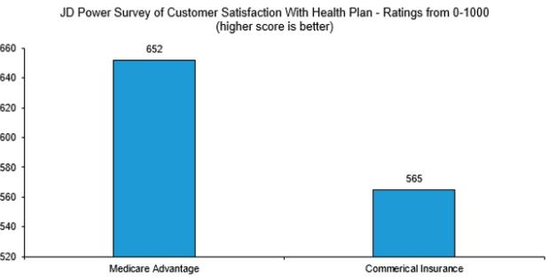

bar chart

JD Power Survey of Customer Satisfaction With Health Plan - Ratings from 0-1000 (higher score is better)
| Category | Value |
| :--- | :--- |
| Medicare Advantage | 652 |
| Commercial Insurance | 565 |

Source: JD Power Survey; Commonwealth Fund survey; Bernstein analysis

MA is sold most frequently through a broker. We estimate \~40% of sales are through E-Brokers and \~30% are through traditional brokers, with a subset of the broker market being the MCOs' internal brokerage, and most of the remaining sales being through MCO call centers. Customer segments are made up of individual (\~60%), group (\~20%), and dual Medicare/Medicaid (\~20%). Members of Group MA have access to retirement benefits through a previous employer. The differentiation between customer segments becomes more important as we think about the winners and losers in the MCO market on a forward basis. For example, price sensitive shoppers could be interested in programs offering cash cards while other customers may be solely focused on maintaining their physician network.

## EXHIBIT 6: MA go-to-market

Distribution channels typically include a broker  
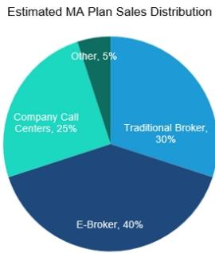

pie chart

Estimated MA Plan Sales Distribution
| Category | Percentage (%) |
|---|---|
| E-Broker | 40 |
| Traditional Broker | 30 |
| Company Call Centers | 25 |
| Other | 5 |

Customer segments  
• Individual, Group, Duals  
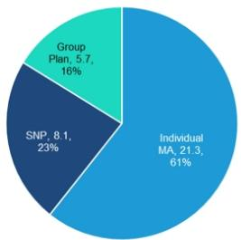

pie chart

| Category | Value | Percentage (%) |
|---|---|---|
| Group Plan | 5 | 16 |
| SNP | 8 | 23 |
| Individual MA | 21 | 61 |

- Customer segments  
• Price sensitive shoppers  
• Network loyalists  
- Benefits maximizers  
- Chronic condition members  
- Brand trusting  
- Convenience  
Source: Bernstein estimates and analysis

The reason patients switch to MA is typically the extra benefits it provides. Extra benefits include Silver Sneakers, hearing aids, and other benefits which appeal to seniors. Every year, members have to reaffirm their choice between MA and FFS Medicare, providing an opportunity for additional members to enter MA. On average, MA members receive \$194 per month in extra benefits, equating to \~15% extra value. The largest proportion of extra benefit is cost sharing, which includes lower copay and plan maximums. The second-largest component is the included Part D coverage, and the third largest is supplemental benefits. Around 2017-2019, MA plans began offering benefits to cover part or all of Part B, and this has become the fastest growing component of extra benefits. The extra benefits that are offered can be another differentiating feature in product design.

## EXHIBIT 7: Extra benefits for seniors in MA

In 2024, MA members received on average \$194 per month in extra benefits  
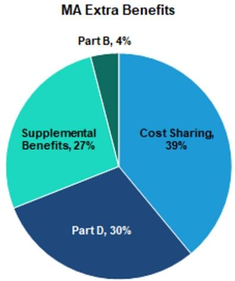

pie chart

MA Extra Benefits
| Category | Percentage (%) |
| :--- | :--- |
| Cost Sharing | 39 |
| Part D | 30 |
| Supplemental Benefits | 27 |
| Part B | 4 |

The supplemental benefits are additional benefits not found in Traditional Medicare  
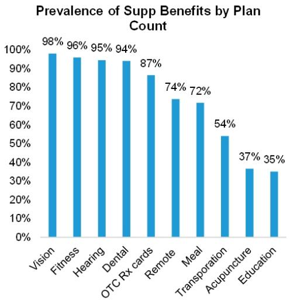

bar chart

Prevalence of Supp Benefits by Plan Count
| Plan | Prevalence (%) |
| :--- | :--- |
| Vision | 98 |
| Fitness | 96 |
| Hearing | 95 |
| Dental | 94 |
| OTC Rx cards | 87 |
| Remote | 74 |
| Meal | 72 |
| Transportation | 54 |
| Acupuncture | 37 |
| Education | 35 |

Source: CMS and Bernstein analysis

## MEDICAL COSTS AND MA RATES

Cost trend has been growing faster than MA rate increases, which was a major reason for MA underperformance in 2023, 2024, and 2025. CMS declares each year what the growth rate has been for medical costs, which has been around 4-5%. Medicare Part A (hospital) costs trended around 2.5-3% pre-COVID and have been higher post-COVID due to wage inflation and increased utilization. Part B (outpatient) has run higher than Part A. When combining inpatient and outpatient expenses, cost trend has averaged around 4-5%, as can be seen in Exhibit 8.

## EXHIBIT 8: MA medical cost trend

MA effective growth rate – this should represent trend  
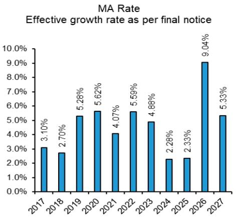

bar chart

MA Rate Effective growth rate as per final notice
| Year | Effective growth rate (%) |
| :--- | :--- |
| 2017 | 3.10 |
| 2018 | 2.70 |
| 2019 | 5.28 |
| 2020 | 5.62 |
| 2021 | 4.07 |
| 2022 | 5.59 |
| 2023 | 4.88 |
| 2024 | 2.28 |
| 2025 | 2.33 |
| 2026 | 9.04 |
| 2027 | 5.33 |

During 24/25 we see effective growth rate as undercounting medical cost trend.  
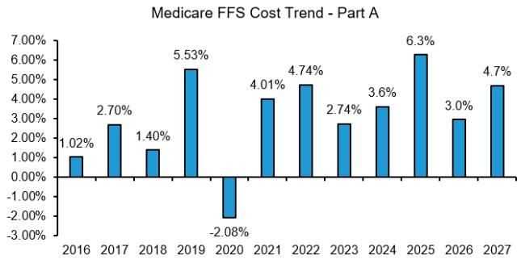

bar chart

Medicare FFS Cost Trend - Part A
| Year | Medicare FFS Cost Trend (%) |
| :--- | :--- |
| 2016 | 1.02 |
| 2017 | 2.70 |
| 2018 | 1.40 |
| 2019 | 5.53 |
| 2020 | -2.08 |
| 2021 | 4.01 |
| 2022 | 4.74 |
| 2023 | 2.74 |
| 2024 | 3.6 |
| 2025 | 6.3 |
| 2026 | 3.0 |
| 2027 | 4.7 |

Medicare FFS Cost Trend - Part B  
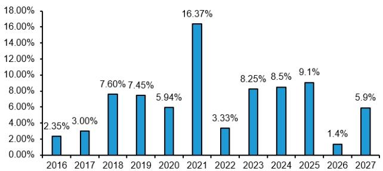

bar chart

| Year | Value (%) |
|---|---|
| 2016 | 2.35 |
| 2017 | 3.00 |
| 2018 | 7.60 |
| 2019 | 7.45 |
| 2020 | 5.94 |
| 2021 | 16.37 |
| 2022 | 3.33 |
| 2023 | 8.25 |
| 2024 | 8.5 |
| 2025 | 9.1 |
| 2026 | 1.4 |
| 2027 | 5.9 |

Source: CMS and Bernstein analysis

MA rates vary year to year, typically driven by phases of underpayment or catch-up on rates. Over the long term, MA rates have tended to range around 2.5%, while trend has averaged around 4.5%, so rates have been around 2 points below trend. Rates have tended to be lower during Democratic administrations and higher during Republican administrations (the rates typically are lagged by 3-4 years to the administration).

## MA Final rates

MA Final Rates, %  
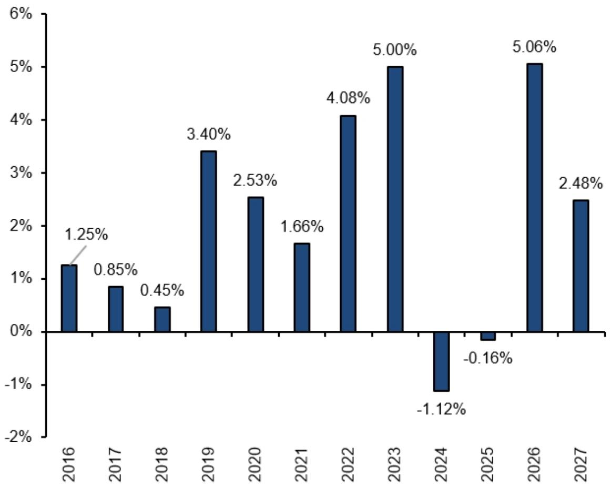

bar chart

| Year | Value (%) |
| :--- | :--- |
| 2016 | 1.25 |
| 2017 | 0.85 |
| 2018 | 0.45 |
| 2019 | 3.40 |
| 2020 | 2.53 |
| 2021 | 1.66 |
| 2022 | 4.08 |
| 2023 | 5.00 |
| 2024 | -1.12 |
| 2025 | -0.16 |
| 2026 | 5.06 |
| 2027 | 2.48 |

Source: CMS, Bernstein analysis

MA rate buildup. CMS typically puts out an advance rate notice around February $1^{st}$ and a final notice around April $1^{st}$ for the next year. The effective growth rate is the medical cost trend, which is on the top row in Exhibit 10. Then, there's a series of adjustments including rebasing, risk model revision (v28), and Star ratings. The MA rate is typically presented without the risk score. The risk score is additive; it's revenue any MCO receives due to having a riskier population. Theoretically, the extra costs an MCO incurs from having a risky patient population should be offset by the risk score.

## 2023 Notice

Year-to-Year Percentage Change in Payment

<table><tr><td>Impact</td><td>2023 Advance Notice</td><td>2023 Rate Announcement</td></tr><tr><td>Effective Growth Rate</td><td>4.75%</td><td>4.88%</td></tr><tr><td>Rebasing/Re-pricing</td><td>N/A[1]</td><td>0.39%</td></tr><tr><td>Change in Star Ratings</td><td>0.54%</td><td>0.54%</td></tr><tr><td>Medicare Advantage Coding Pattern Adjustment</td><td>0%</td><td>0%</td></tr><tr><td>Risk Model Revision</td><td>0%</td><td>0%</td></tr><tr><td>Normalization</td><td>-0.81%</td><td>-0.81%</td></tr><tr><td>MA risk score trend[2]</td><td>3.50%</td><td>3.50%</td></tr><tr><td>Expected Average Change in Revenue</td><td>7.98 %</td><td>8.50%</td></tr></table>

## 2024 Notice

Year-to-Year Percentage Change in Payment

<table><tr><td>Impact</td><td>2024 Advance Notice</td><td>2024 Rate Announcement</td></tr><tr><td>Effective Growth Rate</td><td>2.09%</td><td>2.28%</td></tr><tr><td>Rebasing/Re-pricing</td><td>N/A[1]</td><td>0.00%</td></tr><tr><td>Change in Star  $Ratings^2$ </td><td>-1.24%</td><td>-1.24%</td></tr><tr><td>Medicare Advantage Coding Pattern Adjustment</td><td>0%</td><td>0%</td></tr><tr><td>Risk Model Revision and  $Normalization^3$ </td><td>-3.12%</td><td>-2.16%</td></tr><tr><td>MA risk score trend4</td><td>3.30%</td><td>4.44%</td></tr><tr><td>Expected Average Change in Revenue</td><td>1.03 %</td><td>3.32%</td></tr></table>

Source: CMS, Bernstein analysis

Rate notices and cost trend evaluation are done in the year before plans take effect. In February, the initial rate increases are released, and the final rate is released in April. The rates can vary based on geography. MCOs observe trend throughout the year, and MA plan bids are submitted in early June. When an MCO is developing their plan, they consider the rate increase, cost trend, and desired product features before submitting their bid. Plans are finalized in October and open enrollment begins October 15 $^{th}$ for members to choose their plan. The main factors to monitor during the plan year is whether negative selection bias has been introduced by changes to plans and whether there have been changes in utilization. Q2 results are often a good barometer of whether MCOs will observe impacts from benefit design.

EXHIBIT 11: MA annual bid timeline  
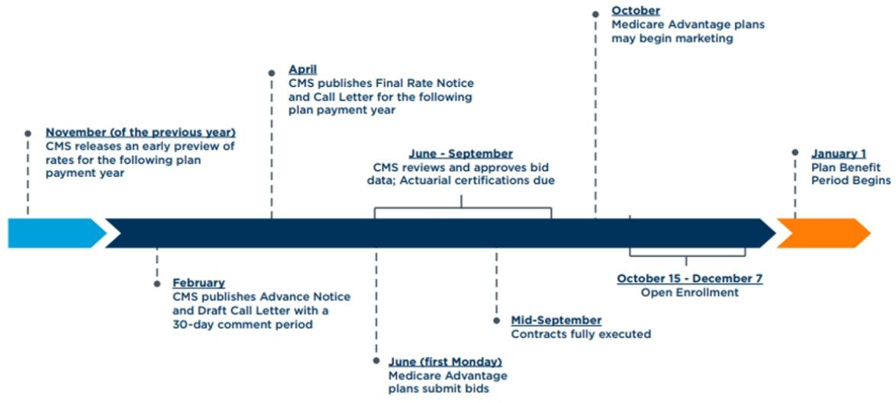

flowchart

```mermaid
graph LR
  A["November (of the previous year)\nCMS releases an early preview of rates for the following plan payment year"] --> B["February\nCMS publishes Advance Notice and Draft Call Letter with a 30-day comment period"]
  B --> C["April\nCMS publishes Final Rate Notice and Call Letter for the following plan payment year"]
  C --> D["June - September\nCMS reviews and approves bid data; Actuarial certifications due"]
  D --> E["June (first Monday)\nMedicare Advantage plans submit bids"]
  E --> F["Mid-September\nContracts fully executed"]
  F --> G["October 15 - December 7\nOpen Enrollment"]
  G --> H["October\nMedicare Advantage plans may begin marketing"]
  H --> I["January 1\nPlan Benefit Period Begins"]
```

Source: CMS, Bernstein analysis

MCO bid construction. The formula for constructing a bid includes estimating medical costs, determining extra benefits and premium levels, and determining operating costs to define a target profit level. It's generally perceived that MA saves about 30% compared to Medicare FFS. In MA, the extra savings are used for supplemental benefits and operating expenses. Coming into 2026, the advance notice rate increase was \~0%. A potential side effect of this margin compression could have been "shrinkflation." This is seen in consumer goods where manufacturers shrink package size. A similar mechanism can occur in the MA industry by decreasing benefits and increasing the deductible. MCOs can also improve margins through things like VBC to improve costs. This mechanism is core to our thesis that VBC's value proposition will increase in the face of prolonged margin compression. Exiting unprofitable markets is another option when faced with margin pressure, which can be a quick way to achieve margin expansion.

EXHIBIT 12: How an MCO constructs a MA bid

+ Estimate required medical costs  
+ Determine expected premium level  
+ Forecast competitor offerings of supplemental benefits  
+ Determine operating costs and targeted profit level

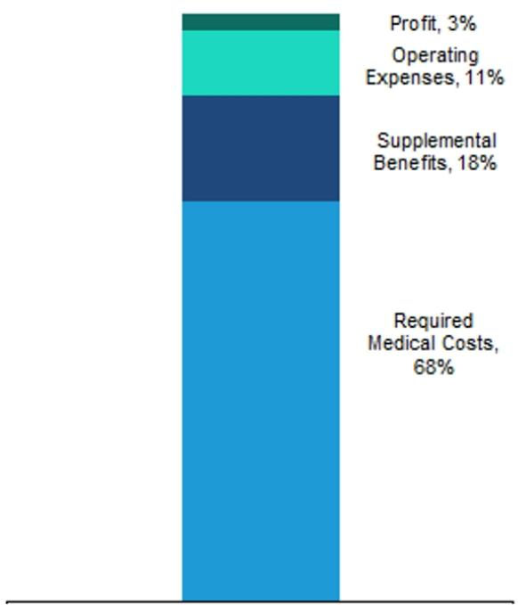

stacked bar chart

| Category | Percentage (%) |
| :--- | :--- |
| Required Medical Costs | 68 |
| Supplemental Benefits | 18 |
| Operating Expenses | 11 |
| Profit | 3 |

Source: Bernstein analysis

There are several levers to improve MA revenue. In traditional businesses like Employer, pricing discipline involves increasing rates, but in MA the government largely sets the rate increases. However, MA plans still have several mechanisms to impact revenue. The first is Star ratings, which provide bonuses for quality, and the second is risk adjustment, which provides increased payments for more complex patients. MCOs receive 5% extra payment for members who are in 4-star plans or above. These typically flow out as extra benefits but can also be a lever to improve margins. Additionally, MA plans can influence the cost of their product by exiting certain markets or products, cutting benefits, increasing deductibles, steering patients to lower cost providers through network management, and reducing operating costs.

## WHAT DROVE THE RECENT CRISIS IN MA PERFORMANCE

We believe the seeds of the current Medicare crisis grew from excessive competition which was attracted by growth. MA membership grew 11+% per year in the years from 2005-2015. This strong growth and 5% margin attracted many competitors to the space.

## EXHIBIT 13: MA membership growth

MA had very strong growth in early years  
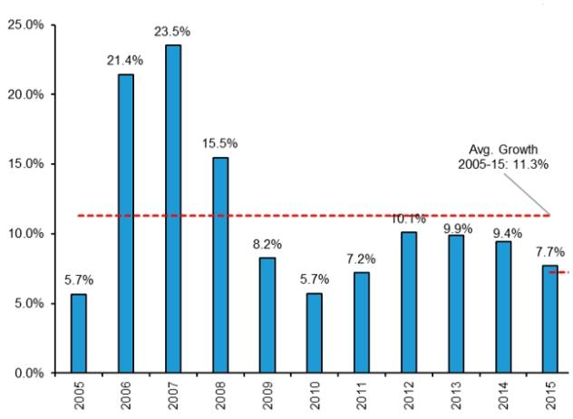

bar chart

| Year | Value (%) |
|---|---|
| 2005 | 5.7 |
| 2006 | 21.4 |
| 2007 | 23.5 |
| 2008 | 15.5 |
| 2009 | 8.2 |
| 2010 | 5.7 |
| 2011 | 7.2 |
| 2012 | 10.1 |
| 2013 | 9.9 |
| 2014 | 9.4 |
| 2015 | 7.7 |
Avg. Growth 2005-15: 11.3%

With initial margins nearly 5%, although impacted by the ACA rate shock in 2013-2015  
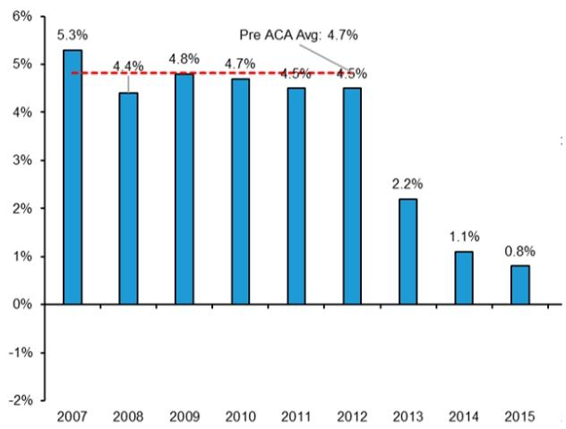

bar chart

| Year | Value (%) |
| :--- | :--- |
| 2007 | 5.3 |
| 2008 | 4.4 |
| 2009 | 4.8 |
| 2010 | 4.7 |
| 2011 | 4.5 |
| 2012 | 4.5 |
| 2013 | 2.2 |
| 2014 | 1.1 |
| 2015 | 0.8 |
Pre ACA Avg: 4.7%

Source: CMS, Medicare Trustees Report, Bernstein analysis

The number of MA plans per senior doubled from 2011 to 2023. We’ve estimated 3 companies were competing for each senior in the late 2000s, increasing to 6 companies per senior in 2018 and 9 per senior in 2023. As competition increased, so did the amount of extra benefits offered. The dollar value of extra benefits more than doubled from the mid 2010s to the mid 2020s, putting stress on MA margins. This caused traditional Medicare players to increase their focus on growth, while non-traditional players such as employer and Medicaid MCOs expanded into MA to gain access to this growth.

## EXHIBIT 14: Medicare operating margin

This growth and margin profile attracted competitors  
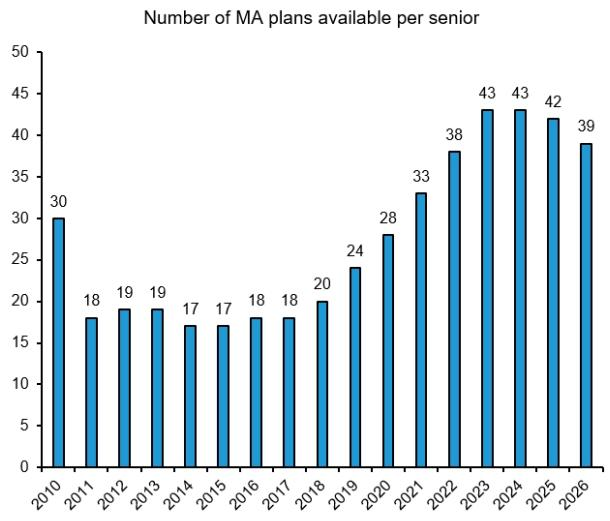

bar chart

Number of MA plans available per senior
| Year | Number of MA plans available per senior |
| :--- | :--- |
| 2010 | 30 |
| 2011 | 18 |
| 2012 | 19 |
| 2013 | 19 |
| 2014 | 17 |
| 2015 | 17 |
| 2016 | 18 |
| 2017 | 18 |
| 2018 | 20 |
| 2019 | 24 |
| 2020 | 28 |
| 2021 | 33 |
| 2022 | 38 |
| 2023 | 43 |
| 2024 | 43 |
| 2025 | 42 |
| 2026 | 39 |

And plans increased extra benefits for seniors to grow share  
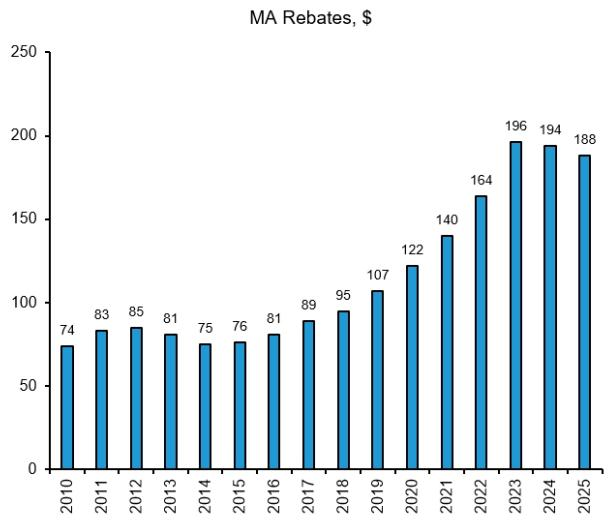

bar chart

MA Rebates, $
| Year | Value ($) |
| :--- | :--- |
| 2010 | 74 |
| 2011 | 83 |
| 2012 | 85 |
| 2013 | 81 |
| 2014 | 75 |
| 2015 | 76 |
| 2016 | 81 |
| 2017 | 89 |
| 2018 | 95 |
| 2019 | 107 |
| 2020 | 122 |
| 2021 | 140 |
| 2022 | 164 |
| 2023 | 196 |
| 2024 | 194 |
| 2025 | 188 |

Source: KFF, Bernstein

MA membership growth slowed as the sector matured. As the sector matured, membership declined from the 11+% growth seen in 2005-2015 to 7% growth in 2015-2025. While still an attractive sector, revenue growth began slowing.

## EXHIBIT 15: MA membership growth

MA membership continued to grow, but at a slower % rate given its larger base  
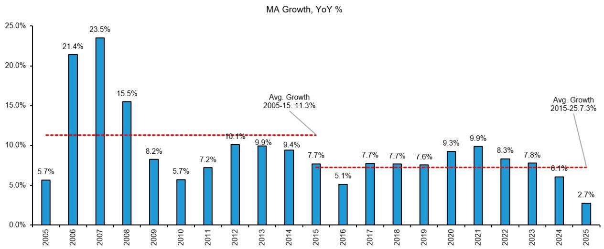

bar chart

MA Growth, YoY %
| Year | Value (%) |
| :--- | :--- |
| 2005 | 5.7 |
| 2006 | 21.4 |
| 2007 | 23.5 |
| 2008 | 15.5 |
| 2009 | 8.2 |
| 2010 | 5.7 |
| 2011 | 7.2 |
| 2012 | 10.1 |
| 2013 | 9.9 |
| 2014 | 9.4 |
| 2015 | 7.7 |
| 2016 | 5.1 |
| 2017 | 7.7 |
| 2018 | 7.7 |
| 2019 | 7.6 |
| 2020 | 9.3 |
| 2021 | 9.9 |
| 2022 | 8.3 |
| 2023 | 7.8 |
| 2024 | 6.1 |
| 2025 | 2.7 |
Avg. Growth
2005-15: 11.3%
Avg. Growth
2015-25:7.3%

Source: CMS, Medicare Trustees Report, Bernstein analysis

The increased competition resulted in margin compression, from close to 5% operating margins in 2007-12 to 3% in 2016-2022. Even before the recent crisis hit in 2023, competition was already having an impact on MCO margins. A rate shock can be observed from 2013-15 in Exhibit 16 below. Every \~12–15 years the industry sees a rate shock where the federal government cuts MA funding. This was seen in 1998 under President Clinton and 2010 under President Obama. Typically, these changes are legislated, so there is time for the market to prepare for the policy. Under Clinton, the impact of the legislation was felt in 2000-2002, and under Obama the impact was felt in 2013-2015. Historically, MCOs have reacted slowly and have experienced margin compression for several years before margins stabilized at a lower level.

## EXHIBIT 16: Medicare operating margin

And margins compressed from around 5% to around 3%  
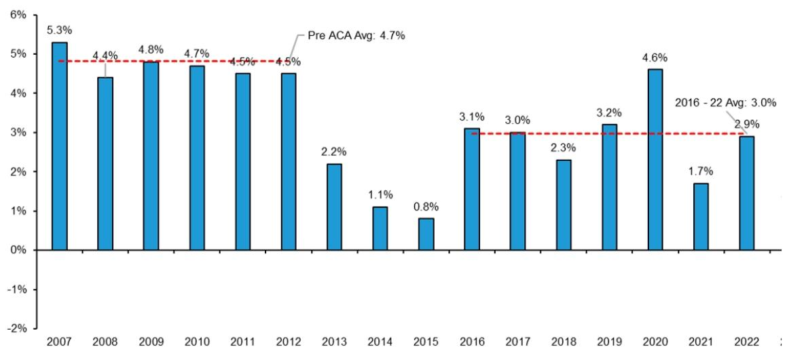

bar chart

| Year | Value (%) |
| :--- | :--- |
| 2007 | 5.3 |
| 2008 | 4.4 |
| 2009 | 4.8 |
| 2010 | 4.7 |
| 2011 | 4.5 |
| 2012 | 4.5 |
| 2013 | 2.2 |
| 2014 | 1.1 |
| 2015 | 0.8 |
| 2016 | 3.1 |
| 2017 | 3.0 |
| 2018 | 2.3 |
| 2019 | 3.2 |
| 2020 | 4.6 |
| 2021 | 1.7 |
| 2022 | 2.9 |
Pre ACA Avg: 4.7%; 2016 - 22 Avg: 3.0%; dashed red line

Source: NAIC, Bernstein analysis

## THE RECENT CRISIS

In 2023, we saw the remnants of a supply shock associated with COVID. Over time, growth in hospital employment

closely mirrors growth in same facility admissions. The $3^{rd}$ and $4^{th}$ quarters of 2020 experienced a supply shock recession, and employment in the healthcare sector was slower to bounce back than other industries. Hospital employment began to rebound in 2022, with hospital employment growth rate increasing 1-1.5 points faster than historical norms leading to a strong increase in hospital volumes. The significant increase in utilization impacted MCO margins in 2023. In recent years, hospital employment has overshot its historical trendline leading to a decline in hiring and a subsequent normalization in utilization, creating a tailwind for MCOs in 2025 and seemingly in 2026.

## EXHIBIT 17: Utilization cycle was the big impact for 2023

Supply shock impacts capacity  
And catch up in capacity growth surprises MCOs in 2023/2024  
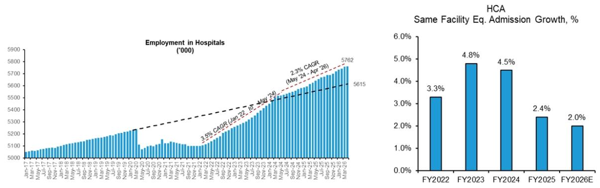  
Source: BLS, HCA, Bernstein analysis and estimates

Every 12 - 15 years we have experienced Medicare spending shocks over the past few decades - with the 1997 BBA under Clinton and the Obama ACA bill being the most recent legislative pushes for this. Generally these rate shocks have lasted 2–3 years before the pain on the seniors through benefit cuts or reduced provider supply leads to normalization of rates. The swiftness of the Biden executive actions was unusual compared to previous policy impacts. These were executive actions, not legislative actions, so they occurred quicker than the previous Congressional bills. The Biden executive actions were enacted in 2022-24 and began having impacts in 2024-25.

EXHIBIT 18: History of Medicare / MA reform  
Major legislation impacting Medicare and Medicare Advantage

<table><tr><td>Year</td><td>Bill</td><td>Impact</td><td>Senate vote</td></tr><tr><td>1965</td><td></td><td>Medicare established</td><td>68-21</td></tr><tr><td>1982</td><td>TEFRA</td><td>Medicare Risk program</td><td>52-47</td></tr><tr><td>1997</td><td>BBA</td><td>Medicare + Choice</td><td>85-15</td></tr><tr><td>2003</td><td>MMA</td><td>Medicare Advantage, Part D</td><td>54-44</td></tr><tr><td>2010</td><td>ACA</td><td>MA Reforms</td><td>60-39</td></tr><tr><td>2022-24</td><td></td><td>Executive actions</td><td></td></tr></table>

Source: Bernstein analysis

The Biden executive actions were driven by a concern around excess coding. There was a perception that excess coding drove 10% overpayments in 2022-23, so v28 was phased in to reduce risk adjustments by \~6% over 3 years. The 2027 rate reduces this excess coding by an additional 1.5%.

Risk adjustment accounted for 10% overpayments in 2022-23 V28 phase-in reduced risk adj. impact to 4% in 2026  
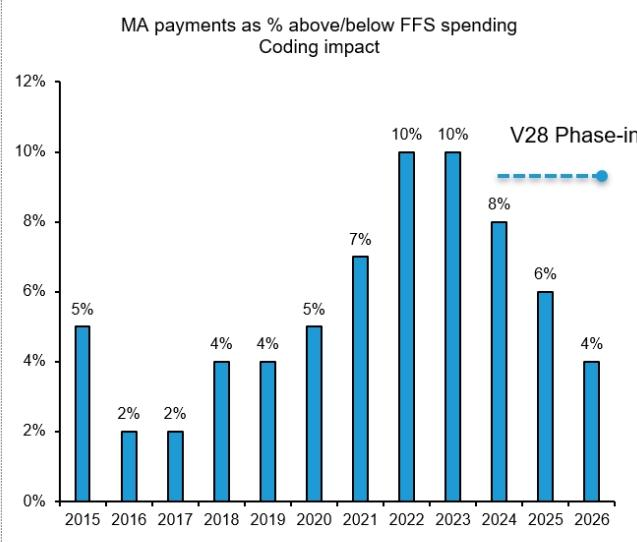

bar chart

MA payments as % above/below FFS spending Coding impact
| Year | MA payments as % above/below FFS spending |
| :--- | :--- |
| 2015 | 5% |
| 2016 | 2% |
| 2017 | 2% |
| 2018 | 4% |
| 2019 | 4% |
| 2020 | 5% |
| 2021 | 7% |
| 2022 | 10% |
| 2023 | 10% |
| 2024 | 8% |
| 2025 | 6% |
| 2026 | 4% |
V28 Phase-in

Source: MedPAC, Bernstein analysis

## How does MA Risk Adjustment works and v28 changes?

- Basic premise is MA plans should be paid more to manage members that have costlier conditions.  
CMS introduced v28 in 2023, to be phased in over a three-year period.  
- Constraining process - CMS also decided not include HCCs in the new model where conditions did not accurately predict costs  
- The net impact of these changes has been a 2-3% annual headwind to premiums (reflected in lower MA rates) since 2023 (CY26 is the last year of transition).

This concern over excess coding led to low MA rates during 2024/2025. The low effective rates were an executive agency effort to cut rates, and were coupled with the risk adjustment formula changes in v28.

EXHIBIT 20: MA rates

MA Final rates  
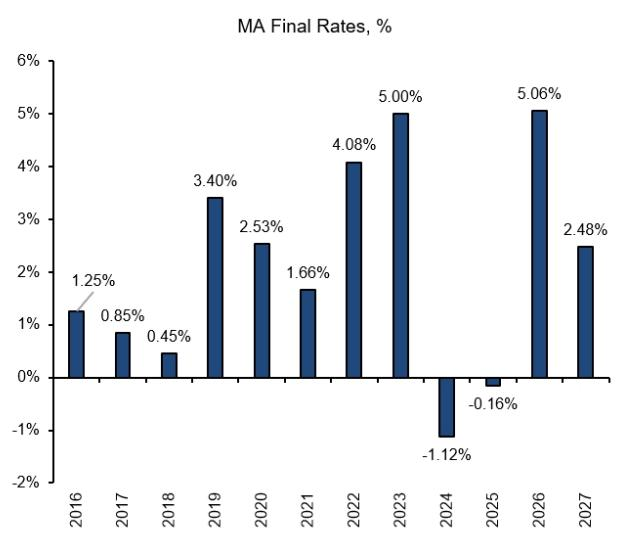

bar chart

MA Final Rates, %
| Year | Final Rate (%) |
| :--- | :--- |
| 2016 | 1.25 |
| 2017 | 0.85 |
| 2018 | 0.45 |
| 2019 | 3.40 |
| 2020 | 2.53 |
| 2021 | 1.66 |
| 2022 | 4.08 |
| 2023 | 5.00 |
| 2024 | -1.12 |
| 2025 | -0.16 |
| 2026 | 5.06 |
| 2027 | 2.48 |

V28 to address overcoding  
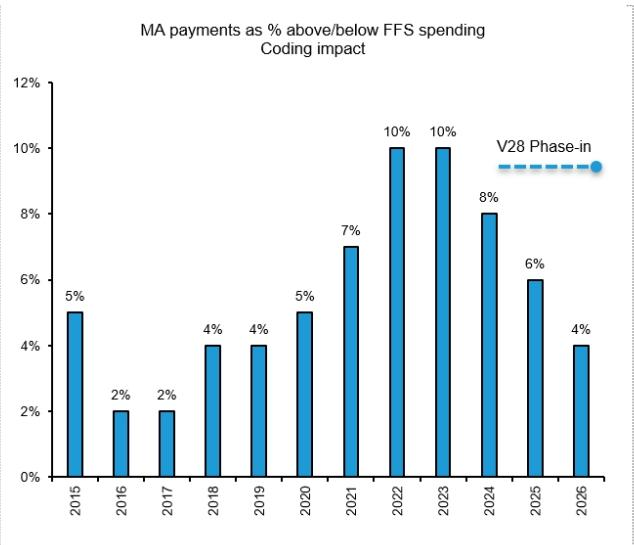

bar chart

| Year | MA payments as % above/below FFS spending |
| ---- | ------------------------------------------ |
| 2015 | 5%                                         |
| 2016 | 2%                                         |
| 2017 | 2%                                         |
| 2018 | 4%                                         |
| 2019 | 4%                                         |
| 2020 | 5%                                         |
| 2021 | 7%                                         |
| 2022 | 10%                                        |
| 2023 | 10%                                        |
| 2024 | 8%                                         |
| 2025 | 6%                                         |
| 2026 | 4%                                         |

Source: CMS, MedPac, Bernstein estimates and analysis

Industry margins have declined 360 bps since 2022. Margins have compressed over the past three years, with a very competitive market confronting a surprise post-COVID utilization spike in 2023, and the low rates of 24/25 and risk adjustment policy changes further reducing margins. We saw a decline of 190 bps in 2023 - this was predominantly due to mis-pricing

resulting from the post-COVID utilization uptake. We note that pricing discipline and withdrawal of competition beginning in 2025 allowed for margin stability in spite of a low rate and v28 implementation. We expect improved industry margins in 2026 and expect 2027 MA margins will increase although at a slower rate than the 26 improvement given commentary on 2027 pricing discipline by MCOs.

EXHIBIT 21: Medicare operating margin  
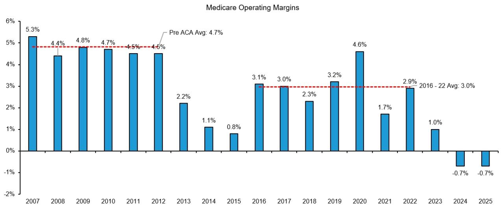

bar chart

Medicare Operating Margins
| Year | Medicare Operating Margin (%) |
| :--- | :--- |
| 2007 | 5.3 |
| 2008 | 4.4 |
| 2009 | 4.8 |
| 2010 | 4.7 |
| 2011 | 4.5 |
| 2012 | 4.5 |
| Pre ACA Avg: 4.7% | |
| 2013 | 2.2 |
| 2014 | 1.1 |
| 2015 | 0.8 |
| 2016 | 3.1 |
| 2017 | 3.0 |
| 2018 | 2.3 |
| 2019 | 3.2 |
| 2020 | 4.6 |
| 2021 | 1.7 |
| 2022 | 2.9 |
| 2023 | 1.0 |
| 2024 | -0.7 |
| 2025 | -0.7 |
2016 - 22 Avg: 3.0%

Source: NAIC, Bernstein analysis

## CURRENT ENVIRONMENT AND OUTLOOK

Subsequently, the industry has seen a withdrawal of competition. HUM and CVS reduced MA membership in 2025 followed by UNH and ELV announcing reductions for 2026. Competitors have also exited including CI, MOH, and several Blue Crosses and not-for-profit organizations.

EXHIBIT 22: Withdrawal of competition in MA  
Big 4 MA membership drops  
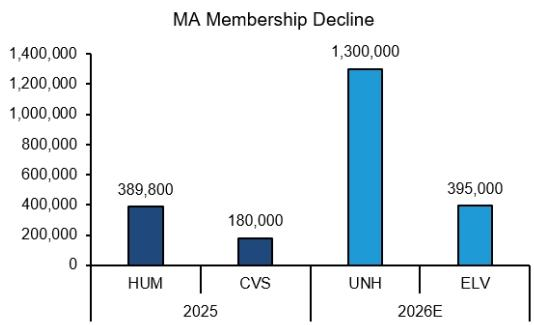

bar chart

| Company | 2025   | 2026E   |
|---------|--------|---------|
| HUM     | 389,800|         |
| CVS     | 180,000|         |
| UNH     |        | 1,300,000 |
| ELV     |        | 395,000 |

Source: Company reports, Bernstein analysis

## MA Exits

• Cigna  
- Molina (exiting MAPD)  
• Premera Blue Cross (exited WA)  
• BCBS of Kansas City  
• BCBS Vermont (exiting in 2026)  
- Ucare (MN/WI)

In addition, the industry has seen a normalization in rates and utilization. 2026 saw a 5.06% rate increase, and the 2.48% rate increase for 2027 aligns with our view of normal long-term rates. The 2.48% rate in 2027 includes a reform of unlinked chart reviews, which lowered the excess risk coding for 2027 by another 1.5%. The 2027 rate identified, but did not adjust, another 2+% of potential adjustments to risk coding by deferring changes to the base year. The key takeaway is it appears there is only 2.5% or less of overcoding remaining in MA (vs 10% in 2023), which reduces rate risk for future years as well.

We are seeing the normalization of utilization patterns in medical volumes back to pre-COVID levels. For MCOs this is favorable relative to recent experience, and they are largely pricing based on the recent past experience in medical cost trends. For hospitals, this is a volume headwind, which many such as HCA, have incorporated into their guidance. We believe a return to more traditional levels of capacity growth (payroll growth) is a major element of this volume normalization.

## EXHIBIT 23: MA rates normalize in 26, 27

MA Final rates  
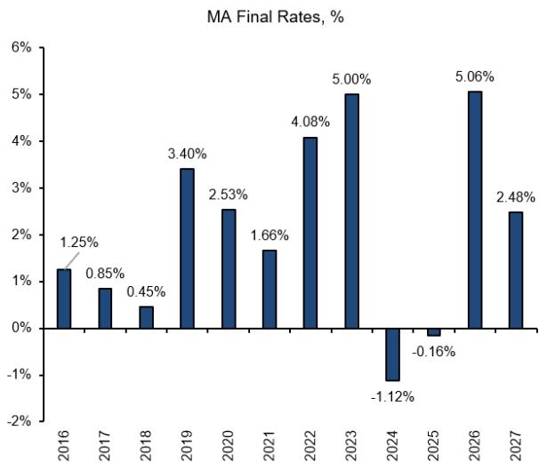

bar chart

MA Final Rates, %
| Year | Final Rate (%) |
| :--- | :--- |
| 2016 | 1.25 |
| 2017 | 0.85 |
| 2018 | 0.45 |
| 2019 | 3.40 |
| 2020 | 2.53 |
| 2021 | 1.66 |
| 2022 | 4.08 |
| 2023 | 5.00 |
| 2024 | -1.12 |
| 2025 | -0.16 |
| 2026 | 5.06 |
| 2027 | 2.48 |

Utilization appears to be normalizing

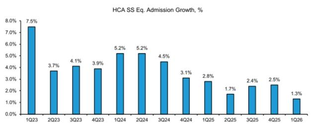

bar chart

HCA SS Eq. Admission Growth, %
| Quarter | HCA SS Eq. Admission Growth (%) |
| :--- | :--- |
| 1Q23 | 7.5 |
| 2Q23 | 3.7 |
| 3Q23 | 4.1 |
| 4Q23 | 3.9 |
| 1Q24 | 5.2 |
| 2Q24 | 5.2 |
| 3Q24 | 4.5 |
| 4Q24 | 3.1 |
| 1Q25 | 2.8 |
| 2Q25 | 1.7 |
| 3Q25 | 2.4 |
| 4Q25 | 2.5 |
| 1Q26 | 1.3 |

Source: CMS, Company report, Bernstein analysis

Benefit cuts are another mechanism to improve margins. Supplemental benefits peaked in 2023 and have come down in 2024, 2025, and 2026. Increasing deductibles on the pharmacy side has contributed to higher out-of-pocket expenses for members. Premiums have increased with the introduction of the Inflation Reduction Act creating additional MCO exposure to pharmacy costs. This trend can be observed in the figure below, which shows HUM's first quarter premiums.

Benefit cuts including deductible and out of pocket increases  
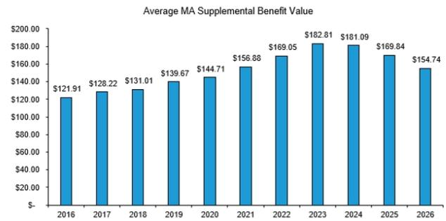

bar chart

Average MA Supplemental Benefit Value
| Year | Average MA Supplemental Benefit Value ($) |
|---|---|
| 2016 | 121.91 |
| 2017 | 128.22 |
| 2018 | 131.01 |
| 2019 | 139.67 |
| 2020 | 144.71 |
| 2021 | 156.88 |
| 2022 | 169.05 |
| 2023 | 182.81 |
| 2024 | 181.09 |
| 2025 | 169.84 |
| 2026 | 154.74 |

Part D Deductible  
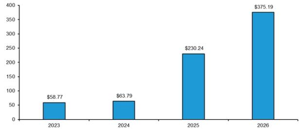

bar chart

| Year | Value ($) |
|---|---|
| 2023 | 58.77 |
| 2024 | 63.79 |
| 2025 | 230.24 |
| 2026 | 375.19 |

And premiums per policy have increased with the IRA and change to pharmacy benefit  
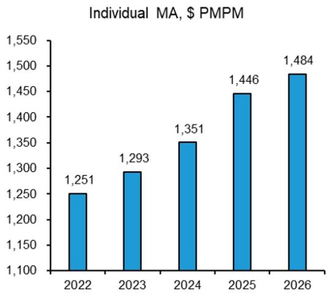

bar chart

Individual MA, $ PMPM
| Year | Value ($ PMPM) |
| :--- | :--- |
| 2022 | 1,251 |
| 2023 | 1,293 |
| 2024 | 1,351 |
| 2025 | 1,446 |
| 2026 | 1,484 |

Source: CMS, MedPac, Milliman, HUM, Bernstein analysis

UNH has cut back on MA membership, and has shown significant normalized margin improvement in 1Q26. CVS saw a similar dynamic, improving 1Q26 MLR 200-300 bps. It's important to understand that MCOs have levers to impact margins during different policy environments. They can lose money in a strong rate environment and make margin improvements even under a low rate environment.

UNH MA Membership  
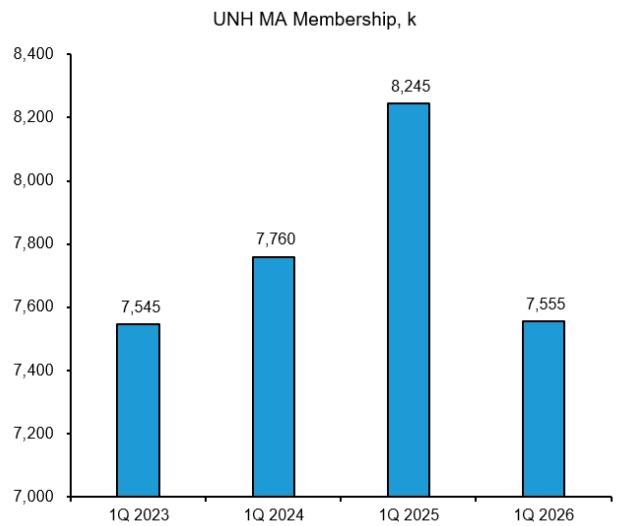

bar chart

UNH MA Membership, k
| Quarter | Membership (k) |
| :--- | :--- |
| 1Q 2023 | 7,545 |
| 1Q 2024 | 7,760 |
| 1Q 2025 | 8,245 |
| 1Q 2026 | 7,555 |

Adjusted UNH MLRs  
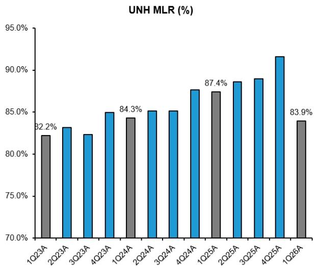

bar chart

UNH MLR (%)
| Quarter | Value (%) |
| :--- | :--- |
| 1Q23A | 82.2 |
| 2Q23A | 83.1 |
| 3Q23A | 82.2 |
| 4Q23A | 84.9 |
| 1Q24A | 84.3 |
| 2Q24A | 85.0 |
| 3Q24A | 85.0 |
| 4Q24A | 87.6 |
| 1Q25A | 87.4 |
| 2Q25A | 88.5 |
| 3Q25A | 88.9 |
| 4Q25A | 91.5 |
| 1Q26A | 83.9 |

(MLR for 2025 represent Bernstein's view on MLR adjusted for reserve timing)  
Source: Company reports, Bernstein analysis

With the volatility of the past few years, strong reserving patterns have been observed. UNH's 1Q26 reserving is among the strongest it's been over the past 8 years. Resultingly, we look at this as a true turnaround in MLR, not just a temporary improvement due to reserving patterns.

## EXHIBIT 26: Reserving

UNH – Medical reserve levels  
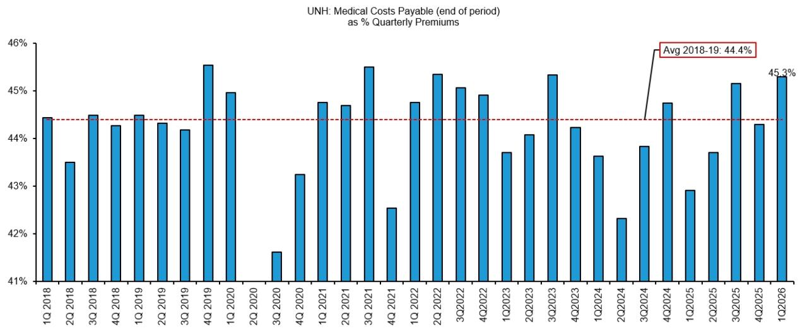

bar chart

UNH: Medical Costs Payable (end of period) as % Quarterly Premiums
| Quarter | Medical Costs Payable (%) |
| :--- | :--- |
| 1Q 2018 | 44.5 |
| 2Q 2018 | 43.5 |
| 3Q 2018 | 44.6 |
| 4Q 2018 | 44.3 |
| 1Q 2019 | 44.6 |
| 2Q 2019 | 44.4 |
| 3Q 2019 | 44.2 |
| 4Q 2019 | 45.6 |
| 1Q 2020 | 45.0 |
| 2Q 2020 | - |
| 3Q 2020 | 41.6 |
| 4Q 2020 | 43.3 |
| 1Q 2021 | 44.8 |
| 2Q 2021 | 44.7 |
| 3Q 2021 | 45.6 |
| 4Q 2021 | 42.6 |
| 1Q 2022 | 44.8 |
| 2Q 2022 | 45.5 |
| 3Q 2022 | 45.1 |
| 4Q 2022 | 44.9 |
| 1Q 2023 | 43.7 |
| 2Q 2023 | 44.1 |
| 3Q 2023 | 45.5 |
| 4Q 2023 | 44.3 |
| 1Q 2024 | 43.6 |
| 2Q 2024 | 42.4 |
| 3Q 2024 | 43.8 |
| 4Q 2024 | 44.8 |
| 1Q 2025 | 43.0 |
| 2Q 2025 | 43.7 |
| 3Q 2025 | 45.2 |
| 4Q 2025 | 44.4 |
| 1Q 2026 | 45.3 |
Avg 2018-19: 44.4%

Source: Company reports, Bernstein analysis

We believe 2025 was a year of margin stabilization. We expect 100 bps of recovery at an industry level in 2026, with more upside possible. At a company level, we expect 50 bps improvement in 2027 and a continuation of that pattern through 2030. We expect increasing consolidation to top players with lower margin players exiting. This dynamic will make the margin recovery look slightly more dramatic than it actually is.

## EXHIBIT 27: Bernstein industry estimates on MA margin recovery

Expect company level MA margin improvements of 100 bps in 26, 50bps in 27 and beyond  
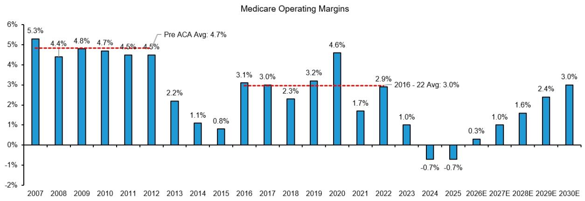

bar chart

Medicare Operating Margins
| Year | Operating Margin (%) |
| :--- | :--- |
| 2007 | 5.3 |
| 2008 | 4.4 |
| 2009 | 4.8 |
| 2010 | 4.7 |
| 2011 | 4.5 |
| 2012 | 4.5 |
| 2013 | 2.2 |
| 2014 | 1.1 |
| 2015 | 0.8 |
| 2016 | 3.1 |
| 2017 | 3.0 |
| 2018 | 2.3 |
| 2019 | 3.2 |
| 2020 | 4.6 |
| 2021 | 1.7 |
| 2022 | 2.9 |
| 2023 | 1.0 |
| 2024 | -0.7 |
| 2025 | -0.7 |
| 2026E | 0.3 |
| 2027E | 1.0 |
| 2028E | 1.6 |
| 2029E | 2.4 |
| 2030E | 3.0 |
Pre ACA Avg: 4.7%

- Top end margins will likely be lower, as reduced competition causes fewer very low margin players  
Source: NAIC, Bernstein analysis and estimates

We expect 4-5% long term MA growth on an industry level, including 4% in 2026 and 2027 and 5% in 2028-2030 as supplementary benefits rebound. This is a result of a larger base of membership, low rates leading to reduced pace of switching from FFS to MA, and slowing baby boomer retirements.

## EXHIBIT 28: Bernstein estimates for industry growth

We expect 4-5% LT growth rate for MA membership  
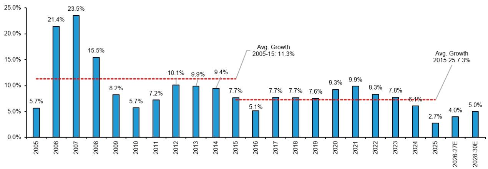

bar chart

| Year | Value (%) |
| :--- | :--- |
| 2005 | 5.7 |
| 2006 | 21.4 |
| 2007 | 23.5 |
| 2008 | 15.5 |
| 2009 | 8.2 |
| 2010 | 5.7 |
| 2011 | 7.2 |
| 2012 | 10.1 |
| 2013 | 9.9 |
| 2014 | 9.4 |
| 2015 | 7.7 |
| 2016 | 5.1 |
| 2017 | 7.7 |
| 2018 | 7.7 |
| 2019 | 7.6 |
| 2020 | 9.3 |
| 2021 | 9.9 |
| 2022 | 8.3 |
| 2023 | 7.8 |
| 2024 | 6.1 |
| 2025 | 2.7 |
| 2026-27E | 4.0 |
| 2028-30E | 5.0 |
Avg. Growth
2005-15: 11.3% 
Avg. Growth
2015-25.7.3%

Source: CMS, Medicare Trustees Report, Bernstein analysis and estimates

## FUTURE ENVIRONMENT AND KEY ISSUES

There remains approximately 2.5% of risk adjustment due to excess coding intensity that we believe will ultimately need to be removed. CMS has suggested this could be closer to \~50 bps based on its February analysis. We expect any adjustment to be phased in over several years, likely through \~100 bps annual reductions to effective growth rates. CMS is also evaluating potential changes to base years and home risk assessments. In addition, there is retrospective exposure from risk adjustment audits and potential settlements. ELV has set aside \~\$1B related to its ongoing suit around excess coding, while our prior estimates suggest UnitedHealth's exposure is in the \~\$2–4B range.

MedPAC has argued that, beyond coding intensity, favorable selection may represent an additional \~10 percentage points of excess margin. We do not agree with this view, a position that has recently been supported by both the WSJ and Paragon. Historically, MA may have benefited from favorable selection via avoidance of higher-acuity beneficiaries, resulting in \~10% selection bias. However, with MA penetration now \~55%, risk adjustment mechanisms that compensate for higher-acuity patients, and enrollment trends skewing toward lower-income populations, we view persistence of meaningful selection bias as unlikely.

Fiscal pressure remains an important backdrop. Medicare spending currently represents \~13% of the federal budget and is projected to rise to \~18% by 2032. With the Medicare trust fund expected to be depleted by 2033, funding gaps will need to be addressed either through increased government contributions or higher beneficiary premiums. As a result, we expect MA rate growth to lag underlying cost trend by \~100–150 bps on a sustained basis.

Over time, we expect CMS to recognize structurally lower costs in MA relative to FFS, which could support policies aimed at increasing MA penetration. The current administration has already begun evaluating mechanisms such as auto-enrollment, though no formal policy has been implemented to date.

EXHIBIT 29: Federal policy areas of focus

<table><tr><td>Risk adjustment</td><td>Fiscal pressures</td></tr><tr><td>Remaining 2.5% (according to MedPAC)Key topics – home risk assessments, changes to base yearsRADV audits and priorovercodingexposureRisk selection –MedPACsees this as issue, we and others are skeptical</td><td>Medicare represents 13% of federal budgetWill grow to 18% by 2032; Medicare trust fund runs out in 2033Likely to see MA rates 1 – 1.5% below medical cost trend over the long term, forcing MA plans to justify their valueOver time this will incent CMS to shift more enrollment to MAThis could lead to auto-enrollment</td></tr></table>

Source: CMS, MedPAC, and Bernstein analysis

We believe MCOs will become “utility-like.” In our view, the industry will consolidate around 4-5 large players, with MA growing to 100% penetration. As part of this, we expect the fragmented portion of the market, representing 40%, to move to the large scaled players. Long term, we expect the industry to have low margins and a higher leverage ratio as companies attempt to maximize ROE. We expect this shift to occur over the next \~20 years.

## EXHIBIT 30: Medicare Advantage plans as utilities

## Government MCOs as utilities

• We expect that government MCOs will become utility-like,  
• We expect MA will grow to 100% penetration including administration for small portion of FFS business  
• We expect Medicaid will outsource remaining spend with is 40+% of current spend  
• We expect low margins (1.5% for Medicaid 2-3% for Medicare)  
• We expect only 4-5 large nationally scaled players in each business

Source: Bernstein analysis

We are proponents that MA will move to a VBC model. Currently, about 1/3 of MA treatment is provided under a value-based care model. An alternative to pure VBC models are VBC-centric models, including Clover Health, that are disaggregating the principles of VBC and retaining them within an MA plan. These models are trying to engage physicians and enable physicians to accomplish the same goals as VBC but not through risk transfer, through bonus payments or paying a fee-for-service payment to perform additional services. The MA plan assists in coordinating the tasks that the physician would have to coordinate under a traditional VBC model. In our view, this makes the durability of MA higher, as it less likely to be purely disintermediated by VBC.

EXHIBIT 31: VBC and MA plan centric enablement models

<table><tr><td>Old FFS MA</td><td>Fully delegated VBC</td><td>Mixed MA controlled VBC / consumerism</td></tr><tr><td>MA plan retains controlFocus on utilization management, prior authorizationsRate increases and risk adjustment more important</td><td>MA plan delegates risk to VBC companyFocused on driving VBC savings from more effective steerage to lower cost settings and proactive care to stabilize chronics</td><td>MA plan retains riskManages medical costs through physician enablement and FFS paymentsCoordinating various players in systemConsumer engagement is potential key enabler</td></tr></table>

Source: Bernstein analysis

The increased utilization of GLP-1s and other drug categories will inflate the cost of coverage, as demonstrated by pharmacy being a faster growing component of cost trend. GLP-1s also have the potential to increase life expectancy which could provide an additional 5-10% boost in Medicare enrollment.

## EXHIBIT 32: GLP1 disruptions

## GLP1 implications

• Over time, GLP1s are likely to be covered by Medicare  
- This will present near term cost volatility, which is diminished the longer demonstration projects last  
• The increased costs of coverage will inflate premiums  
- Life expectancy increases are expected in the range of 0.5 – 2 years within 2 decades,  
- Suggests a $5 - 10\%$ increase in Medicare market enrollment in 1-2 decades

Source: Bernstein analysis

AI will have significant impacts moving forward. Artificial intelligence will lower operating expenses by improving payer operations and efficiency. On the consumer side, AI agents can facilitate and enable improved outcomes for patients.

EXHIBIT 33: AI will be a major impact to healthcare including MA

<table><tr><td>Category</td><td>Description</td><td>Value driver</td><td>Scope ($Bn)</td><td>Opportunity ($Bn)</td><td>Comments</td></tr><tr><td>Care Extension and Automation</td><td>Extending and automating care, adding volume per clinician</td><td>Adds volume per clinician</td><td>$2,700</td><td>$100+</td><td>Largest opportunity; ramping in niches near term, clinical automation will be longest term</td></tr><tr><td>Consumer Agent</td><td>Real time consumer agent which directs care navigation and spending</td><td>Improves cost effectiveness of clinical and drug spend</td><td>$4,500</td><td>$100+</td><td>Largest spend impacted, ramping today, medium term largest impact</td></tr><tr><td>Provider Efficiency</td><td>Automating care administration &amp; operations</td><td>Automating admin, staffing and billing/insurance</td><td>$500</td><td>$80</td><td>Ramping in billing, staffing and admin present med term opportunity</td></tr><tr><td>Payer Automation and Efficiency</td><td>Automating insurance, claims and care management administration</td><td>Automating claims, call, enrollment and care management</td><td>$200</td><td>$40</td><td>AI to improve self-svc and electronic adjudication, med term</td></tr><tr><td>Precision Healthcare and Medicine</td><td>Personalizing care and treatment to reduce trial and error</td><td>Improves clinical effectiveness of spend</td><td>$500</td><td>$40</td><td>AI to enhance existing genomic aided efforts, med term</td></tr></table>

Source: Bernstein analysis

We believe vertical integration will remain an area of increasing policy scrutiny, although we view forced break-ups as a relatively low-probability outcome. A more realistic risk would be legislative efforts to effectively “stack” MLRs or cap margins across affiliated entities, which would reduce the economic rationale for maintaining integrated structures. In that scenario, traditional MCO and VBC businesses would likely be the first areas of focus, potentially leading to selective separation of these segments.

Importantly, we do not view this as inherently negative. In some cases, separation could unlock value or allow businesses to operate with greater focus. For example, we could see a scenario where UNH's VBC platform is able to grow more rapidly as a standalone entity.

Looking ahead, the 2028 election represents a key policy overhang. From a Democratic perspective, we expect the primary focus to center on expanding coverage back toward peak insured levels. The uninsured rate could drift toward \~9% by 2028, and reducing that back toward a more normalized \~5% level is likely to be a central policy priority, particularly against a backdrop of potential employment disruption from AI.

While “Medicare for All” continues to serve as a conceptual framework for broader system reform, political traction in recent cycles has been more closely tied to affordability and access. We expect these themes, rather than wholesale system overhaul, to dominate the policy debate. Although a Medicare for All-oriented candidate is likely to emerge, we believe coverage expansion will ultimately be the defining healthcare issue in the 2028 election cycle.

EXHIBIT 34: Future policy issues

<table><tr><td>Vertical integration</td><td>2028 election issues</td></tr><tr><td>Watching PBM and specialty pharmacy as “canary in the coal mine”Key topic is insurance companies and providers being jointly ownedWe think direct break-up is less likelyWe see MLR stacking as the issue which could cause a functional break-up of entitiesTraditional MCOPBM and cost containment businessesValue based care</td><td>Coverage is returning as an important issue – uninsurance is trending toward 9+%Restoration of peak ACA like coverage – Marketplace enhanced subsidies, broader Medicaid coverage, Medicaid expansion reform, provider taxes/state directed paymentsAI and employment uncertainty we believe will be a rising issueAffordability remains the biggest issuePolicies focused on affordability will be priority – drug pricing, out of pocket limits, hospital pricesMedicare For All – less viable at 55% of Medicare in MA, was closer to 1/3 during Sen Sanders prior primary campaigns</td></tr></table>

Source: Bernstein analysis

## I. REQUIRED DISCLOSURES

References to "Bernstein" or the "Firm" in these disclosures relate to the following entities: Bernstein Institutional Services LLC (April 1, 2024 onwards), Bernstein & Co., LLC (pre April 1, 2024), Bernstein Autonomous LLP, BSG France S.A. (April 1, 2024 onwards), Bernstein (Hong Kong) Limited 盛博香港有限公司, Bernstein (Canada) Limited, Bernstein (India) Private Limited (SEBI registration no. INH000006378), Bernstein (Singapore) Private Limited, Bernstein Japan KK (サンフォード・C・バーンスタイン株式会社) and analysts employed by SG Africa Technologies & Services to produce Bernstein under a Global Services Agreement in place between Bernstein and SG.

Bernstein is part of a joint venture between SG (SG) and AllianceBernstein, L.P. (AB). Unless specifically noted otherwise, for purposes of these disclosures, references to Bernstein's “affiliates” relate to both SG and AB and their respective affiliates.

## VALUATION METHODOLOGY

This research publication covers six or more companies. For valuation methodology and other company disclosures:

Please visit: https://bernstein-autonomous.bluematrix.com/sellside/Disclosures.action.

Or, you can also write to the Director of Compliance, Bernstein Institutional Services LLC, 245 Park Avenue, New York, NY 10167.

## RISKS

This research publication covers six or more companies. For risks and other company disclosures:

Please visit: https://bernstein-autonomous.bluematrix.com/sellside/Disclosures.action.

Or, you can also write to the Director of Compliance, Bernstein Institutional Services LLC, 245 Park Avenue, New York, NY 10167.

## RATINGS DEFINITIONS, BENCHMARKS AND DISTRIBUTION

## EQUITY RATINGS DEFINITIONS

## Bernstein brand

The Bernstein brand rates stocks based on forecasts of relative performance for the next 12 months versus the S&P 500 for stocks listed on the U.S. and Canadian exchanges, versus the Bloomberg Europe Developed Markets Large and Mid Cap Price Return Index EUR (EDME) for stocks listed on the European exchanges and emerging markets exchanges outside of the Asia Pacific region, versus the Bloomberg Japan Large and Mid Cap Price Return Index USD (JPL) for stocks listed on the Japanese exchanges, and versus the Bloomberg Asia ex-Japan Large and Mid Cap Price Return Index (ASIAX) for stocks listed on the Asian (ex-Japan) exchanges -unless otherwise specified.

The Bernstein brand has three categories of ratings:

- Outperform: Stock will outpace the market index by more than 15 pp  
• Market-Perform: Stock will perform in line with the market index to within +/-15 pp  
• Underperform: Stock will trail the performance of the market index by more than 15 pp

Coverage Suspended: Coverage of a company under the Bernstein brand has been suspended. Ratings and price targets are suspended temporarily, are no longer current, and should therefore not be relied upon.

Not Rated: A rating assigned when the stock cannot be accurately valued, or the performance of the company accurately predicted, at the present time. The covering analyst may continue to publish research reports on the company to update investors on events and developments.

Not Covered (NC) denotes companies that are not under coverage.

Bernstein brand stock ratings are based on a 12-month time horizon.

## Autonomous brand – common stocks

The Autonomous brand rates common stocks as indicated below. As our benchmarks we use the Bloomberg Europe 500 Banks And Financial Services Index (BEBANKS) and Bloomberg Europe Dev Mkt Financials Large and Mid Cap Price Ret Index EUR (EDMFI) index for developed European banks and Payments, the Bloomberg Europe 500 Insurance Index (BEINSUR) for European insurers, the S&P 500 and S&P Financials for US banks and Payments coverage, S5LIFE for US Insurance, the S&P Insurance Select Industry (SPSIINS) for US Non-Life Insurers coverage, and the Bloomberg Emerging Markets Financials Large, Mid and Small Cap Price Return Index (EMLSF) for emerging market banks and insurers and Payments. Ratings are stated relative to the sector (not the market).

The Autonomous brand has three categories of common stock ratings:

- Outperform (OP): Stock will outpace the relevant index by more than 10 pp  
- Neutral (N): Stock will perform in line with the market index to within +/-10 pp  
- Underperform (UP): Stock will trail the performance of the relevant index by more than 10 pp

Coverage Suspended: Coverage of a company under the Autonomous research brand has been suspended. Ratings and price targets are suspended temporarily, are no longer current, and should therefore not be relied upon.

Not Rated: A rating assigned when the stock cannot be accurately valued, or the performance of the company accurately predicted, at the present time. The covering analyst may continue to publish research reports on the company to update investors on events and developments.

Those denoted as ‘Feature’ (e.g., Feature Outperform FOP, Feature Under Outperform FUP) are our core ideas.

Not Covered (NC) denotes companies that are not under coverage.

Autonomous brand common stock ratings are based on a 12-month time horizon.

## Autonomous brand – preferred stocks

The Autonomous brand has three categories of preferred stock ratings:

- Outperform (OP): The total return of the preferred instrument is expected to outperform preferred securities of other issuers operating in similar sectors or rating categories over the next six months.  
- Neutral (N): The total return of the preferred instrument is expected to perform in line with preferred securities of other issuers operating in similar sectors or rating categories over the next six months.  
- Underperform (UP): The total return of the preferred instrument is expected to underperform preferred securities of other issuers operating in similar sectors or rating categories over the next six months.

Autonomous preferred stock ratings are based on a 6-month time horizon.

## AUTONOMOUS CREDIT RESEARCH

Where this report contains investment recommendations for credit instruments, as defined in article 3(1)(35) of the Market Abuse Regulation, the information below is presented to comply with its disclosure requirements.

The report may also include reference(s) to published opinions by other Autonomous or Bernstein analysts covering the equity securities of the issuer(s) referenced herein. Please note an investment recommendation for credit instruments published by the author(s) of this report may differ from the published view of the analyst covering equity securities for the issuer(s) contained in this report and vice versa.

## CREDIT RATINGS DEFINITIONS

The Autonomous brand has three categories of credit ratings:

\- Credit Outperform (C-OP): The total return of the Reference Credit Instrument is expected to outperform the credit spread of bonds of other issuers operating in similar sectors or rating categories over the next six months.

- Credit Neutral (C-N): The total return of the Reference Credit Instrument is expected to perform in line with the credit spread of bonds of other issuers operating in similar sectors or rating categories over the next six months.  
- Credit Underperform (C-UP): The total return of the Reference Credit Instrument is expected to underperform the credit spread of bonds of other issuers operating in similar sectors or rating categories over the next six months.

Autonomous credit ratings are based on a 6-month time horizon.

A list of all investment recommendations produced by the author(s) of this report alongside credit ratings history are available upon request.

It is at the sole discretion of the Firm as to when to initiate, update and cease research coverage. The Firm has established, maintains and relies on information barriers to control the flow of information contained in one or more areas (i.e. the private side) within the Firm, and into other areas, units, groups or affiliates (i.e. public side) of the Firm

DISTRIBUTION OF EQUITY RATINGS/INVESTMENT BANKING SERVICES

<table><tr><td>Equity Rating</td><td>Market Abuse Regulation (MAR) and FINRA Rating Category</td><td>Global Rating Distribution</td><td>Investment Banking Relationships*</td></tr><tr><td>Outperform</td><td>BUY</td><td>51.1%</td><td>16.5%</td></tr><tr><td>Market-Perform (Bernstein Brand) Neutral (Autonomous Brand)</td><td>HOLD</td><td>36.3%</td><td>17.8%</td></tr><tr><td>Underperform</td><td>SELL</td><td>12.6%</td><td>14.9%</td></tr></table>

\* These figures represent the percentage of companies within each equity rating category for which affiliates of Bernstein have provided investment banking services within the previous 12 months.  
As of March 31, 2026. All figures are updated quarterly.

Prior to April 1, 2024, Bernstein & Co., LLC. issued the ratings and price target information in the graph(s) below for the following companies: Centene Corp, Cigna Group, CVS Health Corp, Elevance Health, HCA Healthcare Inc, Humana Inc and UnitedHealth Group Inc.

## PRICE CHARTS/ RATINGS AND PRICE TARGET HISTORY

This research publication covers six or more companies. For price chart and other company disclosures, please visit https://bernstein-autonomous.bluematrix.com/sellside/Disclosures.action or you can write to the Director of Compliance, Bernstein Institutional Services LLC, 245 Park Avenue, New York, NY 10167.

## CONFLICTS OF INTEREST

SG and/or its affiliates beneficially own 1% or more of a class of common equity securities of the following company: Centene Corp.

Bernstein Autonomous LLP or BSG France SA, beneficially, has either a net long or short position of 0.5% or more of the total issued share capital of a class of common equity securities of the following MiFID eligible securities: UnitedHealth Group Inc.

An affiliate of Bernstein has received compensation for non-investment banking securities-related products or services in the previous twelve months from the following clients: UnitedHealth Group Inc.

Bernstein and/or affiliates have received compensation for non-investment banking securities-related products or services in the previous twelve months from the following clients: UnitedHealth Group Inc.

Certain affiliates of Bernstein act as market maker or liquidity provider in the equities securities of: agilon health, Centene Corp, Cigna Group, CVS Health Corp, Elevance Health, HCA Healthcare Inc, Humana Inc and UnitedHealth Group Inc.

Certain affiliates of Bernstein act as market maker or liquidity provider in the debt securities of: Cigna Group, CVS Health Corp and Humana Inc.

## OTHER MATTERS

The legal entity(ies) employing the analyst(s) listed in this report, and their location, can be determined by the country code of their phone number, as follows:

+1 Bernstein Institutional Services LLC; New York, New York, USA

+44 Bernstein Autonomous LLP; London UK

+212 SG Africa Technologies & Services; Casablanca, Morocco

+33 BSG France S.A.; Paris, France

+34 BSG France S.A.; Madrid, Spain

+41 Bernstein Autonomous LLP; Geneva, Switzerland

+49 BSG France S.A.; Frankfurt, Germany

+91 Bernstein (India) Private Limited; Mumbai, India

+852 Bernstein (Hong Kong) Limited 盛博香港有限公司; Hong Kong, China

+65 Bernstein (Singapore) Private Limited; Singapore

+81 Bernstein Japan KK; Tokyo, Japan

Where this report has been prepared by research analyst(s) employed by a non-US affiliate, such analyst(s), is/are (unless otherwise expressly noted below) not registered as associated persons of Bernstein Institutional Services LLC or any other SEC-registered broker-dealer and are not licensed or qualified as research analysts with FINRA. Accordingly, such analyst(s) may not be subject to FINRA's restrictions regarding (among other things) communications by research analysts with a subject company, interactions between research analysts and investment banking personnel, participation by research analysts in solicitation and marketing activities relating to investment banking transactions, public appearances by research analysts, and trading securities held by a research analyst account.

Where this report has been prepared by research analyst(s) employed by SG Africa Technologies & Services (part of the SG group of companies), it has been prepared on behalf of a Bernstein company under a Global Services Agreement in place between Bernstein and SG.

## CERTIFICATION

Each research analyst listed in this report, who is primarily responsible for the preparation of the content of this report, certifies that all of the views expressed in this publication accurately reflect that analyst's personal views about any and all of the subject securities or issuers and that no part of that analyst's compensation was, is, or will be, directly or indirectly, related to the specific recommendations or views in this publication.

## II. ADDITIONAL GLOBAL CONFLICT DISCLOSURES

It is at the sole discretion of the Firm as to when to initiate, update and cease research coverage. The Firm has established, maintains and relies on information barriers to control the flow of information contained in one or more areas (i.e., the private side) within the Firm, and into other areas, units, groups or affiliates (i.e., public side) of the Firm.

## III. OTHER IMPORTANT INFORMATION AND DISCLOSURES

Separate branding is maintained for “Bernstein” and “Autonomous” research products.

\- Bernstein produces a number of different types of research products including, among others, fundamental analysis and quantitative analysis under both the “Autonomous” and “Bernstein” brands. Recommendations contained within one type of research product may differ from recommendations contained within other types of research products, whether as a result of differing time horizons, methodologies or otherwise. Furthermore, views or recommendations within a research product issued under one brand may differ from views or recommendations under the same type of research product issued under the other brand. The Research Ratings System for the two brands and other information related to those Rating Systems are included in the previous section.

\- Autonomous operates as a separate business unit within the following entities: Bernstein Institutional Services LLC, Bernstein Autonomous LLP, Bernstein (Hong Kong) Limited 盛博香港有限公司 and Bernstein (India) Private Limited. For information relating to “Autonomous” branded products (including certain Sales materials) please visit: www.autonomous.com. For information relating to Bernstein branded products please visit: www.bernsteinresearch.com.

Analysts are compensated based on aggregate contributions to the research franchise as measured by account penetration, productivity and proactivity of investment ideas. No analysts are compensated based on performance in, or contributions to, generating investment banking revenues.

This report has been produced by an independent analyst as defined in Article 3 (1)(34)(i) of EU 596/2014 Market Abuse Regulation (“MAR”) and the same article of MAR as it forms part of United Kingdom domestic law by virtue of the European Union (Withdrawal) Act 2018.

To our readers in the United States: Bernstein Institutional Services LLC, a broker-dealer registered with the U.S. Securities and Exchange Commission (“SEC”) and a member of the U.S. Financial Industry Regulatory Authority, Inc. (“FINRA”) is distributing this publication in the United States and accepts responsibility for its contents. Where this material contains an analysis of debt product(s), such material is intended only for institutional investors and is not subject to the US independence and disclosure standards applicable to debt research prepared for retail investors.

Bernstein Institutional Services LLC may act as principal for its own account or as agent for another person (including an affiliate) in sales or purchases of any security which is a subject of this report. This report does not purport to meet the objectives or needs of any specific individuals, entities or accounts.

To our readers in Canada: If this publication pertains to a Canadian domiciled company, it is being distributed in Canada by Bernstein (Canada) Limited, which is licensed and regulated by the Canadian Investment Regulatory Organization. If the publication pertains to a non-Canadian domiciled company, it is being distributed by Bernstein Institutional Services LLC, which is licensed and regulated by both the SEC and FINRA, into Canada under the International Dealers Exemption.

This document may not be passed onto any person in Canada unless that person qualifies as "permitted client" as defined in Section 1.1 of NI 31-103.

To our readers in Brazil: This report has been prepared by Bernstein Institutional Services LLC, and Banco BTG Pactual S.A. ("BTG") is responsible for the distribution of this report in Brazil.

To readers in the United Kingdom: This publication has been issued or approved for issue in the United Kingdom by Bernstein Autonomous LLP, authorised and regulated by the Financial Conduct Authority and located at 60 London Wall, London EC2M 5SH, +44 (0)20-7170-5000. Registered in England & Wales No OC343985.

This document is for distribution only to persons who (i) have professional experience in matters relating to investments falling within Article 19(5) of the Financial Services and Markets Act 2000 (Financial Promotion) Order 2005 (as amended, the “Financial Promotion Order”), (ii) are persons falling within Article 49(2)(a) to (d) (“high net worth companies, unincorporated associations, etc.”) of the Financial Promotion Order, (iii) are outside the United Kingdom, or (iv) are persons to whom an invitation or inducement to engage in investment activity (within the meaning of section 21 of the FSMA) in connection with the issue or sale of any securities may otherwise lawfully be communicated or caused to be communicated (all such persons together being referred to as “relevant persons”). This document is directed only at relevant persons and must not be acted on or relied on by persons who are not relevant persons. Any investment or investment activity to which this document relates is available only to relevant persons and will be engaged in only with relevant persons.

To our readers in the member states of the EEA: This publication is being distributed by BSG France SA, which is authorised and regulated by the Autorité de Contrôle Prudentiel et de Résolution (ACPR) and Autorité des Marchés Financiers (AMF).

To our readers in Hong Kong: This publication is being distributed in Hong Kong by Bernstein (Hong Kong) Limited 盛博香港有限公司, which is licensed and regulated by the Hong Kong Securities and Futures Commission (Central Entity No. AXC846) to carry out Type 4 (Advising on Securities) regulated activities and subject to the licensing conditions mentioned in the SFC Public Register (https://www.sfc.hk/publicregWeb/corp/AXC846/details)). This publication is solely for professional investors, as defined in the Securities and Futures Ordinance (Cap. 571). The purpose of this report is solely to provide an analysis of the issuers referred to in this report and is not intended for any purpose contrary to the laws of Hong Kong.

To our readers in Singapore: This publication is being distributed in Singapore by Bernstein (Singapore) Private Limited, only to accredited investors or institutional investors, as defined in the Securities and Futures Act 2001 of Singapore ("SFA"). Recipients in Singapore should contact Bernstein (Singapore) Private Limited in respect of matters arising from, or in connection with, this publication. Bernstein (Singapore) Private Limited is regulated by the Monetary Authority of Singapore and licensed under the SFA as a capital markets services licence holder for dealing in capital markets products that are securities and collective investment schemes and an exempt financial adviser for advising on, issuing and promulgating analyses and reports on securities. Bernstein (Singapore) Private Limited is registered in Singapore with Company Registration No. 20213710W and located at One Raffles Quay, #27-11 South Tower, Singapore 048583, +65-6230-4612.

To our readers in the People's Republic of China: The securities referred to in this document are not being offered or sold and may not be offered or sold, directly or indirectly, in the People's Republic of China (for such purposes, not including the Hong Kong and Macau Special Administrative Regions or Taiwan, the "PRC") in contravention of any applicable laws of the PRC.

This document does not constitute an offer to sell or the solicitation of an offer to buy any securities in the PRC to any person to whom it is unlawful to make the offer or solicitation in the PRC.

We do not represent that this document may be lawfully distributed, or that any securities may be lawfully offered, in compliance with any applicable registration or other requirements in the PRC, or pursuant to an exemption available thereunder, or assume any responsibility for facilitating any such distribution or offering. In particular, no action has been taken by us which would permit a public offering of any securities or distribution of this document in the PRC. Accordingly, the securities are not being offered or sold within the PRC by means of this document or any other document. Neither this document nor any advertisement or other offering material may be distributed or published in the PRC, except under circumstances that will result in compliance with any applicable laws and regulations.

To our readers in Japan: This publication is being distributed in Japan by Bernstein Japan KK (サンフォード・C・バーンスタイン株式会社), which is registered in Japan as a Financial Instruments Business Operator with the Kanto Local Finance Bureau (registration number: The Director-General of Kanto Local Finance Bureau (FIBO) No.3387) and regulated by the Financial Services Agency. It is also a member of Japan Investment Advisers Association. This publication is solely for qualified institutional investors in Japan only, as defined in Article 2, paragraph (3), items (i) of the Financial Instruments and Exchange Act.

For the institutional client readers in Japan who have been granted access to the Bernstein website by Daiwa Group Inc. ("Daiwa"), your access to this document should not be construed as meaning that Bernstein is providing you with investment advice for any purposes. Whilst Bernstein has prepared this document, your relationship is, and will remain with, Daiwa, and Bernstein has neither any contractual relationship with you nor any obligations towards you.

To our readers in Australia: Bernstein (Hong Kong) Limited 盛博香港有限公司 is responsible for distributing research in Australia. It is regulated by the Securities and Exchange Commission under U.S. laws, by the Financial Conduct Authority under U.K. laws, which differs from Australian laws. Bernstein (Hong Kong) Limited 盛博香港有限公司 is exempt from the requirement to hold an Australian financial services license under the Corporations Act 2001 in respect of the provision of the following financial services to wholesale clients:

• providing financial product advice;  
• dealing in a financial product;  
- making a market for a financial product; and  
• providing a custodial or depository service.

To our readers in India: This publication is being distributed in India by Bernstein (India) Private Limited (SCB India) which is licensed and regulated by Securities and Exchange Board of India ("SEBI") as a research analyst entity under the SEBI (Research Analyst) Regulations, 2014, having registration no. INH000006378 and as a stock broker having registration no. INZ000213537. SCB India is currently engaged in the business of providing research and stock broking services. Please refer to www.bernsteinresearch.in for more information.

\- SCB India is a Private limited company incorporated under the Companies Act, 2013, on April 12, 2017 bearing corporate identification number U65999MH2017FTC293762, and registered office at Level 3A, 4th Floor, First International Financial Centre, Plot Nos C-54 and C-55, G Block, Near CBI Office, Bandra Kurla Complex, Bandra (East), Mumbai 400098, Maharashtra, India (Phone No: +91-22-68421401).

- For details of Associates (i.e., affiliates/group companies) of SCB India, kindly email MUM-BERNSTEIN-InCompliance@bernsteinsg.com.  
• SCB India does not have any disciplinary history as on the date of this report.  
- Except as noted above, SCB India and/or its Associates (i.e., affiliates/group companies), the Research Analysts authoring this report, and their relatives

• do not have any financial interest in the subject company  
• do not have actual/beneficial ownership of one percent or more in securities of the subject company;  
- is not engaged in any investment banking activities for Indian companies, as such;  
• have not managed or co-managed a public offering in the past twelve months for any Indian companies;

\- have not received any compensation for investment banking services or merchant banking services from the subject company in the past 12 months;

• have not received compensation for brokerage services from the subject company in the past twelve months;

\- have not received any compensation or other benefits from the subject company or third party related to the specific recommendations or views in this report; and

\- do not currently, but may in the future, act as a market maker in the financial instruments of the companies covered in the report.

\- do not have any conflict of interest in the subject company as of the date of this report.

- Except as noted above, the subject company has not been a client of SCB India during twelve months preceding the date of distribution of this research report. Neither SCB India nor its Associates (i.e., affiliates/group companies) have received compensation for products or services other than investment banking, merchant banking or brokerage services from the subject company in the past twelve months.  
- The principal research analyst(s) who prepared this report, members of the analysts' team, and members of their households are not an officer, director, employee or advisory board member of the companies covered in the report.  
- Our Compliance officer / Grievance officer is Ms. Rupal Talati, who can be reached at +91-22-68421451, or MUM-BERNSTEIN-InCompliance@bernsteinsg.com / Scbin-investorgrievance@bernsteinsg.com  
- The Research investor charter and Terms & Conditions of SCB India are available on its website and may be accessed at Bernstein (India) Private Limited (https://bernsteinresearch.in/) for your reference.  
- Disclaimer: Registration granted by SEBI, and certification from NISM, is in no way a guarantee of performance of the intermediary or provide any assurance of returns to investors. Investments in securities market are subject to market risks. Read all the related documents carefully before investing.

To our readers in Switzerland: This document is provided in Switzerland by or through Bernstein Autonomous LLP, and is provided only to qualified investors as defined in article 10 of the Swiss Collective Investment Scheme Act (“CISA”) and related provisions of the Collective Investment Scheme Ordinance and in strict compliance with applicable Swiss law and regulations. The products mentioned in this document may not be suitable for all types of investors. This document is based on the Directives on the Independence of Financial Research issued by the Swiss Bankers Association (SBA) in January 2008.

To our readers in the Middle East: Bernstein Autonomous LLP, DIFC branch has its principal office at Gate Village 06, DIFC, Dubai, UAE. Bernstein Autonomous LLP, DIFC branch is regulated by the Dubai Financial Services Authority (DFSA) with the registration number CL10040 and is provisioned for Arranging Deals in Investments and Advising on Financial Products. All communications and services are directed at Professional Clients and Market Counterparties only (as defined in the DFSA rulebook). Persons other than Professional Clients and Market Counterparties, such as Retail Clients, are not the intended recipients of our communications or services.

## LEGAL

All research publications are disseminated to our clients through posting on the firm's password protected websites, bernsteinresearch.com and autonomous.com. Certain, but not all, research publications are also made available to clients through third-party vendors or redistributed to clients through alternate electronic means as a convenience.

This publication has been published and distributed in accordance with the Firm's policy for management of conflicts of interest in investment research, a copy of which is available from Bernstein Institutional Services LLC, Director of Compliance, 245 Park Avenue, New York, NY 10167. Additional disclosures and information regarding Bernstein's business are available on our website www.bernsteinresearch.com.

The securities described herein may not be eligible for sale in all jurisdictions or to certain categories of investors where that permission profile is not consistent with the licenses held by the entities noted herein. This document is for distribution only as may be permitted by law. This publication is not directed to, or intended for distribution to or use by, any person or entity who is a citizen or resident of, or located in any locality, state, country or other jurisdiction where such distribution, publication, availability or use would be contrary to law or regulation or which would subject any of the entities referenced herein or any of their subsidiaries or affiliates to any registration or licensing requirement within such jurisdiction. This publication is based upon public sources we believe to be reliable, but no representation is made by us that the publication is accurate or complete. We do not undertake to advise you of any change in the reported information or in the opinions herein. This publication was prepared and issued by entity referred to herein for distribution to eligible counterparties or professional clients. This publication is not an offer to buy or sell any security, and it does not constitute investment, legal or tax advice. The investments referred to herein may not be suitable for you. Investors must make their own investment decisions in consultation with their professional advisors in light of their specific circumstances. The value of investments may fluctuate, and investments that are denominated in foreign currencies may fluctuate in value as a result of exposure to exchange rate movements. Information about past performance of an investment is not necessarily a guide to, indicator of, or assurance of, future performance.

This report is directed to and intended only for our clients who are “eligible counterparties”, “professional clients”, “institutional investors” and/or “professional investors” as defined by the aforementioned regulators, and must not be redistributed to retail clients as defined by the aforementioned regulators. Retail clients who receive this report should note that the services of the entities noted herein are not available to them and should not rely on the material herein to make an investment decision. The result of such act will not hold the entities noted herein liable for any loss thus incurred as the entities noted herein are not registered/authorised/licensed to deal with retail clients and will not enter into any contractual agreement/arrangement with retail clients. This report is provided subject to the terms and conditions of any agreement that the clients may have entered into with the entities noted herein. All research reports are disseminated on a simultaneous basis to eligible clients through electronic publication to our client portal.

The information in this report was prepared by Bernstein solely for the internal business use of our clients. Clients may store, display, analyze, reformat and print the information in this report for this limited use only. Clients may not copy, alter, create derivative works, resell, reverse engineer, commercially exploit, share or distribute any part of the information contained herein for any purpose without Bernstein's express written consent. These restrictions include extracting data or using the content to develop indices or other products. Further, you may not use this report, or any portion of this report, to train or finetune any third-party machine learning or artificial intelligence system, or as a prompt or input into any such system. You also may not, without Bernstein's express written consent, do any of the foregoing in connection with your own internal machine learning or artificial intelligence system.

Bernstein may use artificial intelligence tools in the preparation of its materials. Any such materials are reviewed by Bernstein's research analysts prior to publication.

This report has been prepared for information purposes only and is based on current public information that we consider reliable, but the entities noted herein do not warrant or represent (express or implied) as to the sources of information or data contained herein are accurate, complete, not misleading or as to its fitness for the purpose intended even though the entities noted herein rely on reputable or trustworthy data providers, it should not be relied upon as such. Opinions expressed are the author(s)' current opinions as of the date appearing on the material only and we do not undertake to advise you of any change in the reported information or in the opinions herein.

Any references to SG herein are purely factual, based upon publicly available information, and included for comparative purposes only. They do not constitute an opinion or recommendation with respect to the securities of SG.

This publication was prepared and issued by the entity referred to herein for distribution to eligible counterparties or professional clients. The information in this report is intended for general circulation and does not constitute an offer to buy or sell any security, investment, legal or tax advice nor a personal recommendation, as defined by any of the aforementioned regulators. It does not take into account the particular investment objectives, financial situations, or needs of individual investors. The report has not been reviewed by any of the aforementioned regulators and does not represent any official recommendation from the aforementioned regulators. The investments referred to herein may not be suitable for you. Investors must make their own investment decisions in consultation with advice sought from a financial adviser regarding the suitability of the investment product, taking into account the specific investment objectives, financial situation or particular needs of any recipient of the recommendation, before the recipient makes a commitment to purchase the investment product.

The analysis contained herein is based on numerous assumptions. Different assumptions could result in materially different results. The information in this report does not constitute, or form part of, any offer to sell or issue, or any offer to purchase or subscribe for shares, or to induce engage in any other investment activity. The value of any securities or financial instruments mentioned in this report may fluctuate subject to market conditions. Information about past performance of an investment is not necessarily a guide to, indicative of, or assurance of future performance. Estimates of future performance mentioned by the research analyst in this report are based on assumptions that may not be realized due to unforeseen factors like market volatility/fluctuation. In relation to securities or financial instruments denominated in a foreign currency other than the clients' home currency, movements in exchange rates will have an effect on the value, either favorable or unfavorable. Before acting on any recommendations in this report, recipients should consider the appropriateness of investing in the subject securities or financial instruments mentioned in this report and, if necessary, seek for independent professional advice.

The securities described herein may not be eligible for sale in all jurisdictions or to certain categories of investors where that permission profile is not consistent with the licenses held by the entities noted herein. This document is for distribution only as may be permitted by law. It is not directed to, or intended for distribution to or use by, any person or entity who is a citizen or resident of or located in any locality, state, country or other jurisdiction where such distribution, publication, availability or use would be contrary to law or regulation or would subject the entities noted herein to any regulation or licensing requirement within such jurisdiction.

Source: Bloomberg Index Services Limited. BLOOMBERG® is a trademark and service mark of Bloomberg Finance L.P. and its affiliates (collectively “Bloomberg”). Bloomberg or Bloomberg’s licensors own all proprietary rights in the Bloomberg Indices. Neither Bloomberg nor Bloomberg’s licensors approves or endorses this material, or guarantees the accuracy or completeness of any information herein, or makes any warranty, express or implied, as to the results to be obtained therefrom and, to the maximum extent allowed by law, neither shall have any liability or responsibility for injury or damages arising in connection therewith.

No part of this material may be reproduced, distributed or transmitted or otherwise made available without prior consent of the entities noted herein. Copyright Bernstein Institutional Services LLC Bernstein Autonomous LLP, BSG France S.A., Bernstein (Hong Kong) Limited 盛博香港有限公司, Bernstein (Canada) Limited, Bernstein (India) Private Limited (SEBI registration no. INH000006378), Bernstein (Singapore) Private Limited and Bernstein Japan KK (サンフォード・C・バーンスタイン株式会社). All rights reserved. The trademarks and service marks contained herein are the property of their respective owners. Any unauthorized use or disclosure is strictly prohibited. The entities noted herein may pursue legal action if the unauthorized use results in any defamation and/or reputational risk to the entities noted herein and research published under the Bernstein and Autonomous brands.