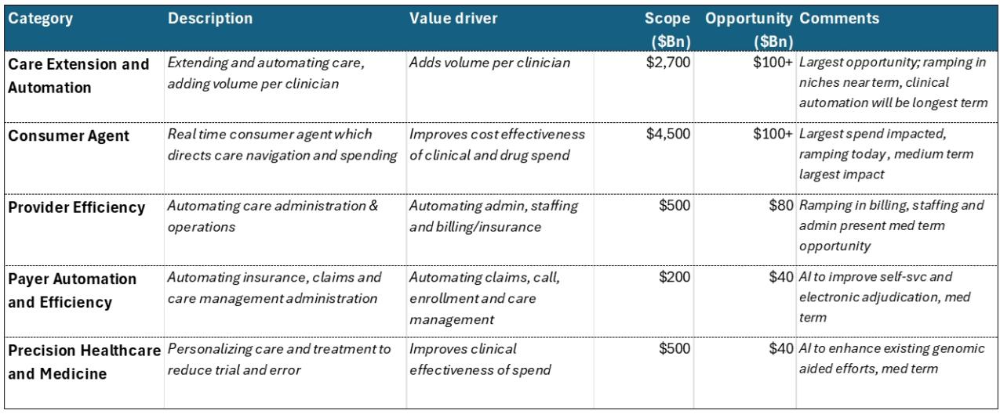
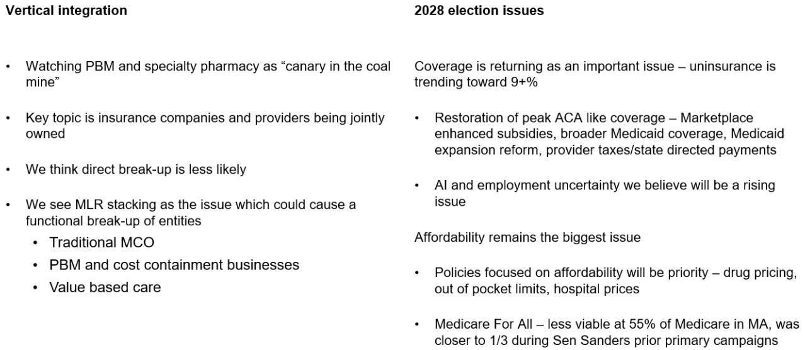

# Bernstein：Medicare Advantage的利润率正在触底，但市场低估了“公用事业化”的长期定价逻辑

市场对Medicare Advantage（MA）的定价，长期以来被一个经典叙事主导：这是一个高增长、高利润、且受政策风险扰动的周期性赛道。投资者习惯于将MA计划视为保险周期的放大器——费率高时利润爆发，费率低时利润崩塌。这份Bernstein的暑期教学系列报告，提供了一个比周期判断更值得关注的框架：MA正在经历结构性转型，其终局不是利润率的均值回归，而是向“公用事业型”市场的收敛。这意味着，当前市场对MA相关股票的估值，可能既低估了利润率修复的幅度，也误读了长期稳态利润率的水平。

报告的核心判断是，MA行业利润率已经在2023-2025年触底，预计2026年将回升约1个百分点，此后每年以约0.5个百分点的速度温和扩张，直到2030年。这一判断的基础，并非政策红利或需求爆发，而是竞争退出、费率改善和行业定价纪律的回归。但比短期复苏更重要的，是Bernstein提出的长期图景：MA和Medicaid市场都将趋于“公用事业化”，最终由4-5家规模化玩家主导，MA的稳态利润率维持在2-3%之间。如果这一判断成立，那么当前市场对头部MA企业的估值折扣，可能恰恰提供了逆向布局的机会。

## 1. 利润率危机并非系统性问题，而是传统保险周期的必然产物

理解MA利润率为何在2023-2025年遭遇重创，是判断后续走势的前提。Bernstein的分析提供了一个清晰的周期框架：2005-2015年间，MA市场收入增速高达15-20%，利润率稳定在5%左右。这一高回报吸引了大量资本涌入，竞争加剧直接压低了利润率，也为后续的费率冲击埋下了伏笔。

当CMS在2024年和2025年连续给出低于2.5%的有效增长率时，行业利润率的崩溃几乎不可避免。这并非MA商业模式本身的结构性缺陷，而是典型的保险周期——高利润吸引竞争，竞争推高成本，成本叠加费率收紧导致危机。Bernstein指出，2024-2025年的有效增长率实际上低估了医疗成本趋势，这进一步放大了利润压力。

但关键在于，这个周期已经进入出清阶段。竞争者在低利润环境下被迫退出，行业集中度提升，头部企业开始将定价权回归到以盈利为导向。从这个角度看，利润率危机恰恰是市场出清的必要代价，而非行业衰落的信号。对于投资者而言，这意味着当前的低利润时期可能正是布局的窗口，而不是需要回避的雷区。

## 2. 2026年利润率修复的驱动力是结构性的，而非政策偶发性

Bernstein预计2026年行业MA利润率将扩张约1个百分点，随后每年以0.5个百分点的速度增长。这个判断令人关注，因为它并非建立在某个单一政策利好的假设上，而是基于三个相互支撑的结构性因素。

首先，竞争退出正在实质性改善定价环境。报告指出，在利润率压缩期间，大量中小型参与者已经或正在退出市场。头部企业如UNH、HUM、CVS的市场份额合计约55%，但市场整体仍相对分散。随着尾部玩家离场，剩余的规模化企业将获得更强的议价能力，这直接反映在2026年的定价上。

其次，费率环境正在从低点改善。CMS公布的2026年MA有效增长率高达9.04%，这显著高于2024年的2.28%和2025年的2.33%。虽然这一数字包含了技术性调整，但它至少表明政策制定者意识到了费率过低对行业可持续性的威胁。Bernstein认为，这标志着费率周期的底部已经出现。

第三，也是最重要的，行业正在从“市场份额优先”转向“定价盈利优先”。这一转变并非自愿，而是在利润压力下的被迫选择。但一旦形成共识，它对利润率的支撑将是持续的。报告特别指出，MA计划在2024年向成员提供了平均每月194美元的额外福利，这相当于15%的额外价值。在利润压力下，企业将不得不重新审视福利设计的成本效益，这本身就是利润率修复的微观基础。

## 3. “公用事业化”终局意味着利润率上限被锁定，但确定性溢价将重估

Bernstein的长期判断——MA市场将趋于“公用事业化”，由4-5家规模化玩家主导，利润率维持在2-3%——可能是这份报告最值得深入思考的洞察。如果这一判断成立，那么市场对MA股票的估值框架可能需要根本性调整。

公用事业化意味着几个关键特征：增长率放缓、利润率稳定、竞争格局固化、政策风险降低。Bernstein预计MA enrollment将以每年4-5%的速度增长，这远低于过去的高增速，但叠加生命预期延长（GLP-1s可能贡献每年额外1年的生命预期增长），总市场规模仍在扩大。更重要的是，在寡头格局下，企业将不再需要通过价格战争夺市场份额，利润率将趋于稳定。

2-3%的利润率看起来不高，但考虑到MA业务的规模效应和资本轻属性，这个利润率水平对应的资本回报率可能相当可观。更重要的是，公用事业化的估值逻辑不同：投资者愿意为稳定的现金流和可预测的回报支付溢价，而不是为高增长但波动巨大的利润支付折价。如果市场逐渐接受这一终局假设，当前处于历史低位的估值倍数可能面临重估。

当然，这个判断仍需要验证。报告没有完全展开的是，公用事业化过程中，哪些企业能够成为最终的4-5家赢家。规模是必要条件，但并非充分条件。能否将规模转化为对供应商的议价权、对CMS的谈判能力、以及对成员留存率的控制力，才是决定性因素。

## 4. 三大颠覆因素正在重塑竞争格局，但方向并不一致

Bernstein识别了三个关键颠覆因素：GLP-1药物、人工智能、以及基于价值的护理（VBC）。这些因素将如何影响MA的利润率和竞争格局，报告提供了初步框架，但许多问题仍待解答。

GLP-1s对MA市场的影响是双面的。一方面，它们将推高药品成本，直接压缩利润率。另一方面，它们可能延长生命预期，从而扩大Medicare的总可寻址市场（TAM）5-10%。对于MA计划而言，这意味着成员池扩大，但人均成本上升。净效应取决于MA计划能否通过风险调整机制和处方设计来管理药品支出。这里的关键问题是，GLP-1s的成本效应是否会超出CMS的费率调整模型，从而造成利润率的系统性压力。报告没有给出明确答案，但这可能是未来几年最重要的变量之一。

AI的潜力在于提高医院运营效率和患者护理效率。对于MA计划而言，AI可能帮助减少不必要的住院、优化护理路径、降低管理成本。但AI的落地效果和在MA利润率中的体现，目前仍处于早期阶段。报告的态度是谨慎乐观的，但并未量化AI对利润率的潜在贡献。

VBC（基于价值的护理）被视为应对长期利润率压力的核心工具。Bernstein预计，长期来看，报销率将落后于医疗成本趋势100-150个基点。这意味着，单纯依靠费率增长无法维持利润率，必须通过VBC来改变成本结构。VBC的推进速度和质量，可能成为区分赢家和输家的关键。但VBC本身也是一项复杂的系统工程，需要强大的数据能力、医生网络和管理经验。报告指出，这可能是规模化玩家的护城河，而非所有参与者都能跨越的门槛。

## 5. 政策风险正在从“Medicare for All”转向“可负担性与覆盖扩张”

长期以来，MA市场最大的政策阴影是“Medicare for All”或类似的全民医保方案。但Bernstein指出，随着MA enrollment已占Medicare总人口的55%，这一政策方案的可行性已大幅降低。在早期的改革辩论中，MA占比仅为三分之一左右，如今的政治现实是，任何试图废除或大幅削弱MA的政策，都将直接影响超过3500万美国老年人的医疗保障。

政策焦点正在转向“可负担性与覆盖扩张”。Bernstein预计，民主党将推动将未保险率从当前水平（报告认为可能上升至9%）恢复到5%左右。这意味着政策方向可能是扩大覆盖，而非收缩。对于MA计划而言，这可能意味着更多的dual-eligible成员（同时符合Medicare和Medicaid资格的人群）进入市场，而这部分成员的利润率和成本结构与传统MA成员存在显著差异。

报告没有完全展开的是，政策转向对MA计划定价和福利设计的具体影响。例如，如果政府要求MA计划提供更低的保费或更广泛的网络，利润率是否会受到挤压？这些问题的答案，取决于政策设计和执行细节，但方向是明确的：政策风险正在从“生存威胁”降级为“利润结构扰动”。

## 6. 报告尚未完全回答的关键问题：利润率修复的斜率是否会被GLP-1s打断

尽管Bernstein的框架清晰且逻辑自洽，但一个关键问题尚未得到充分解答：GLP-1s对MA利润率的冲击，是否可能超出周期修复的假设范围。

报告指出，GLP-1s可能延长生命预期，从而扩大TAM。但延长生命预期意味着成员在更高年龄段的医疗支出增加，这通常是最昂贵的护理阶段。同时，GLP-1s本身的成本高昂，如果MA计划被迫将其纳入处方集，药品支出将显著上升。CMS的费率调整模型能否及时捕捉这些成本变化，是一个巨大的不确定性。

如果GLP-1s的成本效应超过预期，MA计划的利润率修复斜率可能比Bernstein预测的更平缓，甚至可能出现二次探底。反之，如果MA计划能够通过处方设计、风险调整和VBC管理GLP-1s的成本，那么利润率修复可能加速。这个问题的答案，可能需要未来2-3年的实际数据才能验证。

对于投资者而言，这意味着在布局MA相关股票时，需要密切关注GLP-1s的处方趋势、MA计划的药品成本管理能力、以及CMS的费率调整动态。这是一个需要持续跟踪的变量，而非一次性判断。

## 7. 一个值得关注的观察框架：谁能在“公用事业化”中建立真正的护城河

如果Bernstein的公用事业化终局成立，那么区分赢家和输家的关键，不再是增长速度，而是护城河的深度。报告提供了一些线索，但并未系统性地展开。

第一层护城河是规模与网络的结合。UNH和HUM作为前两大玩家，拥有最大的成员基础和最广泛的供应商网络。规模意味着更强的议价权，网络意味着更高的成员粘性。但规模本身并不自动转化为护城河——关键在于能否将规模转化为成本优势和定价权。

第二层护城河是VBC的执行能力。在报销率长期落后于成本趋势的假设下，控制成本的能力将直接决定利润率。VBC不是简单的合同安排，而是需要数据基础设施、医生管理能力和风险承担意愿的系统工程。报告指出，MA计划在VBC上的进展将决定其长期竞争力，但并未详细评估各主要玩家的VBC能力。

第三层护城河是品牌与成员忠诚度。MA成员每年都有机会重新选择计划，这意味着成员留存率是一个关键指标。报告提到，MA成员的满意度高于商业保险成员，但未分析不同计划之间的满意度差异。哪些计划能够通过福利设计、网络质量和客户服务建立品牌忠诚度，将直接决定其市场份额的稳定性。

对于读者而言，建立自己的观察框架比依赖单一报告更重要。关注头部企业的VBC进展、成员留存率、以及GLP-1s的成本管理能力，可能比关注短期利润率波动更有价值。

---

这份Bernstein报告的价值，在于它提供了一个从周期到结构的分析框架。MA利润率正在触底，这是周期判断。但更重要的判断是，MA正在向公用事业化市场收敛，这意味着利润率的上限被锁定，但确定性溢价可能提升。对于投资者而言，理解这一结构性转型，比预测下一个季度的利润率更重要。

报告中的许多细节——如GLP-1s对TAM的影响、VBC的执行路径、政策转向的具体影响——都值得进一步拆解和讨论。我们将在社群中继续深入这些议题，欢迎你带着自己的观察和问题参与讨论。

Personal reading notes and learning share only. Not investment advice.

