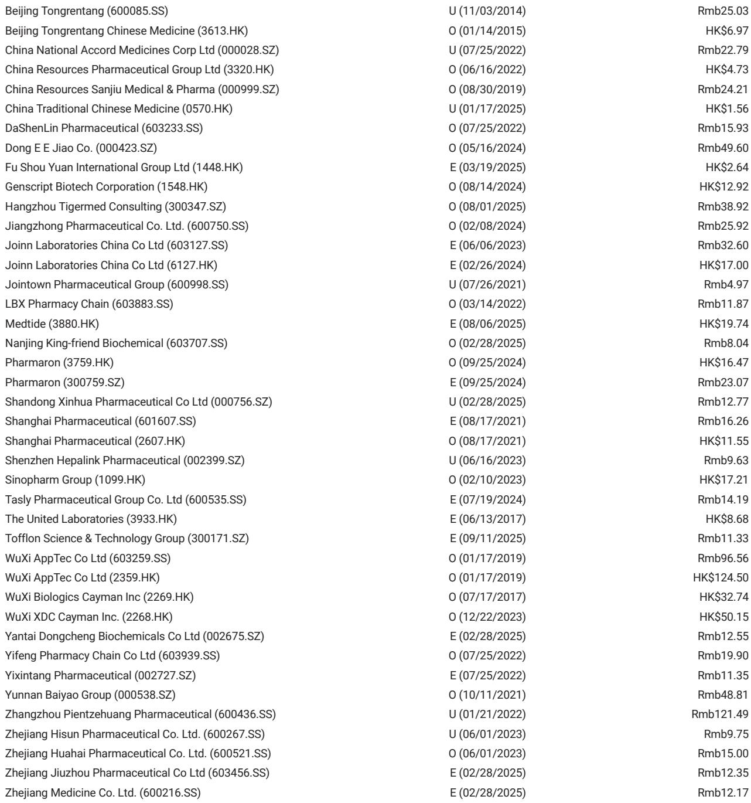
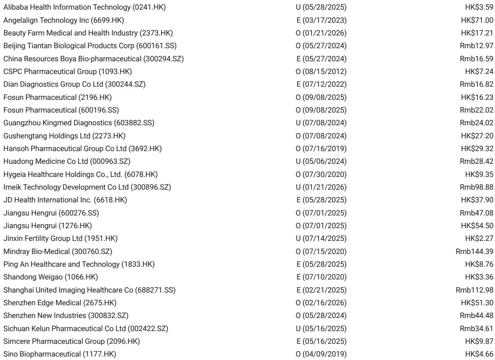
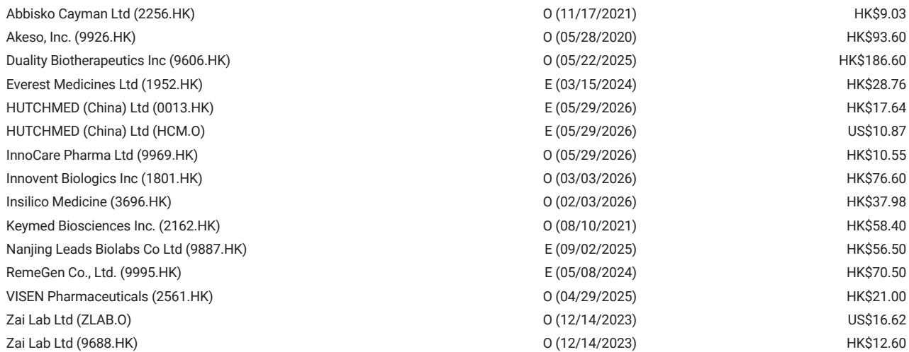

# China Biotech at ASCO 2026: The Data Is Now Differentiating Winners from Survivors

The ASCO 2026 late-breaking abstracts from Days 4-5 have delivered a clear message that the Chinese biotechnology sector is no longer competing on speed-to-market alone. The data emerging from this year's conference reveals a cohort of assets that are not just comparable to global standards but, in specific indications, are setting new benchmarks for efficacy. For institutional investors who have long viewed Chinese biotech as a high-risk, high-reward beta play on regulatory reform, the signal from this year's conference is unambiguous: the window for alpha generation through deep scientific diligence is now open, and it requires a more granular approach than simply buying the sector.

The most compelling argument to emerge from the data is that the era of "me-too" innovation is giving way to a period of genuine therapeutic differentiation. This is not a story about a single blockbuster drug. It is a story about how combination strategies, novel mechanisms, and a deep understanding of disease biology are producing clinical outcomes that challenge the prevailing standard of care. The implications for portfolio construction are profound: a rising tide will not lift all boats, and the dispersion between winners and laggards will widen significantly over the next 12 to 18 months.

The data points from Days 4-5 specifically highlight two therapeutic areas where the competitive dynamics are shifting decisively: the treatment of relapsed/refractory small cell lung cancer (SCLC) and the management of high-risk myelodysplastic syndromes (HR-MDS) and acute myeloid leukemia (AML). In both cases, the evidence suggests that a new generation of Chinese biotech assets is redefining the efficacy frontier, forcing a reassessment of both legacy therapies and the pipeline assets of global competitors.

## The AK112/Lipo-iri Combination in 2L SCLC Is Redefining the Efficacy Floor and Ceiling

The most striking data point from the late-breaking sessions is the performance of the AK112/lipo-iri combination in second-line SCLC. The headline numbers demand attention: an overall response rate of 61.7%, a median progression-free survival of 8.1 months, and a 6-month PFS rate of 69.1%. These figures are not merely incremental improvements; they represent a step-change in a disease setting where historical outcomes have been uniformly poor. The comparator data from the BNT327 plus paclitaxel arm, which delivered an ORR of 37.2% and a median PFS of 5.4 months, underscores the magnitude of the improvement.

The strategic insight here goes beyond the raw efficacy numbers. The critical analytical question is how to parse the contribution of each component. The RESILIENT trial data for lipo-iri monotherapy provides a baseline: an ORR of 44.1% and a median PFS of 4.0 months. This tells us that the chemotherapy backbone is anchoring the response floor. The addition of AK112 is not dramatically boosting the initial response rate; rather, its primary value lies in durability. The median PFS of 8.1 months versus 4.0 months for lipo-iri alone represents more than a doubling of disease control. This is the signature of an effective immunotherapy combination: it converts a high but transient response into a more durable clinical benefit.

The caveat that demands careful scrutiny is the bleeding risk. With a hemorrhage rate of 20% and a Grade 3 or higher treatment-related adverse event rate of 36.7%, the safety profile, while manageable, is not benign. The critical open question is whether these adverse events will require dose modifications, treatment interruptions, or, in the worst case, limit the addressable patient population. The comparison with the BNT327 arm, which had a significantly higher Grade 3+ AE rate of 78.6%, suggests that AK112/lipo-iri may have a favorable risk/benefit profile, but the bleeding signal will need to be monitored carefully in larger, randomized trials.

## The Mesutoclax Data in HR-MDS and AML Creates a High-Stakes Validation Event for the BCL-2 Class

The mesutoclax data across both HR-MDS and AML represents a potential inflection point for the entire BCL-2 inhibitor class in China. In the treatment-naive HR-MDS cohort, the combination of mesutoclax with azacitidine produced an ORR of 100% and an IWG 2023 composite CR rate of 90% in a small cohort of ten patients. While the sample size is too small to draw definitive conclusions, the magnitude of the effect is striking when compared to the lisaftoclax benchmark, which delivered ORR of 64-74% and a composite CR rate of approximately 70%. The key question that the full report must answer is durability. After the VERONA trial failure for venetoclax in HR-MDS, the bar for survival benefit has been raised. A high CR rate without a meaningful overall survival advantage will not change the standard of care.

The AML data is even more compelling and potentially more investable. In 44 treatment-naive AML patients, mesutoclax plus azacitidine achieved a composite CR of 81.8%, a CR rate of 63.6%, and an MRD-negativity rate of 86.5%. The comparator data from sonrotoclax is instructive: a CR/CRi of 67.1%, an MRD-negativity rate of 35.4%, and a Grade 3+ infection rate of 50.6% with a 5% tumor lysis syndrome rate. The mesutoclax data suggests a cleaner safety profile and a deeper level of remission. The MRD-negativity rate of 86.5% is particularly noteworthy, as MRD status is increasingly recognized as a surrogate for long-term outcomes in AML. The open question for investors is whether this MRD advantage will translate into a meaningful overall survival benefit and whether the count recovery and infection rates will be manageable in a real-world setting, especially when compared to the azacitidine/venetoclax standard of care.

## The InnoCare Signal in HR-MDS Requires a Longer Follow-Up to Validate Its Promise

The InnoCare data in HR-MDS, while preliminary, introduces an important competitive dynamic that the full report does not fully resolve. The ORR of 100% and the IWG23 compCR of 90% in treatment-naive patients are the best numbers we have seen in this setting from any Chinese developer. However, the small sample size of ten patients and the absence of mature overall survival data are significant limitations. The key analytical challenge is distinguishing between a genuine best-in-class signal and a statistical artifact of a small, highly selected cohort.

The strategic implication for investors is that this asset now carries a high validation premium. If the durability data, when it matures, confirms the initial signal, InnoCare could emerge as the dominant player in the HR-MDS space in China, potentially capturing significant market share from the lisaftoclax and venetoclax franchises. Conversely, if the data fails to hold up in a larger, randomized trial, the stock could face a sharp re-rating. The absence of a clear timeline for the next data readout is a source of uncertainty that the full report should address. Investors must decide whether to pay up for optionality or wait for confirmation.

## The Report Leaves Unanswered a Critical Question about the Durability of the AK112 Advantage

One of the most important analytical gaps in the current data is the durability of the AK112/lipo-iri benefit in the context of prior immunotherapy exposure. The data shows that in the chemotherapy-resistant cohort (CFI less than 90 days), the median PFS was 6.7 months. This is a meaningful result, but it raises the question of whether the benefit is truly additive or whether it is primarily driven by the chemotherapy backbone in a population that has already failed immunotherapy. The caveat regarding the CFI split is significant: the AK112 arm had a lower proportion of CFI less than 90 patients (36.7%) compared to the BNT327 arm (50%). This imbalance could explain some of the observed efficacy advantage.

The full report should provide a more detailed breakdown of outcomes by prior immunotherapy exposure and by CFI status. Without this analysis, it is difficult to determine whether the AK112/lipo-iri combination is genuinely overcoming resistance mechanisms or simply benefiting from a more favorable patient mix. This is not a minor detail; it is central to the question of whether this combination can become a new standard of care or whether it will be relegated to a niche role in specific patient subsets. Investors should demand this data before making a conviction call on the asset's commercial potential.

## A Decision Framework for Investors Navigating the Post-ASCO 2026 Landscape

Based on the data from Days 4-5, investors should adopt a three-tiered decision framework to prioritize their diligence and capital allocation. The first tier is validation risk. For assets like mesutoclax in AML and AK112/lipo-iri in SCLC, the data is sufficiently robust to warrant a higher conviction, but the key risk is whether the results will replicate in larger, randomized registrational trials. Investors should focus on trial design, statistical power, and the timing of the next data readout. The second tier is differentiation risk. For assets like InnoCare in HR-MDS, the data is tantalizing but preliminary. The key question is whether the initial signal will hold up or fade with longer follow-up. Investors should assign a probability to the durability outcome and size their positions accordingly. The third tier is commercial risk. Even if the clinical data holds up, the commercial success of these assets will depend on pricing, reimbursement, and physician adoption. Investors should assess the competitive landscape, the potential for biosimilars or next-generation competitors, and the ability of the companies to build a commercial infrastructure.

The most important takeaway from this framework is that the time for blanket sector exposure has passed. The ASCO 2026 data has created a clear differentiation between assets that are generating genuinely competitive data and those that are merely keeping pace. The winners will be those that can demonstrate not just statistical significance but clinical meaningfulness, not just efficacy but safety, and not just data but a clear path to commercialization.

Join the community to read the full report and review the original charts.

*This article is for learning and discussion only and does not constitute investment advice.*

Personal reading notes and learning share only. Not investment advice.

