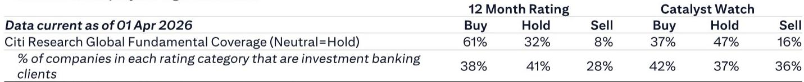
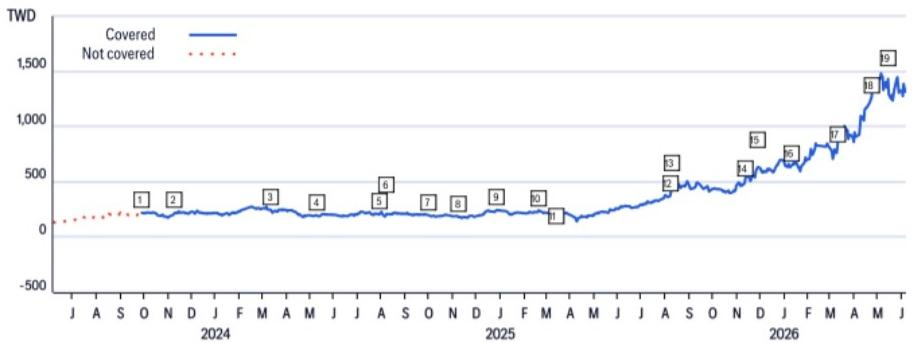
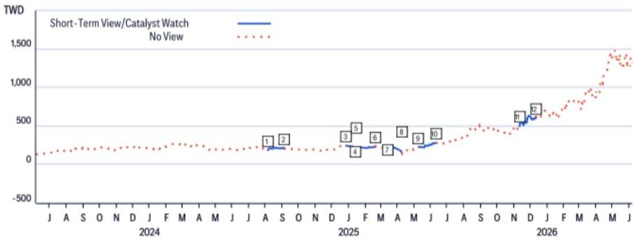

# Citi：AI供应链的瓶颈正在从GPU转移到PCB和铜箔基板

市场对AI硬件产业链的关注，长期以来集中在GPU供给、CoWoS封装产能、以及HBM存储器的供需缺口上。但一份来自Citi近期台湾科技大会的调研纪要，揭示了一个正在发生的结构性变化：**AI服务器产业链的瓶颈，正在从先进封装和晶圆制造，向下游的PCB和铜箔基板（CCL）环节转移。** 这不是一个短期扰动，而是供给端投资节奏长期错配的结果。

Citi分析师Jack Chen及其团队在2026年6月初的台湾科技大会上，与三家核心PCB和CCL厂商——金像电子（GCE）、台光电（EMC）和联茂电子（TUC）进行了深度交流。三家公司的反馈高度一致：AI需求强劲，产能扩张速度跟不上客户需求，涨价正在成为行业共识。这份报告的价值，在于它不只是给出了一个“景气向好”的判断，而是系统性地拆解了三个不同环节（PCB、CCL、上游材料）各自的供需格局、定价策略和竞争分化。

以下是这份报告的核心洞察与延伸分析。

## 1. PCB与CCL的产能扩张正在出现不可忽视的“速度差”

Citi报告中最具结构性意义的判断，来自于EMC和TUC两家CCL厂商的共同观察：CCL行业的产能扩张速度，系统性落后于PCB行业的扩张速度。这意味着，即便PCB厂有能力建新厂、扩产线，它们也可能面临上游CCL供应不足的瓶颈。

这个判断的逻辑链条是清晰的。PCB厂商如金像电子计划在2027、2028、2029年每年新建一座工厂，扩产意愿强烈。但CCL厂商的扩产节奏更为谨慎。EMC明确表示其未来产能扩张将主要集中在中国，因为“产能部署更高效、客户需求更充足”。TUC的泰国新厂则因设备交付延迟，营收贡献时间点从预期推迟到了2026年三季度末。

这两组信息合在一起，指向一个结论：在AI服务器的需求爆发周期中，PCB和CCL之间的产能扩张速度差，将导致CCL成为新的供给瓶颈。Citi报告原文的表述是“CCL capacity ramp would be lower than new PCB capacity ramp, resulting in CCL shortage and potential price hikes”。这不是猜测，而是两家CCL龙头在科技大会上给出的明确指引。

对于投资者而言，这意味着需要重新审视AI硬件产业链的“瓶颈”分布。过去两年，市场习惯性地将焦点放在GPU和先进封装上。但Citi这份调研提示，当GPU供给逐步缓解、CoWoS产能持续开出之后，下游的PCB和CCL环节可能成为新的约束条件，进而影响AI服务器的实际出货量。

## 2. 涨价不再是“可能性”，而是正在发生的行业共识

Citi报告中最具说服力的部分，是三家公司在“涨价”问题上的表态高度一致。EMC和TUC都明确表示，将根据通胀或客户需求的溢价程度，持续上调CCL价格。金像电子则透露，其客户目前已经接受了PCB的涨价提议。

这意味着，涨价不是一家公司的个别行为，而是行业性的供需再定价。Citi报告给出的背景是：CCL供应紧张将“持续”，支持进一步的涨价。EMC的策略是继续向下游传递原材料成本上升的压力，同时强调在调价过程中维持与关键AI客户的长期战略关系。TUC则采取了更为激进的定价策略——对M7及以下级别的CCL产品主动提价，对M8级别则与EMC保持协同。

这里值得注意的细节是，两家CCL公司在定价策略上出现了微妙的分化。TUC对低规格产品采取了更激进的涨价姿态，而EMC更强调“长期关系”和“客户黏性”。这种分化可能反映了它们在不同客户和不同产品线上的竞争定位差异。对于投资者来说，需要关注的是：当行业整体涨价时，哪家公司的议价能力更强、涨价空间更大，而不是简单地将所有CCL公司视为同一类资产。

金像电子作为PCB端，其涨价逻辑略有不同。它拥有长期采购协议的CCL供应保障，但临时加单几乎无法被满足。这意味着，金像电子的产能扩张和营收增长，将受到其供应链管理能力的制约，而不只是自身产能的扩张速度。

## 3. AI ASIC客户的争夺正在改变PCB行业的竞争格局

Citi报告对金像电子的分析中，有一个值得单独拎出来的判断：公司在现有ASIC客户中的市场份额正在提升，并且有“高概率”在2026年四季度开始支持另一家新的ASIC客户。这组信息表明，AI ASIC服务器的PCB竞争格局正在发生变化。

金像电子目前已经在为一家主要的ASIC客户供货，并且获得了份额增长。如果第二家ASIC客户的导入顺利落地，这将意味着金像电子的客户基础从单一ASIC项目扩展到两个项目，营收的确定性和成长性都将显著提升。Citi报告给出的目标价是NT$1,650，基于26倍的2027年预期市盈率，远高于其历史三年平均的22倍。Citi给出的理由是：高AI服务器和网络设备销售占比、市场份额提升、以及新客户导入带来的增长。

但这里有一个需要验证的问题：金像电子的市场份额提升，是来自竞争对手的失误，还是自身技术或产能优势的体现？报告没有完全展开。在PCB行业，客户导入周期长、认证门槛高，一旦进入供应链，切换成本也高。如果金像电子的份额提升是可持续的，那么它在AI ASIC PCB领域的护城河就在加深。反之，如果只是短期订单分配的结果，则需要警惕竞争格局的变化。

## 4. 上游材料的分化正在加剧：玻璃纤维、铜箔、PTFE的供给判断不一

Citi报告在讨论上游材料时，呈现出一种有趣的“分裂”状态。EMC和TUC对玻璃纤维、铜箔的供给判断存在明显分歧。

在玻璃纤维方面，EMC认为其不太可能受到Low-Dk2短缺的影响，而TUC则认为Low-Dk2材料将持续紧张。两家公司都认为E-glass的供给状况正在改善，2027年可能不再是主要瓶颈。在铜箔方面，EMC预计2026年下半年至2027年可能出现供给紧张，而TUC则认为不存在明显的短缺风险，铜箔价格保持稳定。

这种分歧本身就是一个重要信号。它说明，即使在同一产业链环节，不同公司的供应链管理能力、供应商关系、以及产品组合的差异，会导致它们对上游风险的判断完全不同。对于投资者而言，不能简单地将“CCL行业景气”等同于所有CCL公司都受益。那些能够更精准地管理上游材料风险、或者拥有更优质供应商关系的公司，将在下一轮竞争中占据优势。

此外，EMC对PTFE材料的判断也值得关注。Citi报告指出，EMC认为客户对PTFE材料的采用仍处于非常早期的评估阶段，远未到“板上钉钉”的程度。这意味着，市场可能对下一代CCL材料的升级节奏存在过度乐观的预期。如果PTFE的导入时间线被拉长，那么现有M8级别CCL的生命周期和定价权将比市场预期的更持久。

## 5. 报告尚未完全回答的关键问题：泰国产能的盈利拐点何时到来？

Citi报告在多个地方提到了泰国产能的进展，但有一个关键问题没有得到充分回答：泰国工厂的盈利拐点何时到来？

金像电子预计其泰国工厂的月营收贡献将从2026年二季度的约6亿新台币，增长到三季度的13亿新台币，并且AI服务器生产将在下半年启动。公司管理层预计，随着产能利用率的爬坡，泰国工厂的盈利能力将逐步改善。TUC的泰国新厂则因设备交付延迟，营收贡献推迟到三季度末。

这些信息表明，东南亚产能的扩张正在推进，但盈利时间表仍然存在不确定性。金像电子的泰国工厂目前主要生产通用服务器产品，AI服务器要到下半年才开始投产。这意味着，短期内泰国工厂的利润率可能仍低于中国工厂。对于投资者来说，需要持续跟踪的是：泰国工厂的产能利用率何时达到盈亏平衡点？AI服务器产品的良率和利润率与现有工厂相比如何？

这个问题之所以重要，是因为它关系到整个AI供应链“中国+1”战略的落地效率。如果东南亚产能的盈利爬坡慢于预期，那么全球AI服务器的供给瓶颈可能比目前市场预期的更长。

## 6. 一个值得持续跟踪的观察框架

基于Citi这份报告，可以提炼出一个针对AI PCB和CCL产业链的观察框架，供读者在后续跟踪中使用：

第一，关注PCB与CCL产能扩张速度差的演变。如果CCL厂商的扩产计划在未来几个季度加速，那么供给瓶颈可能提前缓解；如果持续落后，涨价周期将延长。

第二，跟踪CCL厂商的定价策略分化。TUC对低规格产品的激进涨价，是否会影响其与EMC在高端市场的竞争格局？EMC强调的“长期客户关系”能否转化为更高的客户黏性和订单稳定性？

第三，验证金像电子第二家ASIC客户的导入进度。如果顺利落地，将是对其竞争力和成长性的重要验证；如果延迟或失败，则可能意味着其市场份额提升的可持续性存疑。

第四，关注上游材料供给判断的分歧是否收敛。如果铜箔或玻璃纤维的实际供给紧张程度超出预期，那么拥有更优质供应链管理的CCL公司将获得超额收益；反之，如果供给持续宽松，涨价逻辑的支撑力将减弱。

第五，密切跟踪泰国等东南亚产能的盈利拐点。这是AI供应链地理重构的关键变量，也是影响相关公司估值的重要因子。

Citi这份报告的价值，在于它提供了一手的企业调研信息，而不是简单的行业数据堆砌。它揭示了AI硬件产业链正在发生的结构性变化——瓶颈从上游向下游转移，涨价从预期变为现实，竞争从同质化走向分化。这些信息，对于理解未来6-12个月AI硬件板块的投资逻辑，具有直接的参考意义。

当然，这份报告也有一些未解的问题。比如，CCL涨价能否完全传导到终端客户？AI ASIC客户的需求增速是否如TSMC所引导的50%+ CAGR那样乐观？PTFE材料的导入时间线是否会显著快于EMC的预期？这些问题的答案，将决定当前估值水平的合理性。

欢迎来星球微信群里继续讨论这些未解问题。我们会在社群中持续跟踪Citi及其他投行对AI供应链的后续调研，并分享更详细的图表分析和估值对比。

Personal reading notes and learning share only. Not investment advice.

