# Payments, Processors & IT Services

# The Long View: Payments - Does Cash Digitization Runway Still Exist?

Harshita Rawat, CFA

+1 917 344 8485

harshita.rawat@bernsteinsg.com

Simran Ratani

+1 917 344 8329

simran.ratani@bernsteinsg.com

Viola Chen

+1 917 344 8614

viola.chen@bernsteinsg.com

We publish the 12 $^{th}$ annual edition of our global payments forecast model. A lot has changed in the last 10+ years - U.S. is now highly penetrated by cards (72% vs. 58% ten years ago), local payment methods have gained traction (e.g., in Asia where card volume growth has somewhat stalled), domestic schemes have lost share (e.g., in Europe), other alternative ways to pay (e.g., A2A) have generated noise but have remained contained, and stablecoins are finding some utility in markets where dollars are desirable. Last year was the first time when we brought our forecasts down (see link) - largely because of market maturing in the U.S. and regional dynamics in Asia. Against that dynamic backdrop, our global payments forecast model remains the under-pinning of our investment view on the sector and V/MA in particular - even as value-added services capture a growing share of revenue.

We forecast 8% cc (\~7-8% nominal) card volume growth from 2025-30E (below 2022-25 CAGR of 9% cc), driven by 5-6% PCE growth and 2-3% card penetration-driven growth (penetration growing to 71%, up from 64% in 2025). The exit growth rate in 2030 in our model is 7%. We forecast deceleration vs. history (\~8% cc vs. 9% cc historically) due to already high penetration in the U.S. (where we now forecast \~5-6% card volume growth CAGR vs. \~6% CAGR between 2022-25), slowdown in Asia (due to local market nuances). Europe remains an attractive market for cards: we forecast 11% cc volume growth driven by continental Europe (e.g., Germany, Italy, Spain) vs. 16% historically. We are monitoring optionality driven by possible inflection in eCommerce from Agentic commerce and autonomous agent transactions as a growth driver for card payments but note that it's simply too early to bake anything into our numbers. We will closely monitor how cards' commercial models to address historically tougher to address categories such as rent and healthcare.

We forecast a stronger growth at 9% in the number of transactions globally between 2025-30E (10% 2022-25). Card penetration is lower when assessed as a % of number of transactions (as opposed to transaction value). V/MA derive >1/3rd of their gross revenue from # of transactions, which tend to grow faster than \$ volumes. Cross-border is at an interesting point, and we will address that in a separate note.

Card volumes only tell part of the story. We see a runway in tokens, VAS penetration and optionality in new flows (more details in a separate note), which along with 9% growth in transactions can drive DD% revenue growth despite card volume growth of 8%. For reference, even in high card penetration markets, networks have historically demonstrated an ability to grow revenues at double digits. Domestic schemes (\~\$4T of volumes globally) are an underappreciated opportunity e.g., Visa gained 5-6ppt share in Continental Europe vs Girocard / CB card in Germany/France in 2024.

Alternative ways-to-pay drive HSD-LDD% of consumer-to-business payments globally. While account-to-account and local methods are a risk to debit (especially in certain markets), even where A2A/local payments have had success (e.g., India, Brazil), credit-card volumes are growing HSD-LDD%. Finally, on a 5yr time horizon, we view stablecoins as a solution looking for a problem in retail consumer payments (note).

## INVESTMENT IMPLICATIONS

We rate V, MA, ADYEN, XYZ and TOST OP. We rate PYPL, FIS, FISV, GPN, KLAR MP.

## PLEASE SEE LINKS TO OUR RECENT RESEARCH

- Weekend Tech Byte: The 'cost' of cards — the often misleading comparisons; our perspectives in key charts (June 2026)  
• Visa: Reflections on our Fireside Chat with CEO Ryan McInerney (June 2026)  
- Payments: Stablecoins — What we learned from our dozens of industry conversations; Slide deck (May 2026)  
• Visa, Mastercard: Numbers look good but will it matter? (April 2026)  
• Visa, Mastercard: The bull case; slide deck from deep dive call on Agentic, Stablecoins, VAS and Regulation (March 2026)  
• The Age of Agents: Insights from our Inaugural Agentic Commerce Day (April 2026)  
• Payments: Mastercard's BVNK acquisition; what Stablecoins truly mean for payments (March 2026)  
• Visa, Mastercard: Payments-ocalypse, will AI doom the networks? (February 2026)  
• Payments: The growing regulatory risk premium? But will the numbers be impacted in the medium-term?  
• Payments/Fintech 2026: A year to remember? Top themes and stock ideas (January 2026)  
• Visa, Mastercard: Why we like the networks more now vs. 5yrs ago (October 2025)  
- Stablecoins: Let's Play Out a Scenario for Disruption in Consumer Payments.. (June 2025)  
• Payments: What happens in a recession? (Mar 2025)

## DETAILS

## OUR FORECAST: \~8% CC (\~7-8% NOMINAL) CARD VOLUME GROWTH FROM 2025-30

We forecast \~8% constant currency (\~7-8% nominal) C2B purchase volume CAGR over the next 5 years - slightly below the \~9% growth between 2022-25 and \~11% between 2019-22 (Exhibit 3).

## Card penetration grew 2-3ppt/year from 2022-25. We estimate it to grow \~1-2ppt/year going forward (Exhibit 1).

Card penetration grew \~1ppt in 2025. The \~1ppt penetration growth in 2025 was driven by healthy penetration growth in regions such as Europe (up 3ppt), LATAM (3ppt), MEA (\~3ppt), offset by more muted growth in Canada (90%+ penetration), US (flat) and APAC (\~-1ppt; flat ex-V/MA volumes in China). The pandemic very clearly accelerated cash digitization through faster growth in eCommerce, an increase in contactless usage, greater adoption of digital payments by merchants and by bringing in new digital payment users. From 2019-22, global card penetration grew \~3ppt/year, twice the historical average rate.

We forecast deceleration vs. history (\~8% cc vs. 9%) due to already high penetration in the U.S. (where we forecast \~5-6% card volume growth CAGR vs. \~6% CAGR between 2022-25), slowdown in Asia (due to local market nuances in certain markets and unique dynamics in mainland China - see details in the note). Our estimates embed the fact that many developed markets are now at high card penetration and EM is a battleground. In 2025, we estimate US card penetration at \~72%, up from \~67% in 2019. We estimate markets representing \~50% of global GDP (e.g., US, UK, Canada, Australia, South Korea) are now already at >80% digital payments penetration.

## Note:

- Our forecasts do not include meaningful tailwind from new payment flows, nor do they incorporate benefits from agentic commerce (it's simply too early to bake into our numbers). We also exclude Visa direct (in addition to commercial cards) from the numerator. Our forecast doesn't fully incorporate new ways to pay i.e. cards used to fund digital wallets as this can be quite tricky for a few markets.  
- Our card penetration numbers might differ slightly vs our prior estimates as we update our denominator (i.e. PCE numbers) to reflect recent data.

EXHIBIT 1: We expect card penetration to approach \~71% by 2030, up from 64% in 2025  
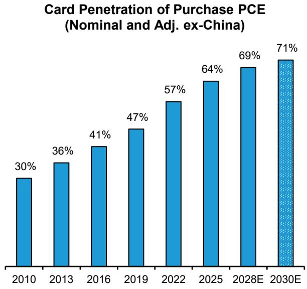

bar chart

Card Penetration of Purchase PCE (Nominal and Adj. ex-China)
| Year | Penetration (%) |
| :--- | :--- |
| 2010 | 30 |
| 2013 | 36 |
| 2016 | 41 |
| 2019 | 47 |
| 2022 | 57 |
| 2025 | 64 |
| 2028E | 69 |
| 2030E | 71 |

Source: Nilson, World Bank, IMF, Bernstein estimates and analysis

EXHIBIT 2: Majority of card volume growth from 2025 to 2030E will still be driven by US and Europe  
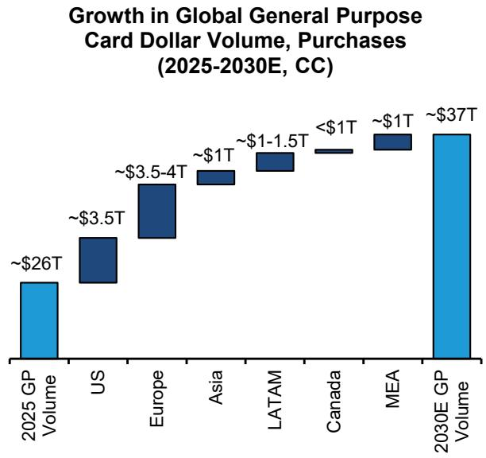

bar chart

Growth in Global General Purpose Card Dollar Volume, Purchases (2025-2030E, CC)
| Region | Value ($) |
| :--- | :--- |
| 2025 GP Volume | ~$26T |
| US | ~$3.5T |
| Europe | ~$3.5-4T |
| Asia | ~$1T |
| LATAM | ~$1-1.5T |
| Canada | <$1T |
| MEA | ~$1T |
| 2030E GP Volume | ~$37T |

Source: Nilson, World Bank, IMF, Bernstein estimates and analysis

EXHIBIT 3: On a cc basis, card volumes grew at \~11% between 2019-22, \~9% between 2022-25 and we forecast \~8% growth between 2025-30.  
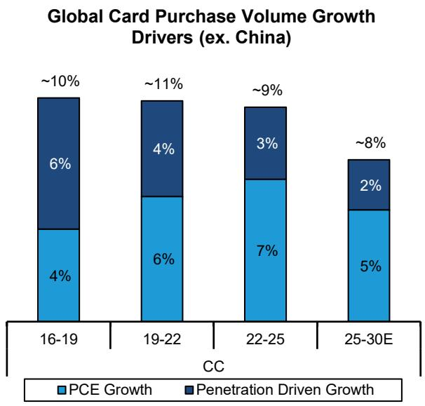

stacked bar chart

Global Card Purchase Volume Growth Drivers (ex. China)
| Age Group | PCE Growth (%) | Penetration Driven Growth (%) |
| :--- | :--- | :--- |
| 16-19 | 4 | 6 |
| 19-22 | 6 | 4 |
| 22-25 | 7 | 3 |
| 25-30E | 5 | 2 |
~10% ~11% ~9% ~8% CC

Note: Exclusion of Russia has a modest negative impact on 2019-22, 22-25 growth CAGRs  
Source: Nilson, World Bank, IMF, Bernstein estimates and analysis

EXHIBIT 5: Card volumes grew at \~8% on a nominal basis in 2025..  
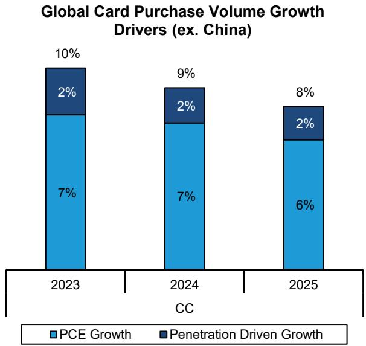

stacked bar chart

Global Card Purchase Volume Growth Drivers (ex. China)
| Year | PCE Growth (%) | Penetration Driven Growth (%) |
| :--- | :--- | :--- |
| 2023 | 7 | 2 |
| 2024 | 7 | 2 |
| 2025 | 6 | 2 |
CC
10%

Source: Nilson, World Bank, IMF, Bernstein estimates and analysis

EXHIBIT 4: On a nominal basis, we forecast \~7-8% card volume growth over 2025-30E globally.  
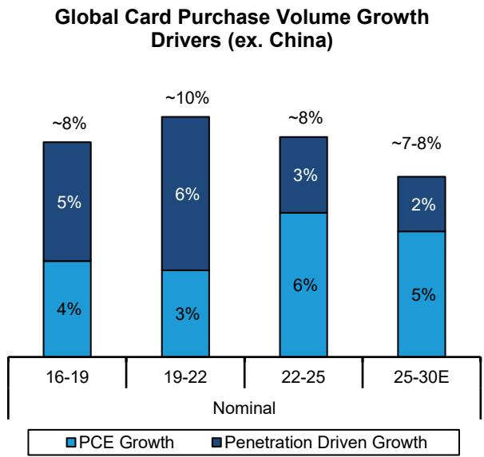

stacked bar chart

Global Card Purchase Volume Growth Drivers (ex. China)
| Nominal | PCE Growth (%) | Penetration Driven Growth (%) |
| :--- | :--- | :--- |
| 16-19 | 4 | 5 |
| 19-22 | 3 | 6 |
| 22-25 | 6 | 3 |
| 25-30E | 5 | 2 |
~8% ~10% ~8% ~7-8%

Note: Exclusion of Russia has a modest negative impact on 2019-22, 22-25 growth CAGRs  
Source: Nilson, World Bank, IMF, Bernstein estimates and analysis

EXHIBIT 6: ..and also on cc basis  
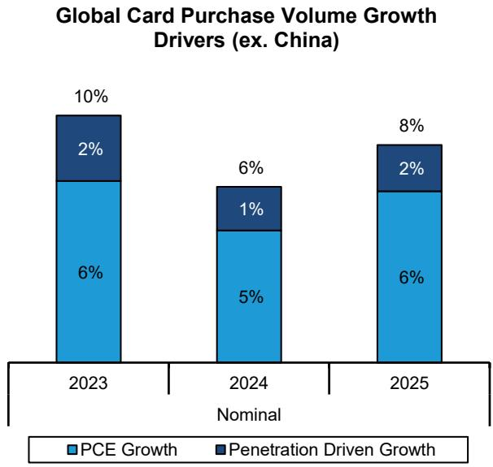

stacked bar chart

Global Card Purchase Volume Growth Drivers (ex. China)
| Year | PCE Growth (%) | Penetration Driven Growth (%) |
| :--- | :--- | :--- |
| 2023 | 6 | 2 |
| 2024 | 5 | 1 |
| 2025 | 6 | 2 |
Nominal
10%
6%
6%
8%

Source: Nilson, World Bank, IMF, Bernstein estimates and analysis

## CARD VOLUME GROWTH WILL LIKELY BE MORE CYCLICAL VS. HISTORY AS PENETRATION-DRIVEN GROWTH SOMEWHAT EASES

On a nominal basis, our \~7-8% volume CAGR forecast from 2025-30E comprises \~5% underlying global PCE growth & \~2ppt of secular cash to card conversion growth.

Our 5-yr nominal growth outlook by region is \~5-6% for U.S., \~11% cc (\~10% nominal) for Europe, \~5% cc (\~4% nominal) for Asia, \~13% for Latam cc (similar on nominal basis), 5% for Canada cc (\~6% nominal) and 14% cc (12% nominal) for MEA. We estimate that U.S. is \~72% penetrated by cards (up from \~67% in 2019), Europe at \~77% (up from 44% in 2019), Asia-Pac (ex-mainland China) at \~41% (up from 36% in 2019), Latam at \~48% (up from 29%), Canada at \~92% (up from 79% in 2019) and MEA at \~61% (up from 26%) (Exhibit 9).

We currently exclude mainland China from our forecasts but note that Mastercard went live in mainland China in May 2024 after acquiring a domestic license. Further, in APAC, in addition to mainland China, there are also certain local market dynamics which we will discuss later in the note.

EXHIBIT 7: Our growth forecast by region on cc basis - US - \~5-6%, Europe - 11%, APAC - 5%, LATAM - 13%, Canada - 5%, MEA - 14%

General Purpose Card Purchase Volume Growth Drivers by Region (CC, ex. China)  
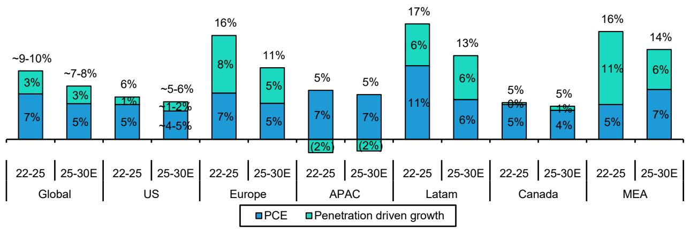

stacked bar chart

| Region | Period | PCE (%) | Penetration driven growth (%) |
| :--- | :--- | :--- | :--- |
| Global | 22-25 | 7 | 3 |
| Global | 25-30E | 5 | 3 |
| US | 22-25 | 5 | 1 |
| US | 25-30E | ~4-5 | -1-2 |
| Europe | 22-25 | 7 | 8 |
| Europe | 25-30E | 5 | 5 |
| APAC | 22-25 | 7 | (2) |
| APAC | 25-30E | 7 | (2) |
| Latam | 22-25 | 11 | 6 |
| Latam | 25-30E | 6 | 6 |
| Canada | 22-25 | 5 | 0 |
| Canada | 25-30E | 4 | 1 |
| MEA | 22-25 | 5 | 11 |
| MEA | 25-30E | 7 | 6 |
~9-10%; ~7-8%; ~5-6%; ~11%; ~9%-10%; ~5%-2%; ~11%; ~11%; ~13%; ~5%; ~5%; ~5%; ~14%.

Source: Nilson, World Bank, IMF, Bernstein estimates and analysis

EXHIBIT 8: Our nominal growth forecast by region - US - \~5-6%, Europe - 10%, APAC - 4%, LATAM - 13%, Canada - 6%, MEA - 12%

General Purpose Card Purchase Volume Growth Drivers by Region (Nominal, ex. China)  
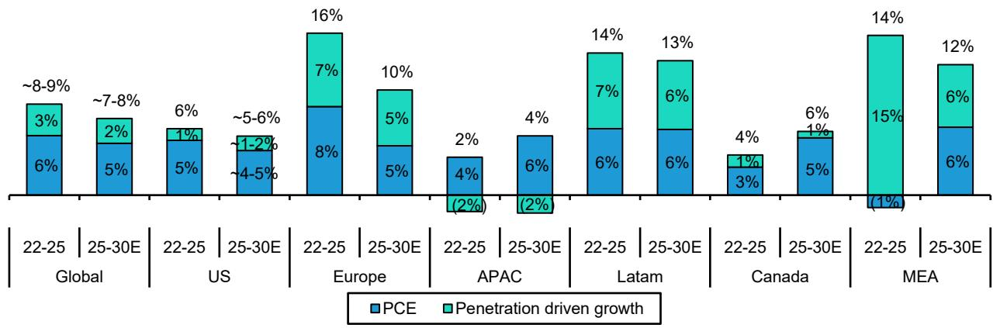

stacked bar chart

| Region | Period | PCE (%) | Penetration driven growth (%) |
| :--- | :--- | :--- | :--- |
| Global | 22-25 | 6 | 3 |
| Global | 25-30E | 5 | 2 |
| US | 22-25 | 5 | 1 |
| US | 25-30E | 4 | -1 |
| Europe | 22-25 | 8 | 7 |
| Europe | 25-30E | 5 | 5 |
| APAC | 22-25 | 4 | -2 |
| APAC | 25-30E | 6 | -2 |
| Latam | 22-25 | 6 | 7 |
| Latam | 25-30E | 6 | 6 |
| Canada | 22-25 | 3 | 1 |
| Canada | 25-30E | 5 | 1 |
| MEA | 22-25 | -1 | 15 |
| MEA | 25-30E | 6 | 6 |
The chart displays two data series: 'PCE' (blue bars) and 'Penetration driven growth' (teal bars). The values in parentheses indicate percentage changes relative to a baseline. The x-axis labels are 'Global', 'US', 'Europe', 'APAC', 'Latam', and 'Canada'. The y-axis is implied by the percentage labels above each bar.

Source: Nilson, World Bank, IMF, Bernstein estimates and analysis

EXHIBIT 9: We expect card penetration growth to be driven by Europe, Latam, and MEA  
Card Penetration of C2B Addressable PCE (Nominal, adjusted ex China)  
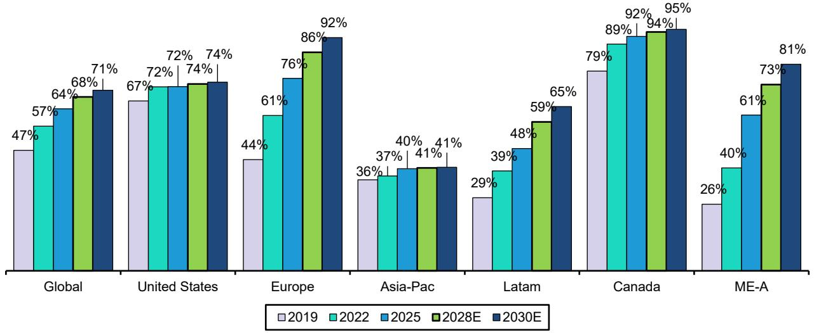

bar chart

| Region | 2019 (%) | 2022 (%) | 2025 (%) | 2028E (%) | 2030E (%) |
| :--- | :--- | :--- | :--- | :--- | :--- |
| Global | 47 | 57 | 64 | 68 | 71 |
| United States | 67 | 72 | 72 | 74 | 74 |
| Europe | 44 | 61 | 76 | 86 | 92 |
| Asia-Pac | 36 | 37 | 40 | 41 | 41 |
| Latam | 29 | 39 | 48 | 59 | 65 |
| Canada | 79 | 89 | 92 | 94 | 95 |
| ME-A | 26 | 40 | 61 | 73 | 81 |

For APAC, the numerator excludes V/MA from China from General Purpose Card Volumes in the previous exhibits  
Source: Nilson, World Bank, IMF and Bernstein estimates and analysis

## THERE IS STILL A FAIR AMOUNT OF CASH/CHECK THAT EXISTS GLOBALLY

Although it sure feels like cards are everywhere, there is still a good amount of cash/ check in existence globally. Consumer-to-business (C2B) payments is a \$40T market and is currently 64% penetrated by cards (vs. 47% in 2019). We expect card penetration to approach \~70-75% by 2030. We est. \~\$11T of cash/check opportunity globally split across different regions e.g., U.S./Canada (\~\$2T), Europe (\~\$3T), Asia-Pac ex-mainland China (\~\$3-4T), Latam (\~\$1.5-2T), MEA (\~\$0.5-T) in 2025 (Exhibit 10). We estimate that the top 25 markets by GDP combined have at least \~\$3-4T of cash (excluding checks).

Catalysts for continued cash digitization — contactless, e-commerce and possibly agentic commerce. Contactless has proven to be a powerful catalyst for accelerating cash-to-card conversion. And these payments are a great tool for habit formation in digital purchases through very sticky every day use-cases such as transit, groceries, vending machines, etc. Global tap-to-pay or contactless penetration of face-to-face transactions for MA grew 5ppt in 2025 to 77% (78% in 1Q26) and, up from 45% in 2021. eCommerce and the era of agentic transactions, potentially micropayments are also catalysts that can accelerate volume and transactions (more on this below) growth.

EXHIBIT 10: Although it sure feels like cards are everywhere, there is still a surprising amount of cash/check in existence globally  
Global Cash/Other volumes by region (2025E, Total \$11T)  
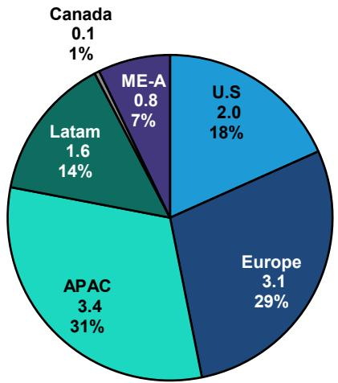

pie chart

| Region | Value | Percentage (%) |
| :--- | :--- | :--- |
| Canada | 0.1 | 1 |
| ME-A | 0.8 | 7 |
| U.S | 2.0 | 18 |
| Europe | 3.1 | 29 |
| APAC | 3.4 | 31 |
Latam | 1.6 | 14 |

Source: Nilson, WEO, World Bank, Mastercard Whitepaper (Cashless journey), Corporate reports and Bernstein estimates and analysis

## DIGITAL PAYMENTS PENETRATION VARY SIGNIFICANTLY BY COUNTRY

Digital payments (and cards) penetration vary significantly by country and payments are local and how people pay truly varies by country. Cards being one of the most popular payment methods, is often complemented with digital wallets, RTP networks, etc. depending on the country you look at.

EXHIBIT 11: Cash Usage varies widely by country; Mexico, Japan, Indonesia, Germany still have high amounts of cash..  
Cash as a % of POS Transaction Value (Top 15 GDP Countries, 2025)  
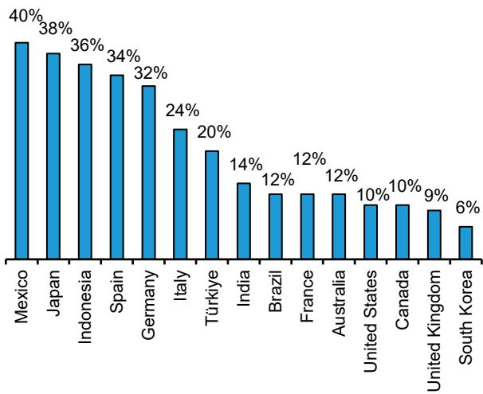

bar chart

| Country | Percentage (%) |
| :--- | :--- |
| Mexico | 40 |
| Japan | 38 |
| Indonesia | 36 |
| Spain | 34 |
| Germany | 32 |
| Italy | 24 |
| Türkiye | 20 |
| India | 14 |
| Brazil | 12 |
| France | 12 |
| Australia | 12 |
| United States | 10 |
| Canada | 10 |
| United Kingdom | 9 |
| South Korea | 6 |

Source: Global Payments Report, Bernstein analysis

EXHIBIT 12: Share of domestic schemes also varies widely by country..  
Share of Domestic Schemes within Overall Network (%, 2024)  
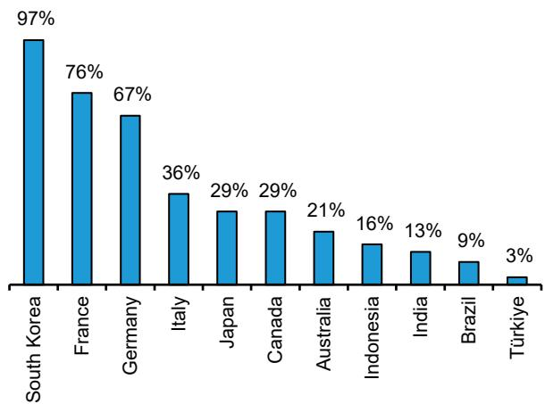

bar chart

| Country | Percentage (%) |
| :--- | :--- |
| South Korea | 97 |
| France | 76 |
| Germany | 67 |
| Italy | 36 |
| Japan | 29 |
| Canada | 29 |
| Australia | 21 |
| Indonesia | 16 |
| India | 13 |
| Brazil | 9 |
| Türkiye | 3 |

South Korea includes BC, Hana, Hyundai, KB Kookmin, Lotte,  
NH, Samsung, Shinhan, Woori; France includes Cartes Bancaires; Germany includes Girocard; Italy includes Poste Italiane, Bancomat; Japan includes JCB;

Canada includes Interac; Australia includes EFTPOS; Indonesia includes GPN;

India includes Rupay; Brazil includes Elo; Turkey includes Troy

Source: Global Payments Report, Bernstein analysis

EXHIBIT 13: How consumers 'pay' around the world  
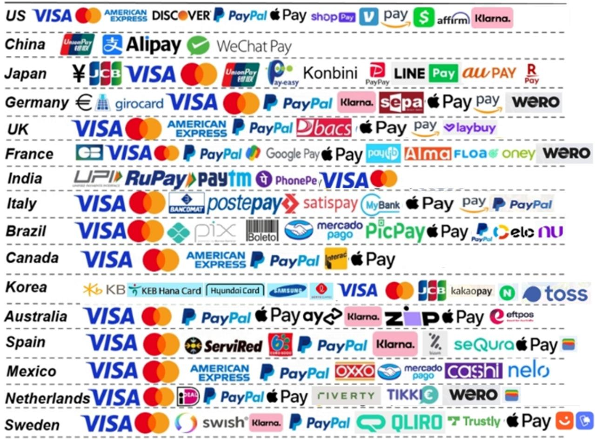  
Source: Global Payments Report, Company reports, Bernstein analysis

## HOW PENETRATED IS THE US (FOR CARDS)?

We estimate US ‘consumer’ card penetration at 74% by 2030. We scrub the numbers a fair bit. Our numerator includes US card volumes (reported by V, MA, AXP and DFS) plus Private Label and PIN debit, and minus Commercial Cards and Visa Direct. Our definition of addressable PCE = PCE — Imputed Rentals (essentially mortgages) — Healthcare (which is not out-of-pocket) — Certain Financial Services.

If, however, we use a more conservative definition of PCE (i.e. exclude rents, education and bill payments), we get to 83% card penetration. For the more ‘conservative’ PCE definition, we also deduct housing (actual rentals), education and utilities payments. Overall, we forecast \~5-6% US card volume growth between 2025-30— vs. \~6% from 2022-25 and \~13% from 2019-22 on lower penetration-driven growth.

Have US payments reached maturity? The US ‘consumer’ card payments market has matured, regardless of the definition we use for addressable PCE in order to assess the market. Between 2022-25, card penetration in the US has not grown, remaining somewhat stable at 72%. We are monitoring optionality driven by possible inflection in eCommerce from Agentic commerce and autonomous agent transactions as a growth driver for card payments but note that it's simply too early to bake anything into our numbers.

EXHIBIT 14: We estimate US ‘consumer’ card penetration at 72% in 2025  
US Card Penetration of C2B Addressable PCE  
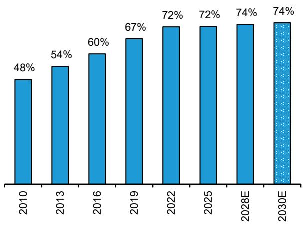

bar chart

| Year | Value (%) |
| :--- | :--- |
| 2010 | 48 |
| 2013 | 54 |
| 2016 | 60 |
| 2019 | 67 |
| 2022 | 72 |
| 2025 | 72 |
| 2028E | 74 |
| 2030E | 74 |

Our definition of addressable PCE (denominator) = PCE — Imputed Rentals (essentially mortgages) — Healthcare (which is not out-of-pocket) — Certain Financial Services.  
For the numerator, we include Private Label Debit, Prepaid and PIN Debit and exclude Commercial volumes + our estimate of Visa direct in the US
Source: Nilson, World Bank, IMF, Bernstein estimates and analysis

EXHIBIT 15: Card Penetration is higher at 83% using a more conservative definition of PCE  
US Card Penetration of C2B Addressable PCE (Conservative Definition)  
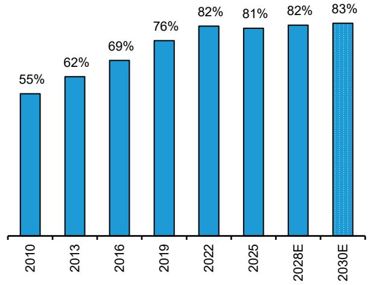

bar chart

| Year | Value (%) |
| :--- | :--- |
| 2010 | 55 |
| 2013 | 62 |
| 2016 | 69 |
| 2019 | 76 |
| 2022 | 82 |
| 2025 | 81 |
| 2028E | 82 |
| 2030E | 83 |

Starting from Addressable PCE, we further exclude rentals, utilities and education to arrive at Adj. Addressable PCE (denominator)  
For the numerator, we include Private Label Debit, Prepaid and PIN Debit and exclude Commercial volumes + our estimate of Visa direct in the US
Source: Nilson, World Bank, IMF, Bernstein estimates and analysis

EXHIBIT 16: US card volume growth has been at \~6% in the past 3 years; the growth mix has flipped with more of the growth coming from PCE growth (vs. card penetration increase historically)  
US Card Purchase Volume Growth Drivers (Nominal)  
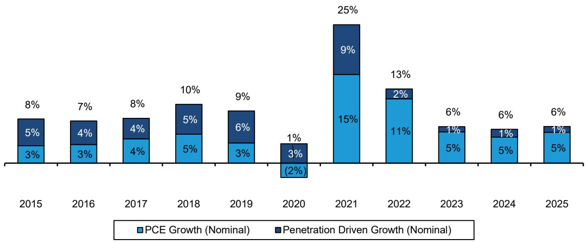

stacked bar chart

| Year | PCE Growth (Nominal) (%) | Penetration Driven Growth (Nominal) (%) |
| :--- | :--- | :--- |
| 2015 | 3 | 5 |
| 2016 | 3 | 4 |
| 2017 | 4 | 4 |
| 2018 | 5 | 5 |
| 2019 | 3 | 6 |
| 2020 | -2 | 3 |
| 2021 | 15 | 9 |
| 2022 | 11 | 2 |
| 2023 | 5 | 1 |
| 2024 | 5 | 1 |
| 2025 | 5 | 1 |

Source: Nilson, World Bank, IMF, Bernstein estimates and analysis

## EUROPE - A DEEPLY ATTRACTIVE MARKET FOR CARDS

With so much investor focus on the US and dynamics in EM (e.g., India and Brazil), card volume growth in continental Europe is often ignored. Europe (including UK) is \~25% of card volumes, grew mid-teens% cc CAGR between 2022-25. Ex-UK, the growth numbers are more impressive at \~20% between 2022-25. The 10 largest countries in continental Europe have >20% of the remaining cash/check opportunity globally. Overall card (including domestic schemes) penetration in top 10 countries in continental Europe (ex-UK) is \~60%, up from \~40s% in 2016. The networks are doing very well in Europe, not only with respect to digitizing cash, but in certain cases, taking share from domestic schemes. In that regard, places such as continental Europe are great markets for card networks — cash is being digitized due to accelerants such as contactless and eCommerce, and unlike India/Brazil, there aren't a ton of alternative ways to pay proliferating.

Things have changed in Europe post-pandemic (even in historically stubborn cash markets such as Germany) with a generational shift towards digital payments helped by growing contactless and eCommerce usage. Interchange caps have meant it is not expensive to accept cards. For e.g., Europe capped interchange fees at 20bps for debit and 30bps for credit in Dec 2015 - and since then card penetration has massively increased in the region (the pandemic-driven digitization also helped here). Visa Europe is no longer a not-for-profit and has drastically expanded its local presence and acceptance footprint in the continent. Fintechs have accelerated digitization and V/MA are often their partner of choice. Rising cross-border commerce has helped, since many local domestic schemes are not accepted across borders.

Card revenues are growing double digits even in markets with very high card penetrations such as the Nordics. Visa has continued to innovate in the region, and despite there being low levels of cash, has maintained its leadership in consumer payments, by partnering with digital wallets and deepening its presence in the region (Swish, Vipps) and crypto players as well as offering solutions for A2A Payments. As a result, Visa has not only managed to gain 7ppt share within card networks but has also grown overall revenue at \~15% CAGR between FY22-24 (with VAS CAGR growing 35%+ in the same time period).

Interestingly, the opportunity in Europe is not just related to cash/check. We estimate that domestic schemes drive \~\$1-2T of volumes across the top countries, and it appears that V/MA are gaining share in some instances from domestic schemes (Exhibit 20). For Mastercard, there is remaining opportunity to convert Maestro branded cards to Mastercard which is beneficial to both reported volumes and yields. See our work on Europe growth opportunity - Payments: Europe — the secular growth opportunity (March 2024)

A key risk to watch in the EU is nationalism including recent initiatives from EPI (e.g., Wero). More on this in future research.

EXHIBIT 17: From 25-30, we forecast \~10% nominal..  
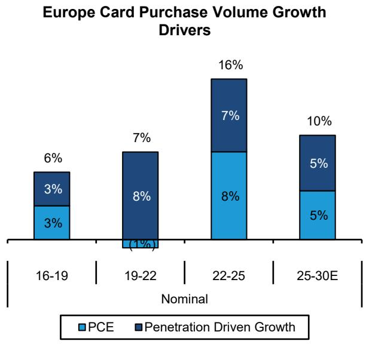

stacked bar chart

Europe Card Purchase Volume Growth Drivers
| Nominal | PCE (%) | Penetration Driven Growth (%) |
| :--- | :--- | :--- |
| 16-19 | 3 | 3 |
| 19-22 | -1 | 8 |
| 22-25 | 8 | 7 |
| 25-30E | 5 | 5 |
Nominal: Europe Card Purchase Volume Growth Drivers; PCE and Penetration Driven Growth; 16%: Europe Card Purchase Volume Growth Drivers; 25-30E: Europe Card Purchase Volume Growth Drivers; 19-22: Europe Card Purchase Volume Growth Drivers; 16-19: Europe Card Purchase Volume Growth Drivers; 25-30E: Europe Card Purchase Volume Growth Drivers

Source: Nilson, World Bank, IMF, Bernstein estimates and analysis

EXHIBIT 18: ..and \~11% cc volume growth in Europe  
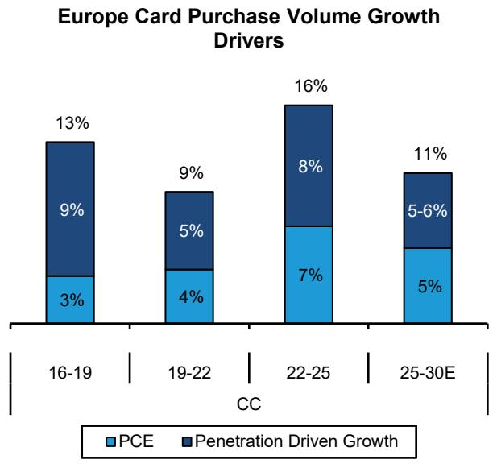

stacked bar chart

Europe Card Purchase Volume Growth Drivers
| Age Group | PCE (%) | Penetration Driven Growth (%) |
| :--- | :--- | :--- |
| 16-19 | 3 | 9 |
| 19-22 | 4 | 5 |
| 22-25 | 7 | 8 |
| 25-30E | 5 | 5-6 |
CC
16-19
19-22
22-25
25-30E

Source: Nilson, World Bank, IMF, Bernstein estimates and analysis

EXHIBIT 19: In EU, there is still heavy cash usage in many countries  
EU: Share of Payment Instruments by Value of Payments (2024)  
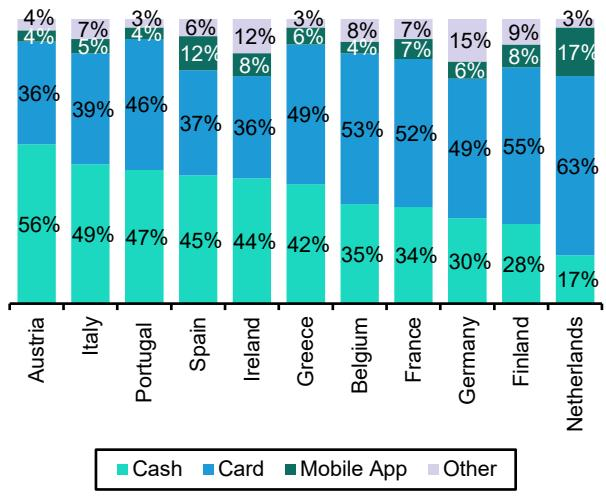

stacked bar chart

| Country | Cash (%) | Card (%) | Mobile App (%) | Other (%) |
| :--- | :--- | :--- | :--- | :--- |
| Austria | 56 | 36 | 4 | 4 |
| Italy | 49 | 39 | 5 | 7 |
| Portugal | 47 | 46 | 4 | 3 |
| Spain | 45 | 37 | 12 | 6 |
| Ireland | 44 | 36 | 8 | 12 |
| Greece | 42 | 49 | 6 | 3 |
| Belgium | 35 | 53 | 4 | 8 |
| France | 34 | 52 | 7 | 7 |
| Germany | 30 | 49 | 6 | 15 |
| Finland | 28 | 55 | 8 | 9 |
| Netherlands | 17 | 63 | 17 | 3 |

Source: ECB SPACE Study 2024, Bernstein analysis

EXHIBIT 20: Domestic schemes in select countries seem to be losing some share.. especially in Germany and France  
Market Share for Domestic Schemes in select EU countries (%, Mix)  
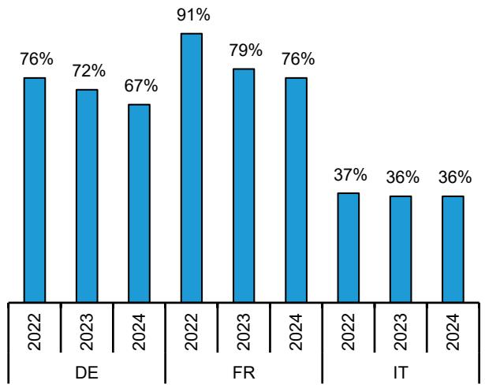

bar chart

| Category | Year | Value (%) |
| :--- | :--- | :--- |
| DE | 2022 | 76 |
| DE | 2023 | 72 |
| DE | 2024 | 67 |
| FR | 2022 | 91 |
| FR | 2023 | 79 |
| FR | 2024 | 76 |
| IT | 2022 | 37 |
| IT | 2023 | 36 |
| IT | 2024 | 36 |

Source: Global Payments Report, Bernstein analysis

EXHIBIT 21: Even in mature markets such as the Nordics, Visa's overall net revenue grew \~15% cc CAGR and 35% CAGR cc for CMS + VAS (2022-24)  
Visa in Continental Europe and the Nordics (Revenue Growth, %)  
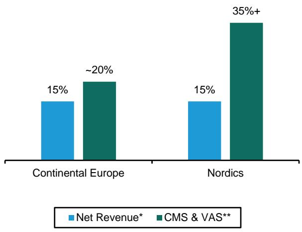

bar chart

| Region | Net Revenue* (%) | CMS & VAS** (%) |
| :--- | :--- | :--- |
| Continental Europe | 15 | ~20 |
| Nordics | 15 | 35+ |

\*Net Revenue growth for Continental Europe is YoY and Nordics is is CAGR 22-24

EXHIBIT 22: Between CY20-23, Visa gained 7ppt share in the Nordics. Similarly in 2024, Visa has gained \~6ppt market share vs. all card players in Continental Europe  
Visa in Continental Europe and the Nordics (Share gains vs Domestic Schemes, %)  
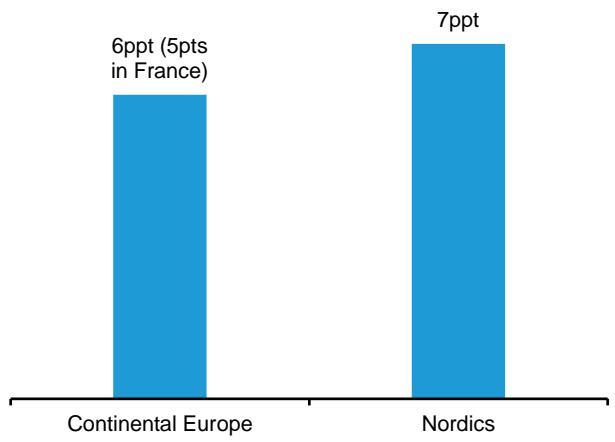

bar chart

| Region | Value |
| :--- | :--- |
| Continental Europe | 6ppt (5pts in France) |
| Nordics | 7ppt |

Source: Company reports, Bernstein analysis  
\*\*In Continental EU, growth for both CMS and VAS was \~20% CAGR between FY22-24, in the Nordics VAS CAGR was 35%+ CAGR between FY22-24. Source: Company reports, Bernstein analysis

## APAC - BATTLEGROUND REGION WITH MULTIPLE COUNTRY DYNAMICS

We are closely watching dynamics in Asia where card volume growth has been anemic due to various country-level dynamics for e.g., loss of co-badged volumes in mainland China (and negatively impacting V/MA's Asia growth numbers), poor performance of debit in India/Indonesia (where credit is currently growing DD% and represents the majority of the card spend) and digital payments' maturity in other markets such as Australia and South Korea (which has historically been dominated by domestic schemes). That said, there are developed economies such as Japan, where cash still makes up \~35-40% of overall (eComm +POS spend) today and has been a good market for cards.

That said, if we look at card penetration in the region, while penetration incl. V/MA china volumes has somewhat decelerated over the years, we note that penetration excl. V/MA China volumes continues to grow modestly (Exhibit 24).

Asia also offers partnerships with local wallets which are looking for card-based monetization models and cross-border acceptance. In 2025, MA announced a new partnership with Alipay in Hong Kong and GCash to enable 36 local e-wallets to extend their use cross-border through the international Alipay+ Wallet Gateway (private). Visa has also had partnerships with local wallets in Asia. We closely watch these partnerships especially in the context of the size of these wallets in domestic markets and the fact that V/MA often don't participate in these wallet transactions, and they bring highly lucrative cross-border transactions. Digital wallets have been an area where V/MA have had good success in converting potential frenemies (e.g., digital wallets) into friends.

## A note on China:

Mastercard now has a domestic processing license in mainland China (as part of a JV). We had historically believed that the ship may have sailed on the domestic China opportunity. Instead, we note some optionality now that the dynamics within the China market are changing with regulators starting to balance out the market between bank cards and digital wallets. It is also now permissible to have a card proposition that can be used domestically and in cross-border.

Since Mastercard has the domestic processing license (as part of a JV), it is the only party that can provide a single-use card which gives Mastercard the ability to compete (we believe it is likely in affluent centric portfolios where cross-border acceptance is a desired feature). The company is following a two-pronged approach while increasing investments in the region, by 1) Rolling out domestic switching capabilities (making it widely accepted, enabling reliable and consistent user experience for both domestic and international transactions; partnerships with ICBC, Agricultural Bank of China, and China Merchants Bank) and 2) Expanding Mastercard Move in the country (17B endpoints; partnerships with WeChat Pay, AliPay). Mastercard is working on the ground to get issuance and acceptance network which the government also wants (e.g., to have payment options for tourists). Although the mainland China opportunity could eventually be interesting, we note that it could be a multi-year process (regulatory and geopolitical risks permitting) to build a domestic processing business in China.

EXHIBIT 23: APAC is a battleground region - where volume growth has been weak driven by unique dynamics in mainland China and some other local market nuances  
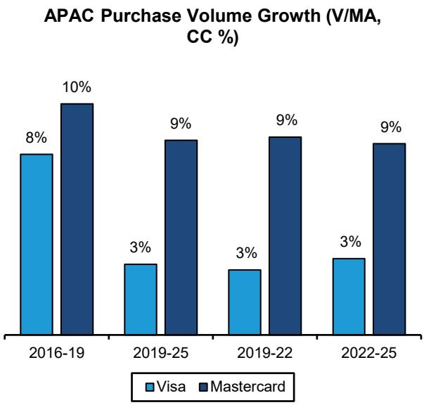

bar chart

APAC Purchase Volume Growth (V/MA, CC %)
| Period | Visa (%) | Mastercard (%) |
| :--- | :--- | :--- |
| 2016-19 | 8 | 10 |
| 2019-25 | 3 | 9 |
| 2019-22 | 3 | 9 |
| 2022-25 | 3 | 9 |

We use calendar years for Visa, and APMEA volumes for Mastercard Source: Company reports, Bernstein analysis

EXHIBIT 25: APAC volumes ex-V/MA in China have been growing faster vs overall volumes..  
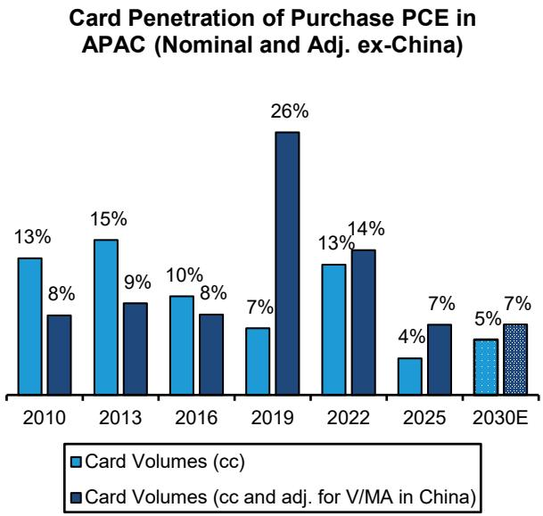

bar chart

Card Penetration of Purchase PCE in APAC (Nominal and Adj. ex-China)
| Year | Card Volumes (cc) (%) | Card Volumes (cc and adj. for V/MA in China) (%) |
| :--- | :--- | :--- |
| 2010 | 13 | 8 |
| 2013 | 15 | 9 |
| 2016 | 10 | 8 |
| 2019 | 7 | 26 |
| 2022 | 13 | 14 |
| 2025 | 4 | 7 |
| 2030E | 5 | 7 |

Source: Nilson, WEO, Company reports, Bernstein estimates and analysis

EXHIBIT 24: While overall card penetration has been declining in the region, ex-V/MA volumes in China, card penetration has been growing modestly..  
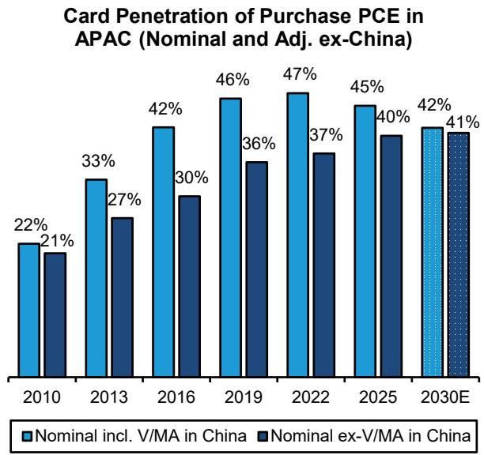

bar chart

Card Penetration of Purchase PCE in APAC (Nominal and Adj. ex-China)
| Year | Nominal incl. V/MA in China (%) | Nominal ex-V/MA in China (%) |
| :--- | :--- | :--- |
| 2010 | 22 | 21 |
| 2013 | 33 | 27 |
| 2016 | 42 | 30 |
| 2019 | 46 | 36 |
| 2022 | 47 | 37 |
| 2025 | 45 | 40 |
| 2030E | 42 | 41 |

Source: Nilson, WEO, Company reports, Bernstein estimates and analysis

EXHIBIT 26: Our rough estimate of card volumes by market in Asia  
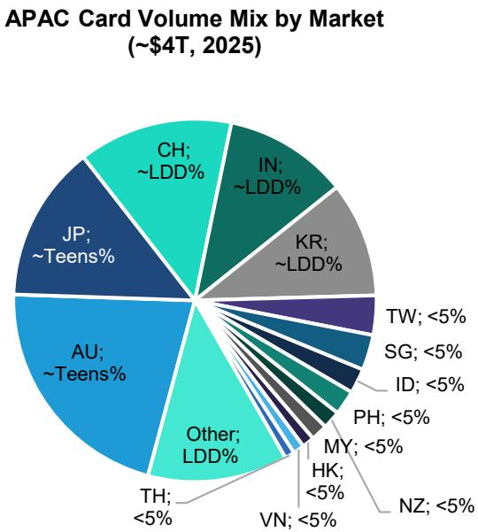

pie chart

APAC Card Volume Mix by Market (~$4T, 2025)
| Company | Market Share (%) |
| :--- | :--- |
| JP; ~Teens | ~38 |
| CH; ~LDD | ~35 |
| IN; ~LDD | ~30 |
| KR; ~LDD | ~25 |
| TW; <5 | ~10 |
| SG; <5 | ~10 |
| ID; <5 | ~10 |
| PH; <5 | ~10 |
| MY; <5 | ~10 |
| HK; <5 | ~10 |
| VN; <5 | ~10 |
| NZ; <5 | ~10 |
| Other; LDD | ~25 |
| TH; <5 | ~10 |
| AU; ~Teens | ~40 |
| JP; ~Teens | ~35 |

Numbers included in the exhibit are from a combination of sources i.e. Central Bank Data + Worldpay Global Payments Report. In some cases, Central Bank data may not include cards within digital wallets.  
For POS + eComm 2025 numbers, we use Global Payments Report 2024 data and grow it by 2025-30 CAGR from Global Payments Report 2025 Source: Central Bank data, Global Payments Report, Bernstein analysis

EXHIBIT 27: While debit cards are performing poorly in places such as India and Indonesia, credit cards growth has been strong  
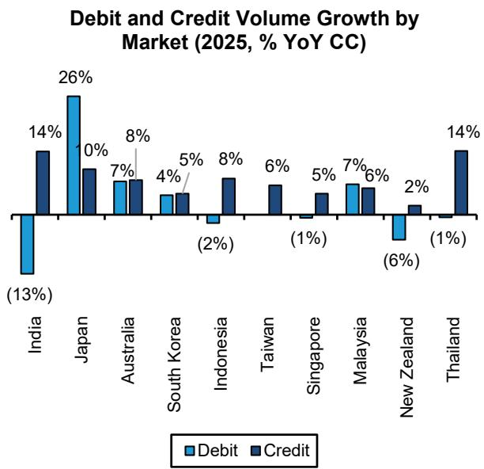

bar chart

Debit and Credit Volume Growth by Market (2025, % YoY CC)
| Market | Debit (%) | Credit (%) |
| :--- | :--- | :--- |
| India | -13 | 14 |
| Japan | 26 | 10 |
| Australia | 7 | 8 |
| South Korea | 4 | 5 |
| Indonesia | -2 | 8 |
| Taiwan | 0 | 6 |
| Singapore | -1 | 5 |
| Malaysia | 7 | 6 |
| New Zealand | -6 | 2 |
| Thailand | -1 | 14 |

Source: Central Bank Data, Bernstein analysis

EXHIBIT 28: In places such as India, credit cards account for the vast majority of volumes  
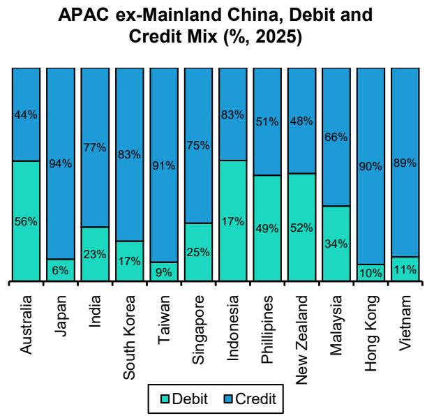

stacked bar chart

APAC ex-Mainland China, Debit and Credit Mix (% , 2025)
| Country | Debit (%) | Credit (%) |
| :--- | :--- | :--- |
| Australia | 56 | 44 |
| Japan | 6 | 94 |
| India | 23 | 77 |
| South Korea | 17 | 83 |
| Taiwan | 9 | 91 |
| Singapore | 25 | 75 |
| Indonesia | 17 | 83 |
| Philippines | 49 | 51 |
| New Zealand | 52 | 48 |
| Malaysia | 34 | 66 |
| Hong Kong | 10 | 90 |
| Vietnam | 11 | 89 |

Debit and Credit volumes include cards within digital wallets. Share of cards within wallets are estimated based on survey data in the WP Global Payments Report 2025  
We exclude volumes from Domestic Schemes based on network market shares from the Worldpay Global Payments Report.  
For Australia, we exclude EFTPOS volumes from Debit Volumes  
For Japan, Korea, we exclude domestic scheme volumes from Debit and Credit volumes  
For India, we exclude Rupay volumes from both Debit (assume 80% share) and Credit volumes (20% share)  
For Indonesia, Taiwan, Thailand, Singapore, Hong Kong, Malaysia, Philippines, Vietnam, New Zealand, we exclude domestic schemes from Debit volumes
Source: Worldpay Global Payments Report, Bernstein analysis

## WE FORECAST 9% TRANSACTION GROWTH BETWEEN 2025-30

We forecast a stronger growth in the number of transactions at 9% growth globally between 2025-30E vs. a similar 10% in both 2019-22 and 2022-25. Card penetration is lower (and hence opportunity is greater) when assessed as a % of number of transactions (as opposed to transaction value). V/MA derive >1/3rd of their gross revenue from # of transactions, which tend to grow faster than \$ volumes. Transactions are growing faster vs purchase volume growth (Exhibit 31).

This is an important point, as processed transactions play a pivotal role in contributing to revenues for the networks. As can be seen in Exhibit 30, data processing, which derives revenue on a per-transaction basis, made up 36% of Visa revenues in FY25. Further, token penetration is also growing (and will likely further grow with agentic) - and provides opportunity (including pricing) for token related value-added services. Today, \~54% of Visa's e-commerce transactions are tokenized and 100% of Agentic transactions will be tokenized.

Processing penetration gains also drive incremental switched transaction growth. For e.g., Mastercard's switching penetration is now $>70\%$ (vs $60\%$ in 2020). In addition to driving direct revenue, switched transactions also generate richer data that enables higher-margin services (fraud, analytics, loyalty) to be layered on top of the transaction, generating a flywheel effect or more switching leading to more data and services.

EXHIBIT 29: We forecast \~9% global transactions growth, with 7% in the US, \~11% in Europe, \~7% in APAC, \~13% in LATAM, \~5% in Canada and \~15% in MEA between 2025-30E  
General Purpose Card Transactions Growth Growth by Region (ex. China)  
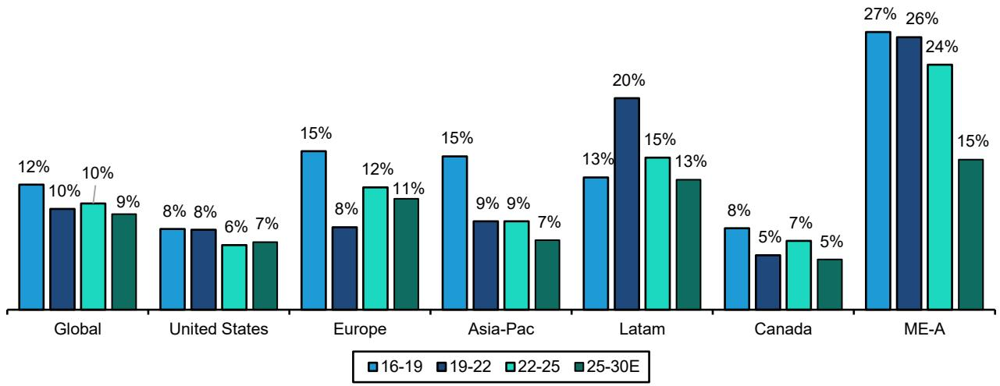

bar chart

| Region | 16-19 (%) | 19-22 (%) | 22-25 (%) | 25-30E (%) |
| :--- | :--- | :--- | :--- | :--- |
| Global | 12 | 10 | 10 | 9 |
| United States | 8 | 8 | 6 | 7 |
| Europe | 15 | 8 | 12 | 11 |
| Asia-Pac | 15 | 9 | 9 | 7 |
| Latam | 13 | 20 | 15 | 13 |
| Canada | 8 | 5 | 7 | 5 |
| ME-A | 27 | 26 | 24 | 15 |

Nilson, World Bank, IMF, Bernstein estimates and analysis

EXHIBIT 30: Transactions growth also matters along with \$ volume growth.. >1/3rd of Visa's gross revenues is assessed on a per transaction basis  
Visa Gross Revenue Split FY25 (%)  
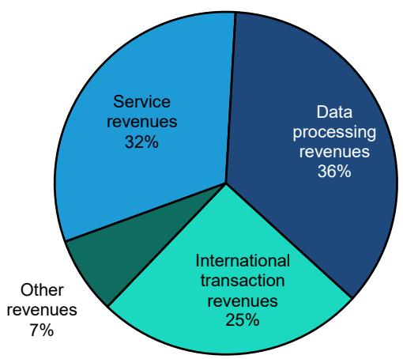

pie chart

| Category | Percentage (%) |
| :--- | :--- |
| Data processing revenues | 36 |
| International transaction revenues | 25 |
| Service revenues | 32 |
| Other revenues | 7 |

Source: Company reports, Bernstein analysis

EXHIBIT 31: Processed transactions have historically grown faster vs. volumes  
V/MA Processed Transactions and Payment Volume Growth (% CAGR)  
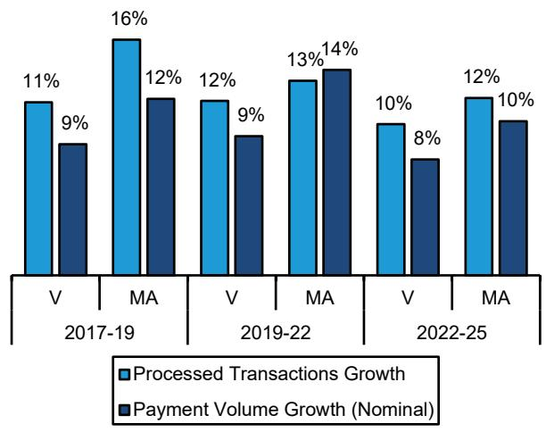

bar chart

| Period | Category | Processed Transactions Growth (%) | Payment Volume Growth (Nominal) (%) |
| :--- | :--- | :--- | :--- |
| 2017-19 | V | 11 | 9 |
| 2017-19 | MA | 16 | 12 |
| 2019-22 | V | 12 | 9 |
| 2019-22 | MA | 13 | 14 |
| 2022-25 | V | 10 | 8 |
| 2022-25 | MA | 12 | 10 |

We use calendar year for Visa  
We compare 2019-25 to 2017-19 because of Visa Europe dynamics
Source: Company reports, Bernstein analysis

## ALTERNATIVE WAYS TO PAY - RISKS ARE MANAGEABLE

## ACCOUNT-TO-ACCOUNT PAYMENTS – EXISTENTIAL RISK OR OVERBLOWN CONCERNS?

\- We continue to closely watch substitution risks from account-to-account (A2A) payments. On the surface, India and Brazil have offered powerful case studies on the potential for account-to-account or bank payments. However, India debit market, for all the focus on this, is hardly material for the card volumes. Credit cards payments in both India

and Brazil are growing at HSD/double-digit rates — debit usage, however, is shrinking in India and growth is also now anemic in Brazil.

- The real question is whether A2A payments can take share from card payments in key developed markets. Against that context, we are closely watching the evolution of pay by bank services in the U.S. and Europe. We are watching merchant adoption for real-time payments, which has been lacking in the U.S. and Europe. We are especially monitoring recurring payments verticals such as bill pay.  
- Taking a step back, the much-feared A2A and alternative ways to pay currently represents HSD-Low-teens% of consumer-to-business payments globally. Alternative ways to pay are not new and are less of an issue — Visa and Mastercard have co-existed with domestic schemes globally for decades. While account-to-account is a risk to watch, even in markets where A2A payments have had success (e.g., India, Brazil), credit card volumes are growing HSD/LDD%. A2A payments are a risk to debit, not credit card payments. We believe A2A limits the TAM but doesn't pose existential risks (as feared by many investors) to current volumes. In incumbent markets (e.g. US), risks from A2A are relatively contained and more around specific types of payments (e.g., bill payments, wallet funding, etc.). These categories represent a small portion of card payments. A great example is the UK, which has had RTP live for almost 15 years. In fact, after Mastercard's acquisition of Vocalink in the UK, it launched Pay-by-bank solutions in the country. Impact on Mastercard's debit volumes was minimal. The Pay-by-bank solution in the UK has hardly had traction. This is because there are still many challenges with respect to wider acceptance of A2A payments in V/ MA's core markets — especially with regard to lack of a compelling value proposition for consumers, merchants, and issuers.

EXHIBIT 32: Among the top 20 GDP countries, digital payments penetration varies widely..  
Card and Other Digital Payment Method Penetration by Market (2025)  
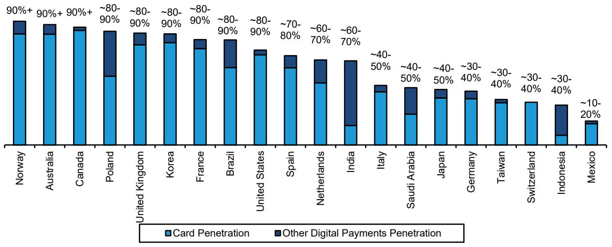

stacked bar chart

| Country | Card Penetration (%) | Other Digital Payments Penetration (%) |
| :--- | :--- | :--- |
| Norway | ~90+ | ~2 |
| Australia | ~90%+ | ~2 |
| Canada | ~90%+ | ~1 |
| Poland | ~80-90% | ~4 |
| United Kingdom | ~80-90% | ~2 |
| Korea | ~80-90% | ~2 |
| France | ~80-90% | ~2 |
| Brazil | ~80-90% | ~3 |
| United States | ~80-90% | ~1 |
| Spain | ~70-80% | ~2 |
| Netherlands | ~60-70% | ~3 |
| India | ~60-70% | ~5 |
| Italy | ~40-50% | ~1 |
| Saudi Arabia | ~40-50% | ~3 |
| Japan | ~40-50% | ~1 |
| Germany | ~30-40% | ~1 |
| Taiwan | ~30-40% | ~1 |
| Switzerland | ~30-40% | 0 |
| Indonesia | ~30-40% | ~3 |
| Mexico | ~10-20% | 1 |

Ranked by respective market's overall digital payments penetration (card + other)  
Source: Central Banks, Worldpay Global Payments Reports, IMF, Mastercard, Visa, Bernstein estimates and analysis

EXHIBIT 33: Alternative ways-to-pay drive HSD-LDD% of C2B payments globally and have had successes in places such as India and Brazil  
Other Payments Penetration (%)  
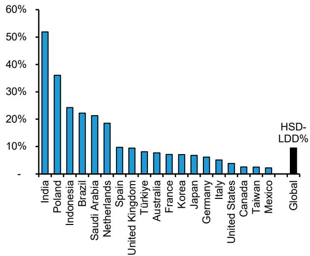

bar chart

| Country        | Percentage |
| -------------- | ---------- |
| India          | 52%        |
| Poland         | 36%        |
| Indonesia      | 24%        |
| Brazil         | 22%        |
| Saudi Arabia   | 21%        |
| Netherlands    | 19%        |
| Spain          | 10%        |
| United Kingdom | 9%         |
| Türkiye        | 8%         |
| Australia      | 8%         |
| France         | 7%         |
| Korea          | 7%         |
| Japan          | 7%         |
| Germany        | 6%         |
| Italy          | 5%         |
| United States  | 4%         |
| Canada         | 3%         |
| Taiwan         | 3%         |
| Mexico         | 2%         |
| Global         | 10%        |

EXHIBIT 34: Alternative ways-to-pay are not new, domestic schemes (often co-badged with V/ MA) already drive 20s% of global card volumes

Domestic/Other Schemes Card Penetration (of C2B Payments) by market  
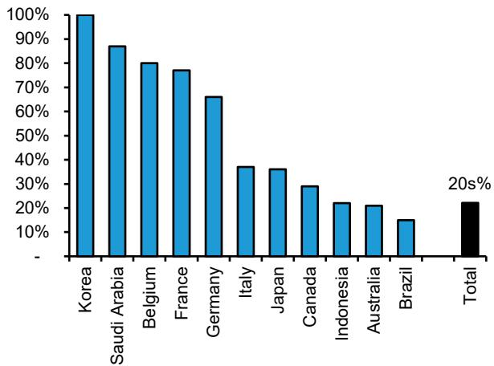

bar chart

| Country | Percentage (%) |
| :--- | :--- |
| Korea | 100 |
| Saudi Arabia | 87 |
| Belgium | 80 |
| France | 78 |
| Germany | 66 |
| Italy | 37 |
| Japan | 36 |
| Canada | 29 |
| Indonesia | 22 |
| Australia | 21 |
| Brazil | 15 |
| Total | 20 |

Ranked by respective market's overall digital payments penetration (card + other)
Source: Central Banks, Worldpay Global Payments Reports, IMF, Mastercard, Visa, Bernstein estimates and analysis  
Source: Central Banks, Worldpay Global Payments Reports, IMF, Mastercard, Visa, Bernstein estimates and analysis

EXHIBIT 35: Even in countries where A2A payments have had success (e.g., India, Brazil), card volumes are still growing driven by credit  

Value of Transactions
A2A vs Total Cards (\$B and Growth in CC)  
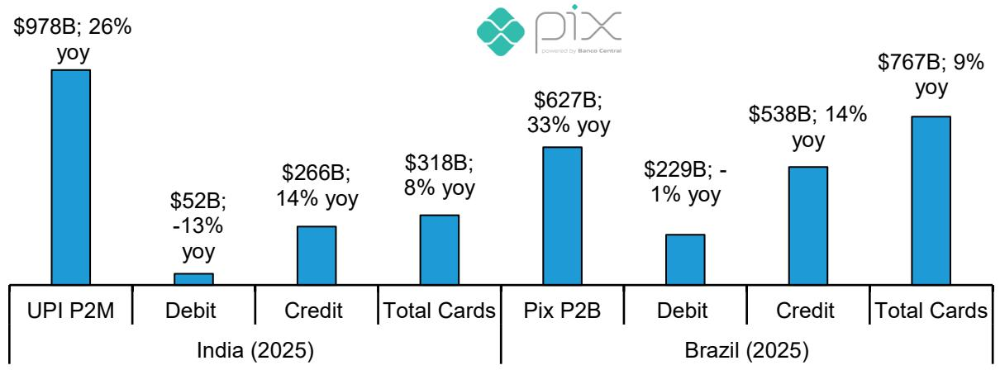

bar chart

| Country   | Category     | Value     | yoy    |
| --------- | ------------ | --------- | ------ |
| India (2025) | UPI P2M      | $978B     | 26%    |
| India (2025) | Debit        | $52B      | -13%   |
| India (2025) | Credit       | $266B     | 14%    |
| India (2025) | Total Cards  | $318B     | 8%     |
| Brazil (2025) | Pix P2B      | $627B     | 33%    |
| Brazil (2025) | Debit        | $229B     | -1%    |
| Brazil (2025) | Credit       | $538B     | 14%    |
| Brazil (2025) | Total Cards  | $767B     | 9%     |

Source: Reserve Bank of India, NPCI, Central Bank of Brazil, Bernstein analysis

## STABLECOINS: SOLUTION LOOKING FOR A PROBLEM IN RETAIL CONSUMER PAYMENTS

In retail C2B payments, stablecoins remain a solution looking for a problem (for the foreseeable future) in most developed markets. We haven't seen any evidence of C2B consumer payments activity happening on stablecoins in developed markets or in EM (at scale). There is the chicken-and-egg problem of building a merchant and consumer network. Debit is already regulated (& cheaper vs. credit). Cheaper rails already exist (but barely used for retail payments) e.g., ACH and RTP solutions. In a world where conversion is still a problem, we wonder to what extent merchants would want to steer customers at the point of checkout. Offline is way harder than online. Remember, money movement (provided by different rails including stablecoins) is often a commodity, trust/governance (provided by cards) is NOT. Anyone (including payment companies) can use stablecoins for faster settlement.

## Ironically, the best and one of the fastest consumer payments use-case of stablecoins is stablecoin-linked cards.

Cards often provide monetization models for many fintechs including crypto firms. Cards' value proposition (vs. other payment methods) is stronger in agentic commerce where trust becomes even more important.

Retail cross-border payments (ones addressed by cards) also remain hard to disrupt given lack of consumer friction and challenges in changing consumer behavior and acceptance infrastructure. Also, cross-border retail payments often happen in local currencies and the bulk of the fees are in the FX conversion — which dollar-denominated stablecoins also require. The challenges in off/on ramps likely drives more usage of ‘stablecoin’ linked cards or card infrastructure as an off-ramp for stablecoins.

Stablecoins, however, have stronger product market fit in cross-border settlement, less liquid remittance/payout corridors, cross-border B2B and treasury/cash management. All of this will take years to play out, but we are seeing increased activity, especially in markets where there is greater desirability around owning U.S. dollars (98% of stablecoins are U.S. dollar denominated).

Stablecoins may have also greater utility in the internet native agent-to-agent micro-payments (e.g., agents paying for data access, APIs). However, the space is currently very nascent (<\$50m in cumulative volumes). Finally, anyone who thinks stablecoins can somehow do micro-transactions and V/MA cannot do so, doesn't fully understand V/MA's business model (and how incentives and pricing work). Visa and Mastercard can batch-settle transactions, and can configure pricing and create commercial frameworks to make these transactions work. We further addressed the micro-payments topic in the Agentic Commerce section below.

Taking a step back, stablecoins offer payment companies new opportunities to make money (and NOT lose volumes), and strategically enhance their networks (e.g., through faster settlement, fiat/stablecoin conversion capabilities). There is a greater opportunity for new flows in lucrative cross-border payments. Visa and Mastercard have $>150$ stablecoin/crypto linked card programs. Both networks are likely monetizing stablecoins today. We are closely watching Mastercard's BVNK acquisition and the potential for greater role in orchestration and on/off ramps. It will also be interesting to see what PayPal can do with PYUSD.

See our detailed note:

\- Payments: Stablecoins — What we learned from our dozens of industry conversations; Slide deck (May 2026)

• Stablecoins — are they a big deal? (June 2025)

## VAS EXTEND THE GROWTH RUNWAY; NEW FLOWS PROVIDE OPTIONALITY (MORE ON THIS IN FUTURE RESEARCH)

As shown in Exhibit 36, VAS and New Flows together represent \~40% of Visa's and \~50% of Mastercard's revenues as of calendar year 2025, with both segments compounding at 1.5-2x the core consumer growth rate and increasingly driving the growth algorithm. We expect this mix shift to extend through 2030E: Visa's VAS scales from \~28% to mid-30% of revenue with New Flows reaching 15-20%, and Mastercard's VAS expands from 41% of revenue as of 2025 to mid-40s% by 2030E. As core consumer growth normalizes toward 5-7% yoy, these higher-growth verticals should sustain group revenue growth in the LDD % range, preserving the networks' growth algorithm into the back half of the decade.

We believe new payment flows, value-added services and software will continue to expand the payments TAM meaningfully. While estimates and underlying economics vary on new flows and services, the opportunity is significant and could more than quintuple the TAM for digital payments alone. New Flows and value-added services will be critical for the networks as card growth slows as card penetration reaches 70%+. We will follow up with a more detailed note on this topic at a later date.

EXHIBIT 36: Value-added services and new flows, which are \~40/\~50% of V/MA's revenues and growing 1.5-2x the rate of core growth, will be incremental to growth. VAS and new flows can sustain MA's revenue growth in the LDD range even in 5 years as card volume growth incrementally matures  

stacked bar chart

| 2025 Visa | Core Consumer: ~60-70% | ~50 | 28 | ~15 |
| --- | --- | --- | --- | --- |
| 2030 Visa | Core Consumer: ~50% | ~50 | 30 | ~16-18 |
| 2025 Mastercard | Core Consumer: ~50% | ~50 | 41 | ~LDD |
| 2030 Mastercard | Core Consumer: ~40-50% | ~50 | 40 | ~LDD |
| 2025 Visa (LDD% Rev Growth) | VAS: ~15% YoY | ~70 | 28 | ~15 |
| 2030 Visa (LDD% Rev Growth) | VAS: ~25% YoY | ~70 | 28 | ~15 |
| 2025 Visa (LDD% Rev Growth) | Commercial & New Flows: Mid-30s% | ~50 | 30 | ~16-18 |
| 2030 Visa (LDD% Rev Growth) | Commercial & New Flows: Mid-15s% | ~50 | 30 | ~16-18 |
| 2025 Visa (LDD% Rev Growth) | Commercial & New Flows: Mid-teens% | ~50 | 41 | ~LDD |
| 2030 Visa (LDD% Rev Growth) | Commercial & New Flows: Mid-teens% | ~50 | 41 | ~LDD |
| 2025 Visa (LDD% Rev Growth) | Commercial & New Flows: Mid-teens% (LDD%) | ~50 | 41 | ~LDD |
| 2030 Visa (LDD% Rev Growth) | Commercial & New Flows: Mid-teens% (LDD%) | ~50 | 41 | ~LDD |

On Calendar Year  
Source: Company reports, Bernstein estimates and analysis

EXHIBIT 37: Value-added services make up \~40% of Mastercard's and \~30% of Visa's net revenue  
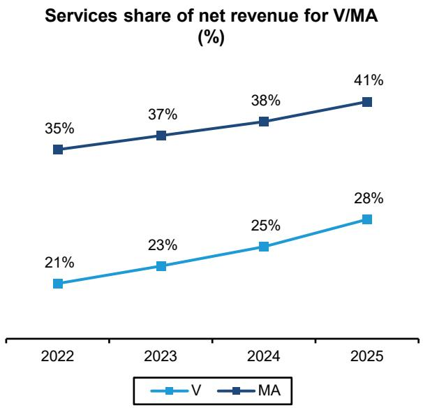

line chart

Services share of net revenue for V/MA (%)
| Year | V (%) | MA (%) |
| :--- | :--- | :--- |
| 2022 | 21 | 35 |
| 2023 | 23 | 37 |
| 2024 | 25 | 38 |
| 2025 | 28 | 41 |

Visa using calendar year  
Source: Company reports, Bernstein estimates and analysis

EXHIBIT 38: Value-Added Services grew 25% for Visa and 21% for Mastercard in CY25  
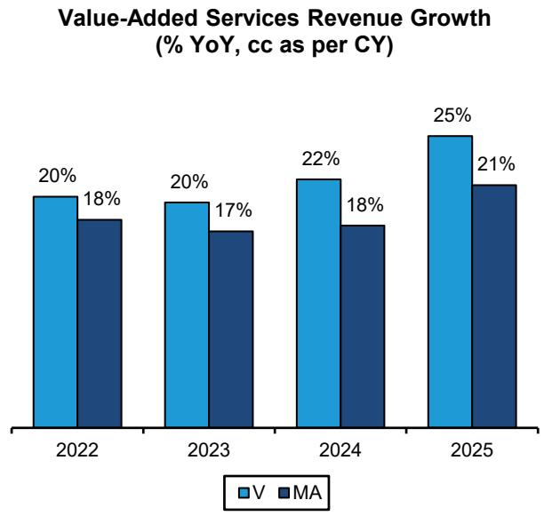

bar chart

Value-Added Services Revenue Growth (% YoY, cc as per CY)
| Year | V (%) | MA (%) |
| :--- | :--- | :--- |
| 2022 | 20 | 18 |
| 2023 | 20 | 17 |
| 2024 | 22 | 18 |
| 2025 | 25 | 21 |

Source: Company reports, Bernstein analysis

EXHIBIT 39: \~65% if Visa and \~60% of Mastercard's VAS is network-linked; transactions are the primary driver of these services  
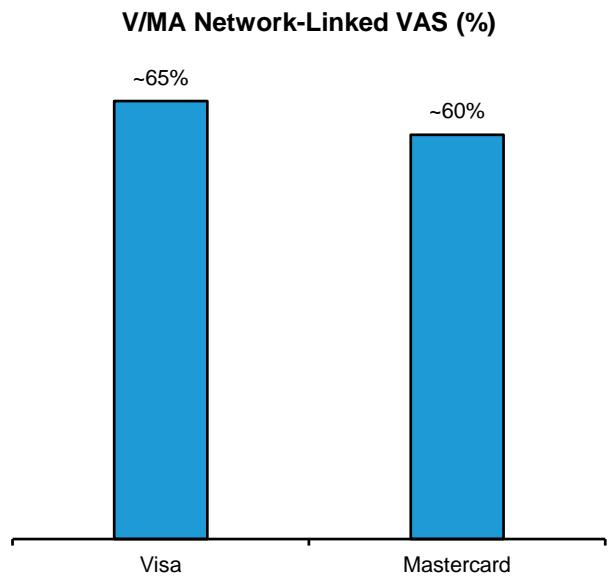

bar chart

V/MA Network-Linked VAS (%)
| Provider | V/MA Network-Linked VAS (%) |
| :--- | :--- |
| Visa | ~65 |
| Mastercard | ~60 |

Source: Company reports, Bernstein analysis

EXHIBIT 40: During its Investor Day, Visa broke down different components and sized the revenue TAM for Value-Added Services at \$520B  
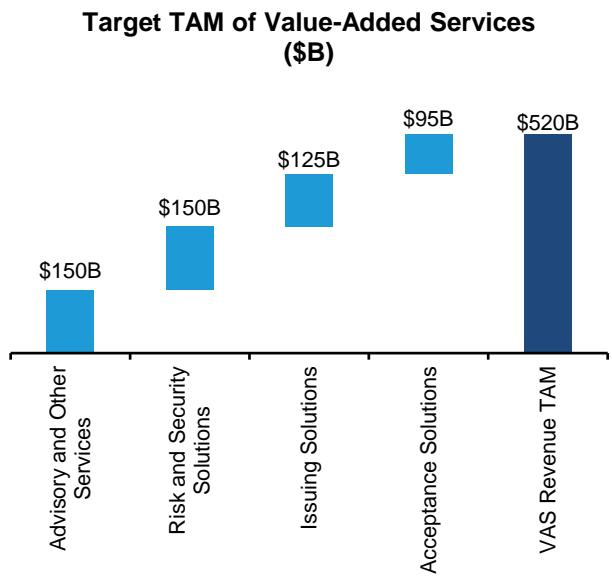

bar chart

Target TAM of Value-Added Services ($B)
| Category | Target TAM ($B) |
| :--- | :--- |
| Advisory and Other Services | 150 |
| Risk and Security Solutions | 150 |
| Issuing Solutions | 125 |
| Acceptance Solutions | 95 |
| VAS Revenue TAM | 520 |

Source: Company reports, Bernstein analysis

EXHIBIT 41: Mastercard also provided a similar TAM sizing on Services Revenue at \$490B, with \$165B in SAM  
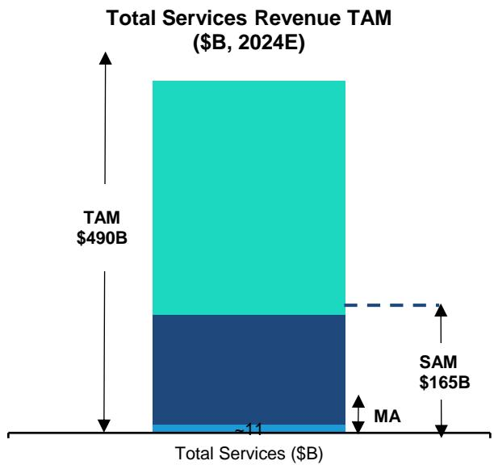

stacked bar chart

Total Services Revenue TAM ($B, 2024E)
| Company | Total Services Revenue ($B) |
| :--- | :--- |
| TAM | 490 |
| SAM | 165 |
| MA | <11 |

Source: Investor Day Presentation, Bernstein analysis

EXHIBIT 42: New flows revenues is likely growing faster vs. the core. Note: Visa numbers are for calendar year  
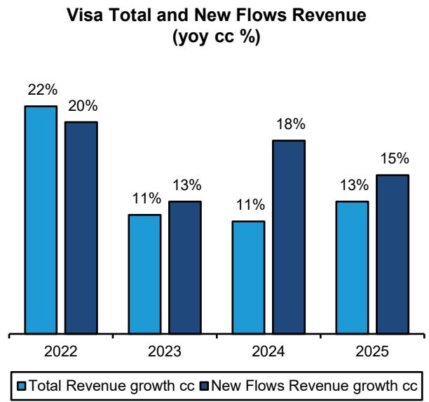

bar chart

Visa Total and New Flows Revenue (yoy cc %)
| Year | Total Revenue growth cc (%) | New Flows Revenue growth cc (%) |
| :--- | :--- | :--- |
| 2022 | 22 | 20 |
| 2023 | 11 | 13 |
| 2024 | 11 | 18 |
| 2025 | 13 | 15 |

Visa using calendar year  
Source: Company reports, Bernstein estimates and analysis

EXHIBIT 43: Growth of value-added services is one of the reasons why V and MA have sustained DD revenue growth outpacing the volume growth in recent years.

Note: 2025 revenue growth likely benefited 1-2ppt from FX vol

Overall Revenue (Organic CC) vs Volume Growth (CC, as per calendar years)  
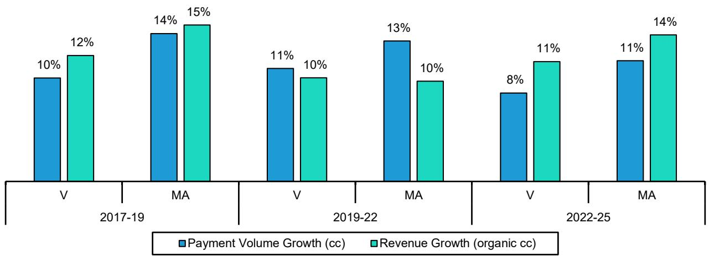

bar chart

| Period | Category | Payment Volume Growth (cc) (%) | Revenue Growth (organic cc) (%) |
| :--- | :--- | :--- | :--- |
| 2017-19 | V | 10 | 12 |
| 2017-19 | MA | 14 | 15 |
| 2019-22 | V | 11 | 10 |
| 2019-22 | MA | 13 | 10 |
| 2022-25 | V | 8 | 11 |
| 2022-25 | MA | 11 | 14 |

We use calendar quarters for Visa; we use 2017-19 to account for the dynamic around Visa Europe  
Source: Company reports, Bernstein analysis

EXHIBIT 44: Both Visa and Mastercard's commercial volume growth accelerated during the last year  
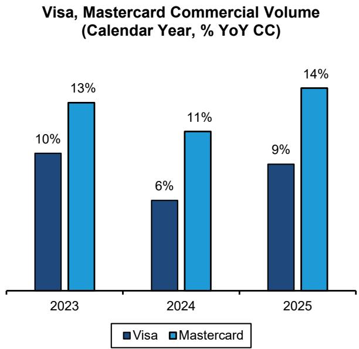

bar chart

Visa, Mastercard Commercial Volume (Calendar Year, % YoY CC)
| Year | Visa (%) | Mastercard (%) |
| :--- | :--- | :--- |
| 2023 | 10 | 13 |
| 2024 | 6 | 11 |
| 2025 | 9 | 14 |

Both reflect calendar year, cc growth;  
Visa's commercial growth includes large, medium and small business credit and debit, as well as commercial prepaid volume;  
Mastercard commercial growth reflects MA's Commercial Gross Dollar Volume (GDV) growth, which represents purchase volume plus cash volume  
Source: Company reports, Bernstein analysis

EXHIBIT 45: Visa Direct Transactions Growth (% YoY, Fiscal Year)  
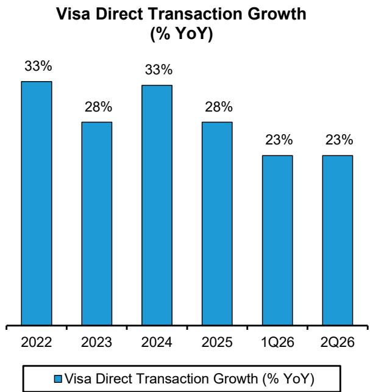

bar chart

Visa Direct Transaction Growth (% YoY)
| Year | Visa Direct Transaction Growth (% YoY) |
| :--- | :--- |
| 2022 | 33 |
| 2023 | 28 |
| 2024 | 33 |
| 2025 | 28 |
| 1Q26 | 23 |
| 2Q26 | 23 |

On Visa Fiscal Year  
Source: Company reports, Bernstein analysis

## CONCLUSION: NETWORKS' CHANGING GROWTH ALGORITHM

We expect Visa and Mastercard's growth algorithm to change as new flows and services become a larger share of the revenue mix and grow faster than core Consumer-to-Business payments (Exhibit 46). We do believe that expansion of TAM into new flows, VAS and overall diversification (at healthy margins) is a key theme to watch over the coming years, as traction here will influence the exit multiples for the networks in 3-5 years when consumer payments start maturing globally.

EXHIBIT 46: We expect Visa and Mastercard's revenue growth algorithm to evolve from card penetration growth being the #1 growth driver to new flows and services combined being the dominant growth drivers in the future  
Visa and Mastercard Revenue CAGR: 2019-25 (%)  
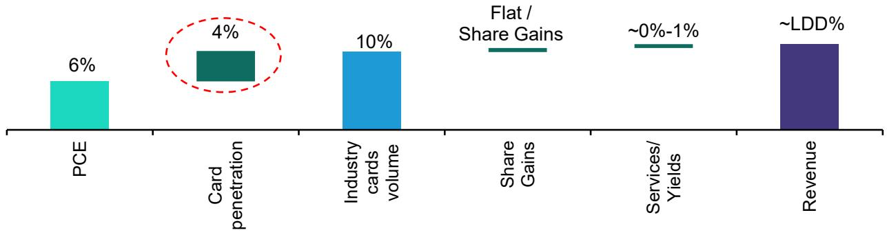

bar chart

| Category | Value (%) |
|---|---|
| PCE | 6 |
| Card penetration | 4 |
| Industry cards volume | 10 |
| Share Gains | ~0% |
| Services/ Yields | ~0%-1% |
| Revenue | ~LDD |

Visa and Mastercard Future Revenue Growth Algorithm (%)  
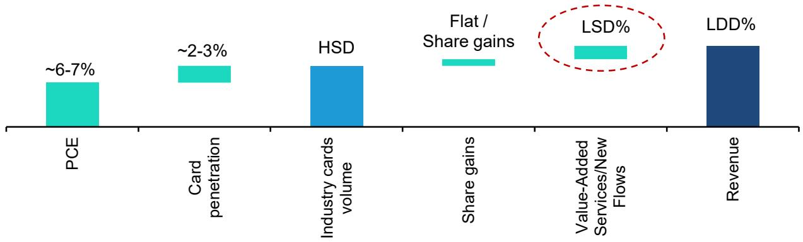

bar chart

| Category | Value (%) |
| :--- | :--- |
| PCE | ~6-7 |
| Card penetration | ~2-3 |
| Industry cards volume | HSD |
| Share gains | Flat / Share gains |
| Value-Added Services/New Flows | LSD% |
| Revenue | LDD% |

Source: Company reports, Bernstein estimates and analysis

BERNSTEIN TICKER TABLE

<table><tr><td rowspan="2">Ticker</td><td colspan="4">8 Jun 2026</td><td rowspan="2">TTMRel.</td><td colspan="4">Adjusted EPS</td><td colspan="3">Adjusted P/E (x)</td></tr><tr><td>Rating</td><td>Cur</td><td>Closing Price</td><td>Price Target</td><td>Cur</td><td>2025A</td><td>2026E</td><td>2027E</td><td>2025A</td><td>2026E</td><td>2027E</td></tr><tr><td>ADYEY (Adyen)</td><td>O</td><td>USD</td><td>9.52</td><td>18.63</td><td>(74.9)%</td><td>USD</td><td>0.39</td><td>0.50</td><td>0.60</td><td>24.3</td><td>18.9</td><td>15.9</td></tr><tr><td>ADYEN.NA (Adyen)</td><td>O</td><td>EUR</td><td>833.30</td><td>1,600.00</td><td>(64.2)%</td><td>EUR</td><td>33.62</td><td>42.83</td><td>51.05</td><td>24.8</td><td>19.5</td><td>16.3</td></tr><tr><td>XYZ (Block Inc)</td><td>O</td><td>USD</td><td>69.92</td><td>85.00</td><td>(15.8)%</td><td>USD</td><td>2,084</td><td>3,347</td><td>4,700</td><td>19.9</td><td>12.4</td><td>8.8</td></tr><tr><td>FIS (FIS)</td><td>M</td><td>USD</td><td>39.54</td><td>73.00</td><td>(74.7)%</td><td>USD</td><td>5.76</td><td>6.30</td><td>6.91</td><td>6.9</td><td>6.3</td><td>5.7</td></tr><tr><td>FI (Fiserv)</td><td>M</td><td>USD</td><td>52.72</td><td>76.00</td><td>(91.8)%</td><td>USD</td><td>8.64</td><td>8.06</td><td>8.76</td><td>6.1</td><td>6.5</td><td>6.0</td></tr><tr><td>GPN (Global Payments)</td><td>M</td><td>USD</td><td>64.50</td><td>86.00</td><td>(39.5)%</td><td>USD</td><td>12.22</td><td>13.89</td><td>16.13</td><td>5.3</td><td>4.6</td><td>4.0</td></tr><tr><td>KLAR (Klarna)</td><td>M</td><td>USD</td><td>16.55</td><td>20.00</td><td>NA</td><td>USD</td><td>65.1</td><td>305.3</td><td>461.7</td><td>44.6</td><td>9.5</td><td>6.3</td></tr><tr><td>MA (Mastercard)</td><td>O</td><td>USD</td><td>485.67</td><td>710.00</td><td>(41.1)%</td><td>USD</td><td>17.01</td><td>19.82</td><td>22.82</td><td>28.6</td><td>24.5</td><td>21.3</td></tr><tr><td>PYPL (PayPal)</td><td>M</td><td>USD</td><td>41.26</td><td>45.00</td><td>(67.2)%</td><td>USD</td><td>5.31</td><td>5.23</td><td>5.30</td><td>7.8</td><td>7.9</td><td>7.8</td></tr><tr><td>TOST (Toast)</td><td>O</td><td>USD</td><td>24.10</td><td>39.00</td><td>(68.7)%</td><td>USD</td><td>633.00</td><td>802.78</td><td>990.80</td><td>19.3</td><td>15.2</td><td>12.3</td></tr><tr><td>V (Visa)</td><td>O</td><td>USD</td><td>319.67</td><td>450.00</td><td>(37.1)%</td><td>USD</td><td>11.47</td><td>13.17</td><td>15.16</td><td>27.9</td><td>24.3</td><td>21.1</td></tr><tr><td>SPX</td><td></td><td></td><td>7,405.73</td><td></td><td></td><td></td><td></td><td></td><td></td><td></td><td></td><td></td></tr><tr><td>EDME</td><td></td><td></td><td>1,542.17</td><td></td><td></td><td></td><td></td><td></td><td></td><td></td><td></td><td></td></tr></table>

O - Outperform, M - Market-Perform, U - Underperform, NR - Not Rated, CS - Coverage Suspended  
XYZ estimate is EBIT (M); KLAR estimate is Adjusted EBIT; TOST estimate is EBITDA (M); XYZ valuation is EV/EBIT (x); KLAR valuation is EV/Adj EBIT (x);  
TOST valuation is EV/EBITDA (x);  
Source: Bloomberg, Bernstein estimates and analysis.

## I. REQUIRED DISCLOSURES

References to "Bernstein" or the "Firm" in these disclosures relate to the following entities: Bernstein Institutional Services LLC (April 1, 2024 onwards), Bernstein & Co., LLC (pre April 1, 2024), Bernstein Autonomous LLP, BSG France S.A. (April 1, 2024 onwards), Bernstein (Hong Kong) Limited 盛博香港有限公司, Bernstein (Canada) Limited, Bernstein (India) Private Limited (SEBI registration no. INH000006378), Bernstein (Singapore) Private Limited, Bernstein Japan KK (サンフォード・C・バーンスタイン株式会社) and analysts employed by SG Africa Technologies & Services to produce Bernstein under a Global Services Agreement in place between Bernstein and SG.

Bernstein is part of a joint venture between SG (SG) and AllianceBernstein, L.P. (AB). Unless specifically noted otherwise, for purposes of these disclosures, references to Bernstein's “affiliates” relate to both SG and AB and their respective affiliates.

## VALUATION METHODOLOGY

This research publication covers six or more companies. For valuation methodology and other company disclosures:

Please visit: https://bernstein-autonomous.bluematrix.com/sellside/Disclosures.action.

Or, you can also write to the Director of Compliance, Bernstein Institutional Services LLC, 245 Park Avenue, New York, NY 10167.

## RISKS

This research publication covers six or more companies. For risks and other company disclosures:

Please visit: https://bernstein-autonomous.bluematrix.com/sellside/Disclosures.action.

Or, you can also write to the Director of Compliance, Bernstein Institutional Services LLC, 245 Park Avenue, New York, NY 10167.

## RATINGS DEFINITIONS, BENCHMARKS AND DISTRIBUTION

## EQUITY RATINGS DEFINITIONS

## Bernstein brand

The Bernstein brand rates stocks based on forecasts of relative performance for the next 12 months versus the S&P 500 for stocks listed on the U.S. and Canadian exchanges, versus the Bloomberg Europe Developed Markets Large and Mid Cap Price Return Index EUR (EDME) for stocks listed on the European exchanges and emerging markets exchanges outside of the Asia Pacific region, versus the Bloomberg Japan Large and Mid Cap Price Return Index USD (JPL) for stocks listed on the Japanese exchanges, and versus the Bloomberg Asia ex-Japan Large and Mid Cap Price Return Index (ASIAX) for stocks listed on the Asian (ex-Japan) exchanges -unless otherwise specified.

The Bernstein brand has three categories of ratings:

- Outperform: Stock will outpace the market index by more than 15 pp  
• Market-Perform: Stock will perform in line with the market index to within +/-15 pp  
• Underperform: Stock will trail the performance of the market index by more than 15 pp

Coverage Suspended: Coverage of a company under the Bernstein brand has been suspended. Ratings and price targets are suspended temporarily, are no longer current, and should therefore not be relied upon.

Not Rated: A rating assigned when the stock cannot be accurately valued, or the performance of the company accurately predicted, at the present time. The covering analyst may continue to publish research reports on the company to update investors on events and developments.

Not Covered (NC) denotes companies that are not under coverage.

Bernstein brand stock ratings are based on a 12-month time horizon.

## Autonomous brand – common stocks

The Autonomous brand rates common stocks as indicated below. As our benchmarks we use the Bloomberg Europe 500 Banks And Financial Services Index (BEBANKS) and Bloomberg Europe Dev Mkt Financials Large and Mid Cap Price Ret Index EUR (EDMFI) index for developed European banks and Payments, the Bloomberg Europe 500 Insurance Index (BEINSUR) for European insurers, the S&P 500 and S&P Financials for US banks and Payments coverage, S5LIFE for US Insurance, the S&P Insurance Select Industry (SPSIINS) for US Non-Life Insurers coverage, and the Bloomberg Emerging Markets Financials Large, Mid and Small Cap Price Return Index (EMLSF) for emerging market banks and insurers and Payments. Ratings are stated relative to the sector (not the market).

The Autonomous brand has three categories of common stock ratings:

- Outperform (OP): Stock will outpace the relevant index by more than 10 pp  
- Neutral (N): Stock will perform in line with the market index to within +/-10 pp  
• Underperform (UP): Stock will trail the performance of the relevant index by more than 10 pp

Coverage Suspended: Coverage of a company under the Autonomous research brand has been suspended. Ratings and price targets are suspended temporarily, are no longer current, and should therefore not be relied upon.

Not Rated: A rating assigned when the stock cannot be accurately valued, or the performance of the company accurately predicted, at the present time. The covering analyst may continue to publish research reports on the company to update investors on events and developments.

Those denoted as ‘Feature’ (e.g., Feature Outperform FOP, Feature Under Outperform FUP) are our core ideas.

Not Covered (NC) denotes companies that are not under coverage.

Autonomous brand common stock ratings are based on a 12-month time horizon.

## Autonomous brand – preferred stocks

The Autonomous brand has three categories of preferred stock ratings:

- Outperform (OP): The total return of the preferred instrument is expected to outperform preferred securities of other issuers operating in similar sectors or rating categories over the next six months.  
- Neutral (N): The total return of the preferred instrument is expected to perform in line with preferred securities of other issuers operating in similar sectors or rating categories over the next six months.  
- Underperform (UP): The total return of the preferred instrument is expected to underperform preferred securities of other issuers operating in similar sectors or rating categories over the next six months.

Autonomous preferred stock ratings are based on a 6-month time horizon.

## AUTONOMOUS CREDIT RESEARCH

Where this report contains investment recommendations for credit instruments, as defined in article 3(1)(35) of the Market Abuse Regulation, the information below is presented to comply with its disclosure requirements.

The report may also include reference(s) to published opinions by other Autonomous or Bernstein analysts covering the equity securities of the issuer(s) referenced herein. Please note an investment recommendation for credit instruments published by the author(s) of this report may differ from the published view of the analyst covering equity securities for the issuer(s) contained in this report and vice versa.

## CREDIT RATINGS DEFINITIONS

The Autonomous brand has three categories of credit ratings:

\- Credit Outperform (C-OP): The total return of the Reference Credit Instrument is expected to outperform the credit spread of bonds of other issuers operating in similar sectors or rating categories over the next six months.

- Credit Neutral (C-N): The total return of the Reference Credit Instrument is expected to perform in line with the credit spread of bonds of other issuers operating in similar sectors or rating categories over the next six months.  
- Credit Underperform (C-UP): The total return of the Reference Credit Instrument is expected to underperform the credit spread of bonds of other issuers operating in similar sectors or rating categories over the next six months.

Autonomous credit ratings are based on a 6-month time horizon.

A list of all investment recommendations produced by the author(s) of this report alongside credit ratings history are available upon request.

It is at the sole discretion of the Firm as to when to initiate, update and cease research coverage. The Firm has established, maintains and relies on information barriers to control the flow of information contained in one or more areas (i.e. the private side) within the Firm, and into other areas, units, groups or affiliates (i.e. public side) of the Firm

DISTRIBUTION OF EQUITY RATINGS/INVESTMENT BANKING SERVICES

<table><tr><td>Equity Rating</td><td>Market Abuse Regulation (MAR) and FINRA Rating Category</td><td>Global Rating Distribution</td><td>Investment Banking Relationships*</td></tr><tr><td>Outperform</td><td>BUY</td><td>51.1%</td><td>16.5%</td></tr><tr><td>Market-Perform (Bernstein Brand) Neutral (Autonomous Brand)</td><td>HOLD</td><td>36.3%</td><td>17.8%</td></tr><tr><td>Underperform</td><td>SELL</td><td>12.6%</td><td>14.9%</td></tr></table>

\* These figures represent the percentage of companies within each equity rating category for which affiliates of Bernstein have provided investment banking services within the previous 12 months.
As of March 31, 2026. All figures are updated quarterly.

Prior to April 1, 2024, Bernstein & Co., LLC. issued the ratings and price target information in the graph(s) below for the following companies: Adyen NV, FIS, Global Payments Inc, Mastercard Inc, PayPal Holdings Inc, Toast Inc and Visa Inc.

## PRICE CHARTS/ RATINGS AND PRICE TARGET HISTORY

This research publication covers six or more companies. For price chart and other company disclosures, please visit https://bernstein-autonomous.bluematrix.com/sellside/Disclosures.action or you can write to the Director of Compliance, Bernstein Institutional Services LLC, 245 Park Avenue, New York, NY 10167.

Adyen NV, Block Inc, FIS, Fiserv, Global Payments Inc, Klarna Group plc, Mastercard Inc, PayPal Holdings Inc, Toast Inc and Visa Inc are covered by both the Autonomous and Bernstein brands. For the research ratings and price target history please go to https://bernstein-autonomous.bluematrix.com/sellside/Disclosures.action.

## CONFLICTS OF INTEREST

SG and/or its affiliates beneficially own 1% or more of a class of common equity securities of the following companies: Global Payments Inc and PayPal Holdings Inc.

AB and/or its affiliates beneficially own 1% or more of a class of common equity securities of the following companies: Toast Inc and Visa Inc.

Bernstein Autonomous LLP or BSG France SA, beneficially, has either a net long or short position of 0.5% or more of the total issued share capital of a class of common equity securities of the following MiFID eligible securities: Toast Inc and Visa Inc.

SG and/or its affiliates beneficially own 0.5% or more of [the total issued share capital/any class of common equity securities] with a net [long/short] position of: Visa Inc.

Bernstein and/or affiliates have received compensation for investment banking services in the past twelve months from Klarna Group plc and Mastercard Inc.

An affiliate of Bernstein has received compensation for non-investment banking securities-related products or services in the previous twelve months from the following clients: Block Inc and Fiserv.

Bernstein and/or affiliates have received compensation for non-investment banking securities-related products or services in the previous twelve months from the following clients: Fiserv, Global Payments Inc, Klarna Group plc and Mastercard Inc.

Bernstein and/or affiliates expect to receive or intend to seek compensation for investment banking services in the next three months from Klarna Group plc.

Certain affiliates of Bernstein act as market maker or liquidity provider in the equities securities of: Adyen NV, Block Inc, FIS, Global Payments Inc, Mastercard Inc, PayPal Holdings Inc, Toast Inc and Visa Inc.

Certain affiliates of Bernstein act as market maker or liquidity provider in the debt securities of: FIS, Mastercard Inc and Visa Inc.

Affiliates of Bernstein managed or co-managed in the past twelve months a public offering of securities of Klarna Group plc and Mastercard Inc.

Bernstein and/or affiliates had an investment banking client relationship during the past twelve months with Klarna Group plc and Mastercard Inc.

## OTHER MATTERS

The legal entity(ies) employing the analyst(s) listed in this report, and their location, can be determined by the country code of their phone number, as follows:

+1 Bernstein Institutional Services LLC; New York, New York, USA

+44 Bernstein Autonomous LLP; London UK

+212 SG Africa Technologies & Services; Casablanca, Morocco

+33 BSG France S.A.; Paris, France

+34 BSG France S.A.; Madrid, Spain

+41 Bernstein Autonomous LLP; Geneva, Switzerland

+49 BSG France S.A.; Frankfurt, Germany

+91 Bernstein (India) Private Limited; Mumbai, India

+852 Bernstein (Hong Kong) Limited 盛博香港有限公司; Hong Kong, China

+65 Bernstein (Singapore) Private Limited; Singapore

+81 Bernstein Japan KK; Tokyo, Japan

Where this report has been prepared by research analyst(s) employed by a non-US affiliate, such analyst(s), is/are (unless otherwise expressly noted below) not registered as associated persons of Bernstein Institutional Services LLC or any other SEC-registered broker-dealer and are not licensed or qualified as research analysts with FINRA. Accordingly, such analyst(s) may not be subject to FINRA's restrictions regarding (among other things) communications by research analysts with a subject company, interactions between research analysts and investment banking personnel, participation by research analysts in solicitation and marketing activities relating to investment banking transactions, public appearances by research analysts, and trading securities held by a research analyst account.

Where this report has been prepared by research analyst(s) employed by SG Africa Technologies & Services (part of the SG group of companies), it has been prepared on behalf of a Bernstein company under a Global Services Agreement in place between Bernstein and SG.

## CERTIFICATION

Each research analyst listed in this report, who is primarily responsible for the preparation of the content of this report, certifies that all of the views expressed in this publication accurately reflect that analyst's personal views about any and all of the subject securities or issuers and that no part of that analyst's compensation was, is, or will be, directly or indirectly, related to the specific recommendations or views in this publication.

## II. ADDITIONAL GLOBAL CONFLICT DISCLOSURES

It is at the sole discretion of the Firm as to when to initiate, update and cease research coverage. The Firm has established, maintains and relies on information barriers to control the flow of information contained in one or more areas (i.e., the private side) within the Firm, and into other areas, units, groups or affiliates (i.e., public side) of the Firm.

## III. OTHER IMPORTANT INFORMATION AND DISCLOSURES

Separate branding is maintained for “Bernstein” and “Autonomous” research products.

- Bernstein produces a number of different types of research products including, among others, fundamental analysis and quantitative analysis under both the “Autonomous” and “Bernstein” brands. Recommendations contained within one type of research product may differ from recommendations contained within other types of research products, whether as a result of differing time horizons, methodologies or otherwise. Furthermore, views or recommendations within a research product issued under one brand may differ from views or recommendations under the same type of research product issued under the other brand. The Research Ratings System for the two brands and other information related to those Rating Systems are included in the previous section.  
- Autonomous operates as a separate business unit within the following entities: Bernstein Institutional Services LLC, Bernstein Autonomous LLP, Bernstein (Hong Kong) Limited 盛博香港有限公司 and Bernstein (India) Private Limited. For information relating to “Autonomous” branded products (including certain Sales materials) please visit: www.autonomous.com. For information relating to Bernstein branded products please visit: www.bernsteinresearch.com.

Analysts are compensated based on aggregate contributions to the research franchise as measured by account penetration, productivity and proactivity of investment ideas. No analysts are compensated based on performance in, or contributions to, generating investment banking revenues.

This report has been produced by an independent analyst as defined in Article 3 (1)(34)(i) of EU 596/2014 Market Abuse Regulation (“MAR”) and the same article of MAR as it forms part of United Kingdom domestic law by virtue of the European Union (Withdrawal) Act 2018.

To our readers in the United States: Bernstein Institutional Services LLC, a broker-dealer registered with the U.S. Securities and Exchange Commission (“SEC”) and a member of the U.S. Financial Industry Regulatory Authority, Inc. (“FINRA”) is distributing this publication in the United States and accepts responsibility for its contents. Where this material contains an analysis of debt product(s), such material is intended only for institutional investors and is not subject to the US independence and disclosure standards applicable to debt research prepared for retail investors.

Bernstein Institutional Services LLC may act as principal for its own account or as agent for another person (including an affiliate) in sales or purchases of any security which is a subject of this report. This report does not purport to meet the objectives or needs of any specific individuals, entities or accounts.

To our readers in Canada: If this publication pertains to a Canadian domiciled company, it is being distributed in Canada by Bernstein (Canada) Limited, which is licensed and regulated by the Canadian Investment Regulatory Organization. If the publication pertains to a non-Canadian domiciled company, it is being distributed by Bernstein Institutional Services LLC, which is licensed and regulated by both the SEC and FINRA, into Canada under the International Dealers Exemption.

This document may not be passed onto any person in Canada unless that person qualifies as "permitted client" as defined in Section 1.1 of NI 31-103.

To our readers in Brazil: This report has been prepared by Bernstein Institutional Services LLC, and Banco BTG Pactual S.A. ("BTG") is responsible for the distribution of this report in Brazil.

To readers in the United Kingdom: This publication has been issued or approved for issue in the United Kingdom by Bernstein Autonomous LLP, authorised and regulated by the Financial Conduct Authority and located at 60 London Wall, London EC2M 5SH, +44 (0)20-7170-5000. Registered in England & Wales No OC343985.

This document is for distribution only to persons who (i) have professional experience in matters relating to investments falling within Article 19(5) of the Financial Services and Markets Act 2000 (Financial Promotion) Order 2005 (as amended, the “Financial Promotion Order”), (ii) are persons falling within Article 49(2)(a) to (d) (“high net worth companies, unincorporated associations, etc.”) of the Financial Promotion Order, (iii) are outside the United Kingdom, or (iv) are persons to whom an invitation or inducement to engage in investment activity (within the meaning of section 21 of the FSMA) in connection with the issue or sale of any securities may otherwise lawfully be communicated or caused to be communicated (all such persons together being referred to as “relevant persons”). This document is directed only at relevant persons and must not be acted on or relied on by persons who are not relevant persons. Any investment or investment activity to which this document relates is available only to relevant persons and will be engaged in only with relevant persons.

To our readers in the member states of the EEA: This publication is being distributed by BSG France SA, which is authorised and regulated by the Autorité de Contrôle Prudentiel et de Résolution (ACPR) and Autorité des Marchés Financiers (AMF).

To our readers in Hong Kong: This publication is being distributed in Hong Kong by Bernstein (Hong Kong) Limited 盛博香港有限公司, which is licensed and regulated by the Hong Kong Securities and Futures Commission (Central Entity No. AXC846) to carry out Type 4 (Advising on Securities) regulated activities and subject to the licensing conditions mentioned in the SFC Public Register (https://www.sfc.hk/publicregWeb/corp/AXC846/details)). This publication is solely for professional investors, as defined in the Securities and Futures Ordinance (Cap. 571). The purpose of this report is solely to provide an analysis of the issuers referred to in this report and is not intended for any purpose contrary to the laws of Hong Kong.

To our readers in Singapore: This publication is being distributed in Singapore by Bernstein (Singapore) Private Limited, only to accredited investors or institutional investors, as defined in the Securities and Futures Act 2001 of Singapore ("SFA"). Recipients in Singapore should contact Bernstein (Singapore) Private Limited in respect of matters arising from, or in connection with, this publication. Bernstein (Singapore) Private Limited is regulated by the Monetary Authority of Singapore and licensed under the SFA as a capital markets services licence holder for dealing in capital markets products that are securities and collective investment schemes and an exempt financial adviser for advising on, issuing and promulgating analyses and reports on securities. Bernstein (Singapore) Private Limited is registered in Singapore with Company Registration No. 20213710W and located at One Raffles Quay, #27-11 South Tower, Singapore 048583, +65-6230-4612.

To our readers in the People's Republic of China: The securities referred to in this document are not being offered or sold and may not be offered or sold, directly or indirectly, in the People's Republic of China (for such purposes, not including the Hong Kong and Macau Special Administrative Regions or Taiwan, the "PRC") in contravention of any applicable laws of the PRC.

This document does not constitute an offer to sell or the solicitation of an offer to buy any securities in the PRC to any person to whom it is unlawful to make the offer or solicitation in the PRC.

We do not represent that this document may be lawfully distributed, or that any securities may be lawfully offered, in compliance with any applicable registration or other requirements in the PRC, or pursuant to an exemption available thereunder, or assume any responsibility for facilitating any such distribution or offering. In particular, no action has been taken by us which would permit a public offering of any securities or distribution of this document in the PRC. Accordingly, the securities are not being offered or sold within the PRC by means of this document or any other document. Neither this document nor any advertisement or other offering material may be distributed or published in the PRC, except under circumstances that will result in compliance with any applicable laws and regulations.

To our readers in Japan: This publication is being distributed in Japan by Bernstein Japan KK (サンフォード・C・バーンスタイン株式会社), which is registered in Japan as a Financial Instruments Business Operator with the Kanto Local Finance Bureau (registration number: The Director-General of Kanto Local Finance Bureau (FIBO) No.3387) and regulated by the Financial Services Agency. It is also a member of Japan Investment Advisers Association. This publication is solely for qualified institutional investors in Japan only, as defined in Article 2, paragraph (3), items (i) of the Financial Instruments and Exchange Act.

For the institutional client readers in Japan who have been granted access to the Bernstein website by Daiwa Group Inc. ("Daiwa"), your access to this document should not be construed as meaning that Bernstein is providing you with investment advice for any purposes. Whilst Bernstein has prepared this document, your relationship is, and will remain with, Daiwa, and Bernstein has neither any contractual relationship with you nor any obligations towards you.

To our readers in Australia: Bernstein (Hong Kong) Limited 盛博香港有限公司 is responsible for distributing research in Australia. It is regulated by the Securities and Exchange Commission under U.S. laws, by the Financial Conduct Authority under U.K. laws, which differs from Australian laws. Bernstein (Hong Kong) Limited 盛博香港有限公司 is exempt from the requirement to hold an Australian financial services license under the Corporations Act 2001 in respect of the provision of the following financial services to wholesale clients:

• providing financial product advice;  
• dealing in a financial product;  
• making a market for a financial product; and  
• providing a custodial or depository service.

To our readers in India: This publication is being distributed in India by Bernstein (India) Private Limited (SCB India) which is licensed and regulated by Securities and Exchange Board of India ("SEBI") as a research analyst entity under the SEBI (Research Analyst) Regulations, 2014, having registration no. INH000006378 and as a stock broker having registration no. INZ000213537. SCB India is currently engaged in the business of providing research and stock broking services. Please refer to www.bernsteinresearch.in for more information.

\- SCB India is a Private limited company incorporated under the Companies Act, 2013, on April 12, 2017 bearing corporate identification number U65999MH2017FTC293762, and registered office at Level 3A, 4th Floor, First International Financial Centre, Plot Nos C-54 and C-55, G Block, Near CBI Office, Bandra Kurla Complex, Bandra (East), Mumbai 400098, Maharashtra, India (Phone No: +91-22-68421401).

\- For details of Associates (i.e., affiliates/group companies) of SCB India, kindly email MUM-BERNSTEIN-InCompliance@bernsteinsg.com.

• SCB India does not have any disciplinary history as on the date of this report.

\- Except as noted above, SCB India and/or its Associates (i.e., affiliates/group companies), the Research Analysts authoring this report, and their relatives

• do not have any financial interest in the subject company  
• do not have actual/beneficial ownership of one percent or more in securities of the subject company;  
- is not engaged in any investment banking activities for Indian companies, as such;  
• have not managed or co-managed a public offering in the past twelve months for any Indian companies;  
- have not received any compensation for investment banking services or merchant banking services from the subject company in the past 12 months;  
• have not received compensation for brokerage services from the subject company in the past twelve months;  
- have not received any compensation or other benefits from the subject company or third party related to the specific recommendations or views in this report; and  
- do not currently, but may in the future, act as a market maker in the financial instruments of the companies covered in the report.  
- do not have any conflict of interest in the subject company as of the date of this report.

\- Except as noted above, the subject company has not been a client of SCB India during twelve months preceding the date of distribution of this research report. Neither SCB India nor its Associates (i.e., affiliates/group companies) have received compensation for products or services other than investment banking, merchant banking or brokerage services from the subject company in the past twelve months.

\- The principal research analyst(s) who prepared this report, members of the analysts' team, and members of their households are not an officer, director, employee or advisory board member of the companies covered in the report.

\- Our Compliance officer / Grievance officer is Ms. Rupal Talati, who can be reached at +91-22-68421451, or MUM-BERNSTEIN-InCompliance@bernsteinsg.com / Scbin-investorgrievance@bernsteinsg.com

- The Research investor charter and Terms & Conditions of SCB India are available on its website and may be accessed at Bernstein (India) Private Limited (https://bernsteinresearch.in/) for your reference.  
- Disclaimer: Registration granted by SEBI, and certification from NISM, is in no way a guarantee of performance of the intermediary or provide any assurance of returns to investors. Investments in securities market are subject to market risks. Read all the related documents carefully before investing.

To our readers in Switzerland: This document is provided in Switzerland by or through Bernstein Autonomous LLP, and is provided only to qualified investors as defined in article 10 of the Swiss Collective Investment Scheme Act (“CISA”) and related provisions of the Collective Investment Scheme Ordinance and in strict compliance with applicable Swiss law and regulations. The products mentioned in this document may not be suitable for all types of investors. This document is based on the Directives on the Independence of Financial Research issued by the Swiss Bankers Association (SBA) in January 2008.

To our readers in the Middle East: Bernstein Autonomous LLP, DIFC branch has its principal office at Gate Village 06, DIFC, Dubai, UAE. Bernstein Autonomous LLP, DIFC branch is regulated by the Dubai Financial Services Authority (DFSA) with the registration number CL10040 and is provisioned for Arranging Deals in Investments and Advising on Financial Products. All communications and services are directed at Professional Clients and Market Counterparties only (as defined in the DFSA rulebook). Persons other than Professional Clients and Market Counterparties, such as Retail Clients, are not the intended recipients of our communications or services.

## LEGAL

All research publications are disseminated to our clients through posting on the firm's password protected websites, bernsteinresearch.com and autonomous.com. Certain, but not all, research publications are also made available to clients through third-party vendors or redistributed to clients through alternate electronic means as a convenience.

This publication has been published and distributed in accordance with the Firm's policy for management of conflicts of interest in investment research, a copy of which is available from Bernstein Institutional Services LLC, Director of Compliance, 245 Park Avenue, New York, NY 10167. Additional disclosures and information regarding Bernstein's business are available on our website www.bernsteinresearch.com.

The securities described herein may not be eligible for sale in all jurisdictions or to certain categories of investors where that permission profile is not consistent with the licenses held by the entities noted herein. This document is for distribution only as may be permitted by law. This publication is not directed to, or intended for distribution to or use by, any person or entity who is a citizen or resident of, or located in any locality, state, country or other jurisdiction where such distribution, publication, availability or use would be contrary to law or regulation or which would subject any of the entities referenced herein or any of their subsidiaries or affiliates to any registration or licensing requirement within such jurisdiction. This publication is based upon public sources we believe to be reliable, but no representation is made by us that the publication is accurate or complete. We do not undertake to advise you of any change in the reported information or in the opinions herein. This publication was prepared and issued by entity referred to herein for distribution to eligible counterparties or professional clients. This publication is not an offer to buy or sell any security, and it does not constitute investment, legal or tax advice. The investments referred to herein may not be suitable for you. Investors must make their own investment decisions in consultation with their professional advisors in light of their specific circumstances. The value of investments may fluctuate, and investments that are denominated in foreign currencies may fluctuate in value as a result of exposure to exchange rate movements. Information about past performance of an investment is not necessarily a guide to, indicator of, or assurance of, future performance.

This report is directed to and intended only for our clients who are “eligible counterparties”, “professional clients”, “institutional investors” and/or “professional investors” as defined by the aforementioned regulators, and must not be redistributed to retail clients as defined by the aforementioned regulators. Retail clients who receive this report should note that the services of the entities noted herein are not available to them and should not rely on the material herein to make an investment decision. The result of such act will not hold the entities noted herein liable for any loss thus incurred as the entities noted herein are not registered/authorised/licensed to deal with retail clients and will not enter into any contractual agreement/arrangement with retail clients. This report is provided subject to the terms and conditions of any agreement that the clients may have entered into with the entities noted herein. All research reports are disseminated on a simultaneous basis to eligible clients through electronic publication to our client portal.

The information in this report was prepared by Bernstein solely for the internal business use of our clients. Clients may store, display, analyze, reformat and print the information in this report for this limited use only. Clients may not copy, alter, create derivative works, resell, reverse engineer, commercially exploit, share or distribute any part of the information contained herein for any purpose without Bernstein's express written consent. These restrictions include extracting data or using the content to develop indices or other products. Further, you may not use this report, or any portion of this report, to train or finetune any third-party machine learning or artificial intelligence system, or as a prompt or input into any such system. You also may not, without

Bernstein's express written consent, do any of the foregoing in connection with your own internal machine learning or artificial intelligence system.

Bernstein may use artificial intelligence tools in the preparation of its materials. Any such materials are reviewed by Bernstein's research analysts prior to publication.

This report has been prepared for information purposes only and is based on current public information that we consider reliable, but the entities noted herein do not warrant or represent (express or implied) as to the sources of information or data contained herein are accurate, complete, not misleading or as to its fitness for the purpose intended even though the entities noted herein rely on reputable or trustworthy data providers, it should not be relied upon as such. Opinions expressed are the author(s)' current opinions as of the date appearing on the material only and we do not undertake to advise you of any change in the reported information or in the opinions herein.

Any references to SG herein are purely factual, based upon publicly available information, and included for comparative purposes only. They do not constitute an opinion or recommendation with respect to the securities of SG.

This publication was prepared and issued by the entity referred to herein for distribution to eligible counterparties or professional clients. The information in this report is intended for general circulation and does not constitute an offer to buy or sell any security, investment, legal or tax advice nor a personal recommendation, as defined by any of the aforementioned regulators. It does not take into account the particular investment objectives, financial situations, or needs of individual investors. The report has not been reviewed by any of the aforementioned regulators and does not represent any official recommendation from the aforementioned regulators. The investments referred to herein may not be suitable for you. Investors must make their own investment decisions in consultation with advice sought from a financial adviser regarding the suitability of the investment product, taking into account the specific investment objectives, financial situation or particular needs of any recipient of the recommendation, before the recipient makes a commitment to purchase the investment product.

The analysis contained herein is based on numerous assumptions. Different assumptions could result in materially different results. The information in this report does not constitute, or form part of, any offer to sell or issue, or any offer to purchase or subscribe for shares, or to induce engage in any other investment activity. The value of any securities or financial instruments mentioned in this report may fluctuate subject to market conditions. Information about past performance of an investment is not necessarily a guide to, indicative of, or assurance of future performance. Estimates of future performance mentioned by the research analyst in this report are based on assumptions that may not be realized due to unforeseen factors like market volatility/fluctuation. In relation to securities or financial instruments denominated in a foreign currency other than the clients' home currency, movements in exchange rates will have an effect on the value, either favorable or unfavorable. Before acting on any recommendations in this report, recipients should consider the appropriateness of investing in the subject securities or financial instruments mentioned in this report and, if necessary, seek for independent professional advice.

The securities described herein may not be eligible for sale in all jurisdictions or to certain categories of investors where that permission profile is not consistent with the licenses held by the entities noted herein. This document is for distribution only as may be permitted by law. It is not directed to, or intended for distribution to or use by, any person or entity who is a citizen or resident of or located in any locality, state, country or other jurisdiction where such distribution, publication, availability or use would be contrary to law or regulation or would subject the entities noted herein to any regulation or licensing requirement within such jurisdiction.

Source: Bloomberg Index Services Limited. BLOOMBERG® is a trademark and service mark of Bloomberg Finance L.P. and its affiliates (collectively “Bloomberg”). Bloomberg or Bloomberg’s licensors own all proprietary rights in the Bloomberg Indices. Neither Bloomberg nor Bloomberg’s licensors approves or endorses this material, or guarantees the accuracy or completeness of any information herein, or makes any warranty, express or implied, as to the results to be obtained therefrom and, to the maximum extent allowed by law, neither shall have any liability or responsibility for injury or damages arising in connection therewith.

No part of this material may be reproduced, distributed or transmitted or otherwise made available without prior consent of the entities noted herein. Copyright Bernstein Institutional Services LLC Bernstein Autonomous LLP, BSG France S.A., Bernstein (Hong Kong) Limited 盛博香港有限公司, Bernstein (Canada) Limited, Bernstein (India) Private Limited (SEBI registration no. INH000006378), Bernstein (Singapore) Private Limited and Bernstein Japan KK (サンフォード・C・バーンスタイン株式会社). All rights reserved. The trademarks and service marks contained herein are the property of their respective owners. Any unauthorized use or disclosure is strictly prohibited. The entities noted herein may pursue legal action if the unauthorized use results in any defamation and/or reputational risk to the entities noted herein and research published under the Bernstein and Autonomous brands.