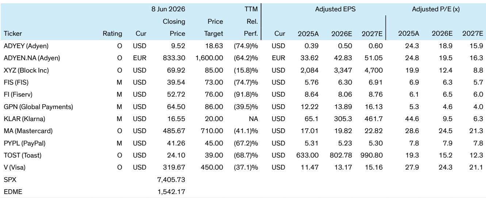
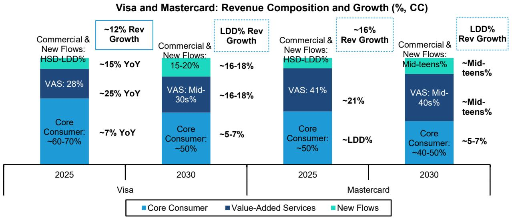

# Bernstein：市场低估了支付网络的“量价分离”能力

全球支付市场正在进入一个微妙的分水岭。过去十年，现金数字化是行业增长的核心叙事，卡支付渗透率从47%攀升至64%，Visa和Mastercard的股价也在这条曲线上获得了丰厚回报。但一个尖锐的问题正在浮现：当美国卡渗透率已达72%，当亚洲市场增长放缓，当稳定币和即时支付不断制造噪音——现金数字化的跑道究竟还剩多少？

Bernstein刚刚发布了第12版全球支付预测模型。这份报告的结论，比表面看起来要复杂得多。它没有简单地回答“增长还有多少”，而是揭示了一个更关键的判断：**支付网络的价值增长，正在从“量”的扩张转向“质”的变现。** 那些只盯着卡交易量增速放缓的投资者，很可能低估了网络效应在交易结构、增值服务和新兴流量的二次放大作用。

我们仔细拆解了这份长达数十页的研报，提炼出五个核心洞察。它们不仅关乎Visa和Mastercard的投资逻辑，更指向整个支付产业链的定价权迁移。

## 1. 卡交易量增速确实在放缓，但交易笔数的增长更具韧性

Bernstein预测，2025-2030年全球卡交易量（C2B purchase volume）的复合年增长率约为8%（恒定汇率），低于2022-2025年的9%和2019-2022年的11%。减速的主要驱动力来自两个方向：美国市场的高渗透率（72%）导致增量空间收窄，以及亚太地区因本土支付生态的崛起而出现结构性放缓。

但这里有一个容易被忽视的细节。当衡量标准从交易金额切换到交易笔数时，增长曲线明显更陡峭：Bernstein预测全球交易笔数在2025-2030年的复合增长率约为9%，仅比2022-2025年的10%略有下降。原因在于，卡渗透率在笔数维度上仍然偏低——很多低客单价的场景（如便利店、交通、自动售货机）尚未完全数字化，而这些场景正是接触式支付和未来代理型商务的天然土壤。

对Visa和Mastercard而言，这意味着一层重要的收入缓冲。根据Bernstein的估算，两家网络超过三分之一的毛收入直接与交易笔数挂钩，而笔数的增长通常快于金额增长。当市场过度聚焦于“量的减速”时，这层结构性的韧性往往被低估。

## 2. 美国市场不是没有故事，而是故事换了主角

美国是Bernstein预测中最受关注的市场，也是争议最大的区域。2025年美国卡渗透率约为72%，Bernstein预计到2030年也仅会小幅升至74%。这意味着，未来五年的增长将几乎完全依赖个人消费支出（PCE）的增长，而非渗透率的提升。

但这并不意味着美国市场失去了吸引力。Bernstein明确指出，即便在高度渗透的市场，双网络（Visa和Mastercard）历史上仍能实现双位数的收入增长。秘密在于：收入来源正在从“交易量的线性增长”转向“交易结构的非线性变现”。

具体而言，三个杠杆正在发挥作用。第一，代币化（tokens）正在改变每笔交易的价值分配，网络可以基于代币的发行和管理收取额外费用。第二，增值服务（VAS）的渗透率持续提升，这些服务包括风险分析、数据洞察、身份验证等，其利润率往往高于核心交换费。第三，新流量（new flows）如B2B支付、跨境支付和商业支付，正在开辟传统C2B交易之外的增量池。

Bernstein的模型显示，即便卡交易量增速放缓至5-6%，叠加交易笔数9%的增长和上述结构性杠杆，Visa和Mastercard仍有可能实现双位数的收入增长。这是一种典型的“量价分离”——收入增长正在脱离交易量的线性束缚。

## 3. 欧洲正在成为下一轮卡渗透率提升的主战场，但格局正在重塑

如果说美国是存量博弈，那么欧洲就是增量战场。Bernstein的数据显示，欧洲的卡渗透率从2019年的44%跃升至2025年的76%，预计到2030年将达到92%。这是一个惊人的跃迁——五年内渗透率几乎翻倍，背后是欧盟推动的数字支付政策、接触式支付的普及以及消费者习惯的加速迁移。

Bernstein对欧洲的预测尤为积极：2025-2030年卡交易量复合增长率预计为11%（恒定汇率），远高于全球平均的8%。增长动力主要来自欧洲大陆（德国、意大利、西班牙等）的追赶效应，这些国家的现金使用比例仍然较高（如德国现金占POS交易额的32%）。

但欧洲市场并非没有暗流。Bernstein特别提到，本土支付方案（如德国的Girocard、法国的Cartes Bancaires）正在流失份额。2024年，Visa在欧洲大陆（德国和法国）的市场份额提升了5-6个百分点。这意味着，欧洲的数字化红利并非均匀分配，而是正在向全球性网络集中。对于投资者而言，这不仅是渗透率的故事，更是竞争格局重塑的故事——那些能够将规模优势转化为商户和发卡行议价权的网络，将获得不成比例的收益。

## 4. 替代支付方式的威胁被高估了，稳定币在零售支付中仍是“寻找问题的解决方案”

过去几年，账户对账户（A2A）支付、本地支付方式和稳定币不断制造新闻，市场对卡网络的替代风险始终存在担忧。Bernstein的模型提供了一个更冷静的视角。

报告指出，即便在那些A2A和本地支付取得成功的市场（如印度的UPI、巴西的Pix），卡交易量仍然保持高个位数到低双位数的增长。这背后的逻辑是：替代支付方式更多是在蚕食现金和支票的份额，而非直接替代卡支付。在印度，UPI的崛起确实挤压了借记卡的使用，但信用卡交易量仍在快速增长。消费者在数字支付生态中的行为是“多钱包并存”，而非非此即彼。

至于稳定币，Bernstein的观点更加明确：在五年的时间维度上，稳定币在零售消费者支付领域仍是一个“寻找问题的解决方案”。尽管稳定币在跨境汇款和美元需求旺盛的市场找到了实用场景，但在日常零售支付中，其用户体验、监管不确定性和商户接受度仍然构成重大障碍。Bernstein在另一份专题报告中对此有更详细的拆解，但核心结论是：稳定币对卡网络的威胁，至少在零售层面，被市场过度定价了。

## 5. 报告尚未完全回答的关键问题：代理型商务能否成为下一个增长奇点？

这是整份报告中最引人遐想的伏笔。Bernstein在多个地方提到“代理型商务”（Agentic Commerce）和自主代理交易作为潜在的增长驱动力，但同时也明确表示“现在将其纳入模型还为时过早”。

这一表述背后，隐藏着一个可能改变支付行业底层逻辑的假设。如果AI代理能够代表消费者自动完成购物、支付账单、订阅服务，那么每笔交易的频率和场景将发生根本性变化。更关键的是，代理型交易可能催生大量微支付（micropayments），而这些正是卡网络的理想场景——高频率、低单价、依赖信任和结算效率。

Bernstein没有给出任何量化预测，但提出了一个值得跟踪的观察框架：卡网络能否开发出适合代理型交易的商业模型，尤其是针对那些历史上难以数字化的品类（如租金、医疗账单）。如果答案是肯定的，那么当前基于历史数据的增长预测可能低估了未来的潜在空间。如果答案是否定的，那么代理型商务可能会成为替代支付方式的新入口。

这是一个典型的“预期差”问题。市场目前对代理型商务的定价几乎为零，但Bernstein将其列为“监测中的可选性”，而非“模型中的假设”。这意味着，任何正向进展都可能成为股价的催化剂。

## 投资者的观察框架：重新定义“增长”

综合Bernstein的整份报告，我们提炼出一个更简洁的观察框架，供读者在评估支付网络时参考：

第一，区分“量的增长”和“价值的增长”。卡交易量增速放缓是事实，但交易笔数、增值服务渗透率和代币化带来的收入乘数，正在改变收入增长的质量。只看交易量会低估网络的价值创造能力。

第二，关注本土方案的份额流失速度。在欧洲、拉美和中东，全球性网络正在从本土支付方案手中夺取份额。这是一个被低估的结构性红利，尤其对Visa和Mastercard而言。

第三，对替代支付方式保持审慎但开放的态度。稳定币和A2A在特定市场确实构成风险，但当前的市场定价可能过度反应了威胁。关键在于区分“噪音”和“信号”。

第四，追踪代理型商务的商业化进展。这是Bernstein明确指出的“尚未定价”的变量。任何关于代理型交易商业模型的突破，都可能重新定义行业的天花板。

## 写在最后：这些未解问题，值得更深入的讨论

Bernstein的这份报告，在严谨的数据框架下，留下了几个尚未完全回答的问题。代理型商务何时才能进入模型？本土方案的份额流失是否会加速？稳定币在跨境场景的渗透是否会在零售端产生溢出效应？这些问题的答案，将决定支付网络未来五年的实际增长轨迹。

我们已经在星球和微信群里开始讨论这些议题。如果你也对“代理型商务如何重塑支付网络估值”或“稳定币的零售支付场景何时成熟”感兴趣，欢迎加入我们。这些问题的答案，不会出现在任何一份公开研报里，但会在持续的讨论和碰撞中逐渐清晰。

Personal reading notes and learning share only. Not investment advice.

