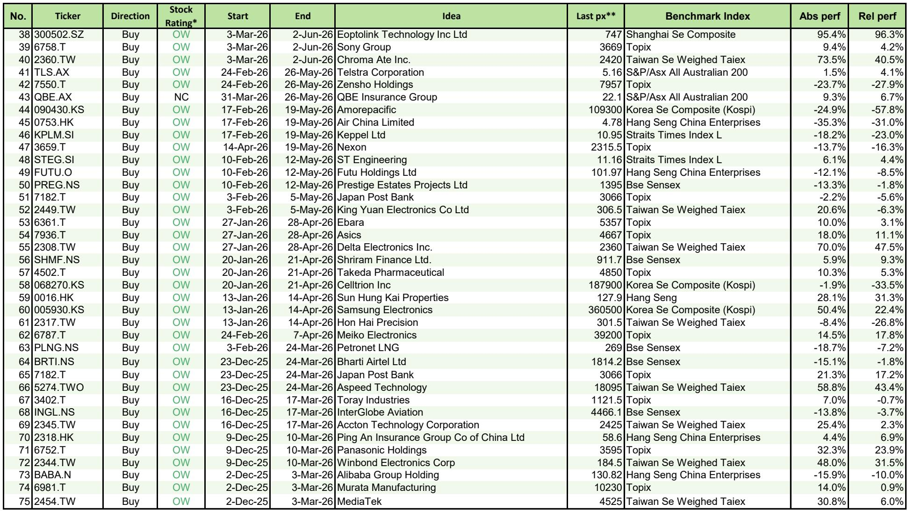
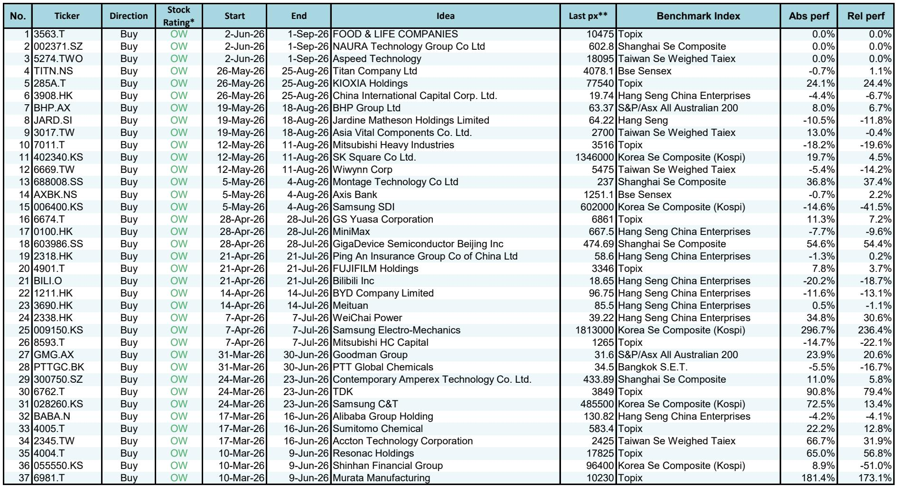
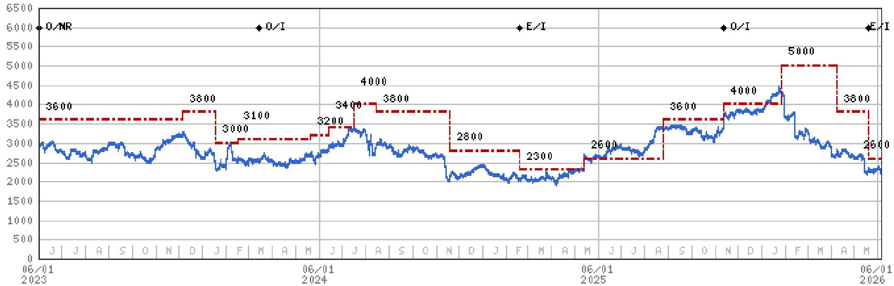

# 摩根斯坦利：亚洲市场真正的超额收益来自结构性的“非共识定价”

当多数投资者仍在为宏观数据的短期波动焦虑时，一份来自摩根斯坦利的最新研报揭示了一个更值得关注的事实：在过去一年里，其“三个可操作想法”组合累计获得了超过9,300个基点的相对超额收益，平均12个月总回报率达到16.0%，相对基准的超额回报为10.6%。这些数字并非来自某个单一主题的押注，而是来自对亚洲市场三类结构性力量的持续识别。

这份报告的核心判断是：当前亚洲市场的超额收益机会，正从依赖宏观贝塔转向寻找微观层面的“非共识定价”。无论是日本光通信与水冷模块的爆发、澳大利亚住房信贷周期的拐点，还是印度能源安全政策的重塑，这些机会的共同特征在于——市场共识尚未充分定价供给端的结构性变化。

以下是我们从这份研报中提炼的三个关键洞察，以及它们对投资者观察框架的启示。

## 1. 古河电工的利润新高路径揭示了一个被低估的产业逻辑：光通信与水冷模块的“双轮驱动”正在改写日本电子材料公司的盈利天花板

摩根斯坦利对古河电工（5801.T）给出“超配”评级，并将其目标价上调至66,000日元。支撑这一判断的核心逻辑并非公司现有的光纤业务复苏，而是两个正在加速的结构性变量：光通信产品的需求升级，以及水冷模块在数据中心散热领域的渗透加速。

报告明确指出，古河电工有望实现“新的创纪录利润且增长强劲”。这意味着，市场此前对这家公司的估值框架仍停留在传统光纤周期上，而忽略了其在AI算力基础设施配套中的新角色。水冷模块作为高功率数据中心散热的关键组件，其需求增速正在显著超越传统风冷方案。如果这一趋势持续，古河电工的盈利中枢将上移至历史高位之上。

这一判断的隐含含义更为重要：在亚洲电子材料领域，那些能够同时受益于“光通信升级”与“散热技术迭代”两个结构性趋势的公司，其盈利弹性和估值体系可能正在被系统性低估。投资者需要重新审视日本电子材料板块的定价模型，不能再用过去的周期框架来判断未来的利润高点。

## 2. 西太平洋银行的下调揭示了澳大利亚住房信贷市场的“空气口袋”：市场的乐观预期与信贷基本面的实际走弱之间存在显著裂口

摩根斯坦利对西太平洋银行（WBC.AX）给出“低配”评级，并下调了盈利预测和目标价。研报将这一调整的背景概括为“澳大利亚住房和抵押贷款市场前景的转变”，并维持对该行业的“谨慎”看法。

报告使用了“Air Pocket”一词来描述当前市场的状态。这是一个非常精准的比喻——航空领域的“空气口袋”意味着飞行器在看似平稳的航道上突然遭遇失速。映射到信贷市场，这意味着尽管澳大利亚经济数据尚未全面恶化，但住房信贷的微观信号已经出现了明显的减速迹象。银行板块的估值可能尚未充分反映这一信贷周期的拐点。

这一判断对投资者的启示是：在利率环境看似趋于稳定的背景下，市场容易忽视信贷需求端的内生性放缓。澳大利亚银行股的估值能否维持，取决于市场是否愿意重新定价其资产质量的潜在风险。而摩根斯坦利的选择表明，该机构认为当前的价格并未完全反映这一风险。

## 3. 印度斯坦石油的“超配”评级背后是能源安全逻辑的范式转换：政策制定者正在以超出市场共识的方式行动，印度燃料零售商成为能源供应改善的最大杠杆

摩根斯坦利将印度斯坦石油（HPCL.NS）列为印度燃料零售商中的首选标的，核心判断是“能源安全至关重要，政策制定者正在以令市场共识意外的方向行动”。报告进一步指出，印度燃料零售商是“能源供应改善超出石油冲击”背景下最具杠杆效应的标的。

这一判断的关键在于，市场此前对印度能源板块的定价主要基于“石油冲击”的负面情景，即油价上涨会压缩零售利润。但摩根斯坦利认为，政策制定者正在主动重塑能源供应的格局，其行动力度和方向超出了市场预期。如果印度能够通过政策手段改善能源供应的稳定性和成本结构，那么燃料零售商将从中获得超出预期的利润弹性。

这里的核心洞察是：市场对印度能源板块的共识可能过于悲观。投资者需要从“被动承受油价风险”的框架转向“主动受益于能源安全政策红利”的框架。印度斯坦石油的估值可能正在反映这一尚未被广泛定价的范式转换。

## 4. 报告尚未完全回答的关键问题：超额收益的可持续性取决于“非共识定价”能否转化为“共识修正”

尽管这份研报提供了清晰的三个方向性判断，但有一个关键问题尚未被充分回答：这些“非共识定价”的可持续性如何？摩根斯坦利的“三个可操作想法”组合在过去一年取得了显著的超额收益，但历史数据显示其命中率约为54%。这意味着，接近一半的投资想法并未实现正回报。

这引出了一个更深层的追问：当前这三个判断（古河电工的利润新高、西太平洋银行的信贷风险、印度斯坦石油的政策红利）中，哪些最有可能从“非共识”演变为“共识”，从而驱动股价的持续重估？哪些可能因为关键假设的失效而无法兑现？

例如，古河电工的水冷模块需求能否持续超预期，取决于AI数据中心的资本开支节奏是否维持高位。西太平洋银行的信贷风险是否被低估，取决于澳大利亚就业市场的韧性是否超预期。印度斯坦石油的政策红利能否兑现，取决于印度政府能源改革的执行力度。这些变量在研报中有所提及，但并未展开其二阶影响。

对于希望深入理解这些风险的读者，我们建议进一步研读摩根斯坦利关于这三家公司的完整报告，特别是其中的情景分析和关键假设敏感性测试。这些内容在本文中无法完全展开，但它们是判断投资逻辑可靠性的核心依据。

## 5. 给投资者的观察框架：三个维度判断“非共识定价”是否值得跟进

基于这份研报的启示，我们建议投资者从以下三个维度建立自己的观察框架，以判断类似“非共识定价”机会的可靠性：

第一，供给端变化的不可逆性。古河电工的机会之所以值得关注，是因为光通信升级和水冷模块渗透这两个趋势并非短期波动，而是由AI算力基础设施投资驱动的结构性变化。投资者需要问：这个变化的驱动力是周期性的还是结构性的？如果是结构性的，其持续时间和强度如何？

第二，市场共识的集中度。西太平洋银行的机会之所以存在，是因为市场对澳大利亚银行板块的共识可能过于乐观。投资者需要评估：当前市场对某个行业或公司的共识是什么？这个共识存在哪些潜在的脆弱点？共识是否已经充分反映了负面因素？

第三，政策变量的可预测性。印度斯坦石油的机会高度依赖于政策制定者的行动。投资者需要判断：政策的变化方向是否清晰？政策执行的路径是否存在重大不确定性？政策红利是否已经被部分定价？

这三个维度并非孤立存在，而是相互关联的。一个理想的“非共识定价”机会，往往同时满足供给端变化不可逆、市场共识过于集中、政策变量相对可预测这三个条件。

这份摩根斯坦利的研报为我们提供了一个很好的分析样本。它没有试图覆盖所有亚洲市场，而是聚焦于三个被市场定价不够充分的结构性机会。对于希望进一步探讨这些判断背后的详细数据、情景分析以及关键假设的读者，我们欢迎来到星球微信群里继续讨论。在那里，我们可以更深入地拆解这三家公司的估值模型、竞争格局以及潜在的风险因素，帮助您建立自己的投资决策框架。

Personal reading notes and learning share only. Not investment advice.

